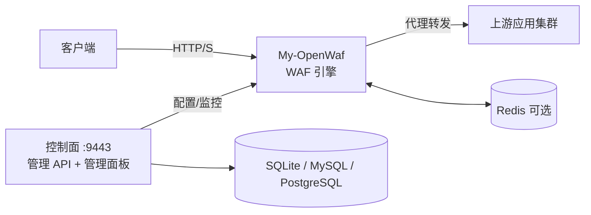
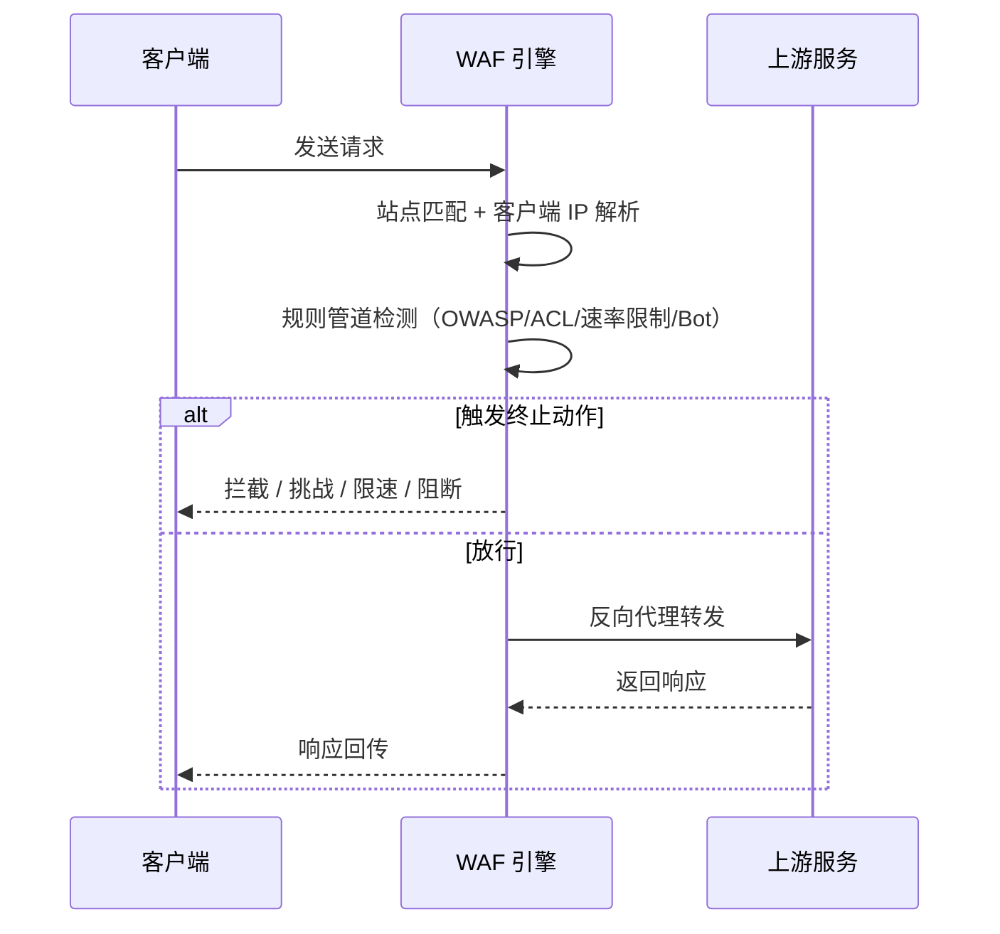
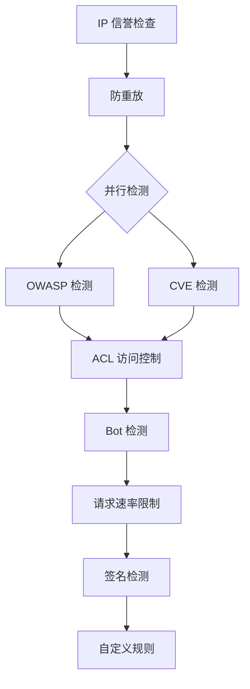

# My-OpenWaf

> 自托管的高性能 Web 应用防火墙（WAF）/ 反向代理，保护你的 Web 应用免受攻击与漏洞利用。

**My-OpenWaf 是什么？**  
一款部署在 Web 应用前方的反向代理型 WAF，统一完成攻击检测、访问控制、速率限制、人机验证与观测审计。

| 维度 | 说明 |
| --- | --- |
| 部署形态 | 自托管、反向代理 |
| 双平面 | 控制面（管理 API + 管理面板）/ 数据面（流量处理） |
| 默认管理端口 | `:9443` |
| 默认存储 | SQLite（可切换 MySQL / PostgreSQL） |

## 目录
- [亮点速览](#亮点速览)
- [架构速览](#架构速览)
- [请求处理流程](#请求处理流程)
- [核心能力](#核心能力)
- [策略动作体系](#策略动作体系)
- [效果评估](#效果评估)
- [快速开始](#快速开始)
- [配置说明](#配置说明)
- [项目结构](#项目结构)
- [技术栈](#技术栈)
- [文档导航](#文档导航)
- [开发与测试](#开发与测试)
- [贡献与许可证](#贡献与许可证)

## 亮点速览
- ✅ 覆盖 OWASP Top 10 关键攻击面  
- ✅ ACL + 速率限制 + Bot 防护一体化  
- ✅ 多站点、TLS、WebSocket、SSE 全支持  
- ✅ 规则管道可扩展、策略动作可配置  
- ✅ 管理 API + 管理面板一体化

> **提示**：My-OpenWaf 以“可控、可观测、可扩展”为设计原则，适合中小规模与企业场景的自托管安全防护。

## 架构速览


## 请求处理流程


<details>
<summary>查看规则管道阶段顺序</summary>


</details>

- **请求体检查上限**：默认仅检查前 `48 KiB`，以保证性能与延迟。

## 核心能力
### 🛡️ 攻击防御
- SQL 注入、XSS、命令注入、路径遍历、XXE、SSRF、LDAP/XPath 注入等
- OWASP 规则引擎 + CVE 漏洞规则库

### 🔒 访问控制
- IP 黑/白名单
- 地理位置阻断（GeoIP）
- 自定义 ACL 规则

### ⚡ 速率限制（CC 防护）
- 固定窗口与滑动窗口
- 支持 IP / 路径 / 自定义维度

### 🤖 Bot 防护
- 验证码挑战
- 5s 盾（WASM 动态验证）
- 多步骤组合策略

### 🌐 反向代理能力
- 多上游负载均衡
- TLS 终止与证书管理
- WebSocket / SSE 透传

### 📊 可观测性
- 安全事件与访问日志
- 统计指标与健康检查
- 管理面板可视化

## 策略动作体系
| 动作 | 是否终止 | 默认状态码 | 说明 |
| --- | --- | --- | --- |
| `drop` | ✅ | — | 直接 TCP 断开 |
| `intercept` | ✅ | `403` | 拦截并返回阻断页 |
| `rate_limit` | ✅ | `429` | 触发限速响应 |
| `challenge` | ✅ | `422` | JS 挑战 |
| `captcha_challenge` | ✅ | `422` | 验证码挑战 |
| `shield_challenge` | ✅ | `422` | 5s 盾挑战 |
| `chain_challenge` | ✅ | `422` | 链式挑战 |
| `redirect` | ✅ | `302` | 重定向 |
| `observe` | ❌ | — | 仅记录日志 |
| `tag` | ❌ | — | 标签标记 |

> **优先级说明**：`drop` > `intercept` > `rate_limit` > `challenge` > `redirect` > `observe`

## 效果评估
使用 [blazehttp](https://github.com/chaitin/blazehttp) 基准测试工具进行评估：

**测试环境**
- 目标地址：`http://127.0.0.1`
- 测试样本：33,877（恶意样本 658 + 正常样本 33,219）

**测试结果**
| 指标 | 数值 |
| --- | --- |
| 检出率（Detection Rate） | **100.00%**（658 / 658） |
| 误报率（False Positive Rate） | **0.00%**（0 / 33,219） |
| 准确率（Accuracy） | **100.00%** |
| 平均响应耗时 | **31.96 ms** |

> 注：对比数据来源 [SafeLine Effect Evaluation](https://github.com/chaitin/SafeLine#effect-evaluation)

## 快速开始
### 📦 Docker 部署（推荐）
```bash
docker run -d \
  --name my-openwaf \
  --restart always \
  -p 9443:9443 \
  -v ./data:/app/data \
  my-openwaf:latest
```
启动后访问 `https://localhost:9443` 进入管理面板。

### 🔨 从源码构建
**前置要求**：Go 1.25+、Bun、GCC

```bash
# 1. 构建前端
cd frontend && bun install --frozen-lockfile && bun run build

# 2. 构建后端（前端产物自动嵌入）
cd .. && CGO_ENABLED=1 go build -ldflags="-s -w" -o bin/my-openwaf ./cmd/...

# 3. 运行
./bin/my-openwaf
```

### 🐳 Docker 多阶段构建
```bash
docker build -t my-openwaf:latest .
```

### ✅ 部署核对清单
- [ ] 管理面板能正常访问（`:9443`）
- [ ] 已添加站点并绑定域名
- [ ] 已配置上游并通过健康检查
- [ ] 已启用 OWASP/ACL/速率限制/Bot 防护
- [ ] 已查看安全事件/访问日志是否产出

## 配置说明
### 基本环境变量
| 环境变量 | 默认值 | 说明 |
| --- | --- | --- |
| `MY_OPENWAF_DB_DRIVER` | `sqlite` | 数据库驱动（`sqlite`/`mysql`/`postgres`） |
| `MY_OPENWAF_DSN` | `/app/data/waf.db` | 数据库连接串（优先级高于 `MY_OPENWAF_DB`） |
| `MY_OPENWAF_DATA` | `/app/data` | 数据目录 |
| `MY_OPENWAF_ADMIN_BIND` | `:9443` | 管理 API 监听地址 |

<details>
<summary>更多可选配置</summary>

| 环境变量 | 默认值 | 说明 |
| --- | --- | --- |
| `MY_OPENWAF_ADMIN_STATIC_DIR` | 内嵌前端 | 使用磁盘前端资源 |
| `MY_OPENWAF_DB` | 空 | 兼容旧配置（被 `MY_OPENWAF_DSN` 覆盖） |
| `MY_OPENWAF_REDIS_ADDR` | 空 | Redis 地址（可选） |
| `MY_OPENWAF_REDIS_PASSWORD` | 空 | Redis 密码 |
| `MY_OPENWAF_REDIS_DB` | `0` | Redis DB |
| `MY_OPENWAF_JWT_SECRET` | 自动生成 | JWT 签名密钥 |
| `MY_OPENWAF_GEOIP_DB` | 空 | GeoIP 数据库路径 |
| `MY_OPENWAF_BOT_THRESHOLD` | `80` | Bot 分数阈值 |
| `MY_OPENWAF_DROP_ENABLED` | `true` | 是否启用 TCP Drop |
| `MY_OPENWAF_DROP_BOT_THRESHOLD` | `80` | Drop 相关 Bot 阈值 |
| `MY_OPENWAF_LOG_LEVEL` | `info` | 日志级别 |
| `MY_OPENWAF_LOG_COLOR` | `auto` | 日志颜色 |
</details>

## 项目结构
```text
cmd/                入口程序
frontend/           管理面板（Next.js + React）
internal/           核心实现（WAF/控制面/数据面）
docs/               项目文档
scripts/            构建脚本
```

## 技术栈
| 层级 | 技术 |
| --- | --- |
| 后端语言 | Go 1.25 |
| Web 框架 | [Hertz](https://github.com/cloudwego/hertz) v0.10.4 |
| 前端 | Next.js + React（Node.js 22） |
| 数据库 | SQLite / MySQL / PostgreSQL（GORM） |
| 本地缓存 | [Ristretto](https://github.com/dgraph-io/ristretto) |
| 分布式缓存 | [go-redis](https://github.com/redis/go-redis) |
| 认证 | JWT（[golang-jwt](https://github.com/golang-jwt/jwt)） |
| GeoIP | [maxminddb-golang](https://github.com/oschwald/maxminddb-golang) |
| 人机验证 | 动态 WASM + VMP |

## 文档导航
- 项目概述：[docs/项目概述/项目介绍.md](docs/项目概述/项目介绍.md)
- 快速开始：[docs/项目概述/快速开始.md](docs/项目概述/快速开始.md)
- 控制面设计：[docs/系统架构设计/控制面设计.md](docs/系统架构设计/控制面设计.md)
- 数据面处理：[docs/数据平面处理/请求处理流程.md](docs/数据平面处理/请求处理流程.md)
- WAF 引擎系统：[docs/WAF 引擎系统/WAF 引擎系统.md](docs/WAF%20引擎系统/WAF%20引擎系统.md)
- 规则管理 API：[docs/管理 API 系统/规则管理 API/规则管理 API.md](docs/管理%20API%20系统/规则管理%20API/规则管理%20API.md)

## 开发与测试
```bash
# 全量构建（含前端）
./scripts/build.sh

# Windows
./scripts/build.ps1

# Go 测试
go test -v ./...

# 前端
cd frontend
npm run dev
npm run lint
npm run typecheck
```

<details>
<summary>检测引擎改动后的强制验收</summary>

1. 启动服务：`./bin/my-openwaf`（确保数据面监听在 `:80`）
2. 执行压测：`./blazehttp.exe -t http://127.0.0.1:80 -c 40`
3. 检查无异常崩溃、无明显性能下降、无非预期 block/pass

</details>

## 贡献与许可证
- 欢迎提交 Issue / PR，建议附上复现步骤与日志
- 请遵循项目现有代码风格与目录结构

本项目基于 [Apache License 2.0](LICENSE) 开源许可证发布。
