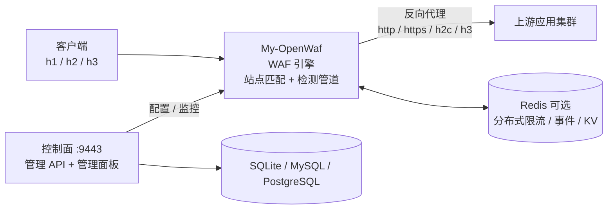
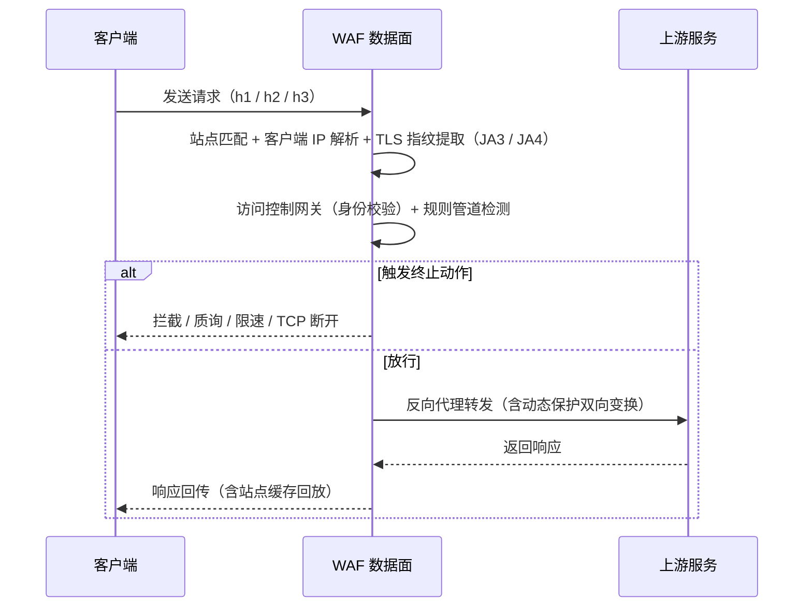
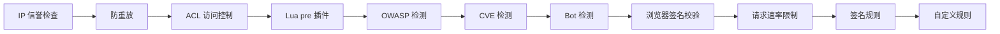

# My-OpenWaf

> 自托管的高性能 Web 应用防火墙（WAF）/ 反向代理，一次部署即可为你的 Web 应用提供攻击检测、访问控制、速率限制、人机验证与全链路观测。


**My-OpenWaf 是什么？**  
一款部署在 Web 应用前方的反向代理型 WAF。数据面以原生代码实现检测管道，覆盖 OWASP Top 10 攻击面；控制面提供管理 API 与内嵌管理面板，配置变更热生效，无需重启。

| 维度 | 说明 |
| --- | --- |
| 部署形态 | 自托管、反向代理，单二进制交付 |
| 双平面 | 控制面（管理 API + 管理面板）/ 数据面（流量处理） |
| 协议面 | 入站 HTTP/1.1、HTTP/2、HTTP/3（QUIC）；WebSocket、SSE、gRPC（h2/h3）、gRPC-Web |
| 默认管理端口 | `:9443`（HTTPS） |
| 默认存储 | SQLite（可切换 MySQL / PostgreSQL） |
| 插件引擎 | Lua 策略插件（沙箱）+ QuickJS 脚本 + WASM PoW 质询 |

## 目录
- [架构速览](#架构速览)
- [请求处理流程](#请求处理流程)
- [核心能力](#核心能力)
- [策略动作体系](#策略动作体系)
- [传输协议支持矩阵](#传输协议支持矩阵)
- [效果评估](#效果评估)
- [快速开始](#快速开始)
- [配置说明](#配置说明)
- [项目结构](#项目结构)
- [技术栈](#技术栈)
- [文档导航](#文档导航)
- [开发与测试](#开发与测试)
- [贡献与许可证](#贡献与许可证)

## 架构速览


```mermaid
flowchart LR
  Client[客户端<br/>h1 / h2 / h3] --> WAF[My-OpenWaf<br/>WAF 引擎<br/>站点匹配 + 检测管道]
  WAF -->|反向代理<br/>http / https / h2c / h3| Upstream[上游应用集群]

  Admin[控制面 :9443<br/>管理 API + 管理面板] -->|配置 / 监控| WAF
  Admin --> DB[(SQLite / MySQL / PostgreSQL)]
  WAF <--> Redis[(Redis 可选<br/>分布式限流 / 事件 / KV)]
```

控制面与数据面解耦：站点、规则、证书等配置经 `snapshot` 编译为不可变运行态并通过 `atomic.Pointer` 热替换，监听器按 bind 热协调（含 HTTP/3），配置变更无需重启进程。

## 请求处理流程


```mermaid
sequenceDiagram
  participant C as 客户端
  participant W as WAF 数据面
  participant U as 上游服务

  C->>W: 发送请求（h1 / h2 / h3）
  W->>W: 站点匹配 + 客户端 IP 解析 + TLS 指纹提取（JA3 / JA4）
  W->>W: 访问控制网关（身份校验）+ 规则管道检测
  alt 触发终止动作
    W-->>C: 拦截 / 质询 / 限速 / TCP 断开
  else 放行
    W->>U: 反向代理转发（含动态保护双向变换）
    U-->>W: 返回响应
    W-->>C: 响应回传（含站点缓存回放）
  end
```

<details>
<summary>查看规则管道阶段顺序</summary>


```mermaid
flowchart LR
  IP[IP 信誉检查] --> AR[防重放]
  AR --> ACL[ACL 访问控制]
  ACL --> LuaPre[Lua pre 插件]
  LuaPre --> OWASP[OWASP 检测]
  OWASP --> CVE[CVE 检测]
  CVE --> Bot[Bot 检测]
  Bot --> Sign[浏览器签名校验]
  Sign --> Rate[请求速率限制]
  Rate --> Sig[签名规则]
  Sig --> Custom[自定义规则]
```

说明：IP 信誉与防重放仅在其管理器启用/站点开启时参与；Lua pre 阶段仅当存在启用的 pre 脚本时挂载；`observe`/`tag` 命中仅落日志、不阻断转发；IP 白名单与 ACL `allow` 会短路后续阶段。
</details>

- **请求体检查上限**：默认仅检查前 `48 KiB`，保证性能与延迟。
- **响应面**：上游响应可经站点缓存（RFC 9111，含 `Age` 头与 stale-if-error 回退）与动态保护处理器（HTML/JS 混淆、图片水印）后再回传。

## 核心能力

### 🛡️ 攻击防御
- SQL 注入、XSS、命令注入、路径遍历、XXE、SSRF、LDAP/XPath 注入、模板注入（SSTI）、JNDI/Log4Shell 等（`internal/waf/owasp`）
- OWASP 规则引擎：内置 355 条规则，支持灵敏度分级与目标长度截断；请求体支持 form / JSON / multipart 解析（`internal/waf/owasp/owasp.go`、`owasp_extended.go`）
- CVE 漏洞检测引擎：NVD 订阅同步、自动生成与审批 CVE 规则（`internal/waf/cve`、`internal/admin/detect`）
- 威胁情报：定时拉取外部 IP-CIDR 情报源并同步内核（`internal/waf/threatintel`）
- 请求走私防线依赖 Hertz 协议栈对 CL+TE 的拒绝语义（`third_party/hertz-contrib-http2` 本地补丁包）

### 🔒 访问控制
- IP 黑/白名单与 IP 信誉系统（`internal/waf/iprep`）
- 地理位置阻断（GeoIP，可选 MaxMind 库，`internal/waf/bot`）
- 站点访问控制网关：密码与 OAuth 登录、按路径规则授权、会话管理，身份校验先于 WAF 管道（`internal/waf/accessgate`）
- 结构化 ACL 规则：`allow_ip` / `block_path` / 复合 AND-OR-NOT 嵌套（`internal/core/rules`）

### ⚡ 速率限制与 CC 防护
- 固定窗口与滑动窗口，按 IP / 路径 / 自定义维度计数，支持本地与 Redis 分布式后端（`internal/waf/ratelimit`）
- 防重放（nonce，`internal/waf/antireplay`）与步进式响应升级（escalation ladder，`internal/waf/escalation`）
- TCP drop 直断与独立丢弃统计（`internal/waf/drop`，可用 `MY_OPENWAF_DROP_ENABLED` 关闭）

### 🤖 Bot 防护与流量身份
- Bot 评分引擎：请求特征 + 浏览器指纹 + TLS 指纹（uTLS 解析 JA3/JA3Hash/JA4）+ GeoIP 归因（`internal/waf/bot`）
- 指纹全链路落库：`access_log`、`security_event` 与指纹汇总三方一致，h1/h2/h3 均采集（`internal/store/events.go`）
- visitor 融合分类（`internal/visitorfusion`）：同源流量聚合画像
- 质询体系：图片/滑块/旋转/拖拽验证码、5 秒盾（验证码 + PoW + 环境指纹，Rust 编译 WASM 加速）、链式多步质询（`internal/waf/challenge`）

### 🌐 代理与传输
- 多上游轮询负载均衡与健康检查（`internal/upstream`）；上游 scheme 支持 `http://`、`https://`、`h2c://`、`h3://` 及 RPC 别名 `tls://`、`grpcs://`、`grpc+tls://`、`grpc+https://`（→ `https`）与 `grpc://`（→ `h2c`）
- HTTP/3 入站监听（QUIC + Alt-Svc，`internal/app/http3.go`）与 h3 上游传输（`internal/proxy/proxy.go`）
- WebSocket raw TCP 隧道；SSE 流式透传（`internal/proxy`）
- gRPC over h2 四种流形态（unary / server-stream / client-stream / bidi）与 gRPC-Web（Envoy 形态）透传，响应无缝压缩且不进共享缓存（`internal/proxy/proxy.go`）
- TLS 终止、自签证书缓存与 ACME 证书自动签发/续期（`internal/acme`、`internal/snapshot/tls.go`）
- 站点响应缓存（RFC 9111 `Age` 头、stale-if-error）与动态保护（HTML/JS AES-256-GCM 混淆、图片水印，`internal/waf/dynamic`）

### 🔌 插件与可扩展
- **Lua 策略插件**：`pre`（管道阶段，可短路）与 `post`（仅对非终态生效/`allow` 可放行终态块）两级语义，拥有 `ctx.kv`（RedisKV，无 Redis 自动降级）、50ms 默认超时、256KiB 源码上限；`POST /api/v1/lua-plugins/validate` 与 `/dry-run`（`internal/waf/luaplugin`）
- **QuickJS 脚本引擎**（`internal/waf/jsplugin`）：原生 CGO 后端，构建 tag `quickjs`
- **WASM PoW**：质询计算由 Rust crate `wasm-pow-solver` 编译的 WASM 加速（`internal/waf/challenge/powdata`）

### 📊 可观测性
- 安全事件、访问日志、drop 事件、bot 评分的统一异步写库（`UnifiedWriter`，单 goroutine 刷新消除 SQLite 锁竞争，`internal/observability`）
- 日志库独立 SQLite 文件与专属 PRAGMA，主库/日志库互不争锁（`internal/core/database`）
- 分析面板聚合查询与 5s 查询缓存；访问日志采样开关 `MY_OPENWAF_ACCESSLOG_SAMPLING`（默认 1 = 全量）
- 实时 WebSocket 推送（访问日志/安全事件/指纹汇总）、Prometheus 指标 `/metrics`、健康端点 `/healthz` `/readyz` `/status`
- 审计日志对 `Authorization`、`Cookie`、API key 等敏感值做脱敏

## 策略动作体系

| 动作 | 是否终止 | 默认状态码 | 说明 |
| --- | --- | --- | --- |
| `drop` | ✅ | — | 直接 TCP 断开（不返回任何字节） |
| `intercept` | ✅ | `403` | 拦截并返回阻断页 |
| `rate_limit` | ✅ | `429` | 触发限速响应 |
| `challenge` | ✅ | `422` | JS 质询（Cookie 校验通过后放行） |
| `captcha_challenge` | ✅ | `422` | 验证码质询（图片点选/滑块/旋转/拖拽） |
| `shield_challenge` | ✅ | `422` | 5 秒盾质询（验证码 + PoW + 环境指纹，可选 WASM 加速） |
| `chain_challenge` | ✅ | `422` | 链式多步质询（状态机逐步升级） |
| `redirect` | ✅ | `302` | 重定向 |
| `observe` | ❌ | — | 仅记录日志，不影响转发 |
| `tag` | ❌ | — | 打标签标记（供日志/统计使用） |

> **终止优先级**：`drop(90)` > `intercept(80)` > `rate_limit(70)` > 质询类(60) > `redirect(50)` > `observe(10)`。并发命中多个终止动作时按该优先级收敛。

**质询分层说明**：三类质询构成由轻到重的验证阶梯——`captcha_challenge` 面向低风险流量的人机识别；`shield_challenge` 叠加 PoW 与环境指纹，提高批量脚本成本；`chain_challenge` 用状态机串联多步校验。结合 `internal/waf/escalation` 的升级阶梯，可按连续命中次数自动步进到更重的质询或 drop。

## 传输协议支持矩阵

**入站监听（数据面）**

| 协议 | 形态 | 实现位置 |
| --- | --- | --- |
| HTTP/1.1 | keep-alive、TLS/ALPN 指纹 | `internal/dataplane` |
| HTTP/2 | h2、RFC 9113，本地补丁 hertz-contrib/http2 | `third_party/hertz-contrib-http2` |
| HTTP/3 | QUIC、Alt-Svc 通告、0-RTT/会话复用 | `internal/app/http3.go` |

**上游连接（`internal/proxy` / `internal/upstream`）**

| scheme | 说明 |
| --- | --- |
| `http://` | 明文 HTTP/1.1，可经 ALPN/协议协商升级 h2 |
| `https://` | TLS + ALPN（h2 优先） |
| `h2c://` | 明文 HTTP/2（prior knowledge） |
| `h3://` | QUIC/HTTP/3 上游 |

**RPC 别名前缀**（与传输 scheme 等义，`internal/pkg/schemealias` 归一）：`tls://`、`grpcs://`、`grpc+tls://`、`grpc+https://` → `https`；`grpc://` → `h2c`。

**应用协议透传**

| 协议 | 说明 |
| --- | --- |
| gRPC over h2 | unary / server-stream / client-stream / bidi 四形态，grpc-status 等 trailer 原样透传 |
| gRPC over h3 | 帧一致、trailer 送达 |
| gRPC-Web | Envoy 形态（消息帧 + trailer 帧），兼容 `application/grpc-web*` 不压缩、不进缓存 |
| WebSocket | raw TCP 隧道（`ForwardWebSocket`） |
| SSE | 流式 flush 透传 |

## 效果评估

使用 [blazehttp](https://github.com/chaitin/blazehttp) 基准测试工具进行评估（2026-09-19 复测，隔离实例）：

**测试环境**
- 目标地址：`http://127.0.0.1`（数据面，站点开启 OWASP + CVE 检测）
- 测试样本：33,877（恶意样本 658 + 正常样本 33,219）

**结果**

| 指标 | 数值 |
| --- | --- |
| 检出率（Detection Rate） | **100.00%**（658 / 658） |
| 误报率（False Positive Rate） | **0.00%**（0 / 33,219） |
| 准确率（Accuracy） | **100.00%** |
| 失败/错误样本 | **0** |

**本机 loader 压测口径（2026-09-19，隔离站点 + 本地回声上游，50 并发）**

| 场景 | 吞吐 |
| --- | --- |
| 纯代理基线 | 1,962 rps（40s，80,521 请求） |
| OWASP + CVE 开启 | 2,048 rps（union select 探测正确 403） |
| 日志库独立 PRAGMA 后的实验档 | 2,176 rps |

> 注：上表为独立实验档数据，其中「日志库独立 PRAGMA」当时为实验部署，现为主干默认行为；相应组合在默认配置下的最新单独复测数字以仓库强制验收（见下文）为准。

**建议补充的性能观测维度（待采集，本表不预设数字）**

- 并发-吞吐曲线（10/50/100/200 并发档）
- 时延分位（p50 / p95 / p99）
- 资源占用（CPU / 内存 RSS / GC 指标）
- 与雷池等对照对象的样本集横向对比

## 快速开始

### 📦 Docker 部署（推荐）

```bash
docker run -d \
  --name my-openwaf \
  --restart always \
  -p 9443:9443 \
  -v ./data:/app/data \
  my-openwaf:latest
```

启动后访问 `https://localhost:9443` 进入管理面板（首次启动会打印初始管理凭据与 API Token，请妥善保存）。

### 🔨 从源码构建

**前置要求**：Go 1.25.5+、Bun 1.3.14+、GCC（QuickJS CGO 后端）、Rust 工具链可选（仅重建 WASM PoW 时需要）

```bash
# 一键构建：前端导出 -> 管理面板嵌入 -> WASM make optimize -> Go 二进制
./scripts/build.sh                 # 输出 bin/my-openwaf
# Windows
./scripts/build.ps1

# 或手动：构建前端
cd frontend && bun install --frozen-lockfile && bun run build
# 构建后端（前端产物自动嵌入）
cd .. && CGO_ENABLED=1 go build -tags=quickjs -ldflags="-s -w" -o bin/my-openwaf ./cmd/...

# 运行
./bin/my-openwaf
```

> 后端可单独构建，前提是 `internal/core/adminweb/dist` 已包含构建好的前端产物。本机开发时可将磁盘前端设为 `MY_OPENWAF_ADMIN_STATIC_DIR=./frontend/out`。

### ✅ 部署核对清单
- [ ] 管理面板能正常访问（`:9443`）
- [ ] 已添加站点并绑定域名/监听地址
- [ ] 已配置上游并健康检查通过
- [ ] 已按需启用 OWASP / ACL / 限速 / Bot 防护
- [ ] 已放行若干请求，确认安全事件 / 访问日志产出

## 配置说明

### 基本环境变量

| 环境变量 | 默认值 | 说明 |
| --- | --- | --- |
| `MY_OPENWAF_DB_DRIVER` | `sqlite` | 数据库驱动（`sqlite`/`mysql`/`postgres`） |
| `MY_OPENWAF_DSN` | `./data/waf.db`（Docker 为 `/app/data/waf.db`） | 主库连接串；MySQL DSN 必须含 `parseTime=True`，PostgreSQL 走 PgBouncer 事务池时加 `pgbouncer=true` |
| `MY_OPENWAF_LOG_DSN` | `./data/waf_logs.db` | 独立日志库（访问/安全/drop/bot 日志） |
| `MY_OPENWAF_DATA` | `./data`（Docker 为 `/app/data`） | 数据目录 |
| `MY_OPENWAF_ADMIN_BIND` | `:9443` | 管理 API 监听地址 |
| `MY_OPENWAF_REDIS_ADDR` | 空 | 可选 Redis 地址（分布式限流 / 事件扇出 / KV） |
| `MY_OPENWAF_JWT_SECRET` | 自动生成并持久化 | JWT 签名密钥 |

<details>
<summary>更多可选配置</summary>

| 环境变量 | 默认值 | 说明 |
| --- | --- | --- |
| `MY_OPENWAF_ACCESSLOG_SAMPLING` | `1` | 访问日志采样：N≥1 生效，1 = 100% 全量 |
| `MY_OPENWAF_ADMIN_STATIC_DIR` | 内嵌前端 | 使用磁盘前端资源（开发调试） |
| `MY_OPENWAF_REDIS_PASSWORD` | 空 | Redis 密码 |
| `MY_OPENWAF_REDIS_DB` | `0` | Redis DB 编号 |
| `MY_OPENWAF_GEOIP_DB` | 空 | MaxMind 库路径（Bot GeoIP 评分） |
| `MY_OPENWAF_BOT_THRESHOLD` | `80` | Bot 分数阈值 |
| `MY_OPENWAF_DROP_ENABLED` | `true` | 是否启用 TCP drop |
| `MY_OPENWAF_DROP_BOT_THRESHOLD` | `80` | Drop 相关 Bot 阈值 |
| `MY_OPENWAF_LOG_LEVEL` | `info` | 日志级别（`debug`/`info`/`warn`/`error`） |
| `MY_OPENWAF_LOG_FILE` | 空 | 日志文件路径（默认仅 stdout） |
| `MY_OPENWAF_PPROF_BIND` | 空 | 可选 pprof 监听地址 |

完整清单（含 CVE 订阅、验证码目录、队列缓冲参数组 `MY_OPENWAF_QUEUE_*` 等）与校验语义见 [CLAUDE.md](./CLAUDE.md) 的环境变量表。
</details>

## 项目结构

```text
cmd/                     入口程序（含 reset-admin-password 子命令）
internal/
  app/                   HTTP/3 服务器、TLS 指纹策略、生命周期接线
  core/                  环境配置、DB/Redis 运行时、快照热重载、配置校验
  core/engine/           WAF 管道组装与编译缓存
  core/pipeline/         请求上下文池化与阶段执行
  core/rules/            规则 DSL 编译与阶段实现（ACL/签名/自定义/Lua pre）
  dataplane/             站点匹配、访问控制网关、代理/质询/阻断流程
  proxy/                 上游转发（HTTP/SSE/WS/gRPC/h3）、缓存回放、动态保护
  upstream/              上游池、健康检查、共享 transport
  snapshot/              不可变配置、TLS/HTTP3 默认值、原子替换
  admin/                 管理 API 路由/中间件/实时 WebSocket（按 domain 分包）
  waf/owasp/             OWASP 检测引擎（归一化/阈值/文件上传扩展）
  waf/cve/               CVE 检测引擎与 NVD 订阅同步
  waf/challenge/         验证码/5 秒盾/链式质询 + WASM PoW 运行时
  waf/bot/               Bot 评分、JA4/TLS 指纹、GeoIP
  waf/ratelimit/         本地与 Redis 限流后端
  waf/dynamic/           动态保护（HTML/JS 混淆 + 图片水印）
  waf/accessgate/        站点访问控制网关（密码/OAuth）
  waf/luaplugin/         Lua 策略插件沙箱运行时
  observability/         UnifiedWriter 单协程落库、指标、归档
frontend/                管理面板（Next.js 静态导出，嵌入二进制）
docs/                    项目文档
scripts/                 构建脚本（build.sh / build.ps1 / 压测诊断）
wasm-pow-solver/         PoW 质询求解器（Rust -> WASM）
third_party/             本地补丁依赖（hertz-contrib-http2）
```

## 技术栈

| 层级 | 技术 |
| --- | --- |
| 后端语言 | Go 1.25.5（`go.mod`） |
| Web 框架 | [Hertz](https://github.com/cloudwego/hertz) v0.10.6 |
| HTTP/3 | [quic-go](https://github.com/quic-go/quic-go) v0.61.0 |
| TLS 指纹 | [uTLS](https://github.com/refraction-networking/utls) v1.8.2 + [go-ja4](https://github.com/wu238121-a11y/go-ja4) v1.0.0 |
| 数据库 | SQLite（纯 Go `glebarez/sqlite` v1.11.0）/ MySQL / PostgreSQL（GORM v1.31.2） |
| 缓存 | [Ristretto](https://github.com/dgraph-io/ristretto) v0.2.0 / [go-redis](https://github.com/redis/go-redis) v9 |
| 认证 | JWT（golang-jwt v5.3.1）+ bcrypt |
| 插件 | [gopher-lua](https://github.com/yuin/gopher-lua) v1.1.2 + [quickjs-go](https://github.com/buke/quickjs-go) v0.7.7 |
| GeoIP | [maxminddb-golang](https://github.com/oschwald/maxminddb-golang) |
| 人机验证 | go-captcha v2；PoW 由 Rust（wasm-bindgen）编译 WASM 加速 |
| 前端 | Next.js 16.2.6 / React 19.2.4 / TypeScript 5 / Tailwind CSS 4 / shadcn/ui，Bun 1.3.14 构建 |

## 文档导航

- 项目概述：[docs/项目概述/项目介绍.md](docs/项目概述/项目介绍.md) · [快速开始](docs/项目概述/快速开始.md)
- 控制面设计：[docs/系统架构设计/控制面设计.md](docs/系统架构设计/控制面设计.md)
- 数据面处理：[docs/数据平面处理/请求处理流程.md](docs/数据平面处理/请求处理流程.md)
- WAF 引擎系统：[docs/WAF 引擎系统/WAF 引擎系统.md](docs/WAF%20引擎系统/WAF%20引擎系统.md)
- 规则管理 API：[docs/管理 API 系统/规则管理 API/规则管理 API.md](docs/管理%20API%20系统/规则管理%20API/规则管理%20API.md)
- 安全防护功能：[OWASP 检测](docs/安全防护功能/OWASP%20检测) · [CVE 漏洞检测](docs/安全防护功能/CVE%20漏洞检测) · [机器人检测](docs/安全防护功能/机器人检测.md) · [速率限制机制](docs/安全防护功能/速率限制机制)
- 扩展与插件：[Lua 策略插件](docs/扩展与插件系统/Lua%20策略插件.md)（含可运行示例 `docs/扩展与插件系统/lua-examples/`）
- 配置管理：[热重载系统](docs/配置管理系统/热重载系统.md) · [配置快照机制](docs/配置管理系统/配置快照机制.md)
- 监控与可观测：[监控与可观测性](docs/监控与可观测性/监控与可观测性.md) · [事件归档系统](docs/监控与可观测性/事件归档系统.md)

## 开发与测试

```bash
# 全量构建（含前端，见「快速开始」）
./scripts/build.sh
# Windows
./scripts/build.ps1

# Go：格式化 / 静态检查 / 全量测试（CI 口径：CGO + quickjs tag）
gofmt -l .
CGO_ENABLED=1 go vet -tags=quickjs ./...
CGO_ENABLED=1 go test -tags=quickjs -v -timeout=30m ./...
# 本地快速全量回归（2026-09-19 实测：57 个包全部通过）
go test -p 1 -count=1 -timeout=30m ./...

# 前端（frontend/）
bun run dev        # Next.js 开发服务器
bun run typecheck  # tsc --noEmit
bun run lint       # eslint
bun run format     # prettier
bun run build      # 静态导出到 frontend/out，并复制入 internal/core/adminweb/dist
bun run check:i18n # i18n 静态校验
# 契约检查脚本（package.json scripts 内 check:* 家族）：
bun run check:skip-path-contract        # 跳过路径/阶段契约
bun run check:site-cache-contract       # 站点缓存设置契约
bun run check:site-challenge-contract   # 站点质询设置契约
bun run check:site-protection-contract  # 站点保护设置契约
bun run check:api-route-contract        # 管理 API 路由契约

# 性能诊断（PowerShell）
./scripts/qps-diagnose.ps1 -TargetUrl http://127.0.0.1/ -MetricsUrl http://127.0.0.1:9443/metrics -Requests 1000 -Concurrency 40
```

CI 流水线（`.github/workflows/ci.yml`）：前端 typecheck/lint/build → Go 测试（gofmt、vet、30m 全量）→ 全量二进制构建；另有独立作业在真实 MySQL 8.0 / PostgreSQL 16 上做方言迁移验证。

<details>
<summary>检测引擎改动后的强制验收</summary>

检测引擎变更（`internal/waf/`、`internal/core/rules/`、`internal/core/engine/`、`internal/core/pipeline/`、`internal/dataplane/handler.go`）后必须执行：

1. 启动服务：`./bin/my-openwaf`，确保数据面监听 `:80`
2. 执行压测：`./blazehttp -t http://127.0.0.1:80 -c 40`
3. 检查无异常崩溃、无明显性能退化、无非预期 block/pass 结果

</details>

## 贡献与许可证

- 欢迎提交 Issue / PR，请附上复现步骤与日志
- 请遵循项目现有代码风格（`gofmt`/eslint）与目录结构
- 提交信息使用中文，代码标识符与日志保持英文

本项目基于 [Apache License 2.0](LICENSE) 开源许可证发布。