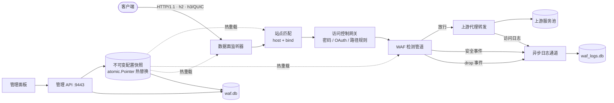
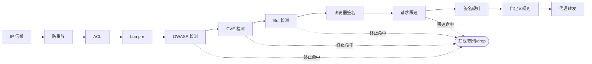
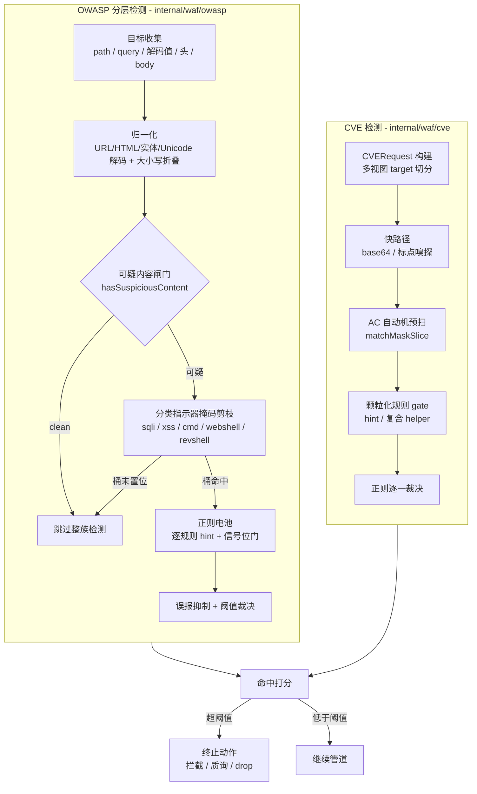

# My-OpenWaf

> 自托管的高性能 Web 应用防火墙（WAF）/ 反向代理，一次部署即可为你的 Web 应用提供攻击检测、访问控制、速率限制、人机验证与全链路观测。


**My-OpenWaf 是什么？**
一款部署在 Web 应用前方的反向代理型 WAF。数据面以原生代码实现检测管道，覆盖 OWASP Top 10 攻击面；控制面提供管理 API 与内嵌管理面板，配置变更热生效，无需重启。

| 维度 | 说明 |
| --- | --- |
| 部署形态 | 自托管、反向代理，单二进制交付 |
| 双平面 | 控制面（管理 API + 管理面板）/ 数据面（流量处理） |
| 协议面 | 入站 HTTP/1.1、HTTP/2、HTTP/3（QUIC）；WebSocket（含 RFC 8441）、SSE、gRPC（h2/h3）、gRPC-Web |
| 默认管理端口 | `:9443`（HTTPS） |
| 默认存储 | SQLite（可切换 MySQL / PostgreSQL） |
| 插件引擎 | Lua 策略插件（沙箱）+ QuickJS 脚本 + WASM PoW 质询 |

## 目录

- [系统架构总览](#系统架构总览)
- [核心特性](#核心特性)
- [检测引擎模块](#检测引擎模块)
- [传输与协议支持矩阵](#传输与协议支持矩阵)
- [策略动作体系](#策略动作体系)
- [效果评估](#效果评估)
- [快速开始](#快速开始)
- [配置说明](#配置说明)
- [项目结构](#项目结构)
- [技术栈](#技术栈)
- [文档导航](#文档导航)
- [开发与测试](#开发与测试)
- [贡献与许可证](#贡献与许可证)

## 系统架构总览


```mermaid
flowchart LR
    Client([客户端]) -->|HTTP/1.1 · h2 · h3/QUIC| Listener[数据面监听器]
    Listener --> Site[站点匹配<br/>host + bind]
    Site --> Gate[访问控制网关<br/>密码 / OAuth / 路径规则]
    Gate --> Pipe[WAF 检测管道]
    Pipe -->|放行| Proxy[上游代理转发]
    Proxy --> Up[(上游服务池)]

    AdminUI[管理面板] --> API[管理 API :9443]
    API --> Snapshot[(不可变配置快照<br/>atomic.Pointer 热替换)]
    Snapshot -.热重载.-> Site
    Snapshot -.热重载.-> Pipe
    Snapshot -.热重载.-> Listener

    Pipe -->|安全事件| LogQueue[异步日志通道]
    Proxy -->|访问日志| LogQueue
    Pipe -->|drop 事件| LogQueue
    LogQueue --> LogDB[(waf_logs.db)]
    Snapshot --> MainDB[(waf.db)]
    API --> MainDB
```

- **控制面**：管理 API + 内嵌面板，改动落库即触发快照重编译与原子替换，监听器按 bind 热协调，配置变更无需重启。
- **数据面**：请求按「监听 bind + Host」匹配站点，通过访问控制网关后进入检测管道；放行流量经代理层转发至上游池。
- **存储**：主库（配置/规则/证书）与日志库（访问/安全/drop/bot）分离，日志写入由单 goroutine `UnifiedWriter` 收敛，避免 SQLite 写锁竞争。

## 核心特性

控制面与数据面解耦：站点、规则、证书等配置经 `snapshot` 编译为不可变运行态并通过 `atomic.Pointer` 热替换，监听器按 bind 热协调（含 HTTP/3），配置变更无需重启进程。

检测管道按序装配，终止动作短路后续阶段：

<details>
<summary>规则管道阶段顺序</summary>


```mermaid
flowchart LR
    A[IP 信誉] --> B[防重放] --> C[ACL] --> D[Lua pre] --> E[OWASP 检测] --> F[CVE 检测] --> G[Bot 检测] --> H[浏览器签名] --> I[请求限速] --> J[签名规则] --> K[自定义规则] --> L[代理转发]

    E -.终止命中.-> X([拦截/质询/drop])
    F -.终止命中.-> X
    G -.终止命中.-> X
    I -.限速命中.-> X
```

说明：IP 信誉与防重放仅在其管理器启用/站点开启时参与；Lua pre 阶段仅当存在启用的 pre 脚本时挂载，`allow` 短路后续阶段；`observe`/`tag` 命中仅落日志、不阻断转发；IP 白名单与 ACL `allow` 会短路其后的阶段。

</details>

- **请求体检查上限**：默认仅检查前 `48 KiB`，保证性能与延迟。
- **响应面**：上游响应可经站点响应缓存（RFC 9111，含 `Age` 头与 stale-if-error 回退）与动态保护处理器（HTML/JS 混淆、图片水印）后再回传。

### 🛡️ 攻击防御

- SQL 注入、XSS、命令注入、路径遍历、XXE、SSRF、LDAP/XPath 注入、模板注入（SSTI）、JNDI/Log4Shell 等（`internal/waf/owasp`）
- OWASP 规则引擎：内置 355 条规则（`owasp_rule_catalogs` 复核），支持灵敏度分级与目标长度截断；请求体支持 form / JSON / multipart 解析（`internal/waf/owasp/owasp.go`、`owasp_extended.go`）
- CVE 漏洞检测引擎：NVD 订阅同步、自动生成与审批 CVE 规则（`internal/waf/cve`、`internal/admin/detect`）
- 威胁情报：定时拉取外部 IP-CIDR 情报源并同步内核（`internal/waf/threatintel`）
- 请求走私防线：协议层 CL+TE 拒绝语义 + 数据面原始字节嗅探（详见[传输与协议支持矩阵](#请求走私防线)）

## 检测引擎模块

检测引擎是数据面 CPU 热点的核心，由「OWASP 分层检测」与「CVE 检测」两套前端组成，全部包级正则预编译一次、快照构建期索引化，热路径尽量做到零分配。


```mermaid
flowchart TB
    subgraph OWASP[OWASP 分层检测 - internal/waf/owasp]
        direction TB
        S1[目标收集<br/>path / query / 解码值 / 头 / body] --> S2[归一化<br/>URL/HTML/实体/Unicode 解码 + 大小写折叠]
        S2 --> S3{可疑内容闸门<br/>hasSuspiciousContent}
        S3 -->|clean| S4[跳过整族检测]
        S3 -->|可疑| S5[分类指示器掩码剪枝<br/>sqli / xss / cmd / webshell / revshell]
        S5 -->|桶未置位| S4
        S5 -->|桶命中| S6[正则电池<br/>逐规则 hint + 信号位门]
        S6 --> S7[误报抑制 + 阈值裁决]
    end
    subgraph CVE[CVE 检测 - internal/waf/cve]
        direction TB
        C1[CVERequest 构建<br/>多视图 target 切分] --> C2[快路径<br/>base64 / 标点嗅探]
        C2 --> C3[AC 自动机预扫<br/>matchMaskSlice]
        C3 --> C4[颗粒化规则 gate<br/>hint / 复合 helper]
        C4 --> C5[正则逐一裁决]
    end
    OWASP --> Result[命中打分]
    CVE --> Result
    Result -->|超阈值| Verdict[终止动作<br/>拦截 / 质询 / drop]
    Result -->|低于阈值| Pass[继续管道]
```

**分层剪枝（性能关键）**：每族检测前先做「必备字节掩码」单遍扫描——输入串按字节查一次 `[256]uint32` 表收集位，字面量所在桶的必备字节未出现时整桶跳过，与旧逐条 `strings.Contains` 逐输入等价。已覆盖 `hasSQLiIndicator`、`hasXSSIndicator`、`hasCmdIndicator`、`hasWebshellIndicator`、`hasRevShellIndicator`、`hasSuspiciousKeywords` 及 `collectSQLiPatternSignals`（`internal/waf/owasp/owasp.go`/`owasp_extended.go`，锁测试 `mask_equiv_test.go`/`sqlisignals_equiv_test.go`/`cmdscan_equiv_test.go`）。

### 🔒 访问控制

- IP 黑/白名单与 IP 信誉系统（`internal/waf/iprep`）
- 地理位置阻断（GeoIP，可选 MaxMind 库，`internal/waf/bot`）
- 站点访问控制网关：密码与 OAuth 登录、按路径规则授权、会话管理，身份校验先于 WAF 管道（`internal/waf/accessgate`）
- 结构化 ACL 规则：`allow_ip` / `block_path` / 复合 AND-OR-NOT 嵌套（`internal/core/rules`）
- RBAC 三角色：`admin` / `operator` / `readonly`；配置视图 read 级可读、写操作 adminGroup；`/certificates/parse` 等无副作用接口 read 级可用

### ⚡ 速率限制与 CC 防护

- 固定窗口与滑动窗口，按 IP / 路径 / 自定义维度计数，支持本地与 Redis 分布式后端（`internal/waf/ratelimit`）
- 防重放（nonce，`internal/waf/antireplay`）与步进式响应升级（escalation ladder，`internal/waf/escalation`）
- TCP drop 直断与独立丢弃统计（`internal/waf/drop`，可用 `MY_OPENWAF_DROP_ENABLED` 关闭）

### 🤖 Bot 防护与流量身份

- Bot 评分引擎：请求特征 + 浏览器指纹 + TLS 指纹（uTLS 解析 JA3/JA3Hash/JA4）+ GeoIP 归因（`internal/waf/bot`）
- 指纹全链路落库：`access_log`、`security_event` 与指纹汇总三方一致，h1/h2/h3 均采集（`internal/store/events.go`）
- visitor 融合分类（`internal/visitorfusion`）：同源流量聚合画像
- 质询体系：图片/滑块/旋转/拖拽验证码、5 秒盾（验证码 + PoW + 环境指纹，Rust 编译 WASM 加速）、链式多步质询（步骤类型可继承全局设置，`internal/waf/challenge`）
- 动态保护：HTML/JS AES-256-GCM 混淆 + 图片水印（`internal/waf/dynamic`）

### 🌐 代理与传输

- 多上游轮询负载均衡与健康检查（`internal/upstream`）；上游 scheme 覆盖 http / https / h2c / h3 与 RPC 别名（`internal/pkg/schemealias` 归一，见[上游连接](#上游连接scheme)）
- HTTP/3 入站监听（QUIC + Alt-Svc，`internal/app/http3.go`）与 h3 上游传输（`internal/proxy`）
- WebSocket 隧道与 RFC 8441 扩展 CONNECT、SSE 流式透传（见[应用协议透传](#应用协议透传)）
- TLS 终止、自签证书缓存与 ACME 证书自动签发/续期（`internal/acme`、`internal/snapshot/tls.go`）
- 站点响应缓存（RFC 9111 `Age` 头、stale-if-error），`application/grpc*` 全家族不进共享缓存

### 🔌 插件与可扩展

- **Lua 策略插件**：`pre`（管道阶段，可短路）与 `post`（仅对非终态生效 / `allow` 可放行终态块）两级语义，拥有 `ctx.kv`（RedisKV，无 Redis 自动降级）、50ms 默认超时（管理面可调至多 1000ms）、256KiB 源码上限；`POST /api/v1/lua-plugins/validate` 与 `/dry-run`（`internal/waf/luaplugin`）
- **QuickJS 脚本引擎**（`internal/waf/jsplugin`）：原生 CGO 后端，构建 tag `quickjs`
- **WASM PoW**：质询计算由 Rust crate `wasm-pow-solver` 编译的 WASM 加速（`internal/waf/challenge/powdata`）

### 📊 可观测性

- 安全事件、访问日志、drop 事件、bot 评分的统一异步写库：`UnifiedWriter` 单 goroutine 刷新消除 SQLite 锁竞争（批阈值 256，`internal/observability`）
- `WriteQueue` 合并写入（批阈值 64）；日志库独立 SQLite 文件与专属 PRAGMA，主库/日志库互不争锁（`internal/core/database`）
- 分析面板聚合查询与 5s 查询缓存；访问日志采样开关 `MY_OPENWAF_ACCESSLOG_SAMPLING`（默认 1 = 全量）
- 实时 WebSocket 推送（访问日志/安全事件/指纹汇总）、Prometheus 指标 `/metrics`、健康端点 `/healthz` `/readyz` `/status`
- 审计日志对 `Authorization`、`Cookie`、API key 等敏感值做脱敏

## 传输与协议支持矩阵

### 入站监听（数据面）

| 协议 | 形态 | 实现位置 |
| --- | --- | --- |
| HTTP/1.1 | keep-alive、TLS/ALPN | `internal/dataplane` |
| HTTP/2 | h2、RFC 9113、fork 版 hertz-contrib/http2（RFC 8441 扩展 CONNECT 校验 + ENABLE_CONNECT_PROTOCOL 广告） | `github.com/x01n/http2` |
| HTTP/3 | QUIC、Alt-Svc 通告、0-RTT/会话复用（含 WebSocket 扩展 CONNECT 桥） | `internal/app/http3.go` |

TLS 指纹 JA3 / JA3Hash / JA4 在 h1 / h2 / h3 全量落库，`access_log`、`security_event` 与指纹汇总三方一致。

### 上游连接（scheme）

| scheme | 说明 |
| --- | --- |
| `http://` | 明文 HTTP/1.1（复用连接池；无显式 h2c scheme 时不做 prior knowledge） |
| `https://` | TLS + ALPN（h2 优先） |
| `h2c://` | 明文 HTTP/2（prior knowledge） |
| `h3://` | QUIC / HTTP/3 上游 |

**RPC 别名前缀**（与传输 scheme 等义，`internal/pkg/schemealias` 归一）：

| 别名 | 归一为 |
| --- | --- |
| `tls://`、`grpcs://`、`grpc+tls://`、`grpc+https://` | `https` |
| `grpc://` | `h2c` |

### 应用协议透传

| 协议 | 形态 |
| --- | --- |
| gRPC over h2 | unary / server-stream / client-stream / bidi 四种流形态；Trailers-Only 响应；`grpc-timeout` / `grpc-status` 错误路径透传；`grpc-encoding` 透明（代理不碰帧）；4MB 大消息多帧重组 |
| gRPC over h3 | 帧层一致，trailer 送达 |
| gRPC-Web | Envoy 形态 + gRPC-Web-Text（base64 帧体）双形态；`application/grpc-web*` 兼容 |
| WebSocket | h1 raw TCP 隧道；RFC 8441 扩展 CONNECT（h2/h3 入站）双形态——ws/wss 上游 h1 握手桥 + h2c/grpc 上游帧层直通 |
| SSE | h1 / h2c / h3 三形态流式透传 |

### 请求走私防线

双层防御（`internal/dataplane/smuggling_sniff.go`）：

1. 协议层：Hertz 协议栈对 Transfer-Encoding + Content-Length 冲突的拒绝语义；
2. 数据面：对请求头原始字节做五类走私嗅探（TE/CL 共存、多 CL 不一致、多 TE 头行、TE 非合法值、CL 畸形），命中记 `protocol_violation` 安全事件，只审计不拦截。

### 源站 mTLS

- 站点级客户端证书字段 `upstream_tls_client_cert_pem` / `upstream_tls_client_key_pem`（三态：未配置 / 禁用 / 启用，`internal/store/site.go`）
- 证书解析仅在快照构建期执行一次，热路径零解析（`internal/store/upstream_mtls.go`）
- 传输池键包含证书指纹：更换证书后旧连接自然失效，不串用
- 管理面成对校验证书与私钥，私钥永不进入任何响应

## 策略动作体系

| 动作 | 是否终止 | 默认状态码 | 说明 |
| --- | --- | --- | --- |
| `drop` | ✅ | — | 直接 TCP 断开（不返回任何字节） |
| `intercept` | ✅ | `403` | 拦截并返回阻断页 |
| `rate_limit` | ✅ | `429` | 触发限速响应 |
| `challenge` | ✅ | `422` | JS 质询（`internal/waf/challenge` 验证通过后放行） |
| `captcha_challenge` | ✅ | `422` | 验证码质询（图片点选/滑块/旋转/拖拽） |
| `shield_challenge` | ✅ | `422` | 5 秒盾质询（验证码 + PoW + 环境指纹 ） |
| `chain_challenge` | ✅ | `422` | 链式多步质询（状态机逐步升级） |
| `redirect` | ✅ | `302` | 重定向 |
| `observe` | ❌ | — | 仅记录日志，不影响转发 |
| `tag` | ❌ | — | 打标签标记（供日志/统计使用） |

> **终止优先级**：`drop(90)` > `intercept(80)` > `rate_limit(70)` > 质询类(60) > `redirect(50)` > `observe(10)`。并发命中多个终止动作时按该优先级收敛。

**质询分层说明**：三类质询构成由轻到重的验证阶梯——`captcha_challenge` 面向低风险流量的人机识别；`shield_challenge` 叠加 PoW 与环境指纹，提高批量脚本成本；`chain_challenge` 用状态机串联多步校验。结合 `internal/waf/escalation` 的升级阶梯，可按连续命中次数自动步进到更重的质询或 drop。

## 效果评估

防护效果使用与 [雷池 SafeLine](https://github.com/chaitin/SafeLine) README 相同的测试工具 [blazehttp](https://github.com/chaitin/blazehttp)（同一样本集、同一判定口径）评估；以下为本仓库**同机实测**数据，与 SafeLine 官方 README 使用同一把尺子，可直接对照：

| 对象 | 总样本 | 检出率 | 误报率 | 准确率 |
| --- | --- | --- | --- | --- |
| ModSecurity（PARANOIA Level 1） | 33,669 | 69.74% | 17.58% | 82.20% |
| CloudFlare（免费版） | 33,669 | 10.70% | 0.07% | 98.40% |
| ModSecurity（PARANOIA Level 4） | 33,669 | 94.61% | 52.46% | 48.34% |
| SafeLine（平衡模式） | 33,669 | 71.65% | 0.07% | 99.45% |
| SafeLine（严格模式） | 33,669 | 76.17% | 0.22% | 99.38% |
| **My-OpenWaf** | **33,877** | **100.00%**（658 / 658） | **0.00%**（0 / 33,219） | **100.00%** |

### 📈 性能（同机实测）

以下数据取自同一台 8 核机器，上游为本地 mock（固定 1 KB 响应，消除上游网络瓶颈），`blazehttp -c 320` 压测 33,877 样本；同机负载在 3–16 之间波动，因此按窗口给出区间而不是单点数字。同负载段实测反例注记：压测机上负载是整个区间里 QPS 的第一变量——同一二进制（`r7-missionfix`）在同窗口交替场中 load 7.92 → 17.50 时 QPS 3097.97 → 2100.50（-32%，零代码变化，CSV 原始行 `/tmp/r7-rps-matrix.r722.csv`）；load 20+ 的场次QPS 可滑至 900–1350，而 load ≈5.5 时 1600、load ≈9.6 时 1910。读单点数字前先看场次记录里的 `load_at_start` 列，否则会把负载波动误读成性能退化：

| 口径 | 数值 | 说明 |
| --- | --- | --- |
| 检出率 | 100.00%（658 / 658） | 每场全样本 |
| 误报率 | 0.00%（0 / 33,219） | 每场全样本 |
| 准确率 | 100.00% | 每场全样本 |
| 错误 | 0 | 每场全样本 |
| QPS 区间（Mock 上游） | 1,100 – 3,480 rps | 37 场交错基线/优化场全集，stdev 约 ±20–30% |
| QPS（负载 < 3 的稳定窗口中位） | 2,100 – 2,450 rps | 多场交替中位，方向一致 |
| 平均耗时 | 86 – 130 ms（与 QPS 反相关） | 全样本 |
| 引擎 clean 微基准 | 1,346 ns/op（掩码化后，0 分配） | 比 HEAD 基线 1,637 ns/op 降低 17.8% |

## 快速开始

### 📦 Docker 部署（推荐）

```bash
docker run -d \
  --name my-openwaf \
  --restart always \
  -p 9443:9443 \
  -v ./data:/app/data \
  my-openwaf:latest
```

启动后访问 `https://localhost:9443` 进入管理面板（首次启动会打印初始管理凭据与 API Token，请妥善保存）。

### 🔨 从源码构建

**前置要求**：Go 1.27.1+、Bun 1.3.14+、GCC（QuickJS CGO 后端）；Rust 工具链可选（仅重建 WASM PoW 时需要）

```bash
./scripts/build.sh
# Windows
./scripts/build.ps1

# 或手动：构建前端
cd frontend && bun install --frozen-lockfile && bun run build
# 构建后端（前端产物自动嵌入）
cd .. && CGO_ENABLED=1 go build -tags=quickjs -ldflags="-s -w" -o bin/my-openwaf ./cmd/...

# 运行
./bin/my-openwaf
```

## 配置说明

### 基本环境变量

| 环境变量 | 默认值 | 说明 |
| --- | --- | --- |
| `MY_OPENWAF_DB_DRIVER` | `sqlite` | 数据库驱动（`sqlite`/`mysql`/`postgres`） |
| `MY_OPENWAF_DSN` | `./data/waf.db`（Docker 为 `/app/data/waf.db`） | 主库连接串；MySQL DSN 必须含 `parseTime=True`，PostgreSQL 走 PgBouncer 事务池时加 `pgbouncer=true` |
| `MY_OPENWAF_LOG_DSN` | `./data/waf_logs.db` | 独立日志库（访问/安全/drop/bot 日志） |
| `MY_OPENWAF_DATA` | `./data`（Docker 为 `/app/data`） | 数据目录 |
| `MY_OPENWAF_ADMIN_BIND` | `:9443` | 管理 API 监听地址 |
| `MY_OPENWAF_REDIS_ADDR` | 空 | 可选 Redis 地址（分布式限流 / 事件扇出 / KV） |
| `MY_OPENWAF_JWT_SECRET` | 自动生成并持久化 | JWT 签名密钥 |

<details>
<summary>更多可选配置</summary>

| 环境变量 | 默认值 | 说明 |
| --- | --- | --- |
| `MY_OPENWAF_ACCESSLOG_SAMPLING` | `1` | 访问日志采样：N≥1 生效，1 = 100% 全量（仅抽样正常成功访问的审计行；安全事件、拦截、4xx/5xx 恒全量） |
| `MY_OPENWAF_ADMIN_STATIC_DIR` | 内嵌前端 | 使用磁盘前端资源（开发调试） |
| `MY_OPENWAF_REDIS_PASSWORD` | 空 | Redis 密码 |
| `MY_OPENWAF_REDIS_DB` | `0` | Redis DB 编号 |
| `MY_OPENWAF_GEOIP_DB` | 空 | MaxMind 库路径（Bot GeoIP 评分） |
| `MY_OPENWAF_BOT_THRESHOLD` | `80` | Bot 分数阈值 |
| `MY_OPENWAF_DROP_ENABLED` | `true` | 是否启用 TCP drop |
| `MY_OPENWAF_DROP_BOT_THRESHOLD` | `80` | Drop 相关 Bot 阈值 |
| `MY_OPENWAF_LOG_LEVEL` | `info` | 日志级别（`debug`/`info`/`warn`/`error`） |
| `MY_OPENWAF_LOG_FILE` | 空 | 日志文件路径（默认仅 stdout） |
| `MY_OPENWAF_LOG_ALSO_STDOUT` | 空 | 置 `1` 时日志文件同时镜像到 stdout |
| `MY_OPENWAF_PPROF_BIND` | 空 | 可选 pprof 监听地址 |

完整清单（含 CVE 订阅、验证码目录、队列缓冲参数组 `MY_OPENWAF_QUEUE_*` 等）与校验语义见 [CLAUDE.md](./CLAUDE.md) 的环境变量表。

</details>

## 项目结构

```text
cmd/                     入口程序（含 reset-admin-password 子命令）
internal/
  app/                   HTTP/3 服务器、TLS 指纹策略、生命周期接线
  core/                  环境配置、DB/Redis 运行时、快照热重载、配置校验
  core/engine/           WAF 管道组装与编译缓存
  core/pipeline/         请求上下文池化与阶段执行
  core/rules/            规则 DSL 编译与阶段实现（ACL/签名/自定义/Lua pre）
  dataplane/             站点匹配、访问控制网关、代理/质询/阻断流程、走私嗅探
  proxy/                 上游转发（HTTP/SSE/WS/gRPC/h3）、缓存回放、动态保护
  upstream/              上游池、健康检查、共享 transport、上游 mTLS
  snapshot/              不可变配置、TLS/HTTP3 默认值、原子替换
  admin/                 管理 API 路由/中间件/实时 WebSocket（按 domain 分包）
  waf/owasp/             OWASP 检测引擎（归一化/阈值/文件上传扩展）
  waf/cve/               CVE 检测引擎与 NVD 订阅同步
  waf/challenge/         验证码/5 秒盾/链式质询 + WASM PoW 运行时
  waf/bot/               Bot 评分、JA4/TLS 指纹、GeoIP
  waf/ratelimit/         本地与 Redis 限流后端
  waf/dynamic/           动态保护（HTML/JS 混淆 + 图片水印）
  waf/accessgate/        站点访问控制网关（密码/OAuth）
  waf/luaplugin/         Lua 策略插件沙箱运行时
  waf/iprep/             IP 信誉列表与自动封禁
  waf/antireplay/        nonce 防重放
  waf/escalation/        步进式响应升级
  waf/drop/              TCP drop 与丢弃统计
  waf/threatintel/       威胁情报源管理
  visitorfusion/         同源流量聚合画像
  store/                 GORM 模型、迁移、默认种子、备份导入导出
  observability/         UnifiedWriter 单协程落库、WriteQueue、指标、归档
  security/              客户端 IP 解析与出站转发头
  acme/                  ACME 证书签发/续期
  tlsmeta/               TLS 密码套件与版本元数据
frontend/                管理面板（Next.js 静态导出，嵌入二进制）
docs/                    项目文档
scripts/                 构建脚本（build.sh / build.ps1 / qps-diagnose.ps1）
wasm-pow-solver/         PoW 质询求解器（Rust -> WASM）
```

> 仓库根目录另附压测工具 `blazehttp`（检测引擎强制验收使用，见[开发与测试](#开发与测试)）。

## 技术栈

| 层级 | 技术 |
| --- | --- |
| 后端语言 | Go 1.27.1（`go.mod`） |
| Web 框架 | [Hertz](https://github.com/cloudwego/hertz) v0.10.6 |
| HTTP/3 | [quic-go](https://github.com/quic-go/quic-go) v0.63.0 |
| TLS 指纹 | [uTLS](https://github.com/refraction-networking/utls) v1.8.2 + [go-ja4](https://github.com/wu238121-a11y/go-ja4) v1.0.0 |
| 数据库 | SQLite（纯 Go `glebarez/sqlite` v1.11.0）/ MySQL / PostgreSQL（GORM v1.31.2） |
| 缓存 | [Ristretto](https://github.com/dgraph-io/ristretto) v0.2.0 / [rueidis](https://github.com/redis/rueidis) v1.0.78 |
| 认证 | JWT（golang-jwt v5.3.1）+ bcrypt |
| 插件 | [gopher-lua](https://github.com/yuin/gopher-lua) v1.1.2 + [quickjs-go](https://github.com/buke/quickjs-go) v0.7.7 |
| GeoIP | [maxminddb-golang](https://github.com/oschwald/maxminddb-golang) v1.13.1 |
| 人机验证 | go-captcha v2.0.5；PoW 由 Rust（wasm-bindgen）编译 WASM 加速 |
| 前端 | Next.js 16.2.6 / React 19.2.4 / TypeScript 6 / Tailwind CSS 4 / shadcn-ui，i18next v26 / SWR / Recharts；Bun 1.3.14 |

## 文档导航

- 项目概述与快速开始：[项目介绍](docs/项目概述/项目介绍.md) · [快速开始](docs/项目概述/快速开始.md)
- 系统架构与数据面：[系统架构设计](docs/系统架构设计/系统架构设计.md) · [控制面设计](docs/系统架构设计/控制面设计.md) · [数据平面处理](docs/数据平面处理/数据平面处理.md) · [请求处理流程](docs/数据平面处理/请求处理流程.md)
- WAF 引擎系统：[WAF 引擎系统](docs/WAF%20引擎系统/WAF%20引擎系统.md)
- 管理 API：[管理 API 系统](docs/管理%20API%20系统/管理%20API%20系统.md) · [规则管理 API](docs/管理%20API%20系统/规则管理%20API/规则管理%20API.md)
- 安全防护功能：[安全防护功能总览](docs/安全防护功能/安全防护功能.md) · [OWASP 检测](docs/安全防护功能/OWASP%20检测/OWASP%20检测.md) · [CVE 漏洞检测](docs/安全防护功能/CVE%20漏洞检测/CVE%20漏洞检测.md) · [机器人检测](docs/安全防护功能/机器人检测.md) · [速率限制机制](docs/安全防护功能/速率限制机制/速率限制机制.md) · [ACL 规则引擎](docs/安全防护功能/ACL%20规则引擎.md) · [IP 信誉系统](docs/安全防护功能/IP%20信誉系统.md)
- 配置管理：[热重载系统](docs/配置管理系统/热重载系统.md) · [配置快照机制](docs/配置管理系统/配置快照机制.md)
- 前端管理界面：[前端管理界面](docs/前端管理界面/前端管理界面.md)
- 数据存储层：[数据存储层](docs/数据存储层/数据存储层.md) · [多数据库支持](docs/数据存储层/多数据库支持.md)
- 扩展与插件：[扩展与插件系统](docs/扩展与插件系统/扩展与插件系统.md) · [Lua 策略插件](docs/扩展与插件系统/Lua%20策略插件.md)（含可运行示例 `docs/扩展与插件系统/lua-examples/`）
- 监控与可观测：[监控与可观测性](docs/监控与可观测性/监控与可观测性.md) · [事件归档系统](docs/监控与可观测性/事件归档系统.md)

## 开发与测试

```bash
# 全量构建（含前端与 WASM，见「快速开始」）
./scripts/build.sh
# Windows
./scripts/build.ps1

# Go：格式化 / 静态检查 / 全量测试（CI 口径：gofmt + vet + 30m 全量）
gofmt -l .
CGO_ENABLED=1 go vet -tags=quickjs ./...
CGO_ENABLED=1 go test -tags=quickjs -v -timeout=30m ./...
# 本地全量回归（2026-09-20 实测：58 个包全部通过，QuickJS tag 同 58 包全绿）
go test -p 1 -count=1 -timeout=30m ./...

# 前端（frontend/）
bun run dev        # Next.js 开发服务器
bun run typecheck  # tsc --noEmit
bun run lint       # eslint
bun run format     # prettier
bun run build      # 静态导出到 frontend/out，并复制入 internal/core/adminweb/dist
# 契约检查脚本家族（package.json scripts 内 check:*）：
bun run check:skip-path-contract
bun run check:auth-refresh-contract
bun run check:login-form-contract
bun run check:rule-pattern-roundtrip
bun run check:site-cache-contract
bun run check:site-challenge-contract
bun run check:site-protection-contract
bun run check:api-route-contract
```

<details>
<summary>检测引擎改动后的强制验收</summary>

1. 启动服务：`./bin/my-openwaf`，确保数据面监听 `:80`
2. 执行压测：`./blazehttp -t http://127.0.0.1:80 -c 40`
3. 检查无异常崩溃、无明显性能退化、无非预期 block/pass 结果

</details>

## 贡献与许可证

- 欢迎提交 Issue / PR，请附上复现步骤与日志
- 请遵循项目现有代码风格（`gofmt`/eslint）与目录结构
- 提交信息使用中文，代码标识符与日志保持英文

本项目基于 [Apache License 2.0](LICENSE) 开源许可证发布。