# WAF 引擎系统

<cite>
**本文档引用的文件**
- [cmd/main.go](file://cmd/main.go)
- [internal/app/server.go](file://internal/app/server.go)
- [internal/core/engine/engine.go](file://internal/core/engine/engine.go)
- [internal/core/pipeline/pipeline.go](file://internal/core/pipeline/pipeline.go)
- [internal/core/rules/compiler.go](file://internal/core/rules/compiler.go)
- [internal/core/rules/matcher.go](file://internal/core/rules/matcher.go)
- [internal/core/rules/phases.go](file://internal/core/rules/phases.go)
- [internal/core/action/action.go](file://internal/core/action/action.go)
- [internal/waf/ratelimit.go](file://internal/waf/ratelimit.go)
- [internal/waf/bot.go](file://internal/waf/bot.go)
- [internal/waf/iprep.go](file://internal/waf/iprep.go)
- [internal/waf/cve_detector.go](file://internal/waf/cve_detector.go)
- [internal/waf/cve_general.go](file://internal/waf/cve_general.go)
- [internal/waf/cve_java.go](file://internal/waf/cve_java.go)
- [internal/waf/cve_node.go](file://internal/waf/cve_node.go)
- [internal/waf/cve_php.go](file://internal/waf/cve_php.go)
- [internal/waf/fingerprint.go](file://internal/waf/fingerprint.go)
- [internal/waf/fingerprint_db.go](file://internal/waf/fingerprint_db.go)
- [internal/waf/drop.go](file://internal/waf/drop.go)
- [internal/waf/cve_feed.go](file://internal/waf/cve_feed.go)
- [internal/admin/handler_cve.go](file://internal/admin/handler_cve.go)
- [internal/store/repository/cve_rule.go](file://internal/store/repository/cve_rule.go)
- [internal/store/models.go](file://internal/store/models.go)
- [internal/core/config.go](file://internal/core/config.go)
- [internal/core/rules/compiler_test.go](file://internal/core/rules/compiler_test.go)
- [internal/core/rules/matcher_test.go](file://internal/core/rules/matcher_test.go)
</cite>

## 更新摘要
**所做更改**
- 新增 CVE 漏洞检测阶段的详细说明和实现分析
- 新增 TLS 指纹识别功能的完整实现文档
- 增强阻断机制章节，包含新的 Drop 执行器
- 更新规则执行流程，添加 CVE 检测阶段
- 新增 CVE 规则管理 API 和存储模型
- 更新机器人检测阶段，集成 TLS 指纹深度分析
- 新增 CVE 供应链同步机制和规则管理功能

## 目录
1. [简介](#简介)
2. [项目结构](#项目结构)
3. [核心组件](#核心组件)
4. [架构总览](#架构总览)
5. [详细组件分析](#详细组件分析)
6. [依赖关系分析](#依赖关系分析)
7. [性能考虑](#性能考虑)
8. [故障排查指南](#故障排查指南)
9. [结论](#结论)
10. [附录](#附录)

## 简介
本文件为 My-OpenWaf 的 WAF 引擎系统综合文档，面向开发者与运维人员，系统性阐述引擎核心架构、规则管道设计、处理阶段详解、性能优化策略、规则编译器工作原理（语法解析、AST 构建与代码生成）、规则匹配器实现机制（正则表达式优化、模式匹配算法与匹配优先级）、规则执行流程（阶段划分、执行顺序与短路机制），并提供规则示例与配置案例、扩展点与自定义规则开发方法。

**更新** 本次更新重点增加了 CVE 漏洞检测阶段和 TLS 指纹识别功能，以及增强的阻断机制。新增了完整的 CVE 供应链同步机制，支持从 NVD 和 GitHub Advisory 获取最新的漏洞规则，并提供实时的规则管理 API。

## 项目结构
系统采用分层与模块化组织方式：
- 应用入口与生命周期管理：cmd/main.go 调用 internal/app/server.go 启动服务，负责数据库迁移、默认数据注入、监听器热重载、指标与事件收集等。
- 核心引擎：internal/core/engine/engine.go 提供请求处理主引擎，协调站点解析、维护模式检查、规则编译与管道执行。
- 规则子系统：rules 包含编译器（compiler.go）、匹配器（matcher.go）与阶段实现（phases.go），支持复合条件、正则缓存、优先级排序等。
- 安全能力：waf 包提供机器人检测（bot.go）、速率限制（ratelimit.go）、IP 黑白名单与自动封禁（iprep.go）、CVE 漏洞检测（cve_detector.go）、TLS 指纹识别（fingerprint.go）和阻断执行器（drop.go）。
- 数据模型与配置：store/models.go 定义规则、站点、保护配置、CVE 规则和阻断事件等；core/config.go 提供环境变量配置加载。
- CVE 管理：cve_feed.go 提供 CVE 供应链同步功能，handler_cve.go 提供 CVE 规则管理 API，repository/cve_rule.go 提供 CVE 规则存储接口。

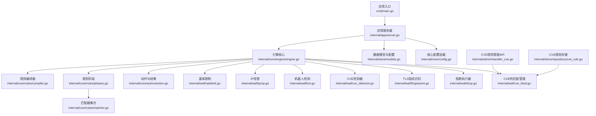

**图表来源**
- [cmd/main.go:1-10](file://cmd/main.go#L1-L10)
- [internal/app/server.go:33-280](file://internal/app/server.go#L33-L280)
- [internal/core/engine/engine.go:15-146](file://internal/core/engine/engine.go#L15-L146)
- [internal/core/rules/compiler.go:27-83](file://internal/core/rules/compiler.go#L27-L83)
- [internal/core/rules/phases.go:32-483](file://internal/core/rules/phases.go#L32-L483)
- [internal/core/rules/matcher.go:166-343](file://internal/core/rules/matcher.go#L166-L343)
- [internal/core/action/action.go:28-53](file://internal/core/action/action.go#L28-L53)
- [internal/waf/ratelimit.go:9-117](file://internal/waf/ratelimit.go#L9-L117)
- [internal/waf/iprep.go:18-243](file://internal/waf/iprep.go#L18-L243)
- [internal/waf/bot.go:8-254](file://internal/waf/bot.go#L8-L254)
- [internal/waf/cve_detector.go:1-257](file://internal/waf/cve_detector.go#L1-L257)
- [internal/waf/fingerprint.go:1-305](file://internal/waf/fingerprint.go#L1-L305)
- [internal/waf/drop.go:1-123](file://internal/waf/drop.go#L1-L123)
- [internal/waf/cve_feed.go:1-383](file://internal/waf/cve_feed.go#L1-L383)
- [internal/admin/handler_cve.go:1-217](file://internal/admin/handler_cve.go#L1-L217)
- [internal/store/repository/cve_rule.go:1-96](file://internal/store/repository/cve_rule.go#L1-L96)
- [internal/store/models.go:44-350](file://internal/store/models.go#L44-L350)
- [internal/core/config.go:31-67](file://internal/core/config.go#L31-L67)

**章节来源**
- [cmd/main.go:1-10](file://cmd/main.go#L1-L10)
- [internal/app/server.go:33-280](file://internal/app/server.go#L33-L280)

## 核心组件
- 引擎 Engine：负责站点解析、维护模式检查、规则编译与阶段管道执行，返回最终动作与观测命中。
- 规则编译器：将存储层规则转换为运行时可直接匹配的 Compiled 结构，内置优先级排序与正则缓存。
- 规则匹配器：提供多种内置匹配器（CIDR、前缀、正则、头部、方法、内容类型、查询参数等），支持复合逻辑（AND/OR/NOT）。
- 规则阶段：按阶段顺序执行，包括 ACL、签名、自定义、请求速率限制、OWASP 默认、CVE 检测、机器人检测、IP 信誉等。
- 动作与结果：标准化动作类型（允许/拦截/观察/丢弃），并提供短路与日志判定逻辑。
- 安全能力：IP 信誉（黑白名单+自动封禁）、机器人检测（指纹与工具识别）、速率限制（固定窗口计数）、CVE 漏洞检测（多语言框架检测）、TLS 指纹识别（JA3/JA4 深度分析）、阻断执行器（TCP 连接直接关闭）。
- CVE 管理：CVE 供应链同步（NVD、GitHub Advisory）、规则热重载、严重性分级、自动升级为丢弃动作。

**更新** 新增 CVE 检测器和 TLS 指纹识别组件，增强阻断机制支持。新增 CVE 供应链同步功能，支持自动获取最新漏洞规则。

**章节来源**
- [internal/core/engine/engine.go:15-146](file://internal/core/engine/engine.go#L15-L146)
- [internal/core/rules/compiler.go:11-83](file://internal/core/rules/compiler.go#L11-L83)
- [internal/core/rules/matcher.go:11-343](file://internal/core/rules/matcher.go#L11-L343)
- [internal/core/rules/phases.go:32-483](file://internal/core/rules/phases.go#L32-L483)
- [internal/core/action/action.go:3-53](file://internal/core/action/action.go#L3-L53)
- [internal/waf/iprep.go:18-243](file://internal/waf/iprep.go#L18-L243)
- [internal/waf/bot.go:8-254](file://internal/waf/bot.go#L8-L254)
- [internal/waf/ratelimit.go:9-117](file://internal/waf/ratelimit.go#L9-L117)
- [internal/waf/cve_detector.go:1-257](file://internal/waf/cve_detector.go#L1-L257)
- [internal/waf/fingerprint.go:1-305](file://internal/waf/fingerprint.go#L1-L305)
- [internal/waf/drop.go:1-123](file://internal/waf/drop.go#L1-L123)
- [internal/waf/cve_feed.go:1-383](file://internal/waf/cve_feed.go#L1-L383)

## 架构总览
引擎在每次请求进入时，先进行站点解析与维护模式检查，随后将规则编译为运行时结构，按阶段顺序执行。阶段间通过短路机制实现快速决策，优先级与动作类型决定是否终止后续阶段。

**更新** 新增 CVE 检测阶段，位于 OWASP 和机器人检测之间，专门用于检测已知漏洞利用模式。

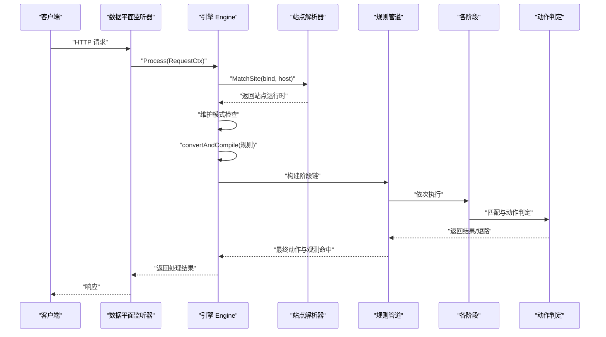

**图表来源**
- [internal/core/engine/engine.go:43-122](file://internal/core/engine/engine.go#L43-L122)
- [internal/core/pipeline/pipeline.go:46-66](file://internal/core/pipeline/pipeline.go#L46-L66)
- [internal/core/rules/phases.go:34-94](file://internal/core/rules/phases.go#L34-L94)

**章节来源**
- [internal/core/engine/engine.go:43-122](file://internal/core/engine/engine.go#L43-L122)
- [internal/core/pipeline/pipeline.go:37-66](file://internal/core/pipeline/pipeline.go#L37-L66)

## 详细组件分析

### 引擎 Engine 组件
- 职责：维护模式检查、站点解析、规则编译、阶段组装与执行、返回处理结果。
- 关键流程：
  - 维护模式：全局或站点级维护模式直接返回拦截动作。
  - 规则编译：将存储层规则转换为 Compiled 列表，按优先级排序。
  - 阶段组装：根据保护配置动态拼接阶段（IP信誉、ACL、机器人检测、请求速率限制、OWASP、CVE、签名、自定义）。
  - 执行：管道顺序执行，遇到终端动作立即短路。

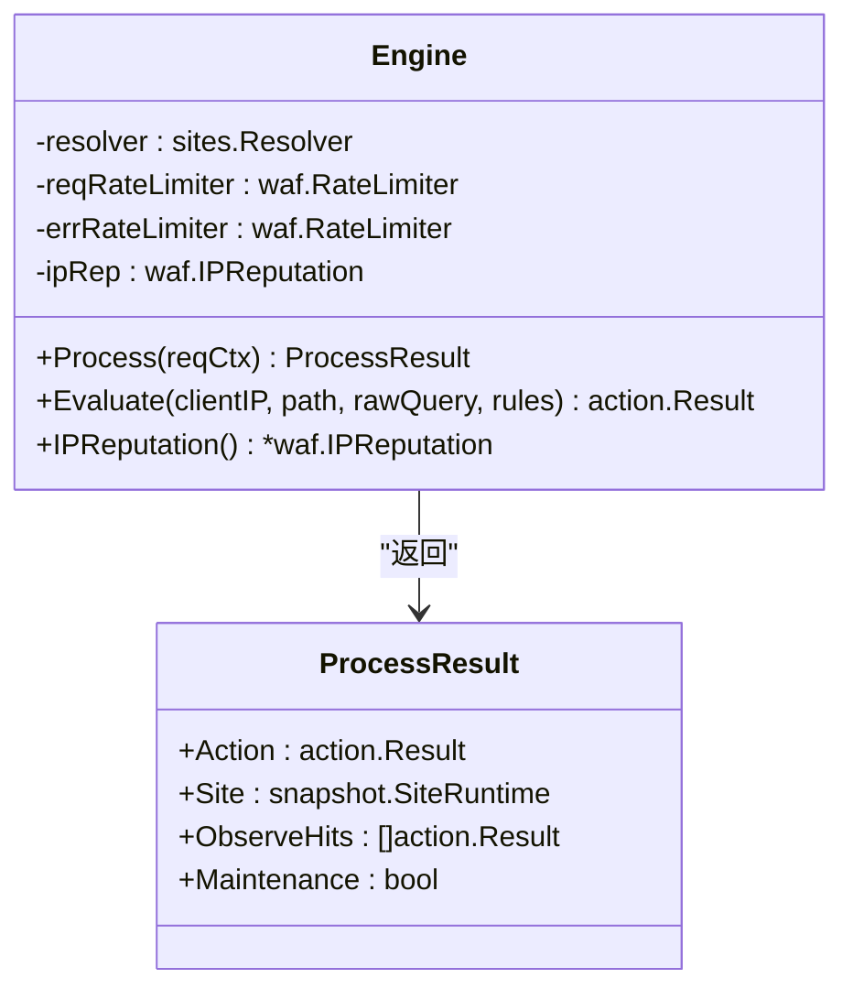

**图表来源**
- [internal/core/engine/engine.go:15-146](file://internal/core/engine/engine.go#L15-L146)

**章节来源**
- [internal/core/engine/engine.go:15-146](file://internal/core/engine/engine.go#L15-L146)

### 规则编译器组件
- 职责：解析规则模式字符串、构建运行时匹配器、排序与生成 Compiled 规则。
- 关键点：
  - 模式解析：支持简单前缀模式与 JSON 复合条件。
  - 匹配器构建：根据 kind 分派到具体匹配器，正则使用缓存避免重复编译。
  - 排序：优先级升序，ID 升序，确保稳定执行顺序。

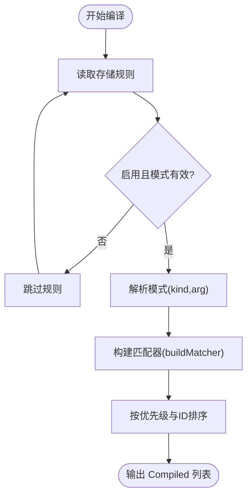

**图表来源**
- [internal/core/rules/compiler.go:27-55](file://internal/core/rules/compiler.go#L27-L55)
- [internal/core/rules/compiler.go:57-83](file://internal/core/rules/compiler.go#L57-L83)
- [internal/core/rules/matcher.go:166-261](file://internal/core/rules/matcher.go#L166-L261)

**章节来源**
- [internal/core/rules/compiler.go:11-83](file://internal/core/rules/compiler.go#L11-L83)
- [internal/core/rules/matcher.go:166-261](file://internal/core/rules/matcher.go#L166-L261)

### 规则匹配器组件
- 职责：对单条规则进行匹配判断，支持复合逻辑与正则缓存。
- 内置匹配器：
  - CIDR/IP 前缀/精确匹配
  - 路径前缀/正则/精确匹配
  - 查询串包含/正则
  - 头部包含/正则
  - 方法/内容类型
  - User-Agent 包含/正则
  - 查询参数存在/值包含
  - 复合条件（AND/OR/NOT）
- 正则优化：使用带锁的全局缓存，避免重复编译。

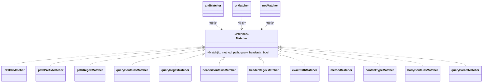

**图表来源**
- [internal/core/rules/matcher.go:11-141](file://internal/core/rules/matcher.go#L11-L141)
- [internal/core/rules/matcher.go:166-343](file://internal/core/rules/matcher.go#L166-L343)

**章节来源**
- [internal/core/rules/matcher.go:11-343](file://internal/core/rules/matcher.go#L11-L343)

### 规则阶段组件
- 职责：按阶段顺序执行规则匹配，支持短路与观测日志。
- 主要阶段：
  - ACL：白名单短路放行，其他动作按规则动作执行。
  - 签名/自定义：命中即按动作短路。
  - 请求速率限制：基于客户端IP+主机名的固定窗口计数。
  - OWASP 默认：多内容类型解析与扫描，命中按配置动作。
  - CVE 检测：检测已知漏洞利用模式，关键/高危严重性自动提升为丢弃。
  - 机器人检测：指纹与工具识别，恶意记录IP信誉。
  - IP 信誉：白名单短路放行，黑名单直接拦截。

**更新** 新增 CVE 检测阶段，位于 OWASP 和机器人检测之间，专门检测已知漏洞利用模式。

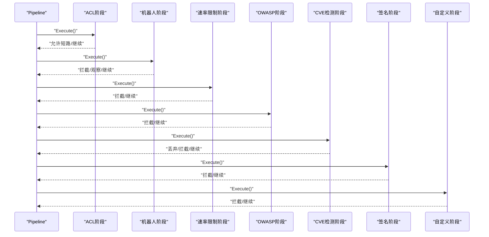

**图表来源**
- [internal/core/rules/phases.go:34-94](file://internal/core/rules/phases.go#L34-L94)
- [internal/core/rules/phases.go:96-128](file://internal/core/rules/phases.go#L96-L128)
- [internal/core/rules/phases.go:130-170](file://internal/core/rules/phases.go#L130-L170)
- [internal/core/rules/phases.go:172-213](file://internal/core/rules/phases.go#L172-L213)
- [internal/core/rules/phases.go:215-272](file://internal/core/rules/phases.go#L215-L272)
- [internal/core/rules/phases.go:305-358](file://internal/core/rules/phases.go#L305-L358)

**章节来源**
- [internal/core/rules/phases.go:32-483](file://internal/core/rules/phases.go#L32-L483)

### CVE 检测器组件
- 职责：检测已知漏洞利用模式，支持多语言框架检测和自定义规则。
- 关键特性：
  - 多检测器并行：PHP、Java、Node.js、通用漏洞检测器并行运行。
  - 自定义规则：支持用户自定义正则表达式规则，热重载。
  - 自动升级：关键/高危严重性自动提升为丢弃动作。
  - 请求解码：支持 URL 解码和 Base64 解码的双重解码检测。

**更新** 新增完整的 CVE 检测器组件，包含多语言框架检测和自定义规则支持。

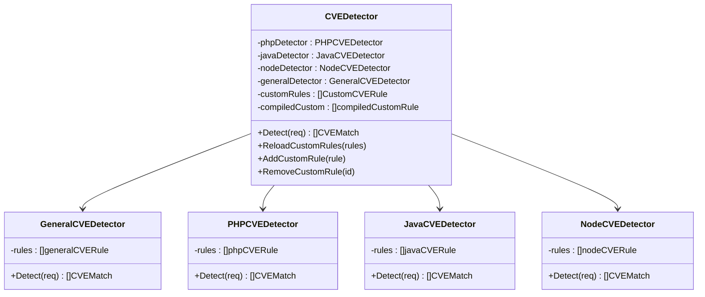

**图表来源**
- [internal/waf/cve_detector.go:11-73](file://internal/waf/cve_detector.go#L11-L73)
- [internal/waf/cve_general.go:8-20](file://internal/waf/cve_general.go#L8-L20)
- [internal/waf/cve_php.go:8-19](file://internal/waf/cve_php.go#L8-L19)
- [internal/waf/cve_java.go:7-18](file://internal/waf/cve_java.go#L7-L18)
- [internal/waf/cve_node.go:7-18](file://internal/waf/cve_node.go#L7-L18)

**章节来源**
- [internal/waf/cve_detector.go:1-257](file://internal/waf/cve_detector.go#L1-L257)
- [internal/waf/cve_general.go:1-203](file://internal/waf/cve_general.go#L1-L203)
- [internal/waf/cve_php.go:1-194](file://internal/waf/cve_php.go#L1-L194)
- [internal/waf/cve_java.go:1-130](file://internal/waf/cve_java.go#L1-L130)
- [internal/waf/cve_node.go:1-138](file://internal/waf/cve_node.go#L1-L138)

### TLS 指纹识别组件
- 职责：深度分析 TLS 连接特征，识别恶意工具和自动化行为。
- 关键特性：
  - JA3/JA4 指纹：支持 JA3（TLS 客户端指纹）和 JA4（改进版指纹）识别。
  - HTTP/2 深度分析：检测 HTTP/2 SETTINGS、窗口大小、优先级树等特征。
  - 浏览器一致性检查：验证 Accept-Language、Accept-Encoding 等头部一致性。
  - 工具识别：内置恶意工具指纹数据库，支持实时更新。

**更新** 新增完整的 TLS 指纹识别组件，集成 JA3/JA4 指纹分析和 HTTP/2 深度检测。

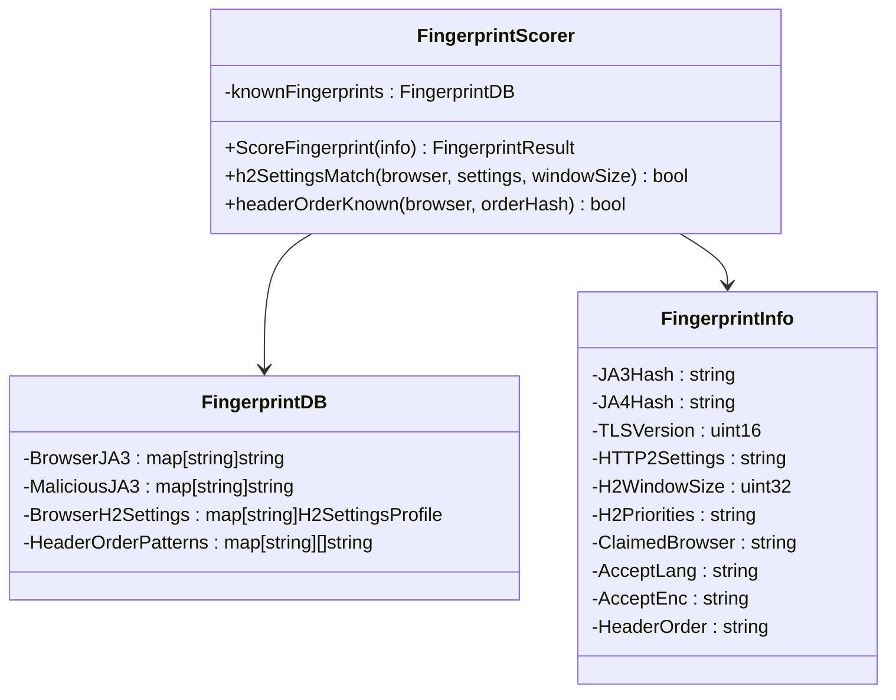

**图表来源**
- [internal/waf/fingerprint.go:30-40](file://internal/waf/fingerprint.go#L30-L40)
- [internal/waf/fingerprint_db.go:3-13](file://internal/waf/fingerprint_db.go#L3-L13)
- [internal/waf/fingerprint.go:9-21](file://internal/waf/fingerprint.go#L9-L21)

**章节来源**
- [internal/waf/fingerprint.go:1-305](file://internal/waf/fingerprint.go#L1-L305)
- [internal/waf/fingerprint_db.go:1-233](file://internal/waf/fingerprint_db.go#L1-L233)

### 阻断执行器组件
- 职责：直接关闭 TCP 连接而不发送任何 HTTP 响应，实现零响应阻断。
- 关键特性：
  - 统计追踪：跟踪总阻断数、按源分类的阻断统计。
  - 原子操作：使用原子计数器确保并发安全。
  - 详细日志：记录阻断原因、客户端 IP、主机名、路径等信息。
  - 灵活启用：支持运行时启用/禁用阻断功能。

**更新** 新增阻断执行器组件，提供更严格的阻断机制。

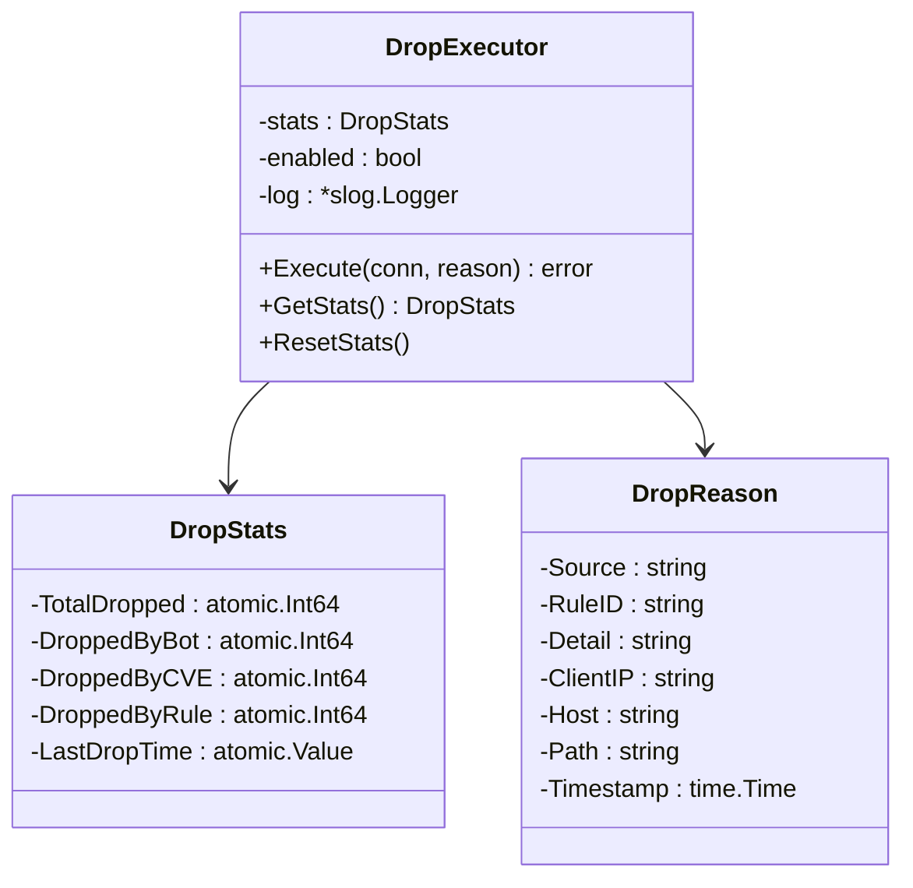

**图表来源**
- [internal/waf/drop.go:19-24](file://internal/waf/drop.go#L19-L24)
- [internal/waf/drop.go:10-17](file://internal/waf/drop.go#L10-L17)
- [internal/waf/drop.go:26-35](file://internal/waf/drop.go#L26-L35)

**章节来源**
- [internal/waf/drop.go:1-123](file://internal/waf/drop.go#L1-L123)

### CVE 供应链管理组件
- 职责：从 NVD 和 GitHub Advisory 获取最新的 CVE 规则，支持自动审批和热重载。
- 关键特性：
  - 多源同步：支持 NVD API 和 GitHub Advisory API。
  - 自动审批：可配置自动批准新规则。
  - 热重载：规则更新后自动应用到检测器。
  - 同步日志：记录同步状态、错误信息和统计信息。

**更新** 新增完整的 CVE 供应链管理功能，支持自动获取和管理 CVE 规则。

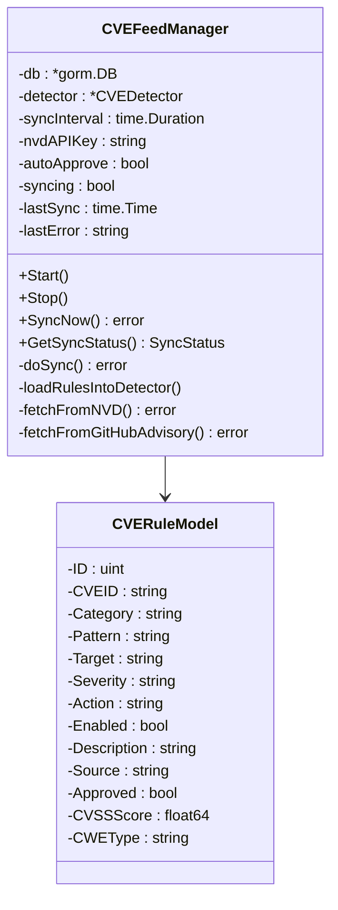

**图表来源**
- [internal/waf/cve_feed.go:61-75](file://internal/waf/cve_feed.go#L61-L75)
- [internal/waf/cve_feed.go:32-49](file://internal/waf/cve_feed.go#L32-L49)

**章节来源**
- [internal/waf/cve_feed.go:1-383](file://internal/waf/cve_feed.go#L1-L383)

### 动作与结果组件
- 职责：标准化动作类型（允许/拦截/观察/丢弃），并提供短路与日志判定。
- 关键点：规范化旧动作别名，短路仅在拦截/丢弃时触发，观测命中用于日志记录。

**更新** 新增丢弃动作类型，用于更严格的阻断场景。

**章节来源**
- [internal/core/action/action.go:3-53](file://internal/core/action/action.go#L3-L53)

### 速率限制组件
- 职责：固定窗口计数限流，支持并发安全与定期清理。
- 关键点：键由客户端IP+主机名组成，窗口与阈值可动态配置。

**章节来源**
- [internal/waf/ratelimit.go:9-117](file://internal/waf/ratelimit.go#L9-L117)

### IP 信誉组件
- 职责：支持黑白名单与自动封禁，提供查询与违规计数。
- 关键点：白名单命中短路放行，黑名单直接拦截；自动封禁基于窗口内违规次数。

**章节来源**
- [internal/waf/iprep.go:18-243](file://internal/waf/iprep.go#L18-L243)

### 机器人检测组件
- 职责：基于用户代理与请求特征的指纹评分，识别恶意工具。
- 关键点：内置合法爬虫白名单与恶意工具列表，支持不同敏感度等级。
- 深度分析：集成 TLS 指纹识别，包括 JA3/JA4 指纹识别和 HTTP/2 设置检测。

**更新** 集成 TLS 指纹深度分析，包括 JA3/JA4 指纹识别和 HTTP/2 设置检测。

**章节来源**
- [internal/waf/bot.go:8-254](file://internal/waf/bot.go#L8-L254)

## 依赖关系分析
- 引擎依赖：站点解析器、规则编译器、动作系统、速率限制、IP 信誉、机器人检测、CVE 检测器。
- 规则阶段依赖：匹配器集合、动作系统、速率限制实例、IP 信誉实例、机器人检测工具、CVE 检测器实例。
- 应用层依赖：数据库连接、Redis（可选）、前端静态资源、健康检查、指标导出。
- CVE 管理依赖：数据库存储、外部 API（NVD、GitHub Advisory）、CVE 检测器。

**更新** 新增 CVE 检测器和 TLS 指纹识别组件的依赖关系，以及 CVE 供应链管理的外部依赖。

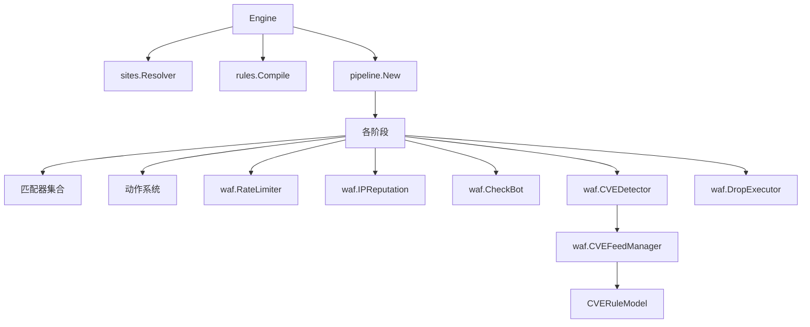

**图表来源**
- [internal/core/engine/engine.go:69-106](file://internal/core/engine/engine.go#L69-L106)
- [internal/core/rules/phases.go:34-272](file://internal/core/rules/phases.go#L34-L272)

**章节来源**
- [internal/core/engine/engine.go:69-106](file://internal/core/engine/engine.go#L69-L106)
- [internal/core/rules/phases.go:34-272](file://internal/core/rules/phases.go#L34-L272)

## 性能考虑
- 正则优化：规则编译阶段对正则表达式进行缓存，避免重复编译，降低 CPU 开销。
- 匹配短路：ACL 允许短路放行，IP 信誉白名单短路放行，机器人检测恶意命中直接拦截，CVE 检测关键/高危自动丢弃，减少后续阶段开销。
- 固定窗口限流：使用原子计数与定期清理，内存占用可控，适合高 QPS 场景。
- 内容扫描限制：OWASP 默认阶段对不同内容类型采用不同的解析与扫描策略，限制扫描范围与大小，避免正则风暴。
- 并发安全：速率限制与 IP 信誉使用互斥锁与原子操作，保证多协程下的正确性。
- 预排序：规则按优先级与 ID 排序，确保稳定的执行顺序，避免不必要的回溯。
- CVE 检测并行：CVE 检测器使用 goroutine 并行运行多个检测器，提高检测效率。
- TLS 指纹缓存：指纹数据库使用内存缓存，避免重复计算。
- CVE 规则缓存：自定义 CVE 规则编译后缓存正则表达式，支持热重载时的原子替换。

**更新** 新增 CVE 检测并行和 TLS 指纹缓存的性能优化策略，以及 CVE 规则缓存机制。

## 故障排查指南
- 规则未生效：
  - 检查规则是否启用、模式是否正确、优先级是否覆盖预期。
  - 参考规则编译与匹配测试用例，验证正则与复合条件行为。
- 正则匹配异常：
  - 确认正则表达式合法性，非法正则会被视为"从不匹配"以避免错误。
  - 检查正则缓存是否被正确复用。
- 速率限制误判：
  - 核对限流键（客户端IP+主机名）是否符合预期，确认窗口与阈值配置。
- IP 信誉问题：
  - 核对黑白名单条目格式与有效期，检查自动封禁阈值与窗口设置。
- 机器人检测误报：
  - 调整敏感度等级，核对用户代理是否被误判为恶意工具。
- CVE 检测问题：
  - 检查 CVE 检测器是否启用，确认自定义规则正则表达式有效性。
  - 验证 CVE 规则的严重性配置，关键/高危规则会自动提升为丢弃。
  - 检查 CVE 供应链同步状态，确认规则是否成功加载。
- TLS 指纹识别异常：
  - 检查上游代理是否正确传递 JA3/JA4 指纹头信息。
  - 验证浏览器指纹数据库是否正确加载。
- 阻断执行器问题：
  - 检查阻断执行器是否启用，确认连接对象有效。
  - 验证阻断统计数据是否正确更新。

**更新** 新增 CVE 检测和 TLS 指纹识别的故障排查指导，以及阻断执行器的问题诊断方法。

**章节来源**
- [internal/core/rules/compiler_test.go:11-88](file://internal/core/rules/compiler_test.go#L11-L88)
- [internal/core/rules/matcher_test.go:10-221](file://internal/core/rules/matcher_test.go#L10-L221)
- [internal/waf/ratelimit.go:48-92](file://internal/waf/ratelimit.go#L48-L92)
- [internal/waf/iprep.go:89-124](file://internal/waf/iprep.go#L89-L124)
- [internal/waf/bot.go:180-249](file://internal/waf/bot.go#L180-L249)
- [internal/waf/cve_detector.go:160-174](file://internal/waf/cve_detector.go#L160-L174)
- [internal/waf/fingerprint.go:46-96](file://internal/waf/fingerprint.go#L46-L96)
- [internal/waf/drop.go:49-57](file://internal/waf/drop.go#L49-L57)

## 结论
本 WAF 引擎系统通过清晰的分层与模块化设计，实现了高性能、可扩展的规则处理能力。规则编译器与匹配器提供了灵活的模式与复合条件支持，阶段化的执行流程结合短路机制确保了低延迟与高吞吐。速率限制、IP 信誉与机器人检测等安全能力进一步增强了整体防护效果。

**更新** 新增的 CVE 漏洞检测阶段显著提升了对已知漏洞利用的检测能力，TLS 指纹识别功能增强了对自动化攻击和恶意工具的识别精度，阻断执行器提供了更严格的零响应阻断机制。CVE 供应链同步功能确保了规则的时效性和准确性。建议在生产环境中合理配置规则优先级、正则表达式与限流参数，充分利用 CVE 检测和 TLS 指纹识别功能，并持续监控指标与日志以优化策略。

## 附录

### 规则执行流程详解
- 阶段划分：ACL → 机器人检测 → 请求速率限制 → OWASP 默认 → CVE 检测 → 签名 → 自定义。
- 执行顺序：严格按上述顺序，每个阶段可能短路后续阶段。
- 短路机制：允许（ACL）与拦截（IP信誉/OWASP/签名/自定义）会立即终止管道，丢弃动作具有最高优先级。
- CVE 自动升级：关键/高危严重性的 CVE 检测结果自动升级为丢弃动作。

**更新** 新增 CVE 检测阶段，位于 OWASP 和签名阶段之间，专门检测已知漏洞利用模式。

**章节来源**
- [internal/core/engine/engine.go:69-106](file://internal/core/engine/engine.go#L69-L106)
- [internal/core/rules/phases.go:34-94](file://internal/core/rules/phases.go#L34-L94)
- [internal/core/rules/phases.go:305-358](file://internal/core/rules/phases.go#L305-L358)

### 规则示例与配置案例
- 示例模式：
  - IP 白名单/黑名单：allow_ip:10.0.0.1、block_ip:192.168.1.0/24
  - 路径匹配：block_path:/admin、block_path_regex:(?i)/admin
  - 查询串匹配：block_query_contains:union、block_query_regex:(?i)union\s+select
  - 头部匹配：block_header:User-Agent:sqlmap、block_header_regex:Content-Type:image/
  - 方法与内容类型：block_method:DELETE、block_content_type:application/xml
  - 复合条件：{"op":"and","children":[{"kind":"block_path","arg":"/admin"},{"kind":"block_method","arg":"POST"}]}
- 配置要点：
  - 规则优先级：数值越小优先级越高。
  - 动作类型：allow/intercept/observe/drop（兼容 block/log_only）。
  - OWASP 敏感度：low/mid/high，影响扫描严格程度。
  - 速率限制：窗口秒数与最大请求数需结合业务流量评估。
  - CVE 检测：支持自定义正则规则，关键/高危严重性自动提升为丢弃。
  - CVE 配置：cve_enabled 控制是否启用，cve_action 控制默认动作类型。

**更新** 新增 CVE 检测配置选项，包括自定义规则和严重性分级。

**章节来源**
- [internal/core/rules/compiler.go:57-83](file://internal/core/rules/compiler.go#L57-L83)
- [internal/store/models.go:44-91](file://internal/store/models.go#L44-L91)
- [internal/store/models.go:244-289](file://internal/store/models.go#L244-L289)
- [internal/waf/cve_detector.go:160-174](file://internal/waf/cve_detector.go#L160-L174)

### 扩展点与自定义规则开发
- 新增匹配器：
  - 实现 Matcher 接口并在 buildMatcher 中注册映射。
  - 注意正则缓存与边界条件处理。
- 新增阶段：
  - 实现 pipeline.Phase 接口，按需短路与日志记录。
  - 在引擎组装处将新阶段加入 Pipeline。
- 新增动作：
  - 在 action 包中扩展 Type 与 Normalize 行为，保持向后兼容。
- 配置驱动：
  - 通过 ProtectionConfig 与系统设置调整全局策略（如 OWASP、速率限制、机器人检测、CVE 检测）。
- CVE 规则开发：
  - 使用 CustomCVERule 结构定义自定义规则，支持正则表达式和目标选择。
  - 通过 CVESyncLog 记录规则同步状态和错误信息。
  - 支持热重载和运行时动态添加/删除规则。
- TLS 指纹扩展：
  - 扩展 FingerprintDB 添加新的指纹模式。
  - 集成新的指纹提取方法和评分逻辑。

**更新** 新增 CVE 规则开发和管理的扩展点，以及 TLS 指纹识别的扩展方法。

**章节来源**
- [internal/core/rules/matcher.go:11-261](file://internal/core/rules/matcher.go#L11-L261)
- [internal/core/rules/phases.go:25-31](file://internal/core/rules/phases.go#L25-L31)
- [internal/core/action/action.go:3-26](file://internal/core/action/action.go#L3-L26)
- [internal/store/models.go:244-289](file://internal/store/models.go#L244-L289)
- [internal/waf/cve_detector.go:160-204](file://internal/waf/cve_detector.go#L160-L204)
- [internal/store/models.go:444-456](file://internal/store/models.go#L444-L456)

### CVE 规则管理 API
- 列表查询：支持按类别、严重性、启用状态、来源过滤。
- 创建规则：验证正则表达式合法性，标记为自定义来源。
- 更新规则：支持部分字段更新，重新验证正则表达式。
- 删除规则：仅允许删除自定义规则。
- 同步规则：从 CVE 供应链同步规则，支持手动触发和状态查询。
- 审批管理：支持规则审批状态管理和批量操作。

**更新** 新增完整的 CVE 规则管理 API 文档，包括审批管理功能。

**章节来源**
- [internal/admin/handler_cve.go:15-217](file://internal/admin/handler_cve.go#L15-L217)
- [internal/store/repository/cve_rule.go:16-96](file://internal/store/repository/cve_rule.go#L16-L96)

### CVE 供应链同步机制
- 同步频率：支持配置同步间隔，默认每小时同步一次。
- 数据源：支持 NVD API 和 GitHub Advisory API。
- 自动审批：可配置自动批准新规则，支持手动审批模式。
- 热重载：规则更新后自动应用到检测器，无需重启服务。
- 错误处理：详细的错误日志和重试机制。
- 统计监控：记录同步状态、成功率、失败原因等统计信息。

**更新** 新增完整的 CVE 供应链同步机制文档。

**章节来源**
- [internal/waf/cve_feed.go:77-90](file://internal/waf/cve_feed.go#L77-L90)
- [internal/waf/cve_feed.go:129-172](file://internal/waf/cve_feed.go#L129-L172)
- [internal/waf/cve_feed.go:174-235](file://internal/waf/cve_feed.go#L174-L235)
- [internal/waf/cve_feed.go:237-383](file://internal/waf/cve_feed.go#L237-L383)