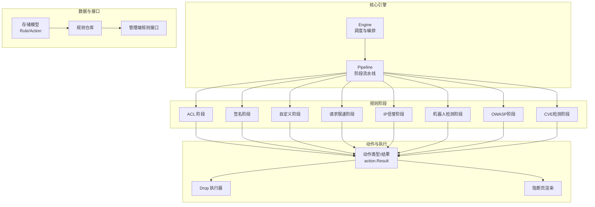
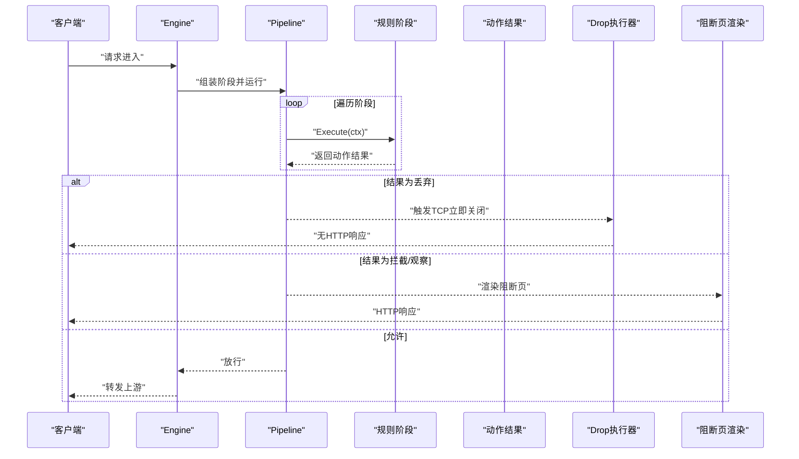
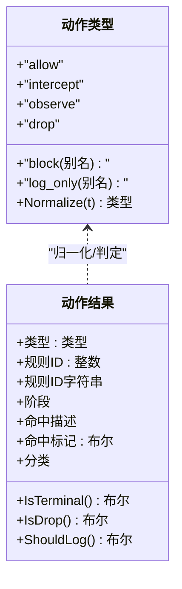
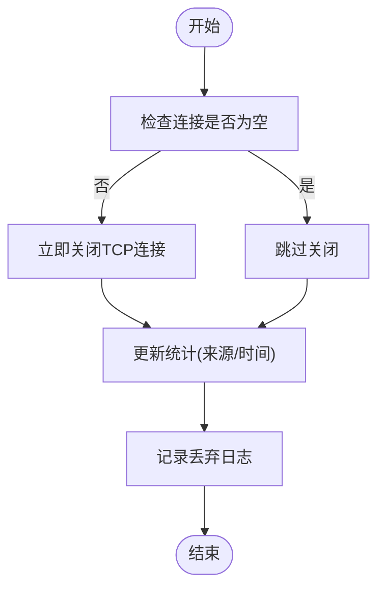
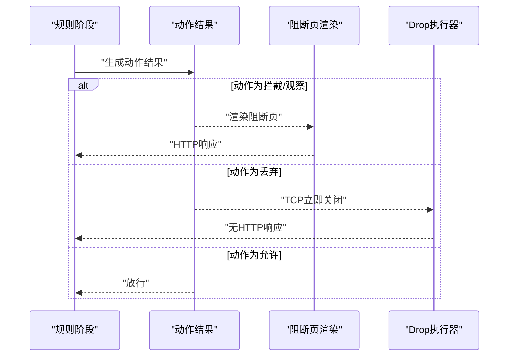
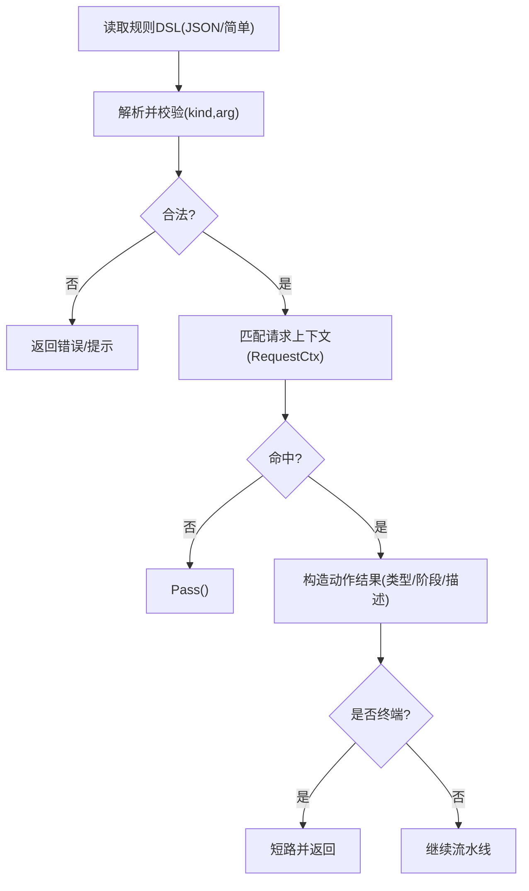
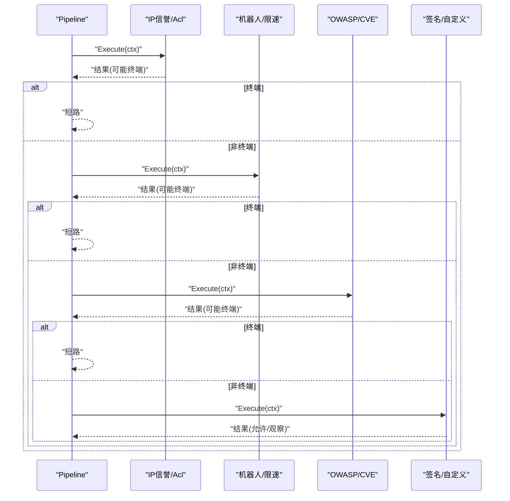
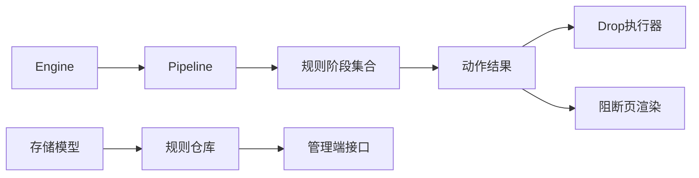

# 动作与结果系统

<cite>
**本文引用的文件**
- [internal/core/action/action.go](file://internal/core/action/action.go)
- [internal/core/pipeline/pipeline.go](file://internal/core/pipeline/pipeline.go)
- [internal/core/engine/engine.go](file://internal/core/engine/engine.go)
- [internal/core/rules/phases.go](file://internal/core/rules/phases.go)
- [internal/waf/drop/drop.go](file://internal/waf/drop/drop.go)
- [internal/waf/drop/drop_test.go](file://internal/waf/drop/drop_test.go)
- [internal/observability/dropevent_writer.go](file://internal/observability/dropevent_writer.go)
- [docs/扩展与插件/规则引擎扩展/动作集成.md](file://docs/扩展与插件/规则引擎扩展/动作集成.md)
- [docs/WAF 引擎系统/规则管道设计/规则管道设计.md](file://docs/WAF 引擎系统/规则管道设计/规则管道设计.md)
</cite>

## 目录
1. [简介](#简介)
2. [项目结构](#项目结构)
3. [核心组件](#核心组件)
4. [架构总览](#架构总览)
5. [详细组件分析](#详细组件分析)
6. [依赖分析](#依赖分析)
7. [性能考虑](#性能考虑)
8. [故障排查指南](#故障排查指南)
9. [结论](#结论)
10. [附录](#附录)

## 简介
本文件系统性梳理 OpenWAF 的"动作与结果系统"，围绕以下目标展开：
- 动作类型定义与标准化（含兼容性映射）
- 执行器接口与配置管理
- 内置动作的实现机制（阻断、允许、观察、丢弃、挑战、重定向、限流、标签）
- 自定义动作的开发流程（接口实现、参数校验、执行逻辑）
- 动作链的组合与嵌套（阶段顺序、优先级、短路与日志收集）
- 测试与验证方法（效果验证、性能测试、安全审计）
- 最佳实践与常见陷阱

## 项目结构
动作系统横跨"核心引擎层、规则阶段层、WAF 执行层、存储模型层、管理端接口层"，以及前端可视化规则构建工具。下图给出与动作相关的关键模块与交互：

**图表来源**
- [internal/core/engine/engine.go:57-129](file://internal/core/engine/engine.go#L57-L129)
- [internal/core/pipeline/pipeline.go:46-70](file://internal/core/pipeline/pipeline.go#L46-L70)
- [internal/core/rules/phases.go:32-358](file://internal/core/rules/phases.go#L32-L358)
- [internal/core/action/action.go:29-61](file://internal/core/action/action.go#L29-L61)
- [internal/waf/drop/drop.go:19-123](file://internal/waf/drop/drop.go#L19-L123)
- [internal/waf/pages/block.go:16-170](file://internal/waf/pages/block.go#L16-L170)
- [internal/store/policy.go:10-80](file://internal/store/policy.go#L10-L80)
- [internal/admin/handler_rule.go:104-156](file://internal/admin/handler_rule.go#L104-L156)

**章节来源**
- [internal/core/engine/engine.go:57-129](file://internal/core/engine/engine.go#L57-L129)
- [internal/core/pipeline/pipeline.go:46-70](file://internal/core/pipeline/pipeline.go#L46-L70)
- [internal/core/rules/phases.go:32-358](file://internal/core/rules/phases.go#L32-L358)
- [internal/core/action/action.go:29-61](file://internal/core/action/action.go#L29-L61)
- [internal/waf/drop/drop.go:19-123](file://internal/waf/drop/drop.go#L19-L123)
- [internal/waf/pages/block.go:16-170](file://internal/waf/pages/block.go#L16-L170)
- [internal/store/policy.go:10-80](file://internal/store/policy.go#L10-L80)
- [internal/admin/handler_rule.go:104-156](file://internal/admin/handler_rule.go#L104-L156)

## 核心组件
- 动作类型与结果
  - 类型：允许、拦截、观察、丢弃；并提供历史别名到标准类型的映射与归一化函数。
  - 结果：封装动作类型、命中标记、规则标识、阶段、描述、分类等字段。
  - 行为判定：是否终端（短路）、是否丢弃（最高优先级）、是否需要记录日志。
- 执行器
  - Drop 执行器：在不发送 HTTP 响应的前提下立即关闭 TCP 连接，统计来源并记录日志。
  - 阻断页渲染：根据站点或全局配置渲染阻断页或维护页，支持模板与内嵌资源回退。
- 规则阶段
  - ACL、签名、自定义、请求限速、IP 信誉、机器人检测、OWASP 默认、CVE 检测等阶段均以统一的 Phase 接口产出 action.Result。
- 引擎与流水线
  - Engine 负责站点解析、阶段组装与运行；Pipeline 顺序执行各阶段，依据动作优先级进行短路与日志聚合。

**章节来源**
- [internal/core/action/action.go:3-61](file://internal/core/action/action.go#L3-L61)
- [internal/waf/drop/drop.go:19-123](file://internal/waf/drop/drop.go#L19-L123)
- [internal/waf/pages/block.go:16-170](file://internal/waf/pages/block.go#L16-L170)
- [internal/core/rules/phases.go:32-358](file://internal/core/rules/phases.go#L32-L358)
- [internal/core/pipeline/pipeline.go:25-70](file://internal/core/pipeline/pipeline.go#L25-L70)
- [internal/core/engine/engine.go:57-129](file://internal/core/engine/engine.go#L57-L129)

## 架构总览
动作系统遵循"规则阶段 → 统一动作结果 → 执行器/页面响应"的分层设计。Engine 将多阶段规则编译后注入 Pipeline，Pipeline 逐阶段评估并按优先级短路，最终由 Drop 执行器或阻断页渲染完成动作落地。

**图表来源**
- [internal/core/engine/engine.go:57-129](file://internal/core/engine/engine.go#L57-L129)
- [internal/core/pipeline/pipeline.go:46-70](file://internal/core/pipeline/pipeline.go#L46-L70)
- [internal/core/rules/phases.go:32-358](file://internal/core/rules/phases.go#L32-L358)
- [internal/waf/drop/drop.go:59-83](file://internal/waf/drop/drop.go#L59-L83)
- [internal/waf/pages/block.go:16-39](file://internal/waf/pages/block.go#L16-L39)

## 详细组件分析

### 动作类型与结果（action）
- 类型定义与归一化
  - 支持标准类型：允许、拦截、观察、丢弃；历史别名 block/log_only 映射至标准类型。
  - 归一化函数确保后续判断一致性。
- 结果结构
  - 字段覆盖动作类型、规则标识、阶段、命中描述、分类、命中标记等。
- 行为判定
  - IsTerminal：拦截/丢弃视为终端，短路后续阶段与上游。
  - IsDrop：丢弃为最高优先级，直接 TCP 关闭。
  - ShouldLog：拦截/观察/丢弃均需记录日志，用于审计与统计。

**图表来源**
- [internal/core/action/action.go:3-61](file://internal/core/action/action.go#L3-L61)

**章节来源**
- [internal/core/action/action.go:3-61](file://internal/core/action/action.go#L3-L61)

### 执行器接口与配置（Drop 执行器）
- 能力
  - 立即关闭 TCP 连接，不写入任何 HTTP 响应。
  - 统计来源（机器人、CVE、规则/IP信誉）与最后丢弃时间。
  - 可启用/禁用，支持重置统计。
- 安全与健壮性
  - 对空连接安全调用，避免重复关闭或空指针。
  - 记录丢弃事件，便于审计与告警。

**图表来源**
- [internal/waf/drop/drop.go:59-83](file://internal/waf/drop/drop.go#L59-L83)
- [internal/waf/drop/drop.go:85-100](file://internal/waf/drop/drop.go#L85-L100)

**章节来源**
- [internal/waf/drop/drop.go:19-123](file://internal/waf/drop/drop.go#L19-L123)
- [internal/waf/drop/drop_test.go:24-123](file://internal/waf/drop/drop_test.go#L24-L123)

### 内置动作实现机制
- 阻断页与维护页
  - 阻断页：优先使用站点自定义 HTML，其次使用全局默认 HTML；若均不可用则回退到内嵌资源。
  - 维护页：支持站点级与全局级配置，优先级与阻断页一致。
- 丢弃（Drop）
  - 在机器人检测、CVE 检测等场景中，高风险行为可直接触发丢弃，绕过 HTTP 响应。
- 观察（Observe）
  - 仅记录日志，不中断请求，用于审计与趋势分析。
- 允许（Allow）
  - 放行请求，进入后续阶段或上游。

**图表来源**
- [internal/core/rules/phases.go:212-244](file://internal/core/rules/phases.go#L212-L244)
- [internal/core/rules/phases.go:349-357](file://internal/core/rules/phases.go#L349-L357)
- [internal/waf/pages/block.go:16-39](file://internal/waf/pages/block.go#L16-L39)
- [internal/waf/drop/drop.go:59-83](file://internal/waf/drop/drop.go#L59-L83)

**章节来源**
- [internal/waf/pages/block.go:16-170](file://internal/waf/pages/block.go#L16-L170)
- [internal/core/rules/phases.go:212-244](file://internal/core/rules/phases.go#L212-L244)
- [internal/core/rules/phases.go:349-357](file://internal/core/rules/phases.go#L349-L357)

### 自定义动作开发流程
- 动作接口与阶段
  - 实现 Phase 接口（Name/Execute），在 Execute 中对 RequestCtx 进行匹配并返回 action.Result。
  - 将新阶段通过 Engine 注入 Pipeline，参与统一短路与日志收集。
- 参数校验
  - 对 DSL 或 JSON 形式的复合条件进行解析与校验，确保 kind/arg 合法。
  - 前端规则构建器提供 DSL 预览与简单校验，后端接口提供规则测试能力。
- 执行逻辑
  - 匹配成功后构造动作结果，设置类型、阶段、描述、分类等。
  - 若为终端动作（拦截/丢弃），Pipeline 将短路后续阶段。

**图表来源**
- [internal/admin/handler_rule.go:104-156](file://internal/admin/handler_rule.go#L104-L156)
- [internal/core/rules/phases.go:544-568](file://internal/core/rules/phases.go#L544-L568)

**章节来源**
- [internal/admin/handler_rule.go:104-156](file://internal/admin/handler_rule.go#L104-L156)
- [internal/core/rules/phases.go:544-568](file://internal/core/rules/phases.go#L544-L568)

### 动作链组合与嵌套机制
- 阶段顺序
  - IPReputation → AntiReplay → ACL → OWASP → CVE → BotDetection → RequestRateLimit → Signature → Custom。
- 优先级与短路
  - Pipeline 逐阶段执行，遇到丢弃（最高优先级）立即短路；拦截亦为终端，Allow 仅在 ACL 阶段短路后续阶段。
  - 观察命中仅收集日志，不短路。
- 条件分支与复合规则
  - 支持复合条件（and/or/not），前端规则构建器提供可视化编辑与 DSL 生成。
  - 后端规则编译时将复合规则转换为原始模式，保证匹配一致性。

**图表来源**
- [internal/core/engine/engine.go:83-120](file://internal/core/engine/engine.go#L83-L120)
- [internal/core/pipeline/pipeline.go:46-70](file://internal/core/pipeline/pipeline.go#L46-L70)

**章节来源**
- [internal/core/engine/engine.go:83-120](file://internal/core/engine/engine.go#L83-L120)
- [internal/core/pipeline/pipeline.go:46-70](file://internal/core/pipeline/pipeline.go#L46-L70)

### 观测命中日志记录
- 日志聚合
  - Pipeline 收集所有 ShouldLog 的动作，形成观察命中列表，用于审计与统计。
- 写入策略
  - 观察命中通过统一的事件写入器记录，支持批量写入与异步处理。
- 配置选项
  - 可配置日志级别、字段裁剪、批量大小与刷新间隔，平衡性能与可观测性。

**章节来源**
- [internal/core/pipeline/pipeline.go:78-118](file://internal/core/pipeline/pipeline.go#L78-L118)
- [internal/observability/dropevent_writer.go:52-124](file://internal/observability/dropevent_writer.go#L52-L124)

## 依赖分析
- 模块耦合
  - Engine 依赖 Pipeline、规则阶段与站点解析；Pipeline 依赖各阶段实现与动作结果。
  - Drop 执行器与阻断页渲染独立于规则阶段，仅消费动作结果。
- 外部依赖
  - 前端规则构建器与管理端接口共同支撑规则的可视化编辑、导入导出与测试。

**图表来源**
- [internal/core/engine/engine.go:57-129](file://internal/core/engine/engine.go#L57-L129)
- [internal/core/pipeline/pipeline.go:25-70](file://internal/core/pipeline/pipeline.go#L25-L70)
- [internal/core/rules/phases.go:32-358](file://internal/core/rules/phases.go#L32-L358)
- [internal/waf/drop/drop.go:19-123](file://internal/waf/drop/drop.go#L19-L123)
- [internal/waf/pages/block.go:16-170](file://internal/waf/pages/block.go#L16-L170)
- [internal/store/policy.go:10-80](file://internal/store/policy.go#L10-L80)
- [internal/admin/handler_rule.go:104-156](file://internal/admin/handler_rule.go#L104-L156)

**章节来源**
- [internal/core/engine/engine.go:57-129](file://internal/core/engine/engine.go#L57-L129)
- [internal/core/pipeline/pipeline.go:25-70](file://internal/core/pipeline/pipeline.go#L25-L70)
- [internal/core/rules/phases.go:32-358](file://internal/core/rules/phases.go#L32-L358)
- [internal/waf/drop/drop.go:19-123](file://internal/waf/drop/drop.go#L19-L123)
- [internal/waf/pages/block.go:16-170](file://internal/waf/pages/block.go#L16-L170)
- [internal/store/policy.go:10-80](file://internal/store/policy.go#L10-L80)
- [internal/admin/handler_rule.go:104-156](file://internal/admin/handler_rule.go#L104-L156)

## 性能考虑
- 正则与内容扫描
  - 对大体积或二进制内容采用采样与阈值控制，避免过度扫描导致性能抖动。
- 复合规则
  - 控制复合条件数量与层级，减少匹配成本。
- 统计与日志
  - Drop 统计使用原子计数，降低并发写竞争；日志级别与字段精简以减少开销。
- 短路执行
  - 当遇到终止性动作（拦截或丢弃）时立即停止后续阶段执行。
- 白名单优化
  - ACL 阶段的 Allow 规则可完全跳过后续所有阶段。
- 早期过滤
  - IP 信誉和机器人检测等快速阶段优先执行。
- 内存复用
  - 使用原子指针进行配置快照切换，避免锁竞争。

**章节来源**
- [docs/扩展与插件/规则引擎扩展/动作集成.md:413-420](file://docs/扩展与插件/规则引擎扩展/动作集成.md#L413-L420)
- [docs/安全防护功能/ACL 规则引擎/处理阶段.md:439-471](file://docs/安全防护功能/ACL 规则引擎/处理阶段.md#L439-L471)

## 故障排查指南
- 动作未生效
  - 检查阶段顺序与优先级：丢弃最高，拦截次之；确认 Pipeline 是否提前短路。
  - 核对动作类型归一化：历史别名需映射到标准类型。
- 丢弃统计异常
  - 确认 Drop 执行器启用状态与连接非空；查看统计来源分布与最后丢弃时间。
- 阻断页显示异常
  - 检查站点/全局 HTML 配置与模板语法；必要时回退到内嵌资源。
- 规则测试失败
  - 使用管理端规则测试接口定位 DSL 语法与参数问题；前端 DSL 预览辅助快速修正。

**章节来源**
- [internal/core/action/action.go:17-27](file://internal/core/action/action.go#L17-L27)
- [internal/waf/drop/drop.go:59-83](file://internal/waf/drop/drop.go#L59-L83)
- [internal/waf/pages/block.go:68-170](file://internal/waf/pages/block.go#L68-L170)
- [internal/admin/handler_rule.go:104-156](file://internal/admin/handler_rule.go#L104-L156)

## 结论
动作集成通过"统一动作结果 + 分层阶段 + 执行器/页面响应"的架构，实现了灵活、可扩展且高性能的防护能力。标准动作类型与归一化机制确保了兼容性与一致性；Pipeline 的短路策略与日志聚合提供了清晰的可观测性；Drop 执行器与阻断页渲染满足不同处置需求。配合规则测试与统计分析，可有效保障安全策略的正确性与稳定性。

## 附录
- 存储模型中的动作与阶段
  - 动作常量与归一化函数，确保数据库与运行时的一致性。
  - 规则阶段枚举与优先级排序，指导 Engine 组装阶段序列。

**章节来源**
- [internal/store/policy.go:10-80](file://internal/store/policy.go#L10-L80)
