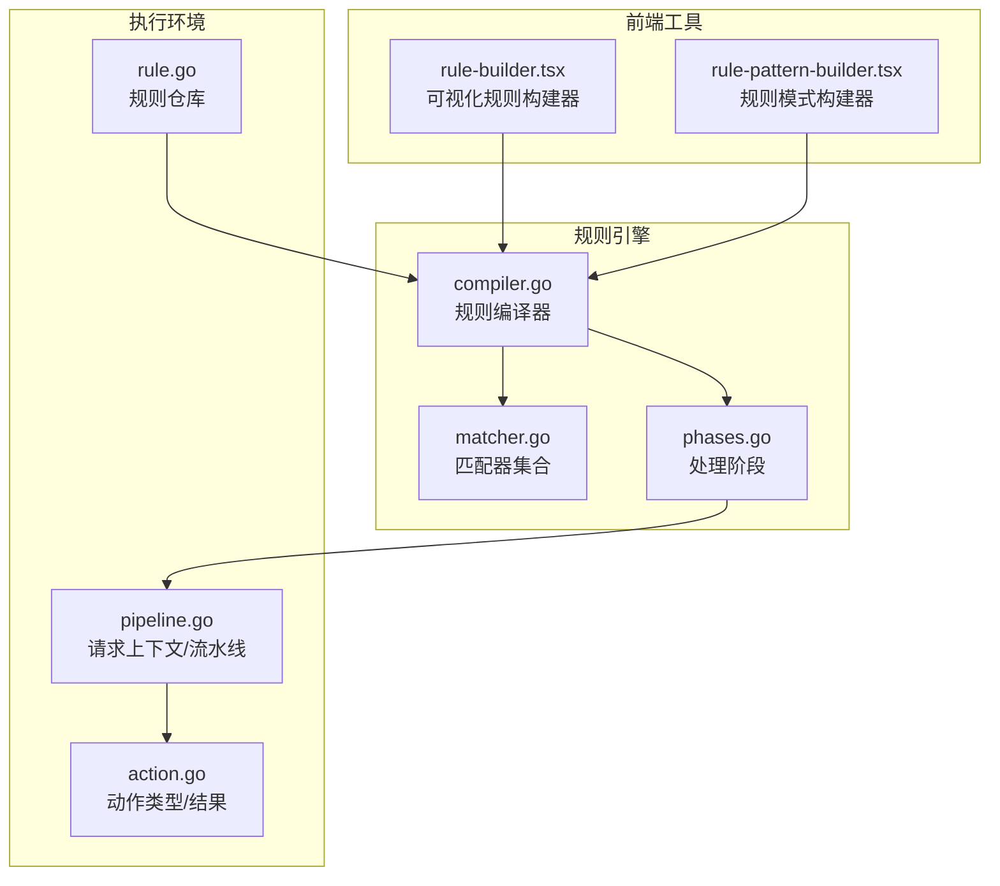
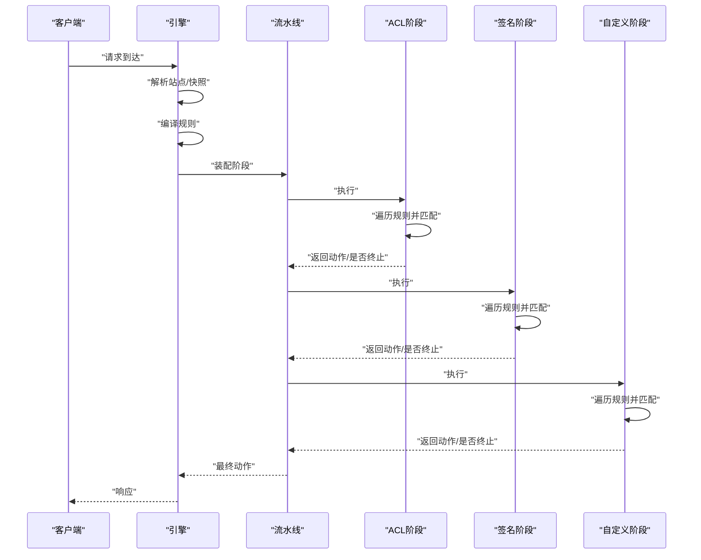
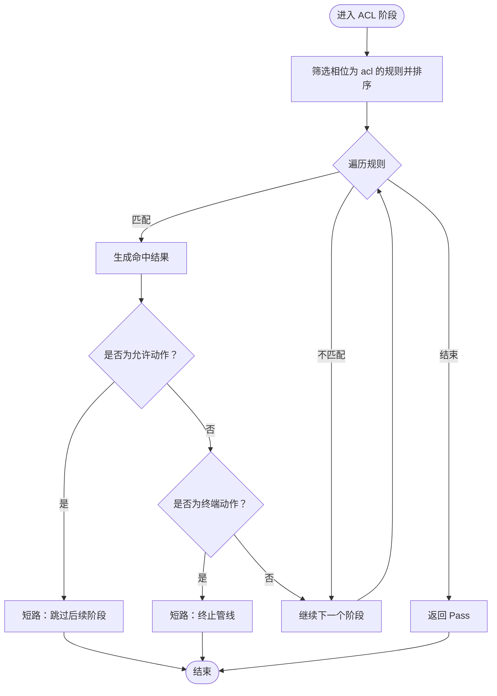
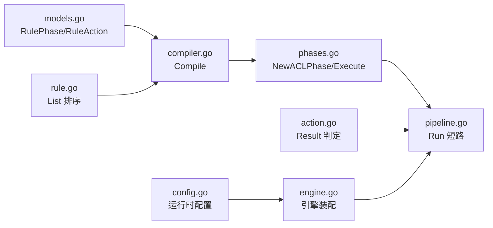

# ACL 访问控制阶段

<cite>
**本文档引用的文件**
- [phases.go](file://internal/core/rules/phases.go)
- [compiler.go](file://internal/core/rules/compiler.go)
- [matcher.go](file://internal/core/rules/matcher.go)
- [action.go](file://internal/core/action/action.go)
- [pipeline.go](file://internal/core/pipeline/pipeline.go)
- [rule.go](file://internal/store/repository/rule.go)
- [rule-builder.tsx](file://frontend/components/rule-builder.tsx)
- [rule-pattern-builder.tsx](file://frontend/components/rule-pattern-builder.tsx)
- [compiler_test.go](file://internal/core/rules/compiler_test.go)
- [matcher_test.go](file://internal/core/rules/matcher_test.go)
</cite>

## 目录
1. [简介](#简介)
2. [项目结构](#项目结构)
3. [核心组件](#核心组件)
4. [架构总览](#架构总览)
5. [详细组件分析](#详细组件分析)
6. [依赖关系分析](#依赖关系分析)
7. [性能考量](#性能考量)
8. [故障排查指南](#故障排查指南)
9. [结论](#结论)
10. [附录](#附录)

## 简介
本文件系统性阐述 OpenWAF 中"ACL 访问控制"阶段的实现原理与运行机制，覆盖规则匹配、白名单与黑名单处理、短路与终端动作、在整体处理管线中的优先级与位置、配置示例与最佳实践，以及性能优化与常见错误排查方法。目标是帮助读者从代码到实践全面掌握 ACL 阶段的设计与运维要点。

## 项目结构
ACL 阶段位于规则引擎子系统中，作为请求处理流水线的一个阶段参与整体 WAF 执行。其核心文件分布如下：
- 规则编译与匹配：compiler.go、matcher.go
- ACL 阶段实现：phases.go
- 处理管线与短路策略：pipeline.go、action.go
- 引擎装配与阶段顺序：engine.go
- 单次评估与路径/查询匹配：eval.go
- 模型与仓库：models.go、rule.go
- 运行时配置：config.go

**图表来源**
- [phases.go:57-80](file://internal/core/rules/phases.go#L57-L80)
- [compiler.go:29-59](file://internal/core/rules/compiler.go#L29-L59)
- [matcher.go:498-669](file://internal/core/rules/matcher.go#L498-L669)
- [pipeline.go:62-124](file://internal/core/pipeline/pipeline.go#L62-L124)
- [action.go:79-176](file://internal/core/action/action.go#L79-L176)

**章节来源**
- [phases.go:57-80](file://internal/core/rules/phases.go#L57-L80)
- [compiler.go:29-59](file://internal/core/rules/compiler.go#L29-L59)
- [matcher.go:498-669](file://internal/core/rules/matcher.go#L498-L669)
- [pipeline.go:62-124](file://internal/core/pipeline/pipeline.go#L62-L124)
- [action.go:79-176](file://internal/core/action/action.go#L79-L176)

## 核心组件
- 规则编译器：将存储层规则转换为已编译的运行时规则集，按优先级排序，预构建匹配器。
- 匹配器：针对具体字段（IP、路径、查询、头部、方法、内容类型等）进行高效匹配，支持正则缓存。
- 处理阶段：定义 ACL、签名、自定义、速率限制、IP信誉、机器人检测、OWASP、CVE 等阶段，按序执行。
- 引擎：整合站点解析、规则编译、阶段装配与流水线执行。
- 前端规则构建器：提供可视化与高级 DSL 编写、语法验证与简单测试。

**章节来源**
- [compiler.go:11-27](file://internal/core/rules/compiler.go#L11-L27)
- [matcher.go:12-15](file://internal/core/rules/matcher.go#L12-L15)
- [phases.go:57-80](file://internal/core/rules/phases.go#L57-L80)
- [rule-builder.tsx:14-50](file://frontend/components/rule-builder.tsx#L14-L50)
- [rule-pattern-builder.tsx:12-29](file://frontend/components/rule-pattern-builder.tsx#L12-L29)

## 架构总览
规则引擎遵循"编译期优化 + 运行期快速匹配"的设计。编译阶段完成：
- 解析规则 DSL，识别简单规则与复合 JSON 条件。
- 将规则映射为具体匹配器实例（如 CIDR、前缀、正则、头部包含/正则、精确路径、方法、内容类型、User-Agent、Body、查询参数等）。
- 对正则表达式进行缓存，避免重复编译。
- 按优先级与 ID 排序，确保稳定的执行顺序。

运行阶段在流水线中按阶段顺序执行，每个阶段遍历其规则集，命中后根据动作类型决定是否短路或继续收集观察类命中。

**图表来源**
- [phases.go:68-80](file://internal/core/rules/phases.go#L68-L80)
- [pipeline.go:78-118](file://internal/core/pipeline/pipeline.go#L78-L118)
- [action.go:92-98](file://internal/core/action/action.go#L92-L98)

## 详细组件分析

### ACL 阶段执行流程与短路机制
- 规则筛选与排序
  - 仅保留相位为 ACL 的规则，按优先级升序、ID 升序排序，保证稳定匹配顺序。
- 匹配与命中
  - 逐条规则进行匹配，命中后生成结果；若为允许动作，立即短路，跳过后续阶段。
  - 若非允许动作，依据动作是否为终端动作（拦截/丢弃）决定是否短路。
- 返回值
  - 未命中返回 Pass；命中返回对应动作结果及描述信息。

**图表来源**
- [phases.go:68-80](file://internal/core/rules/phases.go#L68-L80)
- [action.go:92-98](file://internal/core/action/action.go#L92-L98)

**章节来源**
- [phases.go:68-80](file://internal/core/rules/phases.go#L68-L80)
- [action.go:92-98](file://internal/core/action/action.go#L92-L98)

### 规则匹配机制与白名单/黑名单处理
- 匹配器类型
  - IP/CIDR 匹配器支持 IPv4/IPv6 CIDR 与单 IP；非法输入将被忽略以避免误匹配。
  - 路径/查询/头部/方法/内容类型等多维匹配器支持前缀、精确、包含与正则。
  - 复合条件（AND/OR/NOT）支持复杂业务场景组合。
- 白名单与黑名单
  - 白名单通常以 allow_ip 形式出现，命中后返回允许动作，触发短路。
  - 黑名单通常以 block_ip 形式出现，命中后返回拦截/丢弃动作，触发短路。
  - 复合 NOT 可用于"不在白名单内即阻断"的语义。
- 匹配上下文
  - ACL 阶段使用客户端 IP、方法、路径、查询串、头部映射等字段进行匹配。

**图表来源**
- [compiler.go:11-27](file://internal/core/rules/compiler.go#L11-L27)
- [matcher.go:128-132](file://internal/core/rules/matcher.go#L128-132)
- [matcher.go:134-138](file://internal/core/rules/matcher.go#L134-138)
- [matcher.go:146-150](file://internal/core/rules/matcher.go#L146-150)
- [matcher.go:158-163](file://internal/core/rules/matcher.go#L158-163)
- [matcher.go:98-124](file://internal/core/rules/matcher.go#L98-L124)

**章节来源**
- [matcher.go:128-132](file://internal/core/rules/matcher.go#L128-132)
- [matcher.go:134-138](file://internal/core/rules/matcher.go#L134-138)
- [matcher.go:146-150](file://internal/core/rules/matcher.go#L146-150)
- [matcher.go:158-163](file://internal/core/rules/matcher.go#L158-163)
- [matcher.go:98-124](file://internal/core/rules/matcher.go#L98-L124)

### 规则语法与表达式支持
- 简单规则：kind:arg
  - 支持：block_ip/allow_ip、block_path、allow_path、block_path_exact、block_path_regex、allow_path_regex、block_query_contains、block_query_regex、block_header、allow_header、block_header_regex、block_method、block_content_type、block_body_contains、block_body_regex、block_user_agent、block_user_agent_regex、query_param 等。
- 复合规则：JSON
  - {"op":"and|or|not","children":[{...},{...}]}
  - 子节点可为简单规则或嵌套复合规则。
- 变量与上下文：
  - 支持从请求上下文中提取 ClientIP、Method、Path、RawQuery、Headers 等字段参与匹配。
- 前端构建器：
  - 提供可视化选择与高级 DSL 输入，支持语法验证与简单测试。

**章节来源**
- [compiler.go:61-90](file://internal/core/rules/compiler.go#L61-L90)
- [matcher.go:498-669](file://internal/core/rules/matcher.go#L498-L669)
- [rule-builder.tsx:14-50](file://frontend/components/rule-builder.tsx#L14-L50)
- [rule-pattern-builder.tsx:12-29](file://frontend/components/rule-pattern-builder.tsx#L12-L29)

### 规则执行顺序与优先级
- 编译时排序：优先级升序，优先级相同时按 ID 升序。
- 运行时遍历：阶段内按编译顺序依次匹配，命中即停止当前阶段（Allow 短路）。
- 动作影响：Allow 短路后续阶段；Intercept 短路并记录；Observe 继续收集日志但不短路。

**章节来源**
- [compiler.go:52-57](file://internal/core/rules/compiler.go#L52-L57)
- [phases.go:68-80](file://internal/core/rules/phases.go#L68-L80)
- [action.go:92-98](file://internal/core/action/action.go#L92-L98)

### 规则编写示例与调试方法
- 示例（DSL）：
  - 简单：block_ip:192.168.1.0/24、block_path:/admin、block_method:DELETE、block_header_regex:User-Agent:(?i)scanner。
  - 复合：{"op":"and","children":[{"kind":"block_path","arg":"/admin"},{"kind":"block_method","arg":"POST"}]}。
- 调试：
  - 前端规则构建器提供"验证规则"与"测试匹配"，支持输入路径、方法、IP、查询、请求头、Body 进行简单匹配测试。
  - 后端测试用例覆盖 IP 匹配、路径正则、查询正则、复合 AND/OR/NOT、User-Agent 正则、正则缓存一致性等场景。

**章节来源**
- [rule-builder.tsx:154-163](file://frontend/components/rule-builder.tsx#L154-L163)
- [rule-builder.tsx:178-182](file://frontend/components/rule-builder.tsx#L178-L182)
- [compiler_test.go:13-48](file://internal/core/rules/compiler_test.go#L13-L48)
- [matcher_test.go:30-110](file://internal/core/rules/matcher_test.go#L30-L110)

## 依赖关系分析
- 规则相位与动作
  - 规则相位枚举包含 acl、rate_limit、owasp_default、signature、custom；动作枚举包含 allow、intercept、observe、drop。
- 规则仓库
  - 规则按优先级升序、ID 升序排序，确保匹配顺序稳定。
- 配置项
  - 运行时配置影响引擎行为（如 Drop 启用、阈值等），但不改变 ACL 的匹配逻辑。

**图表来源**
- [rule.go:24-34](file://internal/store/repository/rule.go#L24-L34)
- [compiler.go:29-59](file://internal/core/rules/compiler.go#L29-L59)
- [phases.go:61-80](file://internal/core/rules/phases.go#L61-L80)
- [pipeline.go:78-118](file://internal/core/pipeline/pipeline.go#L78-L118)
- [action.go:92-98](file://internal/core/action/action.go#L92-L98)

**章节来源**
- [rule.go:24-34](file://internal/store/repository/rule.go#L24-L34)
- [compiler.go:29-59](file://internal/core/rules/compiler.go#L29-L59)
- [phases.go:61-80](file://internal/core/rules/phases.go#L61-L80)
- [pipeline.go:78-118](file://internal/core/pipeline/pipeline.go#L78-L118)
- [action.go:92-98](file://internal/core/action/action.go#L92-L98)

## 性能考量
- 规则数量与匹配顺序
  - ACL 阶段按优先级与 ID 排序，命中即停止，建议将高命中率的规则置于靠前优先级，减少后续规则匹配开销。
- 匹配器选择
  - 使用前缀/包含匹配优于正则表达式；正则表达式采用缓存机制，但仍应避免复杂或回溯严重的模式。
- CIDR 与 IP 匹配
  - allow_ip/block_ip 使用 CIDR 匹配，建议聚合常用网段为更小的 CIDR，减少规则数量。
- 复合条件
  - AND/OR/NOT 组合会增加匹配成本，建议拆分为多个简单规则或合并为更高效的组合。
- 正则缓存
  - 正则编译结果缓存可降低重复编译开销，但无效正则会被忽略以避免误匹配。

## 故障排查指南
- 规则不生效：
  - 检查规则是否启用、阶段是否正确、优先级是否被更高优先级规则覆盖。
  - 使用前端"验证规则"确认 DSL 语法正确。
- 正则匹配异常：
  - 确认正则表达式有效；检查正则缓存是否命中同一实例。
- 匹配器未触发：
  - 核对请求字段（路径、方法、头部、查询、IP）与规则参数是否一致。
- 动作不符合预期：
  - Allow 会短路后续阶段；Intercept 会短路并记录；Observe 仅记录日志。
- 常见错误与解决：
  - 无效 IP/CIDR：编译器会回退为"不匹配"以避免误伤。
  - 无效正则：编译器会回退为"不匹配"以避免误伤。
  - 复合规则 children 为空：将被忽略或降级为简单规则。

**章节来源**
- [compiler_test.go:13-48](file://internal/core/rules/compiler_test.go#L13-L48)
- [matcher_test.go:109-220](file://internal/core/rules/matcher_test.go#L109-220)
- [matcher.go:498-669](file://internal/core/rules/matcher.go#L498-L669)

## 结论
该 ACL 规则引擎通过清晰的编译期优化与运行期高效匹配，实现了灵活、可扩展、高性能的访问控制能力。编译器负责将 DSL 转换为可执行的匹配器集合，匹配器提供丰富的字段匹配能力与正则缓存，处理阶段定义了明确的执行顺序与短路策略。前端规则构建器进一步降低了规则编写的门槛，配合完善的测试与验证机制，使规则维护与调试更加高效。

## 附录
- 规则模型与阶段常量定义参见存储模型文件。
- 前端规则构建器提供规则种类清单与 DSL 解析/构建逻辑，便于用户编写与验证规则。

**章节来源**
- [rule-builder.tsx:14-50](file://frontend/components/rule-builder.tsx#L14-L50)
- [rule-pattern-builder.tsx:12-29](file://frontend/components/rule-pattern-builder.tsx#L12-L29)