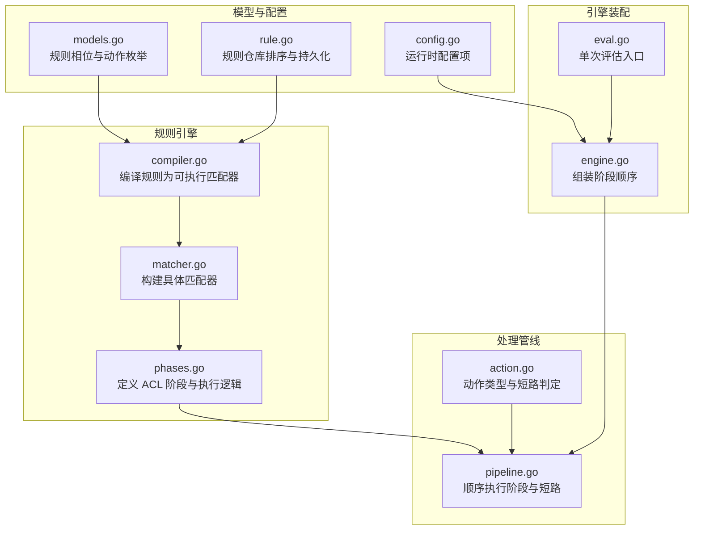
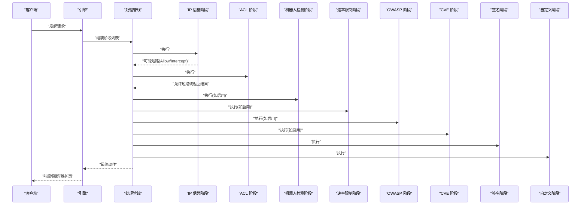
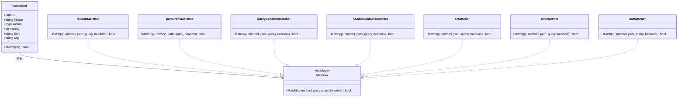
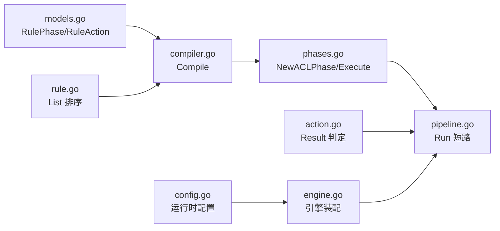

# ACL 访问控制阶段

<cite>
**本文引用的文件**
- [phases.go](file://internal/core/rules/phases.go)
- [engine.go](file://internal/core/engine/engine.go)
- [pipeline.go](file://internal/core/pipeline/pipeline.go)
- [action.go](file://internal/core/action/action.go)
- [eval.go](file://internal/waf/eval.go)
- [compiler.go](file://internal/core/rules/compiler.go)
- [matcher.go](file://internal/core/rules/matcher.go)
- [models.go](file://internal/store/models.go)
- [rule.go](file://internal/store/repository/rule.go)
- [config.go](file://internal/core/config.go)
</cite>

## 目录
1. [引言](#引言)
2. [项目结构](#项目结构)
3. [核心组件](#核心组件)
4. [架构总览](#架构总览)
5. [详细组件分析](#详细组件分析)
6. [依赖分析](#依赖分析)
7. [性能考虑](#性能考虑)
8. [故障排查指南](#故障排查指南)
9. [结论](#结论)
10. [附录](#附录)

## 引言
本文件系统性阐述 OpenWAF 中“ACL 访问控制”阶段的实现原理与运行机制，覆盖规则匹配、白名单与黑名单处理、短路与终端动作、在整体处理管线中的优先级与位置、配置示例与最佳实践，以及性能优化与常见错误排查方法。目标是帮助读者从代码到实践全面掌握 ACL 阶段的设计与运维要点。

## 项目结构
ACL 阶段位于规则引擎子系统中，作为请求处理流水线的一个阶段参与整体 WAF 执行。其核心文件分布如下：
- 规则编译与匹配：compiler.go、matcher.go
- ACL 阶段实现：phases.go
- 处理管线与短路策略：pipeline.go、action.go
- 引擎装配与阶段顺序：engine.go
- 单次评估与路径/查询匹配：eval.go
- 模型与仓库：models.go、rule.go
- 运行时配置：config.go

**图表来源**
- [compiler.go:27-55](file://internal/core/rules/compiler.go#L27-L55)
- [matcher.go:167-261](file://internal/core/rules/matcher.go#L167-L261)
- [phases.go:32-52](file://internal/core/rules/phases.go#L32-L52)
- [pipeline.go:46-70](file://internal/core/pipeline/pipeline.go#L46-L70)
- [action.go:29-61](file://internal/core/action/action.go#L29-L61)
- [engine.go:85-121](file://internal/core/engine/engine.go#L85-L121)
- [eval.go:12-20](file://internal/waf/eval.go#L12-L20)
- [models.go:44-77](file://internal/store/models.go#L44-L77)
- [rule.go:13-28](file://internal/store/repository/rule.go#L13-L28)
- [config.go:75-102](file://internal/core/config.go#L75-L102)

**章节来源**
- [phases.go:32-52](file://internal/core/rules/phases.go#L32-L52)
- [engine.go:85-121](file://internal/core/engine/engine.go#L85-L121)
- [pipeline.go:46-70](file://internal/core/pipeline/pipeline.go#L46-L70)
- [action.go:29-61](file://internal/core/action/action.go#L29-L61)

## 核心组件
- 规则编译器（Compiler）
  - 将存储层规则转换为带预构建匹配器的运行时对象，按优先级与 ID 排序，确保稳定且可预测的匹配顺序。
- 匹配器（Matcher）
  - 支持复合条件（AND/OR/NOT）、CIDR/IP、路径前缀/精确匹配、查询串包含/正则、头部包含/正则、方法、内容类型、UA 等多种匹配维度。
- ACL 阶段（Phase）
  - 遍历已编译规则，命中即返回结果；若为允许动作，则短路跳过后续阶段；否则根据是否为终端动作决定是否继续。
- 处理管线（Pipeline）
  - 顺序执行各阶段；遇到 Drop 或终端动作立即短路；收集观察类命中用于日志。
- 动作系统（Action）
  - 定义 Allow/Intercept/Observe/Drop，并提供短路与日志判定逻辑。
- 引擎装配（Engine）
  - 组装阶段顺序，确保 IP 白名单优先短路、ACL 在 IP 黑名单之后、签名与自定义规则在其后执行。
- 单次评估（Evaluate）
  - 提供仅 ACL 与路径/查询匹配的快速评估入口，便于测试与调试。

**章节来源**
- [compiler.go:27-55](file://internal/core/rules/compiler.go#L27-L55)
- [matcher.go:167-261](file://internal/core/rules/matcher.go#L167-L261)
- [phases.go:32-52](file://internal/core/rules/phases.go#L32-L52)
- [pipeline.go:46-70](file://internal/core/pipeline/pipeline.go#L46-L70)
- [action.go:29-61](file://internal/core/action/action.go#L29-L61)
- [engine.go:85-121](file://internal/core/engine/engine.go#L85-L121)
- [eval.go:12-20](file://internal/waf/eval.go#L12-L20)

## 架构总览
ACL 阶段在整体处理管线中的位置与优先级如下：
- 维护模式检查通过后，先执行 IP 信誉（白名单短路、黑名单阻断），再执行 ACL。
- ACL 命中允许动作时，直接短路，不再进入后续阶段。
- ACL 命中拦截或丢弃动作时，同样短路，不再进入后续阶段。
- 其他阶段（机器人检测、速率限制、OWASP、CVE、签名、自定义）按引擎装配顺序依次执行。

**图表来源**
- [engine.go:85-121](file://internal/core/engine/engine.go#L85-L121)
- [pipeline.go:46-70](file://internal/core/pipeline/pipeline.go#L46-L70)
- [phases.go:32-52](file://internal/core/rules/phases.go#L32-L52)

**章节来源**
- [engine.go:85-121](file://internal/core/engine/engine.go#L85-L121)
- [pipeline.go:46-70](file://internal/core/pipeline/pipeline.go#L46-L70)

## 详细组件分析

### ACL 阶段执行流程与短路机制
- 规则筛选与排序
  - 仅保留相位为 ACL 的规则，按优先级升序、ID 升序排序，保证稳定匹配顺序。
- 匹配与命中
  - 逐条规则进行匹配，命中后生成结果；若为允许动作，立即短路，跳过后续阶段。
  - 若非允许动作，依据动作是否为终端动作（拦截/丢弃）决定是否短路。
- 返回值
  - 未命中返回 Pass；命中返回对应动作结果及描述信息。

**图表来源**
- [phases.go:32-52](file://internal/core/rules/phases.go#L32-L52)
- [action.go:40-57](file://internal/core/action/action.go#L40-L57)

**章节来源**
- [phases.go:32-52](file://internal/core/rules/phases.go#L32-L52)
- [action.go:40-57](file://internal/core/action/action.go#L40-L57)

### 规则匹配机制与白名单/黑名单处理
- 匹配器类型
  - IP/CIDR 匹配器支持 IPv4/IPv6 CIDR 与单 IP；非法输入将被忽略以避免误匹配。
  - 路径/查询/头部/方法/内容类型等多维匹配器支持前缀、精确、包含与正则。
  - 复合条件（AND/OR/NOT）支持复杂业务场景组合。
- 白名单与黑名单
  - 白名单通常以 allow_ip 形式出现，命中后返回允许动作，触发短路。
  - 黑名单通常以 block_ip 形式出现，命中后返回拦截/丢弃动作，触发短路。
  - 复合 NOT 可用于“不在白名单内即阻断”的语义。
- 匹配上下文
  - ACL 阶段使用客户端 IP、方法、路径、查询串、头部映射等字段进行匹配。

**图表来源**
- [compiler.go:11-25](file://internal/core/rules/compiler.go#L11-L25)
- [matcher.go:48-133](file://internal/core/rules/matcher.go#L48-L133)
- [matcher.go:18-44](file://internal/core/rules/matcher.go#L18-L44)

**章节来源**
- [compiler.go:27-55](file://internal/core/rules/compiler.go#L27-L55)
- [matcher.go:167-261](file://internal/core/rules/matcher.go#L167-L261)
- [matcher.go:298-343](file://internal/core/rules/matcher.go#L298-L343)

### ACL 在整体处理管道中的作用与优先级
- 阶段顺序
  - IP 信誉（白名单短路、黑名单阻断）→ ACL → 机器人检测 → 速率限制 → OWASP → CVE → 签名 → 自定义。
- 短路行为
  - ACL 的允许动作会短路，阻止进入后续阶段。
  - ACL 的拦截/丢弃动作也会短路，阻止进入后续阶段。
- 与维护模式的关系
  - 维护模式检查在 ACL 之前执行，若处于维护状态，直接返回维护动作，不进入 ACL。

**章节来源**
- [engine.go:85-121](file://internal/core/engine/engine.go#L85-L121)
- [pipeline.go:46-70](file://internal/core/pipeline/pipeline.go#L46-L70)

### 单次评估与路径/查询匹配
- 单次评估入口
  - Evaluate/EvaluateWithBot 首先尝试 ACL，然后尝试路径/查询匹配（签名与自定义规则），最后返回结果。
- 路径/查询匹配
  - 支持路径前缀、查询串包含等简单规则；复杂场景建议使用 ACL 阶段的复合条件。

**章节来源**
- [eval.go:12-20](file://internal/waf/eval.go#L12-L20)
- [eval.go:116-145](file://internal/waf/eval.go#L116-L145)

## 依赖分析
- 规则相位与动作
  - 规则相位枚举包含 acl、rate_limit、owasp_default、signature、custom；动作枚举包含 allow、intercept、observe、drop。
- 规则仓库
  - 规则按优先级升序、ID 升序排序，确保匹配顺序稳定。
- 配置项
  - 运行时配置影响引擎行为（如 Drop 启用、阈值等），但不改变 ACL 的匹配逻辑。

**图表来源**
- [models.go:44-77](file://internal/store/models.go#L44-L77)
- [rule.go:13-28](file://internal/store/repository/rule.go#L13-L28)
- [compiler.go:27-55](file://internal/core/rules/compiler.go#L27-L55)
- [phases.go:32-52](file://internal/core/rules/phases.go#L32-L52)
- [pipeline.go:46-70](file://internal/core/pipeline/pipeline.go#L46-L70)
- [action.go:40-57](file://internal/core/action/action.go#L40-L57)
- [engine.go:85-121](file://internal/core/engine/engine.go#L85-L121)
- [config.go:75-102](file://internal/core/config.go#L75-L102)

**章节来源**
- [models.go:44-77](file://internal/store/models.go#L44-L77)
- [rule.go:13-28](file://internal/store/repository/rule.go#L13-L28)
- [compiler.go:27-55](file://internal/core/rules/compiler.go#L27-L55)
- [phases.go:32-52](file://internal/core/rules/phases.go#L32-L52)
- [pipeline.go:46-70](file://internal/core/pipeline/pipeline.go#L46-L70)
- [action.go:40-57](file://internal/core/action/action.go#L40-L57)
- [engine.go:85-121](file://internal/core/engine/engine.go#L85-L121)
- [config.go:75-102](file://internal/core/config.go#L75-L102)

## 性能考虑
- 规则数量与匹配顺序
  - ACL 阶段按优先级与 ID 排序，命中即停止，建议将高命中率的规则置于靠前优先级，减少后续规则匹配开销。
- 匹配器选择
  - 使用前缀/包含匹配优于正则表达式；正则表达式采用缓存机制，但仍应避免复杂或回溯严重的模式。
- CIDR 与 IP 匹配
  - allow_ip/block_ip 使用 CIDR 匹配，建议聚合常用网段为更小的 CIDR，减少规则数量。
- 复合条件
  - AND/OR/NOT 组合会增加匹配成本，建议拆分为多个简单规则或合并为更高效的组合。
- 正则缓存
  - 正则编译结果缓存可降低重复编译开销，但无效正则会被忽略以避免误匹配。

[本节为通用性能指导，无需特定文件引用]

## 故障排查指南
- 规则未生效
  - 确认规则相位为 acl，且启用状态为启用。
  - 检查规则优先级与 ID 是否导致匹配顺序异常。
  - 参考：规则枚举与排序逻辑。
- 白名单未生效
  - 确认 allow_ip 的 IP/CIDR 格式正确；非法格式将被忽略。
  - 检查是否存在更高优先级的 block_ip 规则导致被阻断。
- 黑名单误判
  - 检查 block_ip 的 CIDR 是否过大；建议缩小范围或拆分规则。
  - 确认没有复合 NOT 导致逻辑反转。
- 复合规则不匹配
  - 检查 JSON 结构是否符合 AND/OR/NOT 语法；非法 JSON 将被忽略。
- 动作未短路
  - 确认动作类型为 Allow/Intercept/Drop；只有终端动作才会短路。
  - 检查是否被后续阶段覆盖（例如 IP 信誉阶段的 Allow 已短路）。
- 维护模式干扰
  - 若处于全局或站点维护模式，将直接返回维护动作，不会进入 ACL。

**章节来源**
- [models.go:44-77](file://internal/store/models.go#L44-L77)
- [rule.go:13-28](file://internal/store/repository/rule.go#L13-L28)
- [matcher.go:167-261](file://internal/core/rules/matcher.go#L167-L261)
- [matcher.go:298-343](file://internal/core/rules/matcher.go#L298-L343)
- [action.go:40-57](file://internal/core/action/action.go#L40-L57)
- [engine.go:85-121](file://internal/core/engine/engine.go#L85-L121)

## 结论
ACL 阶段通过“规则编译—匹配器—阶段执行—短路判定”的清晰链路，实现了灵活而高效的访问控制能力。其在引擎装配中的优先级确保了白名单的快速短路与黑名单的严格阻断，同时与其他阶段协同工作，形成完整的安全防护体系。遵循本文的配置与优化建议，可显著提升 ACL 的准确性与性能。

[本节为总结性内容，无需特定文件引用]

## 附录

### ACL 规则配置示例与最佳实践
- 示例一：允许特定网段访问
  - 相位：acl
  - 模式：allow_ip:192.168.1.0/24
  - 动作：allow
  - 最佳实践：将高优先级的白名单规则置于靠前优先级，避免被后续规则覆盖。
- 示例二：阻断特定网段
  - 相位：acl
  - 模式：block_ip:10.0.0.0/8
  - 动作：intercept
  - 最佳实践：使用较小的 CIDR，避免误伤。
- 示例三：基于复合条件的阻断
  - 相位：acl
  - 模式：{"op":"not","children":[{"kind":"allow_ip","arg":"10.0.0.0/8"}]}
  - 动作：intercept
  - 最佳实践：明确逻辑意图，避免过度嵌套。
- 示例四：路径/查询阻断（ACL 之外）
  - 相位：signature/custom
  - 模式：block_path:/admin 或 block_query_contains:debug
  - 动作：intercept
  - 最佳实践：复杂场景优先使用 ACL 的复合条件。

**章节来源**
- [compiler.go:57-82](file://internal/core/rules/compiler.go#L57-L82)
- [matcher.go:167-261](file://internal/core/rules/matcher.go#L167-L261)
- [models.go:44-77](file://internal/store/models.go#L44-L77)