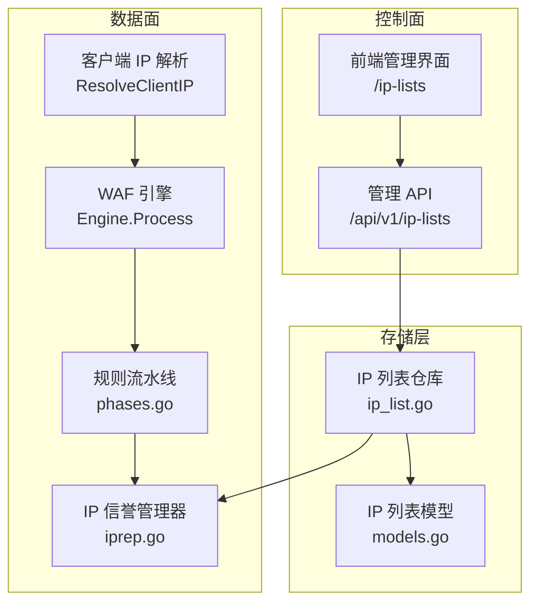
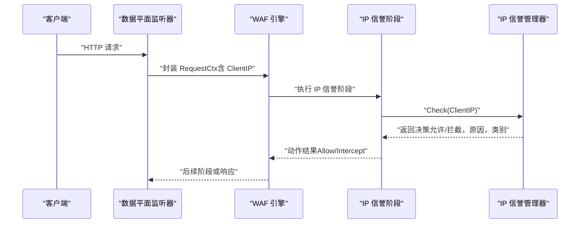
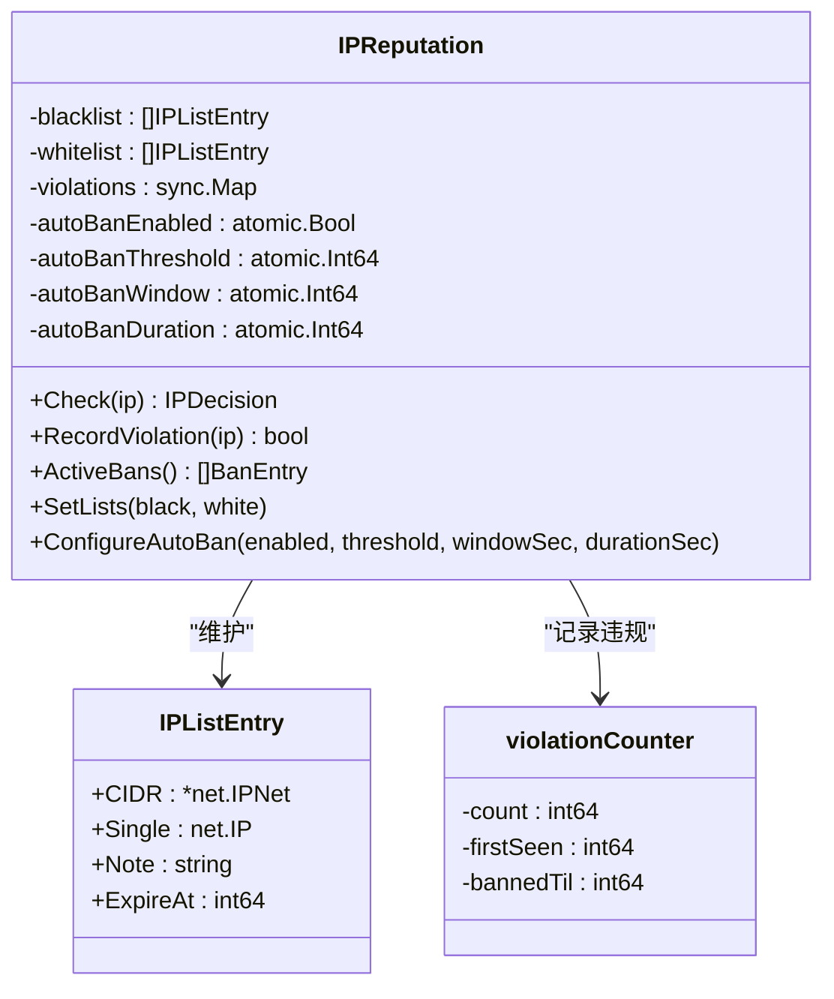
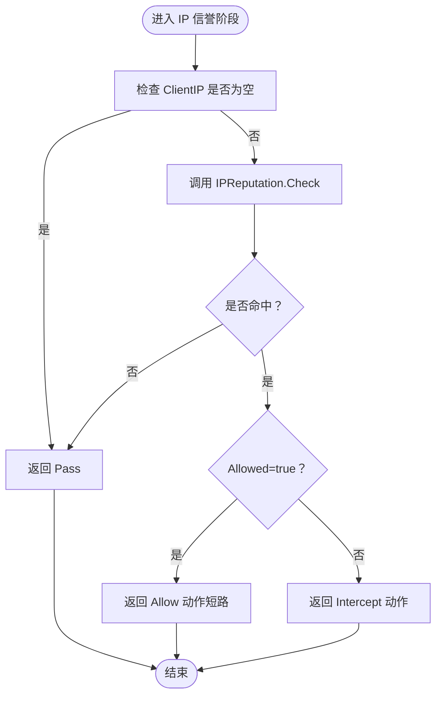
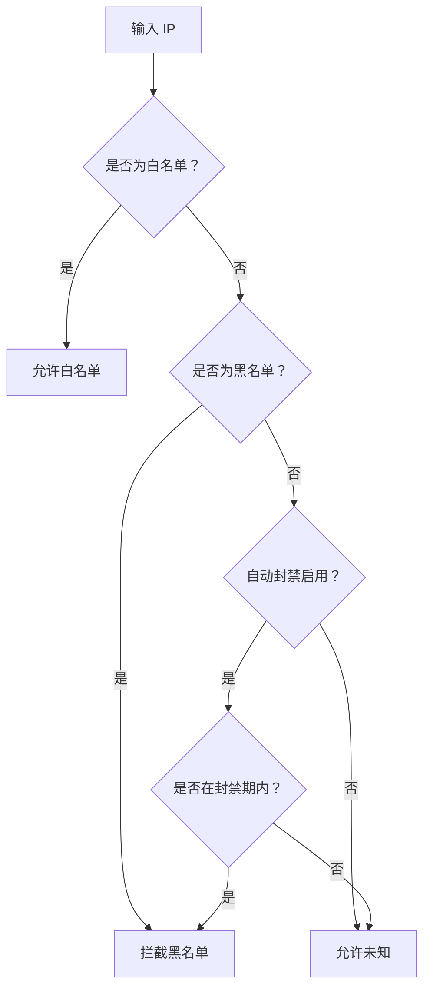
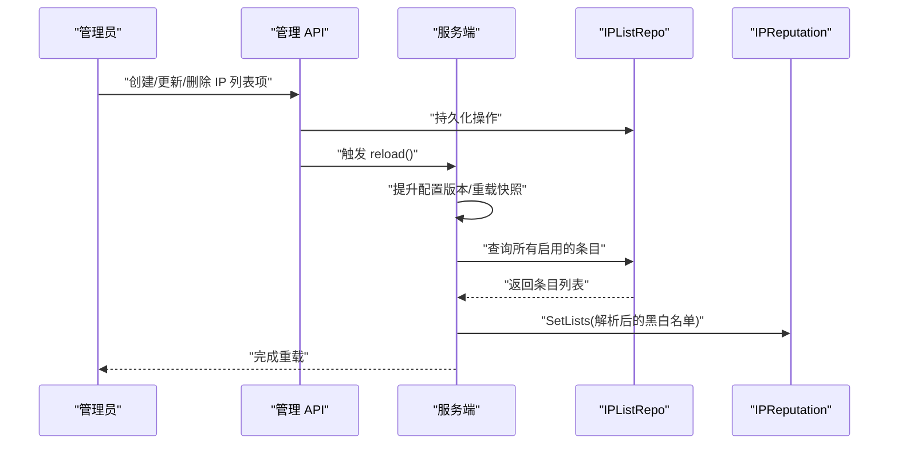
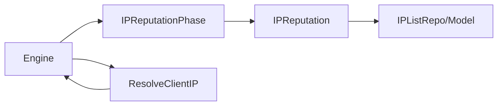

# IP 信誉检查阶段

<cite>
**本文档引用的文件**
- [iprep.go](file://internal/waf/iprep.go)
- [iprep_test.go](file://internal/waf/iprep_test.go)
- [phases.go](file://internal/core/rules/phases.go)
- [ip_list.go](file://internal/store/repository/ip_list.go)
- [server.go](file://internal/app/server.go)
- [clientip.go](file://internal/security/clientip.go)
- [bot.go](file://internal/waf/bot.go)
- [drop_event.go](file://internal/store/repository/drop_event.go)
</cite>

## 目录
1. [简介](#简介)
2. [项目结构](#项目结构)
3. [核心组件](#核心组件)
4. [架构概览](#架构概览)
5. [详细组件分析](#详细组件分析)
6. [依赖关系分析](#依赖关系分析)
7. [性能考虑](#性能考虑)
8. [故障排除指南](#故障排除指南)
9. [结论](#结论)
10. [附录](#附录)

## 简介
本文件聚焦于 My-OpenWaf 中的 IP 信誉检查阶段，系统性阐述其架构设计、数据来源与处理流程、白名单/黑名单/正常流量的判定逻辑、自动封禁机制、实时性与准确性保障、数据更新策略与缓存优化，以及配置方法与故障恢复机制。该阶段作为 WAF 处理流水线的首要环节，负责基于预置列表与动态违规统计快速做出允许或拦截决策。

## 项目结构
IP 信誉检查涉及以下关键模块：
- 内核层：IP 信誉管理器（内存存储 + 原子配置）
- 规则层：IP 信誉阶段（流水线中的独立阶段）
- 存储层：IP 黑/白名单持久化与查询
- 控制面：管理员接口用于维护列表与触发热重载
- 数据平面：请求入口解析客户端 IP 并驱动信誉检查
- 引擎层：编排信誉阶段与其他保护阶段的执行顺序

**图表来源**
- [server.go:312-333](file://internal/app/server.go#L312-L333)
- [clientip.go:13-49](file://internal/security/clientip.go#L13-L49)
- [phases.go:130-170](file://internal/core/rules/phases.go#L130-L170)
- [iprep.go:19-54](file://internal/waf/iprep.go#L19-L54)

**章节来源**
- [server.go:312-333](file://internal/app/server.go#L312-L333)
- [clientip.go:13-49](file://internal/security/clientip.go#L13-L49)
- [phases.go:130-170](file://internal/core/rules/phases.go#L130-L170)
- [iprep.go:19-54](file://internal/waf/iprep.go#L19-L54)

## 核心组件
- IPReputation：内存中的信誉管理器，维护黑白名单与自动封禁状态，支持并发读写与原子配置更新。
- IPReputationPhase：规则流水线中的独立阶段，负责调用 IPReputation 执行检查并生成动作结果。
- IPListRepo/Model：持久化存储黑/白名单条目，支持分页查询、启用筛选与 CRUD 操作。
- 客户端 IP 解析：根据 X-Forwarded-For 与可信网段策略解析真实客户端 IP。
- 引擎与流水线：在引擎初始化时将 IP 信誉阶段置于 ACL 阶段之后，确保白名单短路放行、黑名单直接拦截。

**章节来源**
- [iprep.go:19-124](file://internal/waf/iprep.go#L19-L124)
- [phases.go:130-170](file://internal/core/rules/phases.go#L130-L170)
- [ip_list.go:13-42](file://internal/store/repository/ip_list.go#L13-L42)
- [clientip.go:13-49](file://internal/security/clientip.go#L13-L49)

## 架构概览
IP 信誉检查在请求处理流水线中的位置如下：

**图表来源**
- [phases.go:142-170](file://internal/core/rules/phases.go#L142-L170)
- [iprep.go:90-124](file://internal/waf/iprep.go#L90-L124)

## 详细组件分析

### IPReputation 组件
- 数据结构
  - 黑名单/白名单：IPListEntry 数组，支持单 IP 与 CIDR 匹配，并可设置过期时间。
  - 违规计数器：按 IP 聚合，记录首次出现时间、累计次数与封禁截止时间。
  - 自动封禁参数：阈值、窗口秒数、封禁持续秒数，均通过原子变量支持运行时调整。
- 关键方法
  - Check：按白名单 → 黑名单 → 自动封禁顺序判定；命中即返回对应决策。
  - RecordViolation：在自动封禁开启时记录违规，超过阈值且未被封禁则设置封禁截止时间。
  - ActiveBans：枚举当前生效的封禁条目。
  - SetLists/ConfigureAutoBan：并发安全地更新列表与配置。
- 并发与清理
  - 读多写少场景使用 RWMutex；违规计数器内部使用互斥锁。
  - 后台定时器定期清理过期封禁（封禁已过期且超过 1 小时未活动）。

**图表来源**
- [iprep.go:19-54](file://internal/waf/iprep.go#L19-L54)
- [iprep.go:10-16](file://internal/waf/iprep.go#L10-L16)
- [iprep.go:37-42](file://internal/waf/iprep.go#L37-L42)

**章节来源**
- [iprep.go:19-124](file://internal/waf/iprep.go#L19-L124)
- [iprep.go:126-180](file://internal/waf/iprep.go#L126-L180)
- [iprep.go:182-193](file://internal/waf/iprep.go#L182-L193)

### IP 信誉阶段（规则流水线）
- 执行逻辑
  - 若 ClientIP 为空或信誉管理器为空，直接 Pass。
  - 调用 Check 返回决策；若未匹配，Pass；若 Allowed=true，返回 Allow 动作并短路后续阶段；否则返回 Intercept 动作。
- 结果映射
  - 白名单：Category=whitelist，MatchDesc="whitelist: 原因"。
  - 黑名单/自动封禁：Category=blacklist/auto_ban，MatchDesc="类别: 原因"，RuleIDStr="iprep:类别"。

**图表来源**
- [phases.go:142-170](file://internal/core/rules/phases.go#L142-L170)
- [iprep.go:90-124](file://internal/waf/iprep.go#L90-L124)

**章节来源**
- [phases.go:130-170](file://internal/core/rules/phases.go#L130-L170)

### 黑/白名单与自动封禁处理逻辑
- 白名单优先级最高：命中即允许，Matched=true，Category=whitelist。
- 黑名单次之：命中即拦截，Matched=true，Category=blacklist。
- 自动封禁：仅在自动封禁启用时检查；若命中且仍在封禁期内，则拦截，Category=auto_ban。
- 未知 IP：返回 Allowed=true，Matched=false。

**图表来源**
- [iprep.go:90-124](file://internal/waf/iprep.go#L90-L124)

**章节来源**
- [iprep.go:90-124](file://internal/waf/iprep.go#L90-L124)

### 客户端 IP 解析与 XFF 处理
- 支持三种模式：
  - strip_all_and_set_remote：直接使用远端地址。
  - trust_outer_waf_cidr_then_take_leftmost：当远端在可信网段内时，从 X-Forwarded-For 取最左侧有效 IP。
- 解析失败或不可信时回退到直连地址。

**章节来源**
- [clientip.go:13-49](file://internal/security/clientip.go#L13-L49)

### 数据来源与更新策略
- 数据来源
  - 黑/白名单来自数据库表 IPListEntry，字段包含类型(kind)、值(value)、备注(note)、启用状态(enabled)。
- 更新策略
  - 管理员通过前端页面或 API 创建/更新/删除条目后，调用 reload 函数触发热重载。
  - 服务端在 reload 中：
    - 提升配置版本并重新加载快照。
    - 重新配置请求/错误速率限制与自动封禁参数。
    - 从仓库加载所有启用的条目，解析为 IPListEntry 并注入 IPReputation。
    - 通知其他节点通过 Redis Pub/Sub 同步重载。

**图表来源**
- [server.go:220-242](file://internal/app/server.go#L220-L242)
- [server.go:312-333](file://internal/app/server.go#L312-L333)
- [ip_list.go:13-42](file://internal/store/repository/ip_list.go#L13-L42)

**章节来源**
- [server.go:220-242](file://internal/app/server.go#L220-L242)
- [server.go:312-333](file://internal/app/server.go#L312-L333)

### 自动封禁算法与准确性保证
- 计数窗口：以首次违规时间为基准，超出窗口则重置计数。
- 触发条件：在封禁期内未达到阈值前，累计次数达到阈值即封禁。
- 封禁截止时间：当前时间 + 持续秒数。
- 清理策略：后台定时器每 5 分钟清理过期封禁（封禁已过期且距首次违规超过 1 小时）。
- 与 Bot 检测联动：恶意工具识别会调用 RecordViolation 记录违规，从而触发自动封禁。

**章节来源**
- [iprep.go:126-155](file://internal/waf/iprep.go#L126-L155)
- [iprep.go:210-232](file://internal/waf/iprep.go#L210-L232)

### 与 Bot 检测的协同
- 在两阶段 Bot 流程中，PreScreen 会检查 IP 信誉（黑名单/自动封禁），若命中则直接进入深度评分。
- 深度评分阶段会将 IP 信誉结果纳入总分计算，影响最终风险等级与处置动作。

**章节来源**
- [bot.go:136-161](file://internal/waf/bot.go#L136-L161)
- [bot.go:205-223](file://internal/waf/bot.go#L205-L223)

## 依赖关系分析
- 引擎将 IP 信誉阶段置于 ACL 阶段之后，确保白名单短路放行、黑名单直接拦截。
- IP 信誉阶段依赖 IPReputation；IPReputation 依赖 IPListRepo 的数据源。
- 客户端 IP 解析依赖站点配置（XFF 模式与可信网段）。

**图表来源**
- [phases.go:136-138](file://internal/core/rules/phases.go#L136-L138)
- [iprep.go:61-66](file://internal/waf/iprep.go#L61-L66)
- [clientip.go:13-49](file://internal/security/clientip.go#L13-L49)

**章节来源**
- [phases.go:136-138](file://internal/core/rules/phases.go#L136-L138)
- [iprep.go:61-66](file://internal/waf/iprep.go#L61-L66)
- [clientip.go:13-49](file://internal/security/clientip.go#L13-L49)

## 性能考虑
- 查询复杂度
  - 黑/白名单匹配：O(N) 遍历数组，N 为列表长度；可通过更细粒度的 CIDR 分片或外部索引优化（建议）。
  - 自动封禁查询：sync.Map + 字符串键查找，平均 O(1)，受并发访问影响较小。
- 并发控制
  - 读多写少场景采用 RWMutex；违规计数器内部加锁，避免竞争。
- 内存占用
  - 黑/白名单常驻内存；建议控制条目数量与 CIDR 覆盖范围，避免过度碎片化。
- 实时性
  - 热重载通过 reload 与 Redis Pub/Sub 实现近实时生效。
- 缓存优化建议
  - 对热点 IP 的匹配结果进行 LRU 缓存（需评估命中率与内存成本）。
  - 将 CIDR 表按前缀长度分桶，减少逐项 Contains 检查开销。

## 故障排除指南
- 常见问题
  - XFF 解析异常导致 ClientIP 错误：检查站点 XFF 模式与可信网段配置。
  - 列表未生效：确认 reload 是否成功、数据库 enabled 字段是否正确、解析函数是否返回有效条目。
  - 自动封禁未触发：检查自动封禁开关、阈值、窗口与持续时间配置。
  - 封禁未清理：检查后台定时器是否运行、过期条件是否满足。
- 监控指标
  - 24 小时内各来源拦截统计，其中 by_ip_reputation 可反映信誉阶段拦截量。
- 排查步骤
  - 使用 ActiveBans 获取当前生效封禁列表，确认封禁截止时间与计数。
  - 查看 DropEvent 统计，定位信誉阶段拦截占比与趋势。

**章节来源**
- [drop_event.go:65-76](file://internal/store/repository/drop_event.go#L65-L76)
- [iprep.go:163-180](file://internal/waf/iprep.go#L163-L180)

## 结论
IP 信誉检查阶段通过简洁高效的内存数据结构与原子配置，实现了对白名单短路放行、黑名单直接拦截与自动封禁的统一处理。结合 XFF 解析与热重载机制，系统在保证实时性的同时具备良好的可运维性。建议在高并发场景下引入缓存与索引优化，并持续监控封禁统计与拦截趋势以提升整体防护效果。

## 附录

### 配置最佳实践
- 自动封禁配置建议

| 使用场景 | 阈值 | 窗口(秒) | 持续时间(秒) | 说明 |
|----------|------|----------|--------------|------|
| 开发环境 | 3-5 | 60 | 300 | 快速响应，便于测试 |
| 生产环境 | 10-20 | 60-120 | 3600-7200 | 平衡安全性和用户体验 |
| 高风险环境 | 5-10 | 30-60 | 7200-14400 | 更严格的防护策略 |

- IP 地址管理建议
  - 白名单配置：仅包含受信任的源 IP，使用最小权限原则，定期审查和更新。
  - 黑名单配置：基于威胁情报更新，包含已知恶意 IP 和网段，设置合理的过期时间。
  - CIDR 使用建议：优先使用更精确的网段，避免使用过于宽泛的网段，定期优化网段范围。

### API 使用示例
- 基本使用流程
  - 创建 IP 信誉实例
  - 配置自动封禁
  - 设置黑白名单
  - 检查 IP
  - 记录违规

- 配置管理
  - 通过 API 管理 IP 列表，支持分页查询、启用筛选与 CRUD 操作。

**章节来源**
- [iprep.go:44-79](file://internal/waf/iprep.go#L44-L79)
- [ip_list.go:13-42](file://internal/store/repository/ip_list.go#L13-L42)