# OWASP 默认检测阶段

<cite>
**本文档引用的文件**
- [internal/waf/owasp/owasp.go](file://internal/waf/owasp/owasp.go)
- [internal/waf/owasp/owasp_extended.go](file://internal/waf/owasp/owasp_extended.go)
- [internal/waf/owasp/owasp_registry.go](file://internal/waf/owasp/owasp_registry.go)
- [internal/waf/owasp/base64sqli_test.go](file://internal/waf/owasp/base64sqli_test.go)
- [internal/waf/owasp/blazetest_test.go](file://internal/waf/owasp/blazetest_test.go)
- [internal/waf/owasp/owasp_test.go](file://internal/waf/owasp/owasp_test.go)
- [docs/安全防护功能/OWASP 检测/OWASP 检测.md](file://docs/安全防护功能/OWASP 检测/OWASP 检测.md)
- [docs/安全防护功能/OWASP 检测/基本 OWASP 规则.md](file://docs/安全防护功能/OWASP 检测/基本 OWASP 规则.md)
- [docs/安全防护功能/OWASP 检测/检测算法与技术.md](file://docs/安全防护功能/OWASP 检测/检测算法与技术.md)
- [docs/安全防护功能/OWASP 检测/配置与管理.md](file://docs/安全防护功能/OWASP 检测/配置与管理.md)
</cite>

## 目录
1. [简介](#简介)
2. [项目结构](#项目结构)
3. [核心组件](#核心组件)
4. [架构总览](#架构总览)
5. [详细组件分析](#详细组件分析)
6. [依赖分析](#依赖分析)
7. [性能考量](#性能考量)
8. [故障排查指南](#故障排查指南)
9. [结论](#结论)
10. [附录](#附录)

## 简介
本文件系统化梳理 My-OpenWaf 的 OWASP 默认检测阶段，覆盖 OWASP Top 10 常见攻击类型的检测规则与实现，包括 SQL 注入、XSS、命令注入、路径穿越、服务器端请求伪造（SSRF）等。文档重点阐述：
- 规则分类与优先级（基础规则与扩展规则）
- 检测精度优化策略（误报抑制、阈值控制、输入归一化）
- 规则更新与维护机制（新增规则、阈值调整、规则组合）
- 配置示例与调试方法（敏感度、阈值、动作）
- 与其他安全机制的协同（ACL、Bot、CVE、速率限制）

## 项目结构
My-OpenWaf 采用"控制面 + 数据面"的双服务器架构，OWASP 检测位于数据面处理管线中，通过规则编译器与流水线阶段共同完成请求拦截与放行决策。

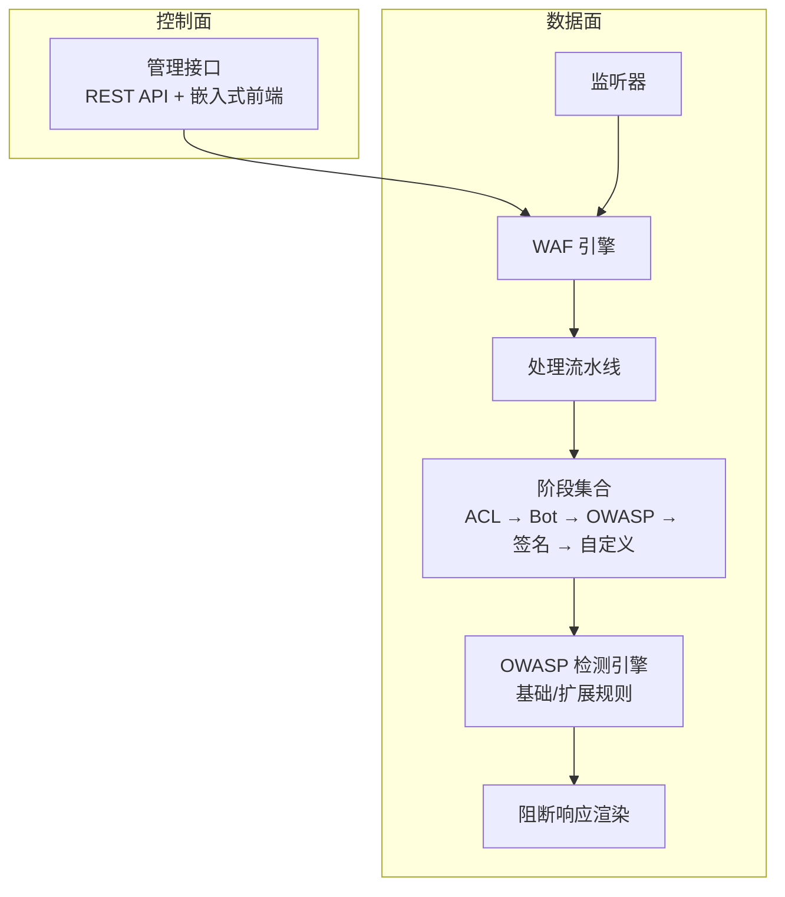

**图表来源**
- [docs/安全防护功能/OWASP 检测/OWASP 检测.md:43-62](file://docs/安全防护功能/OWASP 检测/OWASP 检测.md#L43-L62)

**章节来源**
- [docs/安全防护功能/OWASP 检测/OWASP 检测.md:39-73](file://docs/安全防护功能/OWASP 检测/OWASP 检测.md#L39-L73)

## 核心组件
- OWASP 默认检测阶段：负责扫描路径、查询串、头部、表单/JSON/Multipart 字段等，支持上传文件名与内容类型校验。
- OWASP 扩展检测：针对 SSRF、命令注入、XXE、LDAP 注入、NoSQL 注入、模板注入、JNDI/Log4Shell、CRLF、表达式语言注入、反序列化、协议违规等专项规则。
- 规则编译与匹配：基于 DSL 的规则解析与缓存，支持复合条件（and/or/not）。
- 流水线与引擎：按固定顺序执行各阶段，首个拦截结果短路后续阶段；支持 ACL 白名单直接放行。
- 阻断页面渲染：根据站点运行时配置或全局默认模板生成阻断页。

**章节来源**
- [docs/安全防护功能/OWASP 检测/OWASP 检测.md:74-86](file://docs/安全防护功能/OWASP 检测/OWASP 检测.md#L74-L86)

## 架构总览
OWASP 检测在数据面以"OWASP 默认阶段"为核心，结合"扩展规则子系统"，在请求进入上游前完成多层过滤与评分。整体流程如下：

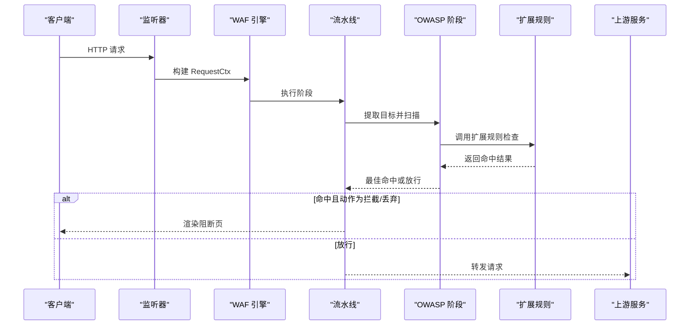

**图表来源**
- [docs/安全防护功能/OWASP 检测/OWASP 检测.md:89-117](file://docs/安全防护功能/OWASP 检测/OWASP 检测.md#L89-L117)

## 详细组件分析

### OWASP 默认阶段（基础规则）
- 目标收集：路径、查询串、头部（过滤标准头）、Cookie 值（剔除可能的会话标识）、Referer 查询串与片段。
- 输入归一化：多轮 URL 解码、HTML 实体解码、JS 转义解码、UTF-7 解码、SQL 注释剥离、空白折叠、大小写统一。
- 快速通道：纯字母数字 + 安全字符的字符串跳过正则扫描；超长目标截断；重编码深度检测后二次扫描。
- 敏感度阈值：低/中/高三档，分别对应不同阈值，用于聚合评分与命中判定。
- 命中后动作：依据站点保护配置选择拦截或丢弃。

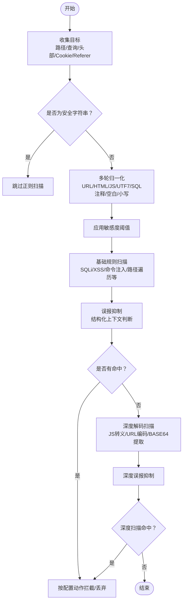

**图表来源**
- [docs/安全防护功能/OWASP 检测/OWASP 检测.md:128-149](file://docs/安全防护功能/OWASP 检测/OWASP 检测.md#L128-L149)

**章节来源**
- [docs/安全防护功能/OWASP 检测/OWASP 检测.md:119-155](file://docs/安全防护功能/OWASP 检测/OWASP 检测.md#L119-L155)

### OWASP 扩展阶段（专项规则）
- SSRF：云元数据地址、私有/回环地址、本地套接字、文件/字典/LDAP 等方案、十进制/八进制/十六进制编码 IP、IPv6 映射、IMDSv2 头、Unix 套接字等。
- 命令注入：管道/分号/反引号/$() 链接、重定向、环境变量赋值、IFS 空白绕过、管道连接、Here-string、ANSI-C 引号、Newline 注入、SSI、Git 参数注入等。
- XXE：DOCTYPE、SYSTEM、实体展开、参数实体外带、XInclude。
- LDAP 注入：括号组合、对象类、通配符。
- NoSQL 注入：$where/$regex/$or/$exists/$lookup 等。
- 模板注入（SSTI）：Jinja/Django/Twig、Freemarker/Velocity/JSP EL、ERB、Smarty、Python dunder、Pebble、EJS、Handlebars/Mustache、ThinkPHP、DedeCMS 等。
- JNDI/Log4Shell：jndi:、${env/sys/java/base64:}、Unicode/URL 编码、嵌套表达式。
- CRLF：回车换行注入、响应拆分。
- 表达式语言（EL）：SpEL/OGNL/Spring EL、反射链、静态方法调用、上下文访问。
- 反序列化：Java/PHP/Python/.NET/Ruby/Marshal 等魔数与特征。
- 协议违规：CL+TE 冲突、重复 Content-Length、超大头部长度。

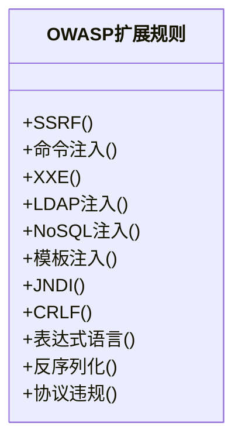

**图表来源**
- [docs/安全防护功能/OWASP 检测/OWASP 检测.md:169-198](file://docs/安全防护功能/OWASP 检测/OWASP 检测.md#L169-L198)

**章节来源**
- [docs/安全防护功能/OWASP 检测/OWASP 检测.md:156-211](file://docs/安全防护功能/OWASP 检测/OWASP 检测.md#L156-L211)

### 规则分类与优先级
- 基础规则：由 OWASP 默认阶段扫描，覆盖 SQL 注入、XSS、命令注入、路径遍历、WebShell、反向 Shell、SSRF、XXE、LDAP 注入、NoSQL 注入、模板注入、JNDI、CRLF、表达式语言、反序列化、文件上传、协议违规等。
- 扩展规则：独立模块，针对特定攻击面的更细粒度规则与评分。
- 优先级：规则按 priority 升序、ID 升序执行；ACL allow 可短路整条流水线；首个拦截结果即终止后续阶段。

**章节来源**
- [docs/安全防护功能/OWASP 检测/OWASP 检测.md:212-220](file://docs/安全防护功能/OWASP 检测/OWASP 检测.md#L212-L220)

### 检测精度优化策略
- 误报抑制：针对 XSS、SQLi、命令注入、路径遍历、SSRF、NoSQL 注入、表达式语言、反序列化等，内置上下文判断与结构化抑制逻辑。
- 敏感度阈值：低/中/高三档阈值，降低误报同时保证高敏模式下的检出率。
- 输入归一化：多轮解码与标准化，消除编码绕过与注释分割等规避手段。
- 目标截断与预过滤：超长目标截断、快速安全字符串跳过、关键字预过滤减少正则开销。
- Cookie 与 Referer 处理：剔除会话标识、仅扫描查询串与片段，避免误报。

**章节来源**
- [docs/安全防护功能/OWASP 检测/OWASP 检测.md:221-232](file://docs/安全防护功能/OWASP 检测/OWASP 检测.md#L221-L232)

### 规则更新与维护机制
- 新增规则：通过规则 DSL（kind:arg 或复合 JSON）定义，编译后按优先级排序执行。
- 调整现有规则：修改规则的 kind/arg、优先级、动作；复合规则可组合 and/or/not。
- 阈值调整：通过站点保护配置调整 OWASP 敏感度与动作；也可通过环境变量微调 Bot 与 Drop 阈值。
- 规则验证：提供大量单元测试覆盖典型误报与漏报场景，确保更新后稳定性。

**章节来源**
- [docs/安全防护功能/OWASP 检测/OWASP 检测.md:233-244](file://docs/安全防护功能/OWASP 检测/OWASP 检测.md#L233-L244)

### 配置示例与调试方法
- 敏感度与动作：通过站点保护配置设置 OWASPEnabled、OWASPSensitivity、OWASPAction；支持 low/mid/high 与拦截/丢弃。
- 环境变量：可通过 MY_OPENWAF_BOT_THRESHOLD、MY_OPENWAF_DROP_BOT_THRESHOLD 等调整 Bot 与 Drop 阈值。
- 调试建议：使用测试用例定位误报/漏报；关注归一化前后差异；结合 Body 解析与 Cookie/Referer 处理逻辑验证。

**章节来源**
- [docs/安全防护功能/OWASP 检测/OWASP 检测.md:245-255](file://docs/安全防护功能/OWASP 检测/OWASP 检测.md#L245-L255)

### 与其他安全机制的配合使用与最佳实践
- ACL 白名单：allow 规则可直接放行，跳过 OWASP、签名与自定义阶段。
- Bot 检测：两阶段评分（PreScreen → DeepScore），恶意分数达到阈值可直接丢弃连接。
- CVE 检测：在 OWASP 之后执行，针对已知漏洞利用模式自动拦截或升级为丢弃。
- 速率限制：在 Bot 之后执行，防止滥用。
- 阻断页面：根据站点运行时配置或全局默认模板渲染，支持自定义状态码与 HTML。

**章节来源**
- [docs/安全防护功能/OWASP 检测/OWASP 检测.md:256-268](file://docs/安全防护功能/OWASP 检测/OWASP 检测.md#L256-L268)

## 依赖分析
OWASP 检测模块与规则系统、引擎、流水线之间存在清晰的依赖关系，遵循"规则编译 → 流水线执行 → 阶段扫描 → 命中动作"的链路。

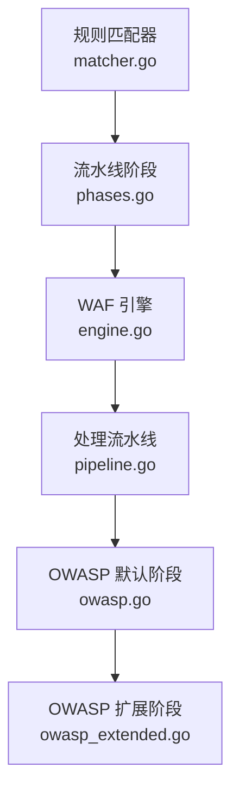

**图表来源**
- [docs/安全防护功能/OWASP 检测/OWASP 检测.md:269-294](file://docs/安全防护功能/OWASP 检测/OWASP 检测.md#L269-L294)

**章节来源**
- [docs/安全防护功能/OWASP 检测/OWASP 检测.md:269-300](file://docs/安全防护功能/OWASP 检测/OWASP 检测.md#L269-L300)

## 性能考量
- 快速预过滤：纯字母数字字符串直接跳过正则；关键字预过滤减少正则匹配次数。
- 归一化成本控制：多轮解码与正则扫描限制在合理范围内，超长目标截断。
- 正则缓存：规则编译时缓存正则表达式，避免重复编译。
- 流水线短路：首个拦截结果立即终止后续阶段，降低整体延迟。
- 体数据解析：按内容类型解析表单/JSON/Multipart，限制采样大小与递归深度，避免内存与 CPU 泄漏。

**章节来源**
- [docs/安全防护功能/OWASP 检测/OWASP 检测.md:301-312](file://docs/安全防护功能/OWASP 检测/OWASP 检测.md#L301-L312)

## 故障排查指南
- 误报定位：通过测试用例验证误报场景，逐步缩小到具体规则与误报抑制逻辑。
- 归一化问题：对比原始输入与归一化后的字符串，确认是否被过度解码或注释剥离导致误判。
- 敏感度与阈值：根据业务风险调整敏感度档位与阈值，观察命中率与误报率变化。
- 体数据扫描：检查表单/JSON/Multipart 解析逻辑，确认采样大小与字段提取是否符合预期。
- Cookie/Referer：确认会话标识被正确剔除，避免误报；仅扫描查询串与片段。

**章节来源**
- [docs/安全防护功能/OWASP 检测/OWASP 检测.md:313-325](file://docs/安全防护功能/OWASP 检测/OWASP 检测.md#L313-L325)

## 结论
My-OpenWaf 的 OWASP 检测体系通过"基础规则 + 扩展规则"的双层设计，结合严格的误报抑制、输入归一化与阈值控制，在性能与准确性之间取得平衡。规则 DSL 与流水线机制使得规则更新与维护便捷可控，配合 ACL、Bot、CVE、速率限制等安全机制，形成完整的防护闭环。

## 附录
- 规则 DSL 与复合条件：支持 and/or/not 组合，规则按优先级与 ID 排序执行。
- 体数据解析：表单/JSON/Multipart 分别解析，键与值均参与扫描；二进制数据按可打印比例阈值决定是否扫描。
- 阻断页面：支持站点运行时与全局默认模板，可自定义状态码与 HTML。

**章节来源**
- [docs/安全防护功能/OWASP 检测/OWASP 检测.md:329-338](file://docs/安全防护功能/OWASP 检测/OWASP 检测.md#L329-L338)

# OWASP 默认检测阶段技术文档

## 检测流程架构

### 多目标扫描架构
OWASP 默认检测阶段采用多阶段扫描架构，确保对各种攻击类型的全面覆盖：

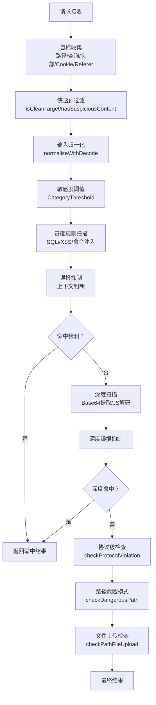

**图表来源**
- [internal/waf/owasp/owasp.go:59-345](file://internal/waf/owasp/owasp.go#L59-L345)

### 归一化处理机制
系统实现了多层次的输入归一化处理，消除各种编码绕过技术：

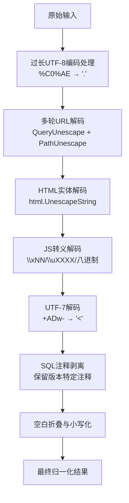

**图表来源**
- [internal/waf/owasp/owasp.go:498-566](file://internal/waf/owasp/owasp.go#L498-L566)

### 误报抑制机制
系统针对不同攻击类型实现了精细化的误报抑制策略：

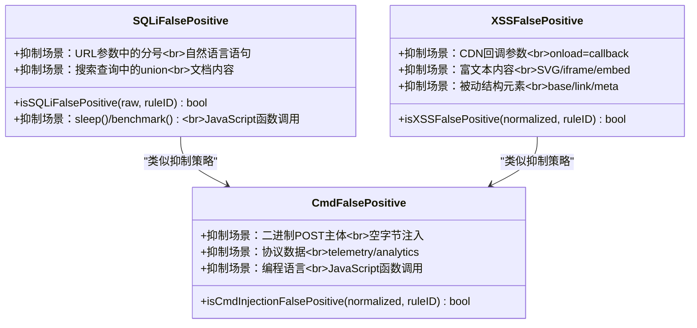

**图表来源**
- [internal/waf/owasp/owasp.go:1542-1771](file://internal/waf/owasp/owasp.go#L1542-L1771)

## 攻击类型检测算法

### SQL 注入检测算法
SQL 注入检测采用多层次的检测策略，包含关键词识别、正则匹配和上下文分析：

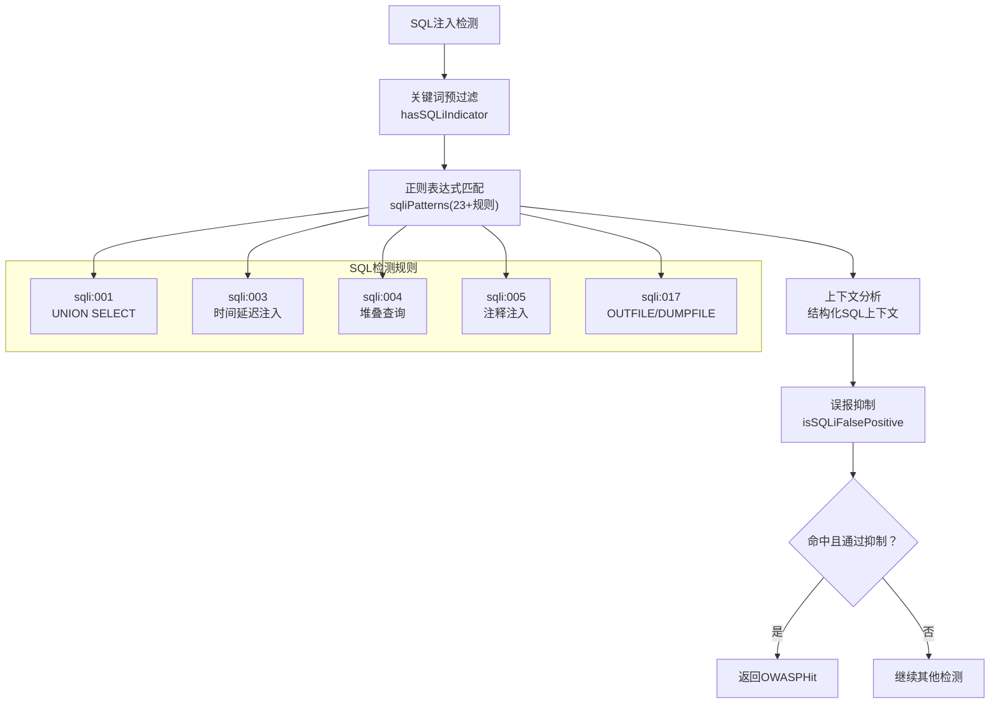

**图表来源**
- [internal/waf/owasp/owasp.go:1307-1355](file://internal/waf/owasp/owasp.go#L1307-L1355)
- [internal/waf/owasp/owasp.go:1881-1953](file://internal/waf/owasp/owasp.go#L1881-L1953)

### XSS 检测算法
XSS 检测系统针对现代 Web 应用的各种 XSS 攻击变种进行了专门优化：

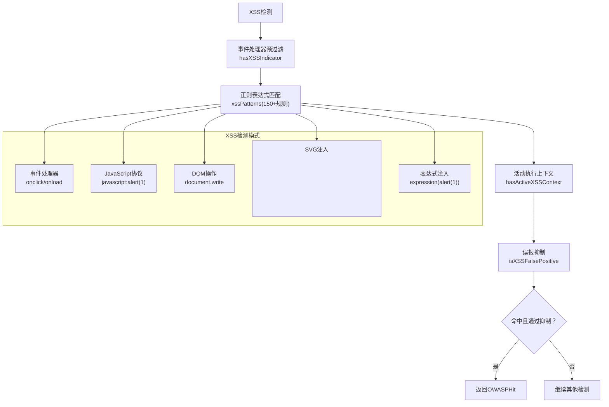

**图表来源**
- [internal/waf/owasp/owasp.go:1357-1438](file://internal/waf/owasp/owasp.go#L1357-L1438)
- [internal/waf/owasp/owasp.go:2069-2169](file://internal/waf/owasp/owasp.go#L2069-L2169)

### 命令注入检测算法
命令注入检测系统专门针对操作系统命令注入攻击：

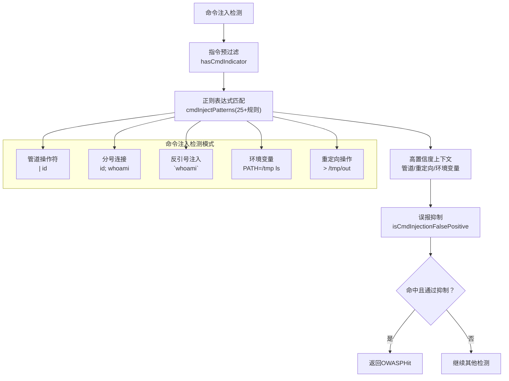

**图表来源**
- [internal/waf/owasp/owasp.go:1440-1454](file://internal/waf/owasp/owasp.go#L1440-L1454)
- [internal/waf/owasp/owasp.go:1612-1679](file://internal/waf/owasp/owasp.go#L1612-L1679)

### 路径穿越检测算法
路径遍历检测系统专门针对文件系统路径遍历攻击：

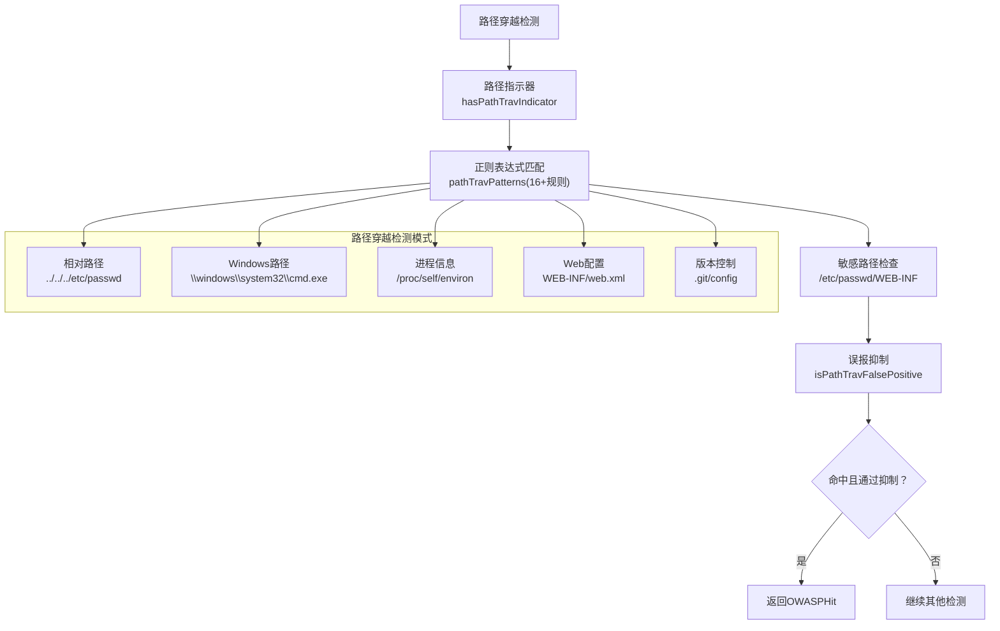

**图表来源**
- [internal/waf/owasp/owasp.go:1524-1538](file://internal/waf/owasp/owasp.go#L1524-L1538)
- [internal/waf/owasp/owasp.go:2171-2212](file://internal/waf/owasp/owasp.go#L2171-L2212)

### SSRF 检测算法
SSRF 检测系统专门针对服务器端请求伪造攻击：

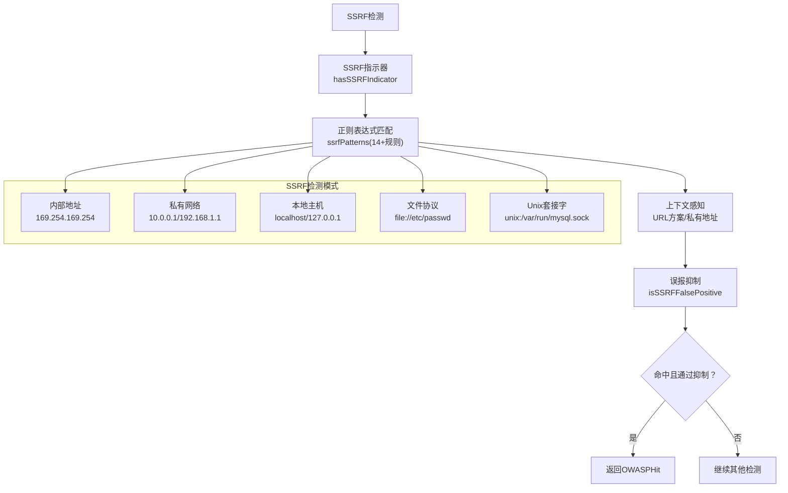

**图表来源**
- [internal/waf/owasp/owasp_extended.go:14-31](file://internal/waf/owasp/owasp_extended.go#L14-L31)
- [internal/waf/owasp/owasp_extended.go:77-98](file://internal/waf/owasp/owasp_extended.go#L77-L98)

## 检测流程详细分析

### 目标收集与预处理
OWASP 检测阶段首先进行多源目标收集和预处理：

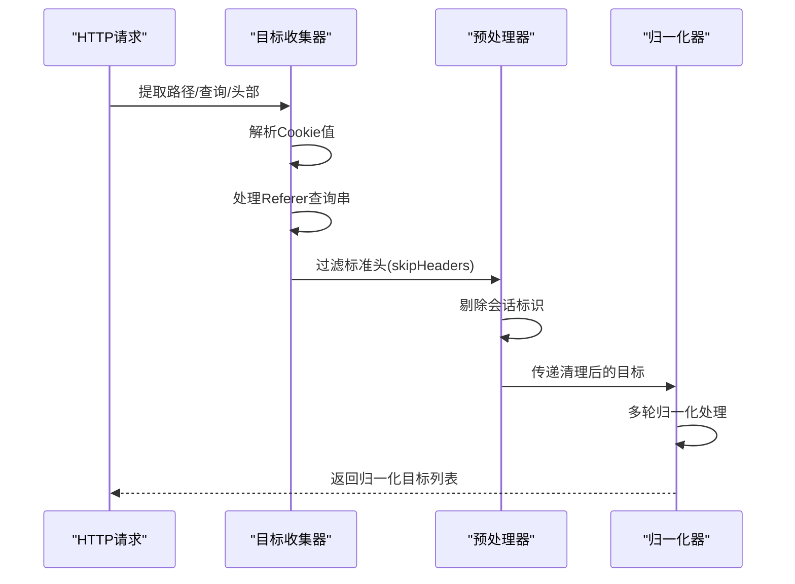

**图表来源**
- [internal/waf/owasp/owasp.go:628-744](file://internal/waf/owasp/owasp.go#L628-L744)

### 快速过滤与指示器
系统采用多层次的快速过滤机制：

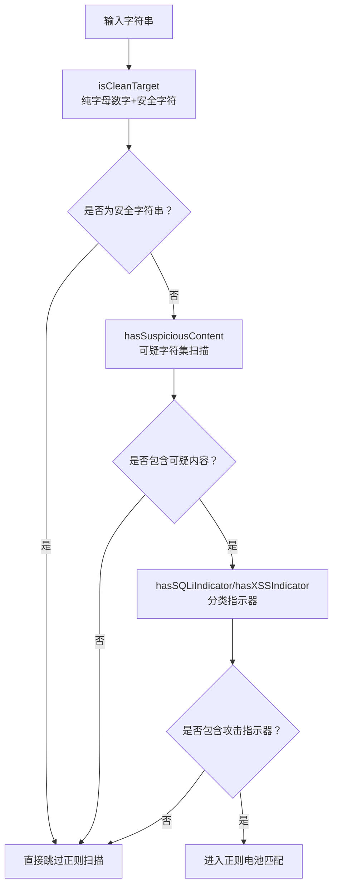

**图表来源**
- [internal/waf/owasp/owasp.go:930-985](file://internal/waf/owasp/owasp.go#L930-L985)
- [internal/waf/owasp/owasp.go:1307-1538](file://internal/waf/owasp/owasp.go#L1307-L1538)

### 深度解码扫描机制
针对复杂编码攻击，系统实现深度解码扫描：

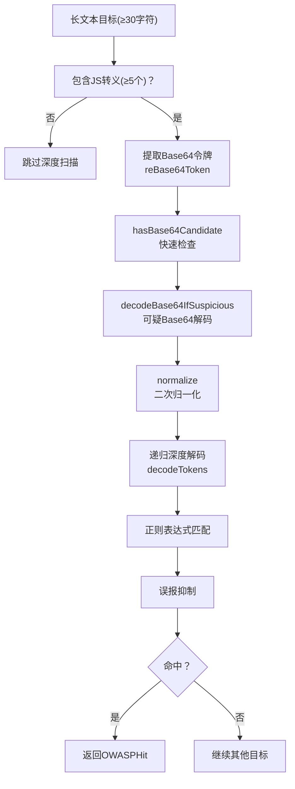

**图表来源**
- [internal/waf/owasp/owasp.go:1000-1084](file://internal/waf/owasp/owasp.go#L1000-L1084)
- [internal/waf/owasp/owasp.go:1086-1200](file://internal/waf/owasp/owasp.go#L1086-L1200)

## OWASP 检测配置最佳实践

### 敏感度调节策略
系统提供四档敏感度级别，每档对应不同的阈值控制：

| 敏感度级别 | 阈值常量 | 适用场景 | 误报控制 |
|------------|----------|----------|----------|
| off | 0 | 完全关闭 | 无检测 |
| low | 7 | 生产环境 | 严格误报抑制 |
| mid | 4 | 默认推荐 | 平衡误报与检出 |
| high | 3 | 安全审计 | 适度误报 |
| very_high | 2 | 高威胁场景 | 较少误报 |
| strict | 1 | 极致安全 | 最少误报 |

**章节来源**
- [internal/waf/owasp/owasp.go:573-586](file://internal/waf/owasp/owasp.go#L573-L586)

### 头部跳过列表配置
系统维护了标准头部跳过列表，避免误报：

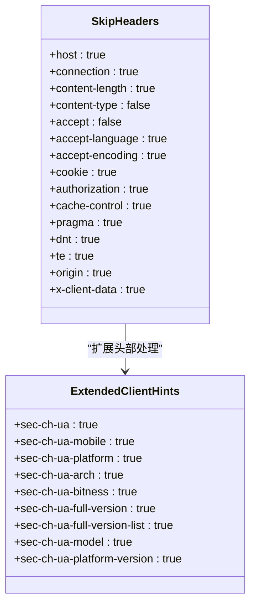

**图表来源**
- [internal/waf/owasp/owasp.go:588-626](file://internal/waf/owasp/owasp.go#L588-L626)

### 性能优化策略
系统采用多项性能优化技术：

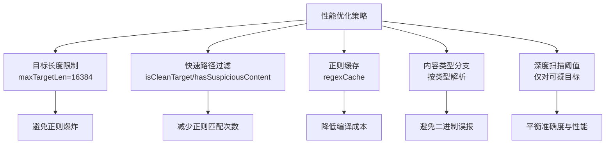

**图表来源**
- [internal/waf/owasp/owasp.go:38-46](file://internal/waf/owasp/owasp.go#L38-L46)
- [internal/waf/owasp/owasp.go:930-985](file://internal/waf/owasp/owasp.go#L930-L985)

## 检测规则示例与测试用例

### 基础 OWASP 规则示例
系统为各种攻击类型定义了详细的检测规则：

#### SQL 注入规则示例
| 规则ID | 检测模式 | 分数 | 描述 | 示例 |
|--------|----------|------|------|------|
| sqli:001 | `union\s*(all\s*)?select` | 5 | UNION SELECT 注入 | `1' UNION SELECT * FROM users--` |
| sqli:003 | `(sleep|benchmark|waitfor\s+delay)\s*\(` | 5 | 时间延迟注入 | `1 AND (SELECT sleep(5))` |
| sqli:004 | `;\s*(select|drop|alter|create|truncate|delete|update|insert)\s` | 5 | 堆叠查询注入 | `1; DROP TABLE users--` |
| sqli:005 | `['"\d]\s*(--(?:[\s/]|$)|/\*)` | 3 | 注释注入 | `1' -- comment` |
| sqli:017 | `(into\s+outfile|dumpfile)` | 5 | 文件写入注入 | `1' INTO OUTFILE '/tmp/shell.php'` |

**章节来源**
- [docs/安全防护功能/OWASP 检测/基本 OWASP 规则.md:184-194](file://docs/安全防护功能/OWASP 检测/基本 OWASP 规则.md#L184-L194)

#### XSS 检测规则示例
| 检测类别 | 检测模式 | 分数 | 示例 | 说明 |
|----------|----------|------|------|------|
| 脚本标签 | `` | 直接脚本注入 |
| 事件处理器 | `\bon(error|load|click|...)\s*=` | 5 | `onload="alert(1)"` | HTML事件处理器 |
| JavaScript协议 | `javascript\s*:` | 5 | `javascript:alert(1)` | JavaScript协议 |
| DOM操作 | `document\.(cookie|location|write|domain)` | 4 | `document.write()` | DOM操作 |
| SVG注入 | `<svg[\s>]` | 2 | `<svg onload=alert(1)>` | SVG事件处理器 |
| 表达式注入 | `expression\s*\(` | 3 | `expression(alert(1))` | CSS表达式注入 |

**章节来源**
- [docs/安全防护功能/OWASP 检测/基本 OWASP 规则.md:241-249](file://docs/安全防护功能/OWASP 检测/基本 OWASP 规则.md#L241-L249)

### 测试用例分析
系统提供了丰富的测试用例来验证检测效果：

#### 基础检测测试
- **SQL 注入测试**：验证 UNION SELECT、时间延迟、堆叠查询等攻击模式
- **XSS 检测测试**：验证脚本标签、事件处理器、JavaScript协议等攻击模式  
- **命令注入测试**：验证管道操作符、分号连接、反引号注入等攻击模式
- **路径穿越测试**：验证相对路径、Windows路径、敏感文件等攻击模式

#### 高级检测测试
- **Base64 SQLi 测试**：验证编码混淆的 SQL 注入攻击
- **Blaze 测试套件**：使用第三方测试数据集验证检测精度
- **误报抑制测试**：验证各种误报场景的抑制效果

**章节来源**
- [internal/waf/owasp/owasp_test.go:8-197](file://internal/waf/owasp/owasp_test.go#L8-L197)
- [internal/waf/owasp/base64sqli_test.go:7-46](file://internal/waf/owasp/base64sqli_test.go#L7-L46)
- [internal/waf/owasp/blazetest_test.go:18-156](file://internal/waf/owasp/blazetest_test.go#L18-L156)

## 配置管理与最佳实践

### 敏感度级别配置
系统支持灵活的敏感度配置，可根据不同场景调整检测严格度：

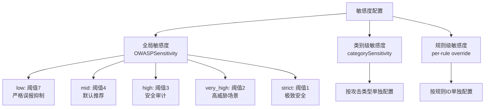

**图表来源**
- [internal/waf/owasp/owasp.go:557-586](file://internal/waf/owasp/owasp.go#L557-L586)

### 规则注册与管理
系统采用注册表模式管理 OWASP 规则：

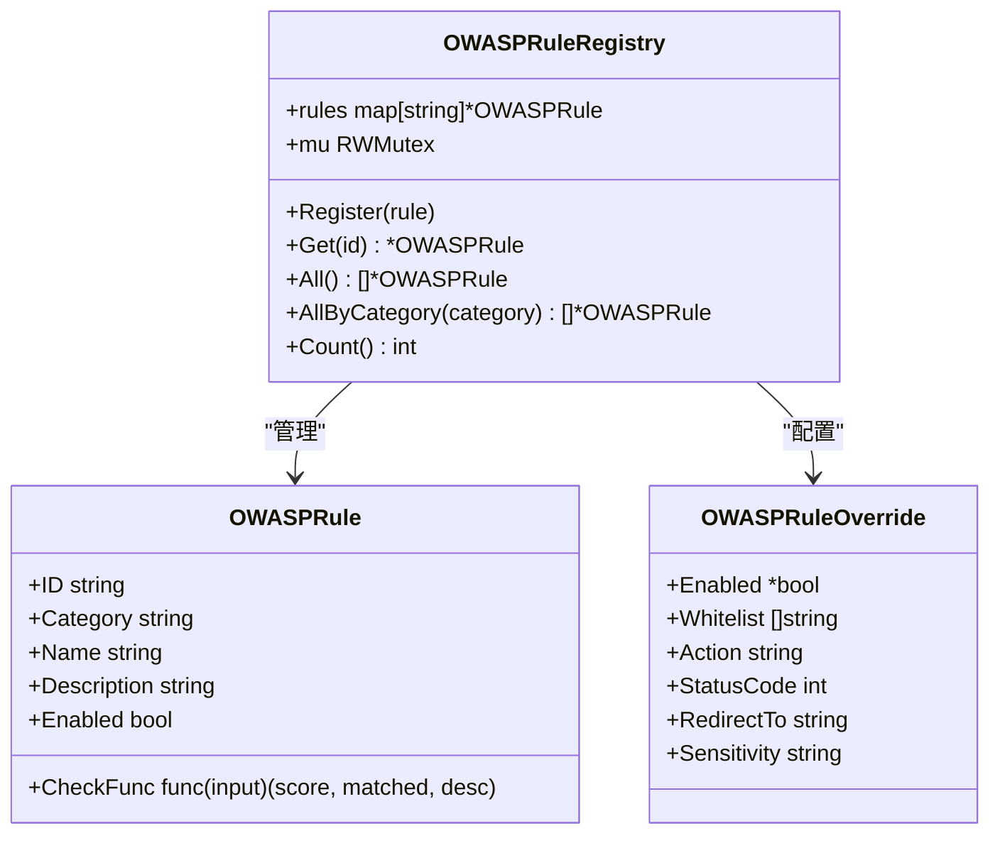

**图表来源**
- [internal/waf/owasp/owasp_registry.go:31-40](file://internal/waf/owasp/owasp_registry.go#L31-L40)
- [internal/waf/owasp/owasp_registry.go:207-225](file://internal/waf/owasp/owasp_registry.go#L207-L225)

### 性能优化配置
系统提供了多项性能优化配置选项：

- **目标长度限制**：maxTargetLen=16384，避免正则爆炸
- **正则缓存**：regexCache 复用编译结果
- **内容类型分支**：按 Content-Type 限制扫描范围
- **深度扫描阈值**：仅对长文本(≥30)且包含较多JS转义(≥5)才触发深度解码

**章节来源**
- [internal/waf/owasp/owasp.go:38-46](file://internal/waf/owasp/owasp.go#L38-L46)
- [internal/waf/owasp/owasp.go:176-216](file://internal/waf/owasp/owasp.go#L176-L216)

## 结论
My-OpenWaf 的 OWASP 默认检测阶段通过精心设计的多层检测架构、上下文感知的误报抑制机制和全面的性能优化策略，实现了对常见 OWASP Top 10 攻击类型的高精度检测。系统采用"快速路径过滤 + 多轮归一化 + 分类指示器 + 正则电池 + 上下文抑制 + 深度解码扫描"的组合，有效平衡了准确性与性能。配合灵活的配置选项和完善的测试体系，为不同场景下的安全防护提供了可靠的解决方案。