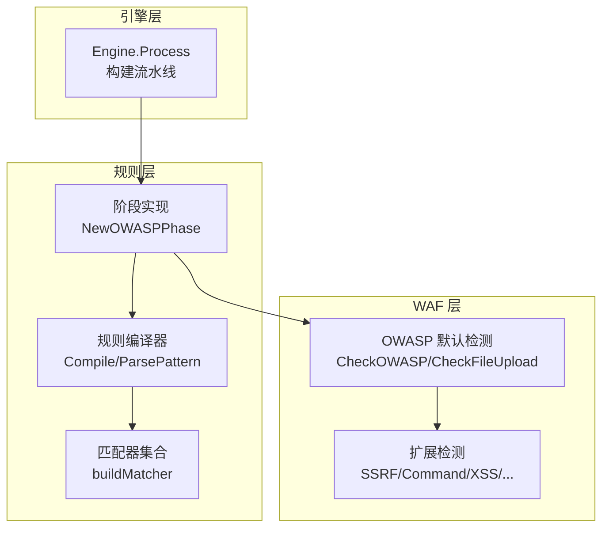
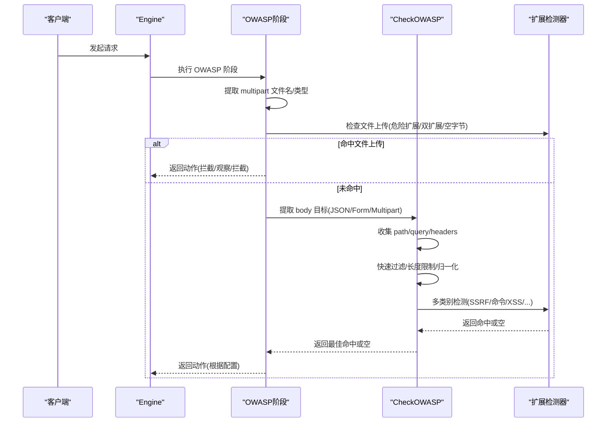
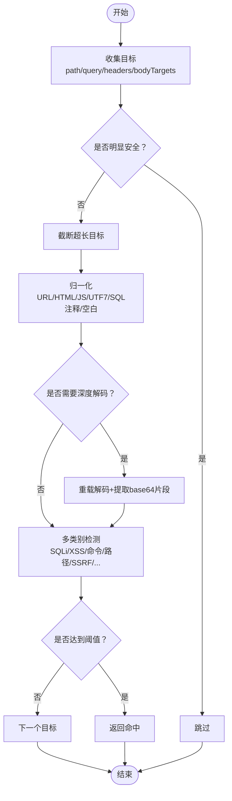
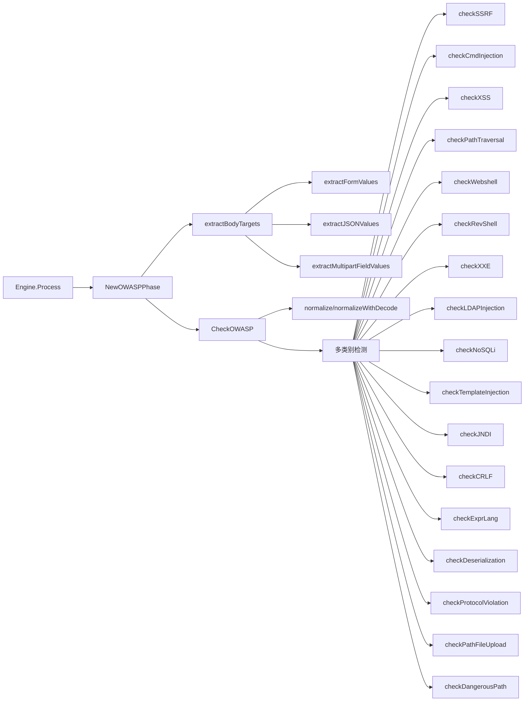

# OWASP 默认检测阶段

<cite>
**本文引用的文件**
- [internal/waf/owasp.go](file://internal/waf/owasp.go)
- [internal/waf/owasp_extended.go](file://internal/waf/owasp_extended.go)
- [internal/core/rules/phases.go](file://internal/core/rules/phases.go)
- [internal/core/rules/matcher.go](file://internal/core/rules/matcher.go)
- [internal/core/rules/compiler.go](file://internal/core/rules/compiler.go)
- [internal/core/engine/engine.go](file://internal/core/engine/engine.go)
- [internal/store/models.go](file://internal/store/models.go)
- [internal/waf/owasp_test.go](file://internal/waf/owasp_test.go)
- [internal/waf/owasp_extended_test.go](file://internal/waf/owasp_extended_test.go)
</cite>

## 目录
1. [简介](#简介)
2. [项目结构](#项目结构)
3. [核心组件](#核心组件)
4. [架构总览](#架构总览)
5. [详细组件分析](#详细组件分析)
6. [依赖关系分析](#依赖关系分析)
7. [性能考量](#性能考量)
8. [故障排查指南](#故障排查指南)
9. [结论](#结论)
10. [附录](#附录)

## 简介
本文件系统化梳理了 OpenWAF 的 OWASP 默认检测阶段实现，覆盖 SQL 注入、XSS、命令注入、路径穿越、SSRF、XXE、LDAP 注入、NoSQL 注入、模板注入、JNDI/Log4Shell、CRLF 注入、表达式语言注入、反序列化攻击等常见攻击类型的检测机制。文档详细说明不同内容类型（表单、JSON、multipart 文件上传等）的处理逻辑，阐述敏感度阈值与动作级别选择策略，并提供规则定制与扩展指南以及检测精度优化与误报减少的最佳实践。

## 项目结构
OWASP 默认检测阶段位于 WAF 层，通过规则编译器与执行流水线集成到整体防护体系中：
- WAF 层：实现 OWASP 检测算法与规则匹配
- 规则层：编译规则为可执行的匹配器，按阶段组织
- 引擎层：构建请求处理流水线，串联各阶段

图表来源
- [internal/core/engine/engine.go:57-129](file://internal/core/engine/engine.go#L57-L129)
- [internal/core/rules/compiler.go:27-55](file://internal/core/rules/compiler.go#L27-L55)
- [internal/core/rules/matcher.go:167-261](file://internal/core/rules/matcher.go#L167-L261)
- [internal/core/rules/phases.go:246-303](file://internal/core/rules/phases.go#L246-L303)
- [internal/waf/owasp.go:48-234](file://internal/waf/owasp.go#L48-L234)
- [internal/waf/owasp_extended.go:58-76](file://internal/waf/owasp_extended.go#L58-L76)

章节来源
- [internal/core/engine/engine.go:15-129](file://internal/core/engine/engine.go#L15-L129)
- [internal/core/rules/phases.go:246-303](file://internal/core/rules/phases.go#L246-L303)

## 核心组件
- OWASP 默认检测器：统一入口，负责收集目标、归一化、深度解码、多类别检测与阈值控制
- 扩展检测器：针对 SSRF、命令注入、XXE、LDAP 注入、NoSQL 注入、模板注入、JNDI/Log4Shell、CRLF、表达式语言、反序列化等专项检测
- 规则编译器与匹配器：将规则模式解析为可执行的匹配器，支持复合条件
- OWASP 阶段：在流水线中执行，默认阶段，负责文件上传检查与通用 OWASP 内容扫描

章节来源
- [internal/waf/owasp.go:48-234](file://internal/waf/owasp.go#L48-L234)
- [internal/waf/owasp_extended.go:58-76](file://internal/waf/owasp_extended.go#L58-L76)
- [internal/core/rules/compiler.go:27-55](file://internal/core/rules/compiler.go#L27-L55)
- [internal/core/rules/matcher.go:167-261](file://internal/core/rules/matcher.go#L167-L261)
- [internal/core/rules/phases.go:246-303](file://internal/core/rules/phases.go#L246-L303)

## 架构总览
OWASP 默认检测阶段在引擎构建的流水线中运行，先进行文件上传检查，再提取请求体目标进行综合扫描。检测流程包含快速过滤、归一化、深度解码、多类别检测与阈值判定。

图表来源
- [internal/core/engine/engine.go:57-129](file://internal/core/engine/engine.go#L57-L129)
- [internal/core/rules/phases.go:258-303](file://internal/core/rules/phases.go#L258-L303)
- [internal/waf/owasp.go:258-303](file://internal/waf/owasp.go#L258-L303)
- [internal/waf/owasp_extended.go:397-439](file://internal/waf/owasp_extended.go#L397-L439)

章节来源
- [internal/core/engine/engine.go:57-129](file://internal/core/engine/engine.go#L57-L129)
- [internal/core/rules/phases.go:258-303](file://internal/core/rules/phases.go#L258-L303)

## 详细组件分析

### OWASP 默认检测器（CheckOWASP）
- 目标收集：从 path、query、headers（除跳过头外）与 bodyTargets 中提取待扫描目标
- 快速过滤：跳过明显安全的目标；对超长目标截断以限制正则扫描时间
- 归一化：URL 解码、HTML 实体解码、JS 转义解码、UTF-7 解码、大小写折叠、SQL 注释剥离、空白折叠
- 深度解码：对包含大量 JS 转义的重载解码，提取 base64 片段二次扫描
- 多类别检测：按优先级依次尝试 SQL 注入、XSS、命令注入、Webshell、反向 Shell、路径穿越、SSRF、XXE、LDAP 注入、NoSQL 注入、模板注入、JNDI/Log4Shell、CRLF、表达式语言、反序列化
- 阈值控制：根据敏感度（low/mid/high）设定阈值，mid 默认阈值更高以降低误报
- 协议级检查：检查 headers 中的协议违规（如 CL+TE 冲突）
- 路径级检查：危险路径模式（CVE 相关端点）、文件上传路径中的双扩展、空字节

图表来源
- [internal/waf/owasp.go:48-234](file://internal/waf/owasp.go#L48-L234)
- [internal/waf/owasp.go:176-216](file://internal/waf/owasp.go#L176-L216)

章节来源
- [internal/waf/owasp.go:48-234](file://internal/waf/owasp.go#L48-L234)

### 扩展检测器（SSRF/命令注入/XSS/XXE/LDAP/NoSQL/模板/JNDI/CRLF/表达式/反序列化）
- SSRF：基于指示器快速判断，匹配云元数据、私有地址、本地回环、文件/Unix socket、编码绕过、协议方案等，累加评分
- 命令注入：识别管道/分号/反引号/$()、重定向、环境变量赋值、IFS 空格绕过、Git 参数注入、Here-string、ANSI-C 引号等
- XXE：识别 DTD、实体声明、SYSTEM/URI、XInclude 等
- LDAP 注入：识别过滤器拼接、对象类绕过、括号组合
- NoSQL 注入：识别 $where/$regex/$or/$exists/$lookup 等
- 模板注入：识别 {{...}}、${...}、<%=...%>、__class__/__subclasses__、__proto__/constructor、EJS/Handlebars/Smarty 等
- JNDI/Log4Shell：识别 jndi:、${env/sys/java/base64:}、Unicode/URL 编码、嵌套表达式
- CRLF：识别 \r\n:Location/Cookie/Content-Type 等
- 表达式语言：识别 SpEL/OGNL/Spring EL、反射链、静态方法调用
- 反序列化：识别 Java/PHP/Python/.NET/Ruby Marshal 等魔数与 gadget

章节来源
- [internal/waf/owasp_extended.go:58-76](file://internal/waf/owasp_extended.go#L58-L76)
- [internal/waf/owasp_extended.go:138-156](file://internal/waf/owasp_extended.go#L138-L156)
- [internal/waf/owasp_extended.go:185-203](file://internal/waf/owasp_extended.go#L185-L203)
- [internal/waf/owasp_extended.go:228-246](file://internal/waf/owasp_extended.go#L228-L246)
- [internal/waf/owasp_extended.go:267-282](file://internal/waf/owasp_extended.go#L267-L282)
- [internal/waf/owasp_extended.go:347-365](file://internal/waf/owasp_extended.go#L347-L365)
- [internal/waf/owasp_extended.go:473-491](file://internal/waf/owasp_extended.go#L473-L491)
- [internal/waf/owasp_extended.go:506-521](file://internal/waf/owasp_extended.go#L506-L521)
- [internal/waf/owasp_extended.go:574-592](file://internal/waf/owasp_extended.go#L574-L592)
- [internal/waf/owasp_extended.go:629-648](file://internal/waf/owasp_extended.go#L629-L648)

### 内容类型处理逻辑（表单/JSON/文件上传）
- application/x-www-form-urlencoded：解析键值对，URL 解码后分别扫描键与值
- application/json：递归提取字符串值（含键名），限制最大深度与数量
- multipart/form-data：仅提取非文件字段文本值用于 OWASP 扫描；文件上传检查单独进行
- text/*、application/xml、application/soap：按文本扫描，限制大小
- 其他二进制/未知类型：采样前 512 字节，计算可打印 ASCII 比例，低于阈值则跳过扫描

章节来源
- [internal/core/rules/phases.go:360-405](file://internal/core/rules/phases.go#L360-L405)
- [internal/core/rules/phases.go:407-442](file://internal/core/rules/phases.go#L407-L442)
- [internal/core/rules/phases.go:444-477](file://internal/core/rules/phases.go#L444-L477)
- [internal/core/rules/phases.go:479-540](file://internal/core/rules/phases.go#L479-L540)

### 敏感度配置与动作级别选择策略
- 敏感度阈值：
  - low：阈值较高，适合低误报场景
  - mid：默认阈值，平衡误报与漏报
  - high：阈值较低，提高检出率但可能增加误报
- 动作级别：
  - observe：记录但不阻断
  - intercept：拦截请求
  - drop：直接断开连接（高级别威胁）
- 配置项：
  - builtin_owasp_enabled：启用/禁用
  - builtin_owasp_sensitivity：low/mid/high
  - builtin_owasp_on_hit：observe/intercept/drop
  - OWASPModules：模块级敏感度（按模块键）

章节来源
- [internal/waf/owasp.go:375-384](file://internal/waf/owasp.go#L375-L384)
- [internal/store/models.go:247-294](file://internal/store/models.go#L247-L294)
- [internal/store/models.go:338-354](file://internal/store/models.go#L338-L354)

### OWASP 规则定制与扩展指南
- 规则编译：
  - ParsePattern：解析简单模式或 JSON 复合条件
  - buildMatcher：生成具体匹配器（IP、路径、查询、头部、内容类型、用户代理、body_contains、query_param、复合条件）
- 规则类型：
  - allow_ip/block_ip
  - block_path/block_path_regex/block_path_exact
  - block_query_contains/block_query_regex
  - block_header/block_header_regex
  - block_method/block_content_type
  - block_user_agent/block_user_agent_regex
  - header_regex/body_contains/query_param
  - compound：{"op":"and|or|not","children":[...]}
- 扩展检测器：
  - 新增检测类别：在 OWASP 默认检测器中添加新的检测函数与误报抑制逻辑
  - 更新阈值与评分：调整各模式的评分与阈值
  - 添加指示器：在 hasXIndicator 中加入快速判断逻辑以减少正则匹配次数

章节来源
- [internal/core/rules/compiler.go:57-83](file://internal/core/rules/compiler.go#L57-L83)
- [internal/core/rules/matcher.go:167-261](file://internal/core/rules/matcher.go#L167-L261)
- [internal/core/rules/matcher.go:299-343](file://internal/core/rules/matcher.go#L299-L343)

### 检测精度优化与误报减少最佳实践
- 快速过滤与长度限制：避免对明显安全与超长目标进行深度扫描
- 归一化策略：多轮 URL/HTML/JS/UTF7 解码，剥离 SQL 注释，空白折叠
- 指示器前置：在进入复杂正则匹配前使用 hasXIndicator 判断
- 误报抑制：
  - SQL 注入：对搜索查询、JavaScript 变量 guard、特定上下文抑制
  - XSS：对 CDN onload 回调、SVG/Embed 无事件处理器、高敏感度下保留严格规则
  - 命令注入：对 jQuery 选择器、URL 参数分号、管道等抑制
  - 模板注入：对合法模板助手（如 Handlebars {{each}}/{{log}}）抑制
- 协议级与路径级检查：避免 Host/Referer 等标准请求属性导致的误报

章节来源
- [internal/waf/owasp.go:48-234](file://internal/waf/owasp.go#L48-L234)
- [internal/waf/owasp_extended.go:58-76](file://internal/waf/owasp_extended.go#L58-L76)
- [internal/waf/owasp_test.go:91-164](file://internal/waf/owasp_test.go#L91-L164)
- [internal/waf/owasp_extended_test.go:426-461](file://internal/waf/owasp_extended_test.go#L426-L461)

## 依赖关系分析
OWASP 默认检测阶段的依赖关系如下：

图表来源
- [internal/core/engine/engine.go:57-129](file://internal/core/engine/engine.go#L57-L129)
- [internal/core/rules/phases.go:258-303](file://internal/core/rules/phases.go#L258-L303)
- [internal/core/rules/phases.go:360-540](file://internal/core/rules/phases.go#L360-L540)
- [internal/waf/owasp.go:48-234](file://internal/waf/owasp.go#L48-L234)
- [internal/waf/owasp_extended.go:58-76](file://internal/waf/owasp_extended.go#L58-L76)

章节来源
- [internal/core/engine/engine.go:57-129](file://internal/core/engine/engine.go#L57-L129)
- [internal/core/rules/phases.go:258-303](file://internal/core/rules/phases.go#L258-L303)

## 性能考量
- 快速过滤：跳过明显安全与超长目标，限制正则扫描时间
- 归一化成本：多轮解码与剥离注释，建议在目标较小或存在指示器时才进行
- 正则缓存：复用已编译的正则表达式，减少重复编译开销
- 目标数量限制：JSON 递归遍历限制深度与数量，multipart 限制读取字段数量
- 指示器前置：在进入复杂正则匹配前使用 hasXIndicator 判断，减少匹配次数

章节来源
- [internal/waf/owasp.go:375-384](file://internal/waf/owasp.go#L375-L384)
- [internal/waf/owasp.go:48-234](file://internal/waf/owasp.go#L48-L234)
- [internal/waf/owasp_extended.go:58-76](file://internal/waf/owasp_extended.go#L58-L76)
- [internal/core/rules/matcher.go:271-296](file://internal/core/rules/matcher.go#L271-L296)

## 故障排查指南
- 误报问题：
  - 检查敏感度设置是否过高或过低
  - 审核误报抑制逻辑（如 SQL 注入对搜索查询、XSS 对 CDN onload、命令注入对 jQuery）
  - 调整阈值或在规则层面增加复合条件
- 漏报问题：
  - 确认 hasXIndicator 是否正确识别指示器
  - 检查正则表达式是否覆盖新变种（如新的绕过技巧）
  - 增加深度解码逻辑（JS 转义、base64）
- 配置问题：
  - 确认 builtin_owasp_enabled、builtin_owasp_sensitivity、builtin_owasp_on_hit 设置
  - 检查 OWASPModules 模块级敏感度配置
- 测试验证：
  - 使用单元测试覆盖典型场景与边界情况（见测试文件）

章节来源
- [internal/waf/owasp_test.go:91-164](file://internal/waf/owasp_test.go#L91-L164)
- [internal/waf/owasp_extended_test.go:426-461](file://internal/waf/owasp_extended_test.go#L426-L461)
- [internal/store/models.go:247-294](file://internal/store/models.go#L247-L294)

## 结论
OWASP 默认检测阶段通过“指示器前置 + 快速过滤 + 归一化 + 多类别检测 + 阈值控制”的设计，在保证检测覆盖面的同时有效控制误报。结合规则编译器与流水线机制，系统实现了灵活的规则定制与扩展能力。建议在生产环境中根据业务场景合理设置敏感度与动作级别，并持续优化误报抑制与正则覆盖，以获得最佳的检测精度与性能平衡。

## 附录
- 关键实现路径参考：
  - [CheckOWASP 主流程:48-234](file://internal/waf/owasp.go#L48-L234)
  - [扩展检测器集合:58-76](file://internal/waf/owasp_extended.go#L58-L76)
  - [OWASP 阶段实现:258-303](file://internal/core/rules/phases.go#L258-L303)
  - [规则编译与匹配器:27-55](file://internal/core/rules/compiler.go#L27-L55)
  - [规则模式解析:167-261](file://internal/core/rules/matcher.go#L167-L261)
  - [内容类型提取:360-540](file://internal/core/rules/phases.go#L360-L540)
  - [配置模型:247-294](file://internal/store/models.go#L247-L294)