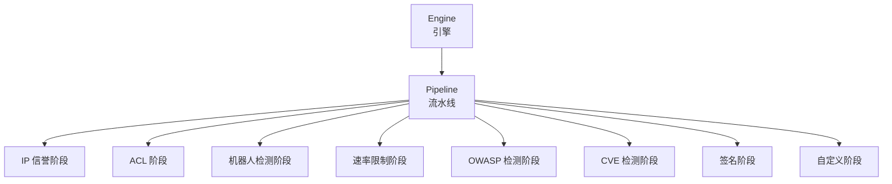
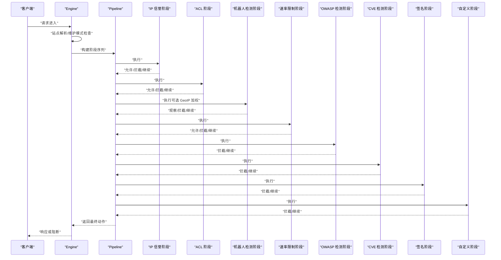
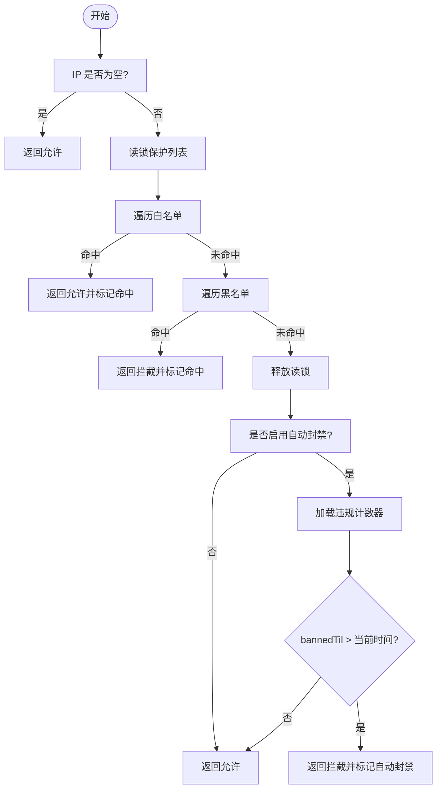
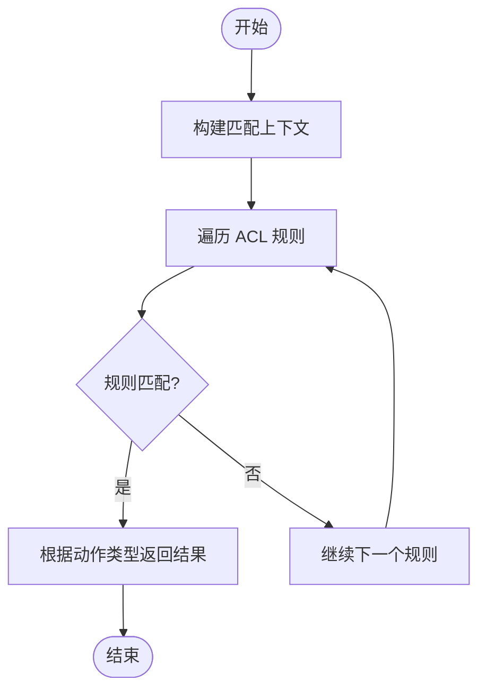
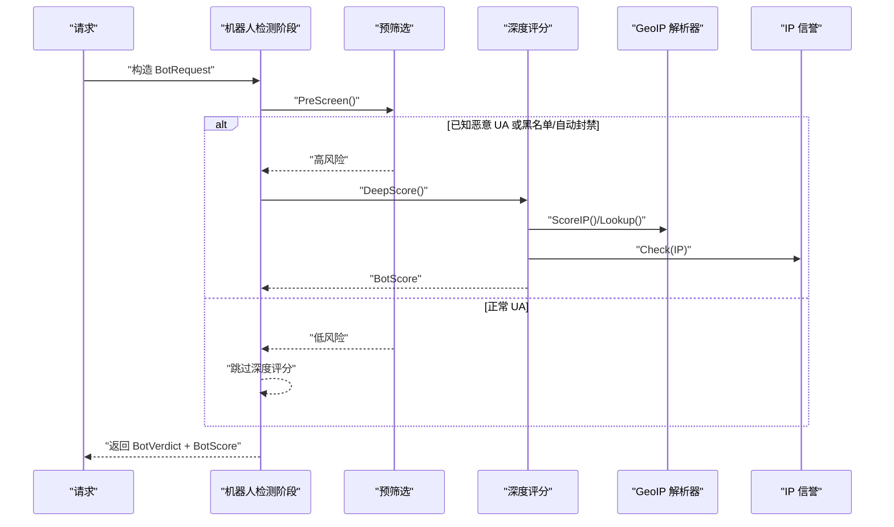
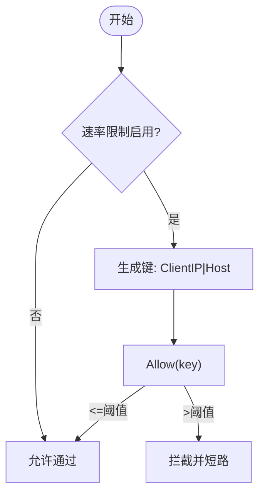
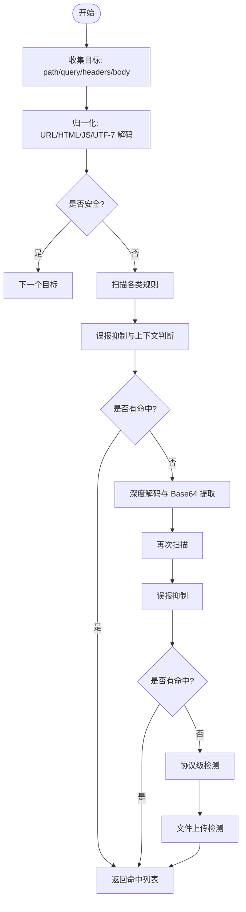
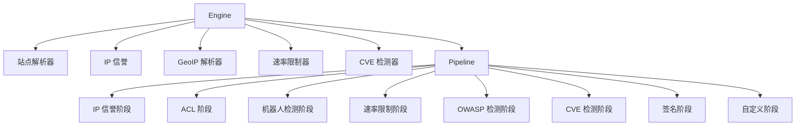

# 处理阶段详解

<cite>
**本文档引用的文件**
- [internal/core/engine/engine.go](file://internal/core/engine/engine.go)
- [internal/core/pipeline/pipeline.go](file://internal/core/pipeline/pipeline.go)
- [internal/core/rules/phases.go](file://internal/core/rules/phases.go)
- [internal/waf/iprep.go](file://internal/waf/iprep.go)
- [internal/waf/bot.go](file://internal/waf/bot.go)
- [internal/waf/ratelimit.go](file://internal/waf/ratelimit.go)
- [internal/waf/owasp.go](file://internal/waf/owasp.go)
- [internal/waf/geoip.go](file://internal/waf/geoip.go)
- [internal/waf/eval.go](file://internal/waf/eval.go)
- [internal/waf/semantic.go](file://internal/waf/semantic.go)
- [internal/waf/iprep_test.go](file://internal/waf/iprep_test.go)
- [internal/waf/bot_test.go](file://internal/waf/bot_test.go)
- [internal/waf/ratelimit_test.go](file://internal/waf/ratelimit_test.go)
- [internal/waf/owasp_test.go](file://internal/waf/owasp_test.go)
- [internal/waf/owasp_extended_test.go](file://internal/waf/owasp_extended_test.go)
</cite>

## 目录
1. [简介](#简介)
2. [项目结构](#项目结构)
3. [核心组件](#核心组件)
4. [架构总览](#架构总览)
5. [详细组件分析](#详细组件分析)
6. [依赖关系分析](#依赖关系分析)
7. [性能考虑](#性能考虑)
8. [故障排除指南](#故障排除指南)
9. [结论](#结论)
10. [附录](#附录)

## 简介
本文件系统性梳理 OpenWAF 的处理阶段实现，覆盖 IP 信誉阶段、ACL 阶段、机器人检测阶段、速率限制阶段、OWASP 检测阶段等。内容包括各阶段的输入输出、处理逻辑与决策机制、阶段间依赖与执行顺序、配置参数与性能调优建议，并提供测试方法与故障排除指南。

## 项目结构
OpenWAF 将请求处理抽象为“流水线（Pipeline）”，每个处理阶段封装为独立的 Phase 实现，按固定顺序串联执行。核心模块分布如下：
- 引擎层：负责站点解析、维护模式检查、规则编译与流水线组装
- 流水线层：定义统一的 Phase 接口与执行模型
- 规则阶段层：具体实现各处理阶段（IP 信誉、ACL、机器人检测、速率限制、OWASP、CVE 等）
- WAF 核心算法层：IP 信誉、机器人检测、OWASP 检测、GeoIP 解析、速率限制等

**图表来源**
- [internal/core/engine/engine.go:57-129](file://internal/core/engine/engine.go#L57-L129)
- [internal/core/pipeline/pipeline.go:46-70](file://internal/core/pipeline/pipeline.go#L46-L70)

**章节来源**
- [internal/core/engine/engine.go:15-129](file://internal/core/engine/engine.go#L15-L129)
- [internal/core/pipeline/pipeline.go:9-70](file://internal/core/pipeline/pipeline.go#L9-L70)

## 核心组件
- 引擎 Engine：负责站点匹配、维护模式检查、规则编译与流水线构建
- 流水线 Pipeline：顺序执行各 Phase，支持 Drop/Intercept/Observe 等动作的短路与收集
- 规则阶段 Phase：各处理阶段的具体实现，如 IP 信誉、ACL、机器人检测、速率限制、OWASP、CVE、签名与自定义规则
- WAF 算法模块：IP 信誉、机器人检测、OWASP 检测、GeoIP、速率限制等

**章节来源**
- [internal/core/engine/engine.go:15-176](file://internal/core/engine/engine.go#L15-L176)
- [internal/core/pipeline/pipeline.go:25-70](file://internal/core/pipeline/pipeline.go#L25-L70)
- [internal/core/rules/phases.go:32-358](file://internal/core/rules/phases.go#L32-L358)

## 架构总览
OpenWAF 的处理流程以 Engine 为中心，按以下顺序执行阶段：
1) IP 信誉阶段（白名单短路、黑名单拦截）
2) ACL 阶段（基于规则允许/拒绝）
3) 机器人检测阶段（两阶段：预筛选 + 深度评分；可选 GeoIP 加权）
4) 请求速率限制阶段（固定窗口计数）
5) OWASP 默认阶段（多类攻击检测）
6) CVE 检测阶段（针对特定漏洞模式）
7) 签名与自定义阶段（通用规则匹配）

**图表来源**
- [internal/core/engine/engine.go:57-129](file://internal/core/engine/engine.go#L57-L129)
- [internal/core/rules/phases.go:32-358](file://internal/core/rules/phases.go#L32-L358)

**章节来源**
- [internal/core/engine/engine.go:57-129](file://internal/core/engine/engine.go#L57-L129)

## 详细组件分析

### IP 信誉阶段
- 输入：客户端 IP、站点配置的黑白名单、自动封禁阈值与窗口
- 输出：允许/拦截、是否命中、原因、分类（白名单/黑名单/自动封禁）
- 决策机制：
  - 先检查白名单，命中即允许并短路后续阶段
  - 再检查黑名单，命中即拦截
  - 若启用自动封禁且命中，则根据违规计数与封禁到期时间决定拦截
- 关键数据结构：
  - IPListEntry：支持单 IP 与 CIDR，带备注与过期时间
  - IPDecision：返回 Allowed/Mached/Reason/Category
  - violationCounter：记录违规次数、首次出现时间、封禁截止时间
- 性能特性：并发安全，定期清理过期封禁条目

**图表来源**
- [internal/waf/iprep.go:90-124](file://internal/waf/iprep.go#L90-L124)
- [internal/waf/iprep.go:126-155](file://internal/waf/iprep.go#L126-L155)

**章节来源**
- [internal/waf/iprep.go:18-124](file://internal/waf/iprep.go#L18-L124)
- [internal/core/rules/phases.go:130-170](file://internal/core/rules/phases.go#L130-L170)

### ACL 阶段
- 输入：客户端 IP、方法、路径、查询、头部映射
- 输出：允许/拦截/继续，命中描述与类别
- 决策机制：按规则匹配客户端 IP 或路径/查询模式，若命中则根据动作类型短路或继续

**图表来源**
- [internal/core/rules/phases.go:40-52](file://internal/core/rules/phases.go#L40-L52)
- [internal/waf/eval.go:87-114](file://internal/waf/eval.go#L87-L114)

**章节来源**
- [internal/core/rules/phases.go:32-52](file://internal/core/rules/phases.go#L32-L52)
- [internal/waf/eval.go:87-114](file://internal/waf/eval.go#L87-L114)

### 机器人检测阶段（两阶段：预筛选 + 深度评分）
- 输入：方法、路径、头部、UA、Cookie、连接方式、ClientIP
- 输出：BotVerdict（是否机器人、分数、类别、原因、规则 ID），以及 BotScore（深度评分明细）
- 预筛选（PreScreen）快速判定高风险：
  - 已知恶意工具 UA
  - 黑名单/自动封禁 IP
  - 高风险 GeoIP（数据中心/VPN/高危国家）
- 深度评分（DeepScore）综合评估：
  - GeoIP 风险评分与信息
  - UA/头部指纹评分
  - TLS/HTTP2 指纹评分
  - IP 信誉评分
- 决策机制：阈值决定拦截级别，恶意工具直接拦截，可疑行为仅记录观察

**图表来源**
- [internal/waf/bot.go:136-161](file://internal/waf/bot.go#L136-L161)
- [internal/waf/bot.go:167-224](file://internal/waf/bot.go#L167-L224)
- [internal/core/rules/phases.go:172-244](file://internal/core/rules/phases.go#L172-L244)

**章节来源**
- [internal/waf/bot.go:126-244](file://internal/waf/bot.go#L126-L244)
- [internal/core/rules/phases.go:172-244](file://internal/core/rules/phases.go#L172-L244)
- [internal/waf/geoip.go:153-223](file://internal/waf/geoip.go#L153-L223)

### 速率限制阶段（请求级）
- 输入：客户端 IP、Host（组合键）
- 输出：允许/拦截，命中描述与类别
- 决策机制：固定窗口计数，超过阈值即拦截；支持运行时重配置与禁用
- 关键点：错误率统计可单独使用增量接口（在上游响应后调用）

**图表来源**
- [internal/core/rules/phases.go:96-128](file://internal/core/rules/phases.go#L96-L128)
- [internal/waf/ratelimit.go:48-62](file://internal/waf/ratelimit.go#L48-L62)

**章节来源**
- [internal/core/rules/phases.go:96-128](file://internal/core/rules/phases.go#L96-L128)
- [internal/waf/ratelimit.go:9-117](file://internal/waf/ratelimit.go#L9-L117)

### OWASP 检测阶段
- 输入：路径、查询、头部、正文目标（按内容类型提取）
- 输出：OWASPHit 列表（类别、规则 ID、分数、描述）
- 检测范围：SQL 注入、XSS、命令注入、路径穿越、SSRF、XXE、LDAP 注入、NoSQL 注入、模板注入、JNDI 注入、CRLF、表达式语言、反序列化、协议违规、文件上传等
- 处理流程：
  - 收集扫描目标（路径、查询、头部、正文）
  - 清洗与归一化（URL/HTML/JS/UTF-7 解码、空白折叠、注释剥离）
  - 快速过滤（跳过明显安全的目标）
  - 多轮检测（基础规则 + 深度解码与 Base64 提取）
  - 协议级检测（头部层面）
  - 文件上传检测（扩展名与双扩展）
- 决策机制：命中即根据配置动作拦截或继续

**图表来源**
- [internal/waf/owasp.go:51-234](file://internal/waf/owasp.go#L51-L234)
- [internal/core/rules/phases.go:246-303](file://internal/core/rules/phases.go#L246-L303)

**章节来源**
- [internal/waf/owasp.go:48-384](file://internal/waf/owasp.go#L48-L384)
- [internal/core/rules/phases.go:246-303](file://internal/core/rules/phases.go#L246-L303)

### CVE 检测阶段
- 输入：路径、查询、头部、正文、内容类型
- 输出：匹配的 CVE 条目（严重程度、类别、描述、规则 ID）
- 决策机制：优先使用配置动作，若严重程度为 critical/high 自动提升为 Drop

**章节来源**
- [internal/core/rules/phases.go:305-358](file://internal/core/rules/phases.go#L305-L358)

## 依赖关系分析
- Engine 依赖：站点解析器、IP 信誉、GeoIP 解析器、速率限制器、CVE 检测器
- Pipeline 依赖：各 Phase 实现
- 各 Phase 依赖：WAF 算法模块（IP 信誉、机器人检测、OWASP、速率限制、GeoIP）

**图表来源**
- [internal/core/engine/engine.go:16-36](file://internal/core/engine/engine.go#L16-L36)
- [internal/core/pipeline/pipeline.go:38-44](file://internal/core/pipeline/pipeline.go#L38-L44)

**章节来源**
- [internal/core/engine/engine.go:16-36](file://internal/core/engine/engine.go#L16-L36)
- [internal/core/pipeline/pipeline.go:38-44](file://internal/core/pipeline/pipeline.go#L38-L44)

## 性能考虑
- 并发与锁：IP 信誉与速率限制均采用互斥锁保护状态，注意在高并发下的竞争
- 计数与清理：IP 信誉与速率限制均有后台清理任务，避免内存无限增长
- 归一化成本：OWASP 归一化涉及多次解码与正则扫描，建议：
  - 控制目标长度（maxTargetLen）
  - 使用快速过滤跳过明显安全的目标
  - 限制正文扫描大小（如 multipart 字段值限制）
- GeoIP 查询：使用哈希集合进行 O(1) 快速判定，建议热更新配置而非频繁重载数据库
- 两阶段机器人检测：预筛选快速过滤，仅对高风险 IP 进行深度评分，降低 CPU 开销

[本节为通用指导，无需列出具体文件来源]

## 故障排除指南
- IP 信誉
  - 症状：白名单未生效、封禁未解除
  - 排查：确认列表格式（CIDR/单 IP）、备注字段、过期时间；检查自动封禁阈值与窗口设置
  - 测试参考：[internal/waf/iprep_test.go:9-92](file://internal/waf/iprep_test.go#L9-L92)
- 机器人检测
  - 症状：误判正常浏览器、漏判已知恶意工具
  - 排查：检查 UA 模式、GeoIP 配置、阈值设置；确认两阶段流程是否启用
  - 测试参考：[internal/waf/bot_test.go:5-79](file://internal/waf/bot_test.go#L5-L79)
- 速率限制
  - 症状：限流不生效或过度拦截
  - 排查：确认启用状态、窗口秒数与最大请求数；检查键生成（ClientIP|Host）
  - 测试参考：[internal/waf/ratelimit_test.go:7-43](file://internal/waf/ratelimit_test.go#L7-L43)
- OWASP 检测
  - 症状：误报/漏报
  - 排查：调整敏感度（low/mid/high）、检查误报抑制逻辑、确认头部跳过列表
  - 测试参考：[internal/waf/owasp_test.go:8-577](file://internal/waf/owasp_test.go#L8-L577)，[internal/waf/owasp_extended_test.go:8-471](file://internal/waf/owasp_extended_test.go#L8-L471)
- CVE 检测
  - 症状：未触发或动作不当
  - 排查：确认 CVE 开关、检测器初始化、严重程度与动作映射

**章节来源**
- [internal/waf/iprep_test.go:9-119](file://internal/waf/iprep_test.go#L9-L119)
- [internal/waf/bot_test.go:5-79](file://internal/waf/bot_test.go#L5-L79)
- [internal/waf/ratelimit_test.go:7-43](file://internal/waf/ratelimit_test.go#L7-L43)
- [internal/waf/owasp_test.go:8-577](file://internal/waf/owasp_test.go#L8-L577)
- [internal/waf/owasp_extended_test.go:8-471](file://internal/waf/owasp_extended_test.go#L8-L471)

## 结论
OpenWAF 的处理阶段以流水线为核心，通过严格的阶段顺序与动作短路机制实现高效的安全防护。IP 信誉与 ACL 提供基础准入控制，机器人检测结合 GeoIP 与指纹技术提升识别精度，速率限制保障服务稳定性，OWASP 与 CVE 检测覆盖主流攻击面。合理配置阈值与动作、优化归一化与扫描策略，可在准确性与性能之间取得平衡。

[本节为总结性内容，无需列出具体文件来源]

## 附录

### 阶段配置参数与建议
- IP 信誉
  - 白名单/黑名单：支持 CIDR 与单 IP，建议明确备注与过期时间
  - 自动封禁：阈值（默认 10）、窗口（默认 60s）、持续时间（默认 3600s）
- 机器人检测
  - 阈值：默认 80；两阶段流程建议启用并结合 GeoIP
  - UA 模式与指纹评分：根据业务场景调整敏感度
- 速率限制
  - 窗口秒数与最大请求数：按 QPS 与业务峰值设定
  - 键策略：ClientIP|Host，避免跨站点共享
- OWASP
  - 敏感度：low/mid/high；建议从 mid 开始，逐步调整
  - 头部跳过：标准请求头（如 Host、Cookie、Authorization 等）默认跳过
- CVE
  - 动作：默认拦截，critical/high 自动 Drop

**章节来源**
- [internal/waf/iprep.go:68-79](file://internal/waf/iprep.go#L68-L79)
- [internal/waf/bot.go:399-454](file://internal/waf/bot.go#L399-L454)
- [internal/waf/ratelimit.go:24-46](file://internal/waf/ratelimit.go#L24-L46)
- [internal/waf/owasp.go:375-384](file://internal/waf/owasp.go#L375-L384)
- [internal/core/rules/phases.go:334-347](file://internal/core/rules/phases.go#L334-L347)

### 阶段测试方法
- IP 信誉：验证白/黑名单命中、自动封禁触发与封禁列表导出
  - 参考：[internal/waf/iprep_test.go:9-92](file://internal/waf/iprep_test.go#L9-L92)
- 机器人检测：验证已知恶意 UA、已知良好 UA、空请求、自动化库等场景
  - 参考：[internal/waf/bot_test.go:5-79](file://internal/waf/bot_test.go#L5-L79)
- 速率限制：验证启用/禁用、阈值越界、重配置生效
  - 参考：[internal/waf/ratelimit_test.go:7-43](file://internal/waf/ratelimit_test.go#L7-L43)
- OWASP：覆盖 SQLi/XSS/命令注入/路径穿越/SSRF/XXE/NoSQL 注入/模板注入/反序列化等
  - 参考：[internal/waf/owasp_test.go:8-577](file://internal/waf/owasp_test.go#L8-L577)，[internal/waf/owasp_extended_test.go:8-471](file://internal/waf/owasp_extended_test.go#L8-L471)

**章节来源**
- [internal/waf/iprep_test.go:9-119](file://internal/waf/iprep_test.go#L9-L119)
- [internal/waf/bot_test.go:5-79](file://internal/waf/bot_test.go#L5-L79)
- [internal/waf/ratelimit_test.go:7-43](file://internal/waf/ratelimit_test.go#L7-L43)
- [internal/waf/owasp_test.go:8-577](file://internal/waf/owasp_test.go#L8-L577)
- [internal/waf/owasp_extended_test.go:8-471](file://internal/waf/owasp_extended_test.go#L8-L471)