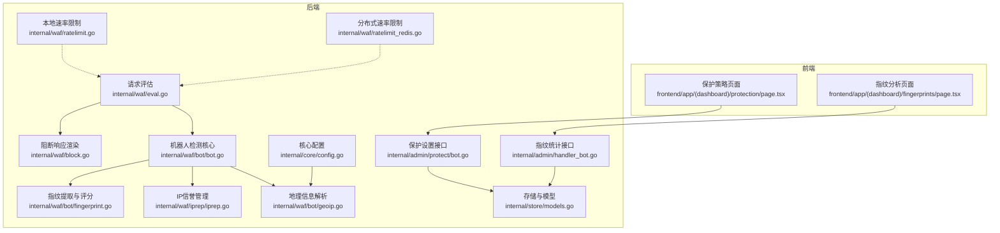
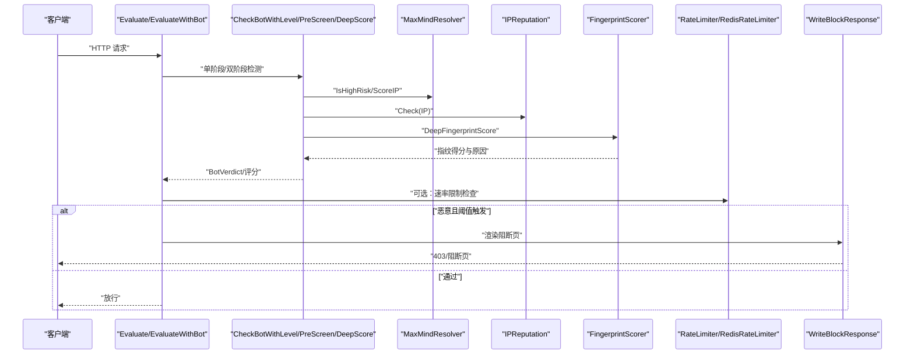
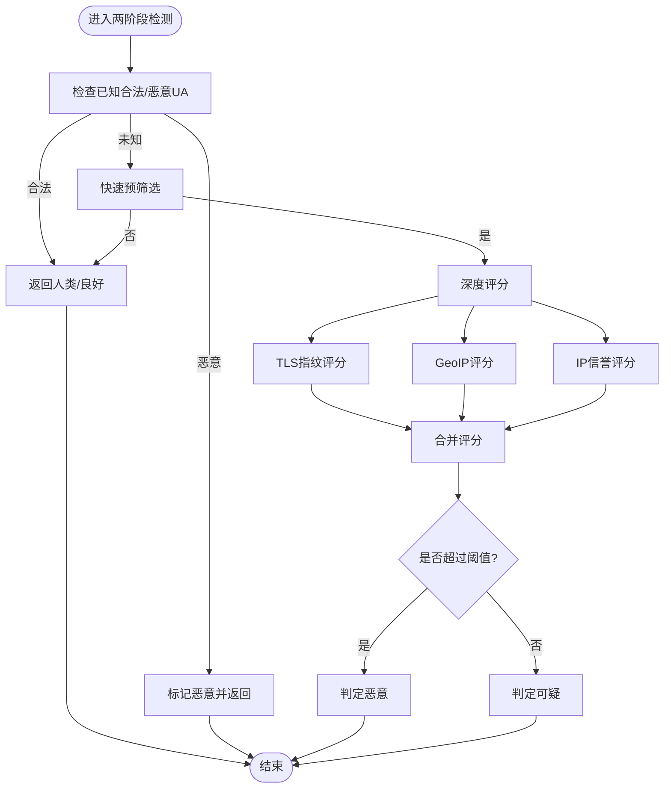
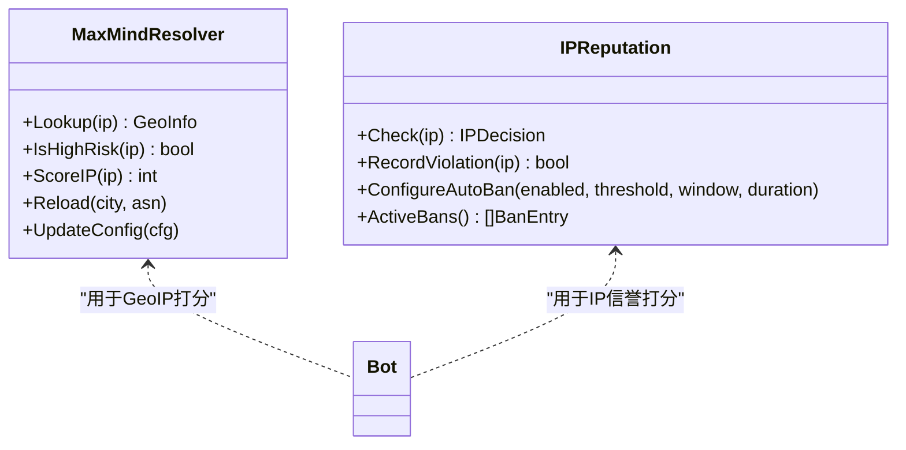
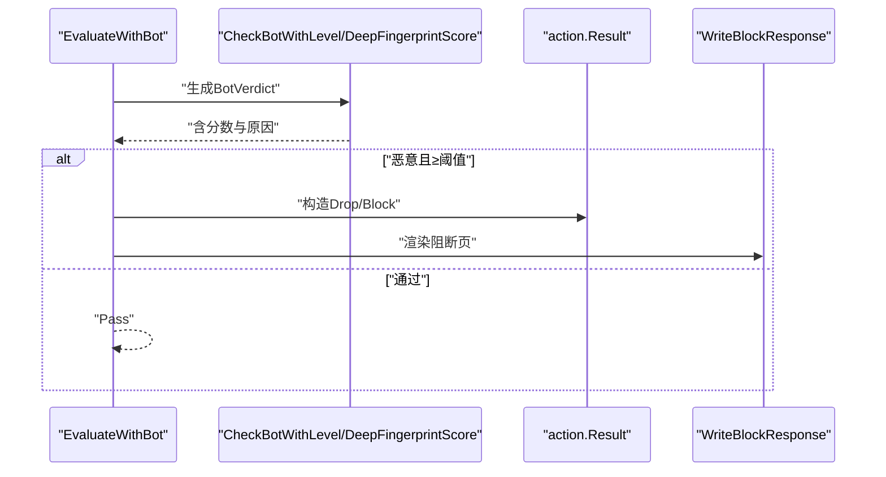
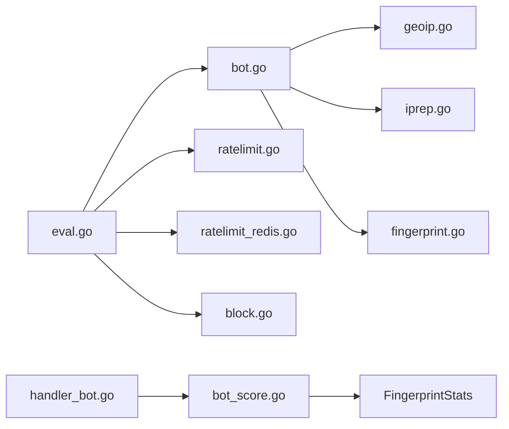

# 机器人检测阶段

<cite>
**本文引用的文件**
- [机器人检测.md](file://docs/安全防护功能/机器人检测.md)
- [bot.go](file://internal/waf/bot/bot.go)
- [geoip.go](file://internal/waf/bot/geoip.go)
- [iprep.go](file://internal/waf/iprep/iprep.go)
- [fingerprint.go](file://internal/waf/bot/fingerprint.go)
- [config.go](file://internal/core/config.go)
- [bot_score.go](file://internal/store/repository/bot_score.go)
- [page.tsx](file://frontend/app/(dashboard)/protection/page.tsx)
- [fingerprints/page.tsx](file://frontend/app/(dashboard)/fingerprints/page.tsx)
- [bot.go](file://internal/admin/protect/bot.go)
</cite>

## 目录
1. [简介](#简介)
2. [项目结构](#项目结构)
3. [核心组件](#核心组件)
4. [架构总览](#架构总览)
5. [详细组件分析](#详细组件分析)
6. [依赖分析](#依赖分析)
7. [性能考量](#性能考量)
8. [故障排查指南](#故障排查指南)
9. [结论](#结论)
10. [附录](#附录)

## 简介
本文件面向“机器人检测系统”的完整设计与实现，聚焦于以下目标：
- 解释机器人识别算法的实现原理：行为特征分析、请求模式识别、UA 指纹检测与指纹数据库匹配。
- 说明检测阈值的设置与调整方法：误报率控制与漏报率优化。
- 阐述不同类型的机器人检测策略：爬虫检测、DDoS 攻击检测与自动化工具检测。
- 解释检测结果的评估机制与反馈循环。
- 提供配置示例与性能调优建议，并说明与其他安全机制的协同工作方式。

## 项目结构
机器人检测能力由后端 WAF 引擎与前端管理界面共同构成，现已扩展为包含完整的 TLS 指纹识别系统：
- 后端核心位于 internal/waf，包含两阶段检测（快速预筛选 + 深度评分）、指纹提取与评分、地理信息与信誉评估、速率限制等模块。
- 前端位于 frontend/app/(dashboard)，提供保护策略配置页面和指纹分析页面，支持全局与站点级策略的读取与保存。
- 存储与配置模型位于 internal/store 与 internal/core，用于持久化策略、指纹统计与运行时参数。

**图表来源**
- [机器人检测.md:62-112](file://docs/安全防护功能/机器人检测.md#L62-L112)

**章节来源**
- [机器人检测.md:55-61](file://docs/安全防护功能/机器人检测.md#L55-L61)

## 核心组件
- 两阶段检测流水线
  - 快速预筛选（PreScreen）：基于 UA、IP 信誉与 GeoIP 的 O(1) 快速判定，避免深度计算开销。
  - 深度评分（DeepScore）：整合 GeoIP 得分、指纹评分与 IP 信誉，输出综合得分与明细。
- 地理与信誉
  - MaxMindResolver：按 ASN/国家进行高风险判定与打分。
  - IPReputation：黑名单/白名单、自动封禁与违规计数。
- 评估与决策
  - Evaluate/EvaluateWithBot：在标准规则之后执行机器人检测，结合指纹增强，达到阈值即阻断或降级处理。
- 阻断与维护页面
  - WriteBlockResponse/WriteMaintenanceResponse：根据站点运行时配置渲染阻断页或维护页。
- 速率限制
  - 本地固定窗口与 Redis 滑动窗口，用于 DDoS 与错误率抑制，可与机器人检测联动。

**章节来源**
- [机器人检测.md:128-147](file://docs/安全防护功能/机器人检测.md#L128-L147)

## 架构总览
机器人检测在请求处理流程中的位置如下：

**图表来源**
- [机器人检测.md:162-189](file://docs/安全防护功能/机器人检测.md#L162-L189)

## 详细组件分析

### 两阶段检测流水线
- 快速预筛选（PreScreen）
  - 触发条件：UA 匹配已知恶意工具；IP 在黑名单/自动封禁；GeoIP 判定为高风险（数据中心/代理/高风险国家）。
  - 返回 true 时进入深度评分，否则直接放行。
- 深度评分（DeepScore）
  - GeoIP 得分：数据中心/代理/高风险国家分别赋分。
  - 指纹评分：UA/头部/路径等启发式 + TLS/HTTP2 指纹数据库匹配。
  - IP 信誉：黑名单/自动封禁等级赋分。
  - 综合得分与明细（Details）用于生成最终分类与规则标识。
- 两阶段合并（CheckBotTwoPhase）
  - 先快速判定已知合法/恶意 UA，再按阈值将深度评分结果映射为"恶意/可疑"两类。

**图表来源**
- [机器人检测.md:216-237](file://docs/安全防护功能/机器人检测.md#L216-L237)

**章节来源**
- [机器人检测.md:204-215](file://docs/安全防护功能/机器人检测.md#L204-L215)

### 地理与信誉
- 地理信息（MaxMindResolver）
  - 加载 City/ASN 数据库，支持热更新。
  - IsHighRisk：O(1) 判断数据中心/代理/高风险国家。
  - ScoreIP：按类别累加风险分。
- IP 信誉（IPReputation）
  - 黑/白名单即时匹配。
  - 自动封禁：基于时间窗口内的违规计数，超阈值临时封禁。
  - 违规计数清理：定期回收过期封禁状态。

**图表来源**
- [机器人检测.md:320-344](file://docs/安全防护功能/机器人检测.md#L320-L344)

**章节来源**
- [机器人检测.md:310-354](file://docs/安全防护功能/机器人检测.md#L310-L354)

### 评估与决策
- Evaluate/EvaluateWithBot
  - 在 ACL 与路径/查询规则之后执行机器人检测。
  - 单阶段：UA 启发式 + 指纹增强；双阶段：预筛选 + 深度评分。
  - 当恶意且阈值触发时，优先采用 Drop（最高严重性），否则 Block。
- 阻断页面
  - 根据站点运行时配置或全局默认模板渲染阻断页，附带请求 ID 与规则 ID。

**图表来源**
- [机器人检测.md:363-377](file://docs/安全防护功能/机器人检测.md#L363-L377)

**章节来源**
- [机器人检测.md:355-385](file://docs/安全防护功能/机器人检测.md#L355-L385)

### 速率限制与协同
- 本地固定窗口限流（RateLimiter）
  - 基于时间窗口与最大请求数，原子计数与过期清理。
- 分布式滑动窗口限流（RedisRateLimiter）
  - 使用 Redis ZSET 实现滑动窗口，Lua 原子脚本保证一致性。
- 与机器人检测的协同
  - 可在评估阶段结合错误率/请求率限制，抑制 DDoS 与暴力扫描流量，降低误判压力。

**章节来源**
- [机器人检测.md:387-397](file://docs/安全防护功能/机器人检测.md#L387-L397)

### 配置与前端集成
- 后端配置（core.Config/BotConfig）
  - GeoIP 数据库路径、高风险国家/数据中心/代理 ASN 列表、检测阈值等。
- 系统设置（store.ProtectionConfig）
  - 全局保护策略（含机器人检测开关、自动封禁参数等）。
- 管理接口（admin.handler_protection）
  - 获取/保存保护设置，支持前端传入对象/数组字段的字符串化。
- 前端页面（protection/page.tsx）
  - 展示与编辑保护策略，支持"跟随全局配置/使用自定义配置"。
- 指纹分析页面（fingerprints/page.tsx）
  - 展示指纹统计信息和异常告警。
  - 支持浏览器分布可视化和Top指纹列表。

**章节来源**
- [机器人检测.md:435-453](file://docs/安全防护功能/机器人检测.md#L435-L453)

## 依赖分析
- 组件耦合
  - Evaluate/EvaluateWithBot 依赖 Bot、FingerprintScorer、MaxMindResolver、IPReputation。
  - Bot 依赖 GeoIP 与 IP 信誉模块，指纹评分器作为独立组件复用。
  - 速率限制模块与评估模块松耦合，可通过配置启用。
- 外部依赖
  - MaxMind 数据库文件（City/ASN）。
  - Redis（可选，用于分布式限流）。
- 潜在环路
  - 未发现直接循环依赖；模块职责清晰，数据流单向。

**图表来源**
- [机器人检测.md:467-492](file://docs/安全防护功能/机器人检测.md#L467-L492)

**章节来源**
- [机器人检测.md:455-505](file://docs/安全防护功能/机器人检测.md#L455-L505)

## 性能考量
- 两阶段检测显著降低深度评分的触发频率，提升吞吐。
- 指纹评分器复用默认实例，减少分配开销。
- GeoIP 与 IP 信誉采用哈希集合与原子计数，查询/更新均为常数级复杂度。
- 速率限制本地与 Redis 两种实现，可根据部署规模选择。
- 建议
  - 将高成本指纹评分置于预筛选命中后再执行。
  - 合理设置 GeoIP 高风险清单与阈值，避免过度误报。
  - 对 Redis 限流开启连接池与超时控制，保障稳定性。

**章节来源**
- [机器人检测.md:507-520](file://docs/安全防护功能/机器人检测.md#L507-L520)

## 故障排查指南
- 常见问题
  - GeoIP 数据库加载失败：确认路径与权限，查看日志警告并降级处理。
  - 自动封禁频繁误伤：降低阈值或延长窗口/封禁时长，或加入白名单。
  - 速率限制误杀：调整窗口与上限，区分 4xx/5xx 计数策略。
- 排查步骤
  - 查看 BotVerdict 的 Reason 与 Details，定位具体触发项（UA、GeoIP、指纹、IP 信誉）。
  - 结合系统事件与安全事件记录，核对规则 ID 与命中描述。
  - 使用测试用例验证指纹与 UA 规则的行为预期。

**章节来源**
- [机器人检测.md:520-541](file://docs/安全防护功能/机器人检测.md#L520-L541)

## 结论
该机器人检测系统以"两阶段快速预筛选 + 深度指纹评分"为核心，结合地理与信誉信息，形成多维度的风险画像。通过可配置的阈值与评分权重，可在误报与漏报之间取得平衡；配合速率限制与阻断页面，能够有效抵御爬虫、自动化扫描与 DDoS 攻击。前端保护策略页面与后端配置模型打通，便于运维人员按需调整策略并观测效果。

## 附录

### 检测阈值与调整方法
- 单阶段阈值（CheckBotWithLevel）
  - 低/中/高三种敏感度对应不同的恶意与可疑阈值，用于 UA 启发式与指纹增强后的综合评分。
- 两阶段阈值（CheckBotTwoPhase）
  - 默认阈值为 80；当综合得分达到阈值时判定为恶意，否则为可疑；可按业务需求调整。
- 误报率控制
  - 降低阈值或减少指纹评分权重；加入白名单与已知合法 UA；缩小高风险国家/ASN 列表。
- 漏报率优化
  - 提升阈值或增加指纹评分权重；扩大高风险国家/ASN 列表；启用更严格的 TLS/HTTP2 一致性检查。

**章节来源**
- [机器人检测.md:547-564](file://docs/安全防护功能/机器人检测.md#L547-L564)

### 不同类型机器人检测策略
- 爬虫检测
  - 已知合法 UA 白名单优先放行；UA 启发式与指纹一致性检查辅助识别伪装爬虫。
- DDoS 攻击检测
  - 速率限制（本地/Redis）与错误率统计；与机器人检测联动，对高风险来源实施降级或阻断。
- 自动化工具检测
  - 已知恶意工具 UA 匹配；指纹库中恶意 JA3/JA4；UA/头部/路径等启发式组合。

**章节来源**
- [机器人检测.md:566-583](file://docs/安全防护功能/机器人检测.md#L566-L583)

### 检测结果评估与反馈循环
- 评估指标
  - 误报率：将正常用户判定为机器人的比例；应通过白名单与阈值微调降低。
  - 漏报率：将攻击者判定为正常的比例；应通过指纹库扩展与阈值提升减少。
  - 响应时间：两阶段检测与指纹评分的延迟；可通过缓存与阈值优化改善。
- 反馈循环
  - 基于安全事件与系统日志，持续调整阈值、高风险清单与指纹库；前端保护策略页面支持快速迭代。

**章节来源**
- [机器人检测.md:585-597](file://docs/安全防护功能/机器人检测.md#L585-L597)

### 配置示例与性能调优建议
- 环境变量与默认值
  - MY_OPENWAF_GEOIP_DB：GeoIP 数据库路径（为空则降级）。
  - MY_OPENWAF_BOT_THRESHOLD：机器人检测阈值，默认 80。
  - MY_OPENWAF_DROP_ENABLED/MY_OPENWAF_DROP_BOT_THRESHOLD：阻断策略开关与阈值。
- 前端配置要点
  - 保护策略页面支持"跟随全局配置/使用自定义配置"，便于按站点差异化调整。
- 调优建议
  - 从默认阈值开始，结合业务流量特征逐步微调；优先优化误报，再考虑漏报。
  - 对高频但低风险来源（如搜索引擎）建立白名单；对高风险地区/ASN 保持严格策略。
  - 开启 Redis 限流以支撑分布式部署，确保 Lua 脚本可用与网络稳定。

**章节来源**
- [机器人检测.md:599-618](file://docs/安全防护功能/机器人检测.md#L599-L618)

### 机器人检测算法实现细节
- 已知合法 UA 白名单
  - 包含主流搜索引擎与社交平台的机器人标识。
- 已知恶意工具 UA 列表
  - 覆盖 SQL 注入工具、端口扫描器、Web 应用扫描器、暴力破解工具等。
- 指纹评分规则
  - UA 空值与过短、Accept 头部异常、语言与编码缺失、自动化库特征、虚假 Mozilla 标识、连接关闭、无 Cookie 的 POST 请求、扫描器路径特征、无 Referer 的 POST、Chrome Without Safari 等。
- 评分权重分配
  - 不同异常特征赋予不同分数，综合得分决定最终分类。

**章节来源**
- [bot.go:71-116](file://internal/waf/bot/bot.go#L71-L116)
- [bot.go:236-290](file://internal/waf/bot/bot.go#L236-L290)

### 地理与信誉评分技术细节
- MaxMind 数据库集成
  - 支持 City 与 ASN 数据库，提供国家、城市、ASN 与组织信息。
- 高风险判定逻辑
  - 数据中心 ASNs、VPN/代理 ASNs 与高风险国家列表。
- IP 信誉评分
  - 黑名单与白名单即时匹配，自动封禁基于违规计数的时间窗口策略。

**章节来源**
- [geoip.go:40-112](file://internal/waf/bot/geoip.go#L40-L112)
- [iprep.go:41-150](file://internal/waf/iprep/iprep.go#L41-L150)

### 机器人评分系统计算逻辑
- 评分构成
  - GeoIPScore：基于 ASN 与国家的高风险评分。
  - FingerprintScore：UA/头部/路径等启发式评分。
  - BehaviorScore：行为特征评分（预留）。
  - IPRepScore：IP 信誉评分（黑名单/自动封禁等级）。
- 分类映射
  - 总分 ≥ 80：恶意；总分 ≥ 40：可疑；否则：人类。

**章节来源**
- [bot.go:13-30](file://internal/waf/bot/bot.go#L13-L30)
- [bot.go:196-234](file://internal/waf/bot/bot.go#L196-L234)
- [bot.go:322-332](file://internal/waf/bot/bot.go#L322-L332)

### 机器人检测配置最佳实践
- 阈值调节
  - 默认阈值 80，根据误报与漏报情况微调。
  - 高风险国家/ASN 列表应定期更新，避免过度误伤。
- GeoIP 集成
  - 确保 GeoIP 数据库路径正确，数据库文件具备读权限。
  - 在数据库加载失败时，系统将降级处理但仍可继续运行。
- 误判处理策略
  - 建立已知合法 UA 白名单，特别是搜索引擎与社交媒体爬虫。
  - 对自动封禁策略进行精细化配置，避免对正常用户造成影响。
- 性能优化
  - 启用两阶段检测，减少深度评分的触发频率。
  - 使用 Redis 限流进行分布式部署，确保限流策略的一致性。
  - 定期清理过期封禁状态，维持系统性能。

**章节来源**
- [config.go:10-18](file://internal/core/config.go#L10-L18)
- [config.go:138-182](file://internal/core/config.go#L138-L182)
- [bot_score.go:54-70](file://internal/store/repository/bot_score.go#L54-L70)
- [page.tsx:63-156](file://frontend/app/(dashboard)/protection/page.tsx#L63-L156)