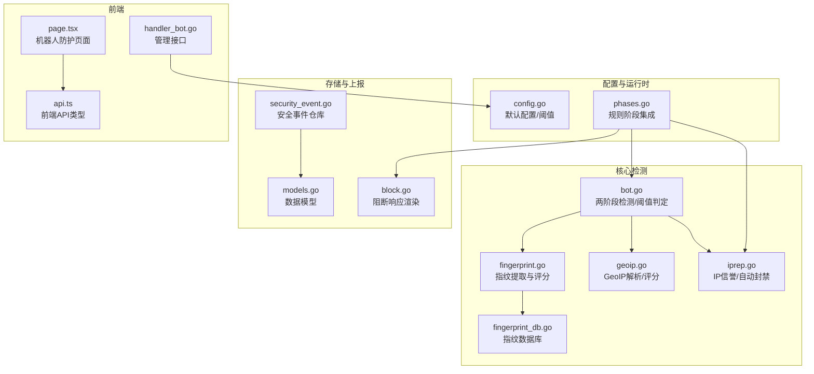
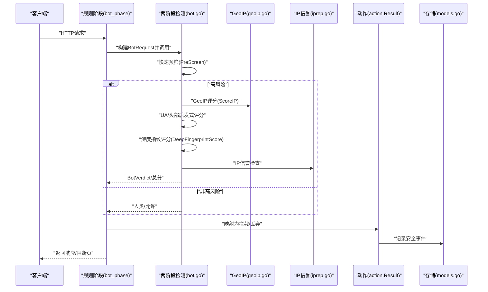
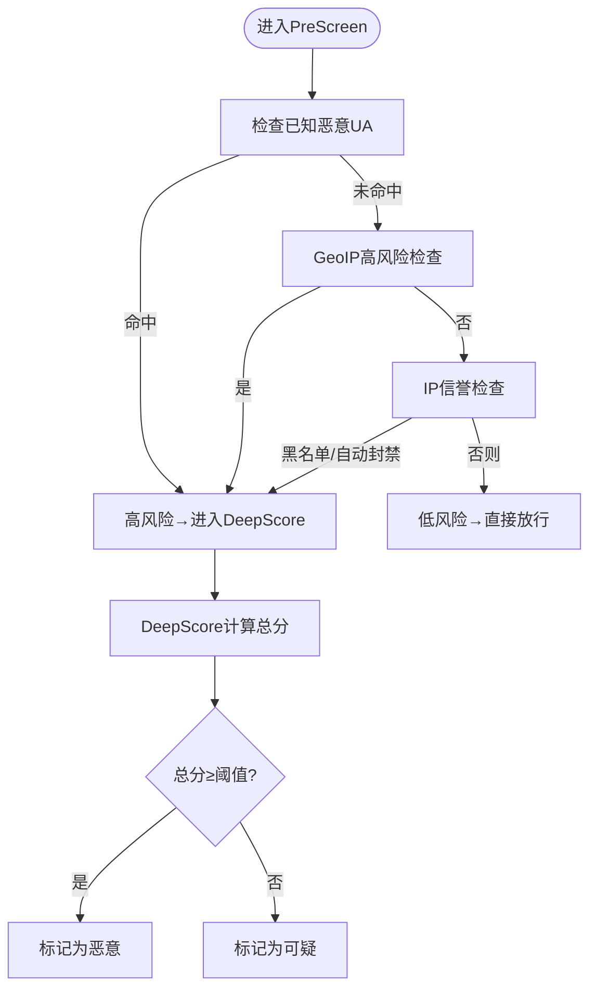
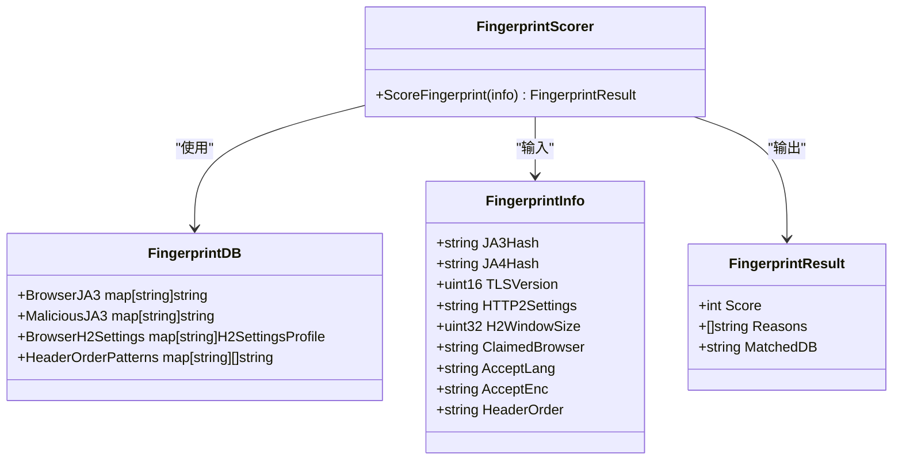
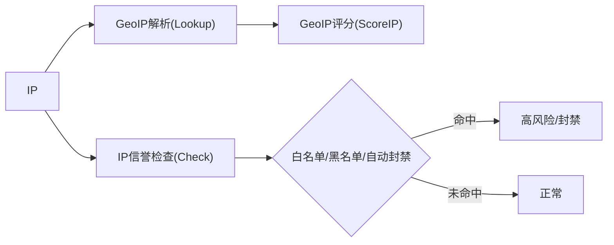
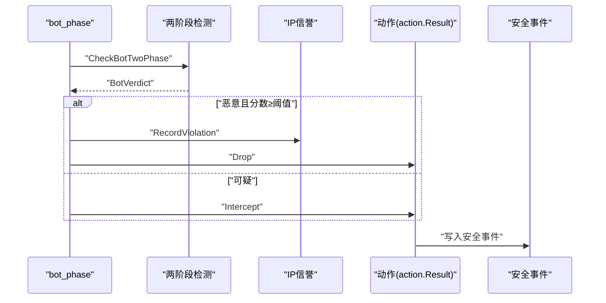
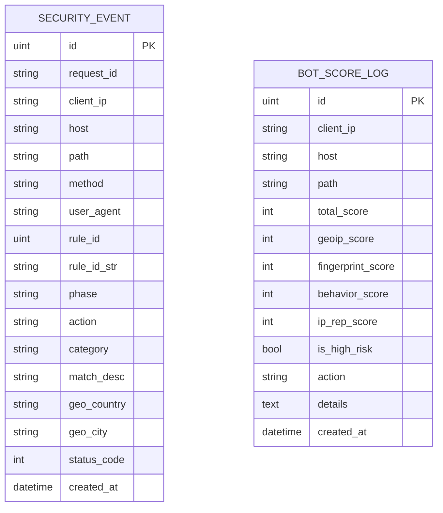
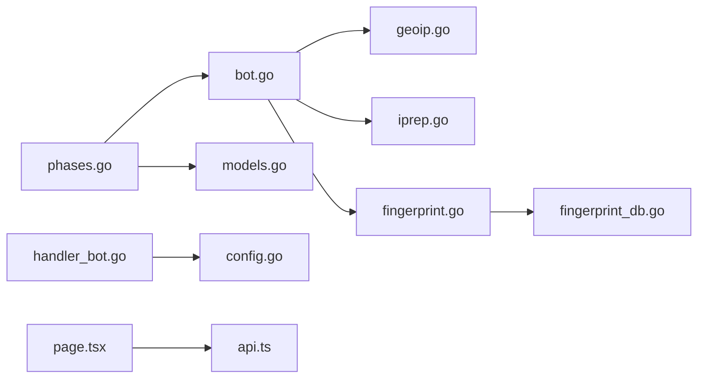

# 机器人检测阶段

<cite>
**本文引用的文件**
- [bot.go](file://internal/waf/bot.go)
- [bot_test.go](file://internal/waf/bot_test.go)
- [fingerprint.go](file://internal/waf/fingerprint.go)
- [fingerprint_db.go](file://internal/waf/fingerprint_db.go)
- [fingerprint_test.go](file://internal/waf/fingerprint_test.go)
- [geoip.go](file://internal/waf/geoip.go)
- [iprep.go](file://internal/waf/iprep.go)
- [config.go](file://internal/core/config.go)
- [phases.go](file://internal/core/rules/phases.go)
- [block.go](file://internal/waf/block.go)
- [security_event.go](file://internal/store/repository/security_event.go)
- [models.go](file://internal/store/models.go)
- [handler_bot.go](file://internal/admin/handler_bot.go)
- [page.tsx](file://frontend/app/(dashboard)/bot-protection/page.tsx)
- [api.ts](file://frontend/lib/api.ts)
</cite>

## 目录
1. [简介](#简介)
2. [项目结构](#项目结构)
3. [核心组件](#核心组件)
4. [架构总览](#架构总览)
5. [详细组件分析](#详细组件分析)
6. [依赖关系分析](#依赖关系分析)
7. [性能考量](#性能考量)
8. [故障排查指南](#故障排查指南)
9. [结论](#结论)
10. [附录](#附录)

## 简介
本章节面向“机器人检测阶段”的实现与使用，系统性阐述两阶段检测流程（快速预筛 + 深度打分）、检测级别与处置动作、检测结果记录与上报、以及精度优化与误判处理策略。文档同时覆盖前端配置界面与后端数据模型，帮助读者从部署到运维全链路掌握机器人防护能力。

## 项目结构
机器人检测功能主要分布在以下模块：
- 核心检测逻辑：两阶段检测、指纹分析、地理信息与IP信誉评分
- 配置与运行时：全局配置、站点级保护配置、阈值与规则ID
- 管道集成：规则引擎阶段接入，将检测结果转化为拦截/丢弃动作
- 存储与上报：安全事件与机器人打分日志持久化
- 前端管理：可视化配置与查询机器人打分日志

**图表来源**
- [bot.go:1-455](file://internal/waf/bot.go#L1-L455)
- [fingerprint.go:1-305](file://internal/waf/fingerprint.go#L1-L305)
- [fingerprint_db.go:1-233](file://internal/waf/fingerprint_db.go#L1-L233)
- [geoip.go:1-274](file://internal/waf/geoip.go#L1-L274)
- [iprep.go:1-243](file://internal/waf/iprep.go#L1-L243)
- [config.go:1-183](file://internal/core/config.go#L1-L183)
- [phases.go:147-232](file://internal/core/rules/phases.go#L147-L232)
- [block.go:1-110](file://internal/waf/block.go#L1-L110)
- [security_event.go:1-192](file://internal/store/repository/security_event.go#L1-L192)
- [models.go:413-430](file://internal/store/models.go#L413-L430)
- [handler_bot.go:38-134](file://internal/admin/handler_bot.go#L38-L134)
- [page.tsx:1-302](file://frontend/app/(dashboard)/bot-protection/page.tsx#L1-L302)
- [api.ts:118-141](file://frontend/lib/api.ts#L118-L141)

**章节来源**
- [bot.go:1-455](file://internal/waf/bot.go#L1-L455)
- [fingerprint.go:1-305](file://internal/waf/fingerprint.go#L1-L305)
- [geoip.go:1-274](file://internal/waf/geoip.go#L1-L274)
- [iprep.go:1-243](file://internal/waf/iprep.go#L1-L243)
- [config.go:1-183](file://internal/core/config.go#L1-L183)
- [phases.go:147-232](file://internal/core/rules/phases.go#L147-L232)
- [block.go:1-110](file://internal/waf/block.go#L1-L110)
- [security_event.go:1-192](file://internal/store/repository/security_event.go#L1-L192)
- [models.go:413-430](file://internal/store/models.go#L413-L430)
- [handler_bot.go:38-134](file://internal/admin/handler_bot.go#L38-L134)
- [page.tsx:1-302](file://frontend/app/(dashboard)/bot-protection/page.tsx#L1-L302)
- [api.ts:118-141](file://frontend/lib/api.ts#L118-L141)

## 核心组件
- 两阶段检测管线
  - 快速预筛：基于UA黑名单、IP信誉黑名单/自动封禁、GeoIP高风险信号，决定是否进入深度打分
  - 深度打分：综合GeoIP评分、指纹评分、IP信誉评分，输出总分与明细
- 指纹评分系统
  - 提取JA3/JA4、TLS版本、HTTP/2设置、头部顺序等，匹配指纹库并进行一致性校验
- 地理位置与IP信誉
  - GeoIP解析国家/ASN，按数据中心/代理/高风险国家打分；IP信誉支持白名单、黑名单、自动封禁
- 规则阶段集成
  - 将检测结果映射为拦截或丢弃动作，并记录安全事件
- 结果记录与上报
  - 安全事件与机器人打分日志持久化，支持前端查询与统计

**章节来源**
- [bot.go:126-455](file://internal/waf/bot.go#L126-L455)
- [fingerprint.go:98-163](file://internal/waf/fingerprint.go#L98-L163)
- [geoip.go:153-223](file://internal/waf/geoip.go#L153-L223)
- [iprep.go:89-124](file://internal/waf/iprep.go#L89-L124)
- [phases.go:172-232](file://internal/core/rules/phases.go#L172-L232)
- [security_event.go:30-60](file://internal/store/repository/security_event.go#L30-L60)
- [models.go:413-430](file://internal/store/models.go#L413-L430)

## 架构总览
两阶段检测在规则阶段执行，优先通过快速预筛，仅对高风险请求执行深度打分。最终根据阈值将结果归类为“恶意”或“可疑”，并触发相应处置动作（拦截或丢弃）。处置结果会写入安全事件与机器人打分日志，供前端查询与统计。

**图表来源**
- [phases.go:197-232](file://internal/core/rules/phases.go#L197-L232)
- [bot.go:126-161](file://internal/waf/bot.go#L126-L161)
- [bot.go:167-224](file://internal/waf/bot.go#L167-L224)
- [geoip.go:191-223](file://internal/waf/geoip.go#L191-L223)
- [iprep.go:89-124](file://internal/waf/iprep.go#L89-L124)
- [models.go:214-236](file://internal/store/models.go#L214-L236)

## 详细组件分析

### 两阶段检测流程
- 快速预筛（PreScreen）
  - 已知恶意UA命中即高风险
  - IP信誉命中黑名单/自动封禁即高风险
  - GeoIP高风险（数据中心/代理/高风险国家）即高风险
- 深度打分（DeepScore）
  - GeoIP评分：数据中心+代理+高风险国家加权
  - 指纹评分：UA/头部启发式 + 深度指纹（JA3/JA4/TLS/HTTP2/头部顺序）
  - IP信誉评分：黑名单/自动封禁/其他
  - 总分为各子项之和，生成明细详情

**图表来源**
- [bot.go:126-161](file://internal/waf/bot.go#L126-L161)
- [bot.go:167-224](file://internal/waf/bot.go#L167-L224)

**章节来源**
- [bot.go:126-161](file://internal/waf/bot.go#L126-L161)
- [bot.go:167-224](file://internal/waf/bot.go#L167-L224)

### 指纹评分系统
- 指纹提取（ExtractFingerprint）
  - 支持从请求头读取JA3/JA4、TLS版本、HTTP/2设置、头部顺序等
- 指纹评分（ScoreFingerprint）
  - 已知恶意JA3：直接高分并标注原因
  - 浏览器指纹一致性：声称浏览器与指纹不一致则加分
  - 未验证JA4/旧TLS版本/HTTP/2设置异常/头部顺序异常均加分
- 指纹数据库（DefaultFingerprintDB）
  - 内置浏览器/工具指纹、HTTP/2设置、头部顺序模式

**图表来源**
- [fingerprint.go:98-163](file://internal/waf/fingerprint.go#L98-L163)
- [fingerprint_db.go:25-33](file://internal/waf/fingerprint_db.go#L25-L33)
- [fingerprint_db.go:35-185](file://internal/waf/fingerprint_db.go#L35-L185)

**章节来源**
- [fingerprint.go:42-96](file://internal/waf/fingerprint.go#L42-L96)
- [fingerprint.go:98-163](file://internal/waf/fingerprint.go#L98-L163)
- [fingerprint_db.go:25-33](file://internal/waf/fingerprint_db.go#L25-L33)
- [fingerprint_test.go:1-142](file://internal/waf/fingerprint_test.go#L1-L142)

### 地理位置与IP信誉
- GeoIP解析与评分
  - Lookup返回国家/城市/ASN/组织
  - IsHighRisk用于快速判断
  - ScoreIP给出数值化风险分
- IP信誉
  - 白名单/黑名单即时生效
  - 自动封禁：窗口内违规次数超过阈值即封禁一段时间
  - 违规计数清理与热更新支持

**图表来源**
- [geoip.go:127-151](file://internal/waf/geoip.go#L127-L151)
- [geoip.go:191-223](file://internal/waf/geoip.go#L191-L223)
- [iprep.go:89-124](file://internal/waf/iprep.go#L89-L124)
- [iprep.go:126-155](file://internal/waf/iprep.go#L126-L155)

**章节来源**
- [geoip.go:127-151](file://internal/waf/geoip.go#L127-L151)
- [geoip.go:191-223](file://internal/waf/geoip.go#L191-L223)
- [iprep.go:89-124](file://internal/waf/iprep.go#L89-L124)
- [iprep.go:126-155](file://internal/waf/iprep.go#L126-L155)

### 规则阶段集成与处置动作
- bot_phase执行两阶段检测
- 恶意：记录违规并按阈值决定拦截或丢弃
- 可疑：按阈值映射为可疑类别
- 动作结果写入安全事件

**图表来源**
- [phases.go:197-232](file://internal/core/rules/phases.go#L197-L232)
- [bot.go:396-455](file://internal/waf/bot.go#L396-L455)
- [iprep.go:126-155](file://internal/waf/iprep.go#L126-L155)
- [models.go:214-236](file://internal/store/models.go#L214-L236)

**章节来源**
- [phases.go:172-232](file://internal/core/rules/phases.go#L172-L232)
- [bot.go:396-455](file://internal/waf/bot.go#L396-L455)
- [iprep.go:126-155](file://internal/waf/iprep.go#L126-L155)
- [models.go:214-236](file://internal/store/models.go#L214-L236)

### 检测级别与处置动作
- 级别定义
  - 恶意：指纹或总分达到阈值，通常触发丢弃（TCP连接关闭）
  - 可疑：指纹或总分处于中间区间，触发拦截（HTTP响应）
- 处置动作
  - 恶意且高分：丢弃（Drop），不发送HTTP响应
  - 可疑：拦截（Intercept），返回阻断页
- 规则ID与分类
  - 两阶段检测使用bot:deep:*规则ID
  - 分类字段用于前端展示与统计

**章节来源**
- [bot.go:420-455](file://internal/waf/bot.go#L420-L455)
- [phases.go:212-231](file://internal/core/rules/phases.go#L212-L231)
- [models.go:214-236](file://internal/store/models.go#L214-L236)

### 检测结果记录与上报
- 安全事件
  - 字段包含请求ID、客户端IP、主机、路径、方法、用户代理、规则ID、阶段、动作、类别、匹配描述、地理信息、状态码
  - 支持列表、聚合统计、时间线等查询
- 机器人打分日志
  - 记录总分、各项子分、是否高风险、动作、详情、创建时间
  - 支持按IP、时间范围、分数区间过滤

**图表来源**
- [models.go:214-236](file://internal/store/models.go#L214-L236)
- [models.go:413-430](file://internal/store/models.go#L413-L430)

**章节来源**
- [security_event.go:30-60](file://internal/store/repository/security_event.go#L30-L60)
- [models.go:214-236](file://internal/store/models.go#L214-L236)
- [models.go:413-430](file://internal/store/models.go#L413-L430)

### 前端配置与查询
- 后端管理接口
  - 获取/更新机器人配置（启用、阈值、高风险国家、数据中心/代理ASN、GeoIP数据库路径）
  - 查询机器人打分日志（分页、过滤）
- 前端页面
  - 设置页：开关、阈值、风险列表编辑
  - 日志页：按IP/时间/分数筛选，分页查看

**章节来源**
- [handler_bot.go:38-134](file://internal/admin/handler_bot.go#L38-L134)
- [page.tsx:1-302](file://frontend/app/(dashboard)/bot-protection/page.tsx#L1-L302)
- [api.ts:118-141](file://frontend/lib/api.ts#L118-L141)

## 依赖关系分析
- 组件耦合
  - bot.go依赖geoip.go与iprep.go进行外部信号评分
  - fingerprint.go依赖fingerprint_db.go进行指纹匹配
  - phases.go依赖bot.go完成两阶段检测并将结果写入安全事件
- 外部依赖
  - MaxMind数据库（可热重载）
  - 数据库存储安全事件与机器人打分日志

**图表来源**
- [bot.go:1-455](file://internal/waf/bot.go#L1-L455)
- [geoip.go:1-274](file://internal/waf/geoip.go#L1-L274)
- [iprep.go:1-243](file://internal/waf/iprep.go#L1-L243)
- [fingerprint.go:1-305](file://internal/waf/fingerprint.go#L1-L305)
- [fingerprint_db.go:1-233](file://internal/waf/fingerprint_db.go#L1-L233)
- [phases.go:147-232](file://internal/core/rules/phases.go#L147-L232)
- [models.go:214-236](file://internal/store/models.go#L214-L236)
- [handler_bot.go:38-134](file://internal/admin/handler_bot.go#L38-L134)
- [config.go:1-183](file://internal/core/config.go#L1-183)
- [page.tsx:1-302](file://frontend/app/(dashboard)/bot-protection/page.tsx#L1-L302)
- [api.ts:118-141](file://frontend/lib/api.ts#L118-L141)

**章节来源**
- [bot.go:1-455](file://internal/waf/bot.go#L1-L455)
- [phases.go:147-232](file://internal/core/rules/phases.go#L147-L232)
- [models.go:214-236](file://internal/store/models.go#L214-L236)

## 性能考量
- 快速预筛成本极低，避免对普通请求执行深度打分
- GeoIP与指纹评分均为常量时间操作，整体开销可控
- IP信誉自动封禁采用原子计数与定期清理，降低内存占用
- 建议
  - 合理设置阈值，避免过度敏感导致误伤
  - 使用指纹数据库热更新，减少维护成本
  - 对高频打分场景启用缓存与批量写入

[本节为通用指导，无需特定文件来源]

## 故障排查指南
- 常见问题
  - 指纹误报：浏览器环境与声明不一致导致高分
  - GeoIP误报：某些国家/ASN被标记为高风险
  - IP信誉误封：阈值过低或窗口过短
- 排查步骤
  - 查看安全事件与机器人打分日志，确认类别与规则ID
  - 调整阈值与风险列表，观察命中率变化
  - 检查指纹数据库与GeoIP数据库是否正确加载
  - 关注自动封禁状态，必要时临时放宽策略

**章节来源**
- [security_event.go:30-60](file://internal/store/repository/security_event.go#L30-L60)
- [models.go:413-430](file://internal/store/models.go#L413-L430)
- [geoip.go:99-111](file://internal/waf/geoip.go#L99-L111)
- [iprep.go:68-79](file://internal/waf/iprep.go#L68-L79)

## 结论
该机器人检测阶段通过两阶段策略在性能与准确性之间取得平衡：快速预筛过滤低风险流量，深度打分结合地理位置、指纹与信誉信号提升识别精度。配合完善的记录与上报机制，管理员可在前端进行精细化配置与监控，持续优化检测效果并降低误判影响。

[本节为总结，无需特定文件来源]

## 附录

### 检测精度优化与误判处理
- 优化策略
  - 动态调整阈值：根据业务流量与攻击趋势调整总分阈值
  - 指纹库维护：定期更新指纹数据库，减少误报
  - GeoIP风险列表：按区域与ISP动态调整高风险国家/ASN
  - 行为特征扩展：引入行为评分（预留字段），逐步增强识别能力
- 误判处理
  - 白名单：将误伤IP加入白名单，绕过检测
  - 降级策略：在误判高峰期间提高阈值或暂时关闭可疑拦截
  - 回溯分析：通过安全事件与打分日志定位误判根因

**章节来源**
- [config.go:10-18](file://internal/core/config.go#L10-L18)
- [handler_bot.go:57-101](file://internal/admin/handler_bot.go#L57-L101)
- [iprep.go:61-66](file://internal/waf/iprep.go#L61-L66)

### 不同类型机器人特征与防护建议
- 工具型机器人（恶意）
  - 特征：已知恶意UA（如扫描器、SQL注入工具）、常见自动化库UA、典型路径探测
  - 防护：快速预筛命中即高风险，建议阈值下调以提升拦截率
- 爬虫型机器人（良好）
  - 特征：搜索引擎爬虫UA
  - 防护：优先放行，避免影响SEO
- 行为异常机器人（可疑/恶意）
  - 特征：指纹不一致、旧TLS版本、HTTP/2设置异常、头部顺序异常
  - 防护：适度提高阈值，结合GeoIP与IP信誉信号综合判定

**章节来源**
- [bot.go:79-97](file://internal/waf/bot.go#L79-L97)
- [bot.go:228-297](file://internal/waf/bot.go#L228-L297)
- [fingerprint.go:98-163](file://internal/waf/fingerprint.go#L98-L163)
- [fingerprint_db.go:82-116](file://internal/waf/fingerprint_db.go#L82-L116)