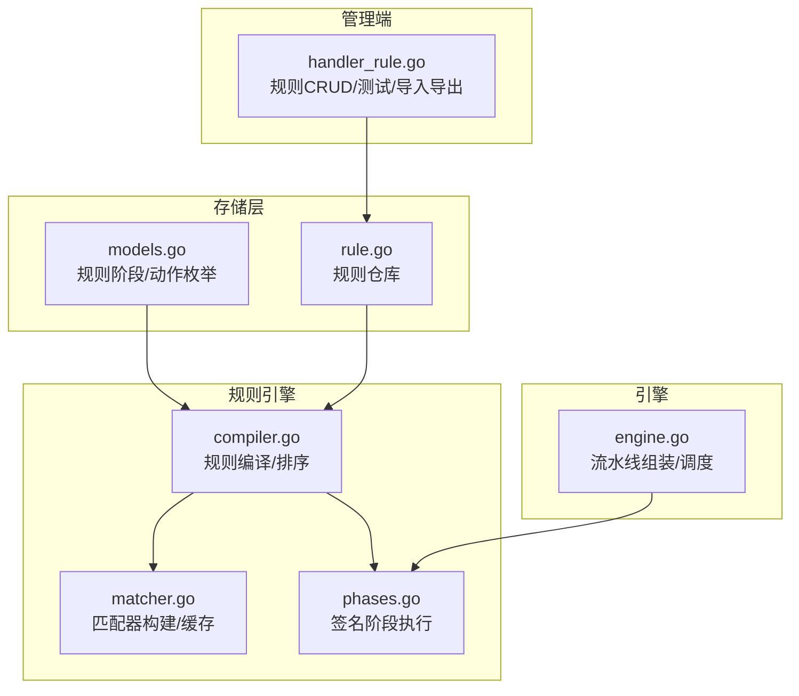
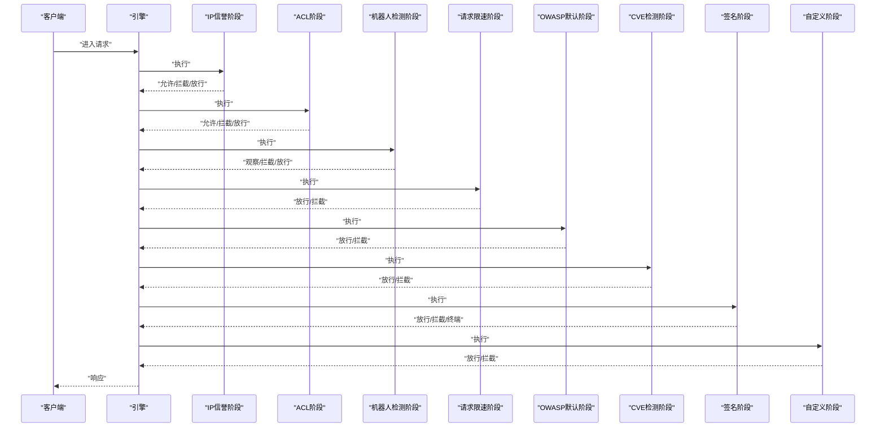
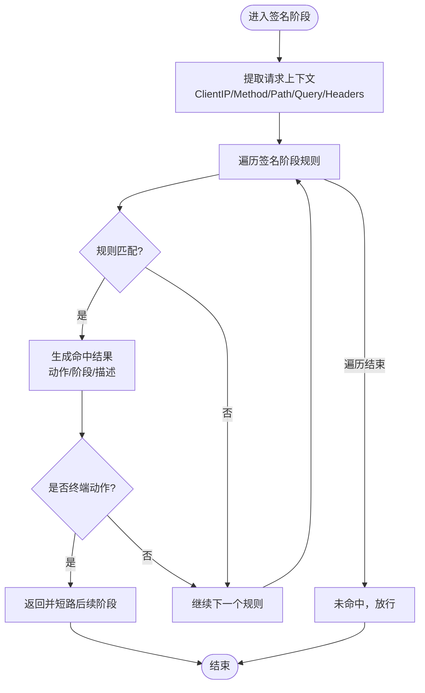
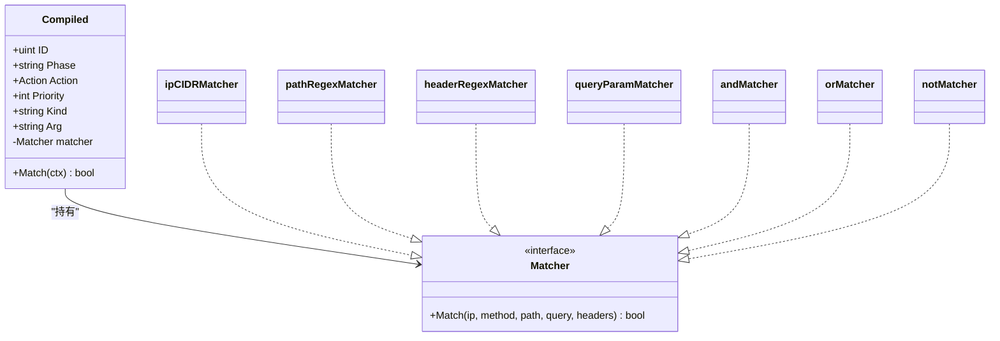
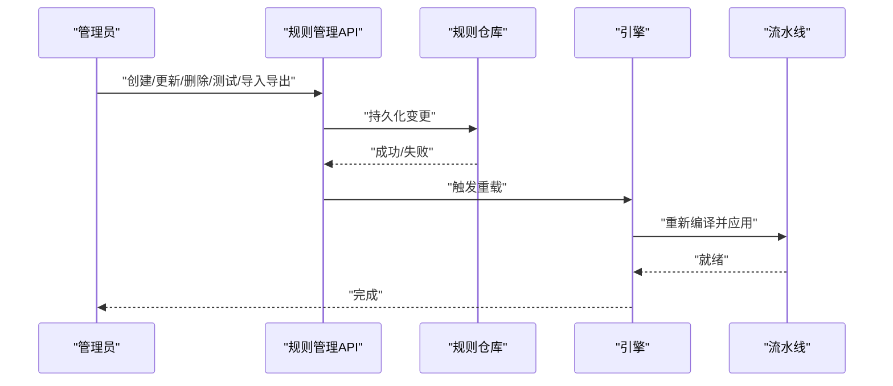
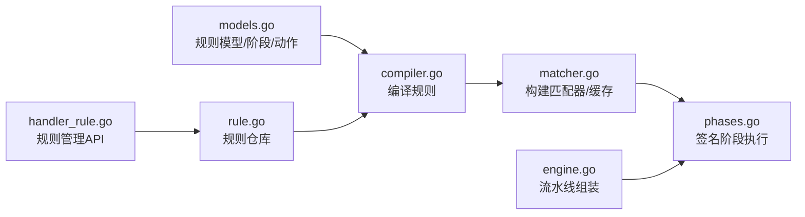

# 签名检测阶段

> [返回 WAF 引擎系统](../WAF 引擎系统.md)

<cite>
**本文档引用的文件**
- [签名检测阶段.md](file://docs/WAF 引擎系统/处理阶段详解/签名检测阶段.md)
- [matcher.go](file://internal/core/rules/matcher.go)
- [compiler.go](file://internal/core/rules/compiler.go)
- [phases.go](file://internal/core/rules/phases.go)
- [engine.go](file://internal/core/engine/engine.go)
- [rule.go](file://internal/store/repository/rule.go)
- [owasp.go](file://internal/waf/owasp/owasp.go)
- [owasp_extended.go](file://internal/waf/owasp/owasp_extended.go)
</cite>

## 目录
1. [简介](#简介)
2. [项目结构](#项目结构)
3. [核心组件](#核心组件)
4. [架构总览](#架构总览)
5. [详细组件分析](#详细组件分析)
6. [依赖关系分析](#依赖关系分析)
7. [性能考量](#性能考量)
8. [故障排查指南](#故障排查指南)
9. [结论](#结论)
10. [附录](#附录)

## 简介
本文件聚焦于“签名检测阶段”，系统性阐述其工作原理、匹配算法与处理流程，以及与ACL、自定义规则、OWASP默认规则、CVE检测等其他阶段的协作关系。同时提供签名规则的配置方法、更新策略，以及检测精度优化与误报处理的最佳实践。

## 项目结构
签名检测阶段位于核心规则引擎中，采用“编译期构建匹配器 + 运行期顺序匹配”的设计：
- 规则模型与阶段常量定义在存储层（store）
- 规则编译与匹配器构建在规则引擎（rules）
- 执行阶段在规则阶段实现（rules/phases），并被引擎统一调度（engine）
- 管理端提供规则增删改查与测试接口（admin handler）

**图表来源**
- [签名检测阶段.md:39-62](file://docs/WAF 引擎系统/处理阶段详解/签名检测阶段.md#L39-L62)

**章节来源**
- [签名检测阶段.md:32-78](file://docs/WAF 引擎系统/处理阶段详解/签名检测阶段.md#L32-L78)

## 核心组件
- 规则模型与阶段
  - 阶段枚举包含 acl、signature、custom 等；动作枚举包含 allow、intercept、observe、drop 等
- 编译器
  - 将持久化规则转换为运行时可直接匹配的 Compiled 切片，并按优先级排序
- 匹配器
  - 支持复合条件（and/or/not）与多种字段匹配（IP、路径、查询串、头部、内容类型、用户代理、正则、参数等）
  - 正则表达式具备缓存以降低重复编译开销
- 签名阶段
  - 对签名阶段规则进行顺序匹配，命中即返回结果，支持终端动作短路
- 引擎
  - 统一组装流水线，按顺序执行各阶段（含签名阶段）

**章节来源**
- [签名检测阶段.md:80-98](file://docs/WAF 引擎系统/处理阶段详解/签名检测阶段.md#L80-L98)

## 架构总览
签名检测阶段在引擎流水线中的位置如下：

**图表来源**
- [签名检测阶段.md:103-133](file://docs/WAF 引擎系统/处理阶段详解/签名检测阶段.md#L103-L133)

**章节来源**
- [签名检测阶段.md:100-141](file://docs/WAF 引擎系统/处理阶段详解/签名检测阶段.md#L100-L141)

## 详细组件分析

### 签名阶段执行流程
- 输入：从流水线上下文提取客户端IP、方法、路径、原始查询串、头部映射
- 匹配：按已编译规则顺序匹配，命中后生成结果并根据动作是否终端决定是否继续后续阶段
- 返回：未命中则放行到下一阶段

**图表来源**
- [签名检测阶段.md:150-164](file://docs/WAF 引擎系统/处理阶段详解/签名检测阶段.md#L150-L164)

**章节来源**
- [签名检测阶段.md:145-170](file://docs/WAF 引擎系统/处理阶段详解/签名检测阶段.md#L145-L170)

### 规则编译与匹配器构建
- 编译过程
  - 过滤启用规则，解析模式字符串（DSL或JSON复合条件）
  - 按优先级与ID排序，生成 Compiled 列表
- 匹配器构建
  - 基于 kind:arg 创建具体匹配器实例（如 block_ip、block_path_regex、block_header_regex 等）
  - 复合条件通过 JSON 解析递归构建 and/or/not 树
  - 正则表达式使用全局缓存避免重复编译

**图表来源**
- [签名检测阶段.md:181-212](file://docs/WAF 引擎系统/处理阶段详解/签名检测阶段.md#L181-L212)

**章节来源**
- [签名检测阶段.md:172-221](file://docs/WAF 引擎系统/处理阶段详解/签名检测阶段.md#L172-L221)

### 匹配算法与攻击特征识别机制
- 字段级匹配
  - IP/网段：基于CIDR判断
  - 路径前缀/精确/正则
  - 查询串包含/正则
  - 头部包含/正则（大小写不敏感）
  - 内容类型包含
  - 方法匹配
  - 用户代理包含/正则
  - 查询参数存在/包含
  - 复合条件：and/or/not 组合
- 正则优化
  - 使用全局缓存减少编译成本
  - 非法正则返回永不匹配，避免错误规则影响
- 体内容匹配
  - 体匹配在请求上下文中特殊处理，此处匹配器返回假以避免误判

**章节来源**
- [签名检测阶段.md:223-242](file://docs/WAF 引擎系统/处理阶段详解/签名检测阶段.md#L223-L242)

### 与其它检测阶段的区别与协作
- ACL阶段
  - 优先级高于签名阶段，允许动作可短路跳过后续阶段
- 自定义阶段
  - 在签名阶段之后执行，用于站点特定规则
- OWASP默认阶段
  - 在签名阶段之后执行，负责通用攻击模式检测
- CVE检测阶段
  - 在OWASP之后执行，针对已知漏洞利用模式
- 机器人检测与请求限速
  - 分别在签名阶段前后执行，确保恶意工具尽早阻断

**章节来源**
- [签名检测阶段.md:244-258](file://docs/WAF 引擎系统/处理阶段详解/签名检测阶段.md#L244-L258)

### 规则配置方法与更新策略
- 配置入口
  - 管理端提供规则列表、新增、修改、删除、测试、导入导出接口
  - 测试接口支持在线验证规则模式与匹配行为
- 数据模型
  - 规则包含阶段、模式（DSL或JSON）、动作、优先级、启用状态等
- 更新策略
  - 变更后触发重载，重新编译规则并应用到新快照
  - 导入导出可用于备份迁移与批量部署

**图表来源**
- [签名检测阶段.md:270-284](file://docs/WAF 引擎系统/处理阶段详解/签名检测阶段.md#L270-L284)

**章节来源**
- [签名检测阶段.md:260-300](file://docs/WAF 引擎系统/处理阶段详解/签名检测阶段.md#L260-L300)

### 检测精度优化与误报处理最佳实践
- 正则与匹配器选择
  - 优先使用精确匹配（前缀/精确/方法/内容类型）以减少正则扫描
  - 正则仅在必要场景使用，并确保模式高效
- 正则缓存
  - 充分利用内置缓存，避免重复编译同一模式
- 复合规则
  - 使用 and/or/not 组合多个条件，提升命中准确性
- 体内容扫描
  - 体匹配需谨慎，建议配合内容类型过滤
- OWASP与CVE阶段的互补
  - OWASP覆盖通用攻击模式，CVE阶段覆盖已知漏洞利用
  - 两者在签名阶段之后执行，形成多层防护

**章节来源**
- [签名检测阶段.md:302-320](file://docs/WAF 引擎系统/处理阶段详解/签名检测阶段.md#L302-L320)

## 依赖关系分析
- 规则阶段与引擎
  - 引擎按固定顺序组装阶段，签名阶段位于OWASP与CVE之间
- 规则编译与匹配器
  - 编译器将规则转换为 Compiled 并构建匹配器树
- 管理端与存储
  - 管理端通过仓库访问数据库，持久化规则并触发重载

**图表来源**
- [签名检测阶段.md:330-338](file://docs/WAF 引擎系统/处理阶段详解/签名检测阶段.md#L330-L338)

**章节来源**
- [签名检测阶段.md:322-356](file://docs/WAF 引擎系统/处理阶段详解/签名检测阶段.md#L322-L356)

## 性能考量
- 编译期优化
  - 规则按优先级与ID排序，确保高优先级规则先匹配
  - 正则表达式缓存显著降低编译开销
- 匹配效率
  - 优先使用非正则匹配器，减少回溯与复杂度
  - 复合规则按短路逻辑组织，命中即停
- 扫描范围控制
  - OWASP默认阶段对目标长度进行限制，避免超长输入导致性能问题

**章节来源**
- [签名检测阶段.md:358-371](file://docs/WAF 引擎系统/处理阶段详解/签名检测阶段.md#L358-L371)

## 故障排查指南
- 规则不生效
  - 检查规则阶段是否为 signature
  - 确认规则启用且优先级设置合理
  - 使用测试接口验证模式解析与匹配
- 正则异常
  - 非法正则会被视为永不匹配，检查语法
  - 查看缓存是否命中，避免频繁变更导致缓存失效
- 误报处理
  - 提升阈值或调整规则组合，结合OWASP/CVE阶段进行二次确认
  - 对特定场景增加白名单或放宽条件

**章节来源**
- [签名检测阶段.md:373-389](file://docs/WAF 引擎系统/处理阶段详解/签名检测阶段.md#L373-L389)

## 结论
签名检测阶段通过“编译期构建匹配器 + 运行期顺序匹配”的方式，实现了对恶意软件签名与攻击特征的快速识别。它在ACL之后、OWASP/CVE之前执行，与机器人检测、请求限速等阶段协同，构成多层防护体系。通过合理的规则设计、正则优化与误报抑制策略，可在保证检测精度的同时兼顾性能与稳定性。

## 附录
- 关键数据结构与流程参考路径
  - 规则模型与阶段：[签名检测阶段.md:396-397](file://docs/WAF 引擎系统/处理阶段详解/签名检测阶段.md#L396-L397)
  - 规则编译与排序：[签名检测阶段.md:397-398](file://docs/WAF 引擎系统/处理阶段详解/签名检测阶段.md#L397-L398)
  - 匹配器构建与缓存：[签名检测阶段.md:398-399](file://docs/WAF 引擎系统/处理阶段详解/签名检测阶段.md#L398-L399)
  - 签名阶段执行：[签名检测阶段.md:399-400](file://docs/WAF 引擎系统/处理阶段详解/签名检测阶段.md#L399-L400)
  - 引擎流水线组装：[签名检测阶段.md:400-401](file://docs/WAF 引擎系统/处理阶段详解/签名检测阶段.md#L400-L401)
  - 管理端规则操作：[签名检测阶段.md:401-402](file://docs/WAF 引擎系统/处理阶段详解/签名检测阶段.md#L401-L402)
  - 规则仓库接口：[rule.go:13-40](file://internal/store/repository/rule.go#L13-L40)
  - OWASP默认规则与扩展：[owasp.go:48-234](file://internal/waf/owasp/owasp.go#L48-L234), [owasp_extended.go:58-76](file://internal/waf/owasp/owasp_extended.go#L58-L76)