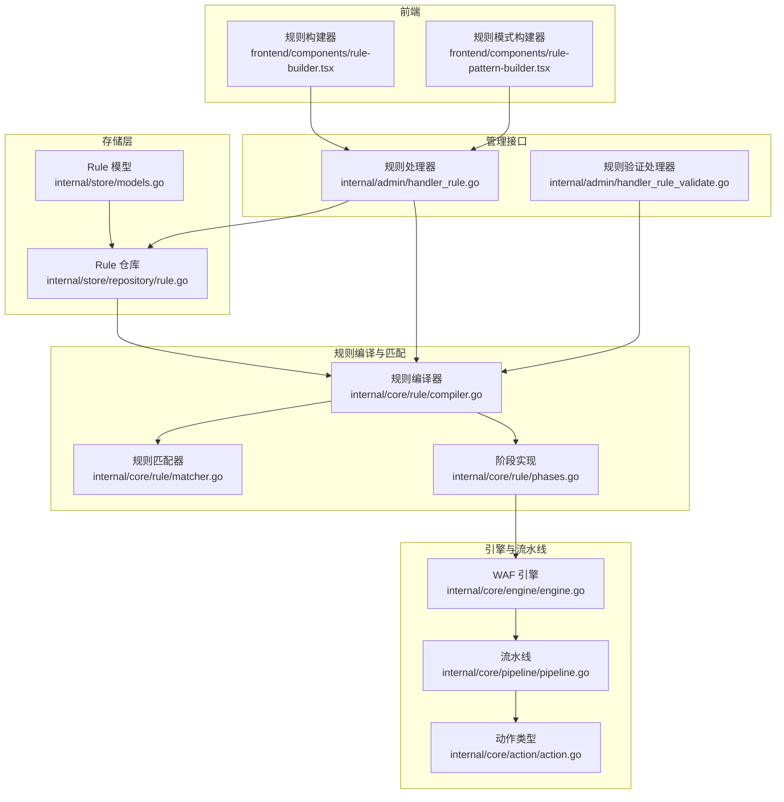
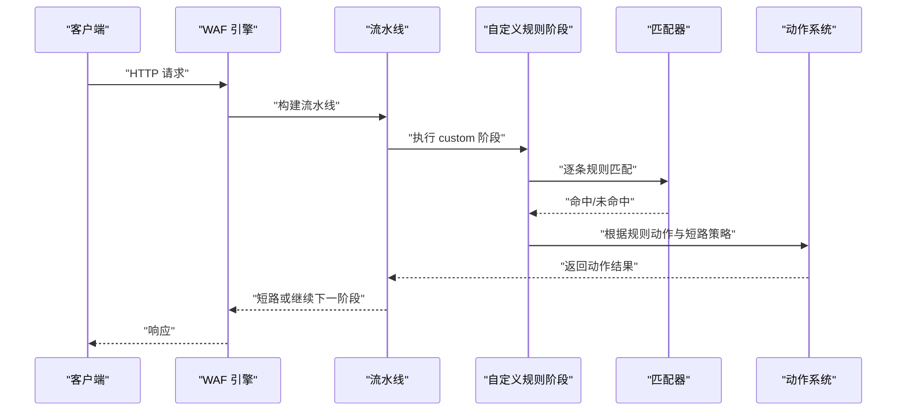
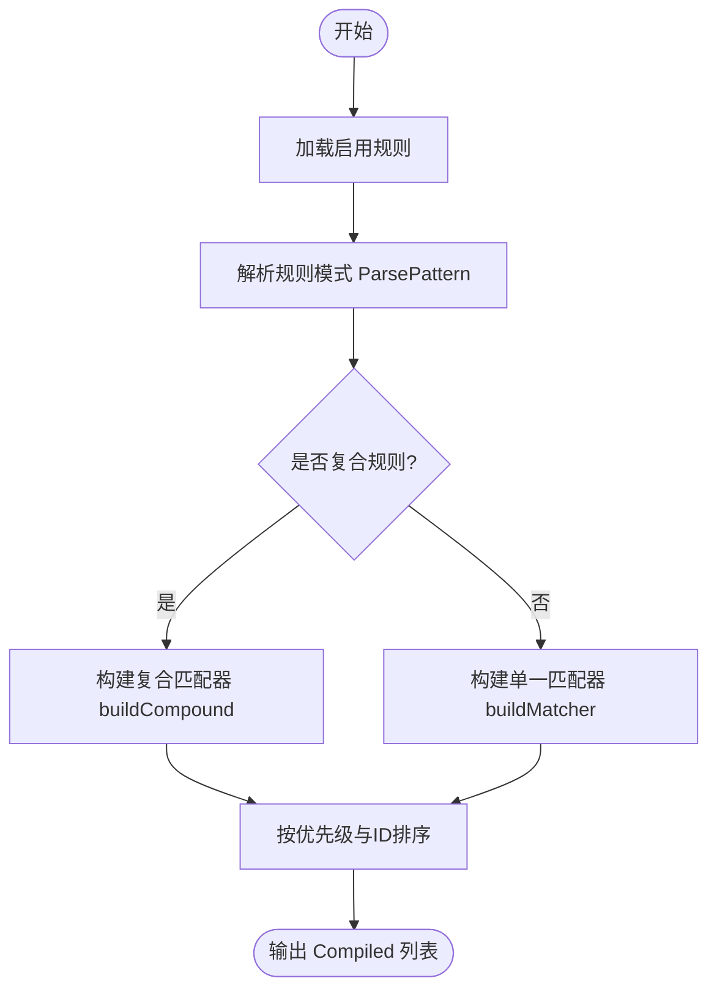
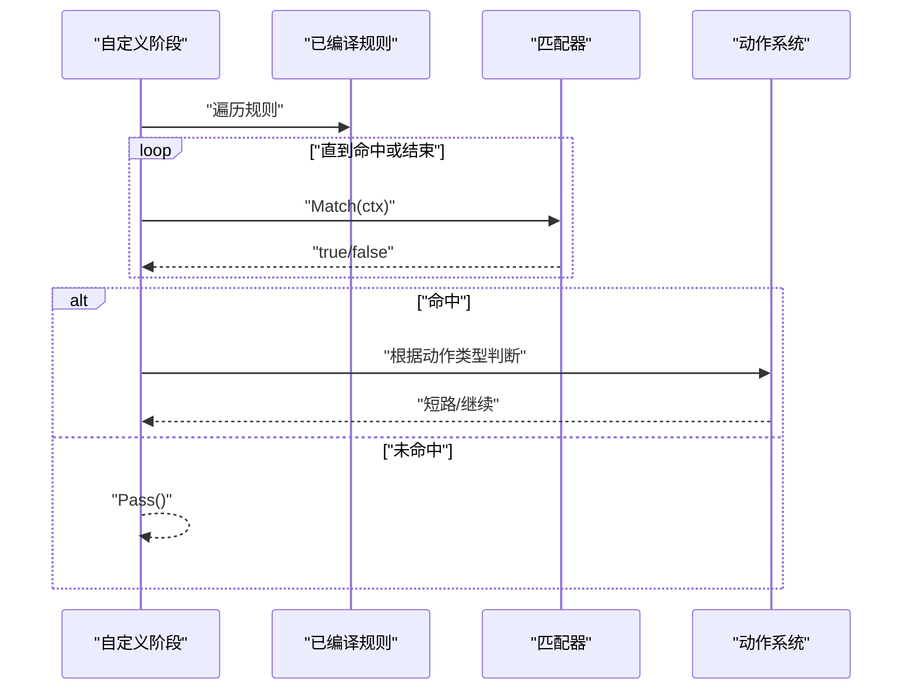
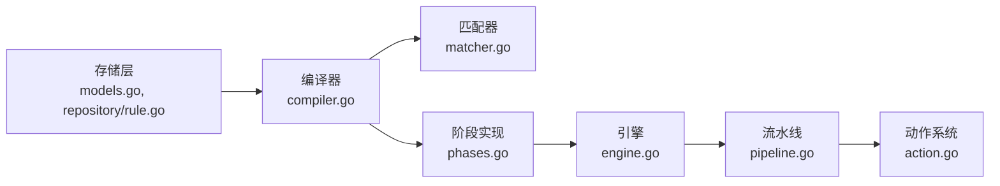

# 自定义规则阶段

<cite>
**本文档引用的文件**
- [compiler.go](file://internal/core/rule/compiler.go)
- [matcher.go](file://internal/core/rule/matcher.go)
- [phases.go](file://internal/core/rule/phases.go)
- [engine.go](file://internal/core/engine/engine.go)
- [pipeline.go](file://internal/core/pipeline/pipeline.go)
- [action.go](file://internal/core/action/action.go)
- [models.go](file://internal/store/models.go)
- [handler_rule.go](file://internal/admin/handler_rule.go)
- [handler_rule_validate.go](file://internal/admin/handler_rule_validate.go)
- [rule.go](file://internal/store/repository/rule.go)
- [rule-builder.tsx](file://frontend/components/rule-builder.tsx)
- [rule-pattern-builder.tsx](file://frontend/components/rule-pattern-builder.tsx)
- [compiler_test.go](file://internal/core/rule/compiler_test.go)
- [matcher_test.go](file://internal/core/rule/matcher_test.go)
</cite>

## 目录
1. [简介](#简介)
2. [项目结构](#项目结构)
3. [核心组件](#核心组件)
4. [架构总览](#架构总览)
5. [详细组件分析](#详细组件分析)
6. [依赖分析](#依赖分析)
7. [性能考虑](#性能考虑)
8. [故障排除指南](#故障排除指南)
9. [结论](#结论)
10. [附录](#附录)

## 简介
本章节介绍自定义规则阶段的设计理念与实现机制，重点涵盖规则编译流程、匹配算法、语法格式与执行逻辑，以及如何在运行时进行动态匹配。自定义规则阶段位于整体 WAF 处理流水线中的“custom”阶段，允许用户通过简洁的 DSL 或 JSON 复合条件定义灵活的匹配规则，并在请求到达时进行高效匹配与决策。

## 项目结构
自定义规则阶段由以下层次组成：
- 规则模型与持久化：存储层定义规则的结构与生命周期管理。
- 编译与匹配：将规则 DSL/JSON 转换为可执行的匹配器集合。
- 执行阶段：在引擎流水线中以“custom”阶段参与请求处理。
- 管理接口：提供规则的增删改查、测试与导入导出能力。
- 前端构建器：提供可视化与高级模式的规则编辑体验。

**图表来源**
- [models.go:79-92](file://internal/store/models.go#L79-L92)
- [rule.go:13-22](file://internal/store/repository/rule.go#L13-L22)
- [compiler.go:28-55](file://internal/core/rule/compiler.go#L28-L55)
- [matcher.go:167-261](file://internal/core/rule/matcher.go#L167-L261)
- [phases.go:77-94](file://internal/core/rule/phases.go#L77-L94)
- [engine.go:83-120](file://internal/core/engine/engine.go#L83-L120)
- [pipeline.go:46-70](file://internal/core/pipeline/pipeline.go#L46-L70)
- [action.go:29-57](file://internal/core/action/action.go#L29-L57)
- [handler_rule.go:46-102](file://internal/admin/handler_rule.go#L46-L102)
- [handler_rule_validate.go:32-98](file://internal/admin/handler_rule_validate.go#L32-L98)
- [rule-builder.tsx:114-150](file://frontend/components/rule-builder.tsx#L114-L150)
- [rule-pattern-builder.tsx:109-125](file://frontend/components/rule-pattern-builder.tsx#L109-L125)

**章节来源**
- [models.go:79-92](file://internal/store/models.go#L79-L92)
- [rule.go:13-22](file://internal/store/repository/rule.go#L13-L22)
- [compiler.go:28-55](file://internal/core/rule/compiler.go#L28-L55)
- [matcher.go:167-261](file://internal/core/rule/matcher.go#L167-L261)
- [phases.go:77-94](file://internal/core/rule/phases.go#L77-L94)
- [engine.go:83-120](file://internal/core/engine/engine.go#L83-L120)
- [pipeline.go:46-70](file://internal/core/pipeline/pipeline.go#L46-L70)
- [action.go:29-57](file://internal/core/action/action.go#L29-L57)
- [handler_rule.go:46-102](file://internal/admin/handler_rule.go#L46-L102)
- [handler_rule_validate.go:32-98](file://internal/admin/handler_rule_validate.go#L32-L98)
- [rule-builder.tsx:114-150](file://frontend/components/rule-builder.tsx#L114-L150)
- [rule-pattern-builder.tsx:109-125](file://frontend/components/rule-pattern-builder.tsx#L109-L125)

## 核心组件
- 规则模型与阶段常量
  - 规则模型包含 ID、名称、策略 ID、阶段、模式（DSL/JSON）、动作、优先级与启用状态等字段。
  - 阶段常量定义了“acl”、“signature”、“custom”等阶段，自定义规则阶段对应“custom”。

- 编译器
  - 将存储层的规则转换为运行时可用的 Compiled 结构体，包含匹配器实例与排序后的优先级。
  - 提供 ParsePattern 解析 DSL 与 JSON 复合规则，支持多种匹配类型。

- 匹配器
  - 定义统一的 Matcher 接口，具体实现覆盖 IP/CIDR、路径前缀/正则/精确、查询参数、请求头、方法、内容类型、Body 等匹配逻辑。
  - 支持复合逻辑（AND/OR/NOT），并通过 JSON 条件构建器生成嵌套匹配器树。

- 阶段实现
  - 在引擎流水线中注册“custom”阶段，按顺序遍历已编译规则，命中即返回动作结果，支持短路与日志收集。

- 动作系统
  - 定义 Allow、Intercept、Observe、Drop 等动作类型，并提供规范化与短路判断逻辑。

**章节来源**
- [models.go:44-65](file://internal/store/models.go#L44-L65)
- [models.go:79-92](file://internal/store/models.go#L79-L92)
- [compiler.go:11-25](file://internal/core/rule/compiler.go#L11-L25)
- [compiler.go:28-55](file://internal/core/rule/compiler.go#L28-L55)
- [compiler.go:58-82](file://internal/core/rule/compiler.go#L58-L82)
- [matcher.go:11-14](file://internal/core/rule/matcher.go#L11-L14)
- [matcher.go:167-261](file://internal/core/rule/matcher.go#L167-L261)
- [matcher.go:298-342](file://internal/core/rule/matcher.go#L298-L342)
- [phases.go:77-94](file://internal/core/rule/phases.go#L77-L94)
- [action.go:6-15](file://internal/core/action/action.go#L6-L15)
- [action.go:29-57](file://internal/core/action/action.go#L29-L57)

## 架构总览
自定义规则阶段在引擎处理流水线中的位置如下：

**图表来源**
- [engine.go:117-120](file://internal/core/engine/engine.go#L117-L120)
- [phases.go:85-94](file://internal/core/rule/phases.go#L85-L94)
- [pipeline.go:46-70](file://internal/core/pipeline/pipeline.go#L46-L70)
- [action.go:40-57](file://internal/core/action/action.go#L40-L57)

## 详细组件分析

### 规则编译与解析
- 编译流程
  - 从存储层读取启用的规则，调用 ParsePattern 提取 kind 与 arg。
  - 使用 buildMatcher 生成具体匹配器实例，最终按优先级与 ID 排序输出 Compiled 列表。
- 解析规则
  - 支持简单规则（kind:arg）与 JSON 复合规则（{"op":"and|or|not","children":[...]}）。
  - 复合规则内部可嵌套子条件，形成 AND/OR/NOT 的逻辑树。

**图表来源**
- [compiler.go:28-55](file://internal/core/rule/compiler.go#L28-L55)
- [compiler.go:58-82](file://internal/core/rule/compiler.go#L58-L82)
- [matcher.go:317-342](file://internal/core/rule/matcher.go#L317-L342)
- [matcher.go:167-261](file://internal/core/rule/matcher.go#L167-L261)

**章节来源**
- [compiler.go:28-55](file://internal/core/rule/compiler.go#L28-L55)
- [compiler.go:58-82](file://internal/core/rule/compiler.go#L58-L82)
- [matcher.go:317-342](file://internal/core/rule/matcher.go#L317-L342)
- [matcher.go:167-261](file://internal/core/rule/matcher.go#L167-L261)

### 匹配算法与数据结构
- 匹配器接口
  - 统一的 Match 方法接收客户端 IP、方法、路径、查询字符串与请求头映射。
- 具体匹配器
  - IP/CIDR：支持单个 IP 或网段，自动推断 IPv4/IPv6 子网掩码。
  - 路径匹配：前缀匹配、正则匹配、精确匹配。
  - 查询参数：包含匹配、正则匹配、键存在性检查。
  - 请求头：包含匹配、正则匹配（大小写不敏感）。
  - 方法与内容类型：大小写不敏感比较。
  - Body 匹配：占位符，实际扫描在请求上下文中完成。
- 复合匹配器
  - AND：所有子条件必须满足。
  - OR：任意子条件满足即可。
  - NOT：对子条件取反。
- 正则缓存
  - 使用全局互斥锁保护的缓存表，避免重复编译相同正则表达式。

```mermaid
classDiagram
class Matcher {
<<interface>>
+Match(ip, method, path, query, headers) bool
}
class ipCIDRMatcher {
+Match(...)
}
class pathPrefixMatcher {
+Match(...)
}
class pathRegexMatcher {
+Match(...)
}
class exactPathMatcher {
+Match(...)
}
class queryContainsMatcher {
+Match(...)
}
class queryRegexMatcher {
+Match(...)
}
class headerContainsMatcher {
+Match(...)
}
class headerRegexMatcher {
+Match(...)
}
class methodMatcher {
+Match(...)
}
class contentTypeMatcher {
+Match(...)
}
class bodyContainsMatcher {
+Match(...)
}
class queryParamMatcher {
+Match(...)
}
class andMatcher {
+Match(...)
}
class orMatcher {
+Match(...)
}
class notMatcher {
+Match(...)
}
Matcher <|.. ipCIDRMatcher
Matcher <|.. pathPrefixMatcher
Matcher <|.. pathRegexMatcher
Matcher <|.. exactPathMatcher
Matcher <|.. queryContainsMatcher
Matcher <|.. queryRegexMatcher
Matcher <|.. headerContainsMatcher
Matcher <|.. headerRegexMatcher
Matcher <|.. methodMatcher
Matcher <|.. contentTypeMatcher
Matcher <|.. bodyContainsMatcher
Matcher <|.. queryParamMatcher
Matcher <|.. andMatcher
Matcher <|.. orMatcher
Matcher <|.. notMatcher
```

**图表来源**
- [matcher.go:11-14](file://internal/core/rule/matcher.go#L11-L14)
- [matcher.go:48-141](file://internal/core/rule/matcher.go#L48-L141)
- [matcher.go:18-44](file://internal/core/rule/matcher.go#L18-L44)
- [matcher.go:167-261](file://internal/core/rule/matcher.go#L167-L261)

**章节来源**
- [matcher.go:11-14](file://internal/core/rule/matcher.go#L11-L14)
- [matcher.go:48-141](file://internal/core/rule/matcher.go#L48-L141)
- [matcher.go:18-44](file://internal/core/rule/matcher.go#L18-L44)
- [matcher.go:167-261](file://internal/core/rule/matcher.go#L167-L261)

### 执行阶段与短路策略
- 自定义规则阶段
  - 仅处理 Phase 为“custom”的规则，按顺序遍历 Compiled 列表。
  - 命中后根据动作类型决定是否短路（Intercept/Drop）或继续收集观察日志（Observe）。
- 短路与日志
  - Drop 为最高优先级，直接短路并关闭连接。
  - Intercept 与 Terminal 动作也会短路，阻止后续阶段执行。
  - Observe 动作不短路，但会记录用于审计日志。

**图表来源**
- [phases.go:85-94](file://internal/core/rule/phases.go#L85-L94)
- [action.go:40-57](file://internal/core/action/action.go#L40-L57)

**章节来源**
- [phases.go:85-94](file://internal/core/rule/phases.go#L85-L94)
- [action.go:40-57](file://internal/core/action/action.go#L40-L57)

### 规则语法与执行逻辑
- 语法格式
  - 简单规则：kind:arg，如“block_ip:192.168.1.0/24”、“block_path:/admin”、“block_header:User-Agent:BadBot”。
  - 复合规则：JSON 对象，包含 op（and/or/not）与 children 数组，每个子项为 {kind,arg}。
- 执行逻辑
  - 编译阶段将规则转换为匹配器树；运行阶段按顺序匹配，命中即短路或记录日志。
  - 优先级与 ID 决定规则评估顺序，确保高优先级规则先于低优先级规则执行。

**章节来源**
- [compiler.go:58-82](file://internal/core/rule/compiler.go#L58-L82)
- [matcher.go:298-342](file://internal/core/rule/matcher.go#L298-L342)

### 管理接口与前端工具
- 管理接口
  - 列表、获取、创建、更新、删除规则。
  - 规则测试接口：接受 pattern、客户端 IP、路径、查询、请求头等，返回匹配结果与 kind/arg。
  - 规则验证接口：校验 DSL/JSON 合法性，返回结构化错误信息。
  - 导入导出：批量导入/导出规则。
- 前端构建器
  - 可视化构建器：支持简单与复合两种模式，实时预览 DSL。
  - 规则模板：内置常见规则模板，便于快速创建。
  - 测试工具：支持模拟请求参数，辅助验证规则效果。

**章节来源**
- [handler_rule.go:16-102](file://internal/admin/handler_rule.go#L16-L102)
- [handler_rule.go:115-156](file://internal/admin/handler_rule.go#L115-L156)
- [handler_rule_validate.go:32-98](file://internal/admin/handler_rule_validate.go#L32-L98)
- [rule-builder.tsx:114-150](file://frontend/components/rule-builder.tsx#L114-L150)
- [rule-builder.tsx:208-293](file://frontend/components/rule-builder.tsx#L208-L293)
- [rule-pattern-builder.tsx:109-125](file://frontend/components/rule-pattern-builder.tsx#L109-L125)

## 依赖分析
- 存储层依赖
  - Rule 模型与仓库负责规则的持久化与查询，编译器依赖其提供的规则列表。
- 编译器依赖
  - 依赖 action 类型进行动作规范化，依赖 store 模型进行规则结构化。
- 匹配器依赖
  - 依赖正则包进行模式编译，依赖缓存表减少重复编译开销。
- 引擎与流水线
  - 引擎将规则编译后注入流水线，自定义阶段在签名阶段之后执行。
- 动作系统
  - 提供短路与日志判定，影响流水线的终止条件。

**图表来源**
- [models.go:79-92](file://internal/store/models.go#L79-L92)
- [rule.go:13-22](file://internal/store/repository/rule.go#L13-L22)
- [compiler.go:28-55](file://internal/core/rule/compiler.go#L28-L55)
- [matcher.go:167-261](file://internal/core/rule/matcher.go#L167-L261)
- [phases.go:85-94](file://internal/core/rule/phases.go#L85-L94)
- [engine.go:117-120](file://internal/core/engine/engine.go#L117-L120)
- [pipeline.go:46-70](file://internal/core/pipeline/pipeline.go#L46-L70)
- [action.go:29-57](file://internal/core/action/action.go#L29-L57)

**章节来源**
- [models.go:79-92](file://internal/store/models.go#L79-L92)
- [rule.go:13-22](file://internal/store/repository/rule.go#L13-L22)
- [compiler.go:28-55](file://internal/core/rule/compiler.go#L28-L55)
- [matcher.go:167-261](file://internal/core/rule/matcher.go#L167-L261)
- [phases.go:85-94](file://internal/core/rule/phases.go#L85-L94)
- [engine.go:117-120](file://internal/core/engine/engine.go#L117-L120)
- [pipeline.go:46-70](file://internal/core/pipeline/pipeline.go#L46-L70)
- [action.go:29-57](file://internal/core/action/action.go#L29-L57)

## 性能考虑
- 正则缓存
  - 通过全局互斥锁保护的缓存表复用已编译的正则表达式，避免重复编译带来的 CPU 开销。
- 匹配器短路
  - 自定义阶段命中即短路，减少后续规则的匹配成本。
- 优先级排序
  - 编译阶段按优先级与 ID 排序，确保高优先级规则优先评估，降低误判概率与不必要的匹配次数。
- 复合规则优化
  - AND/OR/NOT 的短路语义在匹配器内部实现，避免对无关子条件的进一步计算。
- 运行时扫描限制
  - Body 匹配在请求上下文处理，避免在匹配器中进行昂贵的全文扫描。

**章节来源**
- [matcher.go:273-296](file://internal/core/rule/matcher.go#L273-L296)
- [phases.go:85-94](file://internal/core/rule/phases.go#L85-L94)
- [compiler.go:48-54](file://internal/core/rule/compiler.go#L48-L54)
- [matcher.go:134-141](file://internal/core/rule/matcher.go#L134-L141)

## 故障排除指南
- 规则无法匹配
  - 检查规则是否启用、阶段是否为“custom”、优先级设置是否合理。
  - 使用规则测试接口传入相同的请求上下文，确认 kind/arg 是否正确解析。
- 正则规则异常
  - 复核正则表达式语法，确认已被缓存编译成功；无效正则会被视为“永不匹配”。
- 复合规则结构错误
  - 确认 JSON 结构包含 op 与 children 字段，op 值为 and/or/not。
- 动作未生效
  - 检查动作类型是否被规范化（block/log_only 等别名），确认是否被更高优先级的动作短路。
- 前端构建器问题
  - 切换到高级模式手动输入 DSL，使用验证接口检查语法；若为复合规则，需后端支持测试。

**章节来源**
- [handler_rule.go:115-156](file://internal/admin/handler_rule.go#L115-L156)
- [handler_rule_validate.go:32-98](file://internal/admin/handler_rule_validate.go#L32-L98)
- [matcher.go:189-195](file://internal/core/rule/matcher.go#L189-L195)
- [matcher.go:213-216](file://internal/core/rule/matcher.go#L213-L216)
- [action.go:17-27](file://internal/core/action/action.go#L17-L27)

## 结论
自定义规则阶段通过简洁的 DSL 与强大的复合逻辑，实现了灵活而高效的请求过滤能力。编译期将规则转换为高性能的匹配器树，运行期在流水线中以短路策略快速决策。配合管理接口与前端构建器，用户可以便捷地编写、验证与部署规则，并在复杂场景下获得良好的性能与可观测性。

## 附录

### 规则编写指南
- 选择合适的匹配类型
  - IP/CIDR：用于源地址控制。
  - 路径匹配：前缀、正则或精确匹配，覆盖不同粒度的路径控制需求。
  - 查询参数：包含匹配或正则匹配，拦截特定查询模式。
  - 请求头：包含匹配或正则匹配，识别特定客户端或扫描器。
  - 方法与内容类型：限制特定 HTTP 方法或上传类型。
- 复合规则设计
  - 使用 AND 组合多条件，OR 实现宽松策略，NOT 实现白名单/黑名单反转。
  - 控制子条件数量与复杂度，避免过长的正则表达式导致性能下降。
- 优先级与短路
  - 将高优先级规则置于前，利用短路特性减少后续匹配成本。
- 动作选择
  - Drop：最高优先级，立即断开连接。
  - Intercept：阻断请求并返回响应。
  - Observe：仅记录日志，不中断请求。

**章节来源**
- [models.go:44-65](file://internal/store/models.go#L44-L65)
- [matcher.go:167-261](file://internal/core/rule/matcher.go#L167-L261)
- [phases.go:85-94](file://internal/core/rule/phases.go#L85-L94)
- [action.go:40-57](file://internal/core/action/action.go#L40-L57)

### 调试方法
- 使用规则测试接口
  - 准备与生产环境一致的请求上下文，验证规则是否按预期匹配。
- 前端构建器验证
  - 在高级模式下输入原始 DSL，使用验证接口检查语法与结构。
- 日志与审计
  - 对 Observe 动作收集的命中事件进行审计，定位规则配置问题。
- 单元测试参考
  - 参考测试用例了解各匹配器的行为边界与正则缓存行为。

**章节来源**
- [handler_rule.go:115-156](file://internal/admin/handler_rule.go#L115-L156)
- [rule-builder.tsx:208-293](file://frontend/components/rule-builder.tsx#L208-L293)
- [compiler_test.go:11-87](file://internal/core/rule/compiler_test.go#L11-L87)
- [matcher_test.go:30-221](file://internal/core/rule/matcher_test.go#L30-L221)