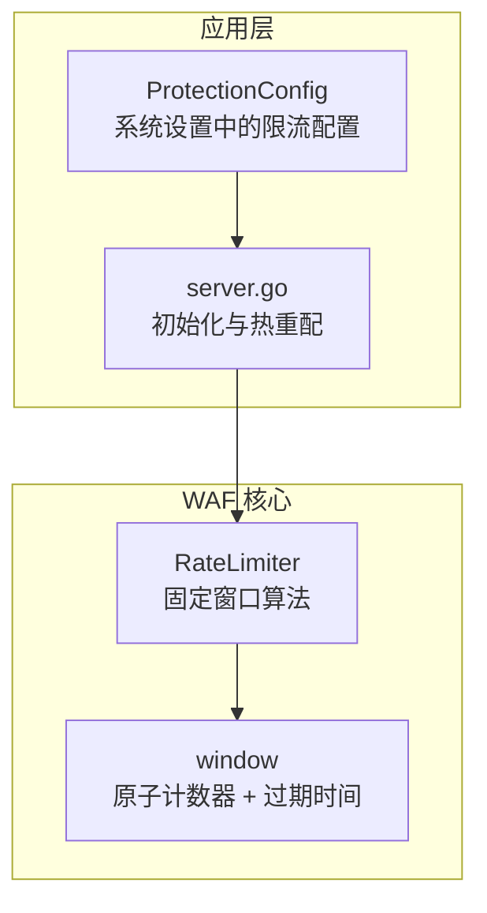
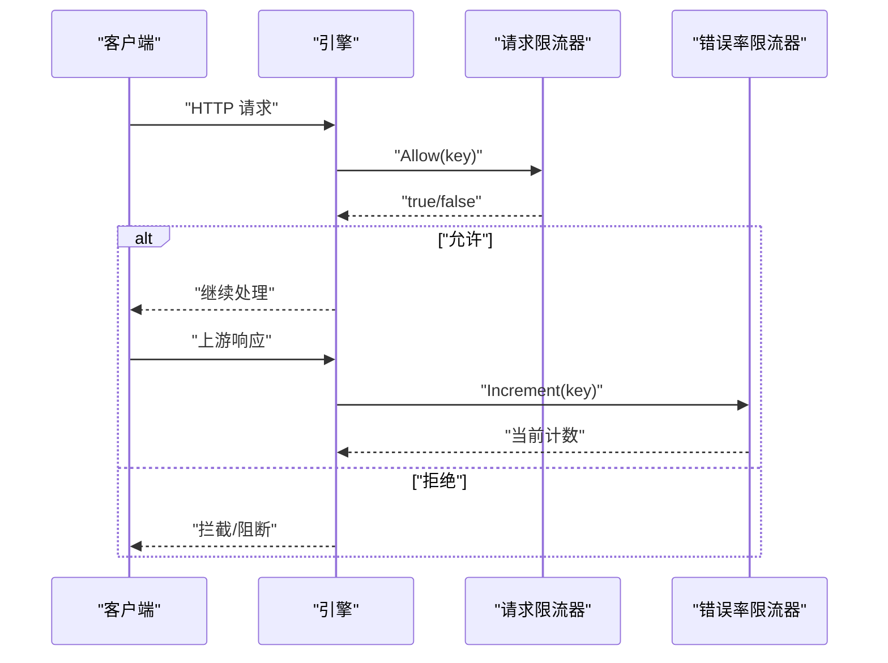
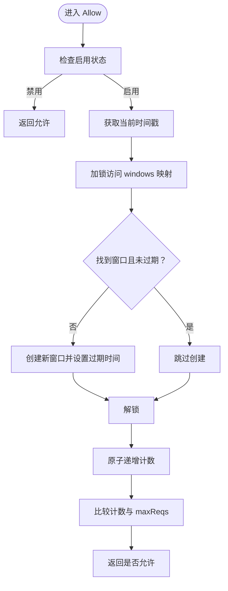
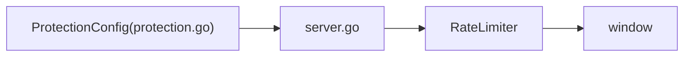
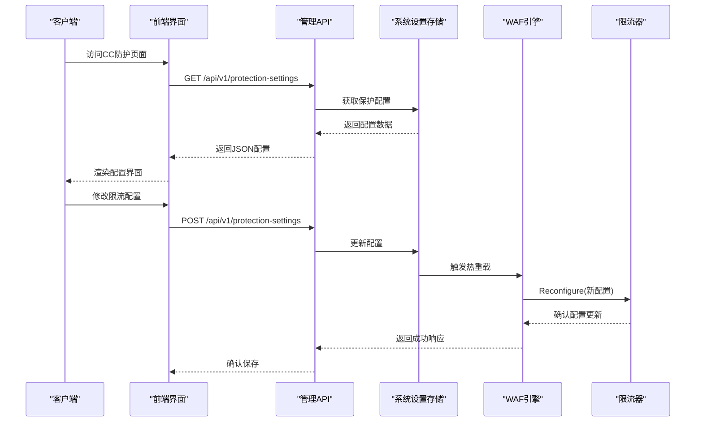
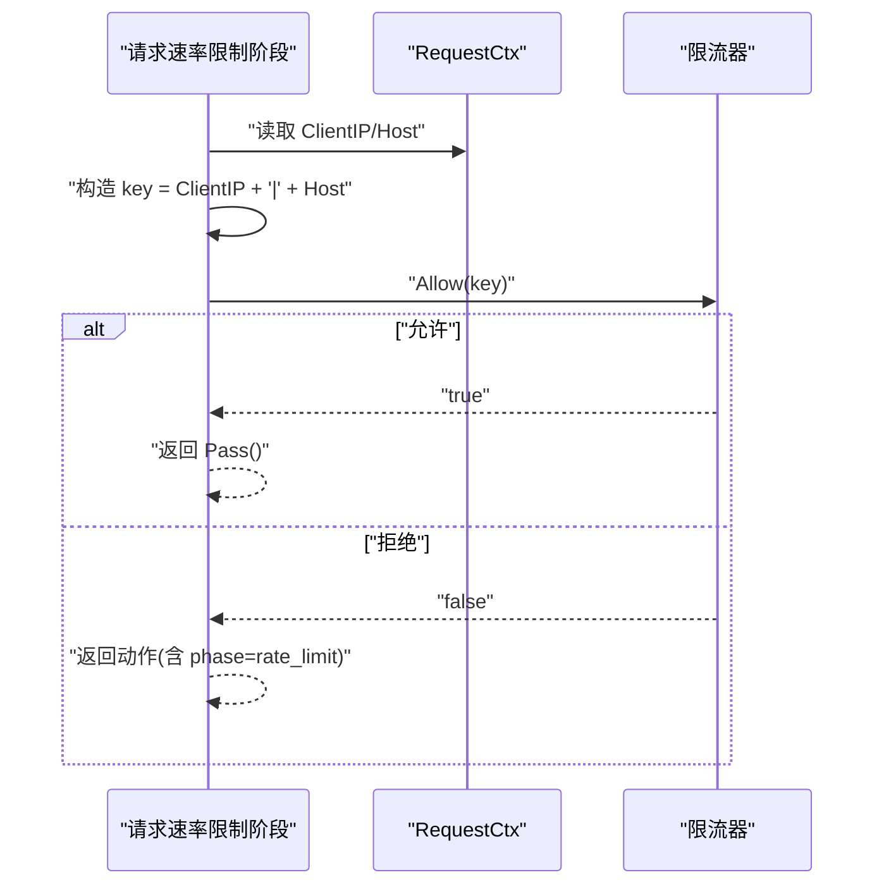
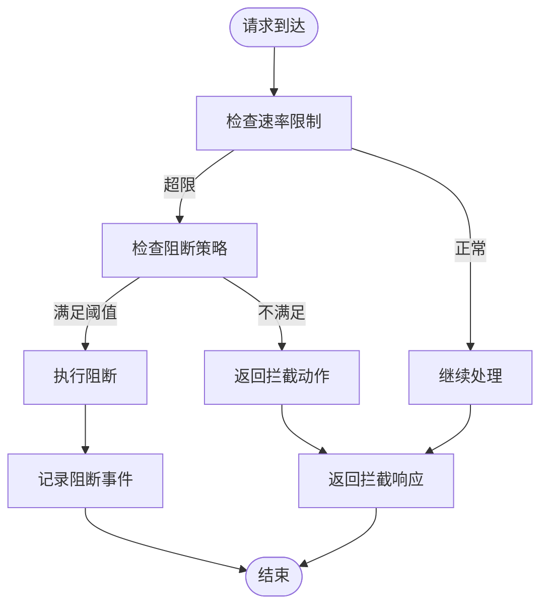

# 请求速率限制阶段

> [返回 WAF 引擎系统](../WAF 引擎系统.md)

<cite>
**本文引用的文件**
- [ratelimit.go](file://internal/waf/ratelimit/ratelimit.go)
- [redis.go](file://internal/waf/ratelimit/redis.go)
- [ratelimit_test.go](file://internal/waf/ratelimit/ratelimit_test.go)
- [server.go](file://internal/app/server.go)
- [protection.go](file://internal/store/protection.go)
- [protection_handler.go](file://internal/admin/protect/protection.go)
- [phases.go](file://internal/core/rules/phases.go)
- [engine.go](file://internal/core/engine/engine.go)
- [metrics.go](file://internal/dataplane/metrics.go)
- [drop.go](file://internal/waf/drop/drop.go)
- [handler_drop.go](file://internal/admin/handler_drop.go)
- [drop_event.go](file://internal/store/repository/drop_event.go)
- [page.tsx](file://frontend/app/(dashboard)/cc-protection/page.tsx)
- [drop_page.tsx](file://frontend/app/(dashboard)/drop-policy/page.tsx)
- [router.go](file://internal/admin/router.go)
</cite>

## 目录
1. [简介](#简介)
2. [项目结构](#项目结构)
3. [核心组件](#核心组件)
4. [架构总览](#架构总览)
5. [详细组件分析](#详细组件分析)
6. [依赖分析](#依赖分析)
7. [性能考虑](#性能考虑)
8. [故障排查指南](#故障排查指南)
9. [结论](#结论)
10. [附录](#附录)

## 简介
本文件系统性地解析 My-OpenWaf 中的请求速率限制阶段，重点围绕固定窗口算法的实现原理与并发安全机制展开，涵盖：
- 固定窗口结构设计与原子计数器使用
- RateLimiter 结构体的互斥锁保护、内存窗口映射与过期清理
- Allow 方法的决策流程：键值生成、窗口创建与请求计数判断
- Increment 方法用于错误率统计的特殊用途
- 配置参数说明：窗口大小、最大请求数、启用状态
- 性能优化建议与内存使用注意事项

## 项目结构
本地速率限制位于 internal/waf/ratelimit/ratelimit.go，配套测试位于 internal/waf/ratelimit/ratelimit_test.go；在内部应用启动时，从系统设置中读取保护配置并初始化两个限流器（请求限流与错误率限流），并在运行时支持热重配。

**图表来源**
- [ratelimit.go:9-22](file://internal/waf/ratelimit/ratelimit.go#L9-L22)
- [server.go:93-102](file://internal/app/server.go#L93-L102)
- [protection.go:75-103](file://internal/store/protection.go#L75-L103)

**章节来源**
- [ratelimit.go:1-127](file://internal/waf/ratelimit/ratelimit.go#L1-L127)
- [server.go:93-102](file://internal/app/server.go#L93-L102)
- [protection.go:75-103](file://internal/store/protection.go#L75-L103)

## 核心组件
- RateLimiter：固定窗口限流器，按"客户端IP + Host"组合键进行限流。
- window：单个键对应的窗口对象，包含原子计数器与过期时间戳。
- cleaner 协程：周期性清理过期窗口，避免内存无限增长。
- Allow/Increment：对外暴露的两个主要方法，分别用于请求通过判定与错误率统计。

**章节来源**
- [ratelimit.go:9-22](file://internal/waf/ratelimit/ratelimit.go#L9-L22)
- [ratelimit.go:48-92](file://internal/waf/ratelimit/ratelimit.go#L48-L92)

## 架构总览
本地限流器在应用启动时被创建，并在每次请求到来时进行允许判断；同时提供错误率统计能力（在上游响应后调用）。配置来源于系统设置中的 ProtectionConfig，支持运行时热重配。

**图表来源**
- [server.go:99-102](file://internal/app/server.go#L99-L102)
- [ratelimit.go:48-78](file://internal/waf/ratelimit/ratelimit.go#L48-L78)

## 详细组件分析

### RateLimiter 结构体与并发安全
- 字段说明
  - mu：互斥锁，保护 windows 映射与关键路径的读写。
  - windows：键到 window 的内存映射，键为"客户端IP + Host"组合。
  - windowS：窗口长度（秒）。
  - maxReqs：窗口内最大请求数。
  - enabled：启用标志，使用原子布尔类型。
  - stopCh：停止信号通道，用于关闭 cleaner 协程。
- 并发安全
  - 所有对 windows 的访问均受 mu 保护。
  - 计数器使用 atomic.Int64，Allow/Increment 内部仅加锁一次以减少锁竞争。
  - cleaner 协程周期性扫描并删除过期窗口，避免内存泄漏。

**章节来源**
- [ratelimit.go:10-17](file://internal/waf/ratelimit/ratelimit.go#L10-L17)
- [ratelimit.go:19-22](file://internal/waf/ratelimit/ratelimit.go#L19-L22)
- [ratelimit.go:98-116](file://internal/waf/ratelimit/ratelimit.go#L98-L116)

### window 结构与固定窗口算法
- 字段说明
  - count：原子计数器，记录当前窗口内的请求数或错误数。
  - expiry：窗口过期时间戳（秒）。
- 窗口生命周期
  - 若键不存在或过期，则创建新窗口并设置过期时间为 now + windowS。
  - 每次请求通过时，先加锁检查/创建窗口，再原子递增计数，最后比较是否超过 maxReqs。

**章节来源**
- [ratelimit.go:19-22](file://internal/waf/ratelimit/ratelimit.go#L19-L22)
- [ratelimit.go:54-61](file://internal/waf/ratelimit/ratelimit.go#L54-L61)

### Allow 方法决策逻辑
- 流程
  1) 若禁用，直接返回允许。
  2) 获取当前时间戳（秒）。
  3) 加锁查找键对应的窗口；若不存在或已过期则新建窗口并设置过期时间。
  4) 解锁后原子递增计数，返回计数是否不超过 maxReqs。
- 键值生成
  - 在应用层由引擎负责构造"客户端IP + Host"的键传入。
- 适用场景
  - 主要用于请求量限流，遵循固定窗口策略。

**图表来源**
- [ratelimit.go:48-61](file://internal/waf/ratelimit/ratelimit.go#L48-L61)

**章节来源**
- [ratelimit.go:48-61](file://internal/waf/ratelimit/ratelimit.go#L48-L61)

### Increment 方法用于错误率统计
- 用途
  - 在上游响应之后调用，将错误事件计入同一窗口，用于错误率限流。
- 行为
  - 与 Allow 类似，但不返回允许与否，而是返回当前计数，便于上层统计。
- 适用场景
  - 与 Allow 分离，可独立统计 4xx/5xx 或特定动作（如拦截）的错误率。

**章节来源**
- [ratelimit.go:64-78](file://internal/waf/ratelimit/ratelimit.go#L64-L78)

### IsOverLimit 方法
- 作用
  - 查询当前键是否已超过阈值，不改变计数。
- 使用场景
  - 用于监控或日志记录，判断是否已触发限流。

**章节来源**
- [ratelimit.go:80-92](file://internal/waf/ratelimit/ratelimit.go#L80-L92)

### cleaner 协程与过期清理机制
- 周期
  - 每 30 秒扫描一次。
- 行为
  - 获取当前时间戳，遍历 windows，删除过期项。
  - 通过 stopCh 接收关闭信号优雅退出。
- 效果
  - 控制内存占用，避免长期运行导致的键空间膨胀。

**章节来源**
- [ratelimit.go:98-116](file://internal/waf/ratelimit/ratelimit.go#L98-L116)

### 配置参数与启用状态
- 参数来源
  - ProtectionConfig：系统设置中的限流配置，包含请求限流与错误率限流两套参数。
- 关键字段
  - RequestRateLimitWindow / RequestRateLimitMax / RequestRateLimitEnabled
  - ErrorRateLimitWindow / ErrorRateLimitMax / ErrorRateLimitEnabled
- 初始化与热重配
  - 应用启动时从快照加载 ProtectionConfig 并创建两个 RateLimiter 实例。
  - 支持运行时 Reconfigure 动态调整窗口大小、最大请求数与启用状态。

**章节来源**
- [protection.go:75-103](file://internal/store/protection.go#L75-L103)
- [server.go:99-102](file://internal/app/server.go#L99-L102)
- [server.go:227-233](file://internal/app/server.go#L227-L233)

### 与 Redis 版本对比（概念性说明）
- RedisRateLimiter 实现滑动窗口，基于 Redis ZSET 与 Lua 脚本保证原子性，适合分布式部署。
- 本地 RateLimiter 实现固定窗口，适合单机或轻量级部署，内存占用可控，延迟更低。
- 两者 API 兼容，便于在不同环境间切换。

**章节来源**
- [redis.go:12-88](file://internal/waf/ratelimit/redis.go#L12-L88)

## 依赖分析
- 组件耦合
  - RateLimiter 与应用层通过 server.go 交互，应用层负责构造键与调用 Allow/Increment。
  - 配置来自系统设置（ProtectionConfig），通过快照注入。
- 外部依赖
  - 标准库：sync、sync/atomic、time。
  - Redis 版本依赖 go-redis 客户端（非本地实现）。

**图表来源**
- [server.go:99-102](file://internal/app/server.go#L99-L102)
- [protection.go:247-294](file://internal/store/protection.go#L247-L294)
- [ratelimit.go:9-22](file://internal/waf/ratelimit/ratelimit.go#L9-L22)

**章节来源**
- [server.go:99-102](file://internal/app/server.go#L99-L102)
- [protection.go:247-294](file://internal/store/protection.go#L247-L294)
- [ratelimit.go:9-22](file://internal/waf/ratelimit/ratelimit.go#L9-L22)

## 性能考虑
- 原子计数器
  - 使用 atomic.Int64 对计数进行无锁递增，降低锁竞争开销。
- 最小化锁持有时间
  - 仅在创建/更新窗口时加锁，随后立即解锁，再进行原子操作，缩短临界区。
- 清理策略
  - 30 秒周期清理过期窗口，平衡内存与 CPU 开销。
- 键空间管理
  - 通过过期清理避免键数量无限增长；建议合理设置窗口大小与最大请求数，避免内存压力。
- 可扩展性
  - 如需分布式部署，可切换至 Redis 版本以共享状态。

## 故障排查指南
- 常见问题
  - 限流未生效：确认 enabled 为 true，且键构造正确（客户端IP + Host）。
  - 瞬时峰值误判：固定窗口在边界处存在"桶破裂"现象，建议增大窗口或结合其他策略。
  - 内存持续增长：检查 cleaner 是否正常运行，确认 stopCh 未提前关闭。
- 调试建议
  - 使用 IsOverLimit 检查当前状态。
  - 在上游响应后调用 Increment 观察错误率变化。
  - 通过 Reconfigure 快速调整参数验证效果。

**章节来源**
- [ratelimit.go:36-46](file://internal/waf/ratelimit/ratelimit.go#L36-L46)
- [ratelimit.go:80-92](file://internal/waf/ratelimit/ratelimit.go#L80-L92)
- [ratelimit_test.go:7-19](file://internal/waf/ratelimit/ratelimit_test.go#L7-L19)
- [ratelimit_test.go:21-31](file://internal/waf/ratelimit/ratelimit_test.go#L21-L31)
- [ratelimit_test.go:33-43](file://internal/waf/ratelimit/ratelimit_test.go#L33-L43)

## 结论
本地速率限制采用固定窗口算法，通过原子计数器与互斥锁保护实现高并发下的稳定限流。其设计简洁、内存占用可控，适用于单机或轻量级部署。配合应用层的热重配能力，可在不重启服务的情况下动态调整限流策略。对于需要跨节点共享状态的场景，可参考 Redis 版本实现滑动窗口以满足分布式需求。

## 附录

### 配置管理与热重载
- 前端配置界面
  - 提供直观的 CC 防护页面，支持请求/错误/攻击频率限制的可视化配置。
- 后端处理流程
  - 通过专门的处理器处理配置更新，支持格式验证、关系校验与 Redis 连接测试。
- 引擎集成
  - WAF 引擎在处理请求时集成限流功能，支持运行时 Reconfigure。
- 配置验证机制
  - 多层次验证：格式验证、数值范围验证、配置关系验证、Redis 连接验证。

**图表来源**
- [page.tsx](file://frontend/app/(dashboard)/cc-protection/page.tsx#L96-L132)
- [protection_handler.go:60-106](file://internal/admin/protect/protection.go#L60-L106)
- [server.go:220-242](file://internal/app/server.go#L220-L242)

**章节来源**
- [page.tsx](file://frontend/app/(dashboard)/cc-protection/page.tsx#L1-L557)
- [protection_handler.go:1-107](file://internal/admin/protect/protection.go#L1-L107)
- [engine.go:1-176](file://internal/core/engine/engine.go#L1-L176)

### 速率限制阶段与引擎集成
- 阶段名称：rate_limit
- 执行逻辑：构造键（客户端 IP + '|' + Host），调用限流器 Allow，若超限则返回对应动作
- 动作类型：由保护配置决定（如拦截）

**图表来源**
- [phases.go:109-127](file://internal/core/rules/phases.go#L109-L127)

**章节来源**
- [phases.go:103-128](file://internal/core/rules/phases.go#L103-L128)
- [engine.go:103-106](file://internal/core/engine/engine.go#L103-L106)

### 阻断策略集成
- 自动阻断阈值配置：支持基于 Bot 评分、CVE 自动阻断等策略
- 阻断执行器：立即连接终止，记录统计信息
- 统计监控：提供实时统计与 24 小时历史查询

**图表来源**
- [drop.go:59-83](file://internal/waf/drop/drop.go#L59-L83)
- [handler_drop.go:57-98](file://internal/admin/handler_drop.go#L57-L98)

**章节来源**
- [drop.go:10-17](file://internal/waf/drop/drop.go#L10-L17)
- [drop.go:19-47](file://internal/waf/drop/drop.go#L19-L47)
- [drop.go:59-83](file://internal/waf/drop/drop.go#L59-L83)
- [drop.go:85-100](file://internal/waf/drop/drop.go#L85-L100)
- [drop.go:102-123](file://internal/waf/drop/drop.go#L102-L123)

### 性能测试与基准建议
- 测试场景建议
  - 单节点 QPS 压测：从 1000 QPS 逐步提升至 10000 QPS
  - 并发客户端压测：100-1000 个并发连接
  - 窗口边界测试：在窗口切换时刻的请求处理能力
  - 内存泄漏检测：运行 24 小时观察内存增长
- 监控指标
  - 请求成功率与错误率
  - 平均响应时间与 P95/P99 延迟
  - 内存使用量与 goroutine 数
  - 清理协程的执行频率

### 最佳实践配置示例
- 基础防护配置
  - 请求限流：窗口 60 秒，最大 100 请求，动作拦截
  - 错误限流：窗口 300 秒，最大 10 错误，动作拦截
- 高级防护配置
  - 请求限流：窗口 60 秒，最大 300 请求，动作验证码
  - 错误限流：窗口 60 秒，最大 5 错误，动作阻断
  - 自动封禁：阈值 10，窗口 60 秒，持续 3600 秒