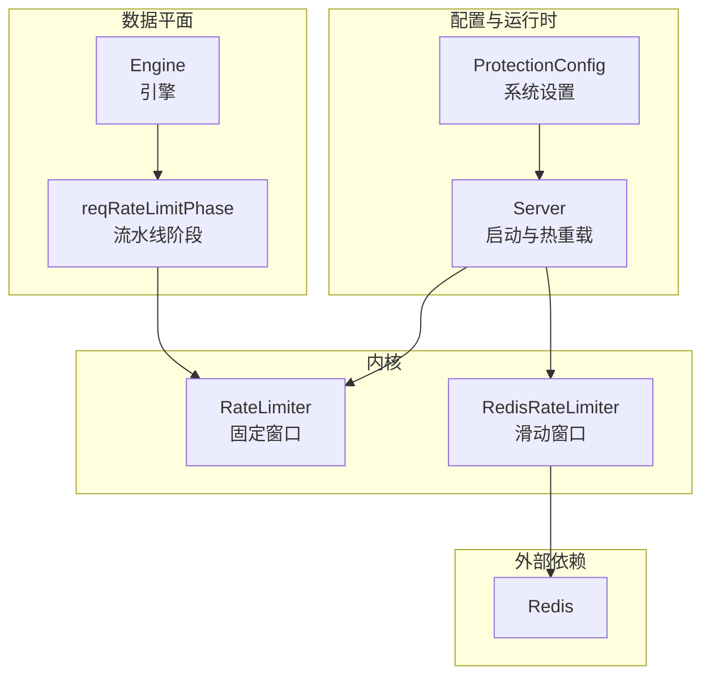
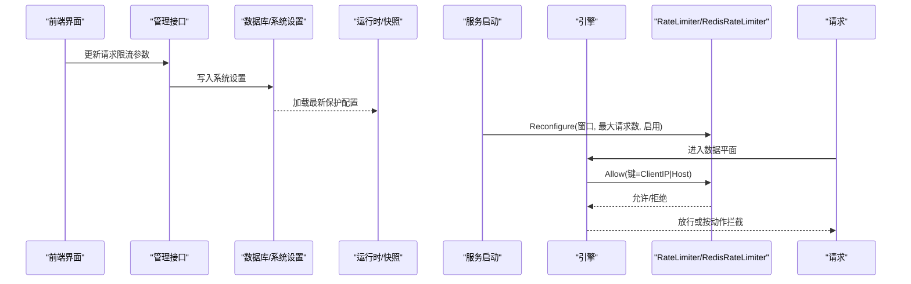
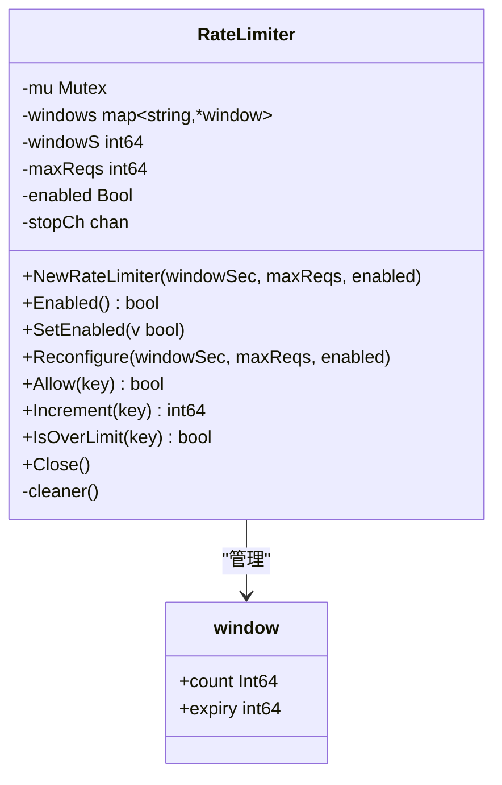
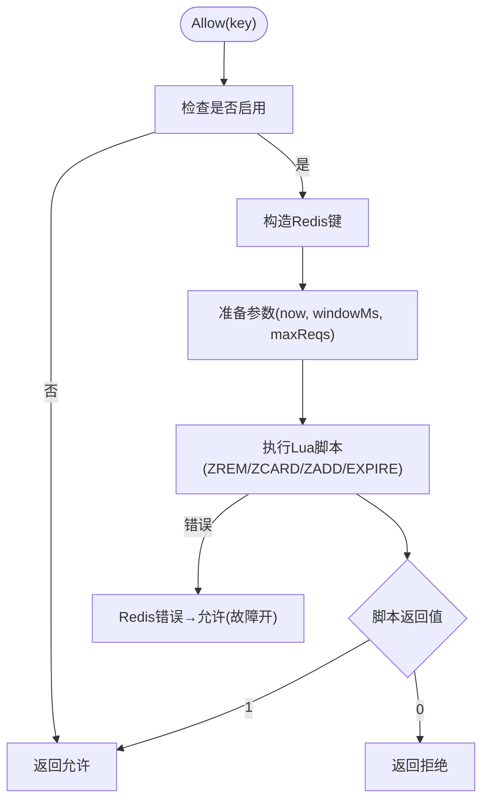
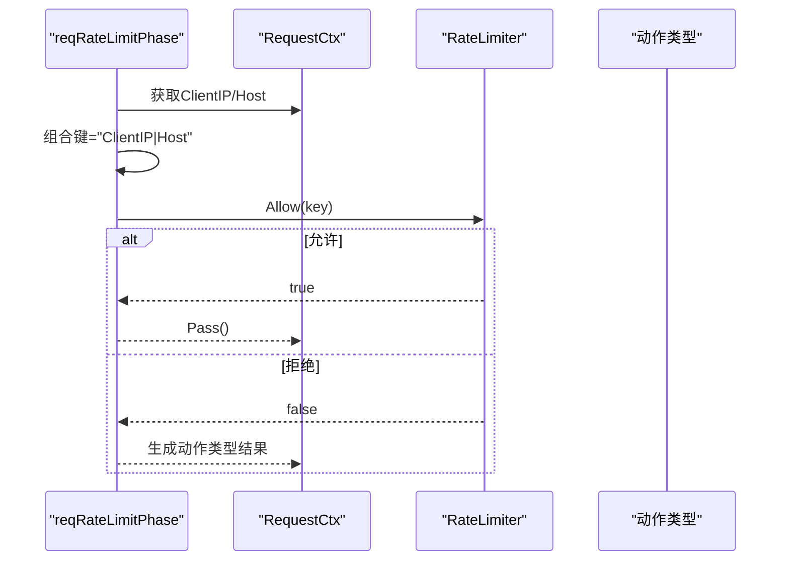
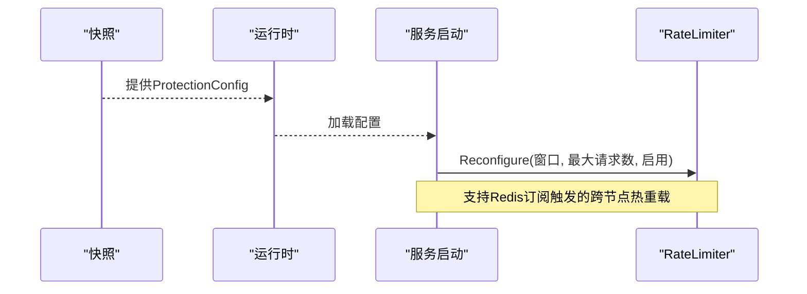
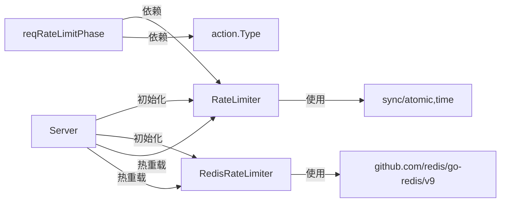

# 请求速率限制阶段

<cite>
**本文引用的文件**
- [ratelimit.go](file://internal/waf/ratelimit.go)
- [ratelimit_redis.go](file://internal/waf/ratelimit_redis.go)
- [ratelimit_test.go](file://internal/waf/ratelimit_test.go)
- [phases.go](file://internal/core/rules/phases.go)
- [models.go](file://internal/store/models.go)
- [server.go](file://internal/app/server.go)
- [redis.go](file://internal/core/redis/redis.go)
- [redis_kv.go](file://internal/cache/redis_kv.go)
- [page.tsx](file://frontend/app/(dashboard)/cc-protection/page.tsx)
</cite>

## 目录
1. [简介](#简介)
2. [项目结构](#项目结构)
3. [核心组件](#核心组件)
4. [架构总览](#架构总览)
5. [详细组件分析](#详细组件分析)
6. [依赖关系分析](#依赖关系分析)
7. [性能考量](#性能考量)
8. [故障排查指南](#故障排查指南)
9. [结论](#结论)
10. [附录](#附录)

## 简介
本文件聚焦于“请求速率限制阶段”的实现与使用，系统性阐述以下内容：
- 速率限制的实现原理：固定窗口算法与滑动窗口机制
- 不同粒度的限流策略：IP、域名、路径级别的组合键设计
- 配置参数与性能调优：窗口大小、最大请求数、动作类型
- 分布式环境下的限流：基于 Redis 的滑动窗口实现与故障开保护
- 规则配置示例与异常处理策略：禁用状态、热重载、Redis 故障时的行为

## 项目结构
与速率限制直接相关的代码分布在以下模块：
- 内核限流器：固定窗口本地实现
- 分布式限流器：基于 Redis 的滑动窗口实现
- 数据平面集成：将限流器接入请求处理流水线
- 配置模型：保护配置中包含请求限流参数
- 前端界面：展示与编辑请求限流参数

图表来源
- [ratelimit.go:9-34](file://internal/waf/ratelimit.go#L9-L34)
- [ratelimit_redis.go:12-36](file://internal/waf/ratelimit_redis.go#L12-L36)
- [phases.go:96-128](file://internal/core/rules/phases.go#L96-L128)
- [models.go:247-318](file://internal/store/models.go#L247-L318)
- [server.go:93-110](file://internal/app/server.go#L93-L110)

章节来源
- [ratelimit.go:1-117](file://internal/waf/ratelimit.go#L1-L117)
- [ratelimit_redis.go:1-89](file://internal/waf/ratelimit_redis.go#L1-L89)
- [phases.go:96-128](file://internal/core/rules/phases.go#L96-L128)
- [models.go:247-318](file://internal/store/models.go#L247-L318)
- [server.go:93-110](file://internal/app/server.go#L93-L110)

## 核心组件
- 固定窗口本地限流器：按客户端 IP + Host 维度计数，窗口到期自动清理
- 滑动窗口 Redis 限流器：使用有序集合与 Lua 脚本实现精确滑窗，支持分布式共享状态
- 数据平面阶段：在请求进入时执行限流判断，根据配置的动作类型拦截或放行
- 配置模型：系统设置中包含请求限流的启用开关、窗口秒数、最大请求数与动作类型
- 启动与热重载：从快照加载保护配置，动态更新限流器参数；支持 Redis 订阅触发的跨节点热重载

章节来源
- [ratelimit.go:9-92](file://internal/waf/ratelimit.go#L9-L92)
- [ratelimit_redis.go:12-85](file://internal/waf/ratelimit_redis.go#L12-L85)
- [phases.go:96-128](file://internal/core/rules/phases.go#L96-L128)
- [models.go:247-318](file://internal/store/models.go#L247-L318)
- [server.go:220-260](file://internal/app/server.go#L220-L260)

## 架构总览
下图展示了从配置到数据平面执行的完整链路：

图表来源
- [page.tsx](file://frontend/app/(dashboard)/cc-protection/page.tsx#L246-L261)
- [models.go:247-318](file://internal/store/models.go#L247-L318)
- [server.go:220-260](file://internal/app/server.go#L220-L260)
- [phases.go:96-128](file://internal/core/rules/phases.go#L96-L128)
- [ratelimit.go:40-46](file://internal/waf/ratelimit.go#L40-L46)
- [ratelimit_redis.go:40-45](file://internal/waf/ratelimit_redis.go#L40-L45)

## 详细组件分析

### 固定窗口本地限流器（RateLimiter）
- 键空间设计：以“客户端IP + '|' + Host”为键，实现按 IP + 域名维度的隔离
- 计数与过期：每个键维护一个原子计数器与过期时间；窗口到期后清理
- 并发安全：使用互斥锁保护窗口映射，原子操作更新计数
- 清理任务：后台定时器定期扫描并删除过期窗口，避免内存膨胀
- 动态调整：支持运行时 Reconfigure 修改窗口与阈值，并可启停

图表来源
- [ratelimit.go:9-34](file://internal/waf/ratelimit.go#L9-L34)
- [ratelimit.go:19-22](file://internal/waf/ratelimit.go#L19-L22)
- [ratelimit.go:98-116](file://internal/waf/ratelimit.go#L98-L116)

章节来源
- [ratelimit.go:9-117](file://internal/waf/ratelimit.go#L9-L117)

### 滑动窗口 Redis 限流器（RedisRateLimiter）
- 实现原理：使用 Redis 有序集合记录每次请求的时间戳，Lua 脚本原子地清理过期项、统计数量并插入新项
- 键命名：以“前缀:rl:键”形式组织，避免与其他缓存键冲突
- 故障开保护：当 Redis 调用失败时返回允许，确保服务可用性
- 参数更新：通过原子变量更新窗口与阈值，避免竞态

图表来源
- [ratelimit_redis.go:47-85](file://internal/waf/ratelimit_redis.go#L47-L85)

章节来源
- [ratelimit_redis.go:1-89](file://internal/waf/ratelimit_redis.go#L1-L89)

### 数据平面阶段（reqRateLimitPhase）
- 阶段职责：在请求进入时计算键“ClientIP|Host”，调用限流器判断是否允许
- 动作类型：根据配置的动作类型生成结果（如拦截），并决定是否终止后续阶段
- 条件执行：当限流器未启用或为空时直接放行

图表来源
- [phases.go:96-128](file://internal/core/rules/phases.go#L96-L128)

章节来源
- [phases.go:96-128](file://internal/core/rules/phases.go#L96-L128)

### 配置模型与热重载
- 配置字段：启用开关、窗口秒数、最大请求数、动作类型等
- 默认值：提供合理的默认配置，便于生产部署
- 热重载：从快照加载保护配置，动态更新限流器；支持 Redis 订阅跨节点同步

图表来源
- [models.go:247-318](file://internal/store/models.go#L247-L318)
- [server.go:220-260](file://internal/app/server.go#L220-L260)

章节来源
- [models.go:247-318](file://internal/store/models.go#L247-L318)
- [server.go:220-260](file://internal/app/server.go#L220-L260)

## 依赖关系分析
- 本地限流器依赖标准库的并发原语与时间包
- Redis 限流器依赖 go-redis 客户端与 Lua 脚本
- 数据平面阶段依赖引擎与动作类型定义
- 启动流程依赖运行时快照与系统设置

图表来源
- [ratelimit.go:3-7](file://internal/waf/ratelimit.go#L3-L7)
- [ratelimit_redis.go:3-10](file://internal/waf/ratelimit_redis.go#L3-L10)
- [phases.go:100-101](file://internal/core/rules/phases.go#L100-L101)
- [server.go:93-110](file://internal/app/server.go#L93-L110)

章节来源
- [ratelimit.go:1-117](file://internal/waf/ratelimit.go#L1-L117)
- [ratelimit_redis.go:1-89](file://internal/waf/ratelimit_redis.go#L1-L89)
- [phases.go:96-128](file://internal/core/rules/phases.go#L96-L128)
- [server.go:93-110](file://internal/app/server.go#L93-L110)

## 性能考量
- 固定窗口本地限流器
  - 时间复杂度：Allow/Increment 为 O(1)，受互斥锁影响
  - 空间复杂度：每个活跃键占用一个 window 结构
  - 清理策略：后台定时器周期清理过期键，降低内存占用
- 滑动窗口 Redis 限流器
  - 原子性：Lua 脚本保证清理、计数与插入的原子性
  - 网络延迟：受限于 Redis 延迟与超时设置（毫秒级）
  - 故障开保护：Redis 错误时允许请求，避免单点故障导致服务不可用
- 热重载与分布式一致性
  - 通过 Redis 订阅实现跨节点配置同步，减少配置漂移
  - 配置更新后立即生效，无需重启进程

章节来源
- [ratelimit.go:98-116](file://internal/waf/ratelimit.go#L98-L116)
- [ratelimit_redis.go:67-85](file://internal/waf/ratelimit_redis.go#L67-L85)
- [server.go:244-260](file://internal/app/server.go#L244-L260)

## 故障排查指南
- 问题：请求被错误拦截
  - 排查步骤：确认限流器是否启用、窗口与阈值是否合理、键组合是否正确（ClientIP|Host）
  - 参考实现：检查 Allow/IsOverLimit 的行为与键空间
- 问题：Redis 限流器频繁允许
  - 排查步骤：检查 Redis 连接与超时设置、Lua 脚本执行结果、网络抖动
  - 参考实现：Redis 限流器在 Redis 错误时采用故障开保护
- 问题：热重载不生效
  - 排查步骤：确认 Redis 订阅是否正常、配置同步通道是否开启、日志输出
  - 参考实现：服务启动时注册订阅回调并调用 Reconfigure

章节来源
- [ratelimit.go:48-92](file://internal/waf/ratelimit.go#L48-L92)
- [ratelimit_redis.go:67-85](file://internal/waf/ratelimit_redis.go#L67-L85)
- [server.go:244-260](file://internal/app/server.go#L244-L260)

## 结论
本项目的速率限制阶段提供了两种实现路径：本地固定窗口与分布式滑动窗口。前者适合单实例部署，后者满足多节点共享状态的需求。通过数据平面阶段与保护配置的结合，实现了灵活、可热重载的限流能力。Redis 限流器在保证精确性的前提下，具备故障开保护机制，提升了系统的韧性。

## 附录

### 不同粒度的限流策略
- IP 粒度：键为 ClientIP，适用于全局限流
- 域名粒度：键为 Host，适用于按站点维度限流
- 组合粒度：键为 ClientIP|Host，兼顾 IP 与域名的隔离需求
- 路径级别：当前实现未直接按路径限流，可通过规则引擎扩展匹配路径后在自定义阶段执行限流逻辑

章节来源
- [phases.go:113-117](file://internal/core/rules/phases.go#L113-L117)

### 配置参数与示例
- 关键参数
  - 启用开关：控制限流器是否生效
  - 窗口秒数：决定统计周期长度
  - 最大请求数：单窗口内的允许请求数
  - 动作类型：拦截、观察等
- 默认值参考：系统设置中提供默认保护配置
- 前端展示：高频访问限制开关与窗口/阈值显示

章节来源
- [models.go:247-318](file://internal/store/models.go#L247-L318)
- [page.tsx](file://frontend/app/(dashboard)/cc-protection/page.tsx#L246-L261)

### 分布式环境与 Redis 集成
- Redis 客户端：可选配置，未配置时返回空客户端
- 滑动窗口：使用有序集合与 Lua 脚本，原子性保证
- 故障开保护：Redis 错误时允许请求，避免级联故障
- 跨节点同步：通过 Redis 订阅实现配置热重载

章节来源
- [redis.go:17-39](file://internal/core/redis/redis.go#L17-L39)
- [ratelimit_redis.go:22-36](file://internal/waf/ratelimit_redis.go#L22-L36)
- [ratelimit_redis.go:67-85](file://internal/waf/ratelimit_redis.go#L67-L85)
- [server.go:244-260](file://internal/app/server.go#L244-L260)

### 测试与验证
- 单元测试覆盖：Allow 行为、禁用状态、Reconfigure 生效
- 建议：在集成测试中加入 Redis 限流器的故障场景模拟

章节来源
- [ratelimit_test.go:7-43](file://internal/waf/ratelimit_test.go#L7-L43)