# 引擎核心架构

<cite>
**本文引用的文件**   
- [cmd/main.go](file://cmd/main.go)
- [internal/app/server.go](file://internal/app/server.go)
- [internal/core/runtime.go](file://internal/core/runtime.go)
- [internal/core/config.go](file://internal/core/config.go)
- [internal/core/engine/engine.go](file://internal/core/engine/engine.go)
- [internal/core/pipeline/pipeline.go](file://internal/core/pipeline/pipeline.go)
- [internal/core/snapshots/snapshot.go](file://internal/snapshot/snapshot.go)
- [internal/core/sites/resolver.go](file://internal/core/sites/resolver.go)
- [internal/core/rules/phases.go](file://internal/core/rules/phases.go)
- [internal/core/rules/compiler.go](file://internal/core/rules/compiler.go)
- [internal/core/rules/matcher.go](file://internal/core/rules/matcher.go)
- [internal/core/action/action.go](file://internal/core/action/action.go)
- [internal/core/lifecycle/lifecycle.go](file://internal/core/lifecycle/lifecycle.go)
- [internal/waf/ratelimit.go](file://internal/waf/ratelimit.go)
- [internal/waf/iprep.go](file://internal/waf/iprep.go)
- [internal/waf/cve_detector.go](file://internal/waf/cve_detector.go)
- [internal/waf/cve_general.go](file://internal/waf/cve_general.go)
- [internal/waf/cve_php.go](file://internal/waf/cve_php.go)
- [internal/waf/fingerprint.go](file://internal/waf/fingerprint.go)
- [internal/waf/drop.go](file://internal/waf/drop.go)
- [internal/waf/block.go](file://internal/waf/block.go)
- [internal/waf/bot.go](file://internal/waf/bot.go)
- [internal/dataplane/handler.go](file://internal/dataplane/handler.go)
</cite>

## 更新摘要
**所做更改**   
- 新增CVE检测阶段的架构设计与实现细节
- 新增TLS指纹识别阶段的架构设计与实现细节
- 新增阻断执行器的架构设计与统计分析
- 更新引擎Process方法以包含CVE检测和TLS指纹识别阶段
- 更新规则阶段执行流程图以反映新的CVE和TLS指纹阶段
- 新增CVE检测与TLS指纹识别的性能考量与最佳实践

## 目录
1. [引言](#引言)
2. [项目结构](#项目结构)
3. [核心组件](#核心组件)
4. [架构总览](#架构总览)
5. [详细组件分析](#详细组件分析)
6. [依赖关系分析](#依赖关系分析)
7. [性能考量](#性能考量)
8. [故障排查指南](#故障排查指南)
9. [结论](#结论)
10. [附录：配置与最佳实践](#附录配置与最佳实践)

## 引言
本文件系统性阐述 My-OpenWaf 的引擎核心架构与实现细节，重点覆盖以下方面：
- 引擎整体设计理念与架构模式（责任链、规则编译、站点解析、生命周期管理）
- 引擎初始化流程、依赖注入机制与运行时生命周期
- Process 方法的执行流程（请求上下文构建、站点解析、维护模式检查、规则阶段执行）
- 引擎与子系统的协作关系（站点解析器、速率限制器、IP 信誉系统、CVE检测器、TLS指纹识别器、阻断执行器、规则引擎、数据平面处理器）
- 配置项与性能调优建议
- 实际使用示例与最佳实践

## 项目结构
My-OpenWaf 采用分层与模块化组织方式：
- cmd 层负责应用入口与启动
- internal/app 负责服务编排、生命周期管理、监听器热重载
- internal/core 提供核心能力：引擎、规则编译与匹配、站点解析、动作定义、生命周期管理
- internal/waf 提供速率限制、IP 信誉、OWASP 检测、CVE检测、TLS指纹识别、阻断执行等安全能力
- internal/dataplane 提供数据面处理器，串联引擎与上游代理
- internal/snapshot 提供不可变快照与原子切换

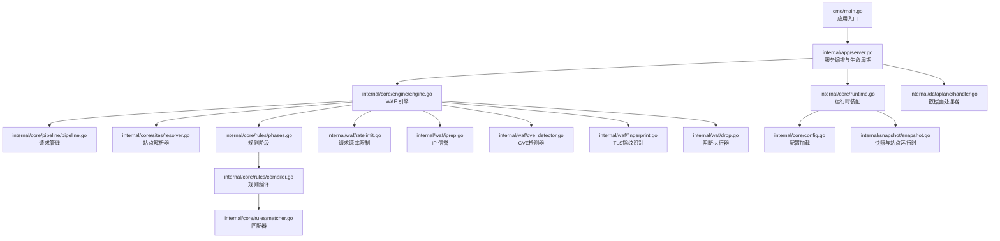

**图表来源**
- [cmd/main.go:1-10](file://cmd/main.go#L1-L10)
- [internal/app/server.go:33-280](file://internal/app/server.go#L33-L280)
- [internal/core/runtime.go:27-80](file://internal/core/runtime.go#L27-L80)
- [internal/core/engine/engine.go:23-176](file://internal/core/engine/engine.go#L23-L176)
- [internal/core/pipeline/pipeline.go:9-66](file://internal/core/pipeline/pipeline.go#L9-L66)
- [internal/core/sites/resolver.go:18-31](file://internal/core/sites/resolver.go#L18-L31)
- [internal/core/rules/phases.go:34-569](file://internal/core/rules/phases.go#L34-L569)
- [internal/core/rules/compiler.go:27-55](file://internal/core/rules/compiler.go#L27-L55)
- [internal/core/rules/matcher.go:167-261](file://internal/core/rules/matcher.go#L167-L261)
- [internal/waf/ratelimit.go:24-117](file://internal/waf/ratelimit.go#L24-L117)
- [internal/waf/iprep.go:44-243](file://internal/waf/iprep.go#L44-L243)
- [internal/waf/cve_detector.go:1-257](file://internal/waf/cve_detector.go#L1-257)
- [internal/waf/fingerprint.go:1-305](file://internal/waf/fingerprint.go#L1-305)
- [internal/waf/drop.go:1-123](file://internal/waf/drop.go#L1-123)
- [internal/dataplane/handler.go:36-257](file://internal/dataplane/handler.go#L36-L257)
- [internal/core/config.go:56-115](file://internal/core/config.go#L56-L115)
- [internal/snapshot/snapshot.go:52-105](file://internal/snapshot/snapshot.go#L52-L105)

**章节来源**
- [cmd/main.go:1-10](file://cmd/main.go#L1-L10)
- [internal/app/server.go:33-280](file://internal/app/server.go#L33-L280)

## 核心组件
- 引擎 Engine：封装站点解析、维护模式检查、规则阶段执行与结果聚合，新增CVE检测器和阻断执行器
- 规则引擎：编译规则为可执行的 Compiled 结构，按阶段顺序执行
- 站点解析器 Resolver：基于当前快照将 (bind, host) 映射到 SiteRuntime
- 速率限制器 RateLimiter：固定窗口计数，支持请求与错误两类限流
- IP 信誉系统 IPReputation：白名单/黑名单/自动封禁
- CVE检测器 CVEDetector：多技术栈漏洞检测，支持PHP、Java、Node.js和通用漏洞规则
- TLS指纹识别器 Fingerprint：基于JA3/JA4的TLS指纹分析与风险评分
- 阻断执行器 DropExecutor：TCP连接直接终止，无HTTP响应
- 数据平面处理器：在拦截后写入响应或转发至上游
- 生命周期管理：统一启动、优雅关闭、信号处理与服务器协调

**章节来源**
- [internal/core/engine/engine.go:15-176](file://internal/core/engine/engine.go#L15-L176)
- [internal/core/rules/compiler.go:27-55](file://internal/core/rules/compiler.go#L27-L55)
- [internal/core/sites/resolver.go:18-31](file://internal/core/sites/resolver.go#L18-L31)
- [internal/waf/ratelimit.go:24-117](file://internal/waf/ratelimit.go#L24-L117)
- [internal/waf/iprep.go:44-243](file://internal/waf/iprep.go#L44-L243)
- [internal/waf/cve_detector.go:11-257](file://internal/waf/cve_detector.go#L11-L257)
- [internal/waf/fingerprint.go:9-305](file://internal/waf/fingerprint.go#L9-L305)
- [internal/waf/drop.go:19-123](file://internal/waf/drop.go#L19-L123)
- [internal/dataplane/handler.go:36-257](file://internal/dataplane/handler.go#L36-L257)
- [internal/core/lifecycle/lifecycle.go:30-178](file://internal/core/lifecycle/lifecycle.go#L30-L178)

## 架构总览
下图展示从 Hertz 监听器到引擎再到上游的完整链路，以及引擎内部的阶段执行顺序，包含新增的CVE检测和TLS指纹识别阶段。

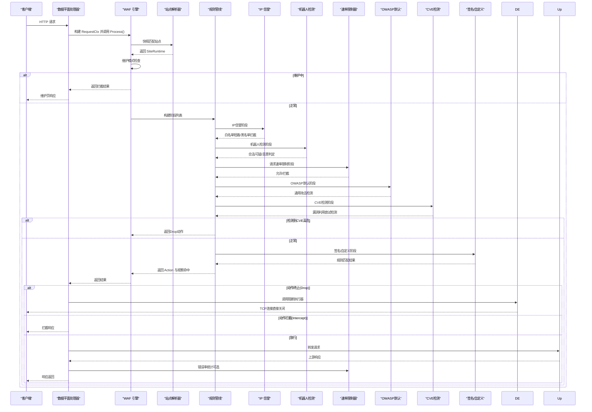

**图表来源**
- [internal/dataplane/handler.go:36-257](file://internal/dataplane/handler.go#L36-L257)
- [internal/core/engine/engine.go:57-129](file://internal/core/engine/engine.go#L57-L129)
- [internal/core/sites/resolver.go:18-31](file://internal/core/sites/resolver.go#L18-L31)
- [internal/core/rules/phases.go:305-358](file://internal/core/rules/phases.go#L305-L358)
- [internal/waf/ratelimit.go:24-117](file://internal/waf/ratelimit.go#L24-L117)
- [internal/waf/iprep.go:44-243](file://internal/waf/iprep.go#L44-L243)
- [internal/waf/cve_detector.go:111-158](file://internal/waf/cve_detector.go#L111-L158)
- [internal/waf/drop.go:59-83](file://internal/waf/drop.go#L59-L83)

## 详细组件分析

### 引擎 Engine：初始化、依赖注入与生命周期
- 初始化：通过 New 构造，注入快照持有者、请求/错误速率限制器、IP 信誉系统、CVE检测器
- 依赖注入：Resolver 由快照持有者生成；规则阶段根据保护配置动态拼装
- 生命周期：由 app 层创建、启动、热重载与优雅关闭；引擎自身不直接管理进程生命周期
- 新增功能：CVE检测器和阻断执行器的注入与配置

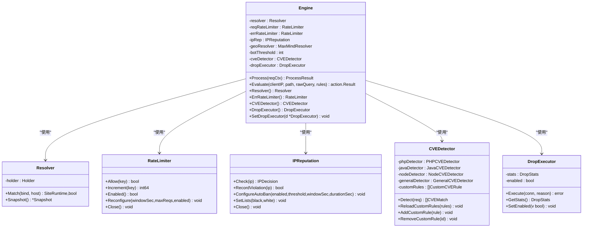

**图表来源**
- [internal/core/engine/engine.go:15-37](file://internal/core/engine/engine.go#L15-L37)
- [internal/core/sites/resolver.go:7-16](file://internal/core/sites/resolver.go#L7-L16)
- [internal/waf/ratelimit.go:9-34](file://internal/waf/ratelimit.go#L9-L34)
- [internal/waf/iprep.go:18-35](file://internal/waf/iprep.go#L18-L35)
- [internal/waf/cve_detector.go:11-21](file://internal/waf/cve_detector.go#L11-L21)
- [internal/waf/drop.go:19-24](file://internal/waf/drop.go#L19-L24)

**章节来源**
- [internal/core/engine/engine.go:27-37](file://internal/core/engine/engine.go#L27-L37)
- [internal/core/engine/engine.go:152-155](file://internal/core/engine/engine.go#L152-L155)
- [internal/core/lifecycle/lifecycle.go:30-178](file://internal/core/lifecycle/lifecycle.go#L30-L178)

### Process 执行流程：请求上下文、站点解析、维护模式与规则阶段
- 请求上下文：由数据平面处理器填充 RequestCtx（含请求 ID、绑定地址、客户端 IP、方法、路径、查询、头、体、内容类型等）
- 站点解析：使用 Resolver 从当前快照中匹配站点，支持精确匹配与通配符
- 维护模式：若全局或站点启用维护，则立即返回拦截结果
- 规则阶段：按顺序执行（IP 信誉 → 机器人检测 → 请求速率限制 → OWASP → CVE → 签名/自定义），遇到终止动作即短路
- 结果返回：包含最终动作、站点信息、观察命中列表

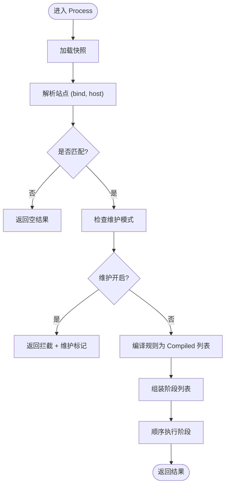

**图表来源**
- [internal/core/engine/engine.go:57-129](file://internal/core/engine/engine.go#L57-L129)
- [internal/core/pipeline/pipeline.go:46-66](file://internal/core/pipeline/pipeline.go#L46-L66)

**章节来源**
- [internal/core/engine/engine.go:57-129](file://internal/core/engine/engine.go#L57-L129)
- [internal/core/pipeline/pipeline.go:9-66](file://internal/core/pipeline/pipeline.go#L9-L66)

### CVE检测器：多技术栈漏洞检测
- 架构设计：CVEDetector 作为门面模式，协调多个技术栈专用检测器和通用检测器
- 技术栈检测器：PHP、Java、Node.js专用检测器，针对各自生态的典型漏洞模式
- 通用检测器：检测SSRF、XXE、路径遍历、CRLF注入、HTTP请求走私等通用漏洞
- 自定义规则：支持从数据库热加载自定义CVE规则，正则表达式预编译缓存
- 并行检测：多检测器并行执行，使用WaitGroup收集结果，提升检测效率

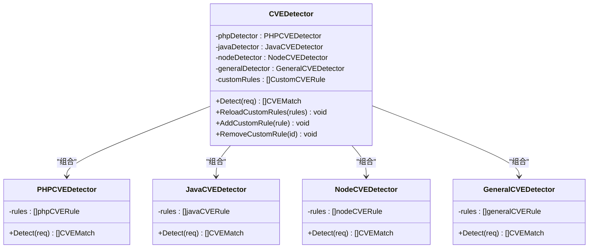

**图表来源**
- [internal/waf/cve_detector.go:11-73](file://internal/waf/cve_detector.go#L11-L73)
- [internal/waf/cve_php.go:8-63](file://internal/waf/cve_php.go#L8-L63)
- [internal/waf/cve_general.go:8-53](file://internal/waf/cve_general.go#L8-L53)

**章节来源**
- [internal/waf/cve_detector.go:65-174](file://internal/waf/cve_detector.go#L65-L174)
- [internal/waf/cve_php.go:65-119](file://internal/waf/cve_php.go#L65-L119)
- [internal/waf/cve_general.go:55-106](file://internal/waf/cve_general.go#L55-L106)

### TLS指纹识别器：JA3/JA4指纹分析
- 指纹提取：从请求头中提取JA3/JA4哈希、TLS版本、HTTP/2设置、头部顺序等信息
- 风险评分：基于已知恶意指纹库、浏览器一致性检查、TLS版本验证、HTTP/2设置验证等维度进行综合评分
- 多维度验证：包括已知恶意JA3指纹匹配、浏览器声明一致性、TLS版本过旧检测、HTTP/2设置异常检测、头部顺序异常检测
- 实时评分：支持从TLS层传递的指纹信息，或基于可用的TLS连接状态信息计算指纹

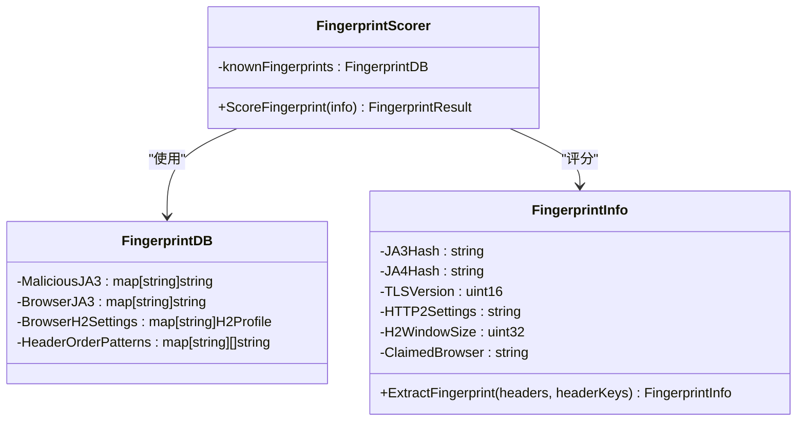

**图表来源**
- [internal/waf/fingerprint.go:30-40](file://internal/waf/fingerprint.go#L30-L40)
- [internal/waf/fingerprint.go:9-21](file://internal/waf/fingerprint.go#L9-L21)

**章节来源**
- [internal/waf/fingerprint.go:35-163](file://internal/waf/fingerprint.go#L35-L163)
- [internal/waf/bot.go:386-392](file://internal/waf/bot.go#L386-L392)

### 阻断执行器：TCP连接直接终止
- 架构设计：独立的阻断执行器，支持启用/禁用状态管理
- 统计分析：原子计数器跟踪总阻断数、按来源分类的阻断统计、最后阻断时间
- 动作优先级：Drop动作具有最高优先级，直接终止TCP连接，不发送任何HTTP响应
- 日志记录：详细的阻断事件日志，包含来源、规则ID、客户端IP、主机、路径等信息

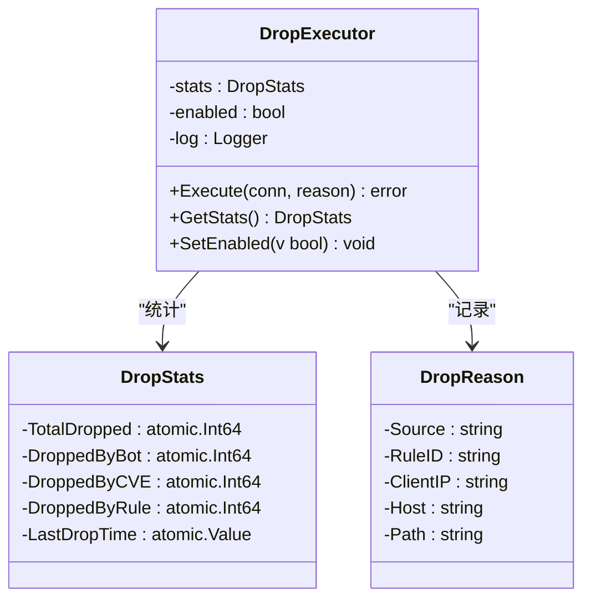

**图表来源**
- [internal/waf/drop.go:19-52](file://internal/waf/drop.go#L19-L52)
- [internal/waf/drop.go:10-17](file://internal/waf/drop.go#L10-L17)
- [internal/waf/drop.go:26-35](file://internal/waf/drop.go#L26-L35)

**章节来源**
- [internal/waf/drop.go:37-123](file://internal/waf/drop.go#L37-L123)

### 规则编译与匹配：DSL解析、排序与执行
- 编译：将存储层规则转换为 Compiled，按优先级与 ID 排序
- DSL：支持 block_ip、block_path、block_header、block_user_agent、body_contains、query_param 等前缀，以及复合条件 JSON
- 匹配：构建具体 Matcher（CIDR、正则、包含、键值对等），缓存正则以降低开销
- 阶段：每个阶段封装一组规则，按顺序执行，遇到允许短路、拦截终止

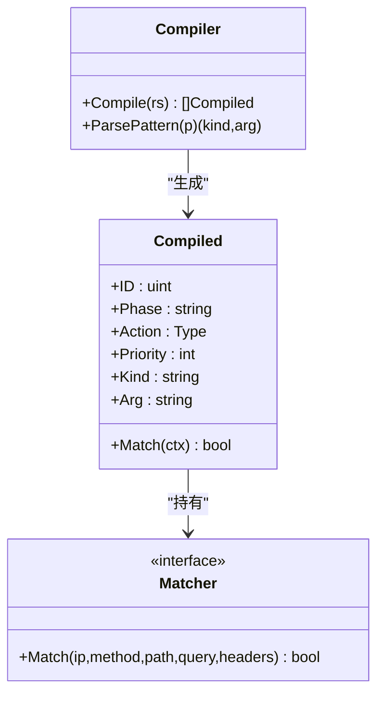

**图表来源**
- [internal/core/rules/compiler.go:11-55](file://internal/core/rules/compiler.go#L11-L55)
- [internal/core/rules/matcher.go:11-141](file://internal/core/rules/matcher.go#L11-L141)

**章节来源**
- [internal/core/rules/compiler.go:27-55](file://internal/core/rules/compiler.go#L27-L55)
- [internal/core/rules/matcher.go:167-261](file://internal/core/rules/matcher.go#L167-L261)

### 站点解析器与快照：不可变快照与原子切换
- Resolver：从快照中查找站点，支持精确匹配与通配符（*.domain）
- Snapshot：不可变视图，包含站点映射、默认阻断页、SNI 证书、保护配置等
- Holder：原子指针保存当前快照，用于零停机切换

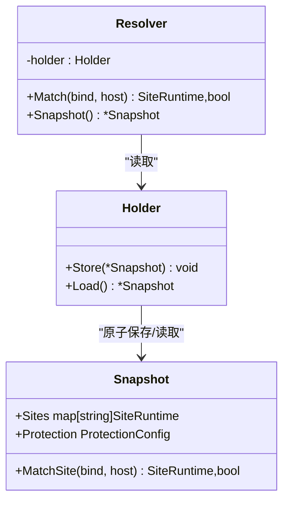

**图表来源**
- [internal/core/sites/resolver.go:7-31](file://internal/core/sites/resolver.go#L7-L31)
- [internal/snapshot/snapshot.go:52-96](file://internal/snapshot/snapshot.go#L52-L96)

**章节来源**
- [internal/core/sites/resolver.go:18-31](file://internal/core/sites/resolver.go#L18-L31)
- [internal/snapshot/snapshot.go:74-96](file://internal/snapshot/snapshot.go#L74-L96)

### 速率限制器与 IP 信誉：固定窗口与自动封禁
- 速率限制：固定窗口计数，支持请求与错误两类；可运行时重配置
- IP 信誉：白名单短路放行、黑名单直接拦截；支持自动封禁阈值、窗口与时长

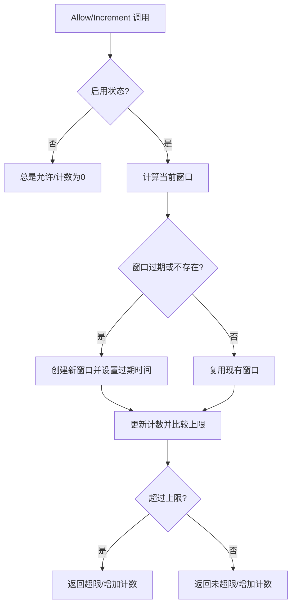

**图表来源**
- [internal/waf/ratelimit.go:48-92](file://internal/waf/ratelimit.go#L48-L92)
- [internal/waf/iprep.go:89-155](file://internal/waf/iprep.go#L89-L155)

**章节来源**
- [internal/waf/ratelimit.go:24-117](file://internal/waf/ratelimit.go#L24-L117)
- [internal/waf/iprep.go:44-243](file://internal/waf/iprep.go#L44-L243)

### 数据平面处理器：拦截、记录与转发
- 维护模式：直接输出维护页
- 拦截：记录拦截事件并写入阻断响应
- 观察命中：记录日志与安全事件
- 转发：HTTP/WebSocket/SSE 分支转发至上游；错误率统计在响应后进行
- 阻断执行：对于Drop动作调用阻断执行器直接关闭TCP连接

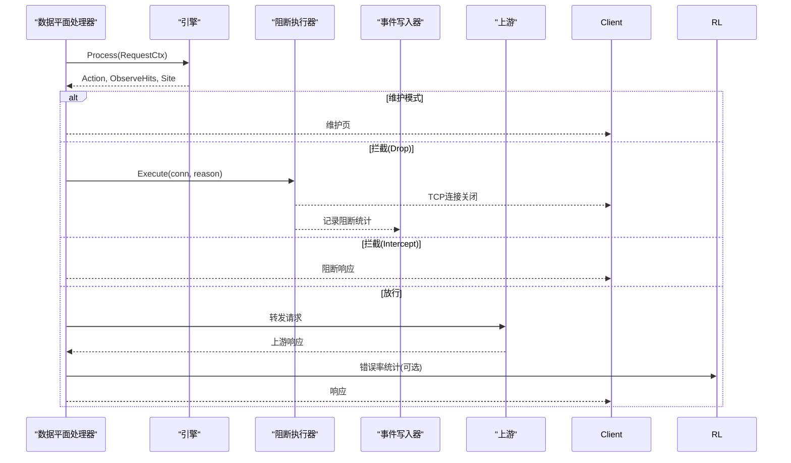

**图表来源**
- [internal/dataplane/handler.go:36-257](file://internal/dataplane/handler.go#L36-L257)
- [internal/waf/drop.go:59-83](file://internal/waf/drop.go#L59-L83)

**章节来源**
- [internal/dataplane/handler.go:36-257](file://internal/dataplane/handler.go#L36-L257)

## 依赖关系分析
- 引擎依赖：Resolver、规则编译器、各规则阶段、速率限制器、IP 信誉系统、CVE检测器、阻断执行器
- 数据平面依赖：引擎、快照持有者、指标、事件写入器、上游代理、阻断执行器
- 运行时依赖：数据库、可选 Redis、缓存层、快照构建器
- 生命周期依赖：Hertz 服务器适配器、信号处理、优雅关闭

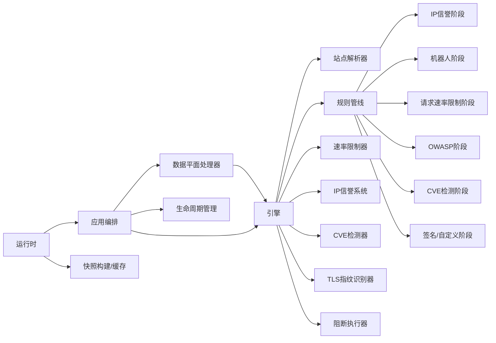

**图表来源**
- [internal/dataplane/handler.go:36-257](file://internal/dataplane/handler.go#L36-L257)
- [internal/core/engine/engine.go:57-129](file://internal/core/engine/engine.go#L57-L129)
- [internal/core/lifecycle/lifecycle.go:30-178](file://internal/core/lifecycle/lifecycle.go#L30-L178)
- [internal/core/runtime.go:27-80](file://internal/core/runtime.go#L27-L80)

**章节来源**
- [internal/core/engine/engine.go:15-176](file://internal/core/engine/engine.go#L15-L176)
- [internal/core/lifecycle/lifecycle.go:30-178](file://internal/core/lifecycle/lifecycle.go#L30-L178)
- [internal/core/runtime.go:27-80](file://internal/core/runtime.go#L27-L80)

## 性能考量
- 规则编译与缓存：规则编译一次，按优先级排序；正则表达式缓存避免重复编译
- 请求上下文池化：数据平面处理器使用对象池减少 GC 压力
- 固定窗口限流：低内存占用，定时清理过期窗口；错误率统计在响应后进行，避免阻塞请求路径
- IP 信誉：白名单短路、黑名单拦截快速路径；自动封禁定期清理过期封禁
- CVE检测并行化：多检测器并行执行，使用WaitGroup收集结果，提升检测效率
- TLS指纹识别：指纹数据库预加载，评分算法优化，避免重复计算
- 阻断执行器：原子操作确保统计准确性，异步日志记录避免阻塞主请求路径
- 内容扫描：对不同 Content-Type 采取差异化策略，限制扫描大小，避免误报与资源滥用
- 监听器热重载：基于CVE检测配置漂移，仅重启受影响监听器，降低停机影响

## 故障排查指南
- 快照未加载：数据平面处理器在快照为空时返回 503，检查运行时初始化与迁移
- 未知虚拟主机：站点解析失败返回 404，确认监听绑定与 Host 头匹配
- 维护模式：若返回拦截且标记为维护，检查全局或站点维护开关
- 拦截日志：关注安全事件与访问日志中的规则 ID、阶段、分类与匹配描述
- 速率限制：确认启用状态、窗口与上限配置；检查错误率统计是否按预期触发
- IP 信誉：核对白/黑名单与自动封禁阈值；查看活动封禁列表
- CVE检测：检查CVE检测器状态、自定义规则加载情况、检测器并行执行状态
- TLS指纹：验证指纹数据库完整性、指纹提取正确性、评分阈值设置
- 阻断执行：确认阻断执行器启用状态、统计信息准确性、日志记录完整性
- 上游错误：转发失败返回 502，检查上游地址与网络连通性

**章节来源**
- [internal/dataplane/handler.go:54-71](file://internal/dataplane/handler.go#L54-L71)
- [internal/core/engine/engine.go:69-81](file://internal/core/engine/engine.go#L69-L81)
- [internal/waf/ratelimit.go:36-46](file://internal/waf/ratelimit.go#L36-L46)
- [internal/waf/iprep.go:68-79](file://internal/waf/iprep.go#L68-L79)
- [internal/waf/cve_detector.go:160-174](file://internal/waf/cve_detector.go#L160-L174)
- [internal/waf/drop.go:49-57](file://internal/waf/drop.go#L49-L57)

## 结论
My-OpenWaf 的引擎以"不可变快照 + 责任链规则管线"为核心设计，结合站点解析、速率限制、IP信誉、CVE检测、TLS指纹识别和阻断执行器，形成高可用、可热重载、可观测的全方位安全防护体系。通过清晰的依赖注入与生命周期管理，引擎在保证性能的同时提供了灵活的扩展空间，新增的CVE检测和TLS指纹识别功能进一步增强了对针对性攻击和自动化工具的检测能力。

## 附录：配置与最佳实践

### 引擎初始化与依赖注入
- 应用入口：通过入口函数启动运行时、构建快照、装配引擎与监听器
- 运行时：打开数据库与可选 Redis，初始化缓存与快照持有者
- 引擎：注入快照持有者、请求/错误速率限制器、IP 信誉系统、CVE检测器

**章节来源**
- [cmd/main.go:7-9](file://cmd/main.go#L7-L9)
- [internal/app/server.go:33-120](file://internal/app/server.go#L33-L120)
- [internal/core/runtime.go:27-80](file://internal/core/runtime.go#L27-L80)

### 配置选项（环境变量）
- 数据库：驱动、DSN、数据目录
- Redis：地址、密码、DB
- 管理端绑定：控制面监听地址
- 静态资源：本地开发覆盖嵌入前端
- 机器人检测：GeoIP 数据库路径、风险国家、数据中心/VPN ASN 列表、评分阈值
- CVE检测：CVE检测启用状态、CVE动作配置、自定义CVE规则

**章节来源**
- [internal/core/config.go:56-115](file://internal/core/config.go#L56-L115)

### 使用示例与最佳实践
- 示例一：在数据平面处理器中调用引擎
  - 路径参考：[internal/dataplane/handler.go:106](file://internal/dataplane/handler.go#L106)
- 示例二：引擎评估已解析站点规则（测试辅助）
  - 路径参考：[internal/core/engine/engine.go:132-145](file://internal/core/engine/engine.go#L132-L145)
- 最佳实践
  - 将规则按阶段拆分，利用 ACL 快速短路
  - 启用机器人检测与 OWASP 默认规则，结合业务场景调整敏感度
  - 合理设置速率限制窗口与上限，避免误伤正常用户
  - 定期维护 IP 黑/白名单，启用自动封禁应对持续攻击
  - 启用CVE检测功能，定期更新CVE规则库
  - 配置TLS指纹识别，建立指纹数据库，提高自动化工具检测准确率
  - 启用阻断执行器，对高危威胁实施TCP层面阻断
  - 使用热重载功能平滑更新配置，配合 Redis 分布式通知

**章节来源**
- [internal/dataplane/handler.go:106](file://internal/dataplane/handler.go#L106)
- [internal/core/engine/engine.go:132-145](file://internal/core/engine/engine.go#L132-L145)
- [internal/core/rules/phases.go:305-358](file://internal/core/rules/phases.go#L305-L358)