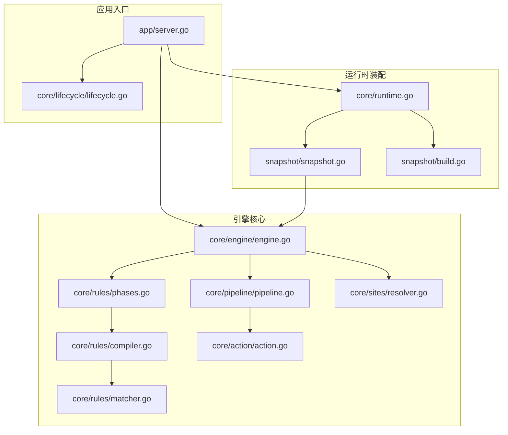
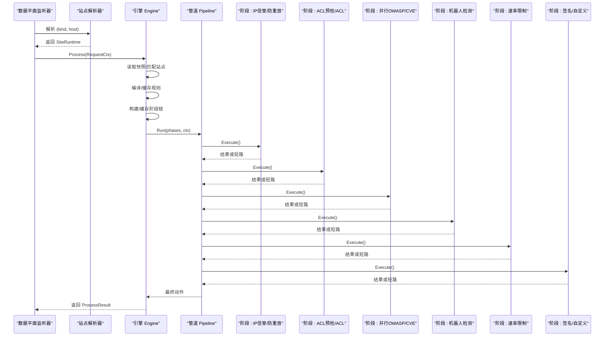
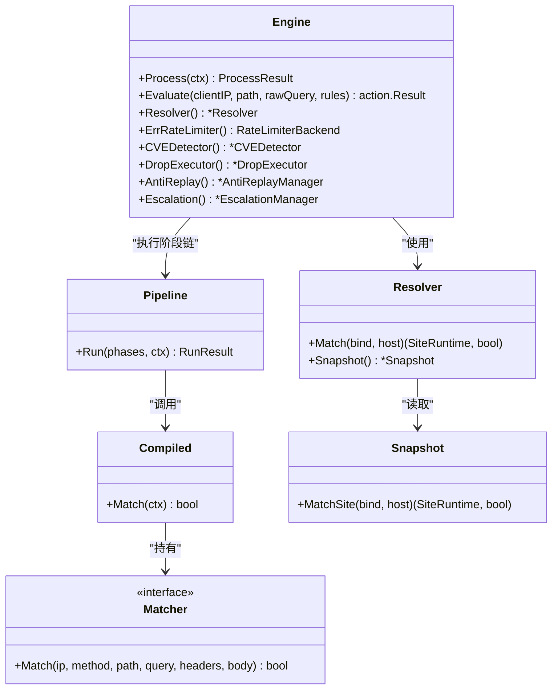
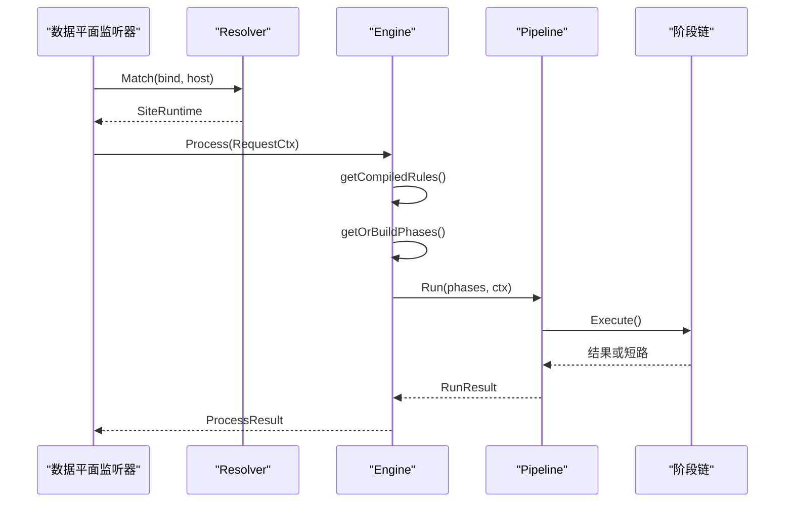

# 引擎核心架构

> [返回 WAF 引擎系统](../WAF 引擎系统.md)

<cite>
**本文引用的文件**
- [engine.go](file://internal/core/engine/engine.go)
- [pipeline.go](file://internal/core/pipeline/pipeline.go)
- [compiler.go](file://internal/core/rules/compiler.go)
- [matcher.go](file://internal/core/rules/matcher.go)
- [phases.go](file://internal/core/rules/phases.go)
- [snapshot.go](file://internal/snapshot/snapshot.go)
- [build.go](file://internal/snapshot/build.go)
- [resolver.go](file://internal/core/sites/resolver.go)
- [action.go](file://internal/core/action/action.go)
- [runtime.go](file://internal/core/runtime.go)
- [server.go](file://internal/app/server.go)
- [lifecycle.go](file://internal/core/lifecycle/lifecycle.go)
</cite>

## 目录
1. [简介](#简介)
2. [项目结构](#项目结构)
3. [核心组件](#核心组件)
4. [架构总览](#架构总览)
5. [详细组件分析](#详细组件分析)
6. [依赖关系分析](#依赖关系分析)
7. [性能考量](#性能考量)
8. [故障排查指南](#故障排查指南)
9. [结论](#结论)
10. [附录](#附录)

## 简介
本文件面向引擎核心架构，系统化阐述 WAF 引擎 Engine 的设计与实现，重点覆盖以下方面：
- 站点解析器：基于快照的站点匹配与路由
- 规则编译器：规则 DSL 到可执行匹配器的转换
- 管道执行器：阶段链的构建、执行顺序与短路机制
- 快照系统：配置不可变性与热重载
- 请求处理全流程：从站点匹配到最终动作决策
- 性能优化策略与故障排查

目标是帮助读者在不深入源码细节的前提下，理解引擎如何以“快照 + 缓存 + 管道”的方式实现高吞吐、低延迟、可热重载的 WAF 处理。

## 项目结构
引擎相关的核心模块分布如下：
- 核心引擎与执行：internal/core/engine、internal/core/pipeline
- 规则系统：internal/core/rules（编译器、匹配器、阶段）
- 快照系统：internal/snapshot（构建、持有）
- 站点解析：internal/core/sites
- 应用入口与生命周期：internal/app、internal/core/lifecycle
- 运行时装配：internal/core/runtime

图表来源
- [server.go:52-396](file://internal/app/server.go#L52-L396)
- [runtime.go:17-127](file://internal/core/runtime.go#L17-L127)
- [engine.go:37-245](file://internal/core/engine/engine.go#L37-L245)
- [pipeline.go:50-124](file://internal/core/pipeline/pipeline.go#L50-L124)
- [phases.go:57-800](file://internal/core/rules/phases.go#L57-L800)
- [compiler.go:29-91](file://internal/core/rules/compiler.go#L29-L91)
- [matcher.go:12-763](file://internal/core/rules/matcher.go#L12-L763)
- [action.go:5-176](file://internal/core/action/action.go#L5-L176)
- [resolver.go:7-32](file://internal/core/sites/resolver.go#L7-L32)
- [snapshot.go:72-152](file://internal/snapshot/snapshot.go#L72-L152)
- [build.go:17-210](file://internal/snapshot/build.go#L17-L210)

章节来源
- [server.go:52-396](file://internal/app/server.go#L52-L396)
- [runtime.go:17-127](file://internal/core/runtime.go#L17-L127)

## 核心组件
- 引擎 Engine：统一协调站点解析、规则编译、阶段构建与执行，并提供评估接口
- 管道 Pipeline：有序阶段执行器，支持短路与挑战延迟
- 规则编译器：将 DSL 规则转换为可执行的 Compiled 规则
- 匹配器 Matcher：针对请求字段的具体匹配逻辑
- 快照 Snapshot：不可变配置视图，支持原子切换与热重载
- 站点解析器 Resolver：基于当前快照进行站点匹配

章节来源
- [engine.go:37-245](file://internal/core/engine/engine.go#L37-L245)
- [pipeline.go:50-124](file://internal/core/pipeline/pipeline.go#L50-L124)
- [compiler.go:29-91](file://internal/core/rules/compiler.go#L29-L91)
- [matcher.go:12-763](file://internal/core/rules/matcher.go#L12-L763)
- [snapshot.go:72-152](file://internal/snapshot/snapshot.go#L72-L152)
- [resolver.go:7-32](file://internal/core/sites/resolver.go#L7-L32)

## 架构总览
引擎以“快照 + 缓存 + 管道”为核心设计：
- 快照：从数据库构建不可变配置视图，通过 Holder 原子替换
- 编译缓存：按快照版本与策略 ID 缓存规则编译结果，避免重复编译
- 阶段缓存：按快照版本与策略 ID 缓存阶段链，避免每次请求重建
- 管道执行：严格顺序执行，支持终端动作短路与挑战延迟

图表来源
- [engine.go:200-245](file://internal/core/engine/engine.go#L200-L245)
- [pipeline.go:78-118](file://internal/core/pipeline/pipeline.go#L78-L118)
- [phases.go:57-800](file://internal/core/rules/phases.go#L57-L800)

## 详细组件分析

### 引擎 Engine 设计与职责
- 职责边界
  - 站点解析：委托 Resolver 从当前快照中匹配站点
  - 规则编译：按快照版本与策略 ID 缓存 Compiled 规则
  - 阶段构建：根据站点有效保护配置与能力动态组装阶段链
  - 管道执行：调用 Pipeline.Run 执行阶段链，返回最终动作
  - 辅助能力：维护 IP 信誉、机器人阈值、CVE 检测器、防重放、降级等

- 关键数据结构
  - compiledRules：按阶段分区的已编译规则
  - phasesEntry：阶段链与保护配置指针的组合，用于缓存有效性判断
  - ProcessResult：包含最终动作、站点信息、观察命中与维护标记

- 缓存策略
  - compiledRevision + compiledCache：按快照版本与策略 ID 缓存规则
  - phasesRevision + phasesCache：按快照版本与策略 ID 缓存阶段链
  - 通过快照 Revision 与保护配置指针进行失效判定，确保不可变性

- 维护模式与短路
  - 若全局或站点维护开启，直接返回拦截动作，跳过规则匹配

章节来源
- [engine.go:37-245](file://internal/core/engine/engine.go#L37-L245)

### 管道执行器 Pipeline
- 接口与数据结构
  - Phase 接口：Name() 与 Execute(ctx) -> (action.Result, bool)
  - RunResult：包含最终动作与观察命中列表
  - RequestCtx：承载请求上下文，含客户端 IP、方法、路径、查询、头、体、内容类型、指纹参数等

- 执行语义
  - 顺序执行：逐阶段执行，遇到终端动作立即短路
  - 挑战延迟：挑战类动作不立即短路，等待后续阶段可能产生更高优先级的终端动作
  - 终端优先级：Drop > Intercept > RateLimit > Challenge > Redirect > Observe
  - 观察命中：仅记录非挑战的匹配命中，用于日志统计

- 热路径优化
  - Run 直接遍历阶段切片，避免额外对象分配
  - 使用 RWMutex 保证并发安全，读多写少场景下降低锁竞争

章节来源
- [pipeline.go:50-124](file://internal/core/pipeline/pipeline.go#L50-L124)
- [action.go:53-176](file://internal/core/action/action.go#L53-L176)

### 规则编译器与匹配器
- 编译流程
  - ParsePattern：解析 DSL 字符串，支持复合 JSON 条件
  - Compile：过滤启用规则，构建 Compiled 列表并排序（优先级优先，ID 次之）
  - buildMatcher：根据 kind:arg 生成具体 Matcher 实例（CIDR、正则、JSON 路径、multipart 文件名、地理阻断等）

- 匹配器体系
  - 基础匹配器：IP CIDR、路径前缀/正则、查询包含/正则、头包含/正则、方法、内容类型、主体包含/正则、JSON 路径、multipart 文件名、地理阻断、主机匹配、全 URL 包含/正则、Cookie/Referer 包含等
  - 复合匹配器：AND/OR/NOT、并发速率 CC 控制器
  - 正则缓存：全局正则编译缓存，避免重复编译

- 规则阶段
  - ACL 预检与 ACL：ACL 预检仅探测 Allow 命中；ACL 阶段执行全部规则
  - 签名与自定义：按阶段分区执行
  - OWASP/CVE：并行阶段，结合敏感度与规则覆盖配置
  - 机器人检测：两阶段评分（GeoIP 加权）或单阶段评分
  - 速率限制：基于客户端 IP + Host 的键空间
  - IP 信誉：白名单直通、黑名单拦截
  - 防重放：基于 Redis 的一次性 nonce 机制

章节来源
- [compiler.go:29-91](file://internal/core/rules/compiler.go#L29-L91)
- [matcher.go:12-763](file://internal/core/rules/matcher.go#L12-L763)
- [phases.go:57-800](file://internal/core/rules/phases.go#L57-L800)

### 快照系统与热重载
- 不可变快照
  - Snapshot：包含站点映射、默认阻断页、SNI 证书映射、全局保护配置
  - Holder：原子指针持有快照，Load/Store 提供线程安全访问
  - MatchSite：精确匹配后尝试通配域（非 IP），支持大小写与端口剥离

- 快照构建
  - Build：从数据库加载站点、监听器、证书、规则、应用路由规则，合并保护配置，生成 SiteRuntime 映射
  - 合并保护：站点字段覆盖全局保护配置，形成每站点 EffectiveProtection
  - CC 规则：将自定义 CC 规则编译为复合条件规则

- 热重载
  - ReloadSnapshot：计算当前修订号，优先从缓存读取，否则构建并写入缓存与 Holder
  - 应用层触发：控制面调用 reload，递增修订号、重新构建快照、应用运行时配置、热启动数据监听器、Redis 通知

章节来源
- [snapshot.go:72-152](file://internal/snapshot/snapshot.go#L72-L152)
- [build.go:17-210](file://internal/snapshot/build.go#L17-L210)
- [runtime.go:82-111](file://internal/core/runtime.go#L82-L111)
- [server.go:313-350](file://internal/app/server.go#L313-L350)

### 站点解析器
- Resolver：封装快照持有者，提供 Match 与 Snapshot 方法
- Match：先从快照加载，再调用 Snapshot.MatchSite 完成精确匹配与通配匹配

章节来源
- [resolver.go:7-32](file://internal/core/sites/resolver.go#L7-L32)
- [snapshot.go:94-118](file://internal/snapshot/snapshot.go#L94-L118)

### 请求处理全流程
- 初始化
  - 创建 Runtime（DB/Redis/缓存/快照 Holder）
  - 自动迁移、种子默认凭据、首次构建快照
  - 初始化各子系统（速率限制、IP 信誉、CVE、挑战、防重放、降级）

- 请求处理
  - 解析站点：Resolver 从当前快照匹配站点
  - 维护检查：若全局或站点维护开启，直接返回拦截
  - 规则编译：按快照版本与策略 ID 缓存 Compiled 规则
  - 阶段构建：根据站点 EffectiveProtection 与能力组装阶段链
  - 管道执行：Run 执行阶段链，遵循短路与挑战延迟规则

- 配置更新
  - 控制面触发 reload：递增修订号、构建新快照、应用运行时配置、热启动监听器、Redis 通知
  - 其他节点订阅 Redis：收到通知后拉取最新快照并应用

章节来源
- [server.go:52-396](file://internal/app/server.go#L52-L396)
- [engine.go:200-245](file://internal/core/engine/engine.go#L200-L245)

## 依赖关系分析

图表来源
- [engine.go:37-245](file://internal/core/engine/engine.go#L37-L245)
- [resolver.go:7-32](file://internal/core/sites/resolver.go#L7-L32)
- [pipeline.go:50-124](file://internal/core/pipeline/pipeline.go#L50-L124)
- [compiler.go:11-27](file://internal/core/rules/compiler.go#L11-L27)
- [matcher.go:12-15](file://internal/core/rules/matcher.go#L12-L15)
- [snapshot.go:72-118](file://internal/snapshot/snapshot.go#L72-L118)

章节来源
- [engine.go:37-245](file://internal/core/engine/engine.go#L37-L245)
- [resolver.go:7-32](file://internal/core/sites/resolver.go#L7-L32)
- [pipeline.go:50-124](file://internal/core/pipeline/pipeline.go#L50-L124)
- [compiler.go:11-27](file://internal/core/rules/compiler.go#L11-L27)
- [matcher.go:12-15](file://internal/core/rules/matcher.go#L12-L15)
- [snapshot.go:72-118](file://internal/snapshot/snapshot.go#L72-L118)

## 性能考量
- 编译与缓存
  - 规则编译昂贵，按快照版本与策略 ID 缓存 Compiled 规则，避免重复编译
  - 阶段链按快照版本与策略 ID 缓存，减少对象分配与构建成本
- 管道执行
  - Run 直接遍历阶段切片，避免额外包装对象
  - 终端优先级比较与挑战延迟在热路径内完成
- 匹配器优化
  - 正则编译缓存，避免重复编译
  - 主体解析按内容类型与 Sniffing 选择最优策略，限制扫描范围
- 快照与热重载
  - 快照不可变，原子替换，避免运行时锁争用
  - 热重载通过修订号与指针比较快速失效缓存，最小化停机时间
- 并发与资源
  - 读多写少场景采用 RWMutex，降低锁开销
  - 速率限制、IP 信誉、挑战等子系统支持 Redis 分布式共享状态

[本节为通用性能指导，无需特定文件来源]

## 故障排查指南
- 热重载失败
  - 检查数据库连接与迁移是否成功
  - 确认修订号递增与快照构建成功
  - 查看 Redis 订阅是否正常，其他节点是否收到通知
- 规则未生效
  - 确认规则启用且优先级正确
  - 检查站点策略与全局保护配置合并是否符合预期
  - 核对阶段链构建逻辑（如 OWASP/CVE 是否启用）
- 动作不符合预期
  - 检查终端优先级与挑战延迟逻辑
  - 确认观察命中是否被正确记录
- 维护模式异常
  - 检查全局与站点维护开关状态
  - 确认维护页面与状态码配置

章节来源
- [server.go:313-350](file://internal/app/server.go#L313-L350)
- [runtime.go:82-111](file://internal/core/runtime.go#L82-L111)
- [action.go:53-176](file://internal/core/action/action.go#L53-L176)

## 结论
引擎通过“快照 + 编译缓存 + 阶段缓存 + 管道执行”的组合，实现了高吞吐、低延迟、可热重载的 WAF 处理框架。其关键优势在于：
- 不可变快照确保一致性与原子切换
- 编译与阶段链缓存显著降低热路径开销
- 管道短路与挑战延迟机制兼顾安全与用户体验
- 清晰的职责划分与模块化设计便于扩展与维护

[本节为总结性内容，无需特定文件来源]

## 附录

### 引擎初始化与配置更新流程
- 初始化
  - 创建 Runtime，自动迁移，种子默认凭据
  - 构建初始快照并加载到 Holder
  - 初始化各子系统（速率限制、IP 信誉、CVE、挑战、防重放、降级）
- 配置更新
  - 控制面触发 reload：递增修订号、构建新快照、应用运行时配置、热启动监听器、Redis 通知
  - 其他节点订阅 Redis：收到通知后拉取最新快照并应用

章节来源
- [server.go:52-396](file://internal/app/server.go#L52-L396)
- [runtime.go:82-111](file://internal/core/runtime.go#L82-L111)

### 请求处理序列图（代码级）

图表来源
- [engine.go:200-245](file://internal/core/engine/engine.go#L200-L245)
- [resolver.go:18-31](file://internal/core/sites/resolver.go#L18-L31)
- [pipeline.go:78-118](file://internal/core/pipeline/pipeline.go#L78-L118)