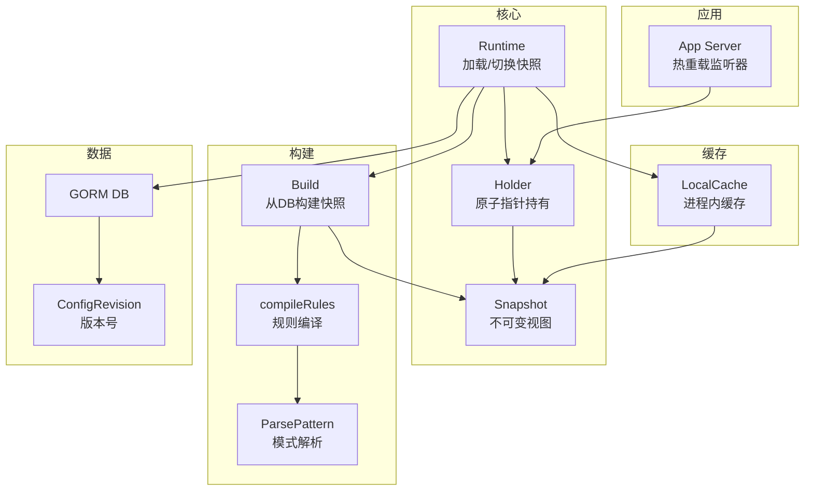
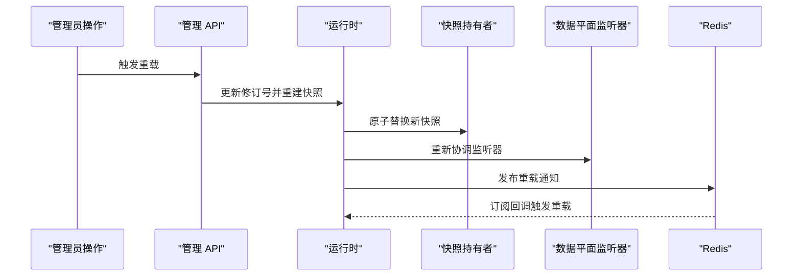
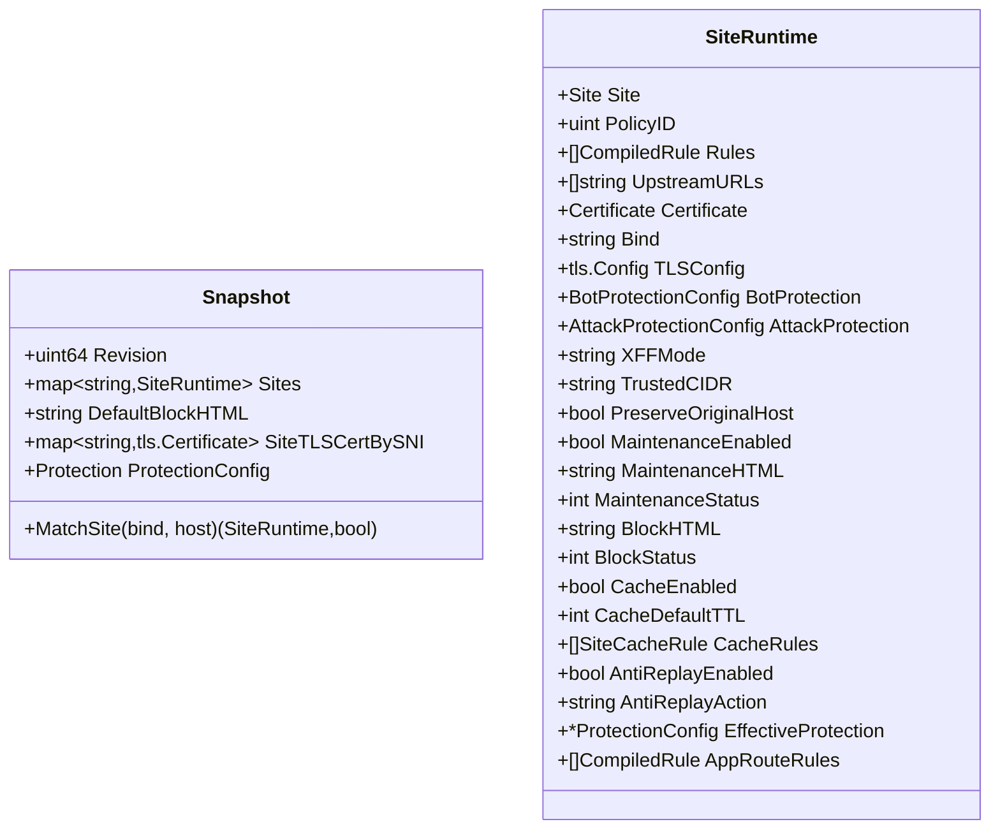
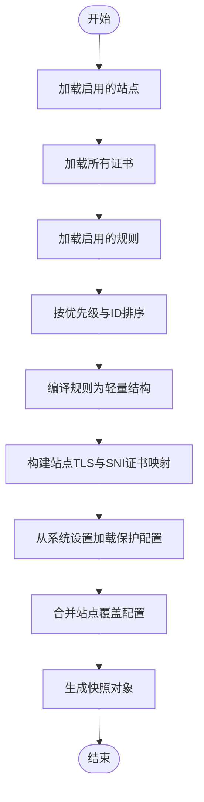
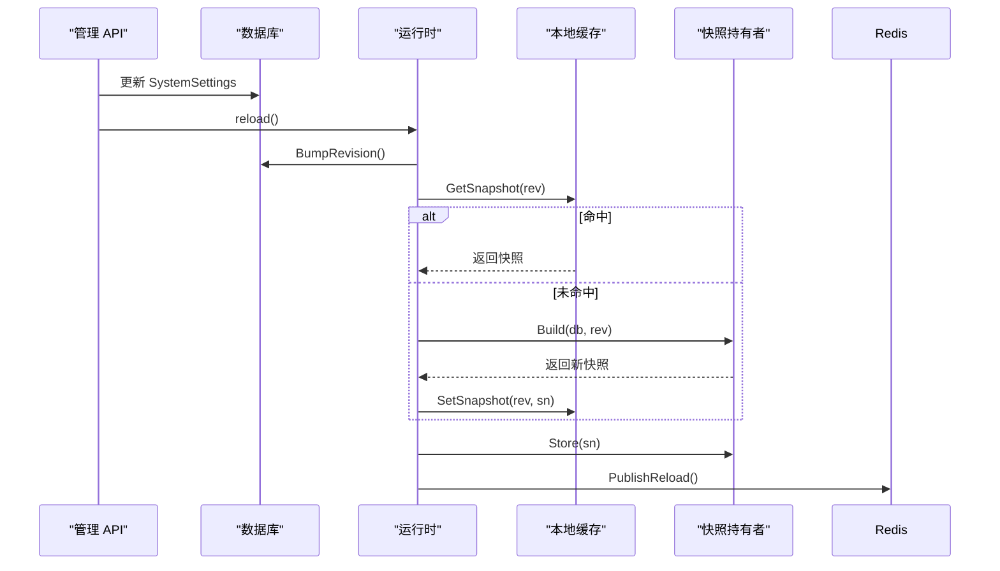
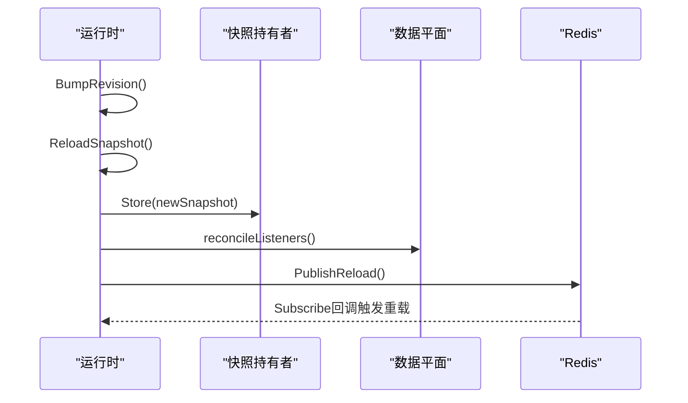
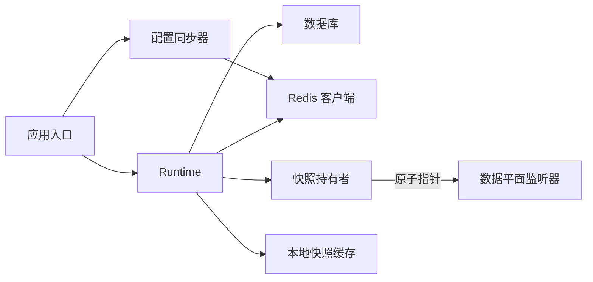

# 快照系统

<cite>
**本文引用的文件**
- [internal/snapshot/snapshot.go](file://internal/snapshot/snapshot.go)
- [internal/snapshot/build.go](file://internal/snapshot/build.go)
- [internal/snapshot/snapshot_test.go](file://internal/snapshot/snapshot_test.go)
- [internal/core/runtime.go](file://internal/core/runtime.go)
- [internal/cache/layer.go](file://internal/cache/layer.go)
- [internal/store/migrate.go](file://internal/store/migrate.go)
- [internal/store/system.go](file://internal/store/system.go)
- [internal/core/redis/pubsub.go](file://internal/core/redis/pubsub.go)
- [internal/app/server.go](file://internal/app/server.go)
- [internal/admin/system/settings.go](file://internal/admin/system/settings.go)
- [docs/配置管理系统/配置快照机制.md](file://docs/配置管理系统/配置快照机制.md)
- [docs/配置管理系统/热重载系统.md](file://docs/配置管理系统/热重载系统.md)
- [docs/配置管理系统/分布式同步机制.md](file://docs/配置管理系统/分布式同步机制.md)
- [docs/项目概述/项目介绍.md](file://docs/项目概述/项目介绍.md)
</cite>

## 目录
1. [简介](#简介)
2. [项目结构](#项目结构)
3. [核心组件](#核心组件)
4. [架构总览](#架构总览)
5. [详细组件分析](#详细组件分析)
6. [依赖分析](#依赖分析)
7. [性能考量](#性能考量)
8. [故障排查指南](#故障排查指南)
9. [结论](#结论)
10. [附录](#附录)

## 简介
本文件系统性阐述快照系统的理念、实现与工程实践，覆盖以下关键主题：
- 快照模式的设计与不可变性保障
- 快照版本管理与 revision 字段的作用
- 快照构建流程：从原始配置到最终运行时配置的转换
- 变更检测与热重载：revision 与缓存失效策略
- 引擎中的作用：如何确保配置更新的原子性与一致性
- 快照备份、恢复与版本管理最佳实践
- 提供代码片段路径，帮助定位实现细节

## 项目结构
围绕配置快照的关键模块分布如下：
- 快照定义与匹配：internal/snapshot/snapshot.go
- 快照构建与规则编译：internal/snapshot/build.go
- 进程内快照缓存：internal/cache/layer.go
- 运行时加载与原子切换：internal/core/runtime.go
- 应用启动与监听器热重载：internal/app/server.go
- 数据模型与版本控制：internal/store/system.go、internal/store/migrate.go
- 全局配置与默认值：internal/core/config.go
- 管理 API 设置与重载：internal/admin/system/settings.go
- Redis 分布式同步：internal/core/redis/pubsub.go

**图表来源**
- [docs/配置管理系统/配置快照机制.md:42-76](file://docs/配置管理系统/配置快照机制.md#L42-L76)
- [internal/core/runtime.go:82-99](file://internal/core/runtime.go#L82-L99)
- [internal/snapshot/build.go:14-143](file://internal/snapshot/build.go#L14-L143)
- [internal/snapshot/snapshot.go:52-105](file://internal/snapshot/snapshot.go#L52-L105)
- [internal/cache/layer.go:19-64](file://internal/cache/layer.go#L19-L64)
- [internal/store/migrate.go:35-51](file://internal/store/migrate.go#L35-L51)
- [internal/app/server.go:139-200](file://internal/app/server.go#L139-L200)

**章节来源**
- [docs/配置管理系统/配置快照机制.md:31-83](file://docs/配置管理系统/配置快照机制.md#L31-L83)

## 核心组件
- Snapshot：不可变视图，包含站点映射、默认拦截页、SNI 证书映射与保护配置，支持按 bind+host 精确与通配符匹配。
- SiteRuntime：站点运行时对象，承载策略、规则、上游、证书、转发设置、维护/拦截页面、缓存、反重放等配置。
- Holder：基于原子指针的快照持有者，提供 Store/Load 原子替换与读取。
- Build：从数据库加载启用的站点、证书、规则与系统设置，编译为轻量规则并生成快照。
- Runtime.ReloadSnapshot：获取当前修订号，优先从本地缓存命中，否则构建新快照并写入缓存与原子替换。
- LocalCache：基于 ristretto 的进程内快照缓存，键为 "snapshot:{revision}"。
- ConfigRevision：配置修订号表，用于变更检测与版本管理。

**章节来源**
- [internal/snapshot/snapshot.go:72-84](file://internal/snapshot/snapshot.go#L72-L84)
- [internal/snapshot/snapshot.go:25-70](file://internal/snapshot/snapshot.go#L25-L70)
- [internal/snapshot/snapshot.go:145-152](file://internal/snapshot/snapshot.go#L145-L152)
- [internal/snapshot/build.go:17-210](file://internal/snapshot/build.go#L17-L210)
- [internal/core/runtime.go:82-111](file://internal/core/runtime.go#L82-L111)
- [internal/cache/layer.go:19-64](file://internal/cache/layer.go#L19-L64)
- [internal/store/system.go:10-14](file://internal/store/system.go#L10-L14)

## 架构总览
快照系统以“控制面变更 → 数据面感知 → 快照重建 → 监听器热切换”的闭环实现，结合 Redis Pub/Sub 实现多节点同步。

**图表来源**
- [docs/项目概述/项目介绍.md:259-273](file://docs/项目概述/项目介绍.md#L259-L273)
- [internal/app/server.go:313-349](file://internal/app/server.go#L313-L349)
- [internal/core/runtime.go:82-99](file://internal/core/runtime.go#L82-L99)
- [internal/core/redis/pubsub.go:33-68](file://internal/core/redis/pubsub.go#L33-L68)

## 详细组件分析

### 快照结构与不可变性
- Snapshot 结构体包含：
  - Revision：快照版本号，用于变更检测与缓存键。
  - Sites：站点映射，键为 bind+host 组合，值为 SiteRuntime。
  - DefaultBlockHTML：默认拦截页内容占位。
  - SiteTLSCertBySNI：SNI 证书映射，键为 "sni:{bind}\x00{lower_host}"。
  - Protection：全局保护配置。
- 不可变性保障：
  - 使用原子指针持有快照，写路径仅在重载时短暂阻塞，读路径零锁争用。
  - 快照对象及其内部字段均为只读，避免并发修改。
- 匹配逻辑：
  - 支持 bind+host 精确匹配与通配符匹配（域名类，不支持 IP）。
  - 归一化主机头：小写、去空白、剥离端口。

**图表来源**
- [internal/snapshot/snapshot.go:72-84](file://internal/snapshot/snapshot.go#L72-L84)
- [internal/snapshot/snapshot.go:25-70](file://internal/snapshot/snapshot.go#L25-L70)

**章节来源**
- [internal/snapshot/snapshot.go:72-152](file://internal/snapshot/snapshot.go#L72-L152)

### 快照构建流程
- 从数据库加载启用的站点与证书，构建站点运行时对象。
- 加载启用的规则并按策略分组排序，编译为轻量规则。
- 解析上游 URL 列表，构建 TLS 配置与 SNI 证书映射。
- 从系统设置加载全局保护配置，生成快照对象。
- 合并站点覆盖配置，计算每站点有效保护设置。

**图表来源**
- [internal/snapshot/build.go:17-210](file://internal/snapshot/build.go#L17-L210)

**章节来源**
- [internal/snapshot/build.go:17-210](file://internal/snapshot/build.go#L17-L210)

### 版本管理与变更检测
- 配置修订号（ConfigRevision）：
  - 通过数据库表维护单调递增的修订号，作为变更信号。
  - 重载时先递增修订号，再构建新快照，确保读路径始终看到一致的快照。
- 本地缓存命中：
  - Runtime.ReloadSnapshot 优先从本地缓存获取同修订号快照，避免重复构建。
- 管理 API 生效机制：
  - 系统设置更新后调用 reload()，触发修订号递增与快照重建。
- Redis 分布式同步：
  - 成功重载后发布 "openwaf:config:reload" 事件，其他节点订阅回调触发本地重载。

**图表来源**
- [internal/admin/system/settings.go:66-109](file://internal/admin/system/settings.go#L66-L109)
- [internal/store/migrate.go:43-60](file://internal/store/migrate.go#L43-L60)
- [internal/core/runtime.go:82-99](file://internal/core/runtime.go#L82-L99)
- [internal/cache/layer.go:40-64](file://internal/cache/layer.go#L40-L64)
- [internal/core/redis/pubsub.go:33-68](file://internal/core/redis/pubsub.go#L33-L68)

**章节来源**
- [internal/store/migrate.go:43-60](file://internal/store/migrate.go#L43-L60)
- [internal/admin/system/settings.go:66-109](file://internal/admin/system/settings.go#L66-L109)
- [internal/core/redis/pubsub.go:11-77](file://internal/core/redis/pubsub.go#L11-L77)

### 热重载与监听器协调
- 重载流程：
  - 递增修订号，构建新快照，原子替换，刷新速率限制与 IP 信誉配置。
  - 重新加载 IP 黑/白名单与自动封禁策略，协调数据平面监听器。
  - 通过 Redis Pub/Sub 广播重载事件，其他节点订阅回调执行相同流程。
- 监听器热切换：
  - 基于 bind 级别的指纹标签检测配置漂移，移除旧实例并启动新实例。
  - 仅影响受变更站点的监听器，避免全站重启。

**图表来源**
- [internal/app/server.go:313-349](file://internal/app/server.go#L313-L349)
- [internal/core/runtime.go:82-99](file://internal/core/runtime.go#L82-L99)
- [internal/core/redis/pubsub.go:33-68](file://internal/core/redis/pubsub.go#L33-L68)

**章节来源**
- [internal/app/server.go:253-334](file://internal/app/server.go#L253-L334)
- [docs/配置管理系统/热重载系统.md:131-168](file://docs/配置管理系统/热重载系统.md#L131-L168)

### 规则编译与匹配
- 规则编译：
  - 将数据库规则按策略分组排序，解析 DSL 模式字符串为轻量结构。
  - 支持复合 JSON 模式与多种前缀匹配类型。
- CC 自定义规则：
  - 从系统设置加载自定义 CC 规则配置，编译为复合规则并注入快照。
- 测试覆盖：
  - 包含复合规则、条件过滤、动作归一化、路径/方法/头部匹配等测试用例。

**章节来源**
- [internal/snapshot/build.go:315-467](file://internal/snapshot/build.go#L315-L467)
- [internal/snapshot/snapshot_test.go:152-208](file://internal/snapshot/snapshot_test.go#L152-L208)

### 站点匹配与键空间
- 键空间设计：
  - 站点键为 bind + "\x00" + 小写规范化后的 host。
  - SNI 证书键为 "sni:{bind}\x00{lower_host}"。
- 匹配策略：
  - 精确匹配 bind+host。
  - 通配符匹配（仅域名，不支持 IP），例如 "*.{domain}"。
  - 归一化主机头：去除端口（若为纯数字）。
- 测试覆盖：
  - 多 bind/多 host、通配符、跨 bind 不回退等边界场景。

**章节来源**
- [internal/snapshot/snapshot.go:86-138](file://internal/snapshot/snapshot.go#L86-L138)
- [internal/snapshot/snapshot_test.go:20-150](file://internal/snapshot/snapshot_test.go#L20-L150)

## 依赖分析
- 组件耦合
  - 控制面与数据面通过“修订号 + 快照 + Pub/Sub”解耦，变更传播低耦合、高可靠。
  - 监听器协调依赖快照与指纹标签，避免全局重启。
- 外部依赖
  - Redis 用于跨节点通知；GORM 用于数据持久化；Ristretto 用于本地缓存。

**图表来源**
- [docs/配置管理系统/分布式同步机制.md:220-231](file://docs/配置管理系统/分布式同步机制.md#L220-L231)
- [internal/core/runtime.go:27-79](file://internal/core/runtime.go#L27-L79)
- [internal/app/server.go:127-131](file://internal/app/server.go#L127-L131)
- [internal/snapshot/snapshot.go:98-105](file://internal/snapshot/snapshot.go#L98-L105)

**章节来源**
- [docs/配置管理系统/分布式同步机制.md:214-246](file://docs/配置管理系统/分布式同步机制.md#L214-L246)
- [internal/core/runtime.go:27-79](file://internal/core/runtime.go#L27-L79)
- [internal/core/redis/pubsub.go:13-77](file://internal/core/redis/pubsub.go#L13-L77)

## 性能考量
- 快照与原子指针
  - 读路径零锁，写路径仅在重载时短暂阻塞，适合高并发场景。
- 本地缓存
  - 同修订号快照命中本地缓存，减少数据库与序列化开销。
- 监听器隔离
  - 按站点独立重启，避免全站重启带来的抖动。
- Redis 通知
  - 发布/订阅带超时，失败不阻塞主流程；建议在高吞吐场景下评估频道负载。

**章节来源**
- [docs/配置管理系统/热重载系统.md:269-278](file://docs/配置管理系统/热重载系统.md#L269-L278)
- [internal/cache/layer.go:28-38](file://internal/cache/layer.go#L28-L38)

## 故障排查指南
- 重载失败
  - 检查数据库连接与权限，确认 ConfigRevision 表存在且可写。
  - 查看日志中 Redis 发布/订阅错误与超时信息。
- 快照未生效
  - 确认 Runtime.ReloadSnapshot 是否被调用，以及原子替换是否成功。
  - 检查本地缓存是否命中，必要时清空缓存强制重建。
- 监听器未热切换
  - 检查指纹标签生成与比较逻辑，确认 bind 级别配置漂移检测正常。
  - 关注日志中移除/重启监听器的记录。
- 管理 API 设置未生效
  - 确认系统设置写入成功后调用了 reload()，并检查返回状态。

**章节来源**
- [internal/core/runtime.go:82-111](file://internal/core/runtime.go#L82-L111)
- [internal/app/server.go:313-349](file://internal/app/server.go#L313-L349)
- [internal/core/redis/pubsub.go:33-68](file://internal/core/redis/pubsub.go#L33-L68)

## 结论
快照系统通过不可变视图与原子指针实现了配置更新的原子性与一致性，结合本地缓存与分布式 Redis 同步，提供了高效、可靠的热重载能力。规则编译与站点匹配逻辑清晰，测试覆盖全面，便于在生产环境中稳定运行。

## 附录

### 快照创建、更新与查询示例（代码片段路径）
- 创建快照
  - [internal/snapshot/build.go:17-210](file://internal/snapshot/build.go#L17-L210)
- 更新快照
  - [internal/core/runtime.go:82-99](file://internal/core/runtime.go#L82-L99)
  - [internal/store/migrate.go:43-60](file://internal/store/migrate.go#L43-L60)
- 查询快照
  - [internal/snapshot/snapshot.go:94-118](file://internal/snapshot/snapshot.go#L94-L118)
  - [internal/snapshot/snapshot.go:145-152](file://internal/snapshot/snapshot.go#L145-L152)

### 快照备份、恢复与版本管理最佳实践
- 备份
  - 在重载前记录当前 revision 与快照内容，定期导出系统设置与站点配置。
- 恢复
  - 通过降低 revision 并重载旧快照实现“回退”，需谨慎评估风险。
- 版本管理
  - 使用 ConfigRevision 作为唯一版本标识，配合本地缓存与 Redis 同步。
  - 变更前进行灰度验证，变更后及时监控指标与日志。

**章节来源**
- [docs/配置管理系统/热重载系统.md:208-211](file://docs/配置管理系统/热重载系统.md#L208-L211)
- [internal/store/migrate.go:43-60](file://internal/store/migrate.go#L43-L60)