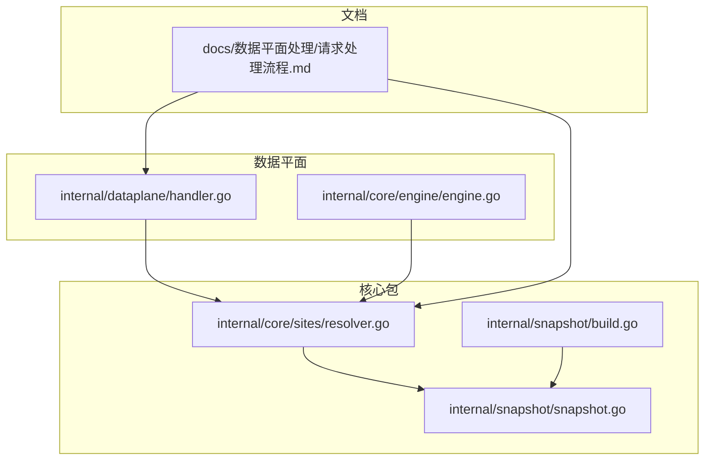
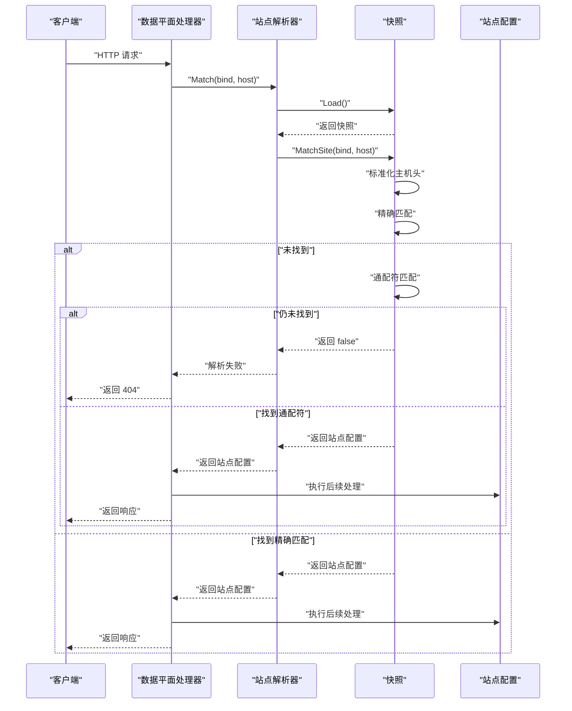
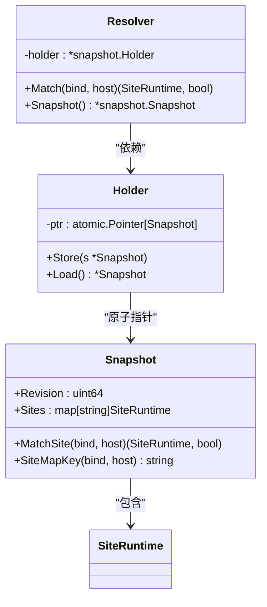
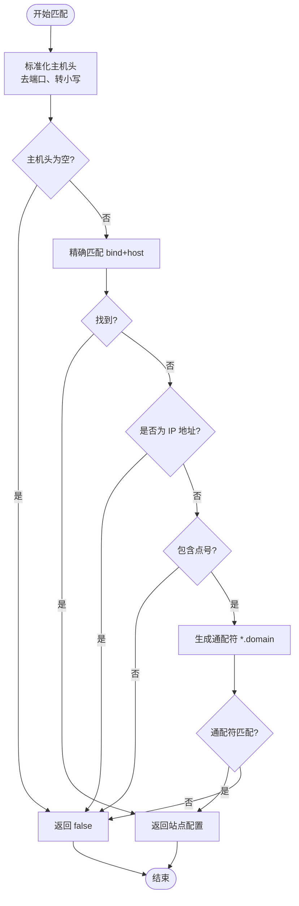
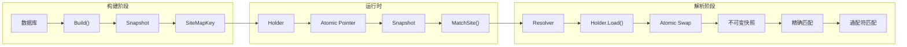
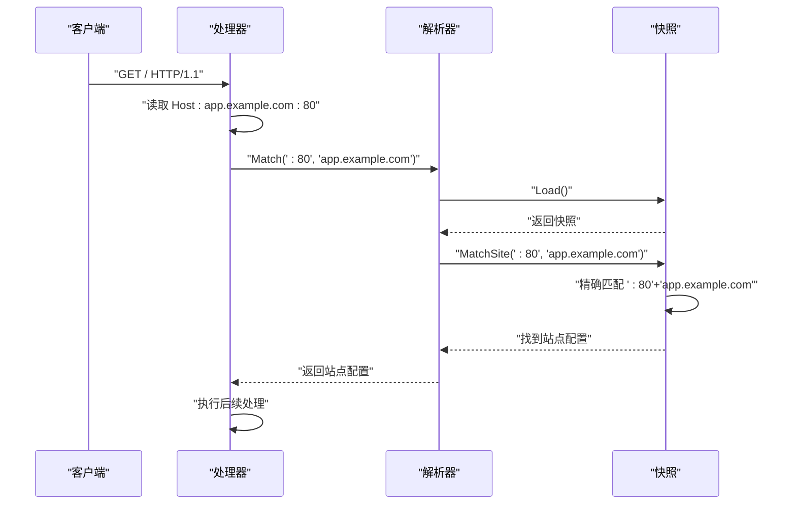
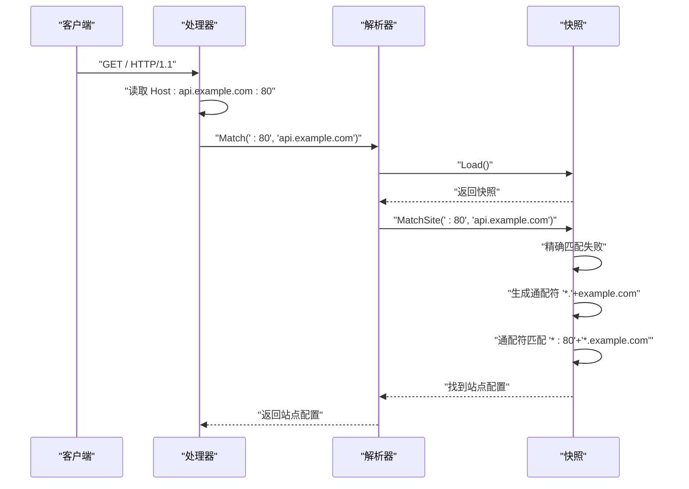
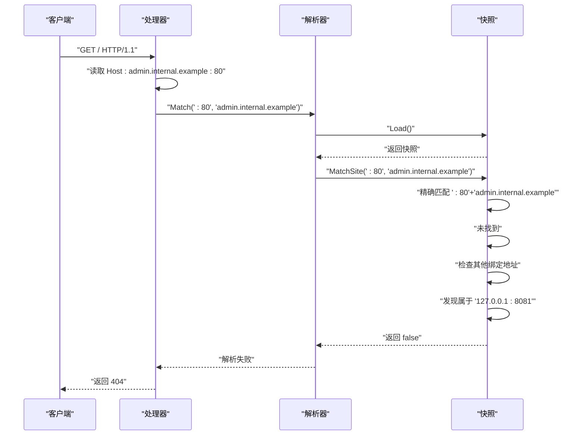
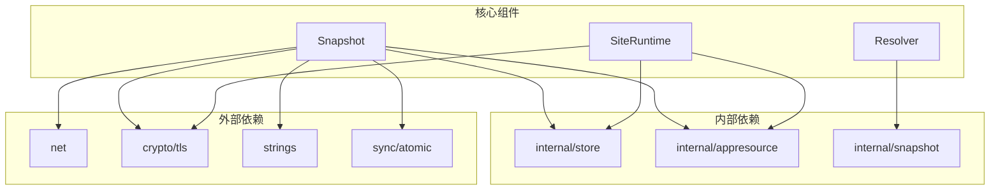

# 站点解析器

<cite>
**本文引用的文件**
- [resolver.go](file://internal/core/sites/resolver.go)
- [snapshot.go](file://internal/snapshot/snapshot.go)
- [build.go](file://internal/snapshot/build.go)
- [snapshot_test.go](file://internal/snapshot/snapshot_test.go)
- [handler.go](file://internal/dataplane/handler.go)
- [engine.go](file://internal/core/engine/engine.go)
- [请求处理流程.md](file://docs/数据平面处理/请求处理流程.md)
</cite>

## 目录
1. [简介](#简介)
2. [项目结构](#项目结构)
3. [核心组件](#核心组件)
4. [架构总览](#架构总览)
5. [详细组件分析](#详细组件分析)
6. [依赖分析](#依赖分析)
7. [性能考虑](#性能考虑)
8. [故障排查指南](#故障排查指南)
9. [结论](#结论)

## 简介
本文档深入解析 My-OpenWaf 的站点解析器实现，涵盖 Resolver 结构体设计、MatchSite 方法工作机制、绑定地址与主机头匹配策略、通配符与精确匹配优先级、多站点场景处理与域名冲突解决、与快照系统的集成方式以及解析结果的实时性保证。同时提供完整的站点解析流程示例，包括各种匹配场景的处理，并给出性能优化建议与故障排查指南。

## 项目结构
站点解析器位于 internal/core/sites 包中，核心实现围绕 Snapshot 和 Resolver 两个关键组件展开：
- Resolver：对外暴露的站点解析接口，基于快照持有者进行解析
- Snapshot：不可变的快照视图，包含站点映射表和匹配逻辑
- 快照构建：在 internal/snapshot/build.go 中完成，将数据库中的站点配置转换为可快速匹配的映射表

**图表来源**
- [resolver.go:1-32](file://internal/core/sites/resolver.go#L1-L32)
- [snapshot.go:1-152](file://internal/snapshot/snapshot.go#L1-L152)
- [build.go:17-210](file://internal/snapshot/build.go#L17-L210)
- [handler.go:69-118](file://internal/dataplane/handler.go#L69-L118)
- [engine.go:37-74](file://internal/core/engine/engine.go#L37-L74)

**章节来源**
- [resolver.go:1-32](file://internal/core/sites/resolver.go#L1-L32)
- [snapshot.go:1-152](file://internal/snapshot/snapshot.go#L1-L152)
- [build.go:17-210](file://internal/snapshot/build.go#L17-L210)
- [handler.go:69-118](file://internal/dataplane/handler.go#L69-L118)
- [engine.go:37-74](file://internal/core/engine/engine.go#L37-L74)

## 核心组件
站点解析器由以下核心组件构成：

### Resolver 结构体
- **职责**：提供站点解析接口，基于快照持有者进行解析
- **关键字段**：holder *snapshot.Holder
- **核心方法**：
  - Match(bind, host)：根据绑定地址和主机头查找站点配置
  - Snapshot()：返回当前快照

### Snapshot 结构体
- **职责**：不可变的快照视图，包含站点映射表和匹配逻辑
- **关键字段**：
  - Sites map[string]SiteRuntime：站点映射表
  - Revision uint64：版本号
  - Protection store.ProtectionConfig：全局保护配置
- **核心方法**：
  - MatchSite(bind, hostHeader)：主要匹配逻辑
  - SiteMapKey(bind, host)：生成映射键
  - NormalizeMatchHost(host)：标准化主机头

### SiteRuntime 结构体
- **职责**：站点运行时配置，包含绑定地址、证书、规则等
- **关键字段**：Site、Bind、TLSConfig、Rules、UpstreamURLs 等

**章节来源**
- [resolver.go:7-31](file://internal/core/sites/resolver.go#L7-L31)
- [snapshot.go:25-84](file://internal/snapshot/snapshot.go#L25-L84)
- [snapshot.go:94-118](file://internal/snapshot/snapshot.go#L94-L118)

## 架构总览
站点解析器采用"快照驱动 + 原子切换"的设计模式：

**图表来源**
- [resolver.go:18-26](file://internal/core/sites/resolver.go#L18-L26)
- [snapshot.go:94-118](file://internal/snapshot/snapshot.go#L94-L118)
- [handler.go:109-118](file://internal/dataplane/handler.go#L109-L118)

## 详细组件分析

### Resolver 结构体设计
Resolver 采用最小化设计，专注于解析职责：

**图表来源**
- [resolver.go:7-16](file://internal/core/sites/resolver.go#L7-L16)
- [snapshot.go:145-152](file://internal/snapshot/snapshot.go#L145-L152)

#### Match 方法工作机制
Match 方法实现了"精确匹配优先，通配符次之"的解析策略：

1. **加载快照**：从 Holder 中原子加载当前快照
2. **空快照检查**：如果快照为空，返回 false
3. **委托匹配**：将具体匹配逻辑委托给 Snapshot.MatchSite

**章节来源**
- [resolver.go:18-26](file://internal/core/sites/resolver.go#L18-L26)

### Snapshot.MatchSite 匹配算法
MatchSite 实现了完整的站点匹配逻辑：

**图表来源**
- [snapshot.go:94-118](file://internal/snapshot/snapshot.go#L94-L118)

#### 匹配优先级规则
1. **精确匹配**：优先匹配完全相同的 bind+host 组合
2. **通配符匹配**：对非 IP 地址尝试通配符匹配（如 *.example.com）
3. **域名冲突处理**：同一绑定地址下，通配符规则优先于精确规则

**章节来源**
- [snapshot.go:94-118](file://internal/snapshot/snapshot.go#L94-L118)
- [snapshot_test.go:20-50](file://internal/snapshot/snapshot_test.go#L20-L50)

### 多站点场景处理
系统支持复杂的多站点场景：

#### 多绑定地址场景
- 每个站点可以配置多个监听器（不同的绑定地址）
- 快照构建时为每个绑定地址生成独立的站点条目
- 匹配时严格限定在同一绑定地址范围内

#### 多主机头场景
- 单个站点可配置多个主机头（逗号分隔）
- 快照构建时为每个主机头生成独立映射键
- 支持混合精确匹配和通配符匹配

#### 域名冲突解决
- 同一绑定地址下，精确匹配优先于通配符匹配
- 注册时保留第一个出现的站点配置，忽略重复项
- 通过 SiteMapKey(bind, host) 确保键的唯一性和一致性

**章节来源**
- [build.go:258-271](file://internal/snapshot/build.go#L258-L271)
- [snapshot_test.go:102-131](file://internal/snapshot/snapshot_test.go#L102-L131)
- [snapshot_test.go:52-64](file://internal/snapshot/snapshot_test.go#L52-L64)

### 与快照系统的集成
站点解析器与快照系统采用"原子指针 + 不可变快照"的设计：

**图表来源**
- [build.go:17-210](file://internal/snapshot/build.go#L17-L210)
- [snapshot.go:145-152](file://internal/snapshot/snapshot.go#L145-L152)
- [resolver.go:28-31](file://internal/core/sites/resolver.go#L28-L31)

#### 实时性保证机制
- **原子切换**：通过 atomic.Pointer 实现快照的原子替换
- **零拷贝读取**：读取操作无需加锁，保证高并发性能
- **不可变性**：快照一旦创建就不能修改，确保解析一致性

**章节来源**
- [snapshot.go:145-152](file://internal/snapshot/snapshot.go#L145-L152)
- [resolver.go:28-31](file://internal/core/sites/resolver.go#L28-L31)

### 完整解析流程示例

#### 场景一：精确匹配成功

#### 场景二：通配符匹配成功

#### 场景三：跨绑定地址匹配失败

**图表来源**
- [snapshot_test.go:20-50](file://internal/snapshot/snapshot_test.go#L20-L50)
- [snapshot_test.go:52-64](file://internal/snapshot/snapshot_test.go#L52-L64)
- [snapshot_test.go:133-150](file://internal/snapshot/snapshot_test.go#L133-L150)

**章节来源**
- [snapshot_test.go:20-50](file://internal/snapshot/snapshot_test.go#L20-L50)
- [snapshot_test.go:52-64](file://internal/snapshot/snapshot_test.go#L52-L64)
- [snapshot_test.go:133-150](file://internal/snapshot/snapshot_test.go#L133-L150)

## 依赖分析
站点解析器的依赖关系清晰且内聚：

**图表来源**
- [resolver.go:3-5](file://internal/core/sites/resolver.go#L3-L5)
- [snapshot.go:3-11](file://internal/snapshot/snapshot.go#L3-L11)

### 组件耦合度
- **低耦合**：Resolver 仅依赖 snapshot.Holder 接口
- **高内聚**：匹配逻辑集中在 Snapshot 中，职责单一
- **无循环依赖**：依赖方向清晰，从数据平面到核心解析器

**章节来源**
- [resolver.go:3-5](file://internal/core/sites/resolver.go#L3-L5)
- [snapshot.go:3-11](file://internal/snapshot/snapshot.go#L3-L11)

## 性能考虑
站点解析器在设计时充分考虑了性能优化：

### 时间复杂度
- **精确匹配**：O(1) 哈希表查找
- **通配符匹配**：O(1) 哈希表查找 + 字符串操作 O(n)
- **整体复杂度**：O(1)，与站点数量无关

### 内存优化
- **不可变快照**：避免频繁分配新对象
- **原子指针**：零拷贝读取，写时复制
- **字符串池化**：通过 SiteMapKey 复用字符串

### 并发安全性
- **原子加载**：Holder.Load() 无锁读取
- **只读快照**：解析过程不修改任何状态
- **线程安全**：支持高并发请求处理

**章节来源**
- [resolver.go:28-31](file://internal/core/sites/resolver.go#L28-L31)
- [snapshot.go:145-152](file://internal/snapshot/snapshot.go#L145-L152)

## 故障排查指南

### 常见问题诊断

#### 问题：站点无法匹配
**现象**：返回 "unknown virtual host" 或 404
**排查步骤**：
1. 检查快照中是否存在对应的 SiteMapKey
2. 验证主机头是否包含端口号
3. 确认绑定地址是否正确
4. 查看通配符规则是否覆盖

#### 问题：通配符匹配异常
**现象**：期望的通配符规则未生效
**排查步骤**：
1. 检查通配符格式是否正确（*.example.com）
2. 验证域名层级是否匹配
3. 确认精确匹配优先级
4. 查看快照构建时的主机头标准化

#### 问题：跨绑定地址误匹配
**现象**：请求被错误地路由到其他绑定地址
**排查步骤**：
1. 检查绑定地址配置
2. 验证 SiteMapKey 的生成逻辑
3. 确认匹配范围限制
4. 查看快照构建时的绑定地址处理

#### 问题：域名冲突处理不当
**现象**：多个相同主机头的站点配置冲突
**排查步骤**：
1. 检查重复站点注册逻辑
2. 验证 first-come-first-served 策略
3. 确认 SiteMapKey 的唯一性
4. 查看测试用例中的冲突处理

**章节来源**
- [snapshot_test.go:20-50](file://internal/snapshot/snapshot_test.go#L20-L50)
- [snapshot_test.go:52-64](file://internal/snapshot/snapshot_test.go#L52-L64)
- [snapshot_test.go:102-131](file://internal/snapshot/snapshot_test.go#L102-L131)

### 性能监控建议
- **解析延迟**：监控 Match 方法的平均耗时
- **命中率**：统计精确匹配 vs 通配符匹配的比例
- **内存使用**：跟踪快照对象的内存占用
- **并发性能**：测试高并发场景下的吞吐量

### 最佳实践
1. **合理配置主机头**：避免过多的通配符规则
2. **明确绑定地址**：确保每个站点的绑定地址唯一
3. **定期验证**：通过单元测试验证匹配逻辑
4. **监控告警**：设置站点匹配失败的告警机制

## 结论
My-OpenWaf 的站点解析器通过"快照驱动 + 原子切换"的设计，在保证解析准确性的同时实现了卓越的性能表现。其简洁的 API 设计、严格的匹配优先级规则、完善的多站点场景支持，以及与快照系统的深度集成，共同构成了一个高效可靠的站点解析解决方案。通过合理的配置和监控，系统能够在复杂的生产环境中稳定运行，为用户提供可靠的虚拟主机解析服务。