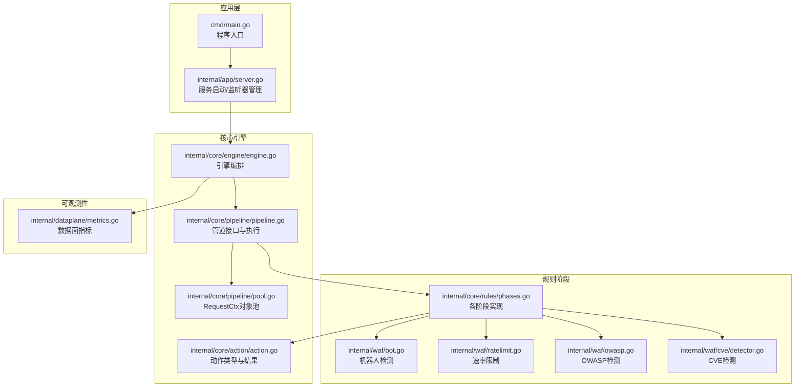
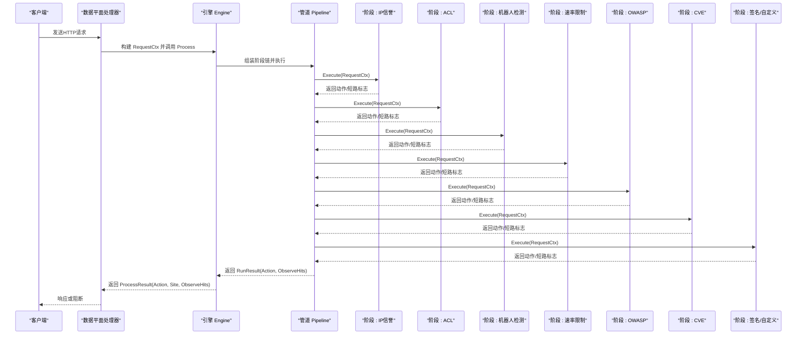
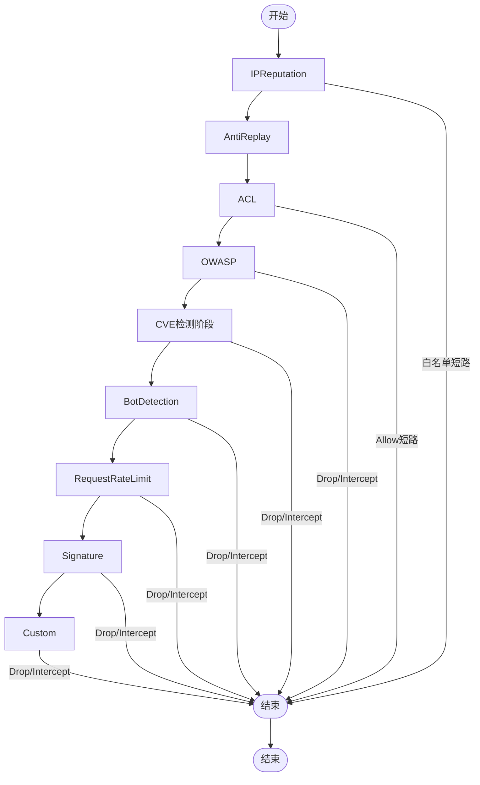
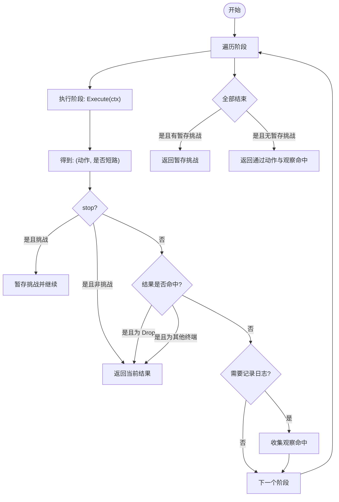
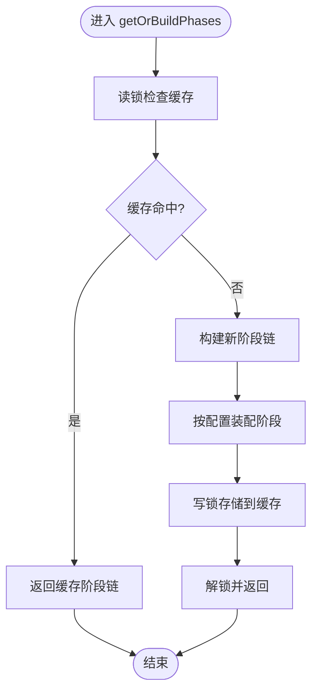
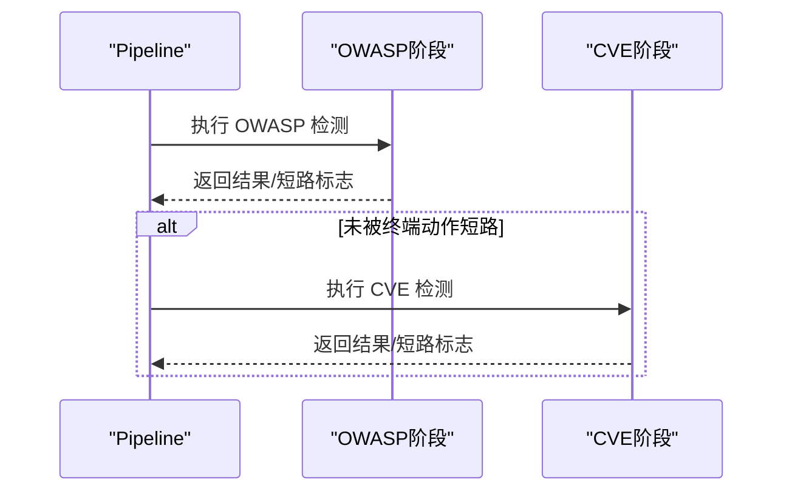
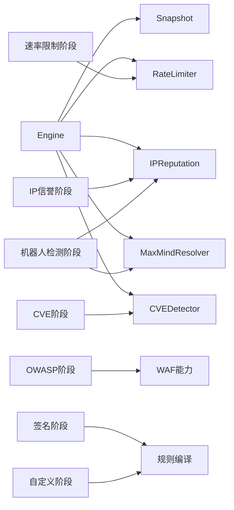

# 管道执行机制

> [返回 WAF 引擎系统](../WAF 引擎系统.md)

<cite>
**本文引用的文件**
- [pipeline.go](file://internal/core/pipeline/pipeline.go)
- [pool.go](file://internal/core/pipeline/pool.go)
- [phases.go](file://internal/core/rules/phases.go)
- [engine.go](file://internal/core/engine/engine.go)
- [metrics.go](file://internal/dataplane/metrics.go)
- [执行阶段系统.md](file://docs/扩展与插件/规则引擎扩展/执行阶段系统.md)
- [处理阶段详解.md](file://docs/WAF 引擎系统/规则管道设计/处理阶段详解.md)
</cite>

## 目录
1. [简介](#简介)
2. [项目结构](#项目结构)
3. [核心组件](#核心组件)
4. [架构总览](#架构总览)
5. [详细组件分析](#详细组件分析)
6. [依赖分析](#依赖分析)
7. [性能考虑](#性能考虑)
8. [故障排查指南](#故障排查指南)
9. [结论](#结论)
10. [附录：代码示例与最佳实践](#附录代码示例与最佳实践)

## 简介
本文档系统性阐述 My-OpenWaf 的管道执行机制，围绕 Phase 接口、Run 函数、阶段链执行顺序、并行执行策略、短路机制与缓存失效机制进行深入解析。文档同时提供性能监控与调试技巧，帮助开发者理解并优化 WAF 请求处理流水线。

## 项目结构
My-OpenWaf 的管道执行机制由以下模块协同实现：
- 核心管道与上下文：pipeline 包定义 RequestCtx 和 Phase 接口，以及 Pipeline 的顺序执行逻辑。
- 规则阶段实现：rules 包中的具体阶段（ACL、签名、自定义、速率限制、IP信誉、机器人检测、OWASP、CVE）。
- 引擎编排：engine 包根据快照配置动态组装阶段链，并驱动 Pipeline 执行。
- 对象池：pipeline/pool.go 使用 sync.Pool 复用 RequestCtx，降低 GC 压力。
- 可观测性：dataplane/metrics.go 提供数据面指标聚合，辅助性能监控与调试。

**图表来源**
- [engine.go:15-176](file://internal/core/engine/engine.go#L15-L176)
- [pipeline.go:9-71](file://internal/core/pipeline/pipeline.go#L9-L71)
- [pool.go:1-37](file://internal/core/pipeline/pool.go#L1-L37)
- [phases.go:32-358](file://internal/core/rules/phases.go#L32-L358)
- [metrics.go:107-135](file://internal/dataplane/metrics.go#L107-L135)

**章节来源**
- [engine.go:57-129](file://internal/core/engine/engine.go#L57-L129)
- [pipeline.go:9-71](file://internal/core/pipeline/pipeline.go#L9-L71)
- [phases.go:32-358](file://internal/core/rules/phases.go#L32-L358)
- [pool.go:5-37](file://internal/core/pipeline/pool.go#L5-L37)
- [metrics.go:107-135](file://internal/dataplane/metrics.go#L107-L135)

## 核心组件
- RequestCtx：承载一次请求的全部解码后数据（如客户端IP、方法、路径、查询串、头、主体、内容类型、解析后的查询参数），作为阶段间唯一上下文载体。
- Phase 接口：每个阶段实现统一的 Name() 与 Execute(ctx) 方法，返回动作结果与是否短路标志。
- Pipeline：按顺序执行各阶段，支持 Drop 最高优先级短路、Intercept 短路、以及收集 Observe 命中用于日志。
- Action：定义 Allow/Intercept/Observe/Drop 等动作类型，提供 IsTerminal/IsDrop/ShouldLog 等判定方法。
- 引擎 Engine：依据快照配置动态组装阶段链，调用 Pipeline 执行并返回最终动作与观察命中列表。
- 对象池：pipeline/pool.go 使用 sync.Pool 复用 RequestCtx，降低 GC 压力。

**章节来源**
- [pipeline.go:9-71](file://internal/core/pipeline/pipeline.go#L9-L71)
- [action.go:29-61](file://internal/core/action/action.go#L29-L61)
- [phases.go:32-358](file://internal/core/rules/phases.go#L32-L358)
- [engine.go:57-129](file://internal/core/engine/engine.go#L57-L129)
- [pool.go:5-37](file://internal/core/pipeline/pool.go#L5-L37)

## 架构总览
执行阶段系统采用“阶段链”模式，引擎根据站点与全局保护配置动态构建阶段序列，Pipeline 依次执行并遵循严格的优先级短路策略。阶段间通过 RequestCtx 共享数据，同时通过动作结果携带阶段信息与分类，便于审计与可视化。

**图表来源**
- [engine.go:85-120](file://internal/core/engine/engine.go#L85-L120)
- [pipeline.go:46-70](file://internal/core/pipeline/pipeline.go#L46-L70)
- [phases.go:32-358](file://internal/core/rules/phases.go#L32-L358)

**章节来源**
- [engine.go:85-120](file://internal/core/engine/engine.go#L85-L120)
- [pipeline.go:46-70](file://internal/core/pipeline/pipeline.go#L46-L70)
- [phases.go:32-358](file://internal/core/rules/phases.go#L32-L358)

## 详细组件分析

### Phase 接口与执行顺序
- 阶段接口：Phase 定义 Name() 与 Execute(ctx) 两个方法，返回 (action.Result, bool)，其中 bool 表示是否短路。
- 执行顺序：引擎严格按以下顺序组装并执行阶段链（以快照配置为准）：
  1) IPReputation（白名单可直接短路）
  2) AntiReplay
  3) ACL（允许规则可跳过 ACL 之后的后续阶段）
  4) OWASP 默认规则
  5) CVE 检测
  6) BotDetection
  7) RequestRateLimit
  8) Signature
  9) Custom
- 优先级短路：Drop 最高优先级（立即 TCP 关闭，不发送响应）；Intercept 次之（立即阻断）；Observe 仅记录日志，不阻断。

**图表来源**
- [engine.go:85-120](file://internal/core/engine/engine.go#L85-L120)
- [pipeline.go:46-70](file://internal/core/pipeline/pipeline.go#L46-L70)
- [action.go:40-57](file://internal/core/action/action.go#L40-L57)

**章节来源**
- [engine.go:85-120](file://internal/core/engine/engine.go#L85-L120)
- [pipeline.go:46-70](file://internal/core/pipeline/pipeline.go#L46-L70)
- [action.go:40-57](file://internal/core/action/action.go#L40-L57)

### Run 函数工作机制
Run 函数负责顺序遍历阶段，每个阶段返回 (动作, 是否短路)。当阶段返回 `stop=true` 时，若结果不是挑战动作则立即返回该结果；挑战动作会被暂存并继续执行后续阶段，最终由更高优先级挑战或当前暂存挑战决定返回值。观察命中：仅当动作需要记录日志时收集，便于审计与告警。

**图表来源**
- [pipeline.go:46-65](file://internal/core/pipeline/pipeline.go#L46-L65)
- [action.go:39-49](file://internal/core/action/action.go#L39-L49)

**章节来源**
- [pipeline.go:46-65](file://internal/core/pipeline/pipeline.go#L46-L65)
- [action.go:39-49](file://internal/core/action/action.go#L39-L49)

### getOrBuildPhases 方法与阶段链构建
getOrBuildPhases 方法返回一个缓存的阶段链或构建一个新的阶段链。该方法以 (snapshotRevision, policyID) 为键，确保当快照指针或有效保护配置未改变时，缓存的阶段链保持有效。

- 缓存键：snapshotRevision 与 policyID 组合，确保快照变更时缓存失效。
- 阶段装配：根据配置动态组装阶段链，预分配容量以减少扩容开销。
- 缓存失效：当快照修订号变化时，清空旧缓存并更新修订号。

**图表来源**
- [engine.go:139-198](file://internal/core/engine/engine.go#L139-L198)

**章节来源**
- [engine.go:139-198](file://internal/core/engine/engine.go#L139-L198)

### phasesCache 失效机制
phasesCache 的失效机制基于快照修订号（snapshotRevision）与策略 ID（policyID）。当快照修订号发生变化时，引擎会清空 phasesCache 并更新修订号，确保阶段链的正确性与一致性。

- 失效触发：快照修订号变化。
- 清空策略：重建 phasesCache 并更新修订号。
- 有效性：阶段链的有效性取决于快照指针与保护配置指针的相等性。

**章节来源**
- [engine.go:139-198](file://internal/core/engine/engine.go#L139-L198)

### OWASP 与 CVE 执行关系
当前引擎将 OWASP 与 CVE 追加为两个独立的有序阶段：OWASP 先执行，CVE 后执行。两者都受保护配置控制，关闭对应配置或缺少检测器时不会进入阶段链。

**图表来源**
- [engine.go:208-241](file://internal/core/engine/engine.go#L208-L241)

**章节来源**
- [engine.go:208-241](file://internal/core/engine/engine.go#L208-L241)

### 阶段间的短路机制与早期退出
短路机制遵循严格的优先级：Drop 最高优先级（立即 TCP 关闭，不发送响应）；Intercept 次之（立即阻断）；Observe 仅记录日志，不阻断。Allow 动作在 ACL 阶段命中时可跳过 ACL 之后的后续阶段，提高吞吐。

- Drop/Intercept 立即短路，避免无效计算。
- ACL Allow 跳过 ACL 之后的后续阶段，减少规则匹配成本。
- Challenge 动作延迟处理：管道继续执行后续阶段，若更高优先级的终端动作出现则覆盖挑战。

**章节来源**
- [pipeline.go:78-118](file://internal/core/pipeline/pipeline.go#L78-L118)
- [action.go:40-57](file://internal/core/action/action.go#L40-L57)

### RequestCtx 对象池与内存优化
RequestCtx 对象池通过 sync.Pool 复用 RequestCtx，减少分配与 GC 压力。AcquireCtx 从池中获取，ReleaseCtx 在归还前清理字段。

- 复用策略：预分配 HeaderMap 与 HeaderKeys，减少扩容开销。
- 清理策略：归还前清空所有字段，避免内存泄漏。
- 性能收益：显著降低 GC 压力，提升高频路径性能。

**章节来源**
- [pool.go:5-37](file://internal/core/pipeline/pool.go#L5-L37)

## 依赖分析
- 组件耦合：
  - Engine 依赖 Snapshot、RateLimiter、IPReputation、GeoResolver、CVEDetector 等外部能力。
  - 各阶段实现依赖 waf 能力（机器人检测、速率限制、指纹评分等）。
  - Pipeline 与 Action 解耦，仅依赖接口契约。
- 外部依赖：
  - Hertz 服务器、Redis（配置同步）、数据库（存储与迁移）。
- 循环依赖：
  - 未发现循环导入；各包职责清晰，接口边界明确。

**图表来源**
- [engine.go:15-37](file://internal/core/engine/engine.go#L15-L37)
- [phases.go:96-358](file://internal/core/rules/phases.go#L96-L358)

**章节来源**
- [engine.go:15-37](file://internal/core/engine/engine.go#L15-L37)
- [phases.go:96-358](file://internal/core/rules/phases.go#L96-L358)

## 性能考虑
- 对象池：RequestCtx 使用 sync.Pool 复用，显著降低 GC 压力，建议在高频路径保持复用。
- 短路策略：Drop/Intercept 立即短路，避免无效计算；ACL Allow 跳过 ACL 之后的后续阶段，减少规则匹配成本。
- 正则与扫描：Body 解析与正则扫描存在复杂度风险，已通过采样大小限制与字段数量上限控制（例如 JSON/表单解析的深度与数量限制）。
- 速率限制：固定窗口计数，配合后台清理 goroutine 清理过期窗口，避免内存无限增长。
- 指纹评分：两阶段设计（预筛选→深度评分）在保证准确率的同时降低深度评分的触发频率。

**章节来源**
- [pool.go:5-37](file://internal/core/pipeline/pool.go#L5-L37)
- [pipeline.go:46-70](file://internal/core/pipeline/pipeline.go#L46-L70)
- [phases.go:360-405](file://internal/core/rules/phases.go#L360-L405)
- [ratelimit.go:98-116](file://internal/waf/ratelimit.go#L98-L116)
- [bot.go:126-161](file://internal/waf/bot.go#L126-L161)

## 故障排查指南
- 指标与日志：
  - Prometheus 指标：RequestsTotal、BlocksTotal、ObservesTotal、BuiltinHits、CacheHits/Misses、UpstreamErrors、Uptime、Goroutines、MemoryAlloc/Sys、GC Pause。
  - 安全事件：EventWriter 异步批量写入，缓冲满时会丢弃并告警。
- 数据面指标：汇总 QPS、状态码分布、WAF 命中、唯一IP与攻击IP等。
- 常见问题定位：
  - 高 Drop/Intercept：检查 ACL 白名单/黑名单、机器人检测阈值、OWASP/CVE 规则。
  - 高 Observe：确认日志策略与阈值设置，关注指纹评分与 GeoIP 风险标记。
  - 内存上升：检查 RequestCtx 泄漏（未释放）、EventWriter 缓冲积压、GC Pause 增长。
  - 性能瓶颈：CPU 高占用多出现在指纹评分与正则扫描，建议优化规则复杂度与采样范围。

**章节来源**
- [metrics.go:107-135](file://internal/dataplane/metrics.go#L107-L135)

## 结论
执行阶段系统通过清晰的阶段划分、严格的优先级短路与可插拔的阶段实现，实现了高性能、可观测且易于扩展的 WAF 处理流水线。借助对象池、两阶段机器人检测、固定窗口速率限制与完善的指标体系，系统在保障安全性的前提下兼顾了吞吐与稳定性。建议在生产环境中持续监控关键指标，结合规则与阈值调优，以获得最佳的防护效果与性能表现。

## 附录：代码示例与最佳实践
以下为管道初始化、阶段添加与执行过程的具体示例路径，便于开发者快速上手与扩展：

- 初始化与阶段装配
  - 引擎初始化与阶段装配：[engine.go:139-198](file://internal/core/engine/engine.go#L139-L198)
  - 阶段注册与顺序：[engine.go:168-187](file://internal/core/engine/engine.go#L168-L187)

- 管道执行与短路
  - Run 函数实现：[pipeline.go:78-118](file://internal/core/pipeline/pipeline.go#L78-L118)
  - 短路与挑战处理：[pipeline.go:84-112](file://internal/core/pipeline/pipeline.go#L84-L112)

- OWASP 与 CVE 有序执行
  - 阶段装配：[engine.go:208-241](file://internal/core/engine/engine.go#L208-L241)

- 缓存与失效
  - getOrBuildPhases 缓存机制：[engine.go:139-198](file://internal/core/engine/engine.go#L139-L198)
  - phasesCache 失效策略：[engine.go:189-195](file://internal/core/engine/engine.go#L189-L195)

- 性能监控与调试
  - 数据面指标聚合：[metrics.go:107-135](file://internal/dataplane/metrics.go#L107-L135)
  - RequestCtx 对象池：[pool.go:5-37](file://internal/core/pipeline/pool.go#L5-L37)

最佳实践建议：
- 在阶段内部实现快速短路与早停，减少无效计算。
- 对外部依赖（如数据库/远程服务）做好降级与超时控制。
- 为新阶段设置清晰的 Phase 名称与 MatchDesc，便于日志与事件追踪。
- 对关键路径增加指标埋点，关注延迟分布与错误率。
- 使用对象池复用 RequestCtx，避免频繁分配与 GC 压力。

**章节来源**
- [engine.go:139-198](file://internal/core/engine/engine.go#L139-L198)
- [pipeline.go:78-118](file://internal/core/pipeline/pipeline.go#L78-L118)
- [phases.go:852-953](file://internal/core/rules/phases.go#L852-L953)
- [metrics.go:107-135](file://internal/dataplane/metrics.go#L107-L135)
- [pool.go:5-37](file://internal/core/pipeline/pool.go#L5-L37)
