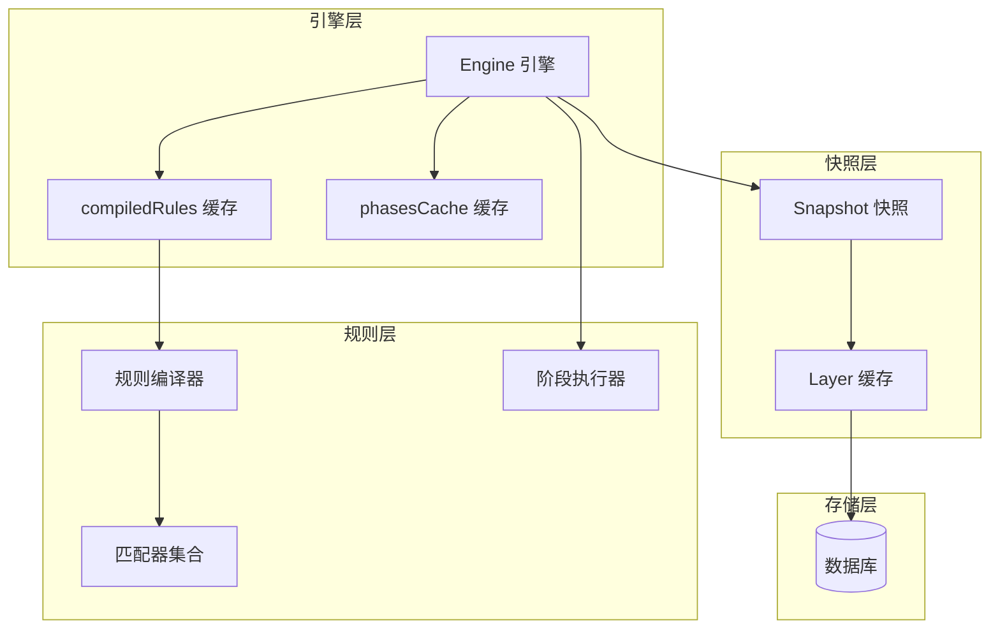
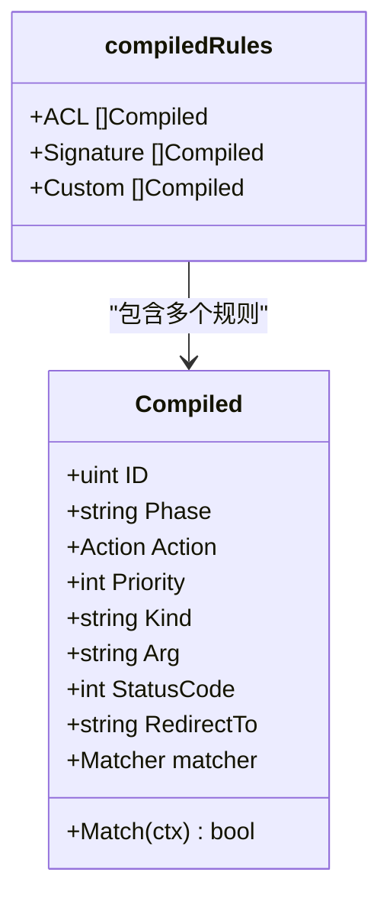
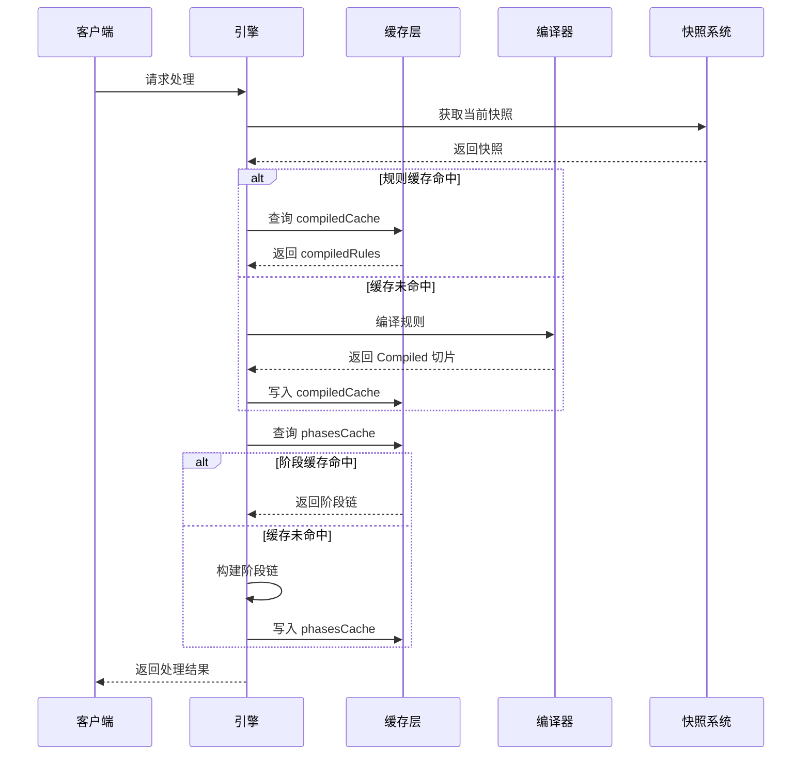
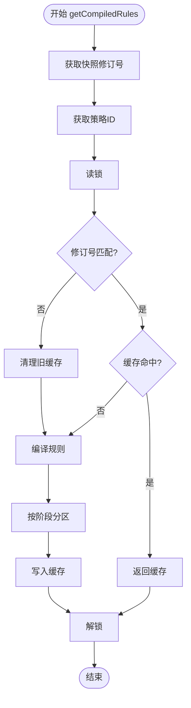
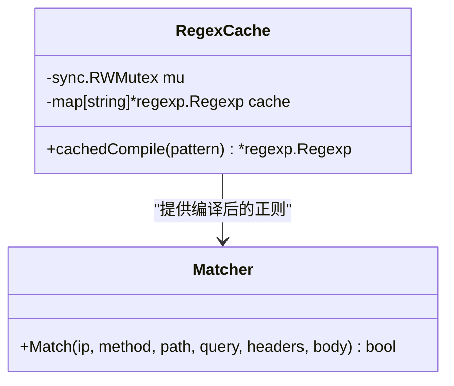
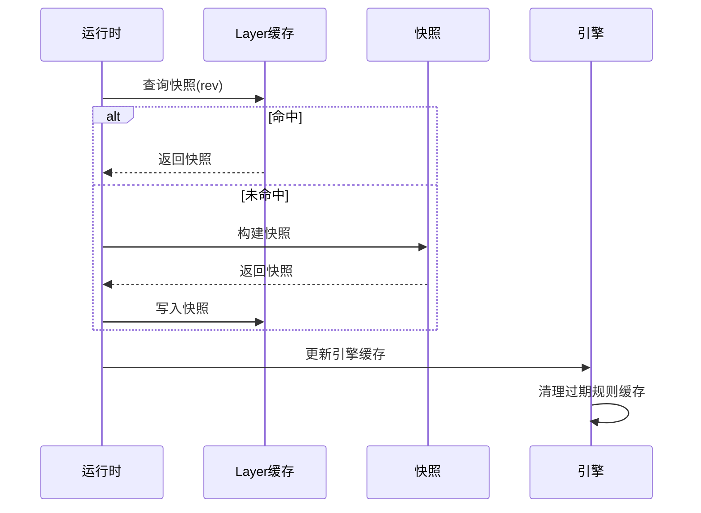
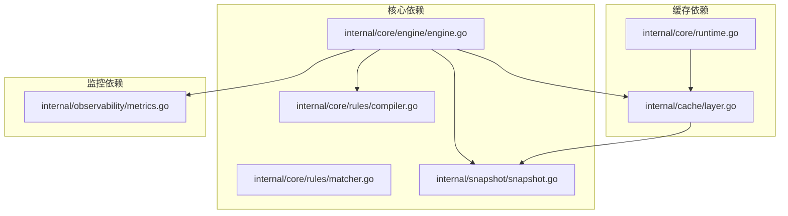

# 规则编译缓存

<cite>
**本文档引用的文件**
- [engine.go](file://internal/core/engine/engine.go)
- [compiler.go](file://internal/core/rules/compiler.go)
- [matcher.go](file://internal/core/rules/matcher.go)
- [phases.go](file://internal/core/rules/phases.go)
- [snapshot.go](file://internal/snapshot/snapshot.go)
- [build.go](file://internal/snapshot/build.go)
- [layer.go](file://internal/cache/layer.go)
- [runtime.go](file://internal/core/runtime.go)
- [metrics.go](file://internal/observability/metrics.go)
- [Ristretto 缓存实现.md](file://docs/缓存与性能优化/Ristretto 缓存实现.md)
- [性能优化策略.md](file://docs/缓存与性能优化/性能优化策略.md)
</cite>

## 目录
1. [简介](#简介)
2. [项目结构](#项目结构)
3. [核心组件](#核心组件)
4. [架构总览](#架构总览)
5. [详细组件分析](#详细组件分析)
6. [依赖分析](#依赖分析)
7. [性能考虑](#性能考虑)
8. [故障排除指南](#故障排除指南)
9. [结论](#结论)
10. [附录](#附录)

## 简介

规则编译缓存是 My-OpenWaf WAF 引擎中的关键性能优化组件，旨在避免重复编译规则带来的昂贵开销。本文档深入解释了规则编译缓存的设计原理和实现机制，包括 `compiledRules` 结构体的组成和 `compiledCache` 的缓存策略，详细说明 `getCompiledRules` 方法的工作原理，包括缓存键的生成、版本检查和缓存失效机制。同时阐述了规则编译的性能优化策略，包括预编译、预分区和缓存复用的实现，并解释了缓存与快照系统的协同工作机制，确保缓存的一致性和有效性。

## 项目结构

规则编译缓存系统位于 WAF 引擎的核心层，与快照系统紧密协作：

**图表来源**
- [engine.go:37-74](file://internal/core/engine/engine.go#L37-L74)
- [compiler.go:29-59](file://internal/core/rules/compiler.go#L29-L59)
- [snapshot.go:72-84](file://internal/snapshot/snapshot.go#L72-L84)

## 核心组件

### compiledRules 结构体

`compiledRules` 是规则编译缓存的核心数据结构，负责存储预编译后的规则：

**图表来源**
- [engine.go:22-27](file://internal/core/engine/engine.go#L22-L27)
- [compiler.go:11-22](file://internal/core/rules/compiler.go#L11-L22)

### 缓存策略设计

系统实现了两级缓存策略：

1. **规则编译缓存** (`compiledCache`): 按快照修订号和策略ID缓存预编译规则
2. **阶段链缓存** (`phasesCache`): 缓存预构建的处理阶段链

**章节来源**
- [engine.go:50-59](file://internal/core/engine/engine.go#L50-L59)
- [engine.go:98-137](file://internal/core/engine/engine.go#L98-L137)

## 架构总览

规则编译缓存的完整工作流程：

**图表来源**
- [engine.go:200-245](file://internal/core/engine/engine.go#L200-L245)
- [engine.go:98-198](file://internal/core/engine/engine.go#L98-L198)

## 详细组件分析

### getCompiledRules 方法实现

`getCompiledRules` 是规则编译缓存的核心方法，实现了智能的缓存管理：

**图表来源**
- [engine.go:98-137](file://internal/core/engine/engine.go#L98-L137)

#### 缓存键生成机制

缓存键采用复合策略：
- **快照修订号**: `sn.Revision` 确保缓存与配置版本绑定
- **策略ID**: `rt.PolicyID` 支持多策略环境下的缓存隔离
- **组合键**: `revision<<32 | policyID` 避免键冲突

#### 版本检查与失效机制

系统通过双重版本检查确保缓存一致性：

1. **修订号检查**: `e.compiledRevision == rev` 验证缓存版本
2. **策略ID检查**: `policyID` 验证策略隔离
3. **自动清理**: 修订号变化时自动清理旧缓存

**章节来源**
- [engine.go:98-137](file://internal/core/engine/engine.go#L98-L137)

### 规则编译器优化

规则编译器实现了多项性能优化：

#### 正则表达式缓存

**图表来源**
- [matcher.go:681-704](file://internal/core/rules/matcher.go#L681-L704)

#### 复合条件优化

复合规则通过 JSON 表达式树进行高效匹配，支持 AND/OR/NOT 组合：

**章节来源**
- [compiler.go:29-59](file://internal/core/rules/compiler.go#L29-L59)
- [matcher.go:679-762](file://internal/core/rules/matcher.go#L679-L762)

### 快照系统协同

快照系统为规则编译缓存提供了可靠的版本控制基础：

**图表来源**
- [runtime.go:82-99](file://internal/core/runtime.go#L82-L99)
- [layer.go:42-59](file://internal/cache/layer.go#L42-L59)

**章节来源**
- [build.go:17-210](file://internal/snapshot/build.go#L17-L210)
- [snapshot.go:72-84](file://internal/snapshot/snapshot.go#L72-L84)

## 依赖分析

规则编译缓存系统的依赖关系：

**图表来源**
- [engine.go:1-308](file://internal/core/engine/engine.go#L1-L308)
- [compiler.go:1-91](file://internal/core/rules/compiler.go#L1-L91)
- [layer.go:1-65](file://internal/cache/layer.go#L1-L65)

**章节来源**
- [engine.go:1-308](file://internal/core/engine/engine.go#L1-L308)
- [layer.go:1-65](file://internal/cache/layer.go#L1-L65)

## 性能考虑

### 缓存性能优化策略

#### 预编译优化

规则在快照构建时就进行预编译，避免每次请求都进行编译开销：

- **编译时机**: 在 `convertAndCompile` 中完成编译
- **预分区**: 按 ACL/Signature/Custom 阶段预先分类
- **匹配器复用**: 预构建的匹配器在运行时直接使用

#### 并发安全设计

系统采用读写锁分离的并发控制：

- **读锁**: `RLock` 用于缓存查询，支持高并发读取
- **写锁**: `Lock` 用于缓存更新，确保数据一致性
- **原子操作**: 使用 `atomic` 包确保修订号更新的原子性

#### 内存优化

- **对象池**: 规则编译器使用对象池减少内存分配
- **缓存淘汰**: 基于 LRU 近似的缓存淘汰策略
- **内存控制**: 通过 `MaxCost` 参数控制缓存内存占用

### 性能监控与调优

#### 关键性能指标

系统提供以下性能监控指标：

- **缓存命中率**: 规则编译缓存命中次数/总查询次数
- **编译时间**: 规则编译耗时统计
- **内存使用**: 缓存内存占用情况
- **并发度**: 并发请求处理能力

#### 调优建议

1. **缓存参数调优**
   - 根据规则数量调整 `NumCounters`
   - 根据快照大小设置合适的 `MaxCost`
   - 优化 `BufferItems` 参数平衡延迟与吞吐

2. **并发优化**
   - 监控读写锁竞争情况
   - 调整缓存清理频率
   - 优化规则分区策略

3. **内存管理**
   - 定期监控缓存内存使用
   - 设置合理的缓存淘汰策略
   - 监控 GC 压力情况

**章节来源**
- [Ristretto 缓存实现.md:344-373](file://docs/缓存与性能优化/Ristretto 缓存实现.md#L344-L373)
- [性能优化策略.md:322-338](file://docs/缓存与性能优化/性能优化策略.md#L322-L338)

## 故障排除指南

### 常见问题诊断

#### 缓存未命中问题

**症状**: 规则编译频繁重新执行，CPU 使用率异常升高

**诊断步骤**:
1. 检查修订号是否正确传递
2. 验证缓存键生成逻辑
3. 确认缓存清理机制正常工作

**解决方案**:
- 确保 `sn.Revision` 正确传递
- 检查 `policyID` 的唯一性
- 调整缓存清理策略

#### 内存泄漏问题

**症状**: 缓存内存持续增长，系统内存不足

**诊断步骤**:
1. 监控 `curSize` 指标
2. 检查缓存条目数量
3. 分析缓存淘汰策略

**解决方案**:
- 调整 `maxSize` 参数
- 优化缓存淘汰策略
- 定期清理过期缓存

#### 并发竞争问题

**症状**: 缓存更新时出现性能抖动

**诊断步骤**:
1. 监控读写锁等待时间
2. 检查缓存更新频率
3. 分析并发访问模式

**解决方案**:
- 优化缓存更新策略
- 调整缓存粒度
- 改进并发控制机制

**章节来源**
- [Ristretto 缓存实现.md:374-396](file://docs/缓存与性能优化/Ristretto 缓存实现.md#L374-L396)

## 结论

规则编译缓存系统通过精心设计的两级缓存策略、智能的版本控制机制和高效的并发控制，在保证数据一致性的同时实现了卓越的性能表现。系统的关键优势包括：

1. **智能缓存管理**: 基于快照修订号和策略ID的复合缓存键设计
2. **高性能编译**: 预编译和预分区策略大幅减少运行时开销
3. **强一致性保证**: 快照系统与缓存系统的协同确保数据一致性
4. **可观测性完善**: 全面的性能监控指标支持持续优化

该系统为高并发 WAF 场景提供了可靠的性能保障，通过合理的参数调优和监控策略，能够适应各种生产环境的需求。

## 附录

### 代码示例路径

#### 规则编译完整流程
- [规则编译器实现:29-59](file://internal/core/rules/compiler.go#L29-L59)
- [规则匹配器构建:498-669](file://internal/core/rules/matcher.go#L498-L669)
- [规则阶段执行:57-155](file://internal/core/rules/phases.go#L57-L155)

#### 缓存管理实现
- [规则编译缓存:98-137](file://internal/core/engine/engine.go#L98-L137)
- [阶段链缓存:139-198](file://internal/core/engine/engine.go#L139-L198)
- [快照缓存实现:42-59](file://internal/cache/layer.go#L42-L59)

#### 性能监控集成
- [缓存命中统计:42-46](file://internal/observability/metrics.go#L42-L46)
- [性能指标导出:51-125](file://internal/observability/metrics.go#L51-125)

### 最佳实践建议

1. **缓存参数配置**
   - 根据规则数量设置 `NumCounters`
   - 监控内存使用情况调整 `MaxCost`
   - 优化 `BufferItems` 参数

2. **监控指标设置**
   - 设置缓存命中率阈值告警
   - 监控编译时间指标
   - 关注内存使用趋势

3. **运维建议**
   - 定期检查缓存清理效果
   - 监控并发访问模式变化
   - 及时调整缓存策略参数