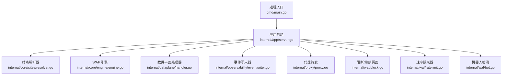
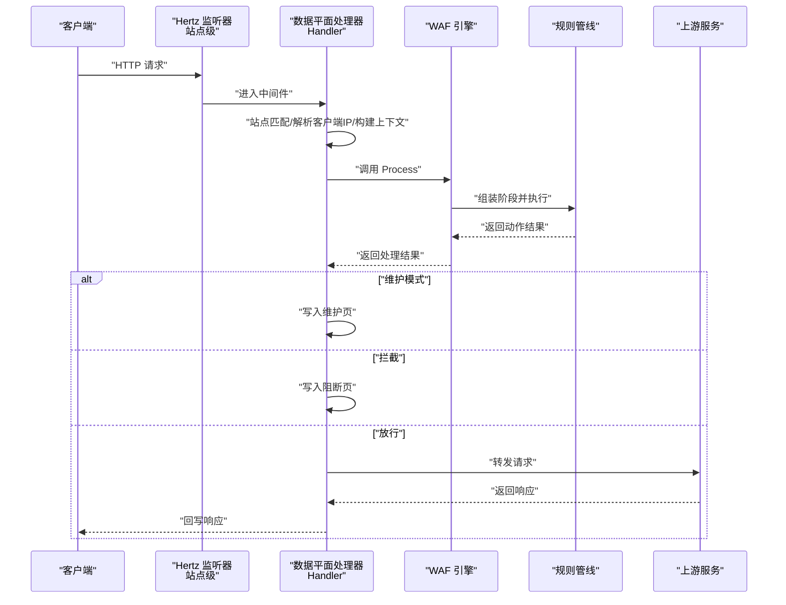
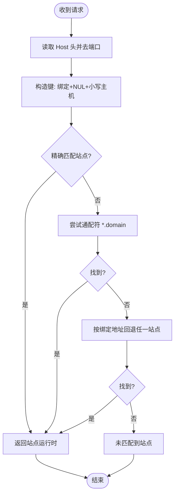
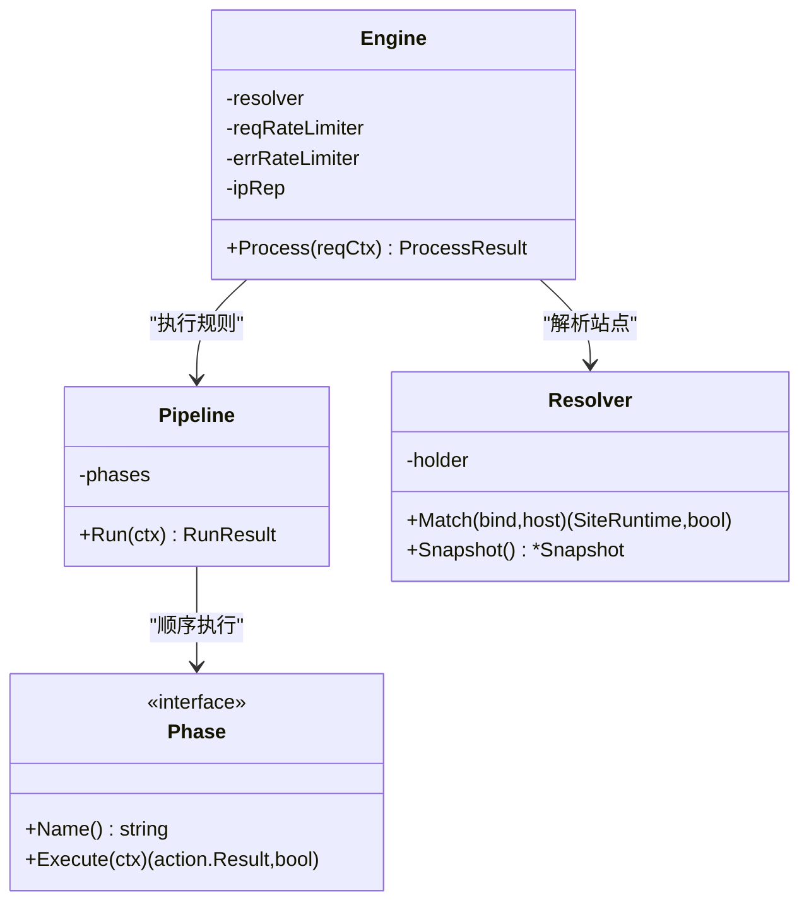
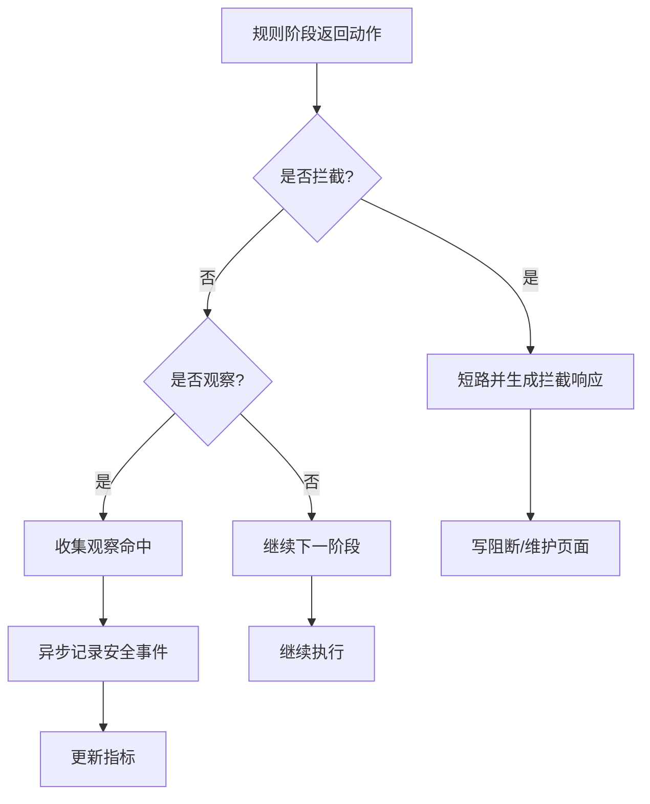
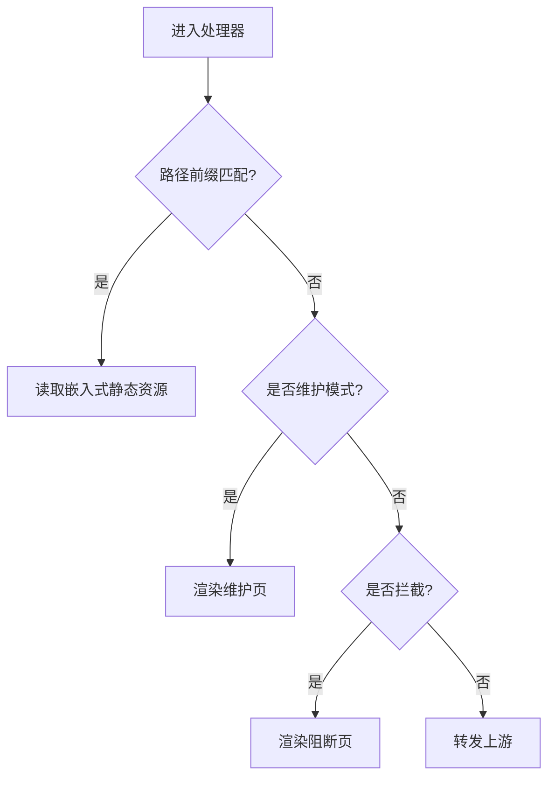
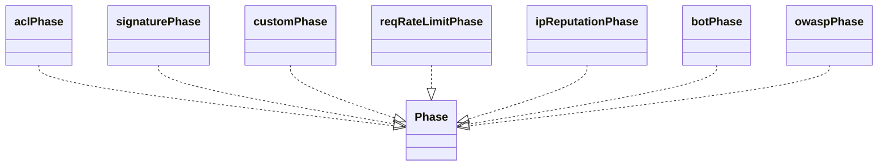
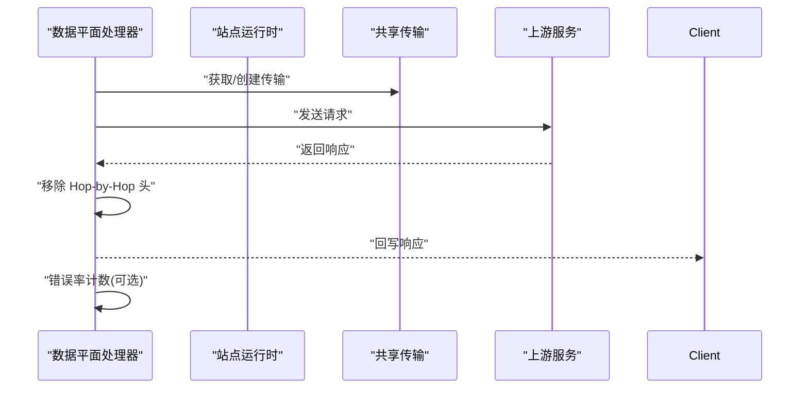
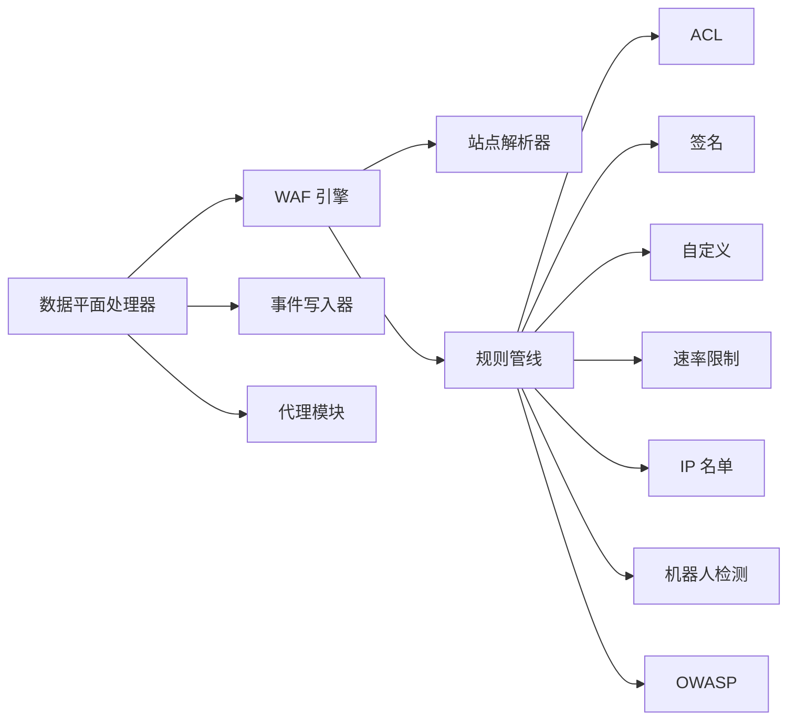

# 请求处理流程

> [返回 WAF 引擎系统](../WAF 引擎系统.md)

<cite>
**本文引用的文件**
- [internal/core/engine/engine.go](file://internal/core/engine/engine.go)
- [internal/core/pipeline/pipeline.go](file://internal/core/pipeline/pipeline.go)
- [internal/core/pipeline/pool.go](file://internal/core/pipeline/pool.go)
- [internal/core/rules/compiler.go](file://internal/core/rules/compiler.go)
- [internal/core/rules/phases.go](file://internal/core/rules/phases.go)
- [internal/core/action/action.go](file://internal/core/action/action.go)
- [internal/snapshot/snapshot.go](file://internal/snapshot/snapshot.go)
- [internal/snapshot/build.go](file://internal/snapshot/build.go)
- [internal/dataplane/handler.go](file://internal/dataplane/handler.go)
- [docs/数据平面处理/请求处理流程.md](file://docs/数据平面处理/请求处理流程.md)
</cite>

## 目录
1. [简介](#简介)
2. [项目结构](#项目结构)
3. [核心组件](#核心组件)
4. [架构总览](#架构总览)
5. [详细组件分析](#详细组件分析)
6. [依赖分析](#依赖分析)
7. [性能考虑](#性能考虑)
8. [故障排查指南](#故障排查指南)
9. [结论](#结论)

## 简介
本文面向请求处理流程，系统性阐述引擎如何处理单个 HTTP 请求的完整生命周期：从站点解析、规则编译到最终动作执行的每个步骤；深入解释 Process 方法的工作原理，包括维护模式检查、站点匹配、规则获取和管道执行的具体实现；阐明 RequestCtx 上下文的作用与传递机制，以及 ProcessResult 结果的构成；提供关键路径的代码示例路径，涵盖错误处理与异常场景；最后总结性能优化策略，如缓存机制与预编译规则的使用。

## 项目结构
My-OpenWaf 的请求处理以“站点级监听 + 中间件处理器 + WAF 引擎 + 规则管线”为核心，配合快照（Snapshot）与规则编译器，形成高吞吐、低延迟的防护链路。数据平面处理器在每个站点监听器上注册统一中间件，完成站点匹配、客户端 IP 解析、请求上下文构建、调用引擎、日志与事件记录、阻断或转发。

图示来源
- [docs/数据平面处理/请求处理流程.md:38-50](file://docs/数据平面处理/请求处理流程.md#L38-L50)

章节来源
- [docs/数据平面处理/请求处理流程.md:32-73](file://docs/数据平面处理/请求处理流程.md#L32-L73)

## 核心组件
- 应用启动与监听管理：负责初始化运行时、加载快照、构建 WAF 引擎、按站点热增删监听器、分发配置变更。
- 数据平面处理器：在每个站点监听器上注册中间件，完成站点匹配、客户端 IP 解析、请求上下文构建、调用引擎、日志与事件记录、阻断或转发。
- WAF 引擎：基于快照解析站点，执行多阶段规则管线，支持维护模式短路、IP 名单、ACL、机器人检测、请求速率限制、OWASP 规则集、签名与自定义规则。
- 规则阶段：各阶段按序执行，遇到拦截即短路，观察命中仅记录不短路。
- 安全事件与指标：异步批量写入安全事件，记录访问、拦截、攻击 IP、内置命中等指标。
- 阻断与维护页面：根据站点或全局配置渲染阻断页或维护页，支持模板与嵌入式页面回退。
- 代理与上游：HTTP/WS/SSE 转发，连接池复用，去除 Hop-by-Hop 头，支持上游 TLS 配置。

章节来源
- [docs/数据平面处理/请求处理流程.md:59-73](file://docs/数据平面处理/请求处理流程.md#L59-L73)

## 架构总览
一次请求从进入站点监听器到最终响应的关键交互如下：

图示来源
- [docs/数据平面处理/请求处理流程.md:77-101](file://docs/数据平面处理/请求处理流程.md#L77-L101)

## 详细组件分析

### 请求匹配站点配置（虚拟主机与绑定地址）
- 匹配策略
  - 使用快照中的站点映射表，键由“绑定地址 + NUL + 小写主机名”组成。
  - 先尝试精确匹配，再尝试通配符（如 “*.example.com”），最后回退到同绑定地址下的任意站点。
- 绑定地址与 TLS
  - 每个站点拥有独立监听器实例，绑定地址来自站点配置。
  - 支持 TLS 终止：优先使用站点 TLS 配置，否则从证书与 SNI 列表构建。
- 关键实现
  - 快照匹配逻辑与站点运行时结构体包含绑定地址、证书、SNI 映射、维护页与阻断页配置等。

图示来源
- [internal/snapshot/snapshot.go:94-118](file://internal/snapshot/snapshot.go#L94-L118)

章节来源
- [internal/snapshot/snapshot.go:72-118](file://internal/snapshot/snapshot.go#L72-L118)

### WAF 引擎处理步骤
- 请求上下文构建
  - 从请求中提取方法、路径、查询串、Host、头、Body（限制大小）、客户端 IP（支持 XFF 模式与受信网段）。
  - 上下文对象来自对象池以降低 GC 压力。
- 规则管道执行
  - 维护模式短路：若全局或站点启用维护，则直接返回拦截动作。
  - IP 名单阶段：白名单放行、黑名单拦截。
  - ACL 阶段：允许即短路，否则继续。
  - 机器人检测：恶意工具直接拦截，可疑仅记录。
  - 请求速率限制：按客户端 IP+Host 计数，超限按配置动作。
  - OWASP 默认规则：扫描上传文件名/类型与正文目标，命中按配置动作。
  - 签名与自定义规则：继续匹配，拦截即短路。
- 决策生成
  - 返回动作（拦截/观察/允许）、命中规则信息、观察命中列表、站点运行时、是否维护模式。

图示来源
- [internal/core/engine/engine.go:37-60](file://internal/core/engine/engine.go#L37-L60)
- [internal/core/pipeline/pipeline.go:62-73](file://internal/core/pipeline/pipeline.go#L62-L73)
- [internal/core/sites/resolver.go:7-31](file://internal/core/sites/resolver.go#L7-L31)

章节来源
- [internal/core/engine/engine.go:91-198](file://internal/core/engine/engine.go#L91-L198)
- [internal/core/pipeline/pipeline.go:9-65](file://internal/core/pipeline/pipeline.go#L9-L65)
- [internal/core/sites/resolver.go:7-31](file://internal/core/sites/resolver.go#L7-L31)

### 观察模式与拦截模式、安全事件记录
- 动作类型
  - 允许（Allow/Block 别名规范化为 Allow）、拦截（Intercept/Block）、观察（Observe/LogOnly）。
  - 终止条件：仅当动作被规范化为拦截且命中时才短路。
- 观察命中
  - 规则阶段可返回观察动作但不短路，引擎会收集这些命中用于日志与事件记录。
- 安全事件
  - 异步批处理写入数据库，避免阻塞热路径；记录请求 ID、客户端 IP、Host、路径、方法、UA、规则 ID、阶段、动作、分类、匹配描述等。
- 指标统计
  - 访问量、拦截量、攻击 IP、内置命中等指标在拦截与观察时分别上报。

图示来源
- [internal/core/action/action.go:28-52](file://internal/core/action/action.go#L28-L52)
- [internal/dataplane/handler.go:108-142](file://internal/dataplane/handler.go#L108-L142)
- [internal/observability/eventwriter.go:27-104](file://internal/observability/eventwriter.go#L27-L104)

章节来源
- [internal/core/action/action.go:28-52](file://internal/core/action/action.go#L28-L52)
- [internal/dataplane/handler.go:108-142](file://internal/dataplane/handler.go#L108-L142)
- [internal/observability/eventwriter.go:27-104](file://internal/observability/eventwriter.go#L27-L104)

### 静态资源处理与维护模式
- 静态资源
  - 对特定前缀路径进行静态资源分流，从嵌入式前端文件系统读取并返回。
- 维护模式
  - 若全局或站点启用维护，直接渲染维护页（支持站点级或全局 HTML 与状态码配置）。
- 阻断页面
  - 拦截时渲染阻断页（支持站点级 HTML 与状态码配置），否则回退到嵌入式页面。

图示来源
- [internal/dataplane/handler.go:259-282](file://internal/dataplane/handler.go#L259-L282)
- [internal/waf/block.go:41-66](file://internal/waf/block.go#L41-L66)

章节来源
- [internal/dataplane/handler.go:259-282](file://internal/dataplane/handler.go#L259-L282)
- [internal/waf/block.go:41-66](file://internal/waf/block.go#L41-L66)

### 规则阶段详解
- ACL 阶段：匹配即执行动作，允许短路。
- 签名与自定义阶段：匹配即执行动作，拦截短路。
- 请求速率限制：按客户端 IP+Host 计数，超限按配置动作。
- IP 名单：白名单放行并标记，黑名单拦截。
- 机器人检测：恶意直接拦截，可疑仅记录。
- OWASP 默认：扫描上传文件名/类型与正文目标，命中按配置动作。

图示来源
- [internal/core/rules/phases.go:57-155](file://internal/core/rules/phases.go#L57-L155)

章节来源
- [internal/core/rules/phases.go:57-155](file://internal/core/rules/phases.go#L57-L155)

### 上游转发与错误率限制
- 上游转发
  - HTTP：复制请求头（剔除 Hop-by-Hop），设置超时，复用传输层连接池，回写响应。
  - WebSocket：单独升级路径。
  - SSE：单独流式路径。
- 错误率限制
  - 在响应后根据状态码类别计数（可配置统计 4xx/5xx），按客户端 IP+Host 计数，超限触发错误动作。

图示来源
- [internal/proxy/proxy.go:73-135](file://internal/proxy/proxy.go#L73-L135)
- [internal/dataplane/handler.go:211-249](file://internal/dataplane/handler.go#L211-L249)

章节来源
- [internal/proxy/proxy.go:73-135](file://internal/proxy/proxy.go#L73-L135)
- [internal/dataplane/handler.go:211-249](file://internal/dataplane/handler.go#L211-L249)

## 依赖分析
- 组件耦合
  - 数据平面处理器依赖引擎、指标、事件写入器、安全日志、代理模块。
  - 引擎依赖站点解析器、规则编译、速率限制器、IP 名单。
  - 规则阶段依赖动作类型、WAF 工具（机器人检测、OWASP、文件上传检查）。
- 外部集成
  - Hertz 作为高性能网络框架。
  - Redis 用于配置同步通知。
  - 数据库存储系统设置与安全事件持久化。

图示来源
- [docs/数据平面处理/请求处理流程.md:331-346](file://docs/数据平面处理/请求处理流程.md#L331-L346)

章节来源
- [docs/数据平面处理/请求处理流程.md:321-356](file://docs/数据平面处理/请求处理流程.md#L321-L356)

## 性能考虑
- 对象池与内存
  - 请求上下文来自对象池，减少 GC 压力。
  - Body 扫描上限控制，避免内存滥用。
- 连接复用
  - 上游传输层连接池按 TLS 配置键缓存，提升并发效率。
- 异步事件
  - 安全事件异步批处理，避免阻塞热路径。
- 指标采样
  - 按需记录访问、拦截、攻击 IP、内置命中等指标，便于观测与告警。
- 速率限制
  - 固定窗口计数，带清理协程，避免内存膨胀。

章节来源
- [internal/core/pipeline/pool.go:5-42](file://internal/core/pipeline/pool.go#L5-L42)
- [internal/proxy/proxy.go:32-71](file://internal/proxy/proxy.go#L32-L71)
- [internal/observability/eventwriter.go:27-104](file://internal/observability/eventwriter.go#L27-L104)
- [internal/waf/ratelimit.go:24-117](file://internal/waf/ratelimit.go#L24-L117)

## 故障排查指南
- 无法匹配站点
  - 现象：返回未知虚拟主机。
  - 排查：确认快照中站点键（绑定+NUL+主机）是否正确；检查通配符与回退逻辑。
- 维护模式误触发
  - 现象：所有请求返回维护页。
  - 排查：检查全局与站点维护开关、HTML 与状态码配置。
- 拦截误报
  - 现象：正常请求被拦截。
  - 排查：查看观察命中与拦截动作来源阶段，调整规则或阈值。
- 上游转发失败
  - 现象：502。
  - 排查：检查上游地址、TLS 配置、超时、连接池状态；确认 Hop-by-Hop 头已剔除。
- 事件丢失
  - 现象：安全事件缓冲满导致丢弃。
  - 排查：增大缓冲区或提高刷新频率；关注写入错误日志。
- 机器人检测异常
  - 现象：误判或漏判。
  - 排查：核对 UA 白名单与恶意工具正则、指纹阈值等级。

章节来源
- [internal/dataplane/handler.go:61-71](file://internal/dataplane/handler.go#L61-L71)
- [internal/waf/block.go:41-66](file://internal/waf/block.go#L41-L66)
- [internal/proxy/proxy.go:105-135](file://internal/proxy/proxy.go#L105-L135)
- [internal/observability/eventwriter.go:42-49](file://internal/observability/eventwriter.go#L42-L49)
- [internal/waf/bot.go:176-254](file://internal/waf/bot.go#L176-L254)

## 结论
My-OpenWaf 的请求处理以“站点级监听 + 中间件处理器 + WAF 引擎 + 规则管线”为核心，具备完善的站点匹配、维护与阻断页面、异步事件记录、指标采集与上游转发能力。通过阶段化的规则执行与严格的短路策略，既能保障性能，又能灵活扩展防护能力。建议在生产环境中结合指标监控与规则审计，持续优化阈值与规则集，确保安全与可用性的平衡。