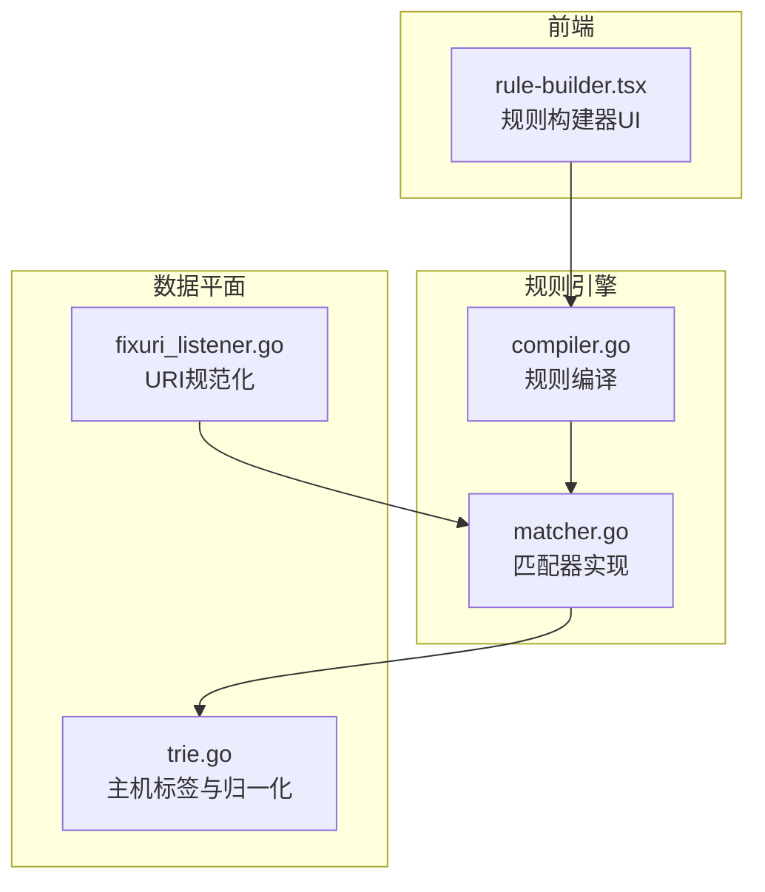
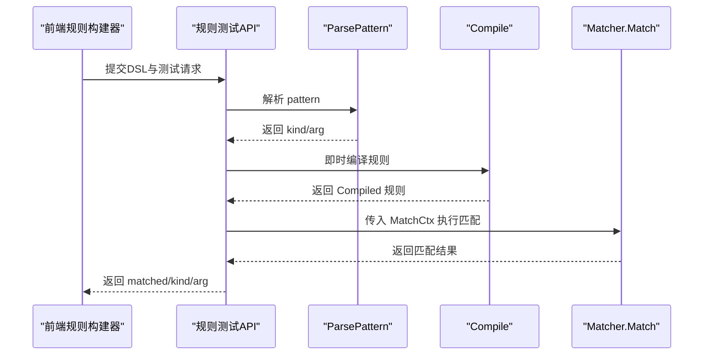
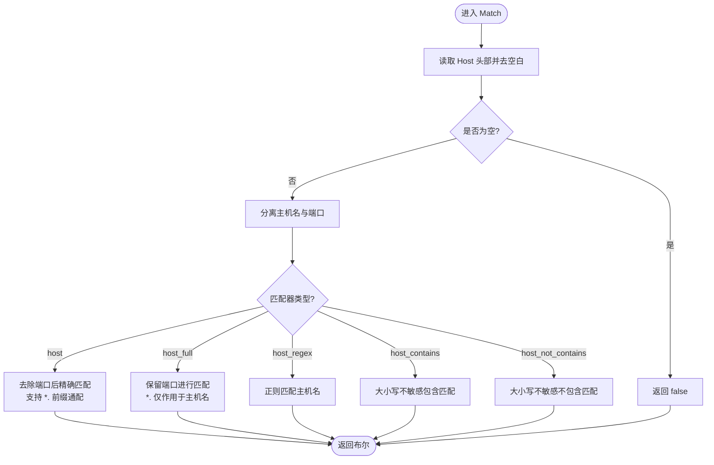
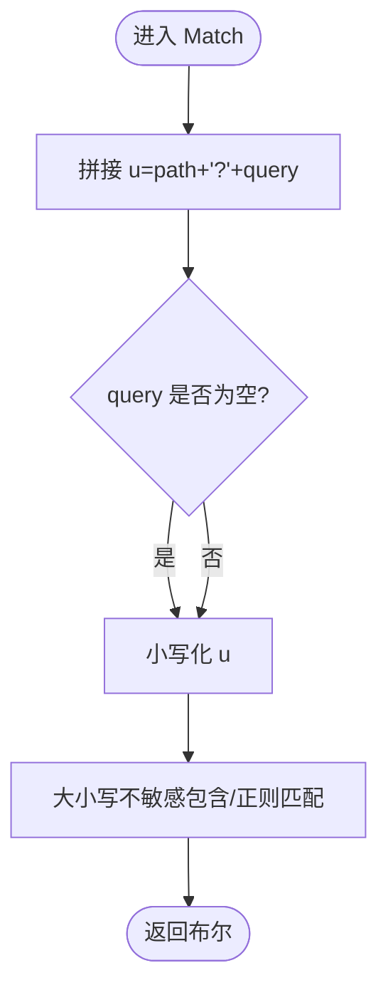
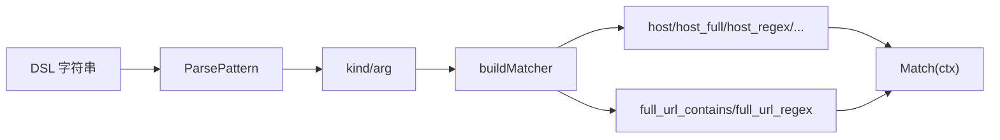

# 主机和URL匹配器

<cite>
**本文引用的文件**
- [matcher.go](file://internal/core/rules/matcher.go)
- [compiler.go](file://internal/core/rules/compiler.go)
- [rule-builder.tsx](file://frontend/components/rule-builder.tsx)
- [trie.go](file://internal/dataplane/trie.go)
- [fixuri_listener.go](file://internal/dataplane/fixuri_listener.go)
- [rule-test.md](file://docs/管理 API 系统/规则管理 API/规则验证与测试.md)
</cite>

## 目录
1. [简介](#简介)
2. [项目结构](#项目结构)
3. [核心组件](#核心组件)
4. [架构总览](#架构总览)
5. [详细组件分析](#详细组件分析)
6. [依赖分析](#依赖分析)
7. [性能考虑](#性能考虑)
8. [故障排查指南](#故障排查指南)
9. [结论](#结论)
10. [附录](#附录)

## 简介
本文面向WAF规则引擎中的“主机和URL匹配器”，系统化阐述以下内容：
- 主机匹配器族：host、host_full、host_regex、host_contains、host_not_contains 的实现原理、差异与适用场景
- 端口处理逻辑、通配符匹配与大小写不敏感匹配的实现细节
- URL完整匹配器：full_url_contains、full_url_regex 的工作方式与路径+查询参数组合处理
- 实际应用示例：虚拟主机保护、跨站请求检测、URL模式匹配
- 与前端规则构建器的交互与测试流程

## 项目结构
围绕主机与URL匹配器的核心代码位于规则引擎模块，前端提供可视化规则构建器，数据平面包含URI规范化与主机解析辅助工具。

**图表来源**
- [matcher.go:1-763](file://internal/core/rules/matcher.go#L1-L763)
- [compiler.go:1-91](file://internal/core/rules/compiler.go#L1-L91)
- [rule-builder.tsx:1-520](file://frontend/components/rule-builder.tsx#L1-L520)
- [trie.go:168-202](file://internal/dataplane/trie.go#L168-L202)
- [fixuri_listener.go:1-62](file://internal/dataplane/fixuri_listener.go#L1-L62)

**章节来源**
- [matcher.go:1-763](file://internal/core/rules/matcher.go#L1-L763)
- [compiler.go:1-91](file://internal/core/rules/compiler.go#L1-L91)
- [rule-builder.tsx:1-520](file://frontend/components/rule-builder.tsx#L1-L520)
- [trie.go:168-202](file://internal/dataplane/trie.go#L168-L202)
- [fixuri_listener.go:1-62](file://internal/dataplane/fixuri_listener.go#L1-L62)

## 核心组件
- 匹配器接口与工厂
  - 统一接口：所有匹配器实现统一的 Match 方法，接收请求上下文并返回布尔结果
  - 工厂函数：根据规则DSL中的 kind:arg 生成具体匹配器实例，内置正则缓存以提升性能
- 主机匹配器族
  - host：精确匹配（去除端口），支持通配符前缀
  - host_full：保留端口进行匹配，通配符仅作用于主机名部分
  - host_regex：基于正则表达式匹配主机名（去除端口）
  - host_contains/host_not_contains：大小写不敏感子串匹配
- URL完整匹配器
  - full_url_contains：将路径与原始查询参数拼接后进行大小写不敏感子串匹配
  - full_url_regex：对相同拼接后的字符串进行正则匹配

**章节来源**
- [matcher.go:12-15](file://internal/core/rules/matcher.go#L12-L15)
- [matcher.go:498-669](file://internal/core/rules/matcher.go#L498-L669)
- [matcher.go:361-451](file://internal/core/rules/matcher.go#L361-L451)
- [matcher.go:452-472](file://internal/core/rules/matcher.go#L452-L472)

## 架构总览
规则从DSL解析到编译，再到运行时匹配的整体流程如下：

**图表来源**
- [rule-test.md:187-228](file://docs/管理 API 系统/规则管理 API/规则验证与测试.md#L187-L228)
- [compiler.go:29-59](file://internal/core/rules/compiler.go#L29-L59)
- [matcher.go:12-15](file://internal/core/rules/matcher.go#L12-L15)

## 详细组件分析

### 主机匹配器实现与差异
- hostMatcher（精确匹配，去端口）
  - 去除端口后再进行精确匹配；支持通配符前缀（如 *.example.com）
  - 适用于严格域名匹配但不关心端口的场景
- hostFullMatcher（保留端口）
  - 保留端口参与匹配；通配符仅作用于主机名部分
  - 适用于需要区分端口的虚拟主机保护
- hostRegexMatcher（正则匹配）
  - 基于正则表达式匹配主机名（去除端口）
  - 适用于复杂域名模式匹配
- hostContainsMatcher / hostNotContainsMatcher（子串匹配）
  - 大小写不敏感子串匹配，先去除端口再匹配
  - 适用于基于域名片段的快速过滤或黑名单

**图表来源**
- [matcher.go:361-451](file://internal/core/rules/matcher.go#L361-L451)
- [matcher.go:381-398](file://internal/core/rules/matcher.go#L381-L398)

**章节来源**
- [matcher.go:361-451](file://internal/core/rules/matcher.go#L361-L451)
- [matcher.go:381-398](file://internal/core/rules/matcher.go#L381-L398)

### 端口处理逻辑
- 通用处理函数 splitHostPortHeader
  - 将头部值去空白并转为小写
  - 通过最后出现的冒号分割主机名与端口
  - 仅当端口部分全部为数字时才视为端口并剥离
- hostMatcher 与 hostRegexMatcher 等在匹配前均调用该函数，确保端口被剥离
- hostFullMatcher 保留端口参与匹配，但通配符仍只作用于主机名部分

**章节来源**
- [matcher.go:381-398](file://internal/core/rules/matcher.go#L381-L398)

### 通配符匹配与大小写不敏感匹配
- 通配符
  - 仅支持以 "*." 开头的前缀通配，匹配后缀域名
  - host 与 host_full 在通配符场景下分别对应“去端口”和“保留端口”的行为
- 大小写不敏感
  - 主机名统一转为小写后进行匹配
  - 子串匹配同样对输入与模式进行小写化处理

**章节来源**
- [matcher.go:361-451](file://internal/core/rules/matcher.go#L361-L451)

### URL完整匹配器
- fullURLContainsMatcher
  - 将 path 与原始 query 拼接为 u=path+"?"+query
  - 对拼接后的字符串进行大小写不敏感包含匹配
- fullURLRegexMatcher
  - 同上拼接后进行正则匹配

**图表来源**
- [matcher.go:452-472](file://internal/core/rules/matcher.go#L452-L472)

**章节来源**
- [matcher.go:452-472](file://internal/core/rules/matcher.go#L452-L472)

### 与前端规则构建器的集成
- 前端 rule-builder.tsx 提供主机与URL匹配器的可视化配置
- 支持简单DSL与复合JSON两种模式
- 提供在线测试功能，便于验证规则效果

**章节来源**
- [rule-builder.tsx:14-50](file://frontend/components/rule-builder.tsx#L14-L50)
- [rule-builder.tsx:23-39](file://frontend/components/rule-builder.tsx#L23-L39)

### 数据平面辅助
- trie.go
  - 归一化主机名（去端口、小写化）
  - 将域名按标签反转后用于Trie索引
- fixuri_listener.go
  - 修正HTTP请求行中URI缺失斜杠的问题，保证后续匹配与日志一致性

**章节来源**
- [trie.go:168-202](file://internal/dataplane/trie.go#L168-L202)
- [fixuri_listener.go:1-62](file://internal/dataplane/fixuri_listener.go#L1-L62)

## 依赖分析
- 规则编译依赖匹配器工厂
  - ParsePattern 解析 DSL，Compile 调用 buildMatcher 生成具体匹配器
- 匹配器内部依赖
  - 主机匹配器依赖 headerValue 与 splitHostPortHeader
  - URL匹配器直接使用 path 与 query 参数
- 前端规则构建器与后端测试API协同
  - 前端生成DSL，后端即时编译并执行匹配

**图表来源**
- [compiler.go:61-90](file://internal/core/rules/compiler.go#L61-L90)
- [matcher.go:498-669](file://internal/core/rules/matcher.go#L498-L669)

**章节来源**
- [compiler.go:1-91](file://internal/core/rules/compiler.go#L1-L91)
- [matcher.go:1-763](file://internal/core/rules/matcher.go#L1-L763)

## 性能考虑
- 正则缓存
  - 使用全局互斥锁保护的缓存表，避免重复编译同一正则
- 匹配器组合
  - and/or/not 支持短路求值，减少不必要的计算
- 字符串处理
  - 小写化与拼接操作在匹配器内部完成，尽量避免额外分配

**章节来源**
- [matcher.go:680-704](file://internal/core/rules/matcher.go#L680-L704)

## 故障排查指南
- 规则测试API
  - 通过管理API的规则测试接口提交DSL与测试请求，获得 matched、kind、arg
  - 有助于定位解析与编译问题
- 常见问题
  - Host为空：若请求未携带Host头，相关匹配器将返回false
  - 端口混淆：host_* 匹配器默认剥离端口；如需区分端口，请使用 host_full
  - 大小写敏感误解：匹配器已做小写化处理；如需严格区分大小写，请使用正则并显式指定大小写选项
  - URI格式异常：数据平面监听器会修正缺失斜杠的URI，避免匹配偏差

**章节来源**
- [rule-test.md:187-228](file://docs/管理 API 系统/规则管理 API/规则验证与测试.md#L187-L228)
- [fixuri_listener.go:1-62](file://internal/dataplane/fixuri_listener.go#L1-L62)

## 结论
- 主机匹配器族覆盖了从精确匹配到正则匹配、从通配符到子串匹配的多种需求
- URL完整匹配器提供了对路径与查询参数组合的灵活处理
- 前端规则构建器与后端测试API形成闭环，便于规则设计与验证
- 在生产环境中，建议结合虚拟主机保护、跨站请求检测与URL模式匹配，构建多层次的防护策略

## 附录

### 配置示例与使用场景
- 虚拟主机保护
  - 使用 host_full 匹配特定域名与端口，防止非法主机头攻击
  - 示例：host_full:*.example.com:8443
- 跨站请求检测
  - 使用 host_contains 或 host_not_contains 过滤可疑域名片段
  - 示例：host_not_contains:internal
- URL模式匹配
  - 使用 full_url_contains 检测特定路径+查询组合
  - 示例：full_url_contains:?debug=1
  - 使用 full_url_regex 检测复杂路径模式
  - 示例：full_url_regex:(?i)/api/v[0-9]+/

**章节来源**
- [matcher.go:592-625](file://internal/core/rules/matcher.go#L592-L625)
- [rule-builder.tsx:23-39](file://frontend/components/rule-builder.tsx#L23-L39)