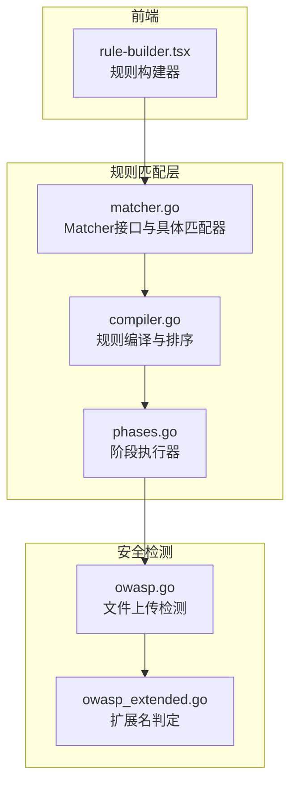
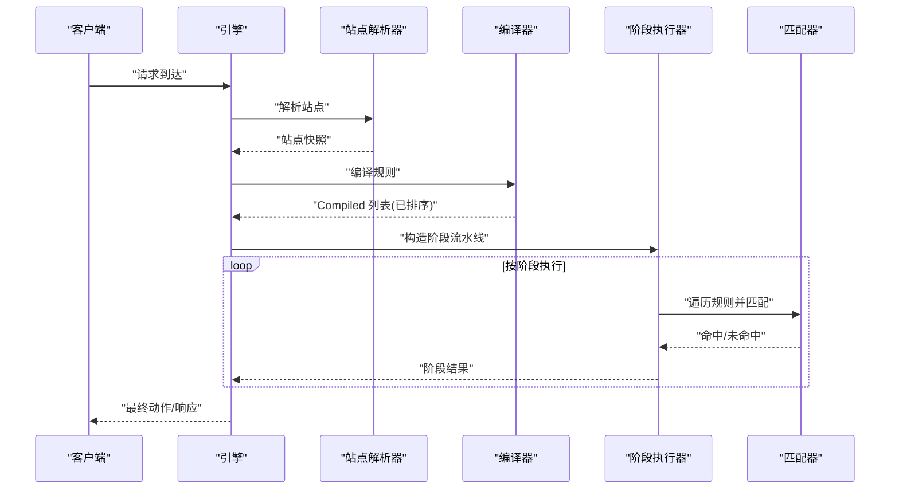
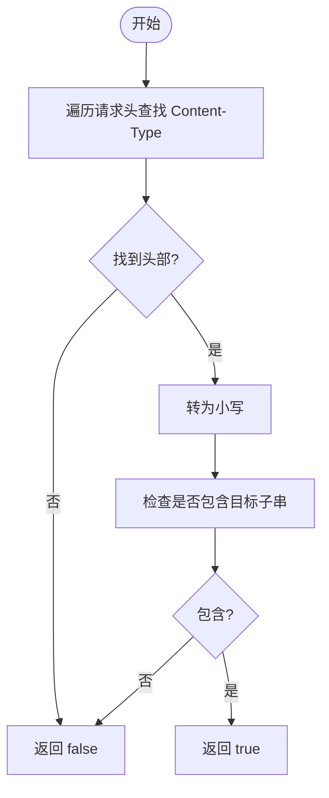
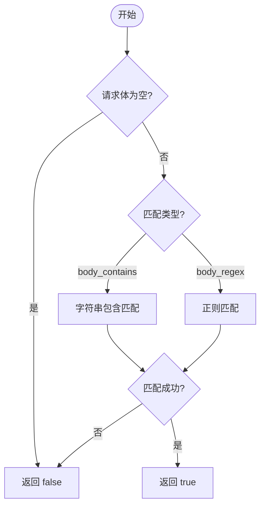
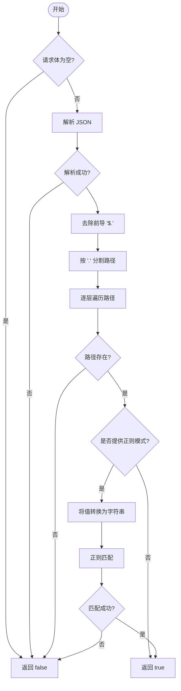
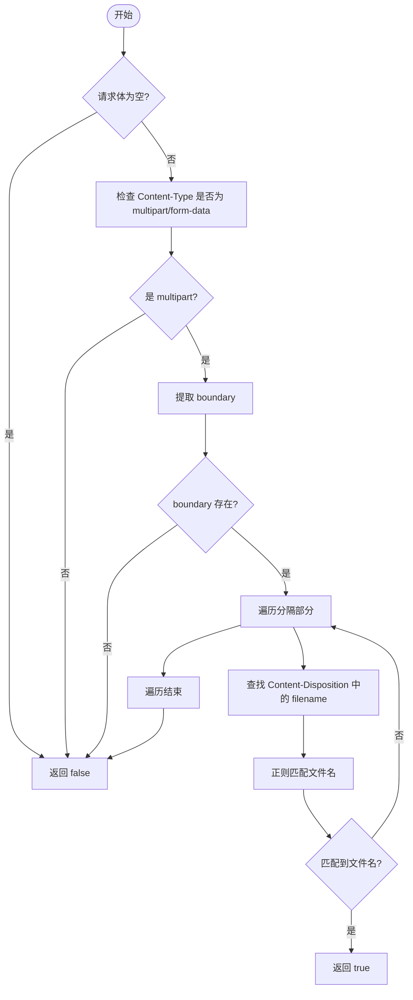
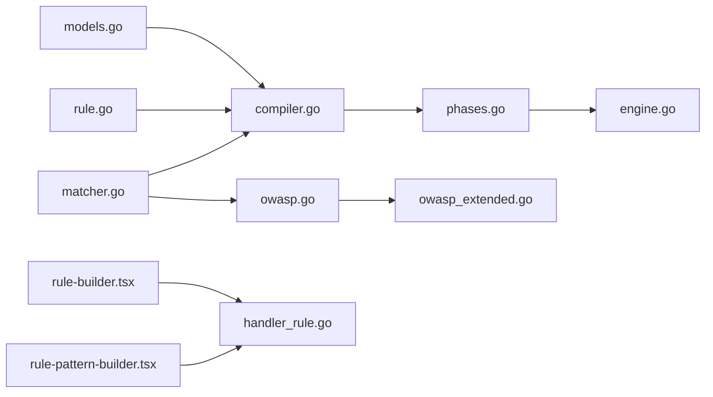

# 内容和主体匹配器

> [返回 WAF 引擎系统](../../WAF 引擎系统.md)

<cite>
**本文档引用的文件**
- [matcher.go](file://internal/core/rules/matcher.go)
- [matcher_test.go](file://internal/core/rules/matcher_test.go)
- [compiler.go](file://internal/core/rules/compiler.go)
- [phases.go](file://internal/core/rules/phases.go)
- [rule-builder.tsx](file://frontend/components/rule-builder.tsx)
- [owasp.go](file://internal/waf/owasp/owasp.go)
- [owasp_extended.go](file://internal/waf/owasp/owasp_extended.go)
</cite>

## 目录
1. [简介](#简介)
2. [项目结构](#项目结构)
3. [核心组件](#核心组件)
4. [架构总览](#架构总览)
5. [详细组件分析](#详细组件分析)
6. [依赖分析](#依赖分析)
7. [性能考虑](#性能考虑)
8. [故障排查指南](#故障排查指南)
9. [结论](#结论)
10. [附录](#附录)

## 简介
本文件系统性阐述内容和主体匹配器的设计与实现，重点覆盖以下方面：
- Content-Type 头部解析与部分匹配策略
- 主体匹配器（body_contains、body_regex）的实现与性能考量
- JSON 路径匹配器（block_body_json_path）的解析、路径遍历与值提取
- Multipart 文件匹配器（block_multipart）的边界解析、文件名提取与恶意扩展检测
- 配置示例与实际应用场景，包括文件上传安全检查、JSON 数据验证与主体内容扫描

## 项目结构
规则匹配器位于 internal/core/rules 目录，配合编译器、阶段执行器、引擎与前端规则构建器共同构成完整的规则处理链路。核心文件职责如下：
- matcher.go：定义 Matcher 接口与具体匹配器实现，含复合匹配器与各类字段匹配器，以及正则缓存。
- compiler.go：将持久化规则模型编译为运行时可直接匹配的 Compiled 结构，并按优先级排序。
- phases.go：定义各处理阶段（如 ACL、签名、自定义、速率限制、OWASP、CVE 等），并封装匹配上下文。
- rule-builder.tsx：前端可视化规则构建器，支持简单与复合规则构建与测试。
- owasp.go / owasp_extended.go：OWASP 文件上传检测与扩展名判定逻辑，与 multipart 匹配器形成互补。

图表来源
- [matcher.go:1-343](file://internal/core/rules/matcher.go#L1-L343)
- [compiler.go:1-83](file://internal/core/rules/compiler.go#L1-L83)
- [phases.go:1-569](file://internal/core/rules/phases.go#L1-L569)
- [rule-builder.tsx:1-556](file://frontend/components/rule-builder.tsx#L1-L556)
- [owasp.go:1-463](file://internal/waf/owasp/owasp.go#L1-L463)
- [owasp_extended.go:1-512](file://internal/waf/owasp/owasp_extended.go#L1-L512)

章节来源
- [matcher.go:1-343](file://internal/core/rules/matcher.go#L1-L343)
- [compiler.go:1-83](file://internal/core/rules/compiler.go#L1-L83)
- [phases.go:1-569](file://internal/core/rules/phases.go#L1-L569)
- [rule-builder.tsx:1-556](file://frontend/components/rule-builder.tsx#L1-L556)
- [owasp.go:1-463](file://internal/waf/owasp/owasp.go#L1-L463)
- [owasp_extended.go:1-512](file://internal/waf/owasp/owasp_extended.go#L1-L512)

## 核心组件
- Matcher 接口：统一的匹配抽象，接收客户端 IP、HTTP 方法、路径、查询串、请求头等上下文，返回布尔匹配结果。
- 具体匹配器：
  - 组合匹配器：and/or/not，支持嵌套复合规则。
  - 字段匹配器：IP/CIDR、路径前缀/精确/正则、查询串包含/正则、请求头包含/正则、方法、Content-Type、User-Agent、Body 包含、查询参数等。
  - 主体匹配器：body_contains、body_regex、block_body_json_path、block_multipart。
- 编译器：将规则模型转换为运行时可直接匹配的 Compiled 结构，并按优先级排序。
- 阶段执行器：将规则按阶段组织，逐阶段执行，支持短路（如 ACL 中 Allow 命中即跳过后续阶段）。
- 正则缓存：全局正则编译缓存，避免重复编译带来的性能损耗。

章节来源
- [matcher.go:11-14](file://internal/core/rules/matcher.go#L11-L14)
- [matcher.go:18-44](file://internal/core/rules/matcher.go#L18-L44)
- [matcher.go:48-141](file://internal/core/rules/matcher.go#L48-L141)
- [compiler.go:11-25](file://internal/core/rules/compiler.go#L11-L25)
- [compiler.go:27-55](file://internal/core/rules/compiler.go#L27-L55)
- [phases.go:34-52](file://internal/core/rules/phases.go#L34-L52)

## 架构总览
规则匹配器的整体工作流如下：
- 规则从数据库加载，经编译器转换为 Compiled 列表并按优先级排序。
- 引擎根据请求上下文构建 MatchCtx，交由各阶段执行器遍历规则进行匹配。
- ACL 阶段命中 Allow 可短路后续阶段；其他阶段命中规则即产生动作结果。
- 引擎将阶段结果汇总，返回最终动作与观察命中集合。

图表来源
- [phases.go:34-52](file://internal/core/rules/phases.go#L34-L52)
- [matcher.go:167-261](file://internal/core/rules/matcher.go#L167-L261)

## 详细组件分析

### Content-Type 头部匹配器（contentTypeMatcher）
- 实现原理
  - 遍历请求头，查找 Content-Type 头部（大小写不敏感）。
  - 将头部值转为小写后与目标子串进行包含匹配，实现“部分匹配”策略。
- 复杂度与性能
  - 时间复杂度：O(n)，其中 n 为 Content-Type 头部值长度。
  - 空间复杂度：O(1)。
- 使用场景
  - 仅需检查媒体类型的一部分，例如只关注 application/json 或 multipart/form-data。
- 注意事项
  - 该匹配器不解析边界参数，仅做字符串包含判断，因此不会误判带参数的完整 MIME 类型。

图表来源
- [matcher.go:187-196](file://internal/core/rules/matcher.go#L187-L196)

章节来源
- [matcher.go:187-196](file://internal/core/rules/matcher.go#L187-L196)
- [matcher_test.go:150-167](file://internal/core/rules/matcher_test.go#L150-L167)

### 主体匹配器（body_contains 与 body_regex）
- 实现原理
  - body_contains：对请求体进行包含匹配，要求请求体非空。
  - body_regex：对请求体进行正则匹配，同样要求请求体非空。
- 正则缓存
  - 使用全局正则编译缓存，避免重复编译带来的性能损耗。
- 复杂度与性能
  - body_contains：O(n)，n 为请求体长度。
  - body_regex：取决于正则表达式的复杂度与输入长度，建议使用简洁正则避免回溯风暴。
- 使用场景
  - 检测请求体中的特征字符串或模式，如脚本标签、特定关键字或敏感数据片段。
- 注意事项
  - 两个匹配器均为占位符匹配器，实际检查在请求上下文中完成，匹配器本身不负责解析或解码。

图表来源
- [matcher.go:210-220](file://internal/core/rules/matcher.go#L210-L220)
- [matcher.go:687-704](file://internal/core/rules/matcher.go#L687-L704)

章节来源
- [matcher.go:210-220](file://internal/core/rules/matcher.go#L210-L220)
- [matcher.go:687-704](file://internal/core/rules/matcher.go#L687-L704)
- [matcher_test.go:150-167](file://internal/core/rules/matcher_test.go#L150-L167)

### JSON 路径匹配器（block_body_json_path）
- 实现原理
  - 解析请求体为 JSON 对象，若解析失败则直接返回 false。
  - 支持以 $ 开头的点号路径（如 $.user.role），自动去除前导 "$."。
  - 逐层遍历路径，若某一层不是对象或不存在，则返回 false。
  - 若未提供正则模式，则仅检查路径是否存在；若提供了正则模式，则将路径值转换为字符串后进行正则匹配。
- 复杂度与性能
  - JSON 解析：O(n)，n 为请求体长度。
  - 路径遍历：O(d)，d 为路径深度。
  - 值提取与正则匹配：取决于值长度与正则复杂度。
- 使用场景
  - 验证 JSON 数据结构中的特定字段是否存在或满足特定模式，如校验用户角色、状态码等。
- 注意事项
  - 该匹配器不处理数组索引，仅支持对象键访问。
  - 当值为非字符串时，会进行序列化后再进行正则匹配，可能导致匹配结果与预期不符，建议在规则中明确指定模式。

图表来源
- [matcher.go:222-267](file://internal/core/rules/matcher.go#L222-L267)

章节来源
- [matcher.go:222-267](file://internal/core/rules/matcher.go#L222-L267)
- [matcher_test.go:150-167](file://internal/core/rules/matcher_test.go#L150-L167)

### Multipart 文件匹配器（block_multipart）
- 实现原理
  - 仅在 Content-Type 为 multipart/form-data 时触发。
  - 从 Content-Type 中提取 boundary 参数，若缺失则返回 false。
  - 遍历每个分隔部分，查找 Content-Disposition 中的 filename 字段，提取文件名并进行正则匹配。
  - 若匹配到任何文件名，则返回 true。
- 与 OWASP 文件上传检测的关系
  - 该匹配器侧重于“文件名正则匹配”，而 OWASP 模块更关注“扩展名与路径遍历”等安全风险。
  - 两者可互补使用，前者用于快速阻断已知危险扩展名，后者用于更全面的安全扫描。
- 复杂度与性能
  - 边界解析与分隔：O(n)，n 为请求体长度。
  - 文件名提取与正则匹配：取决于文件数量与正则复杂度。
- 使用场景
  - 基于文件名的快速阻断，如禁止上传 .php、.jsp、.exe 等可执行文件。
- 注意事项
  - 该匹配器不解析文件内容，仅检查文件名。
  - 若 multipart 解析器无法解析（例如边界缺失或格式异常），可结合 OWASP 的原始正文扫描进行兜底。

图表来源
- [matcher.go:269-320](file://internal/core/rules/matcher.go#L269-L320)
- [phases.go:395-421](file://internal/core/rules/phases.go#L395-L421)
- [owasp.go:347-358](file://internal/waf/owasp/owasp.go#L347-L358)
- [owasp_extended.go:453-512](file://internal/waf/owasp/owasp_extended.go#L453-L512)

章节来源
- [matcher.go:269-320](file://internal/core/rules/matcher.go#L269-L320)
- [phases.go:395-421](file://internal/core/rules/phases.go#L395-L421)
- [owasp.go:347-358](file://internal/waf/owasp/owasp.go#L347-L358)
- [owasp_extended.go:453-512](file://internal/waf/owasp/owasp_extended.go#L453-L512)

## 依赖分析
- 组件耦合：
  - matcher.go 与 compiler.go：编译器依赖匹配器工厂与 DSL 解析。
  - phases.go 与 matcher.go：阶段执行器依赖匹配器接口与 MatchCtx。
  - engine.go：协调编译器与阶段执行器，依赖站点解析与快照。
  - models.go 与 rule.go：规则模型与仓库，为编译器提供数据源。
  - rule-builder.tsx：前端规则构建器，支持简单规则（kind:arg）与复合规则（JSON）。
  - owasp.go / owasp_extended.go：OWASP 文件上传检测与扩展名判定，与 multipart 匹配器形成互补。
- 外部依赖：
  - 正则表达式库：用于正则匹配与缓存。
  - 网络库：用于 IP/CIDR 匹配。
  - 前端组件：规则构建器与测试工具，辅助规则开发与验证。

图表来源
- [matcher.go:1-343](file://internal/core/rules/matcher.go#L1-L343)
- [compiler.go:1-83](file://internal/core/rules/compiler.go#L1-L83)
- [phases.go:1-569](file://internal/core/rules/phases.go#L1-L569)
- [rule-builder.tsx:1-556](file://frontend/components/rule-builder.tsx#L1-L556)
- [owasp.go:1-463](file://internal/waf/owasp/owasp.go#L1-L463)
- [owasp_extended.go:1-512](file://internal/waf/owasp/owasp_extended.go#L1-L512)

章节来源
- [matcher.go:1-343](file://internal/core/rules/matcher.go#L1-L343)
- [compiler.go:1-83](file://internal/core/rules/compiler.go#L1-L83)
- [phases.go:1-569](file://internal/core/rules/phases.go#L1-L569)
- [rule-builder.tsx:1-556](file://frontend/components/rule-builder.tsx#L1-L556)
- [owasp.go:1-463](file://internal/waf/owasp/owasp.go#L1-L463)
- [owasp_extended.go:1-512](file://internal/waf/owasp/owasp_extended.go#L1-L512)

## 性能考虑
- 正则编译缓存：显著降低重复编译成本，建议在规则热更新时结合业务重启清理缓存。
- 规则排序：按 Priority 与 ID 排序，确保关键规则优先执行，减少后续匹配次数。
- 短路逻辑：ACL Allow 短路与其他阶段命中终止，减少不必要的匹配。
- 内容扫描限制：针对不同 Content-Type 限制扫描字节数与层级，避免大体积 Body 导致的性能问题。
- 建议：
  - 为高频正则表达式提供明确的缓存键，避免歧义。
  - 对复杂正则进行性能基准测试，必要时拆分为多个简单规则。
  - 合理设置规则数量与优先级，避免过多规则导致遍历成本过高。

章节来源
- [matcher.go:687-704](file://internal/core/rules/matcher.go#L687-L704)
- [phases.go:360-405](file://internal/core/rules/phases.go#L360-L405)
- [phases.go:407-540](file://internal/core/rules/phases.go#L407-L540)

## 故障排查指南
- 规则不生效：
  - 检查规则是否启用（Enabled=true）。
  - 确认 Priority 设置是否合理，避免被更高优先级规则覆盖。
  - 使用前端规则构建器的“规则测试”功能进行本地验证。
- 正则匹配异常：
  - 确认正则表达式语法正确，避免编译失败导致 Never 匹配器。
  - 检查正则缓存是否命中，必要时重启服务清理缓存。
- ACL Allow 短路：
  - 确认 Allow 规则的 Priority 是否低于 Block 规则。
  - 检查 Allow 规则的参数是否正确匹配（如 CIDR）。
- API 测试：
  - 使用管理 API 的 TestRule 接口传入 Pattern 与请求上下文进行 Dry-run 测试。
- 单元测试参考：
  - matcher_test.go 与 compiler_test.go 提供了多种匹配场景的断言，可作为编写自测用例的参考。

章节来源
- [rule-builder.tsx:228-293](file://frontend/components/rule-builder.tsx#L228-L293)
- [matcher_test.go:10-28](file://internal/core/rules/matcher_test.go#L10-L28)
- [matcher_test.go:30-66](file://internal/core/rules/matcher_test.go#L30-L66)

## 结论
规则匹配器通过清晰的接口设计、稳定的编译与排序机制、高效的正则缓存与短路逻辑，实现了高性能、可扩展的规则匹配能力。结合前端规则构建器与管理 API，用户可以便捷地开发、测试与部署规则。建议在生产环境中合理设置规则优先级、控制正则复杂度，并利用缓存与短路机制提升整体性能。

## 附录

### 配置示例与应用场景
以下示例展示了如何在规则中使用内容和主体匹配器，涵盖文件上传安全检查、JSON 数据验证与主体内容扫描的实际应用场景。

- 文件上传安全检查
  - 目标：阻断上传包含危险扩展名的文件。
  - 规则类型：block_multipart
  - 示例：禁止上传 .php、.jsp、.exe 等可执行文件
  - 规则模式：block_multipart:(?i)\.(php|jsp|exe)$
  - 说明：该规则对 multipart 表单中的文件名进行正则匹配，一旦发现匹配项即触发阻断。
  - 与 OWASP 的关系：该匹配器侧重于“文件名正则匹配”，OWASP 模块更关注“扩展名与路径遍历”等安全风险，两者可互补使用。

- JSON 数据验证
  - 目标：验证 JSON 请求体中特定字段的存在与值模式。
  - 规则类型：block_body_json_path
  - 示例：校验用户角色字段是否为管理员
  - 规则模式：block_body_json_path:$.user.role:(?i)admin
  - 说明：该规则解析 JSON 请求体，检查 $.user.role 路径是否存在且值匹配正则 (?i)admin。
  - 注意：当值为非字符串时，会进行序列化后再进行正则匹配，建议在规则中明确指定模式。

- 主体内容扫描
  - 目标：扫描请求体中的特征字符串或模式，如脚本标签或敏感数据片段。
  - 规则类型：body_contains 或 body_regex
  - 示例：阻断包含脚本标签的请求体
  - 规则模式：body_regex:(?i)<script
  - 说明：该规则对请求体进行正则匹配，一旦发现匹配项即触发阻断。
  - 性能建议：使用简洁正则避免回溯风暴，必要时拆分为多个简单规则。

章节来源
- [matcher.go:269-320](file://internal/core/rules/matcher.go#L269-L320)
- [matcher.go:222-267](file://internal/core/rules/matcher.go#L222-L267)
- [matcher.go:210-220](file://internal/core/rules/matcher.go#L210-L220)
- [rule-builder.tsx:42-49](file://frontend/components/rule-builder.tsx#L42-L49)