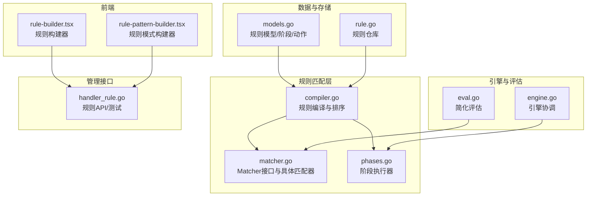
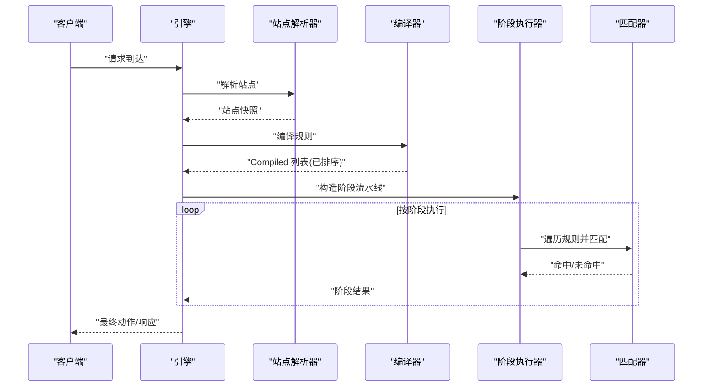
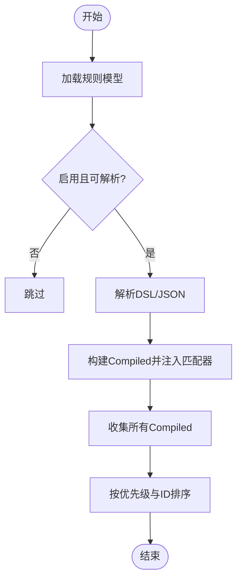
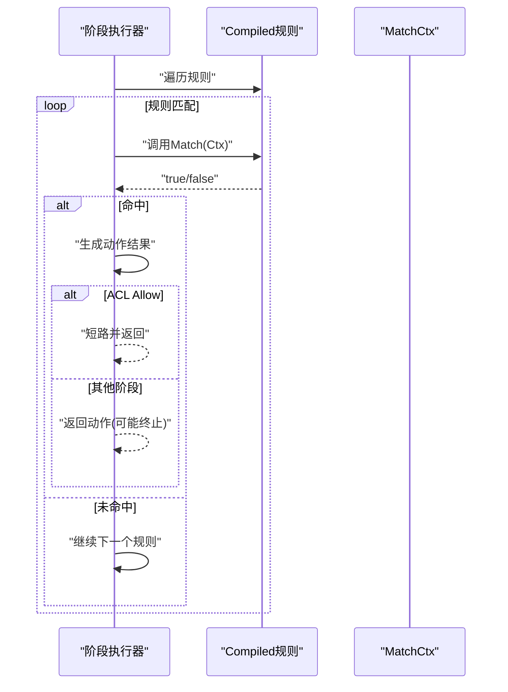
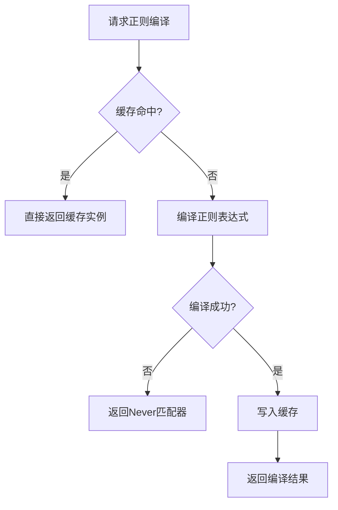
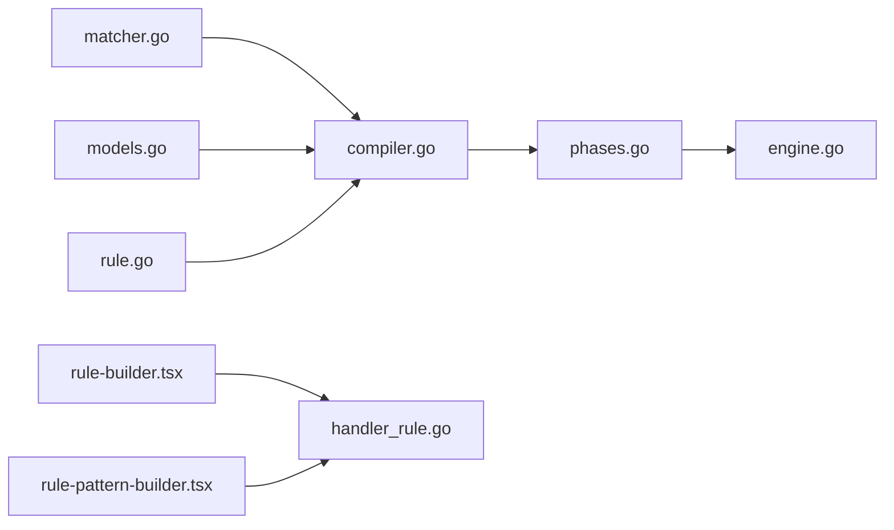

# 内置匹配器

> [返回 WAF 引擎系统](../../WAF 引擎系统.md)

<cite>
**本文档引用的文件**
- [matcher.go](file://internal/core/rules/matcher.go)
- [compiler.go](file://internal/core/rules/compiler.go)
- [phases.go](file://internal/core/rules/phases.go)
- [engine.go](file://internal/core/engine/engine.go)
- [eval.go](file://internal/waf/eval.go)
- [models.go](file://internal/store/models.go)
- [rule.go](file://internal/store/repository/rule.go)
- [rule-builder.tsx](file://frontend/components/rule-builder.tsx)
- [rule-pattern-builder.tsx](file://frontend/components/rule-pattern-builder.tsx)
- [handler_rule.go](file://internal/admin/handler_rule.go)
- [matcher_test.go](file://internal/core/rules/matcher_test.go)
- [compiler_test.go](file://internal/core/rules/compiler_test.go)
- [geoip.go](file://internal/waf/bot/geoip.go)
</cite>

## 目录
1. [简介](#简介)
2. [项目结构](#项目结构)
3. [核心组件](#核心组件)
4. [架构总览](#架构总览)
5. [详细组件分析](#详细组件分析)
6. [依赖分析](#依赖分析)
7. [性能考虑](#性能考虑)
8. [故障排查指南](#故障排查指南)
9. [结论](#结论)
10. [附录](#附录)

## 简介
本文件系统性阐述规则匹配器的设计与实现，覆盖模式匹配算法、正则表达式优化、匹配优先级处理、不同规则类型的匹配策略、性能优化技术（索引构建、缓存策略、批量匹配）、配置选项与调试方法，并提供自定义匹配规则的开发指南与最佳实践。目标是帮助开发者与运维人员快速理解并高效使用规则匹配器。

## 项目结构
规则匹配器位于 internal/core/rules 目录，配合编译器、阶段执行器、引擎与前端规则构建器共同构成完整的规则处理链路。核心文件职责如下：
- matcher.go：定义 Matcher 接口与具体匹配器实现，含复合匹配器与各类字段匹配器，以及正则缓存。
- compiler.go：将持久化规则模型编译为运行时可直接匹配的 Compiled 结构，并按优先级排序。
- phases.go：定义各处理阶段（如 ACL、签名、自定义、速率限制、OWASP、CVE 等），并封装匹配上下文。
- engine.go：协调站点解析、规则编译与阶段流水线执行。
- eval.go：提供简化评估接口，用于快速评估请求是否命中规则。
- models.go：规则数据模型与阶段/动作枚举。
- rule.go：规则仓库，提供规则列表、分页与 CRUD。
- rule-builder.tsx / rule-pattern-builder.tsx：前端可视化规则构建器，支持简单与复合规则构建与测试。
- handler_rule.go：管理规则的 API，包含规则测试接口。
- matcher_test.go / compiler_test.go：规则匹配与编译行为的单元测试。

图表来源
- [matcher.go:1-343](file://internal/core/rules/matcher.go#L1-L343)
- [compiler.go:1-83](file://internal/core/rules/compiler.go#L1-L83)
- [phases.go:1-569](file://internal/core/rules/phases.go#L1-L569)
- [engine.go:1-176](file://internal/core/engine/engine.go#L1-L176)
- [eval.go:1-159](file://internal/waf/eval.go#L1-L159)
- [models.go:1-200](file://internal/store/models.go#L1-L200)
- [rule.go:1-40](file://internal/store/repository/rule.go#L1-L40)
- [rule-builder.tsx:1-556](file://frontend/components/rule-builder.tsx#L1-L556)
- [rule-pattern-builder.tsx:1-288](file://frontend/components/rule-pattern-builder.tsx#L1-L288)
- [handler_rule.go:1-197](file://internal/admin/handler_rule.go#L1-L197)

章节来源
- [matcher.go:1-343](file://internal/core/rules/matcher.go#L1-L343)
- [compiler.go:1-83](file://internal/core/rules/compiler.go#L1-L83)
- [phases.go:1-569](file://internal/core/rules/phases.go#L1-L569)
- [engine.go:1-176](file://internal/core/engine/engine.go#L1-L176)
- [eval.go:1-159](file://internal/waf/eval.go#L1-L159)
- [models.go:1-200](file://internal/store/models.go#L1-L200)
- [rule.go:1-40](file://internal/store/repository/rule.go#L1-L40)
- [rule-builder.tsx:1-556](file://frontend/components/rule-builder.tsx#L1-L556)
- [rule-pattern-builder.tsx:1-288](file://frontend/components/rule-pattern-builder.tsx#L1-L288)
- [handler_rule.go:1-197](file://internal/admin/handler_rule.go#L1-L197)

## 核心组件
- Matcher 接口：统一的匹配抽象，接收客户端 IP、HTTP 方法、路径、查询串、请求头等上下文，返回布尔匹配结果。
- 具体匹配器：
  - 组合匹配器：and/or/not，支持嵌套复合规则。
  - 字段匹配器：IP/CIDR、路径前缀/精确/正则、查询串包含/正则、请求头包含/正则、方法、Content-Type、User-Agent、Body 包含、查询参数等。
- 编译器：将规则模型转换为运行时可直接匹配的 Compiled 结构，并按优先级排序。
- 阶段执行器：将规则按阶段组织，逐阶段执行，支持短路（如 ACL 中 Allow 命中即跳过后续阶段）。
- 引擎：协调站点解析、规则编译与阶段流水线执行。
- 正则缓存：全局正则编译缓存，避免重复编译带来的性能损耗。

章节来源
- [matcher.go:11-14](file://internal/core/rules/matcher.go#L11-L14)
- [matcher.go:18-44](file://internal/core/rules/matcher.go#L18-L44)
- [matcher.go:48-141](file://internal/core/rules/matcher.go#L48-L141)
- [compiler.go:11-25](file://internal/core/rules/compiler.go#L11-L25)
- [compiler.go:27-55](file://internal/core/rules/compiler.go#L27-L55)
- [phases.go:34-52](file://internal/core/rules/phases.go#L34-L52)
- [engine.go:57-129](file://internal/core/engine/engine.go#L57-L129)
- [matcher.go:273-296](file://internal/core/rules/matcher.go#L273-L296)

## 架构总览
规则匹配器的整体工作流如下：
- 规则从数据库加载，经编译器转换为 Compiled 列表并按优先级排序。
- 引擎根据请求上下文构建 MatchCtx，交由各阶段执行器遍历规则进行匹配。
- ACL 阶段命中 Allow 可短路后续阶段；其他阶段命中规则即产生动作结果。
- 引擎将阶段结果汇总，返回最终动作与观察命中集合。

图表来源
- [engine.go:57-129](file://internal/core/engine/engine.go#L57-L129)
- [compiler.go:27-55](file://internal/core/rules/compiler.go#L27-L55)
- [phases.go:34-52](file://internal/core/rules/phases.go#L34-L52)
- [matcher.go:167-261](file://internal/core/rules/matcher.go#L167-L261)

## 详细组件分析

### 匹配器接口与实现
- 接口设计：统一的 Match 方法，便于扩展新匹配器类型。
- 组合匹配器：and/or/not 支持任意嵌套，遵循短路语义（AND 全真才真，OR 有真即真，NOT 取反）。
- 字段匹配器：
  - IP/CIDR：基于 net.IPNet 的包含判断。
  - 路径：前缀匹配、精确匹配、正则匹配。
  - 查询串：包含匹配、正则匹配。
  - 请求头：包含匹配、正则匹配（大小写不敏感）。
  - 方法：大小写不敏感比较。
  - Content-Type：大小写不敏感包含匹配。
  - User-Agent：兼容 block_user_agent/block_user_agent_regex。
  - Body 包含：占位符，实际检查在请求上下文中完成。
  - 查询参数：解析查询串，支持存在性与包含性检查。
- 正则缓存：全局互斥锁保护的缓存表，避免重复编译正则表达式。

```mermaid
classDiagram
class Matcher {
+Match(ip, method, path, query, headers) bool
}
class andMatcher {
-children []Matcher
+Match(...)
}
class orMatcher {
-children []Matcher
+Match(...)
}
class notMatcher {
-child Matcher
+Match(...)
}
class ipCIDRMatcher {
-cidr *net.IPNet
+Match(...)
}
class pathPrefixMatcher {
-prefix string
+Match(...)
}
class pathRegexMatcher {
-re *regexp.Regexp
+Match(...)
}
class queryContainsMatcher {
-substr string
+Match(...)
}
class queryRegexMatcher {
-re *regexp.Regexp
+Match(...)
}
class headerContainsMatcher {
-name string
-substr string
+Match(...)
}
class headerRegexMatcher {
-name string
-re *regexp.Regexp
+Match(...)
}
class exactPathMatcher {
-path string
+Match(...)
}
class methodMatcher {
-method string
+Match(...)
}
class contentTypeMatcher {
-ctype string
+Match(...)
}
class alwaysMatcher {
+Match(...) bool
}
class neverMatcher {
+Match(...) bool
}
class bodyContainsMatcher {
-substr string
+Match(...)
}
class queryParamMatcher {
-param string
-value string
+Match(...)
}
Matcher <|.. andMatcher
Matcher <|.. orMatcher
Matcher <|.. notMatcher
Matcher <|.. ipCIDRMatcher
Matcher <|.. pathPrefixMatcher
Matcher <|.. pathRegexMatcher
Matcher <|.. queryContainsMatcher
Matcher <|.. queryRegexMatcher
Matcher <|.. headerContainsMatcher
Matcher <|.. headerRegexMatcher
Matcher <|.. exactPathMatcher
Matcher <|.. methodMatcher
Matcher <|.. contentTypeMatcher
Matcher <|.. alwaysMatcher
Matcher <|.. neverMatcher
Matcher <|.. bodyContainsMatcher
Matcher <|.. queryParamMatcher
```

图表来源
- [matcher.go:11-14](file://internal/core/rules/matcher.go#L11-L14)
- [matcher.go:18-44](file://internal/core/rules/matcher.go#L18-L44)
- [matcher.go:48-141](file://internal/core/rules/matcher.go#L48-L141)
- [matcher.go:273-296](file://internal/core/rules/matcher.go#L273-L296)

章节来源
- [matcher.go:11-14](file://internal/core/rules/matcher.go#L11-L14)
- [matcher.go:18-44](file://internal/core/rules/matcher.go#L18-L44)
- [matcher.go:48-141](file://internal/core/rules/matcher.go#L48-L141)
- [matcher.go:273-296](file://internal/core/rules/matcher.go#L273-L296)

### 编译器与规则排序
- 编译过程：过滤禁用规则，解析 DSL 或 JSON 复合规则，生成 Compiled 结构并注入对应匹配器。
- 排序策略：优先级升序，同优先级下按 ID 升序，确保确定性执行顺序。
- DSL 解析：支持简单规则（kind:arg）与 JSON 复合规则（{"op":"and|or|not","children":[...]} 或 {"kind":"...","arg":"..."}）。

图表来源
- [compiler.go:27-55](file://internal/core/rules/compiler.go#L27-L55)
- [compiler.go:57-82](file://internal/core/rules/compiler.go#L57-L82)

章节来源
- [compiler.go:11-25](file://internal/core/rules/compiler.go#L11-L25)
- [compiler.go:27-55](file://internal/core/rules/compiler.go#L27-L55)
- [compiler.go:57-82](file://internal/core/rules/compiler.go#L57-L82)

### 阶段执行与短路逻辑
- ACL 阶段：命中 Allow 即短路，跳过后续阶段；否则按规则动作决定是否终止。
- Signature/Custom 阶段：命中规则即产生动作结果，通常不短路。
- 其他阶段（速率限制、IP信誉、Bot检测、OWASP、CVE）独立作为阶段执行，按配置启用。
- 匹配上下文：MatchCtx 封装客户端 IP、方法、路径、查询串、请求头等关键字段。

图表来源
- [phases.go:34-52](file://internal/core/rules/phases.go#L34-L52)
- [phases.go:54-73](file://internal/core/rules/phases.go#L54-L73)
- [phases.go:75-94](file://internal/core/rules/phases.go#L75-L94)
- [phases.go:19-26](file://internal/core/rules/phases.go#L19-L26)

章节来源
- [phases.go:34-52](file://internal/core/rules/phases.go#L34-L52)
- [phases.go:54-73](file://internal/core/rules/phases.go#L54-L73)
- [phases.go:75-94](file://internal/core/rules/phases.go#L75-L94)
- [phases.go:19-26](file://internal/core/rules/phases.go#L19-L26)

### 正则表达式优化与缓存
- 编译缓存：cachedCompile 使用全局互斥锁保护的 map 缓存已编译的正则，避免重复编译。
- 并发安全：读多写少场景下先读锁再写锁，提升并发性能。
- 失效策略：当前实现未提供显式失效机制，建议在规则热更新时结合业务重启或定期清理策略。

图表来源
- [matcher.go:278-296](file://internal/core/rules/matcher.go#L278-L296)

章节来源
- [matcher.go:273-296](file://internal/core/rules/matcher.go#L273-L296)

### 匹配优先级与执行顺序
- 规则优先级：Compile 过程按 Priority 升序排序，Priority 相同时按 ID 升序，保证稳定可预期的执行顺序。
- 阶段顺序：引擎按配置组装阶段流水线，当前顺序为 IPReputation → AntiReplay → ACL → OWASP → CVE → BotDetection → RequestRateLimit → Signature → Custom；缺少对应管理器或关闭配置时跳过相关阶段。
- ACL Allow 短路：Allow 命中后立即短路，不再执行 ACL 之后的后续阶段。

章节来源
- [compiler.go:48-54](file://internal/core/rules/compiler.go#L48-L54)
- [engine.go:83-120](file://internal/core/engine/engine.go#L83-L120)
- [phases.go:40-51](file://internal/core/rules/phases.go#L40-L51)

### 不同类型规则的匹配策略
- 字符串匹配：前缀匹配、精确匹配、包含匹配，均采用标准字符串函数实现，时间复杂度 O(n)。
- 正则匹配：通过缓存编译后的正则表达式，避免重复编译；正则匹配的时间复杂度取决于表达式与输入长度。
- 复合规则匹配：AND/OR/NOT 递归构建子匹配器树，按逻辑语义短路执行。
- 请求头匹配：大小写不敏感比较，支持正则与包含两种方式。
- 查询参数匹配：解析查询串，支持存在性与值包含检查。
- Body 包含：占位符匹配器，实际检查在请求上下文中完成。

章节来源
- [matcher.go:48-141](file://internal/core/rules/matcher.go#L48-L141)
- [matcher.go:167-261](file://internal/core/rules/matcher.go#L167-L261)
- [matcher.go:298-342](file://internal/core/rules/matcher.go#L298-L342)

### 匹配性能优化技术
- 索引构建：当前实现未提供专用索引结构，但可通过规则优先级与阶段划分减少不必要的匹配尝试。
- 缓存策略：正则编译缓存显著降低重复编译开销；建议在规则热更新时结合业务重启以清理缓存。
- 批量匹配：规则编译后按优先级排序，阶段内顺序遍历，避免重复计算；复合规则通过短路逻辑减少后续匹配。
- 字符串操作优化：使用 strings.HasPrefix/Contains 等内置函数，避免自定义实现；正则表达式尽量简洁，避免回溯风暴。
- 内容类型扫描：针对不同 Content-Type 采用差异化提取策略，限制扫描范围与字节数，避免大体积 Body 导致的性能问题。

章节来源
- [matcher.go:273-296](file://internal/core/rules/matcher.go#L273-L296)
- [phases.go:360-405](file://internal/core/rules/phases.go#L360-L405)
- [phases.go:407-540](file://internal/core/rules/phases.go#L407-L540)

### 配置选项与调试方法
- 规则模型字段：包含 Phase、Pattern、Action、Priority、Enabled 等，Priority 控制执行顺序。
- 前端规则构建器：支持简单规则（kind:arg）与复合规则（JSON），提供可视化与高级模式切换、规则测试与验证。
- 管理 API：提供规则测试接口，允许传入 Pattern 与请求上下文进行 Dry-run 测试。
- 简化评估：eval.go 提供 Evaluate/EvaluateWithBot 快速评估入口，便于集成与调试。

章节来源
- [models.go:79-92](file://internal/store/models.go#L79-L92)
- [rule-builder.tsx:16-34](file://frontend/components/rule-builder.tsx#L16-L34)
- [rule-builder.tsx:59-93](file://frontend/components/rule-builder.tsx#L59-L93)
- [handler_rule.go:113-156](file://internal/admin/handler_rule.go#L113-L156)
- [eval.go:12-20](file://internal/waf/eval.go#L12-L20)

### 自定义匹配规则开发指南与最佳实践
- 新增匹配器步骤：
  1) 定义新的匹配器类型并实现 Matcher 接口。
  2) 在 buildMatcher 中注册 kind 与参数解析逻辑。
  3) 如涉及正则，请使用 cachedCompile 以复用编译结果。
  4) 在 ParsePattern 中添加对应的前缀识别，或支持 JSON 复合规则。
  5) 在 phases.go 中按需加入新阶段或调整现有阶段。
- 最佳实践：
  - 保持匹配器的幂等性与无副作用。
  - 对正则表达式进行充分测试，避免回溯与性能问题。
  - 合理设置 Priority，确保关键规则优先执行。
  - 使用复合规则组合多个条件，提高可维护性。
  - 在前端规则构建器中提供清晰的参数占位与示例。

章节来源
- [matcher.go:167-261](file://internal/core/rules/matcher.go#L167-L261)
- [matcher.go:273-296](file://internal/core/rules/matcher.go#L273-L296)
- [compiler.go:57-82](file://internal/core/rules/compiler.go#L57-L82)
- [phases.go:34-52](file://internal/core/rules/phases.go#L34-L52)

## 依赖分析
- 组件耦合：
  - matcher.go 与 compiler.go：编译器依赖匹配器工厂与 DSL 解析。
  - phases.go 与 matcher.go：阶段执行器依赖匹配器接口与 MatchCtx。
  - engine.go：协调编译器与阶段执行器，依赖站点解析与快照。
  - models.go 与 rule.go：规则模型与仓库，为编译器提供数据源。
- 外部依赖：
  - 正则表达式库：用于正则匹配与缓存。
  - 网络库：用于 IP/CIDR 匹配。
  - 前端组件：规则构建器与测试工具，辅助规则开发与验证。

图表来源
- [matcher.go:1-343](file://internal/core/rules/matcher.go#L1-L343)
- [compiler.go:1-83](file://internal/core/rules/compiler.go#L1-L83)
- [phases.go:1-569](file://internal/core/rules/phases.go#L1-L569)
- [engine.go:1-176](file://internal/core/engine/engine.go#L1-L176)
- [models.go:1-200](file://internal/store/models.go#L1-L200)
- [rule.go:1-40](file://internal/store/repository/rule.go#L1-L40)
- [rule-builder.tsx:1-556](file://frontend/components/rule-builder.tsx#L1-L556)
- [rule-pattern-builder.tsx:1-288](file://frontend/components/rule-pattern-builder.tsx#L1-L288)
- [handler_rule.go:1-197](file://internal/admin/handler_rule.go#L1-L197)

章节来源
- [matcher.go:1-343](file://internal/core/rules/matcher.go#L1-L343)
- [compiler.go:1-83](file://internal/core/rules/compiler.go#L1-L83)
- [phases.go:1-569](file://internal/core/rules/phases.go#L1-L569)
- [engine.go:1-176](file://internal/core/engine/engine.go#L1-L176)
- [models.go:1-200](file://internal/store/models.go#L1-L200)
- [rule.go:1-40](file://internal/store/repository/rule.go#L1-L40)
- [rule-builder.tsx:1-556](file://frontend/components/rule-builder.tsx#L1-L556)
- [rule-pattern-builder.tsx:1-288](file://frontend/components/rule-pattern-builder.tsx#L1-L288)
- [handler_rule.go:1-197](file://internal/admin/handler_rule.go#L1-L197)

## 性能考虑
- 正则编译缓存：显著降低重复编译成本，建议在规则热更新时结合业务重启清理缓存。
- 规则排序：按 Priority 与 ID 排序，确保关键规则优先执行，减少后续匹配次数。
- 短路逻辑：ACL Allow 短路与其他阶段命中终止，减少不必要的匹配。
- 内容扫描限制：针对不同 Content-Type 限制扫描字节数与层级，避免大体积 Body 导致的性能问题。
- 建议：
  - 为高频正则表达式提供明确的缓存键，避免歧义。
  - 对复杂正则进行性能基准测试，必要时拆分为多个简单规则。
  - 合理设置规则数量与优先级，避免过多规则导致遍历成本过高。

[本节为通用性能指导，无需特定文件来源]

## 故障排查指南
- 规则不生效：
  - 检查规则是否启用（Enabled=true）。
  - 确认 Priority 设置是否合理，避免被更高优先级规则覆盖。
  - 使用前端规则构建器的"规则测试"功能进行本地验证。
- 正则匹配异常：
  - 确认正则表达式语法正确，避免编译失败导致 Never 匹配器。
  - 检查正则缓存是否命中，必要时重启服务清理缓存。
- ACL Allow 短路：
  - 确认 Allow 规则的 Priority 是否低于 Block 规则。
  - 检查 Allow 规则的参数是否正确匹配（如 CIDR）。
- API 测试：
  - 使用管理 API 的 TestRule 接口传入 Pattern 与请求上下文进行 Dry-run 测试。
- 单元测试参考：
  - matcher_test.go 与 compiler_test.go 提供了多种匹配场景的断言，可作为编写自测用例的参考。

章节来源
- [rule-builder.tsx:228-293](file://frontend/components/rule-builder.tsx#L228-L293)
- [handler_rule.go:113-156](file://internal/admin/handler_rule.go#L113-L156)
- [matcher_test.go:10-28](file://internal/core/rules/matcher_test.go#L10-L28)
- [matcher_test.go:30-66](file://internal/core/rules/matcher_test.go#L30-L66)
- [compiler_test.go:11-27](file://internal/core/rules/compiler_test.go#L11-L27)

## 结论
规则匹配器通过清晰的接口设计、稳定的编译与排序机制、高效的正则缓存与短路逻辑，实现了高性能、可扩展的规则匹配能力。结合前端规则构建器与管理 API，用户可以便捷地开发、测试与部署规则。建议在生产环境中合理设置规则优先级、控制正则复杂度，并利用缓存与短路机制提升整体性能。

[本节为总结性内容，无需特定文件来源]

## 附录
- 规则类型清单（前端展示）：
  - ACL：封禁 IP/CIDR、放行 IP/CIDR
  - 路径：路径前缀、放行路径、路径精确、路径正则、放行路径正则
  - 查询：查询包含、查询正则
  - 请求头：请求头包含、放行请求头、请求头正则
  - 协议：HTTP 方法、Content-Type
  - Body：Body包含、Body正则
- DSL 格式：
  - 简单规则：kind:arg
  - 复合规则：{"op":"and|or|not","children":[{"kind":"...","arg":"..."}...]}
- 内置匹配器清单与使用场景：
  - IP CIDR 匹配器：用于基于 IP 地址或网段的访问控制，支持 IPv4/IPv6。
  - 路径匹配器：前缀匹配适用于目录级别的访问控制，精确匹配用于特定资源，正则匹配用于灵活的路径模式。
  - 查询参数匹配器：支持查询串的存在性检查与值包含检查。
  - 头部匹配器：支持请求头的包含匹配与正则匹配，常用于 User-Agent、Referer 等头部的识别。
  - 方法匹配器：对 HTTP 方法进行大小写不敏感的匹配，常用于限制特定方法的访问。
  - 内容类型匹配器：检查 Content-Type 头部，支持子串匹配，常用于限制特定类型的内容传输。
  - 主体匹配器：支持请求体的包含匹配与正则匹配，适用于对请求体内容的检查。
  - JSON 路径匹配器：支持对 JSON 格式的请求体进行路径导航与模式匹配。
  - Multipart 文件匹配器：用于检查 multipart/form-data 中的文件名，防止恶意文件上传。
  - 地理位置阻断匹配器：基于地理信息头部进行国家/地区的阻断控制。

章节来源
- [rule-builder.tsx:16-34](file://frontend/components/rule-builder.tsx#L16-L34)
- [rule-pattern-builder.tsx:11-29](file://frontend/components/rule-pattern-builder.tsx#L11-L29)

### 内置匹配器详细说明

#### IP CIDR 匹配器
- 构造函数：接收 CIDR 字符串或单个 IP 地址，内部自动推导掩码长度。
- 匹配逻辑：使用 net.IPNet 的 Contains 方法进行包含判断。
- 性能特性：基于 IPNet 的快速包含判断，时间复杂度 O(1)。
- 适用场景：IP 白名单/黑名单、区域访问控制、DDoS 防护等。

章节来源
- [matcher.go:128-132](file://internal/core/rules/matcher.go#L128-L132)
- [matcher.go:500-517](file://internal/core/rules/matcher.go#L500-L517)

#### 路径匹配器
- 前缀匹配器：使用 strings.HasPrefix 进行前缀判断。
- 精确匹配器：使用字符串相等比较。
- 正则匹配器：使用正则表达式进行灵活匹配，支持缓存编译。
- 性能特性：前缀/精确匹配 O(n)，正则匹配 O(n*m)。
- 适用场景：目录级访问控制、特定资源保护、动态路径匹配。

章节来源
- [matcher.go:134-144](file://internal/core/rules/matcher.go#L134-L144)
- [matcher.go:175-179](file://internal/core/rules/matcher.go#L175-L179)
- [matcher.go:519-527](file://internal/core/rules/matcher.go#L519-L527)

#### 查询参数匹配器
- 包含匹配器：使用 strings.Contains 检查查询串是否包含指定子串。
- 正则匹配器：使用正则表达式进行查询串匹配。
- 性能特性：字符串包含 O(n)，正则匹配 O(n*m)。
- 适用场景：SQL 注入检测、XSS 检测、参数篡改防护。

章节来源
- [matcher.go:146-156](file://internal/core/rules/matcher.go#L146-L156)
- [matcher.go:529-537](file://internal/core/rules/matcher.go#L529-L537)

#### 头部匹配器
- 包含匹配器：大小写不敏感的头部值包含检查。
- 正则匹配器：支持头部值的正则匹配。
- 性能特性：头部扫描 O(n)，其中 n 为头部数量。
- 适用场景：User-Agent 识别、Referer 验证、自定义头部检查。

章节来源
- [matcher.go:158-173](file://internal/core/rules/matcher.go#L158-L173)
- [matcher.go:539-549](file://internal/core/rules/matcher.go#L539-L549)

#### 方法匹配器
- 匹配逻辑：使用 strings.EqualFold 进行大小写不敏感的方法比较。
- 性能特性：字符串比较 O(n)。
- 适用场景：限制特定 HTTP 方法、API 安全控制。

章节来源
- [matcher.go:181-185](file://internal/core/rules/matcher.go#L181-L185)
- [matcher.go:554](file://internal/core/rules/matcher.go#L554)

#### 内容类型匹配器
- 匹配逻辑：遍历请求头，查找 Content-Type 头部，进行大小写不敏感的子串匹配。
- 性能特性：头部扫描 O(n)，字符串包含 O(m)。
- 适用场景：限制特定内容类型的上传、API 内容协商。

章节来源
- [matcher.go:187-196](file://internal/core/rules/matcher.go#L187-L196)
- [matcher.go:557](file://internal/core/rules/matcher.go#L557)

#### 主体匹配器
- 包含匹配器：检查请求体是否包含指定子串。
- 正则匹配器：对请求体进行正则匹配。
- 性能特性：体扫描 O(n)，正则匹配 O(n*m)。
- 适用场景：请求体内容检查、恶意内容检测。

章节来源
- [matcher.go:210-220](file://internal/core/rules/matcher.go#L210-L220)
- [matcher.go:578-586](file://internal/core/rules/matcher.go#L578-L586)

#### JSON 路径匹配器
- 匹配逻辑：解析 JSON 请求体，支持点号路径导航，可选正则模式匹配。
- 性能特性：JSON 解析 O(n)，路径导航 O(h)（h 为路径层级），正则匹配 O(n*m)。
- 适用场景：API 安全检查、敏感数据泄露防护。

章节来源
- [matcher.go:222-267](file://internal/core/rules/matcher.go#L222-L267)
- [matcher.go:627-638](file://internal/core/rules/matcher.go#L627-L638)

#### Multipart 文件匹配器
- 匹配逻辑：检查 multipart/form-data 的文件名，支持正则匹配可疑扩展名。
- 性能特性：体扫描 O(n)，正则匹配 O(n*m)。
- 适用场景：文件上传安全检查、恶意文件上传防护。

章节来源
- [matcher.go:269-320](file://internal/core/rules/matcher.go#L269-L320)
- [matcher.go:640-649](file://internal/core/rules/matcher.go#L640-L649)

#### 地理位置阻断匹配器
- 匹配逻辑：检查 x-geo-country 或 cf-ipcountry 等地理信息头部，进行国家代码匹配。
- 性能特性：头部扫描 O(n)，哈希查找 O(1)。
- 适用场景：基于地理位置的访问控制、地区合规要求。

章节来源
- [matcher.go:322-337](file://internal/core/rules/matcher.go#L322-L337)
- [matcher.go:651-661](file://internal/core/rules/matcher.go#L651-L661)

#### 查询参数匹配器
- 匹配逻辑：解析查询串，支持参数存在性检查与值包含检查。
- 性能特性：查询串解析 O(n)，字符串包含 O(m)。
- 适用场景：参数注入检测、参数篡改防护。

章节来源
- [matcher.go:339-359](file://internal/core/rules/matcher.go#L339-L359)
- [matcher.go:588-590](file://internal/core/rules/matcher.go#L588-L590)

#### Host 匹配器
- 精确匹配：支持通配符前缀（*.example.com）。
- 完整匹配：包含显式端口的精确匹配。
- 正则匹配：基于正则表达式的主机名匹配。
- 包含/不包含匹配：支持子串匹配。
- 性能特性：字符串比较 O(n)，正则匹配 O(n*m)。
- 适用场景：虚拟主机控制、域名访问控制。

章节来源
- [matcher.go:361-450](file://internal/core/rules/matcher.go#L361-L450)
- [matcher.go:592-619](file://internal/core/rules/matcher.go#L592-L619)

#### 全 URL 匹配器
- 包含匹配：对路径+查询串的小写形式进行子串匹配。
- 正则匹配：对完整 URL 进行正则匹配。
- 性能特性：字符串拼接 O(n)，正则匹配 O(n*m)。
- 适用场景：完整 URL 模式匹配、复杂路径规则。

章节来源
- [matcher.go:452-472](file://internal/core/rules/matcher.go#L452-L472)
- [matcher.go:595-603](file://internal/core/rules/matcher.go#L595-L603)

#### Cookie/Referer 匹配器
- Cookie 包含匹配：检查 Cookie 头部是否包含指定子串。
- Referer 包含匹配：检查 Referer 头部是否包含指定子串。
- 性能特性：头部扫描 O(n)，字符串包含 O(m)。
- 适用场景：CSRF 防护、来源验证。

章节来源
- [matcher.go:474-496](file://internal/core/rules/matcher.go#L474-L496)
- [matcher.go:621-625](file://internal/core/rules/matcher.go#L621-L625)

### 配置示例与最佳实践

#### 正则表达式优化技巧
- 使用锚点：^ 和 $ 确保完整匹配，避免部分匹配。
- 避免回溯：使用非贪婪量词和字符类替代复杂的分组。
- 缓存复用：相同模式的规则共享正则编译结果。
- 性能测试：对复杂正则进行基准测试，评估匹配性能。

章节来源
- [matcher.go:273-296](file://internal/core/rules/matcher.go#L273-L296)

#### 缓存机制使用
- 正则编译缓存：利用全局互斥锁保护的缓存表。
- 规则热更新：建议在规则热更新时结合业务重启清理缓存。
- 缓存键设计：为高频正则提供明确的缓存键，避免歧义。

章节来源
- [matcher.go:681-704](file://internal/core/rules/matcher.go#L681-L704)

#### 规则优先级设置
- ACL Allow 优先级：Allow 规则应设置较低的 Priority 值。
- 关键规则前置：重要规则设置较低的 Priority 值。
- 同优先级排序：Priority 相同时按 ID 升序执行。

章节来源
- [compiler.go:48-57](file://internal/core/rules/compiler.go#L48-L57)

#### 复合规则最佳实践
- AND/OR 组合：使用复合规则组合多个条件，提高可维护性。
- 嵌套深度：避免过深的嵌套层次，影响可读性。
- 短路逻辑：利用 AND/OR 的短路特性优化性能。

章节来源
- [matcher.go:718-762](file://internal/core/rules/matcher.go#L718-L762)
