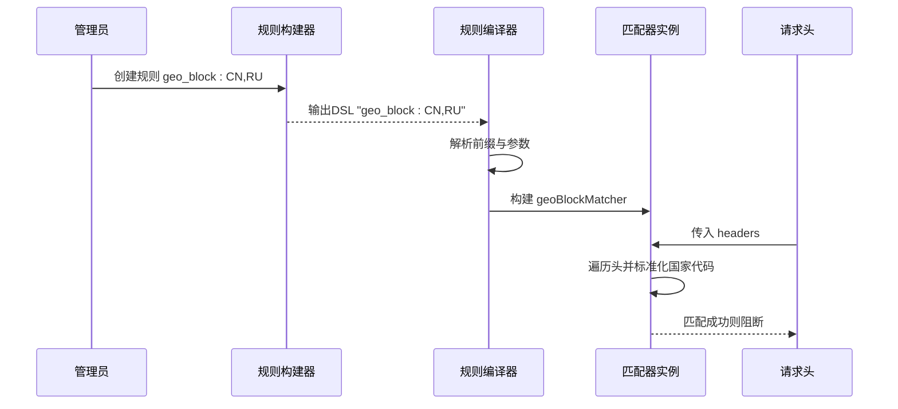
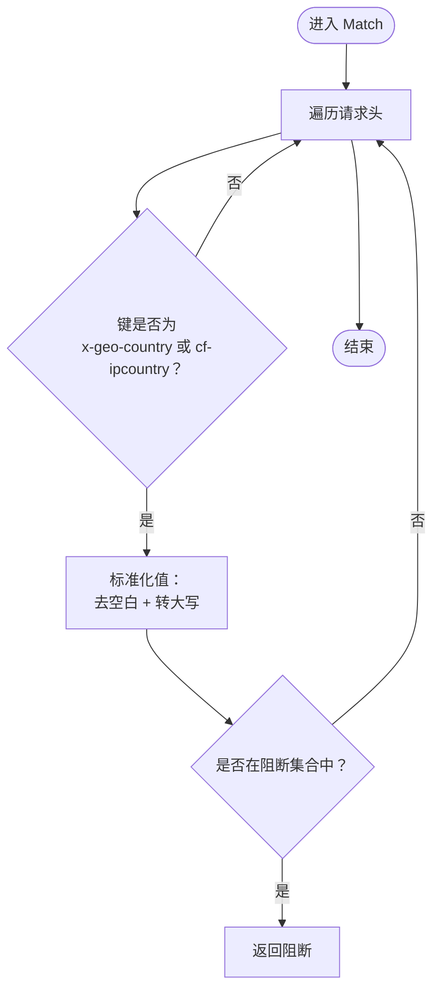
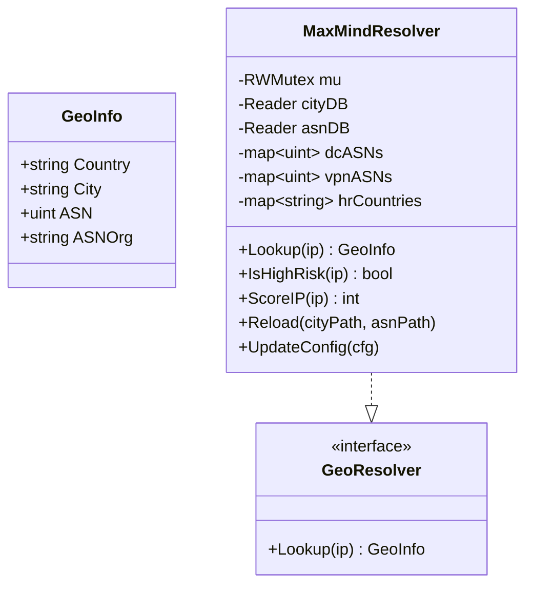
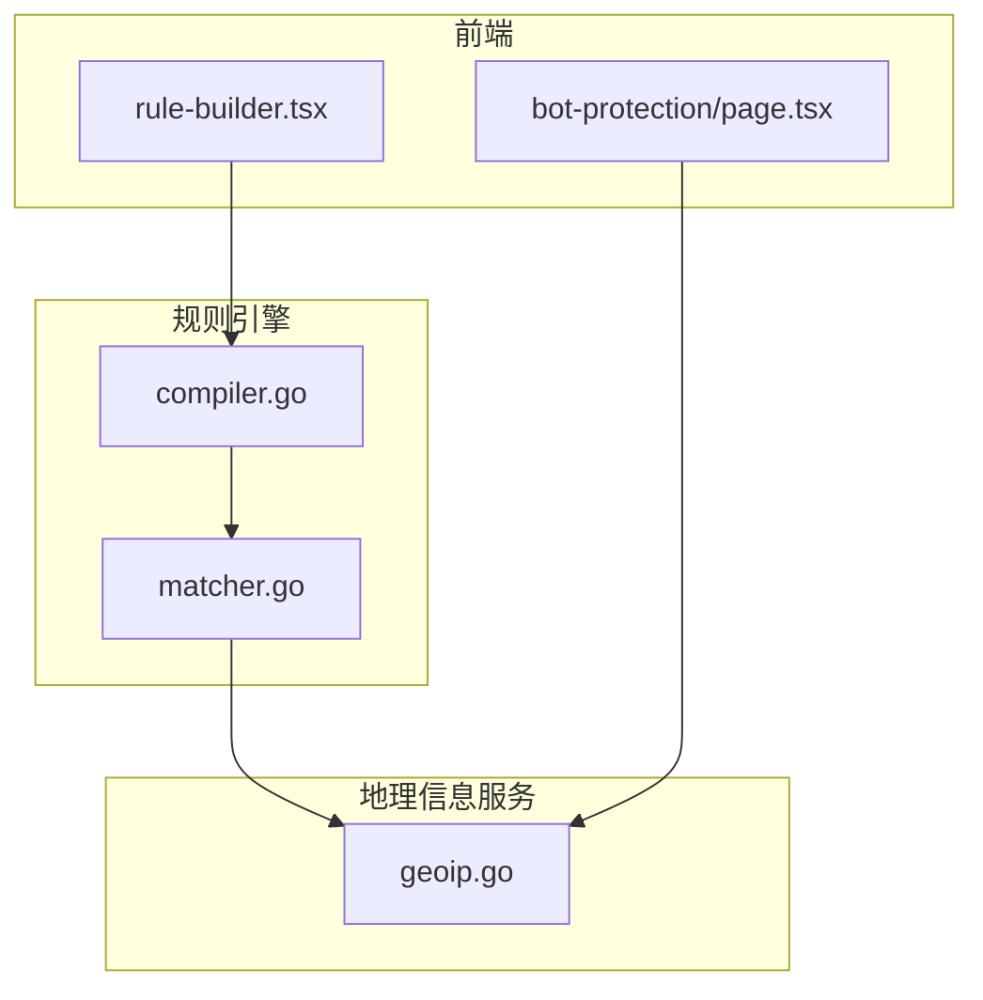

# 地理位置阻断匹配器

<cite>
**本文档引用的文件**
- [matcher.go](file://internal/core/rules/matcher.go)
- [compiler.go](file://internal/core/rules/compiler.go)
- [geoip.go](file://internal/waf/bot/geoip.go)
- [地理位置阻断.md](file://docs/安全防护功能/地理位置阻断.md)
- [devlog.md](file://devlog.md)
- [rule-builder.tsx](file://frontend/components/rule-builder.tsx)
- [page.tsx](file://frontend/app/(dashboard)/bot-protection/page.tsx)
</cite>

## 目录
1. [简介](#简介)
2. [项目结构](#项目结构)
3. [核心组件](#核心组件)
4. [架构概览](#架构概览)
5. [详细组件分析](#详细组件分析)
6. [依赖关系分析](#依赖关系分析)
7. [性能考虑](#性能考虑)
8. [故障排除指南](#故障排除指南)
9. [结论](#结论)
10. [附录](#附录)

## 简介
本文档深入解析 My-OpenWaf 中的地理位置阻断匹配器（geo_block），涵盖其匹配逻辑、国家代码解析、头部字段识别、标准格式与大小写处理，并提供基于地理位置的访问控制、DDoS 缓解与合规性检查的实际应用场景。同时说明与第三方地理数据库（MaxMind）的集成方式与性能优化策略。

## 项目结构
地理位置阻断匹配器位于规则引擎的核心匹配器集合中，通过规则编译器解析 DSL 形式的规则字符串，构建可执行的匹配器实例。地理信息查询能力由独立的 GeoIP 解析器提供，支持 MaxMind 数据库的热重载与运行时配置更新。

**图表来源**
- [matcher.go:322-337](file://internal/core/rules/matcher.go#L322-L337)
- [matcher.go:498-669](file://internal/core/rules/matcher.go#L498-L669)
- [compiler.go:61-90](file://internal/core/rules/compiler.go#L61-L90)
- [geoip.go:14-19](file://internal/waf/bot/geoip.go#L14-L19)

**章节来源**
- [matcher.go:12-15](file://internal/core/rules/matcher.go#L12-L15)
- [compiler.go:11-27](file://internal/core/rules/compiler.go#L11-L27)

## 核心组件
- geo_block 匹配器：基于请求头中的国家代码进行快速阻断判断，支持多个国家代码的集合匹配。
- 规则编译器：解析规则 DSL（如 geo_block:CN,RU,KP），构建 geoBlockMatcher 实例。
- GeoIP 解析器：提供基于 MaxMind 数据库的地理位置查询能力，支持热重载与运行时配置更新。

**章节来源**
- [matcher.go:322-337](file://internal/core/rules/matcher.go#L322-L337)
- [matcher.go:651-661](file://internal/core/rules/matcher.go#L651-L661)
- [compiler.go:61-90](file://internal/core/rules/compiler.go#L61-L90)
- [geoip.go:21-84](file://internal/waf/bot/geoip.go#L21-L84)

## 架构概览
geo_block 匹配器在规则编译阶段被解析为具体匹配器对象；在请求处理阶段，匹配器从请求头中提取国家代码，进行标准化处理后与配置的阻断国家集合进行 O(1) 查找匹配。

**图表来源**
- [compiler.go:61-90](file://internal/core/rules/compiler.go#L61-L90)
- [matcher.go:651-661](file://internal/core/rules/matcher.go#L651-L661)
- [matcher.go:325-336](file://internal/core/rules/matcher.go#L325-L336)

## 详细组件分析

### geo_block 匹配器实现原理
- 国家代码解析：将输入的逗号分隔国家代码进行去空格与大写标准化，构建哈希集合以实现 O(1) 查找。
- 头部字段识别：遍历请求头，识别大小写不敏感的关键字 x-geo-country 与 cf-ipcountry，并提取对应值。
- 匹配逻辑：对头部值进行标准化（去空白、转大写）后，检查是否存在于阻断集合中，命中即返回阻断。

**图表来源**
- [matcher.go:325-336](file://internal/core/rules/matcher.go#L325-L336)

**章节来源**
- [matcher.go:322-337](file://internal/core/rules/matcher.go#L322-L337)
- [matcher.go:651-661](file://internal/core/rules/matcher.go#L651-L661)

### 支持的地理信息头部与来源
- x-geo-country：常见于边缘节点或代理中间件提供的地理信息头。
- cf-ipcountry：Cloudflare 等 CDN/代理服务提供的国家代码头。
- 头部识别策略：大小写不敏感匹配，确保兼容不同上游服务的命名差异。

**章节来源**
- [matcher.go:327-334](file://internal/core/rules/matcher.go#L327-L334)

### 国家代码标准格式与大小写处理
- 标准格式：ISO 3166-1 alpha-2（两位大写字母）。
- 处理策略：在解析阶段统一转换为大写并去除首尾空白，确保与数据库或配置中的标准格式一致。
- 集合查找：使用哈希映射实现 O(1) 匹配，提升性能。

**章节来源**
- [matcher.go:655-656](file://internal/core/rules/matcher.go#L655-L656)
- [matcher.go:330](file://internal/core/rules/matcher.go#L330)

### 与第三方地理数据库的集成
- 集成方式：通过 MaxMindResolver 提供的 Lookup 接口获取国家代码，支持 City 与 ASN 数据库。
- 热重载与配置更新：支持运行时热重载数据库文件与更新风险列表，无需重启服务。
- 风险评分：结合数据中心 ASN、VPN/代理 ASN 与高风险国家列表，计算综合风险分值。

**图表来源**
- [geoip.go:14-19](file://internal/waf/bot/geoip.go#L14-L19)
- [geoip.go:21-84](file://internal/waf/bot/geoip.go#L21-L84)

**章节来源**
- [geoip.go:40-112](file://internal/waf/bot/geoip.go#L40-L112)

### 规则编译与匹配器构建
- 规则解析：ParsePattern 识别 geo_block 前缀并提取参数。
- 匹配器构建：buildMatcher 将参数解析为 geoBlockMatcher，内部维护国家代码集合。
- 执行顺序：编译后的规则按优先级排序，在请求阶段依次评估。

**章节来源**
- [compiler.go:61-90](file://internal/core/rules/compiler.go#L61-L90)
- [matcher.go:498-669](file://internal/core/rules/matcher.go#L498-L669)

### 配置示例与应用场景
- 基于地理位置的访问控制：通过 geo_block:US,CA,MX 阻断特定国家/地区的请求。
- DDoS 缓解：结合速率限制与地理位置阻断，针对高风险国家的异常流量进行快速拦截。
- 合规性检查：根据监管要求，阻断来自特定国家的访问请求，满足合规要求。
- 前端规则构建器：提供可视化界面，支持 geo_block:CN,RU,KP 等语法提示与模板。

**章节来源**
- [rule-builder.tsx:18](file://frontend/components/rule-builder.tsx#L18)
- [devlog.md:189](file://devlog.md#L189)

## 依赖关系分析
- 规则引擎依赖：geo_block 匹配器属于通用规则匹配器的一部分，遵循 Matcher 接口规范。
- 地理信息服务：MaxMindResolver 独立于规则引擎，通过全局解析器接口提供查询能力。
- 前端集成：规则构建器与 Bot 防护页面提供配置入口，支持 GeoIP 数据库路径与风险列表配置。

**图表来源**
- [compiler.go:61-90](file://internal/core/rules/compiler.go#L61-L90)
- [matcher.go:498-669](file://internal/core/rules/matcher.go#L498-L669)
- [geoip.go:114-122](file://internal/waf/bot/geoip.go#L114-L122)
- [rule-builder.tsx:14-50](file://frontend/components/rule-builder.tsx#L14-L50)
- [page.tsx:153-179](file://frontend/app/(dashboard)/bot-protection/page.tsx#L153-L179)

**章节来源**
- [compiler.go:11-27](file://internal/core/rules/compiler.go#L11-L27)
- [geoip.go:114-122](file://internal/waf/bot/geoip.go#L114-L122)

## 性能考虑
- 匹配器内部使用哈希集合进行 O(1) 查找，避免线性扫描。
- 规则编译阶段一次性完成参数解析与集合构建，运行时仅执行匹配逻辑。
- GeoIP 查询采用读写锁分离，读操作无锁，写操作独占，最大化并发性能。
- 支持数据库热重载与配置更新，减少停机时间与维护成本。

**章节来源**
- [matcher.go:654-661](file://internal/core/rules/matcher.go#L654-L661)
- [geoip.go:28-36](file://internal/waf/bot/geoip.go#L28-L36)
- [geoip.go:66-102](file://internal/waf/bot/geoip.go#L66-L102)

## 故障排除指南
- geo_block 未生效：确认规则 DSL 前缀已注册（开发日志中曾修复前缀未注册的问题）。
- 国家代码不匹配：检查请求头是否包含 x-geo-country 或 cf-ipcountry，以及国家代码是否为标准格式（ISO 3166-1 alpha-2，大写）。
- GeoIP 数据库加载失败：检查数据库路径、文件权限与格式完整性，系统会在加载失败时降级运行。
- 配置更新无效：确认已正确调用热重载与配置更新接口，确保新配置已生效。

**章节来源**
- [devlog.md:189](file://devlog.md#L189)
- [matcher.go:327-334](file://internal/core/rules/matcher.go#L327-L334)
- [geoip.go:46-63](file://internal/waf/bot/geoip.go#L46-L63)

## 结论
geo_block 匹配器通过简洁高效的头部识别与哈希集合匹配，实现了对特定国家/地区的快速阻断；结合 MaxMind 数据库与风险评分机制，可进一步提升防护效果。规则编译器与前端工具链提供了良好的可配置性与可运维性，适用于访问控制、DDoS 缓解与合规性检查等多种场景。

## 附录
- 配置参数参考（Bot 配置）：enabled、geoip_db_path、high_risk_countries、datacenter_asns、vpn_proxy_asns、score_threshold。
- 配置参数参考（保护配置）：bot_detection_enabled、auto_ban_enabled、auto_ban_threshold、auto_ban_window、auto_ban_duration。
- 规则构建器支持 geo_block:CN,RU,KP 等语法提示与模板。

**章节来源**
- [page.tsx:153-179](file://frontend/app/(dashboard)/bot-protection/page.tsx#L153-L179)
- [rule-builder.tsx:18](file://frontend/components/rule-builder.tsx#L18)
- [地理位置阻断.md:394-407](file://docs/安全防护功能/地理位置阻断.md#L394-L407)