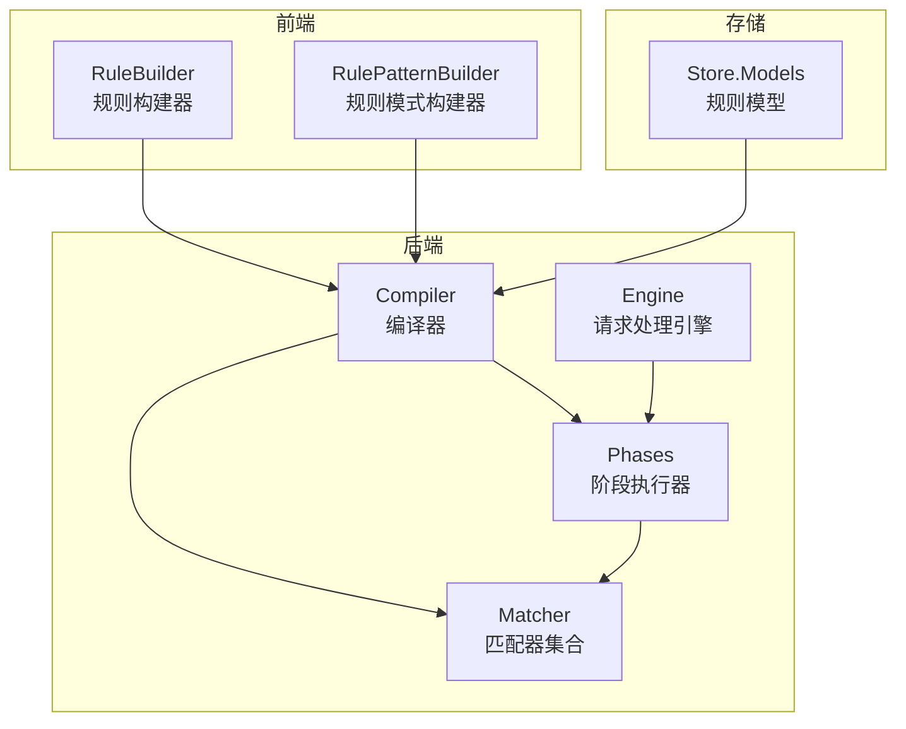
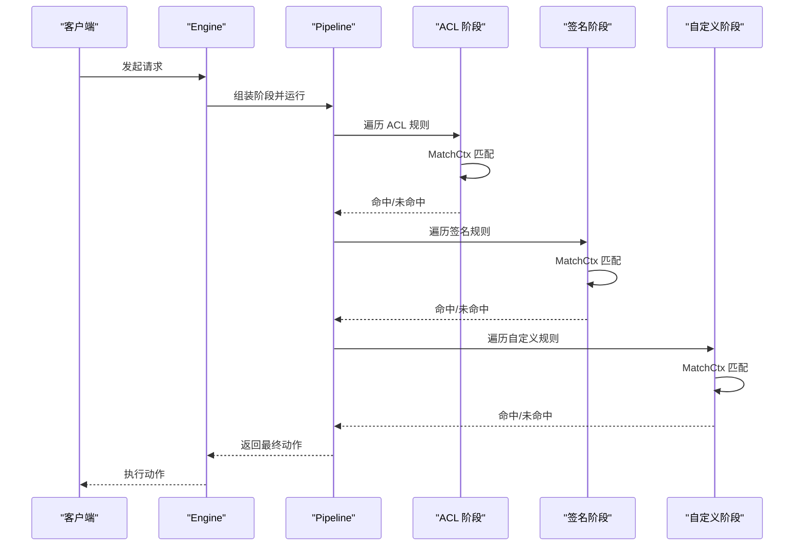
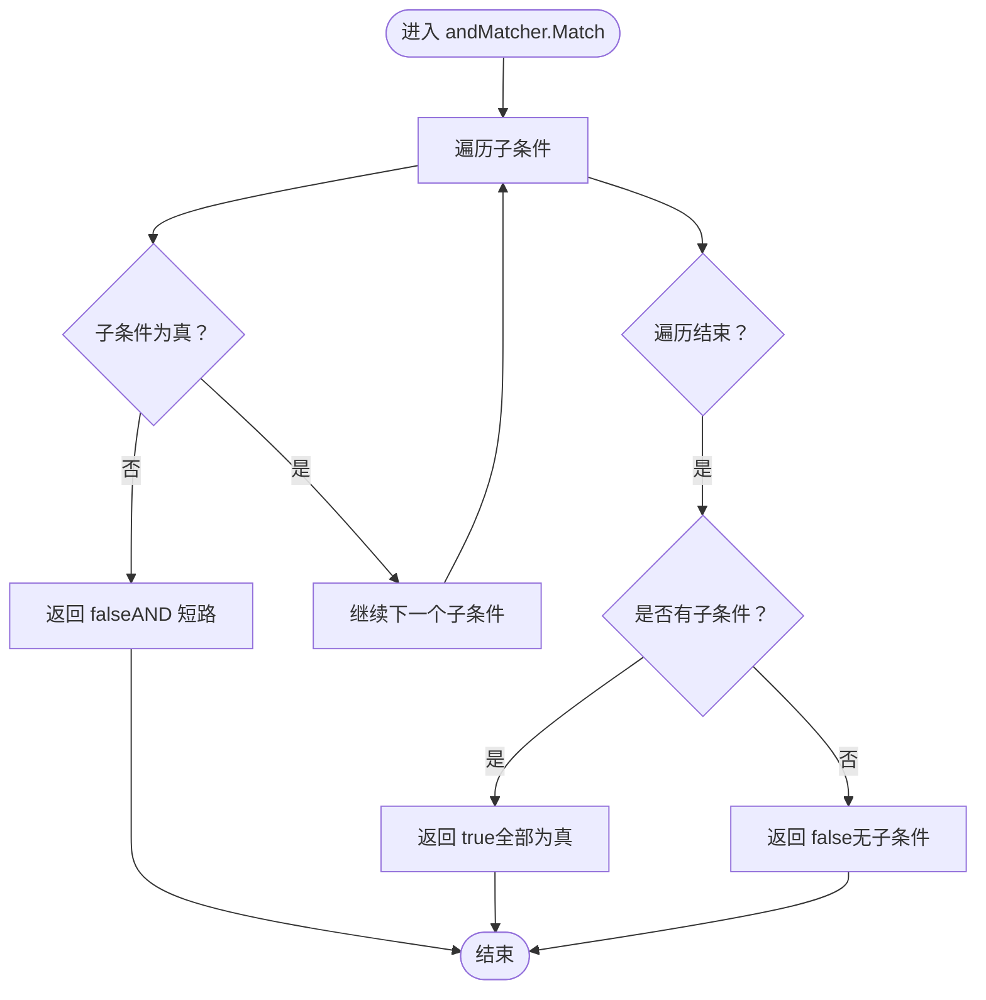
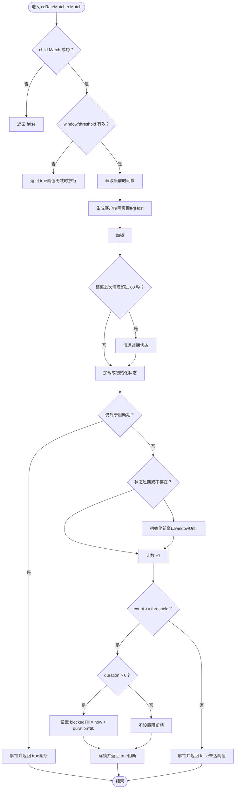
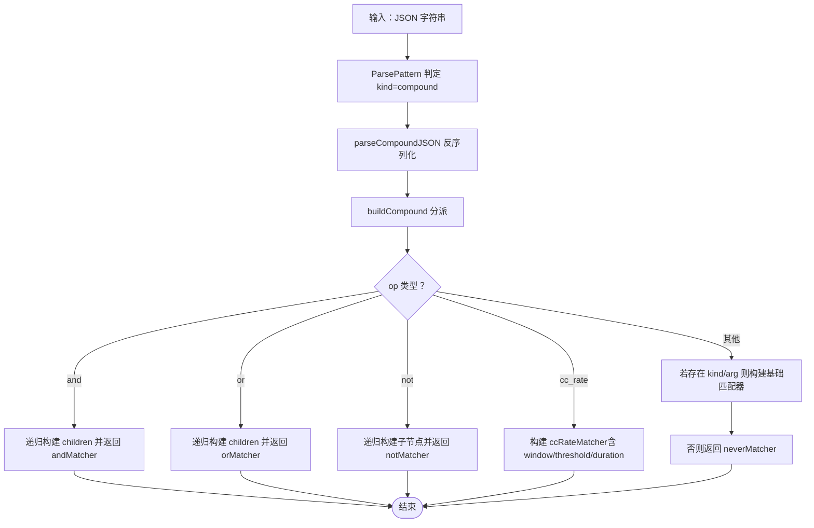
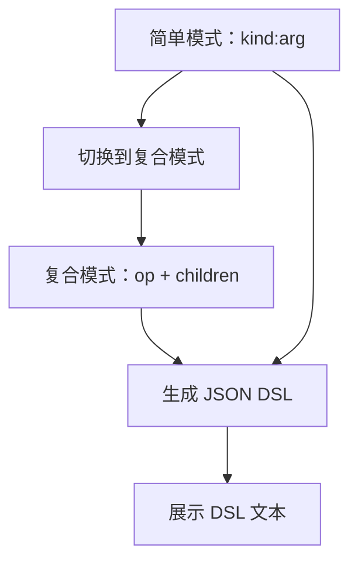
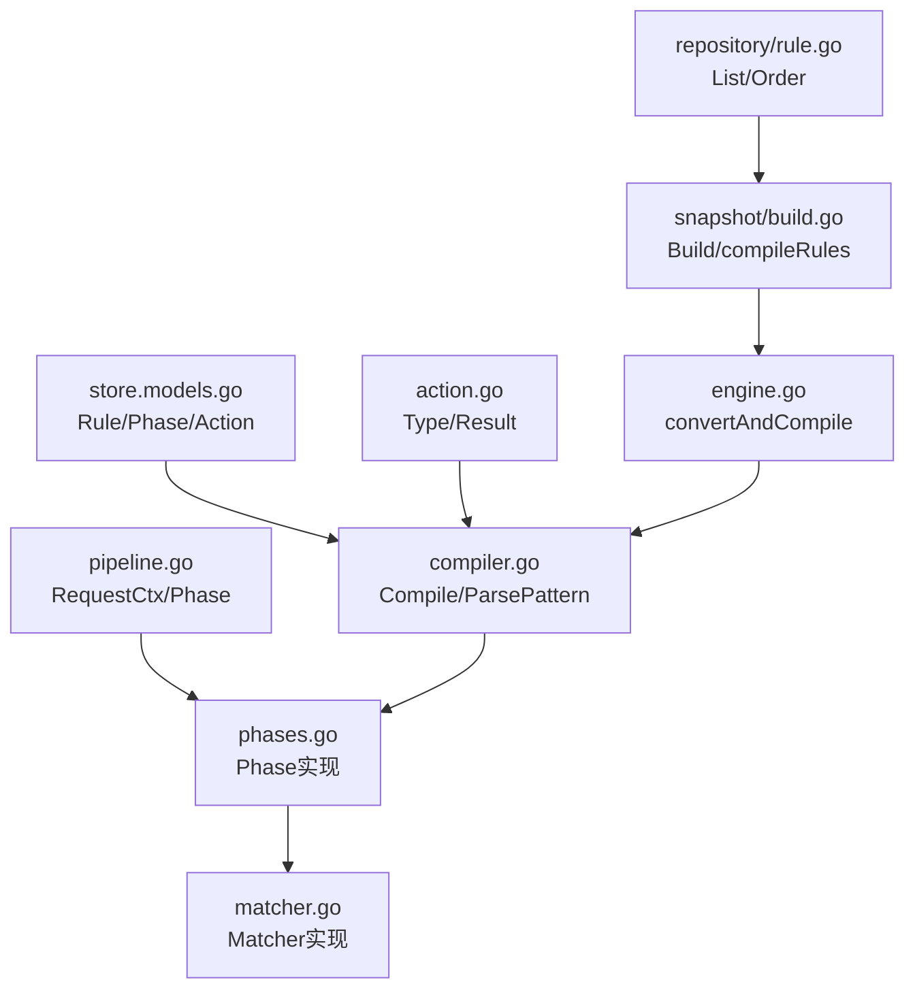

# 复合匹配器

<cite>
**本文引用的文件**
- [matcher.go](file://internal/core/rules/matcher.go)
- [matcher_test.go](file://internal/core/rules/matcher_test.go)
- [compiler.go](file://internal/core/rules/compiler.go)
- [build.go](file://internal/snapshot/build.go)
- [phases.go](file://internal/core/rules/phases.go)
- [rule-builder.tsx](file://frontend/components/rule-builder.tsx)
- [rule-pattern-builder.tsx](file://frontend/components/rule-pattern-builder.tsx)
- [规则编译器.md](file://docs/扩展与插件/规则引擎扩展/规则编译器扩展.md)
- [规则匹配器.md](file://docs/WAF 引擎系统/规则匹配器.md)
</cite>

## 目录
1. [简介](#简介)
2. [项目结构](#项目结构)
3. [核心组件](#核心组件)
4. [架构总览](#架构总览)
5. [详细组件分析](#详细组件分析)
6. [依赖关系分析](#依赖关系分析)
7. [性能考虑](#性能考虑)
8. [故障排除指南](#故障排除指南)
9. [结论](#结论)
10. [附录](#附录)

## 简介
本文件面向“复合匹配器”的技术文档，系统阐述以下内容：
- 复合匹配器的实现原理与短路求值策略：AND、OR、NOT 三类逻辑运算符如何工作，以及在匹配失败/成功时的提前退出机制。
- cc_rate 复合匹配器的实现细节：滑动窗口计数、阈值检测、阻断持续时间管理、客户端隔离键的设计与清理策略。
- 复合条件的 JSON 解析与递归构建过程：从 JSON 字符串到 AST 的递归构建，以及 buildCompound 的分派逻辑。
- 配置示例与最佳实践：多条件组合、速率限制与内容检查结合、复杂业务逻辑的实现思路。
- 性能特性与内存管理：正则缓存、规则排序、短路策略、复合规则的代价与优化建议。

## 项目结构
复合匹配器位于后端 Go 模块的 internal/core/rules 子系统，配合前端可视化构建器与管理端 API 共同构成完整的规则生命周期：从用户在前端界面构建规则，到后端解析与编译，再到引擎在请求处理过程中按阶段执行。

图表来源
- [规则编译器扩展.md:38-65](file://docs/扩展与插件/规则引擎扩展/规则编译器扩展.md#L38-L65)
- [rule-builder.tsx:1-556](file://frontend/components/rule-builder.tsx#L1-L556)
- [rule-pattern-builder.tsx:1-288](file://frontend/components/rule-pattern-builder.tsx#L1-L288)
- [compiler.go:1-91](file://internal/core/rules/compiler.go#L1-L91)
- [matcher.go:1-763](file://internal/core/rules/matcher.go#L1-L763)
- [phases.go:1-569](file://internal/core/rules/phases.go#L1-L569)

章节来源
- [规则编译器扩展.md:34-76](file://docs/扩展与插件/规则引擎扩展/规则编译器扩展.md#L34-L76)
- [规则匹配器.md:152-173](file://docs/WAF 引擎系统/规则匹配器.md#L152-L173)

## 核心组件
- Matcher 接口：统一的匹配抽象，接收 MatchCtx 并返回布尔值。
- MatchCtx：请求上下文，包含客户端 IP、HTTP 方法、路径、原始查询字符串、请求头映射。
- Compiled：编译后的规则，持有已构建的 Matcher，并按优先级排序。
- 内置匹配器：IP CIDR、路径前缀/精确/正则、查询字符串包含/正则、头部包含/正则、方法、内容类型、User-Agent、body_contains、query_param、always/never 等。
- 复合匹配器：and/or/not 组合，支持 JSON 表达式。
- 正则缓存：全局 RWMutex 保护的正则表达式缓存，避免重复编译。

章节来源
- [规则匹配器.md:152-173](file://docs/WAF 引擎系统/规则匹配器.md#L152-L173)
- [matcher.go:12-15](file://internal/core/rules/matcher.go#L12-L15)
- [phases.go:31-36](file://internal/core/rules/phases.go#L31-L36)
- [compiler.go:11-27](file://internal/core/rules/compiler.go#L11-L27)

## 架构总览
复合匹配器在引擎中通过多阶段执行，每个阶段遍历对应规则集合，命中即根据动作类型决定是否短路或继续。MatchCtx 由 pipeline.RequestCtx 转换而来，确保规则只访问所需字段。

图表来源
- [规则匹配器.md:99-120](file://docs/WAF 引擎系统/规则匹配器.md#L99-L120)
- [phases.go:40-94](file://internal/core/rules/phases.go#L40-L94)

## 详细组件分析

### 复合匹配器：AND/OR/NOT 的短路求值
- andMatcher：对所有子条件逐一求值，若任一为假则立即返回 false；只有当所有子条件都为真且至少有一个子条件时才返回 true。
- orMatcher：对所有子条件逐一求值，若任一为真则立即返回 true；只有当所有子条件都为假时才返回 false。
- notMatcher：对唯一子条件取反，若子条件为真则返回 false，反之亦然。
- 递归构建：parseCompoundJSON 将 JSON 字符串解析为 compoundCondition，随后 buildCompound 递归构建子匹配器树。

图表来源
- [matcher.go:98-107](file://internal/core/rules/matcher.go#L98-L107)

章节来源
- [matcher.go:98-124](file://internal/core/rules/matcher.go#L98-L124)
- [matcher_test.go:30-88](file://internal/core/rules/matcher_test.go#L30-L88)

### cc_rate 复合匹配器：滑动窗口计数与阻断管理
cc_rate 作为特殊的复合匹配器，其内部包装一个 child 匹配器，仅当 child 匹配成功时才进入计数逻辑。计数状态按客户端与 Host 组合键隔离，支持滑动窗口内的阈值检测与阻断持续时间管理。

关键点：
- 子条件匹配：child.Match 成功后才进入计数逻辑；否则直接返回 false。
- 滑动窗口：每个客户端在当前窗口内累计计数，窗口到期后重置。
- 阈值检测：达到阈值后触发阻断；若设置了阻断持续时间，则在持续时间内直接返回阻断。
- 客户端隔离：键由客户端 IP 与 Host 头组成，确保不同 Host 下的独立计数。
- 内存清理：每分钟扫描一次，删除已过期的计数状态，避免内存无限增长。

图表来源
- [matcher.go:33-72](file://internal/core/rules/matcher.go#L33-L72)
- [matcher.go:74-94](file://internal/core/rules/matcher.go#L74-L94)

章节来源
- [matcher.go:17-31](file://internal/core/rules/matcher.go#L17-L31)
- [matcher.go:33-72](file://internal/core/rules/matcher.go#L33-L72)
- [matcher_test.go:222-249](file://internal/core/rules/matcher_test.go#L222-L249)

### JSON 解析与递归构建：parseCompoundJSON 与 buildCompound
复合条件支持通过 JSON 表达式描述，例如：
- AND/OR/NOT：顶层包含 op 与 children 字段。
- cc_rate：顶层包含 op: "cc_rate"、children、window、threshold、duration。
- 基础匹配器：顶层包含 kind 与 arg。

解析流程：
- ParsePattern 识别 DSL 或 JSON；当输入以 { 开头时，判定为复合 JSON。
- parseCompoundJSON 将 JSON 字符串反序列化为 compoundCondition。
- buildCompound 根据 op 分派：and/or/not/children[0] 的递归构建；cc_rate 构建 ccRateMatcher；默认回退到基础匹配器构建。

图表来源
- [compiler.go:61-90](file://internal/core/rules/compiler.go#L61-L90)
- [matcher.go:718-724](file://internal/core/rules/matcher.go#L718-L724)
- [matcher.go:726-762](file://internal/core/rules/matcher.go#L726-L762)

章节来源
- [compiler.go:61-90](file://internal/core/rules/compiler.go#L61-L90)
- [matcher.go:708-762](file://internal/core/rules/matcher.go#L708-L762)
- [matcher_test.go:30-88](file://internal/core/rules/matcher_test.go#L30-L88)

### 前端可视化构建：DSL 生成与切换
前端提供了可视化的规则构建器，支持：
- 简单模式：kind:arg 形式的 DSL。
- 复合模式：通过 AND/OR/NOT 组合多个条件，最终生成 JSON 字符串。
- 切换逻辑：简单模式与复合模式之间的相互转换，以及 DSL 的实时生成。

图表来源
- [rule-builder.tsx:119-135](file://frontend/components/rule-builder.tsx#L119-L135)
- [rule-pattern-builder.tsx:220-245](file://frontend/components/rule-pattern-builder.tsx#L220-L245)

章节来源
- [rule-builder.tsx:99-135](file://frontend/components/rule-builder.tsx#L99-L135)
- [rule-pattern-builder.tsx:198-245](file://frontend/components/rule-pattern-builder.tsx#L198-L245)

## 依赖关系分析
- 编译器依赖
  - store.Rule、store.RulePhase、store.RuleAction
  - action.Type、action.Result
  - pipeline.RequestCtx（用于上下文转换）
- 运行时依赖
  - phases.go 中的 Phase 实现依赖 Compiled 列表
  - action.Result 的 IsTerminal/IsDrop/ShouldLog 控制短路与日志
- 快照与仓库
  - snapshot.Build 从数据库加载规则并排序
  - repository.RuleRepo 提供 CRUD 与排序查询

图表来源
- [规则编译器扩展.md:339-347](file://docs/扩展与插件/规则引擎扩展/规则编译器扩展.md#L339-L347)
- [compiler.go:1-91](file://internal/core/rules/compiler.go#L1-L91)
- [matcher.go:1-763](file://internal/core/rules/matcher.go#L1-L763)
- [phases.go:1-569](file://internal/core/rules/phases.go#L1-L569)
- [build.go:357-408](file://internal/snapshot/build.go#L357-L408)

章节来源
- [规则编译器扩展.md:326-337](file://docs/扩展与插件/规则引擎扩展/规则编译器扩展.md#L326-L337)
- [规则匹配器.md:346-376](file://docs/WAF 引擎系统/规则匹配器.md#L346-L376)

## 性能考虑
- 正则表达式缓存：cachedCompile 使用全局 RWMutex 保护的 map 缓存已编译的正则，避免重复编译。
- 规则排序：按 Priority 与 ID 排序，减少不必要的匹配尝试。
- 短路执行：Allow 与终端动作（Intercept/Drop）立即终止后续阶段，降低整体延迟。
- 复合规则：AND/OR/NOT 的短路特性在匹配失败时提前退出，减少子条件检查次数。
- cc_rate 内存管理：每分钟清理过期状态，避免内存无限增长；客户端隔离键避免跨 Host 的误判。
- 建议
  - 合理设置 Priority，将高频命中规则置于前面
  - 使用前缀匹配替代复杂正则，必要时利用缓存
  - 复合规则尽量合并，减少规则数量
  - 避免过于宽泛的正则，防止回溯开销过大

章节来源
- [规则匹配器.md:346-376](file://docs/WAF 引擎系统/规则匹配器.md#L346-L376)
- [规则编译器扩展.md:429-442](file://docs/扩展与插件/规则引擎扩展/规则编译器扩展.md#L429-L442)
- [matcher.go:681-704](file://internal/core/rules/matcher.go#L681-L704)

## 故障排除指南
- 规则不生效
  - 检查 ParsePattern 是否正确识别 kind/arg
  - 确认规则 enabled=true 且 priority 设置合理
  - 参考测试用例验证预期行为
- 正则规则异常
  - 检查正则是否有效，无效时返回 neverMatcher
  - 利用正则缓存一致性测试验证缓存命中
- 复合规则不匹配
  - 确认 JSON 结构合法，children 数组非空
  - 使用单元测试验证 and/or/not 的组合逻辑
- 头部匹配不准确
  - 注意大小写不敏感比较，确认头部键名一致
- cc_rate 不按预期阻断
  - 检查 window/threshold/duration 配置
  - 确认客户端隔离键（IP|Host）是否正确
  - 查看状态清理周期与阻断持续时间

章节来源
- [规则匹配器.md:300-326](file://docs/WAF 引擎系统/规则匹配器.md#L300-L326)
- [matcher_test.go:222-249](file://internal/core/rules/matcher_test.go#L222-L249)

## 结论
复合匹配器通过清晰的接口抽象与阶段化执行，内置多种高效匹配器并提供复合条件能力。AND/OR/NOT 的短路语义与正则缓存、优先级排序、cc_rate 的滑动窗口与阻断管理共同构成了高性能、可扩展的规则匹配体系。开发者可基于 Matcher 接口扩展自定义匹配器，并遵循现有参数解析与测试规范，确保规则稳定与可维护。

## 附录

### 配置示例与最佳实践
- 多条件组合
  - AND：要求路径以 /admin 开头且方法为 POST。
  - OR：路径为 /.env 或 .git/config。
  - NOT：对允许 IP 段取反，实现黑名单效果。
- 速率限制与内容检查结合
  - 使用 cc_rate 包裹内容检查（如路径为 /login），在指定时间窗口内对命中条件的请求进行计数，达到阈值后阻断一段时间。
  - 可按 Host 进行隔离，避免跨站点影响。
- 复杂业务逻辑
  - 将多个简单规则组合为复合规则，减少规则数量与匹配成本。
  - 合理设置优先级，将高频规则前置，利用短路机制降低整体延迟。

章节来源
- [matcher_test.go:30-88](file://internal/core/rules/matcher_test.go#L30-L88)
- [matcher_test.go:222-249](file://internal/core/rules/matcher_test.go#L222-L249)
- [build.go:381-401](file://internal/snapshot/build.go#L381-L401)