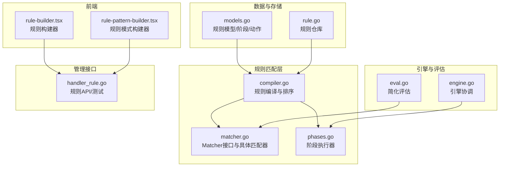
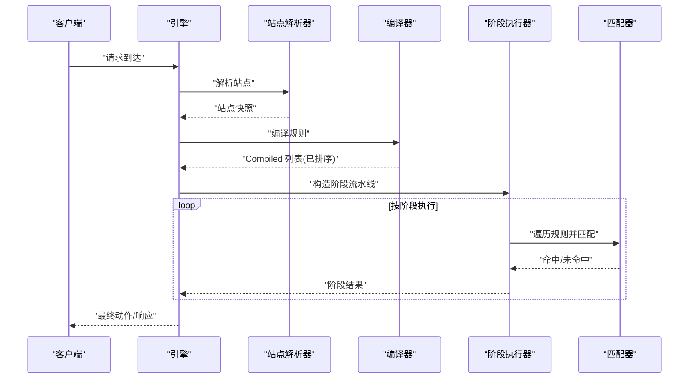
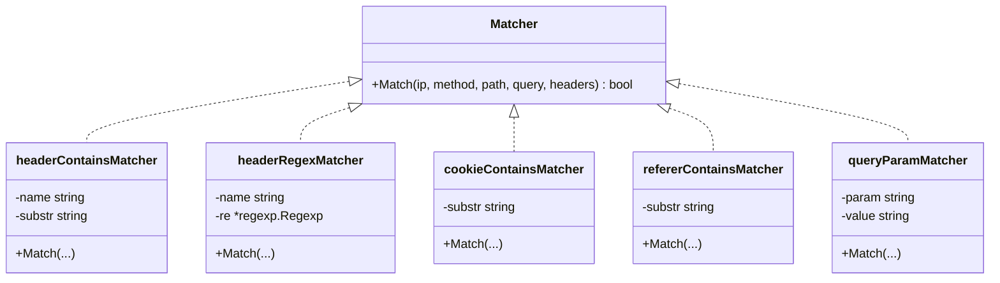
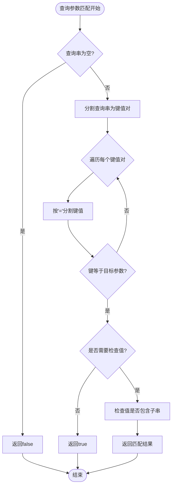
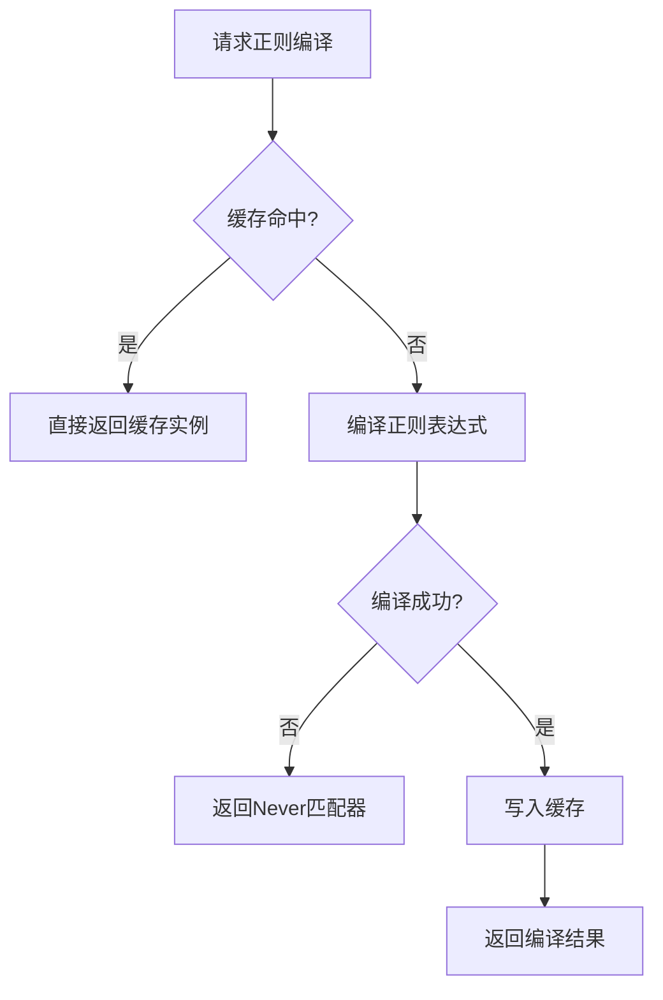
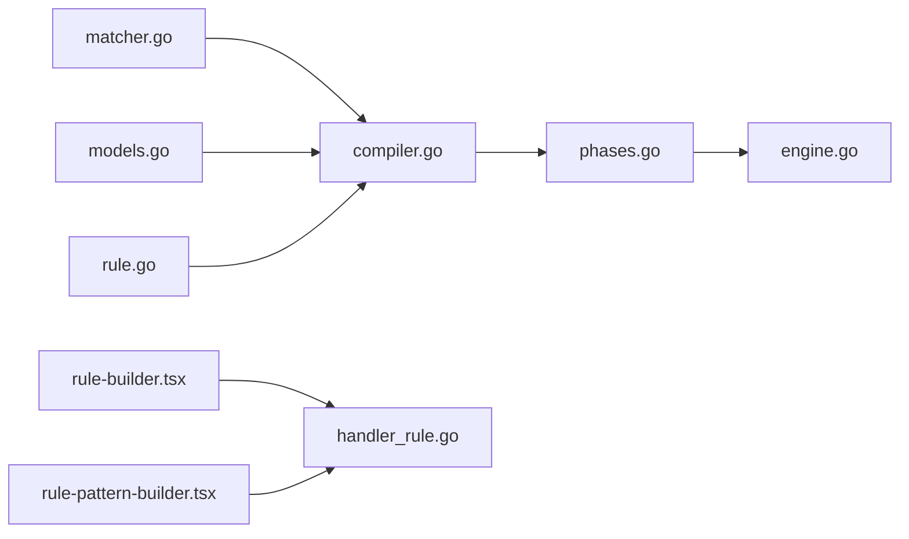

# 头部和查询参数匹配器

> [返回 WAF 引擎系统](../../WAF 引擎系统.md)

<cite>
**本文档引用的文件**
- [matcher.go](file://internal/core/rules/matcher.go)
- [matcher_test.go](file://internal/core/rules/matcher_test.go)
- [compiler_test.go](file://internal/core/rules/compiler_test.go)
- [规则匹配器.md](file://docs/WAF 引擎系统/规则匹配器.md)
- [匹配器开发.md](file://docs/扩展与插件/规则引擎扩展/匹配器开发.md)
- [自定义规则阶段.md](file://docs/WAF 引擎系统/处理阶段详解/自定义规则阶段.md)
- [validate.go](file://internal/admin/rule/validate.go)
</cite>

## 目录
1. [简介](#简介)
2. [项目结构](#项目结构)
3. [核心组件](#核心组件)
4. [架构总览](#架构总览)
5. [详细组件分析](#详细组件分析)
6. [依赖分析](#依赖分析)
7. [性能考虑](#性能考虑)
8. [故障排查指南](#故障排查指南)
9. [结论](#结论)
10. [附录](#附录)

## 简介
本文档深入解析 OpenWAF 中头部和查询参数匹配器的实现原理与配置语法，涵盖大小写不敏感匹配、正则表达式匹配、性能优化策略，以及实际应用场景中的配置示例。读者将能够理解如何使用 block_header、block_header_regex、block_user_agent、block_user_agent_regex、cookie_contains、referer_contains、query_contains、query_regex、query_param 等规则类型来构建强大的安全防护策略。

## 项目结构
头部和查询参数匹配器位于 internal/core/rules/matcher.go 文件中，配合编译器、阶段执行器与引擎共同构成完整的规则处理链路。相关文档位于 docs/WAF 引擎系统/规则匹配器.md 和扩展与插件/规则引擎扩展/匹配器开发.md。

图表来源
- [规则匹配器.md:47-77](file://docs/WAF 引擎系统/规则匹配器.md#L47-L77)

章节来源
- [规则匹配器.md:34-46](file://docs/WAF 引擎系统/规则匹配器.md#L34-L46)

## 核心组件
- Matcher 接口：统一的匹配抽象，接收客户端 IP、HTTP 方法、路径、查询串、请求头等上下文，返回布尔匹配结果。
- 具体匹配器：
  - 组合匹配器：and/or/not，支持嵌套复合规则。
  - 字段匹配器：IP/CIDR、路径前缀/精确/正则、查询串包含/正则、请求头包含/正则、方法、Content-Type、User-Agent、Body 包含、查询参数等。
- 编译器：将规则模型转换为运行时可直接匹配的 Compiled 结构，并按优先级排序。
- 阶段执行器：将规则按阶段组织，逐阶段执行，支持短路（如 ACL 中 Allow 命中即跳过后续阶段）。
- 引擎：协调站点解析、规则编译与阶段流水线执行。
- 正则缓存：全局正则编译缓存，避免重复编译带来的性能损耗。

章节来源
- [规则匹配器.md:103-122](file://docs/WAF 引擎系统/规则匹配器.md#L103-L122)

## 架构总览
规则匹配器的整体工作流如下：
- 规则从数据库加载，经编译器转换为 Compiled 列表并按优先级排序。
- 引擎根据请求上下文构建 MatchCtx，交由各阶段执行器遍历规则进行匹配。
- ACL 阶段命中 Allow 可短路后续阶段；其他阶段命中规则即产生动作结果。
- 引擎将阶段结果汇总，返回最终动作与观察命中集合。

图表来源
- [规则匹配器.md:130-150](file://docs/WAF 引擎系统/规则匹配器.md#L130-L150)

## 详细组件分析

### 头部匹配器实现原理
头部匹配器支持两种核心模式：包含匹配与正则匹配。实现细节如下：

- 大小写不敏感匹配
  - headerContainsMatcher：将头部名称转换为小写后进行匹配，确保大小写不敏感。
  - headerRegexMatcher：同样将头部名称转换为小写，使用预编译的正则表达式进行匹配。
  - lookupHeaderValue：通过字符串相等性比较（忽略大小写）查找头部值。

- 正则表达式匹配
  - cachedCompile：全局互斥锁保护的正则编译缓存，避免重复编译。
  - block_header_regex、block_user_agent_regex、header_regex：支持复杂的头部内容匹配。

- 性能优化
  - 正则缓存：读多写少场景下先读锁再写锁，提升并发性能。
  - 头部查找：使用 strings.EqualFold 进行大小写不敏感比较，避免额外的字符串转换。

图表来源
- [规则匹配器.md:175-266](file://docs/WAF 引擎系统/规则匹配器.md#L175-L266)
- [matcher.go:158-173](file://internal/core/rules/matcher.go#L158-L173)
- [matcher.go:474-496](file://internal/core/rules/matcher.go#L474-L496)
- [matcher.go:339-359](file://internal/core/rules/matcher.go#L339-L359)

章节来源
- [matcher.go:158-173](file://internal/core/rules/matcher.go#L158-L173)
- [matcher.go:474-496](file://internal/core/rules/matcher.go#L474-L496)
- [matcher.go:339-359](file://internal/core/rules/matcher.go#L339-L359)

### 查询参数匹配器实现原理
查询参数匹配器支持两种核心模式：存在性检查与值包含检查。实现细节如下：

- query_contains：直接在原始查询字符串上进行包含匹配，时间复杂度 O(n)。
- query_regex：使用缓存的正则表达式进行查询字符串匹配。
- query_param：解析查询串，支持仅检查参数存在或包含子串。

图表来源
- [matcher.go:344-359](file://internal/core/rules/matcher.go#L344-L359)

章节来源
- [matcher.go:146-156](file://internal/core/rules/matcher.go#L146-L156)
- [matcher.go:344-359](file://internal/core/rules/matcher.go#L344-L359)

### 大小写不敏感匹配机制
头部匹配器通过以下机制实现大小写不敏感匹配：

- 名称标准化：在构建匹配器时将头部名称转换为小写，确保后续匹配的一致性。
- 值查找：lookupHeaderValue 使用 strings.EqualFold 进行头部值的查找，忽略大小写差异。
- User-Agent 特例：block_user_agent 和 block_user_agent_regex 直接使用 "user-agent" 作为头部名称，确保与浏览器发送的标准头部一致。

章节来源
- [matcher.go:539-568](file://internal/core/rules/matcher.go#L539-L568)
- [matcher.go:82-94](file://internal/core/rules/matcher.go#L82-L94)

### 正则表达式匹配与缓存
正则表达式匹配器的实现包含以下关键特性：

- 编译缓存：cachedCompile 使用全局互斥锁保护的 map 缓存已编译的正则，避免重复编译。
- 并发安全：读多写少场景下先读锁再写锁，提升并发性能。
- 失效策略：当前实现未提供显式失效机制，建议在规则热更新时结合业务重启或定期清理策略。

图表来源
- [规则匹配器.md:351-361](file://docs/WAF 引擎系统/规则匹配器.md#L351-L361)
- [matcher.go:686-704](file://internal/core/rules/matcher.go#L686-L704)

章节来源
- [matcher.go:686-704](file://internal/core/rules/matcher.go#L686-L704)

### 配置语法详解

#### 头部匹配器配置语法
- block_header:Header-Name:value
  - 作用：检查指定头部是否包含指定子串
  - 示例：block_header:User-Agent:sqlmap
- block_header_regex:Header-Name:pattern
  - 作用：使用正则表达式检查指定头部内容
  - 示例：block_header_regex:Referer:(?i)malicious\.example\.com
- block_user_agent:value
  - 作用：检查 User-Agent 头部是否包含指定子串
  - 示例：block_user_agent:curl
- block_user_agent_regex:pattern
  - 作用：使用正则表达式检查 User-Agent 头部
  - 示例：block_user_agent_regex:(?i)(sqlmap|nikto|nmap)
- cookie_contains:value
  - 作用：检查 Cookie 头部是否包含指定子串
  - 示例：cookie_contains:sessionid=
- referer_contains:value
  - 作用：检查 Referer 头部是否包含指定子串
  - 示例：referer_contains:attacker-domain.com

#### 查询参数匹配器配置语法
- query_contains:value
  - 作用：检查查询字符串是否包含指定子串
  - 示例：query_contains:union%20select
- query_regex:pattern
  - 作用：使用正则表达式检查查询字符串
  - 示例：query_regex:(?i)union\s+select
- query_param:paramName=value
  - 作用：检查指定查询参数是否存在且值包含指定子串
  - 示例：query_param:username=admin
- query_param:paramName
  - 作用：仅检查查询参数是否存在
  - 示例：query_param:token

章节来源
- [matcher.go:539-625](file://internal/core/rules/matcher.go#L539-L625)
- [规则匹配器.md:521-531](file://docs/WAF 引擎系统/规则匹配器.md#L521-L531)

### 实际应用配置示例

#### User-Agent 检测场景
- 阻断已知扫描器
  - block_user_agent_regex:(?i)(sqlmap|nikto|nmap|masscan|zgrab|nuclei)
- 允许特定爬虫
  - allow_user_agent:Googlebot
  - allow_user_agent:bingbot

#### Referer 验证场景
- 阻断跨站请求伪造
  - block_referer_contains:attacker-domain.com
- 允许特定域名
  - allow_referer_contains:trusted-domain.com

#### Cookie 内容检查场景
- 阻断无效会话
  - block_cookie_contains:invalid-session
- 检测恶意令牌
  - block_cookie_contains:malicious-token

#### 查询参数过滤场景
- SQL 注入防护
  - block_query_regex:(?i)(union\s+select|exec\s+xp_)
- 路径穿越检测
  - block_query_contains:../
- 参数存在性检查
  - block_query_param:admin
- 参数值过滤
  - block_query_param:username=admin

章节来源
- [matcher_test.go:169-207](file://internal/core/rules/matcher_test.go#L169-L207)
- [compiler_test.go:66-77](file://internal/core/rules/compiler_test.go#L66-L77)
- [validate.go:176-191](file://internal/admin/rule/validate.go#L176-L191)

## 依赖分析
- 组件耦合：
  - matcher.go 与 compiler.go：编译器依赖匹配器工厂与 DSL 解析。
  - phases.go 与 matcher.go：阶段执行器依赖匹配器接口与 MatchCtx。
  - engine.go：协调编译器与阶段执行器，依赖站点解析与快照。
  - models.go 与 rule.go：规则模型与仓库，为编译器提供数据源。
- 外部依赖：
  - 正则表达式库：用于正则匹配与缓存。
  - 网络库：用于 IP/CIDR 匹配。
  - 前端组件：规则构建器与测试工具，辅助规则开发与验证。

图表来源
- [规则匹配器.md:447-457](file://docs/WAF 引擎系统/规则匹配器.md#L447-L457)

章节来源
- [规则匹配器.md:436-479](file://docs/WAF 引擎系统/规则匹配器.md#L436-L479)

## 性能考虑
- 正则编译缓存：显著降低重复编译成本，建议在规则热更新时结合业务重启清理缓存。
- 规则排序：按 Priority 与 ID 排序，确保关键规则优先执行，减少后续匹配次数。
- 短路逻辑：ACL Allow 短路与其他阶段命中终止，减少不必要的匹配。
- 内容扫描限制：针对不同 Content-Type 限制扫描字节数与层级，避免大体积 Body 导致的性能问题。
- 建议：
  - 为高频正则表达式提供明确的缓存键，避免歧义。
  - 对复杂正则进行性能基准测试，必要时拆分为多个简单规则。
  - 合理设置规则数量与优先级，避免过多规则导致遍历成本过高。

章节来源
- [规则匹配器.md:480-490](file://docs/WAF 引擎系统/规则匹配器.md#L480-L490)

## 故障排查指南
- 规则不生效：
  - 检查规则是否启用（Enabled=true）。
  - 确认 Priority 设置是否合理，避免被更高优先级规则覆盖。
  - 使用前端规则构建器的"规则测试"功能进行本地验证。
- 正则匹配异常：
  - 确认正则表达式语法正确，避免编译失败导致 Never 匹配器。
  - 检查正则缓存是否命中，必要时重启服务清理缓存。
- ACL Allow 短路：
  - 确认 Allow 规则的 Priority 是否低于 Block 规则。
  - 检查 Allow 规则的参数是否正确匹配（如 CIDR）。
- API 测试：
  - 使用管理 API 的 TestRule 接口传入 Pattern 与请求上下文进行 Dry-run 测试。
- 单元测试参考：
  - matcher_test.go 与 compiler_test.go 提供了多种匹配场景的断言，可作为编写自测用例的参考。

章节来源
- [规则匹配器.md:492-514](file://docs/WAF 引擎系统/规则匹配器.md#L492-L514)

## 结论
头部和查询参数匹配器通过清晰的接口设计、稳定的编译与排序机制、高效的正则缓存与短路逻辑，实现了高性能、可扩展的规则匹配能力。结合前端规则构建器与管理 API，用户可以便捷地开发、测试与部署规则。建议在生产环境中合理设置规则优先级、控制正则复杂度，并利用缓存与短路机制提升整体性能。

## 附录

### 规则类型清单（前端展示）
- ACL：封禁 IP/CIDR、放行 IP/CIDR
- 路径：路径前缀、放行路径、路径精确、路径正则、放行路径正则
- 查询：查询包含、查询正则
- 请求头：请求头包含、放行请求头、请求头正则
- 协议：HTTP 方法、Content-Type
- Body：Body包含、Body正则

### DSL 格式
- 简单规则：kind:arg
- 复合规则：{"op":"and|or|not","children":[{"kind":"...","arg":"..."}...]}

章节来源
- [规则匹配器.md:520-534](file://docs/WAF 引擎系统/规则匹配器.md#L520-L534)