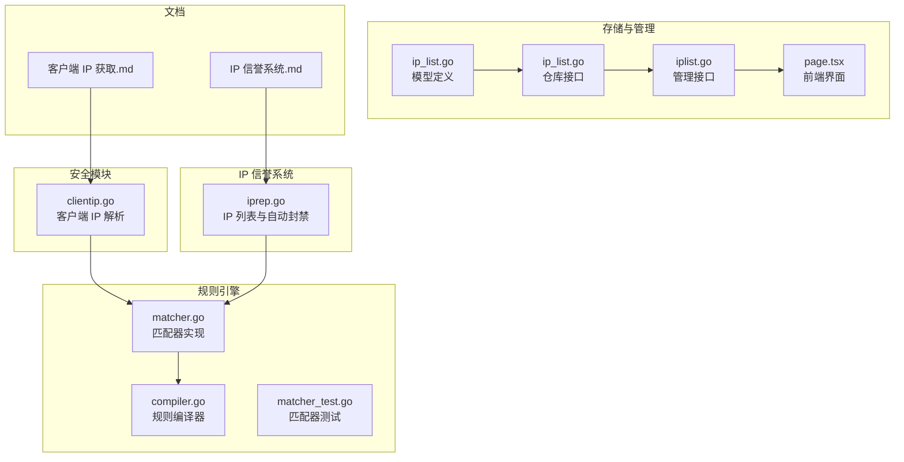
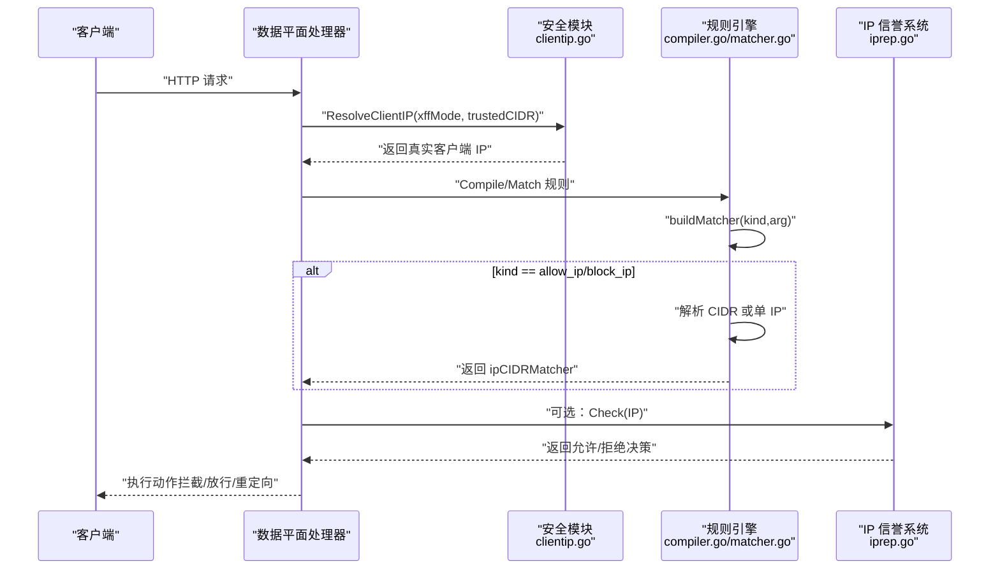
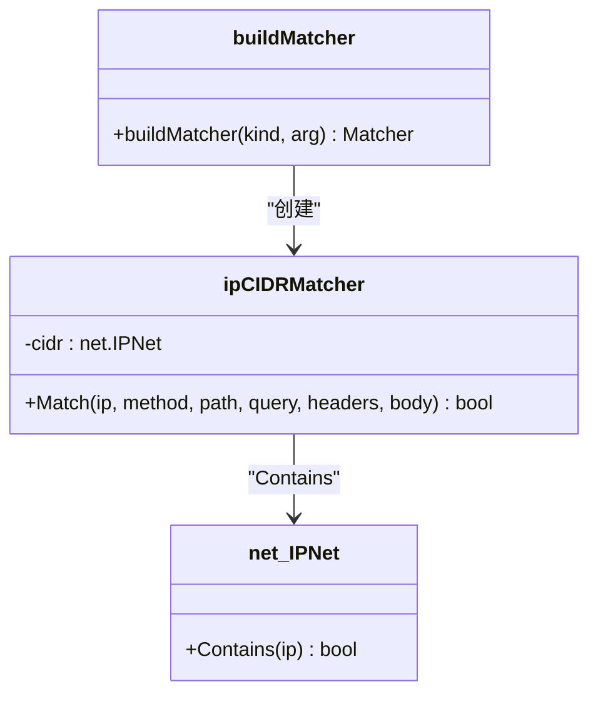
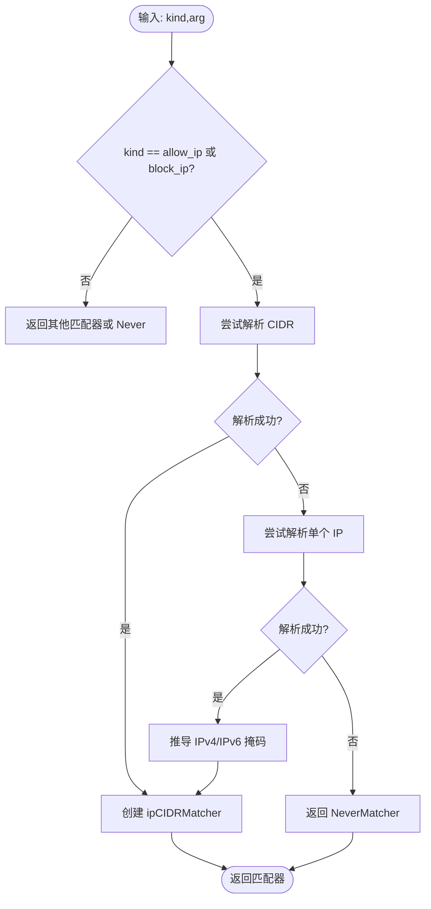
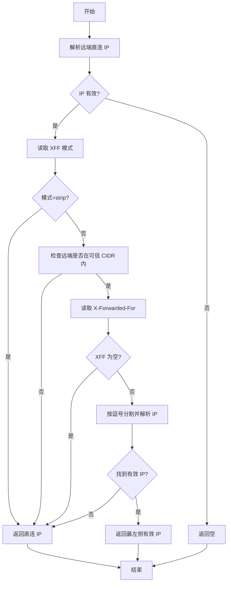
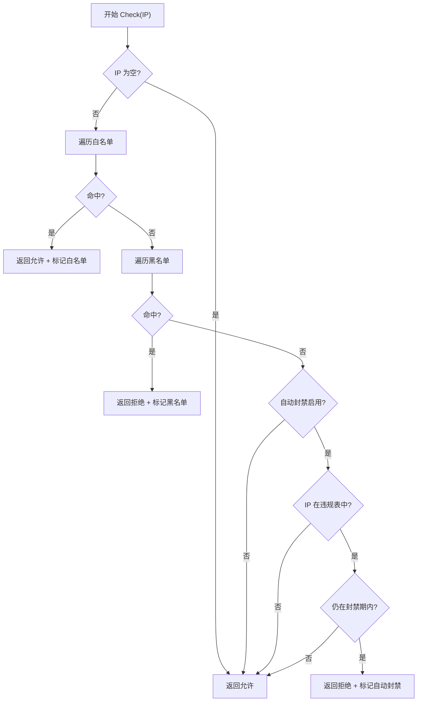
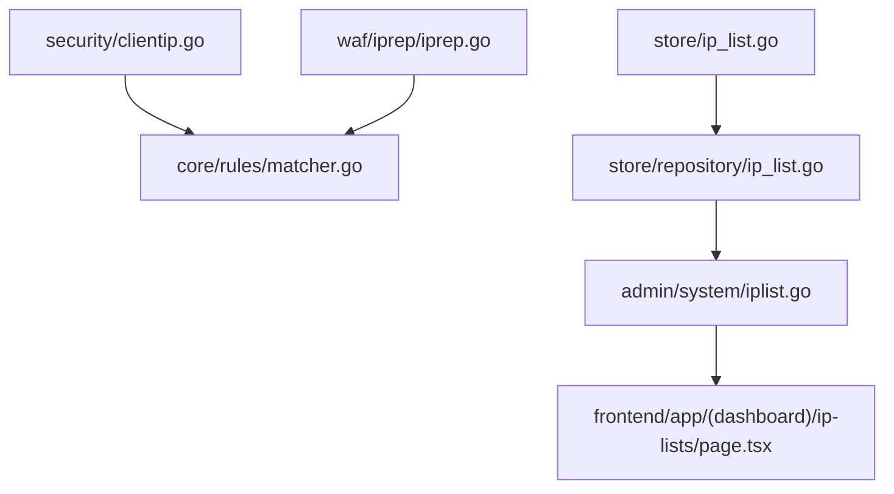

# 网络匹配器

> [返回 WAF 引擎系统](../../WAF 引擎系统.md)

<cite>
**本文档引用的文件**
- [matcher.go](file://internal/core/rules/matcher.go)
- [compiler.go](file://internal/core/rules/compiler.go)
- [matcher_test.go](file://internal/core/rules/matcher_test.go)
- [clientip.go](file://internal/security/clientip.go)
- [iprep.go](file://internal/waf/iprep/iprep.go)
- [ip_list.go](file://internal/store/ip_list.go)
- [ip_list.go](file://internal/store/repository/ip_list.go)
- [iplist.go](file://internal/admin/system/iplist.go)
- [page.tsx](file://frontend/app/(dashboard)/ip-lists/page.tsx)
- [IP 信誉系统.md](file://docs/安全防护功能/IP 信誉系统.md)
- [客户端 IP 获取.md](file://docs/安全机制/客户端 IP 获取.md)
</cite>

## 目录
1. [简介](#简介)
2. [项目结构](#项目结构)
3. [核心组件](#核心组件)
4. [架构概览](#架构概览)
5. [详细组件分析](#详细组件分析)
6. [依赖关系分析](#依赖关系分析)
7. [性能考虑](#性能考虑)
8. [故障排除指南](#故障排除指南)
9. [结论](#结论)
10. [附录](#附录)

## 简介
本文件面向网络匹配器，重点阐述 IP CIDR 匹配器的实现原理与使用方式，涵盖 IPv4/IPv6 地址解析、CIDR 范围计算、allow_ip 与 block_ip 匹配器的配置语法、支持的地址格式（单个 IP、CIDR 范围、IPv6）、实际应用场景、配置示例、错误处理机制、性能特性与缓存机制，以及在大规模规则中的优化策略。

## 项目结构
网络匹配器位于规则引擎子系统中，核心实现集中在规则匹配器与编译器模块，并与安全模块的客户端 IP 解析、IP 信誉系统协同工作。

**图表来源**
- [matcher.go:1-763](file://internal/core/rules/matcher.go#L1-L763)
- [compiler.go:1-91](file://internal/core/rules/compiler.go#L1-L91)
- [clientip.go:1-80](file://internal/security/clientip.go#L1-L80)
- [iprep.go:1-242](file://internal/waf/iprep/iprep.go#L1-L242)
- [ip_list.go:1-29](file://internal/store/ip_list.go#L1-L29)
- [ip_list.go:1-42](file://internal/store/repository/ip_list.go#L1-L42)
- [iplist.go:1-146](file://internal/admin/system/iplist.go#L1-L146)
- [page.tsx:34-110](file://frontend/app/(dashboard)/ip-lists/page.tsx#L34-L110)
- [IP 信誉系统.md:1-537](file://docs/安全防护功能/IP 信誉系统.md#L1-L537)
- [客户端 IP 获取.md:79-328](file://docs/安全机制/客户端 IP 获取.md#L79-L328)

**章节来源**
- [matcher.go:1-763](file://internal/core/rules/matcher.go#L1-L763)
- [compiler.go:1-91](file://internal/core/rules/compiler.go#L1-L91)
- [clientip.go:1-80](file://internal/security/clientip.go#L1-L80)
- [iprep.go:1-242](file://internal/waf/iprep/iprep.go#L1-L242)
- [ip_list.go:1-29](file://internal/store/ip_list.go#L1-L29)
- [ip_list.go:1-42](file://internal/store/repository/ip_list.go#L1-L42)
- [iplist.go:1-146](file://internal/admin/system/iplist.go#L1-L146)
- [page.tsx:34-110](file://frontend/app/(dashboard)/ip-lists/page.tsx#L34-L110)
- [IP 信誉系统.md:1-537](file://docs/安全防护功能/IP 信誉系统.md#L1-L537)
- [客户端 IP 获取.md:79-328](file://docs/安全机制/客户端 IP 获取.md#L79-L328)

## 核心组件
- IP CIDR 匹配器：基于 net.IPNet 的 Contains 判断，支持 IPv4/IPv6。
- 规则编译器：将 DSL 字符串解析为具体匹配器实例，内置 allow_ip/block_ip 解析逻辑。
- 客户端 IP 解析：根据 XFF 模式与可信 CIDR 获取真实客户端 IP。
- IP 信誉系统：提供白名单/黑名单与自动封禁，内部同样使用 CIDR 匹配。

**章节来源**
- [matcher.go:128-132](file://internal/core/rules/matcher.go#L128-L132)
- [compiler.go:29-59](file://internal/core/rules/compiler.go#L29-L59)
- [clientip.go:12-49](file://internal/security/clientip.go#L12-L49)
- [iprep.go:173-184](file://internal/waf/iprep/iprep.go#L173-L184)

## 架构概览
网络匹配器在请求处理流水线中的位置与协作关系如下：

**图表来源**
- [clientip.go:12-49](file://internal/security/clientip.go#L12-L49)
- [compiler.go:29-59](file://internal/core/rules/compiler.go#L29-L59)
- [matcher.go:498-517](file://internal/core/rules/matcher.go#L498-L517)
- [iprep.go:94-125](file://internal/waf/iprep/iprep.go#L94-L125)

**章节来源**
- [clientip.go:12-49](file://internal/security/clientip.go#L12-L49)
- [compiler.go:29-59](file://internal/core/rules/compiler.go#L29-L59)
- [matcher.go:498-517](file://internal/core/rules/matcher.go#L498-L517)
- [iprep.go:94-125](file://internal/waf/iprep/iprep.go#L94-L125)

## 详细组件分析

### IP CIDR 匹配器实现原理
- 地址解析与 CIDR 计算
  - 支持 IPv4/IPv6：通过 net.ParseCIDR 解析 CIDR，net.ParseIP 解析单个 IP。
  - 自动推导掩码：当输入为单个 IP 时，IPv4 推导为 /32，IPv6 推导为 /128。
  - 容错处理：解析失败时返回永不匹配的匹配器，避免规则无效导致的异常。
- 匹配过程
  - ipCIDRMatcher.Match 直接调用 net.IPNet.Contains(ip) 判断是否命中。
  - 仅在 ip 非空时进行判断，避免空指针。
- 复杂度与性能
  - 单次匹配为 O(1)（CIDR 判断），整体取决于规则数量与组合匹配器的复杂度。

**图表来源**
- [matcher.go:128-132](file://internal/core/rules/matcher.go#L128-L132)
- [matcher.go:498-517](file://internal/core/rules/matcher.go#L498-L517)

**章节来源**
- [matcher.go:128-132](file://internal/core/rules/matcher.go#L128-L132)
- [matcher.go:498-517](file://internal/core/rules/matcher.go#L498-L517)

### allow_ip 与 block_ip 匹配器
- 配置语法
  - allow_ip:<地址或CIDR>
  - block_ip:<地址或CIDR>
- 支持的地址格式
  - 单个 IPv4/IPv6 地址
  - CIDR 网段（IPv4/IPv6）
  - 自动识别 IPv4/IPv6 并推导对应掩码
- 实际应用场景
  - 白名单：允许特定来源（如运维网段、监控系统）访问管理后台。
  - 黑名单：阻止已知恶意 IP 或网段。
  - 与复合匹配器组合：与其他条件（路径、方法、头字段等）联合使用。
- 错误处理
  - 无法解析时返回永不匹配的匹配器，避免规则失效。
  - 与正则表达式缓存机制配合，提升编译效率。

**图表来源**
- [matcher.go:498-517](file://internal/core/rules/matcher.go#L498-L517)

**章节来源**
- [matcher.go:498-517](file://internal/core/rules/matcher.go#L498-L517)
- [matcher_test.go:10-28](file://internal/core/rules/matcher_test.go#L10-L28)

### 客户端 IP 解析与可信代理链
- XFF 模式与可信 CIDR
  - 支持 strip_all_and_set_remote 与 trust_outer_waf_cidr_then_take_leftmost 等模式。
  - 可信 CIDR 支持逗号、换行、分号分隔，单个 IP 或 CIDR 均可。
- 回退策略
  - 若 X-Forwarded-For 缺失或解析失败，回退到直连 IP。
- 复杂度
  - XFF 解析为线性扫描，复杂度 O(n)，n 为片段数；可信 CIDR 判定为 O(m)，m 为可信网段数。

**图表来源**
- [clientip.go:12-49](file://internal/security/clientip.go#L12-L49)
- [clientip.go:51-79](file://internal/security/clientip.go#L51-L79)

**章节来源**
- [clientip.go:12-49](file://internal/security/clientip.go#L12-L49)
- [clientip.go:51-79](file://internal/security/clientip.go#L51-L79)
- [客户端 IP 获取.md:140-161](file://docs/安全机制/客户端 IP 获取.md#L140-L161)

### IP 信誉系统与白名单/黑名单
- 数据结构
  - IPListEntry 支持 CIDR 与单 IP，可带注释与过期时间。
  - IPReputation 维护黑白名单与违规计数，支持自动封禁。
- 决策流程
  - 白名单优先：命中即放行。
  - 黑名单阻断：命中即拒绝。
  - 自动封禁：未命中黑白名单时检查违规状态。
- 匹配算法
  - 使用 net.IPNet.Contains 或 net.IP.Equal 进行匹配。
  - 支持 IPv4/IPv6 双栈。

**图表来源**
- [iprep.go:94-125](file://internal/waf/iprep/iprep.go#L94-L125)
- [iprep.go:173-184](file://internal/waf/iprep/iprep.go#L173-L184)

**章节来源**
- [iprep.go:94-125](file://internal/waf/iprep/iprep.go#L94-L125)
- [iprep.go:173-184](file://internal/waf/iprep/iprep.go#L173-L184)
- [IP 信誉系统.md:130-164](file://docs/安全防护功能/IP 信誉系统.md#L130-L164)

## 依赖关系分析
- 规则引擎依赖安全模块提供的真实客户端 IP。
- IP 信誉系统与规则引擎共享相同的 IP 匹配逻辑（net.IPNet.Contains）。
- 存储层提供 IP 列表的持久化与管理，前端界面支持增删改查。

**图表来源**
- [clientip.go:12-49](file://internal/security/clientip.go#L12-L49)
- [matcher.go:128-132](file://internal/core/rules/matcher.go#L128-L132)
- [ip_list.go:1-29](file://internal/store/ip_list.go#L1-29)
- [ip_list.go:1-42](file://internal/store/repository/ip_list.go#L1-L42)
- [iplist.go:1-146](file://internal/admin/system/iplist.go#L1-L146)
- [page.tsx:34-110](file://frontend/app/(dashboard)/ip-lists/page.tsx#L34-L110)
- [iprep.go:173-184](file://internal/waf/iprep/iprep.go#L173-L184)

**章节来源**
- [clientip.go:12-49](file://internal/security/clientip.go#L12-L49)
- [matcher.go:128-132](file://internal/core/rules/matcher.go#L128-L132)
- [ip_list.go:1-29](file://internal/store/ip_list.go#L1-L29)
- [ip_list.go:1-42](file://internal/store/repository/ip_list.go#L1-L42)
- [iplist.go:1-146](file://internal/admin/system/iplist.go#L1-L146)
- [page.tsx:34-110](file://frontend/app/(dashboard)/ip-lists/page.tsx#L34-L110)
- [iprep.go:173-184](file://internal/waf/iprep/iprep.go#L173-L184)

## 性能考虑
- 匹配器性能
  - ipCIDRMatcher 为 O(1) 判断，整体性能主要受限于规则数量与组合匹配器。
  - 正则表达式缓存（regex cache）避免重复编译，显著降低 CPU 开销。
- 客户端 IP 解析
  - XFF 解析为 O(n)，可信 CIDR 判定为 O(m)，n 为片段数，m 为可信网段数。
- IP 信誉系统
  - 白/黑名单匹配为 O(n+m)，n/m 为黑白名单条目数。
  - 自动封禁使用 sync.Map 快速查找，违规计数器使用互斥锁保护。
- 大规模规则优化策略
  - 合理拆分规则，利用复合匹配器减少重复计算。
  - 使用前缀树或更高效的数据结构（在现有实现基础上扩展）。
  - 将高频规则置于更高优先级，尽早短路。
  - 启用正则表达式缓存，避免重复编译。

**章节来源**
- [matcher.go:681-704](file://internal/core/rules/matcher.go#L681-L704)
- [clientip.go:12-49](file://internal/security/clientip.go#L12-L49)
- [iprep.go:126-155](file://internal/waf/iprep/iprep.go#L126-L155)
- [IP 信誉系统.md:397-420](file://docs/安全防护功能/IP 信誉系统.md#L397-L420)

## 故障排除指南
- allow_ip/block_ip 不生效
  - 检查地址格式是否正确（单 IP/CIDR/IPv6）。
  - 确认解析逻辑是否将输入转换为正确的 CIDR（/32 或 /128）。
  - 验证规则是否被编译并参与匹配。
- 客户端 IP 错误
  - 检查 XFF 模式与可信 CIDR 配置。
  - 确认代理链中 X-Forwarded-For 头是否正确设置。
- IP 信誉系统异常
  - 检查黑白名单是否正确加载。
  - 确认自动封禁阈值、窗口与持续时间设置是否合理。
  - 监控 ActiveBans 输出以确认封禁记录清理情况。

**章节来源**
- [matcher.go:498-517](file://internal/core/rules/matcher.go#L498-L517)
- [clientip.go:12-49](file://internal/security/clientip.go#L12-L49)
- [iprep.go:210-232](file://internal/waf/iprep/iprep.go#L210-L232)
- [IP 信誉系统.md:420-459](file://docs/安全防护功能/IP 信誉系统.md#L420-L459)

## 结论
网络匹配器通过简洁高效的 CIDR 匹配与完善的容错机制，为白名单/黑名单策略提供了稳定的基础。结合客户端 IP 解析与 IP 信誉系统的自动封禁能力，可在不同部署环境下实现灵活而强大的访问控制。在大规模规则场景下，建议充分利用正则缓存、规则优先级与复合匹配器，以获得更好的性能与可维护性。

## 附录

### 配置示例与最佳实践
- 常见配置
  - 白名单：allow_ip:192.168.1.0/24
  - 黑名单：block_ip:10.0.0.0/8
  - 单个 IPv6：block_ip:2001:db8::1
- 私有网络处理
  - 使用私有网段（如 10.0.0.0/8、172.16.0.0/12、192.168.0.0/16）作为 allow_ip，避免误封内部用户。
- 错误处理
  - 无效地址将导致规则不生效，需通过日志与测试验证。
- 性能优化
  - 合理设置自动封禁阈值与窗口，平衡安全与性能。
  - 使用复合匹配器减少重复匹配成本。

**章节来源**
- [matcher_test.go:90-110](file://internal/core/rules/matcher_test.go#L90-L110)
- [IP 信誉系统.md:475-501](file://docs/安全防护功能/IP 信誉系统.md#L475-L501)