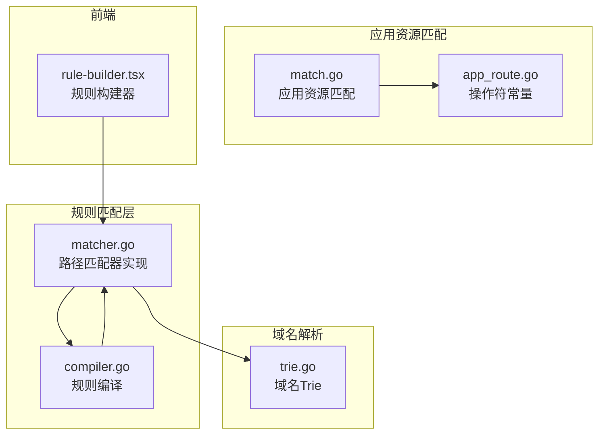
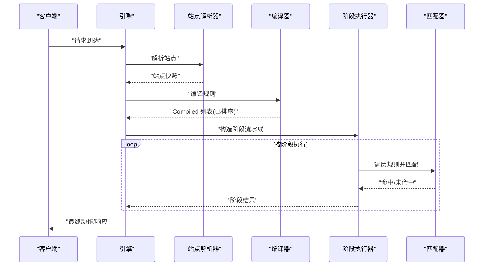
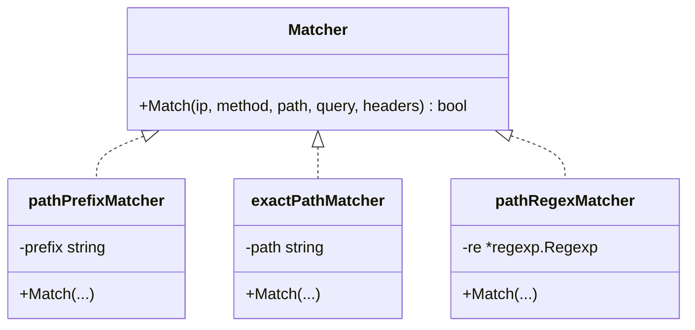
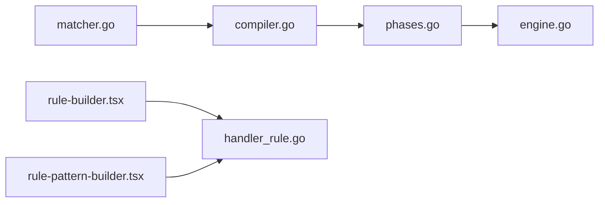

# 路径匹配器

> [返回 WAF 引擎系统](../../WAF 引擎系统.md)

<cite>
**本文档引用的文件**
- [matcher.go](file://internal/core/rules/matcher.go)
- [compiler.go](file://internal/core/rules/compiler.go)
- [matcher_test.go](file://internal/core/rules/matcher_test.go)
- [trie.go](file://internal/dataplane/trie.go)
- [match.go](file://internal/appresource/match.go)
- [app_route.go](file://internal/store/app_route.go)
- [rule-builder.tsx](file://frontend/components/rule-builder.tsx)
- [规则匹配器.md](file://docs/WAF 引擎系统/规则匹配器.md)
</cite>

## 目录
1. [简介](#简介)
2. [项目结构](#项目结构)
3. [核心组件](#核心组件)
4. [架构总览](#架构总览)
5. [详细组件分析](#详细组件分析)
6. [依赖分析](#依赖分析)
7. [性能考虑](#性能考虑)
8. [故障排查指南](#故障排查指南)
9. [结论](#结论)
10. [附录](#附录)

## 简介
本文件聚焦于路径匹配器的实现与使用，系统性阐述前缀匹配、精确匹配、正则表达式匹配的原理、性能差异与适用场景，详细说明 block_path、block_path_exact、block_path_regex 的配置语法与使用方法，并提供静态路径匹配、动态路径参数处理、正则表达式优化技巧与性能考虑。同时解释路径匹配在不同 HTTP 方法下的行为差异，以及与 URL 解码相关的注意事项。

## 项目结构
路径匹配器位于规则引擎的匹配层，与编译器、阶段执行器、引擎协同工作，形成完整的规则处理链路。核心文件职责如下：
- internal/core/rules/matcher.go：定义 Matcher 接口与具体匹配器实现，包含路径前缀、精确、正则匹配器。
- internal/core/rules/compiler.go：将规则模型编译为运行时可直接匹配的 Compiled 结构。
- internal/dataplane/trie.go：域名 Trie 实现，用于站点解析与主机匹配（与路径匹配互补）。
- internal/appresource/match.go：应用资源规则匹配，提供路径前缀/精确/正则等操作符。
- internal/store/app_route.go：应用路由规则的目标与操作符常量定义。
- frontend/components/rule-builder.tsx：前端规则构建器，支持路径匹配规则的可视化配置与测试。

图表来源
- [matcher.go:1-763](file://internal/core/rules/matcher.go#L1-L763)
- [compiler.go:1-91](file://internal/core/rules/compiler.go#L1-L91)
- [match.go:1-80](file://internal/appresource/match.go#L1-L80)
- [app_route.go:1-83](file://internal/store/app_route.go#L1-L83)
- [trie.go:1-203](file://internal/dataplane/trie.go#L1-L203)
- [rule-builder.tsx:1-520](file://frontend/components/rule-builder.tsx#L1-L520)

章节来源
- [matcher.go:1-763](file://internal/core/rules/matcher.go#L1-L763)
- [compiler.go:1-91](file://internal/core/rules/compiler.go#L1-L91)
- [match.go:1-80](file://internal/appresource/match.go#L1-L80)
- [app_route.go:1-83](file://internal/store/app_route.go#L1-L83)
- [trie.go:1-203](file://internal/dataplane/trie.go#L1-L203)
- [rule-builder.tsx:1-520](file://frontend/components/rule-builder.tsx#L1-L520)

## 核心组件
- Matcher 接口：统一的匹配抽象，接收客户端 IP、HTTP 方法、路径、查询串、请求头等上下文，返回布尔匹配结果。
- 路径匹配器：
  - pathPrefixMatcher：基于 strings.HasPrefix 的前缀匹配，时间复杂度 O(n)。
  - exactPathMatcher：基于字符串相等的精确匹配，时间复杂度 O(n)。
  - pathRegexMatcher：基于缓存编译的正则匹配，时间复杂度取决于表达式与输入长度。
- 编译器：将规则模型转换为运行时可直接匹配的 Compiled 结构，并按优先级排序。
- 应用资源匹配：提供路径前缀、精确、包含、正则等操作符，用于应用路由规则。

章节来源
- [matcher.go:11-14](file://internal/core/rules/matcher.go#L11-L14)
- [matcher.go:134-144](file://internal/core/rules/matcher.go#L134-L144)
- [matcher.go:175-179](file://internal/core/rules/matcher.go#L175-L179)
- [matcher.go:140-144](file://internal/core/rules/matcher.go#L140-L144)
- [compiler.go:11-27](file://internal/core/rules/compiler.go#L11-L27)
- [match.go:9-38](file://internal/appresource/match.go#L9-L38)
- [app_route.go:22-32](file://internal/store/app_route.go#L22-L32)

## 架构总览
路径匹配器的工作流如下：
- 规则从数据库加载，经编译器转换为 Compiled 列表并按优先级排序。
- 引擎根据请求上下文构建 MatchCtx，交由各阶段执行器遍历规则进行匹配。
- ACL 阶段命中 Allow 可短路后续阶段；其他阶段命中规则即产生动作结果。
- 引擎将阶段结果汇总，返回最终动作与观察命中集合。

图表来源
- [compiler.go:29-59](file://internal/core/rules/compiler.go#L29-L59)
- [matcher.go:25-27](file://internal/core/rules/matcher.go#L25-L27)

章节来源
- [compiler.go:29-59](file://internal/core/rules/compiler.go#L29-L59)
- [matcher.go:25-27](file://internal/core/rules/matcher.go#L25-L27)

## 详细组件分析

### 路径匹配器实现原理
- 前缀匹配（block_path）
  - 实现：pathPrefixMatcher 使用 strings.HasPrefix 判断路径是否以前缀开头。
  - 复杂度：O(n)，n 为前缀长度。
  - 适用场景：匹配目录层级、API 前缀等静态路径模式。
- 精确匹配（block_path_exact）
  - 实现：exactPathMatcher 使用字符串相等判断路径完全匹配。
  - 复杂度：O(n)，n 为路径长度。
  - 适用场景：匹配特定资源路径，如敏感文件。
- 正则匹配（block_path_regex）
  - 实现：pathRegexMatcher 使用缓存编译的 regexp.Regexp 进行匹配。
  - 复杂度：取决于正则表达式与输入长度，通常优于暴力字符串匹配。
  - 适用场景：动态路径参数、复杂路径模式匹配。

图表来源
- [matcher.go:134-144](file://internal/core/rules/matcher.go#L134-L144)
- [matcher.go:175-179](file://internal/core/rules/matcher.go#L175-L179)
- [matcher.go:140-144](file://internal/core/rules/matcher.go#L140-L144)

章节来源
- [matcher.go:134-144](file://internal/core/rules/matcher.go#L134-L144)
- [matcher.go:175-179](file://internal/core/rules/matcher.go#L175-L179)
- [matcher.go:140-144](file://internal/core/rules/matcher.go#L140-L144)

### 配置语法与使用方法
- block_path:arg
  - 语法：block_path:/admin
  - 行为：匹配以 /admin 开头的所有路径。
  - 使用场景：封禁管理后台目录。
- block_path_exact:arg
  - 语法：block_path_exact:/.env
  - 行为：仅匹配精确路径 /.env。
  - 使用场景：封禁特定敏感文件。
- block_path_regex:arg
  - 语法：block_path_regex:(?i)/admin.*\.php
  - 行为：使用正则表达式匹配路径。
  - 使用场景：匹配动态参数或复杂路径模式。

章节来源
- [compiler.go:61-90](file://internal/core/rules/compiler.go#L61-L90)
- [matcher.go:519-527](file://internal/core/rules/matcher.go#L519-L527)
- [matcher.go:551-552](file://internal/core/rules/matcher.go#L551-L552)
- [matcher.go:522-527](file://internal/core/rules/matcher.go#L522-L527)

### 具体配置示例
- 静态路径匹配
  - 封禁管理后台：block_path:/admin
  - 封禁配置文件：block_path_exact:/.env
- 动态路径参数处理
  - 匹配 API 版本：block_path_regex:(?i)/api/v[0-9]+/
  - 匹配 PHP 文件：block_path_regex:(?i)/.*\.php$
- 正则表达式优化技巧
  - 使用非贪婪匹配避免过度回溯。
  - 限定锚点 ^$ 提高匹配效率。
  - 缓存常用正则表达式，避免重复编译。

章节来源
- [matcher_test.go:112-129](file://internal/core/rules/matcher_test.go#L112-L129)
- [matcher_test.go:188-207](file://internal/core/rules/matcher_test.go#L188-L207)

### HTTP 方法差异与行为
- 方法无关性：路径匹配器仅比较路径字符串，不区分 HTTP 方法。
- 复合规则：可通过 AND/OR/NOT 组合路径匹配与其他条件（如方法、头部）形成更精细的规则。
- 短路逻辑：ACL 阶段命中 Allow 即短路，不影响其他阶段的路径匹配行为。

章节来源
- [matcher.go:181-185](file://internal/core/rules/matcher.go#L181-L185)
- [matcher.go:100-118](file://internal/core/rules/matcher.go#L100-L118)

### URL 解码注意事项
- 路径解码：规则匹配基于原始 URL 路径字符串，不进行额外解码处理。
- 编码路径：若规则中包含特殊字符，应使用规则的实际编码形式进行匹配。
- 查询串：查询串匹配独立于路径匹配，使用 block_query_contains 或 block_query_regex。

章节来源
- [matcher.go:136-144](file://internal/core/rules/matcher.go#L136-L144)
- [matcher.go:148-156](file://internal/core/rules/matcher.go#L148-L156)

### 应用资源路径匹配
除了规则引擎的路径匹配外，应用资源规则也支持路径匹配：
- 操作符：prefix、suffix、contains、regex 等。
- 目标：request_path、full_http_request 等。
- 用途：记录符合特定路径模式的资源访问。

章节来源
- [match.go:14-38](file://internal/appresource/match.go#L14-L38)
- [app_route.go:9-32](file://internal/store/app_route.go#L9-L32)

## 依赖分析
- 组件耦合：
  - matcher.go 与 compiler.go：编译器依赖匹配器工厂与 DSL 解析。
  - phases.go 与 matcher.go：阶段执行器依赖匹配器接口与 MatchCtx。
  - engine.go：协调编译器与阶段执行器，依赖站点解析与快照。
- 外部依赖：
  - 正则表达式库：用于正则匹配与缓存。
  - 网络库：用于 IP/CIDR 匹配。
  - 前端组件：规则构建器与测试工具，辅助规则开发与验证。

图表来源
- [matcher.go:1-763](file://internal/core/rules/matcher.go#L1-L763)
- [compiler.go:1-91](file://internal/core/rules/compiler.go#L1-L91)
- [rule-builder.tsx:1-520](file://frontend/components/rule-builder.tsx#L1-L520)

章节来源
- [matcher.go:1-763](file://internal/core/rules/matcher.go#L1-L763)
- [compiler.go:1-91](file://internal/core/rules/compiler.go#L1-L91)
- [rule-builder.tsx:1-520](file://frontend/components/rule-builder.tsx#L1-L520)

## 性能考虑
- 正则编译缓存：cachedCompile 使用全局互斥锁保护的 map 缓存已编译的正则，避免重复编译。
- 规则排序：按 Priority 与 ID 排序，确保关键规则优先执行，减少后续匹配次数。
- 短路逻辑：ACL Allow 短路与其他阶段命中终止，减少不必要的匹配。
- 字符串操作优化：使用 strings.HasPrefix/Contains 等内置函数，避免自定义实现；正则表达式尽量简洁，避免回溯风暴。
- 建议：
  - 为高频正则表达式提供明确的缓存键，避免歧义。
  - 对复杂正则进行性能基准测试，必要时拆分为多个简单规则。
  - 合理设置规则数量与优先级，避免过多规则导致遍历成本过高。

章节来源
- [matcher.go:273-296](file://internal/core/rules/matcher.go#L273-L296)
- [compiler.go:52-59](file://internal/core/rules/compiler.go#L52-L59)

## 故障排查指南
- 规则不生效：
  - 检查规则是否启用（Enabled=true）。
  - 确认 Priority 设置是否合理，避免被更高优先级规则覆盖。
  - 使用前端规则构建器的"规则测试"功能进行本地验证。
- 正则匹配异常：
  - 确认正则表达式语法正确，避免编译失败导致 Never 匹配器。
  - 检查正则缓存是否命中，必要时重启服务清理缓存。
- ACL Allow 短路：
  - 确认 Allow 规则的 Priority 是否低于 Block 规则。
  - 检查 Allow 规则的参数是否正确匹配（如 CIDR）。
- API 测试：
  - 使用管理 API 的 TestRule 接口传入 Pattern 与请求上下文进行 Dry-run 测试。
- 单元测试参考：
  - matcher_test.go 与 compiler_test.go 提供了多种匹配场景的断言，可作为编写自测用例的参考。

章节来源
- [rule-builder.tsx:154-162](file://frontend/components/rule-builder.tsx#L154-L162)
- [matcher_test.go:10-28](file://internal/core/rules/matcher_test.go#L10-L28)
- [matcher_test.go:30-66](file://internal/core/rules/matcher_test.go#L30-L66)

## 结论
路径匹配器通过清晰的接口设计、稳定的编译与排序机制、高效的正则缓存与短路逻辑，实现了高性能、可扩展的路径匹配能力。结合前端规则构建器与管理 API，用户可以便捷地开发、测试与部署路径匹配规则。建议在生产环境中合理设置规则优先级、控制正则复杂度，并利用缓存与短路机制提升整体性能。

## 附录
- 规则类型清单（前端展示）：
  - 路径：路径前缀、放行路径、路径精确、路径正则、放行路径正则
- DSL 格式：
  - 简单规则：kind:arg
  - 复合规则：{"op":"and|or|not","children":[{"kind":"...","arg":"..."}...]}

章节来源
- [rule-builder.tsx:14-50](file://frontend/components/rule-builder.tsx#L14-L50)
- [compiler.go:61-90](file://internal/core/rules/compiler.go#L61-L90)