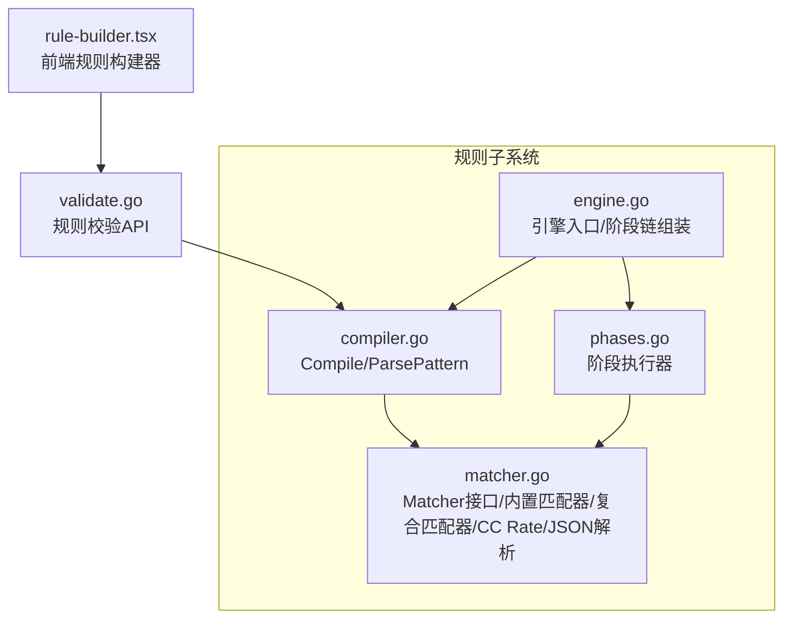
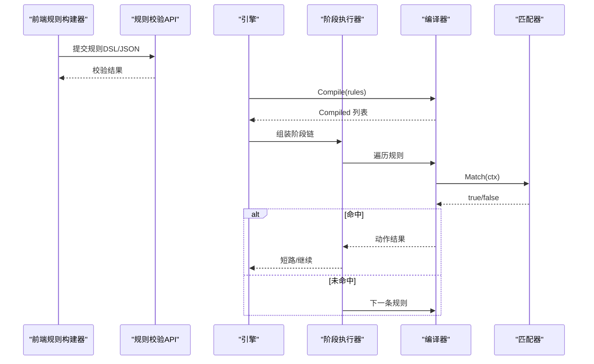
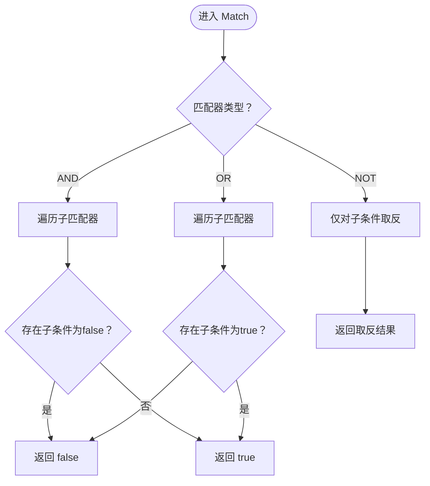
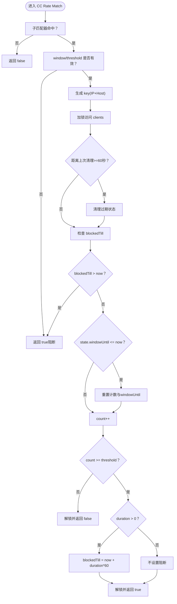
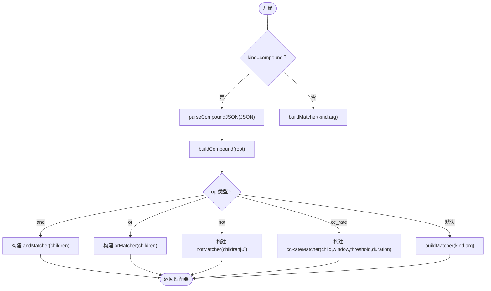
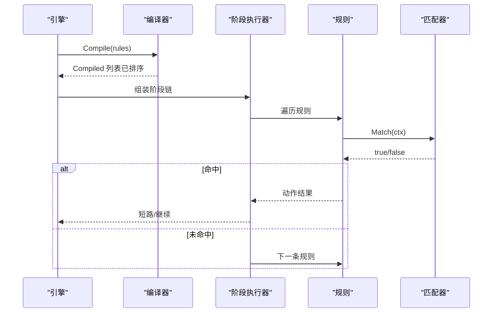
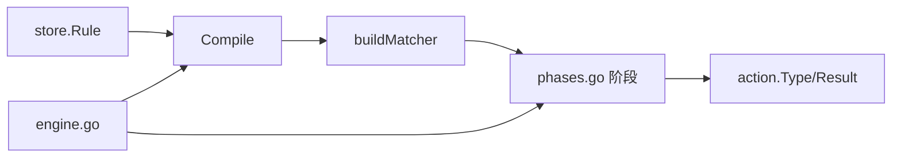

# 复合匹配器

> [返回 WAF 引擎系统](../WAF 引擎系统.md)

<cite>
**本文引用的文件**
- [matcher.go](file://internal/core/rules/matcher.go)
- [matcher_test.go](file://internal/core/rules/matcher_test.go)
- [compiler.go](file://internal/core/rules/compiler.go)
- [phases.go](file://internal/core/rules/phases.go)
- [engine.go](file://internal/core/engine/engine.go)
- [validate.go](file://internal/admin/rule/validate.go)
- [rule-builder.tsx](file://frontend/components/rule-builder.tsx)
- [规则编译器.md](file://docs/扩展与插件/规则引擎扩展/规则编译器扩展.md)
- [规则编译器.md](file://docs/WAF 引擎系统/规则编译器.md)
</cite>

## 目录
1. [简介](#简介)
2. [项目结构](#项目结构)
3. [核心组件](#核心组件)
4. [架构总览](#架构总览)
5. [详细组件分析](#详细组件分析)
6. [依赖分析](#依赖分析)
7. [性能考虑](#性能考虑)
8. [故障排查指南](#故障排查指南)
9. [结论](#结论)
10. [附录](#附录)

## 简介
本文件面向“复合匹配器”的技术文档，聚焦以下目标：
- 解释 AND、OR、NOT 三种复合匹配器的实现原理与逻辑运算规则
- 深入阐述 CC Rate 复合匹配器的并发控制机制、窗口计算与阻断策略
- 说明复合匹配器的递归构建过程与 JSON 条件解析流程
- 提供复合条件的配置示例（含多层嵌套逻辑组合）与性能优化建议
- 解释复合匹配器在规则引擎中的作用与执行顺序

## 项目结构
复合匹配器位于规则子系统内部，核心文件如下：
- internal/core/rules/matcher.go：定义 Matcher 接口、内置匹配器、复合匹配器（AND/OR/NOT）、CC Rate 匹配器以及 JSON 复合条件解析与构建
- internal/core/rules/compiler.go：规则编译入口，将 Rule 模型转换为 Compiled，并根据 kind 分派到具体匹配器
- internal/core/rules/phases.go：规则阶段执行器，按阶段顺序遍历规则并短路执行
- internal/core/engine/engine.go：引擎入口，组装阶段链并驱动规则执行
- internal/admin/rule/validate.go：规则校验 API，支持复合 JSON 规则的结构校验
- frontend/components/rule-builder.tsx：前端规则构建器，支持简单 DSL 与复合 JSON 的可视化编辑与 DSL 输出
- docs/扩展与插件/规则引擎扩展/规则编译器扩展.md 与 docs/WAF 引擎系统/规则编译器.md：对编译器、阶段执行与短路逻辑的补充说明

**图表来源**
- [matcher.go:12-15](file://internal/core/rules/matcher.go#L12-L15)
- [compiler.go:29-59](file://internal/core/rules/compiler.go#L29-L59)
- [phases.go:68-80](file://internal/core/rules/phases.go#L68-L80)
- [engine.go:139-198](file://internal/core/engine/engine.go#L139-L198)
- [validate.go:32-98](file://internal/admin/rule/validate.go#L32-L98)
- [rule-builder.tsx:119-135](file://frontend/components/rule-builder.tsx#L119-L135)

**章节来源**
- [matcher.go:12-15](file://internal/core/rules/matcher.go#L12-L15)
- [compiler.go:29-59](file://internal/core/rules/compiler.go#L29-L59)
- [phases.go:68-80](file://internal/core/rules/phases.go#L68-L80)
- [engine.go:139-198](file://internal/core/engine/engine.go#L139-L198)
- [validate.go:32-98](file://internal/admin/rule/validate.go#L32-L98)
- [rule-builder.tsx:119-135](file://frontend/components/rule-builder.tsx#L119-L135)

## 核心组件
- Matcher 接口：统一的匹配入口，接收客户端 IP、方法、路径、查询、头部、Body 等上下文
- 内置匹配器：IP/CIDR、路径前缀/正则/精确、查询包含/正则、请求头包含/正则、方法、内容类型、User-Agent、Body 包含/正则、JSON 路径、多部分文件名、地理国家阻断、Host/正则/包含/不包含、完整 URL 包含/正则、Cookie/Referer 等
- 复合匹配器：
  - AND：所有子条件均满足才命中
  - OR：任一子条件满足即命中
  - NOT：对子条件取反
- CC Rate 匹配器：基于子匹配器的并发控制，按窗口统计命中次数并在阈值触发后按持续时间阻断
- JSON 复合条件：通过 JSON 描述 op（and/or/not/cc_rate）与 children（递归子条件），并支持 window/threshold/duration 参数

**章节来源**
- [matcher.go:12-15](file://internal/core/rules/matcher.go#L12-L15)
- [matcher.go:96-124](file://internal/core/rules/matcher.go#L96-L124)
- [matcher.go:17-72](file://internal/core/rules/matcher.go#L17-L72)
- [matcher.go:706-762](file://internal/core/rules/matcher.go#L706-L762)

## 架构总览
复合匹配器在规则引擎中的位置与交互如下：

**图表来源**
- [engine.go:200-245](file://internal/core/engine/engine.go#L200-L245)
- [phases.go:68-80](file://internal/core/rules/phases.go#L68-L80)
- [compiler.go:29-59](file://internal/core/rules/compiler.go#L29-L59)
- [validate.go:32-98](file://internal/admin/rule/validate.go#L32-L98)
- [rule-builder.tsx:235-252](file://frontend/components/rule-builder.tsx#L235-L252)

## 详细组件分析

### AND/OR/NOT 复合匹配器
- AND：顺序遍历子匹配器，任一返回 false 则整体返回 false；若无子匹配器则返回 false
- OR：顺序遍历子匹配器，任一返回 true 则整体返回 true；若无子匹配器则返回 false
- NOT：对唯一子匹配器取反

**图表来源**
- [matcher.go:98-124](file://internal/core/rules/matcher.go#L98-L124)

**章节来源**
- [matcher.go:98-124](file://internal/core/rules/matcher.go#L98-L124)
- [matcher_test.go:30-66](file://internal/core/rules/matcher_test.go#L30-L66)
- [matcher_test.go:68-88](file://internal/core/rules/matcher_test.go#L68-L88)
- [matcher_test.go:90-110](file://internal/core/rules/matcher_test.go#L90-L110)

### CC Rate 复合匹配器
CC Rate 匹配器在子匹配器命中时进行并发控制与阻断：
- 子匹配器未命中：直接返回 false
- 子匹配器命中：
  - 若 window/threshold 任一非正值：直接返回 true（视为阻断）
  - 生成 key（客户端 IP + Host），加锁访问状态表 clients
  - 每 60 秒清理过期状态（windowUntil ≤ now 且 blockedTill ≤ now）
  - 若当前处于 blockedTill 内：返回 true（阻断）
  - 若当前不在当前窗口：重置 count 并设置 windowUntil = now + window
  - count++，若 count < threshold：返回 false（未达阈值）
  - 若 count ≥ threshold 且 duration > 0：设置 blockedTill = now + duration*60，返回 true（阻断）

**图表来源**
- [matcher.go:33-72](file://internal/core/rules/matcher.go#L33-L72)
- [matcher.go:74-80](file://internal/core/rules/matcher.go#L74-L80)

**章节来源**
- [matcher.go:17-72](file://internal/core/rules/matcher.go#L17-L72)
- [matcher_test.go:222-249](file://internal/core/rules/matcher_test.go#L222-L249)

### JSON 复合条件解析与递归构建
- ParsePattern：识别复合 JSON（以 { 开头）或简单 DSL（kind:arg）
- parseCompoundJSON：将 JSON 反序列化为 compoundCondition
- buildCompound：根据 op 递归构建匹配器
  - and：构建 andMatcher，children 递归构建
  - or：构建 orMatcher，children 递归构建
  - not：构建 notMatcher，仅允许一个子条件
  - cc_rate：构建 ccRateMatcher，children 递归构建并注入 window/threshold/duration
  - 默认：若存在 kind/arg，则调用 buildMatcher 生成简单匹配器

**图表来源**
- [compiler.go:61-90](file://internal/core/rules/compiler.go#L61-L90)
- [matcher.go:718-762](file://internal/core/rules/matcher.go#L718-L762)

**章节来源**
- [compiler.go:61-90](file://internal/core/rules/compiler.go#L61-L90)
- [matcher.go:706-762](file://internal/core/rules/matcher.go#L706-L762)
- [matcher_test.go:30-66](file://internal/core/rules/matcher_test.go#L30-L66)

### 规则编译与执行顺序
- 编译：Compile 过滤启用规则，解析 pattern，分派到 buildMatcher，最终按 Priority 与 ID 排序
- 执行：引擎按快照与策略构建阶段链，阶段内按顺序遍历规则，命中后根据动作短路
- ACL 阶段：Allow 短路，其他终端动作（Intercept/Drop）短路

**图表来源**
- [compiler.go:29-59](file://internal/core/rules/compiler.go#L29-L59)
- [phases.go:68-80](file://internal/core/rules/phases.go#L68-L80)
- [engine.go:200-245](file://internal/core/engine/engine.go#L200-L245)

**章节来源**
- [compiler.go:29-59](file://internal/core/rules/compiler.go#L29-L59)
- [phases.go:68-80](file://internal/core/rules/phases.go#L68-L80)
- [engine.go:200-245](file://internal/core/engine/engine.go#L200-L245)

## 依赖分析
- 编译器依赖：store.Rule、store.RulePhase、store.RuleAction、action.Type、pipeline.RequestCtx
- 运行时依赖：phases.go 中的 Phase 实现依赖 Compiled 列表与统一的 Match 接口
- 引擎依赖：快照提供站点规则，convertAndCompile 将 CompiledRule 转换为 store.Rule 后交给编译器

**图表来源**
- [compiler.go:29-59](file://internal/core/rules/compiler.go#L29-L59)
- [phases.go:68-80](file://internal/core/rules/phases.go#L68-L80)
- [engine.go:139-198](file://internal/core/engine/engine.go#L139-L198)

**章节来源**
- [compiler.go:29-59](file://internal/core/rules/compiler.go#L29-L59)
- [phases.go:68-80](file://internal/core/rules/phases.go#L68-L80)
- [engine.go:139-198](file://internal/core/engine/engine.go#L139-L198)

## 性能考虑
- 正则缓存：cachedCompile 使用全局互斥锁保护的缓存表，避免重复编译正则表达式
- 优先使用前缀/包含而非复杂正则，降低匹配成本
- 合理设置 Priority 与 ID，减少不必要的匹配
- CC Rate：窗口与阈值应结合业务流量特征调优；阻断持续时间避免误伤
- 复合条件：尽量减少深度嵌套，避免过多子条件导致遍历开销上升

**章节来源**
- [matcher.go:681-704](file://internal/core/rules/matcher.go#L681-L704)
- [matcher.go:98-124](file://internal/core/rules/matcher.go#L98-L124)
- [matcher.go:17-72](file://internal/core/rules/matcher.go#L17-L72)
- [规则编译器扩展.md:442-449](file://docs/扩展与插件/规则引擎扩展/规则编译器扩展.md#L442-L449)

## 故障排查指南
- 规则格式错误：通过 validate API 校验 pattern，确认是否以 { 开头或包含合法前缀
- 复合 JSON 结构错误：校验 op 是否为 and/or/not，children 是否存在
- 复杂正则报错：检查正则合法性，利用正则缓存避免重复编译
- CC Rate 阈值误判：核对 window/threshold/duration 设置，确认 key（IP+Host）隔离是否符合预期
- 执行顺序问题：确认规则 Priority 与 ID，ACL 阶段 Allow 短路行为

**章节来源**
- [validate.go:32-98](file://internal/admin/rule/validate.go#L32-L98)
- [matcher_test.go:222-249](file://internal/core/rules/matcher_test.go#L222-L249)
- [phases.go:68-80](file://internal/core/rules/phases.go#L68-L80)

## 结论
复合匹配器通过统一的 Matcher 接口与清晰的递归构建流程，提供了灵活而强大的规则组合能力。AND/OR/NOT 实现直观，CC Rate 提供细粒度的并发控制与阻断策略。配合编译器的稳定排序与引擎的阶段短路执行，复合匹配器在规则引擎中扮演关键角色，既保证了可读性与可维护性，也兼顾了性能与可扩展性。

## 附录

### 配置示例与最佳实践
- 简单规则
  - block_ip:192.168.1.0/24
  - block_path:/admin
  - block_method:POST
  - block_header:X-Scanner:sqlmap
- 复合规则（JSON）
  - AND：{"op":"and","children":[{"kind":"block_path","arg":"/admin"},{"kind":"block_method","arg":"POST"}]}
  - OR：{"op":"or","children":[{"kind":"block_ip","arg":"1.2.3.4"},{"kind":"block_user_agent","arg":"scanner"}]}
  - NOT：{"op":"not","children":[{"kind":"allow_ip","arg":"10.0.0.0/8"}]}
  - CC Rate：{"op":"cc_rate","window":60,"threshold":3,"duration":5,"children":[{"kind":"block_path","arg":"/login"}]}
- 多层嵌套示例
  - {"op":"and","children":[{"op":"or","children":[{"kind":"block_ip","arg":"1.2.3.0/24"},{"kind":"block_ip","arg":"5.6.7.0/24"}]},{"kind":"block_method","arg":"POST"}]}
- 最佳实践
  - 优先使用前缀/包含，避免复杂正则
  - 合理设置 window/threshold/duration，结合业务流量特征
  - 控制复合层级，避免过深嵌套
  - 使用规则校验 API 与前端构建器进行快速验证

**章节来源**
- [matcher_test.go:30-66](file://internal/core/rules/matcher_test.go#L30-L66)
- [matcher_test.go:68-88](file://internal/core/rules/matcher_test.go#L68-L88)
- [matcher_test.go:90-110](file://internal/core/rules/matcher_test.go#L90-L110)
- [matcher_test.go:222-249](file://internal/core/rules/matcher_test.go#L222-L249)
- [validate.go:100-192](file://internal/admin/rule/validate.go#L100-L192)
- [rule-builder.tsx:119-135](file://frontend/components/rule-builder.tsx#L119-L135)