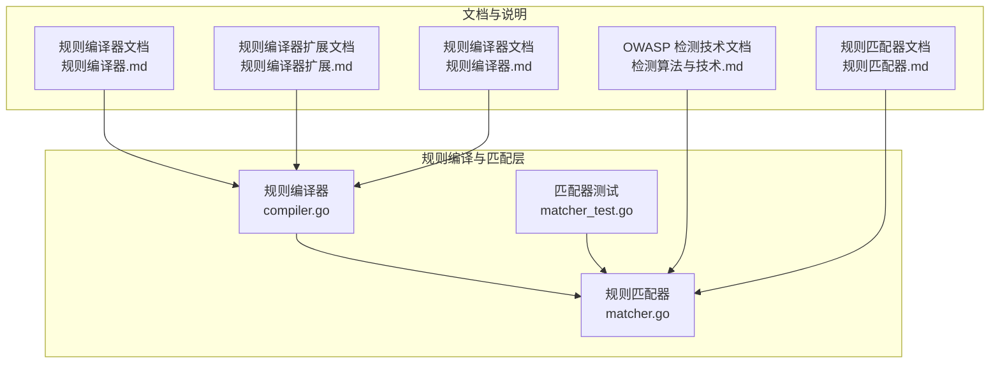
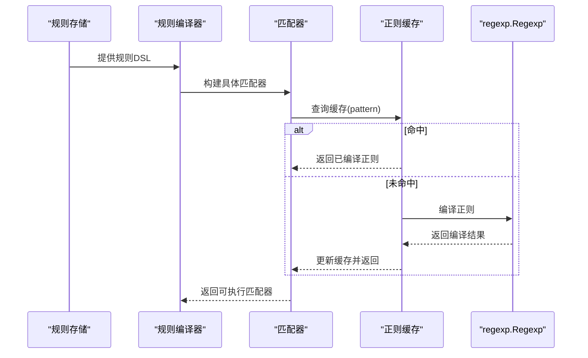
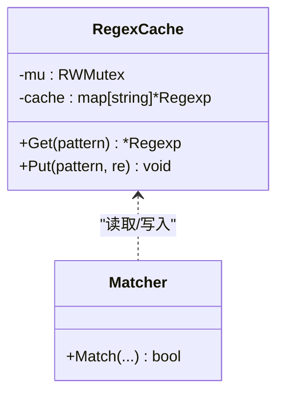
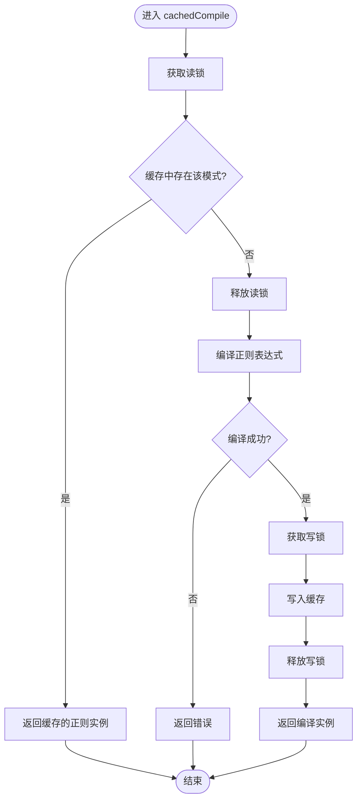
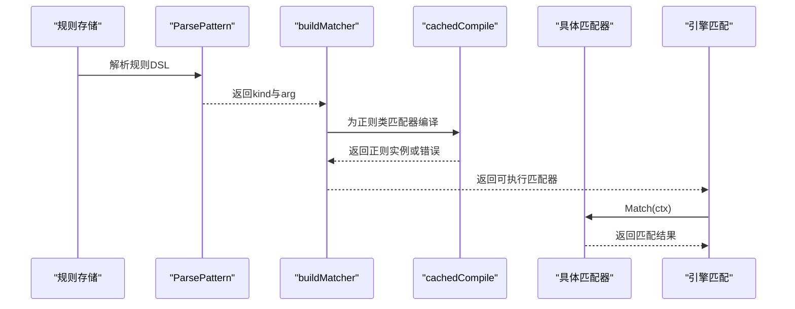
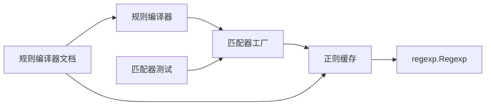

# 正则表达式优化

<cite>
**本文档引用的文件**
- [matcher.go](file://internal/core/rules/matcher.go)
- [compiler.go](file://internal/core/rules/compiler.go)
- [matcher_test.go](file://internal/core/rules/matcher_test.go)
- [规则编译器.md](file://docs/安全防护功能/ACL 规则引擎/规则编译器.md)
- [规则编译器扩展.md](file://docs/扩展与插件/规则引擎扩展/规则编译器扩展.md)
- [检测算法与技术.md](file://docs/安全防护功能/OWASP 检测/检测算法与技术.md)
- [规则匹配器.md](file://docs/WAF 引擎系统/规则匹配器.md)
- [规则编译器.md](file://docs/WAF 引擎系统/规则编译器.md)
</cite>

## 目录
1. [简介](#简介)
2. [项目结构](#项目结构)
3. [核心组件](#核心组件)
4. [架构总览](#架构总览)
5. [详细组件分析](#详细组件分析)
6. [依赖关系分析](#依赖关系分析)
7. [性能考量](#性能考量)
8. [故障排查指南](#故障排查指南)
9. [结论](#结论)
10. [附录](#附录)

## 简介
本文件聚焦于 My-OpenWaf 项目中的正则表达式优化机制，系统阐述正则表达式缓存系统的实现原理、编译过程、并发安全机制与内存管理策略，并深入解析 cachedCompile 函数的工作流程与错误处理机制。同时提供正则表达式性能优化的最佳实践，包括模式选择建议、编译成本考虑与缓存命中率优化，并给出测试案例与常见陷阱的规避方法，帮助读者在保证准确性的前提下获得更高的匹配性能。

## 项目结构
正则表达式优化主要分布在规则编译与匹配层，核心文件包括：
- 规则匹配器与缓存实现：internal/core/rules/matcher.go
- 规则编译器：internal/core/rules/compiler.go
- 相关测试用例：internal/core/rules/matcher_test.go
- 文档化说明：docs/安全防护功能/ACL 规则引擎/规则编译器.md、docs/扩展与插件/规则引擎扩展/规则编译器扩展.md、docs/安全防护功能/OWASP 检测/检测算法与技术.md、docs/WAF 引擎系统/规则匹配器.md、docs/WAF 引擎系统/规则编译器.md

**图表来源**
- [compiler.go:1-91](file://internal/core/rules/compiler.go#L1-L91)
- [matcher.go:1-763](file://internal/core/rules/matcher.go#L1-L763)
- [matcher_test.go:1-250](file://internal/core/rules/matcher_test.go#L1-L250)
- [规则编译器.md:360-400](file://docs/安全防护功能/ACL 规则引擎/规则编译器.md#L360-L400)
- [规则编译器扩展.md:429-442](file://docs/扩展与插件/规则引擎扩展/规则编译器扩展.md#L429-L442)
- [检测算法与技术.md:398-414](file://docs/安全防护功能/OWASP 检测/检测算法与技术.md#L398-L414)
- [规则匹配器.md](file://docs/WAF 引擎系统/规则匹配器.md)
- [规则编译器.md](file://docs/WAF 引擎系统/规则编译器.md)

**章节来源**
- [compiler.go:1-91](file://internal/core/rules/compiler.go#L1-L91)
- [matcher.go:1-763](file://internal/core/rules/matcher.go#L1-L763)
- [matcher_test.go:1-250](file://internal/core/rules/matcher_test.go#L1-L250)
- [规则编译器.md:360-400](file://docs/安全防护功能/ACL 规则引擎/规则编译器.md#L360-L400)
- [规则编译器扩展.md:429-442](file://docs/扩展与插件/规则引擎扩展/规则编译器扩展.md#L429-L442)
- [检测算法与技术.md:398-414](file://docs/安全防护功能/OWASP 检测/检测算法与技术.md#L398-L414)
- [规则匹配器.md](file://docs/WAF 引擎系统/规则匹配器.md)
- [规则编译器.md](file://docs/WAF 引擎系统/规则编译器.md)

## 核心组件
- 正则表达式缓存：全局 regexCache，使用读写锁保护的 map，键为正则模式字符串，值为编译后的 regexp.Regexp 实例。
- cachedCompile 函数：封装缓存查找与编译流程，支持错误返回与缓存更新。
- 规则编译器：Compile 将规则转换为带预构建匹配器的运行时对象，匹配器在构建时调用 cachedCompile。
- 匹配器集合：包含多种匹配器类型，如路径正则、查询正则、头正则、主体正则等，均通过 cachedCompile 获取正则实例。

**章节来源**
- [matcher.go:679-704](file://internal/core/rules/matcher.go#L679-L704)
- [compiler.go:29-59](file://internal/core/rules/compiler.go#L29-L59)

## 架构总览
正则表达式优化贯穿“规则编译—运行时匹配—缓存复用”的完整链路。规则编译阶段将 DSL 转换为具体匹配器，匹配器在 Match 时复用缓存的正则实例，避免重复编译带来的 CPU 与内存开销。

**图表来源**
- [matcher.go:519-668](file://internal/core/rules/matcher.go#L519-L668)
- [matcher.go:679-704](file://internal/core/rules/matcher.go#L679-L704)

## 详细组件分析

### 正则表达式缓存系统
- 缓存结构：全局结构体包含读写锁与 map，键为正则模式字符串，值为编译后的 regexp.Regexp 实例。
- 并发安全：使用 sync.RWMutex，读多写少场景下通过读锁提高并发性能；写入时使用互斥锁确保一致性。
- 生命周期：缓存随进程启动初始化，无显式淘汰策略，长期驻留以最大化命中率。

**图表来源**
- [matcher.go:681-684](file://internal/core/rules/matcher.go#L681-L684)

**章节来源**
- [matcher.go:679-704](file://internal/core/rules/matcher.go#L679-L704)

### cachedCompile 函数工作流程
- 读锁查询：先以读锁访问缓存，若命中则直接返回，避免写锁竞争。
- 编译失败处理：若未命中，释放读锁并进行编译；编译失败返回错误，调用方通常降级为永不匹配的匹配器。
- 写锁更新：编译成功后加写锁写入缓存，然后返回实例。
- 错误传播：编译错误由调用方捕获并处理，确保规则编译不会因单个正则失败而中断。

**图表来源**
- [matcher.go:686-704](file://internal/core/rules/matcher.go#L686-L704)

**章节来源**
- [matcher.go:686-704](file://internal/core/rules/matcher.go#L686-L704)

### 规则编译与匹配集成
- 规则编译：Compile 遍历规则，解析 DSL，构建具体匹配器；对于需要正则的匹配器，调用 cachedCompile 获取或创建正则实例。
- 匹配执行：Compiled.Match 将请求上下文传递给预构建的匹配器，匹配器内部使用缓存的正则进行匹配。
- 错误处理：当 cachedCompile 返回错误时，编译器返回永不匹配的匹配器，避免规则失效影响整体处理。

**图表来源**
- [compiler.go:30-59](file://internal/core/rules/compiler.go#L30-L59)
- [matcher.go:498-668](file://internal/core/rules/matcher.go#L498-L668)

**章节来源**
- [compiler.go:29-59](file://internal/core/rules/compiler.go#L29-L59)
- [matcher.go:498-668](file://internal/core/rules/matcher.go#L498-L668)

### 匹配器类型与正则使用
- 路径正则匹配器：pathRegexMatcher
- 查询正则匹配器：queryRegexMatcher
- 头部正则匹配器：headerRegexMatcher
- 主体正则匹配器：bodyRegexMatcher
- JSON 路径正则匹配器：bodyJSONPathMatcher
- 多部分文件名正则匹配器：multipartMatcher

这些匹配器在构造时通过 cachedCompile 获取正则实例，确保在运行时高效匹配。

**章节来源**
- [matcher.go:140-173](file://internal/core/rules/matcher.go#L140-L173)
- [matcher.go:216-220](file://internal/core/rules/matcher.go#L216-L220)
- [matcher.go:222-267](file://internal/core/rules/matcher.go#L222-L267)
- [matcher.go:269-320](file://internal/core/rules/matcher.go#L269-L320)

## 依赖关系分析
- 规则编译器依赖匹配器工厂与正则缓存，确保规则转换为高性能的运行时对象。
- 匹配器依赖正则缓存，避免重复编译。
- 文档与测试共同验证缓存命中与错误处理行为。

**图表来源**
- [compiler.go:29-59](file://internal/core/rules/compiler.go#L29-L59)
- [matcher.go:498-668](file://internal/core/rules/matcher.go#L498-L668)
- [matcher.go:679-704](file://internal/core/rules/matcher.go#L679-L704)

**章节来源**
- [compiler.go:29-59](file://internal/core/rules/compiler.go#L29-L59)
- [matcher.go:498-668](file://internal/core/rules/matcher.go#L498-L668)
- [matcher.go:679-704](file://internal/core/rules/matcher.go#L679-L704)

## 性能考量
- 正则缓存命中率：通过全局缓存复用已编译正则，避免重复编译；建议在规则设计中尽量复用相同模式，提升命中率。
- 并发性能：读多写少的缓存结构使用读写锁，读路径无写锁竞争，写路径仅在首次编译时加锁，整体并发友好。
- 内存占用：正则实例在进程内共享，避免重复分配；缓存 map 的键为模式字符串，空间开销与唯一模式数量线性相关。
- 编译成本：cachedCompile 在未命中时进行编译，编译成本与模式复杂度相关；建议简化模式、避免回溯陷阱。
- 匹配效率：匹配器直接使用缓存的正则实例，匹配开销仅为正则引擎的执行时间。

**章节来源**
- [规则编译器.md:360-400](file://docs/安全防护功能/ACL 规则引擎/规则编译器.md#L360-L400)
- [规则编译器扩展.md:429-442](file://docs/扩展与插件/规则引擎扩展/规则编译器扩展.md#L429-L442)
- [检测算法与技术.md:398-414](file://docs/安全防护功能/OWASP 检测/检测算法与技术.md#L398-L414)

## 故障排查指南
- 规则不生效
  - 现象：规则定义正确但不触发匹配。
  - 排查：确认 cachedCompile 是否返回错误；若返回错误，编译器会降级为永不匹配的匹配器。
  - 参考：规则编译器文档中的常见问题与解决方案。
- 正则性能问题
  - 现象：匹配耗时较长或 CPU 占用高。
  - 排查：检查正则模式是否过于复杂，是否存在回溯陷阱；确认缓存是否命中；必要时拆分规则或简化模式。
  - 参考：性能考量与最佳实践建议。
- 正则缓存未命中
  - 现象：相同模式反复编译。
  - 排查：确认规则中是否使用了不同的模式字符串（如大小写、空白、转义差异）；确保规则设计一致。
  - 参考：缓存结构与并发安全机制。

**章节来源**
- [规则编译器.md:394-400](file://docs/安全防护功能/ACL 规则引擎/规则编译器.md#L394-L400)
- [规则编译器扩展.md:429-442](file://docs/扩展与插件/规则引擎扩展/规则编译器扩展.md#L429-L442)
- [检测算法与技术.md:398-414](file://docs/安全防护功能/OWASP 检测/检测算法与技术.md#L398-L414)

## 结论
正则表达式优化在 My-OpenWaf 中通过全局缓存、读写锁保护与编译期复用实现，显著降低了编译成本与匹配延迟。cachedCompile 函数在保证并发安全的同时，提供了简洁的错误处理机制，使规则编译具备鲁棒性。结合合理的模式设计与规则组织，可以在保证检测精度的前提下获得更高的性能表现。

## 附录

### 测试案例与验证
- 正则缓存一致性测试：同一模式两次编译应得到相同的正则实例，验证缓存命中与一致性。
- 错误处理测试：当正则编译失败时，编译器应返回永不匹配的匹配器，确保规则系统稳定运行。

**章节来源**
- [matcher_test.go:209-220](file://internal/core/rules/matcher_test.go#L209-L220)

### 最佳实践清单
- 模式选择建议
  - 优先使用前缀/包含匹配替代复杂正则，必要时利用缓存。
  - 避免过于宽泛的正则，防止回溯开销过大。
  - 使用稳定的模式字符串，减少缓存键的碎片化。
- 编译成本考虑
  - 合理设置规则优先级，将高频命中规则置于前面，减少不必要的匹配尝试。
  - 复合规则尽量合并，减少规则数量与编译次数。
- 缓存命中率优化
  - 在规则设计中尽量复用相同模式，避免微小差异导致的缓存碎片。
  - 对于动态生成的模式，考虑规范化处理（如去除多余空白、统一大小写）以提升命中率。

**章节来源**
- [规则编译器扩展.md:429-442](file://docs/扩展与插件/规则引擎扩展/规则编译器扩展.md#L429-L442)
- [规则匹配器.md](file://docs/WAF 引擎系统/规则匹配器.md)
- [规则编译器.md](file://docs/WAF 引擎系统/规则编译器.md)