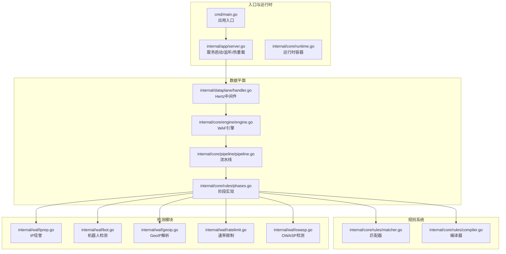
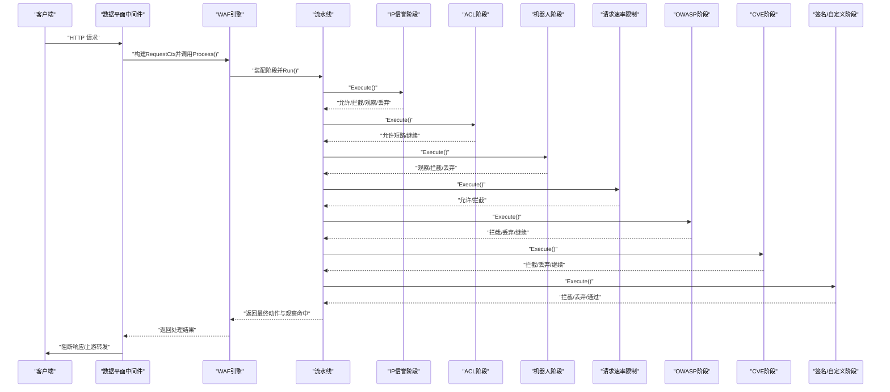
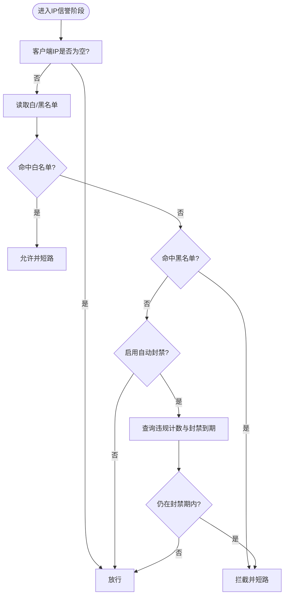
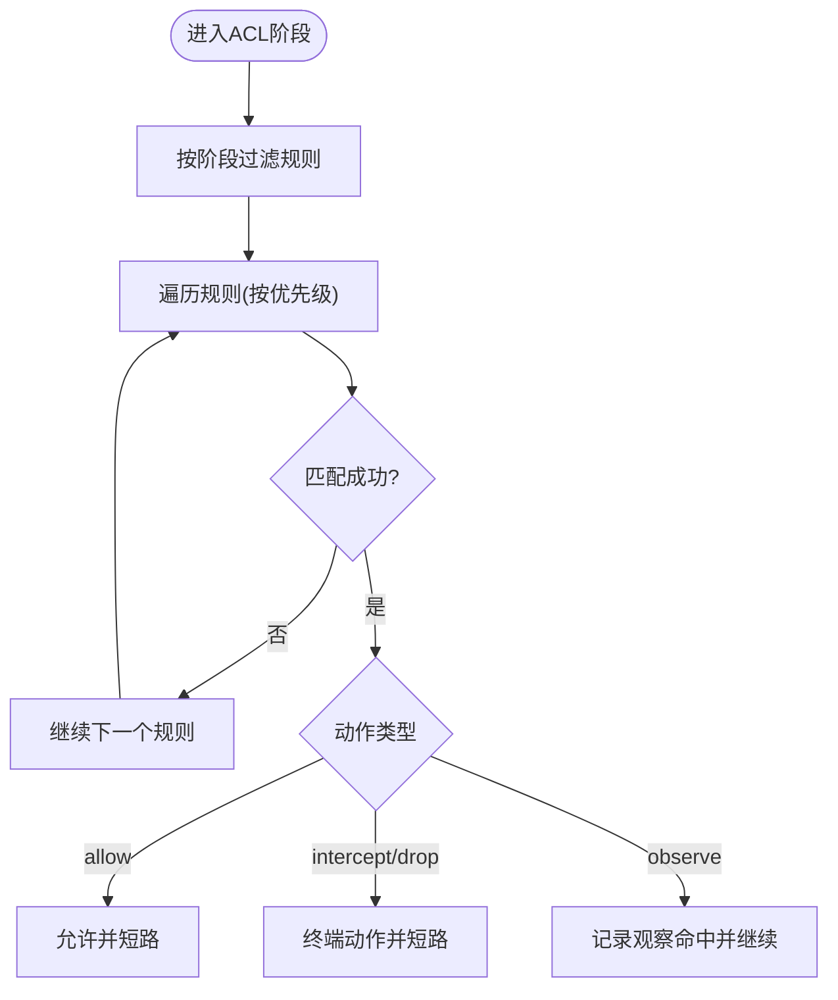
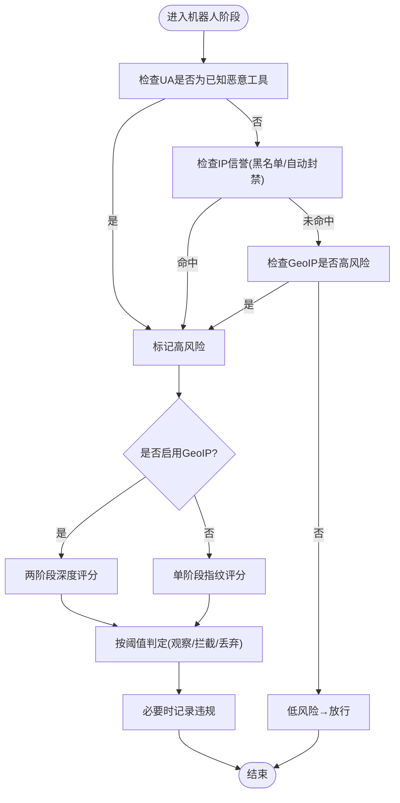
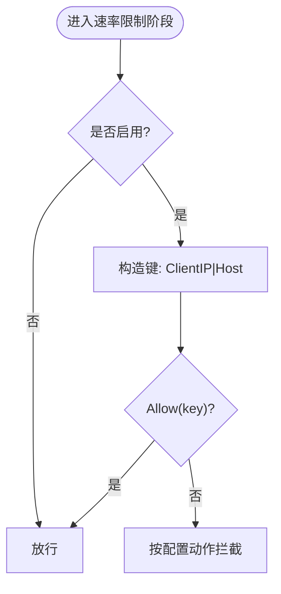
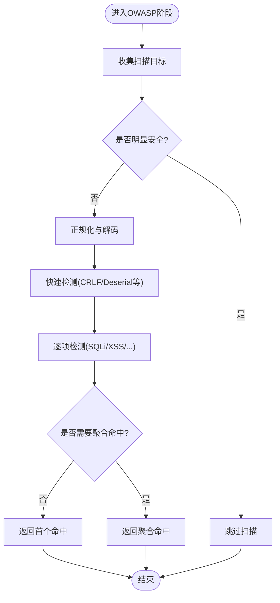
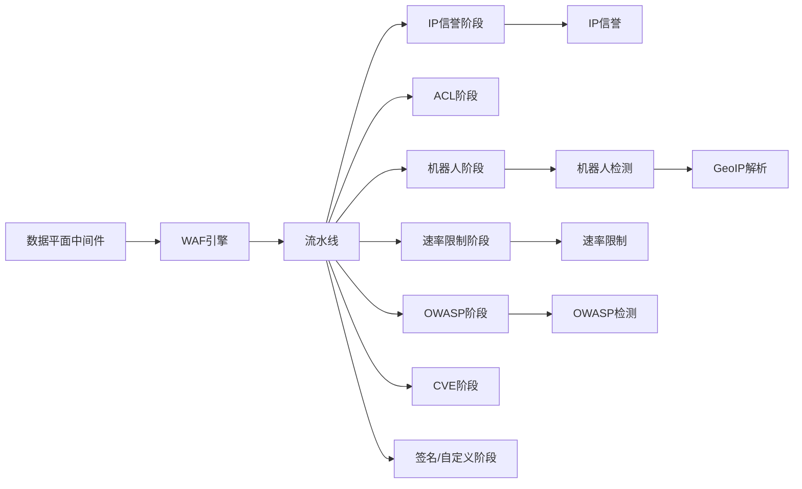

# 处理阶段详解

<cite>
**本文引用的文件**
- [main.go](file://cmd/main.go)
- [server.go](file://internal/app/server.go)
- [engine.go](file://internal/core/engine/engine.go)
- [pipeline.go](file://internal/core/pipeline/pipeline.go)
- [phases.go](file://internal/core/rules/phases.go)
- [action.go](file://internal/core/action/action.go)
- [handler.go](file://internal/dataplane/handler.go)
- [iprep.go](file://internal/waf/iprep.go)
- [bot.go](file://internal/waf/bot.go)
- [geoip.go](file://internal/waf/geoip.go)
- [ratelimit.go](file://internal/waf/ratelimit.go)
- [owasp.go](file://internal/waf/owasp.go)
- [matcher.go](file://internal/core/rules/matcher.go)
- [compiler.go](file://internal/core/rules/compiler.go)
- [runtime.go](file://internal/core/runtime.go)
</cite>

## 目录
1. [简介](#简介)
2. [项目结构](#项目结构)
3. [核心组件](#核心组件)
4. [架构总览](#架构总览)
5. [详细组件分析](#详细组件分析)
6. [依赖关系分析](#依赖关系分析)
7. [性能考量](#性能考量)
8. [故障排查指南](#故障排查指南)
9. [结论](#结论)
10. [附录：阶段扩展与注册指南](#附录阶段扩展与注册指南)

## 简介
本文件系统性梳理 My-OpenWaf 的请求处理流水线，围绕五大处理阶段展开：IP 信誉检查、ACL 规则匹配、机器人检测（含两阶段）、速率限制、OWASP 检测，并补充 CVE 检测与签名/自定义规则阶段。文档解释各阶段的职责、输入输出、决策逻辑、执行顺序与依赖关系，给出性能优化建议、调试方法以及短路机制的实现细节。最后提供阶段扩展开发指南，帮助用户实现自定义阶段并正确注册到流水线。

## 项目结构
My-OpenWaf 采用“数据平面中间件 + 核心引擎 + 规则编译器 + 各类检测模块”的分层组织方式：
- 数据平面中间件负责从 Hertz 接收请求，构建 RequestCtx，调用引擎处理，并根据结果转发或阻断。
- 引擎负责站点解析、快照维护、阶段装配与执行。
- 规则子系统负责将存储的规则编译为可执行的 Compiled 规则，并按阶段过滤执行。
- 各检测模块（IP信誉、机器人、速率限制、OWASP、CVE）作为独立能力被阶段封装后接入流水线。

图示来源
- [main.go:1-10](file://cmd/main.go#L1-L10)
- [server.go:35-305](file://internal/app/server.go#L35-L305)
- [engine.go:57-129](file://internal/core/engine/engine.go#L57-L129)
- [pipeline.go:49-70](file://internal/core/pipeline/pipeline.go#L49-L70)
- [phases.go:34-358](file://internal/core/rules/phases.go#L34-L358)
- [matcher.go:167-261](file://internal/core/rules/matcher.go#L167-L261)
- [compiler.go:28-55](file://internal/core/rules/compiler.go#L28-L55)
- [iprep.go:19-124](file://internal/waf/iprep.go#L19-L124)
- [bot.go:136-454](file://internal/waf/bot.go#L136-L454)
- [geoip.go:26-223](file://internal/waf/geoip.go#L26-L223)
- [ratelimit.go:10-92](file://internal/waf/ratelimit.go#L10-L92)
- [owasp.go:51-234](file://internal/waf/owasp.go#L51-L234)

章节来源
- [main.go:1-10](file://cmd/main.go#L1-L10)
- [server.go:35-305](file://internal/app/server.go#L35-L305)

## 核心组件
- 请求上下文 RequestCtx：承载客户端 IP、方法、路径、查询串、头、体、内容类型等，贯穿整个流水线。
- 阶段 Phase：实现统一接口，按序执行，支持短路与观察日志收集。
- 动作 Result：描述匹配后的动作类型（允许/拦截/观察/丢弃），并携带分类、规则标识、阶段信息。
- 引擎 Engine：装配阶段列表、执行流水线、返回最终动作与观察命中。
- 规则编译器：将存储规则转换为带预编译匹配器的 Compiled 规则，按阶段过滤执行。

章节来源
- [pipeline.go:9-35](file://internal/core/pipeline/pipeline.go#L9-L35)
- [action.go:29-61](file://internal/core/action/action.go#L29-L61)
- [engine.go:57-129](file://internal/core/engine/engine.go#L57-L129)
- [compiler.go:28-55](file://internal/core/rules/compiler.go#L28-L55)

## 架构总览
下图展示一次请求从进入数据平面到完成处理的关键交互：

图示来源
- [handler.go:107](file://internal/dataplane/handler.go#L107)
- [engine.go:85-120](file://internal/core/engine/engine.go#L85-L120)
- [pipeline.go:49-70](file://internal/core/pipeline/pipeline.go#L49-L70)
- [phases.go:142-170](file://internal/core/rules/phases.go#L142-L170)
- [phases.go:40-52](file://internal/core/rules/phases.go#L40-L52)
- [phases.go:197-210](file://internal/core/rules/phases.go#L197-L210)
- [phases.go:109-128](file://internal/core/rules/phases.go#L109-L128)
- [phases.go:258-303](file://internal/core/rules/phases.go#L258-L303)
- [phases.go:319-358](file://internal/core/rules/phases.go#L319-L358)
- [phases.go:85-94](file://internal/core/rules/phases.go#L85-L94)

## 详细组件分析

### IP 信誉检查阶段
- 职责：基于内置黑白名单与自动封禁策略对客户端 IP 进行判定；白名单直接放行并短路，黑名单直接拦截。
- 输入：RequestCtx.ClientIP。
- 输出：动作结果（允许/拦截），并标注类别（白名单/黑名单/自动封禁）。
- 决策逻辑：
  - 若配置了 IP 名单，则优先匹配白/黑名单；
  - 若未匹配且启用自动封禁，检查违规计数与封禁到期时间；
  - 未命中任何条件则放行。
- 执行顺序：流水线首阶段，确保早期短路。
- 性能要点：使用原子化阈值与窗口参数，避免频繁锁竞争；清理 goroutine 定期回收过期封禁状态。

图示来源
- [phases.go:142-170](file://internal/core/rules/phases.go#L142-L170)
- [iprep.go:90-124](file://internal/waf/iprep.go#L90-L124)

章节来源
- [phases.go:142-170](file://internal/core/rules/phases.go#L142-L170)
- [iprep.go:19-124](file://internal/waf/iprep.go#L19-L124)

### ACL 规则匹配阶段
- 职责：执行站点级 ACL 规则，支持 allow/intercept/observe 等动作；allow 可短路后续阶段。
- 输入：RequestCtx 中的 ClientIP、Method、Path、RawQuery、Headers。
- 输出：若匹配到规则则返回对应动作，否则放行。
- 决策逻辑：按优先级排序的 Compiled 规则逐一匹配，遇到 allow 即短路，否则继续；拦截/丢弃即终止流水线。
- 执行顺序：紧随 IP 信誉之后，作为第一道业务访问控制。

图示来源
- [phases.go:40-52](file://internal/core/rules/phases.go#L40-L52)
- [compiler.go:28-55](file://internal/core/rules/compiler.go#L28-L55)
- [matcher.go:167-261](file://internal/core/rules/matcher.go#L167-L261)

章节来源
- [phases.go:34-52](file://internal/core/rules/phases.go#L34-L52)
- [compiler.go:28-55](file://internal/core/rules/compiler.go#L28-L55)
- [matcher.go:167-261](file://internal/core/rules/matcher.go#L167-L261)

### 机器人检测阶段（两阶段）
- 职责：识别可疑/恶意机器人流量，支持两阶段评分与阈值控制；高风险时可触发丢弃。
- 输入：RequestCtx.Method、Path、Headers、ClientIP。
- 输出：动作结果（观察/拦截/丢弃），并记录机器人分数与明细。
- 决策逻辑：
  - 预筛查（快速）：若 UA 属于已知恶意工具、IP 在黑名单/自动封禁、或 GeoIP 判定高风险，则进入深度评分。
  - 深度评分（慢但更准）：结合 GeoIP 分数、指纹分析、IP 信誉，汇总总分并按阈值判定。
  - 记录违规：对恶意判定的 IP 记录违规以纳入自动封禁。
- 执行顺序：在 ACL 之后、速率限制之前，尽早阻断恶意扫描与自动化工具。
- 与 GeoIP 的关系：若可用，两阶段流程会使用 GeoIP 加权评分；否则回退到单阶段指纹评分。

图示来源
- [phases.go:197-210](file://internal/core/rules/phases.go#L197-L210)
- [bot.go:136-161](file://internal/waf/bot.go#L136-L161)
- [bot.go:167-224](file://internal/waf/bot.go#L167-L224)
- [geoip.go:153-189](file://internal/waf/geoip.go#L153-L189)

章节来源
- [phases.go:172-244](file://internal/core/rules/phases.go#L172-L244)
- [bot.go:136-224](file://internal/waf/bot.go#L136-L224)
- [geoip.go:26-223](file://internal/waf/geoip.go#L26-L223)

### 速率限制阶段
- 职责：固定窗口限流，按“客户端IP+Host”组合计数；支持错误率统计（响应后）。
- 输入：RequestCtx.ClientIP、Host。
- 输出：允许/拦截；拦截时使用配置的动作类型。
- 决策逻辑：若当前窗口内请求数超过阈值则拦截；错误率统计仅在响应后进行，按状态码范围计数。
- 执行顺序：在机器人阶段之后、OWASP 之前，防止滥用与放大攻击。

图示来源
- [phases.go:109-128](file://internal/core/rules/phases.go#L109-L128)
- [ratelimit.go:48-62](file://internal/waf/ratelimit.go#L48-L62)

章节来源
- [phases.go:96-128](file://internal/core/rules/phases.go#L96-L128)
- [ratelimit.go:10-92](file://internal/waf/ratelimit.go#L10-L92)

### OWASP 检测阶段
- 职责：对路径、查询串、头部、主体等目标进行多类攻击检测（SQL 注入、XSS、命令注入、路径穿越、SSRF、XXE、反序列化等）。
- 输入：RequestCtx.Path、RawQuery、Headers、Body、ContentType。
- 输出：首个命中或聚合命中列表，按严重程度选择动作类型。
- 决策逻辑：
  - 收集目标：路径、查询串、头部（跳过部分标准头）、Cookie 值、Referer 查询片段等；
  - 正规化与解码：多轮 URL/HTML/JS/UTF-7 解码，剥离注释与空白；
  - 快速过滤：对明显安全的目标跳过扫描；
  - 深度扫描：按敏感度阈值逐项检测，抑制误报（如 CDN 回调、自然语言等）；
  - 文件上传：针对 multipart 场景提取文件名与类型单独检测；
  - 协议级检查：直接检查头部是否存在协议违规；
  - 路径危险模式：检测双扩展、危险路径等。
- 执行顺序：在速率限制之后，用于通用 Web 攻击防护。

图示来源
- [phases.go:258-303](file://internal/core/rules/phases.go#L258-L303)
- [owasp.go:51-234](file://internal/waf/owasp.go#L51-L234)

章节来源
- [phases.go:246-303](file://internal/core/rules/phases.go#L246-L303)
- [owasp.go:14-800](file://internal/waf/owasp.go#L14-L800)

### CVE 检测阶段
- 职责：针对特定已知漏洞（如 F5、Liferay、OFBiz、Confluence 等）进行路径与参数匹配检测。
- 输入：RequestCtx.Path、RawQuery、Headers、Body、ContentType。
- 输出：最高优先级匹配结果，按严重度自动提升动作为丢弃。
- 决策逻辑：构建请求对象后交由 CVE 检测器匹配，若命中则按配置动作或自动提升为丢弃。

章节来源
- [phases.go:305-358](file://internal/core/rules/phases.go#L305-L358)

### 签名/自定义阶段
- 职责：执行站点级签名规则与自定义规则，作为规则系统的通用执行单元。
- 输入/输出：与 ACL 阶段一致，支持 allow 短路与其他动作。
- 执行顺序：在 OWASP/CVE 之后，作为最后一道规则防线。

章节来源
- [phases.go:54-94](file://internal/core/rules/phases.go#L54-L94)

## 依赖关系分析
- 数据平面中间件依赖引擎；引擎依赖规则编译器与各检测模块；阶段实现依赖动作类型与规则匹配器。
- 执行顺序由引擎装配决定：IP 信誉 → ACL → 机器人（可选）→ 速率限制（可选）→ OWASP → CVE（可选）→ 签名/自定义。
- 短路机制：动作结果中 IsTerminal()/IsDrop() 决定是否立即终止流水线，Drop 优先于拦截。

图示来源
- [handler.go:107](file://internal/dataplane/handler.go#L107)
- [engine.go:85-120](file://internal/core/engine/engine.go#L85-L120)
- [phases.go:34-358](file://internal/core/rules/phases.go#L34-L358)
- [iprep.go:19-124](file://internal/waf/iprep.go#L19-L124)
- [bot.go:136-224](file://internal/waf/bot.go#L136-L224)
- [geoip.go:26-223](file://internal/waf/geoip.go#L26-L223)
- [ratelimit.go:10-92](file://internal/waf/ratelimit.go#L10-L92)
- [owasp.go:51-234](file://internal/waf/owasp.go#L51-L234)

章节来源
- [engine.go:85-120](file://internal/core/engine/engine.go#L85-L120)
- [pipeline.go:49-70](file://internal/core/pipeline/pipeline.go#L49-L70)

## 性能考量
- 流水线短路：动作一旦为终端（拦截/丢弃）立即停止后续阶段，减少无效计算。
- 规则匹配缓存：正则表达式编译结果缓存，避免重复编译开销。
- 目标裁剪与早停：OWASP 对超长目标截断、对明显安全目标跳过扫描，降低正则耗时。
- 速率限制并发安全：使用互斥锁保护窗口映射，定期清理过期窗口，降低内存占用。
- IP 信誉自动封禁：违规计数与封禁到期时间原子化读写，减少锁持有时间。
- 机器人两阶段：预筛查快速过滤，仅对高风险 IP 进深度评分，兼顾吞吐与准确率。
- 日志与事件：观察命中与拦截均支持异步批量写入，避免阻塞主路径。

[本节为通用指导，无需列出具体文件来源]

## 故障排查指南
- 维护模式：若全局或站点维护开启，直接返回拦截动作，便于紧急处置。
- 观察命中：所有观察命中会被记录并上报事件写入器，便于审计与溯源。
- 拦截与丢弃：拦截返回 403 响应，丢弃直接关闭 TCP 连接；两者都会写入安全事件。
- 错误率统计：响应后按状态码范围统计错误并递增计数，用于二次防护。
- GeoIP 不可用：当数据库加载失败时降级为非高风险判断，不影响整体功能。
- IP 名单加载：启动时从仓库加载黑白名单并配置自动封禁参数。

章节来源
- [engine.go:69-81](file://internal/core/engine/engine.go#L69-L81)
- [handler.go:110-143](file://internal/dataplane/handler.go#L110-L143)
- [handler.go:160-251](file://internal/dataplane/handler.go#L160-L251)
- [handler.go:284-302](file://internal/dataplane/handler.go#L284-L302)
- [geoip.go:66-102](file://internal/waf/geoip.go#L66-L102)
- [server.go:312-333](file://internal/app/server.go#L312-L333)

## 结论
My-OpenWaf 的处理阶段遵循“早期短路、先基础后高级、先粗筛后精算”的设计原则：IP 信誉与 ACL 提前阻断，机器人检测在滥用工具进入系统前拦截，速率限制防止放大攻击，OWASP/CVE 保障通用与针对性威胁，签名/自定义规则作为灵活补充。短路机制与动作规范化确保了高效与一致的处置策略。通过规则编译器与匹配器的解耦，系统具备良好的扩展性与可观测性。

[本节为总结性内容，无需列出具体文件来源]

## 附录：阶段扩展与注册指南
- 实现新阶段
  - 新建类型实现 Phase 接口（Name/Execute），在 Execute 中完成匹配与动作生成。
  - 使用 action.Result 描述动作类型（Allow/Intercept/Observe/Drop），并设置 Phase、MatchDesc、Category、RuleID 等字段。
- 注册到流水线
  - 在引擎装配阶段按需插入新阶段，注意与现有阶段的顺序关系（例如：黑名单/白名单类阶段靠前，扫描类阶段靠后）。
  - 可参考引擎中阶段装配逻辑，将新阶段追加到 phases 列表。
- 规则驱动
  - 若新阶段需要规则匹配，可在规则编译器中新增 kind 并在匹配器中实现相应逻辑，然后在阶段中按阶段过滤执行 Compiled 规则。
- 性能与健壮性
  - 尽量在阶段内部做快速短路与早停（如预判、缓存命中）。
  - 对外部依赖（如数据库/远程服务）做好降级与超时控制。
- 调试与观测
  - 为新阶段设置清晰的 Phase 名称与 MatchDesc，便于日志与事件追踪。
  - 对关键路径增加指标埋点，关注延迟分布与错误率。

章节来源
- [phases.go:25-35](file://internal/core/rules/phases.go#L25-L35)
- [engine.go:85-120](file://internal/core/engine/engine.go#L85-L120)
- [compiler.go:28-55](file://internal/core/rules/compiler.go#L28-L55)
- [matcher.go:167-261](file://internal/core/rules/matcher.go#L167-L261)