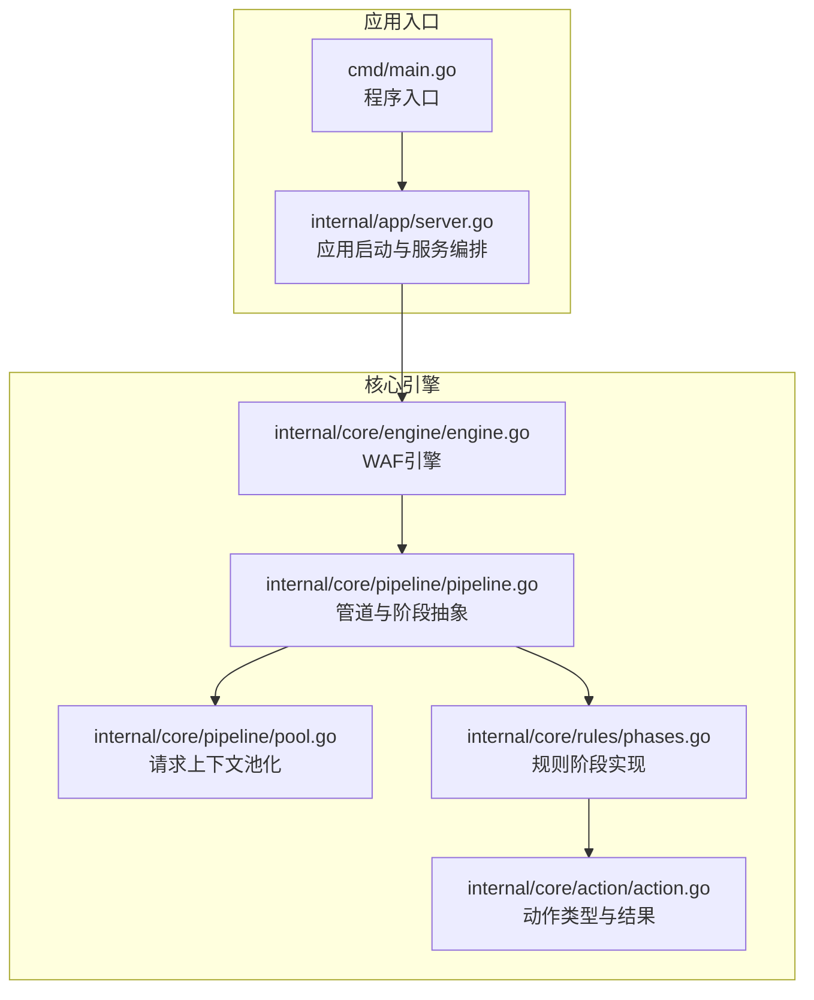
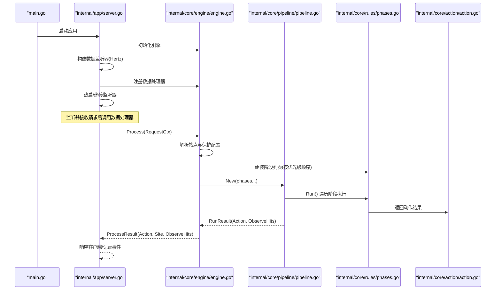
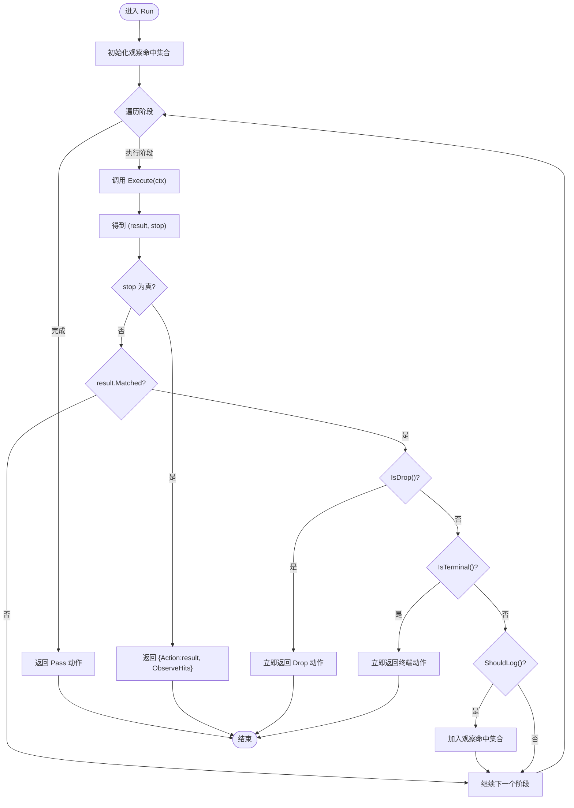
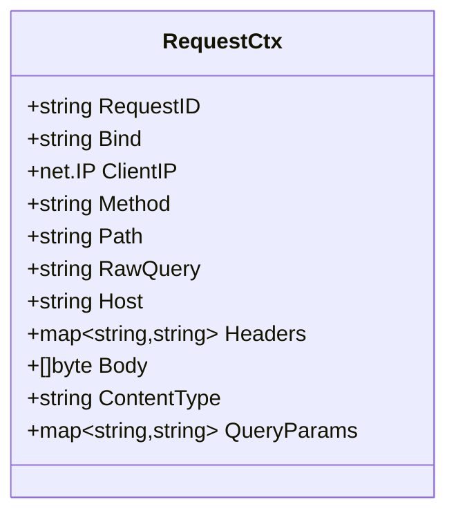
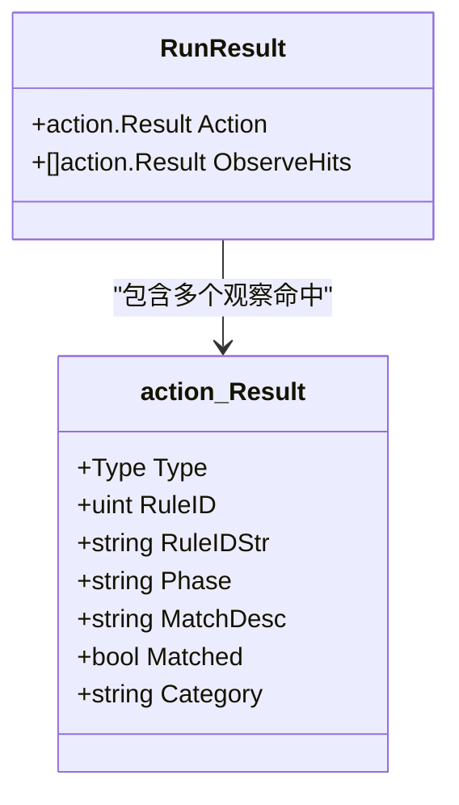
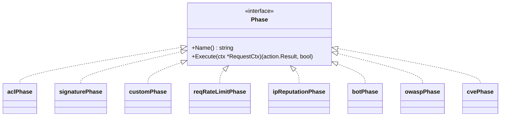
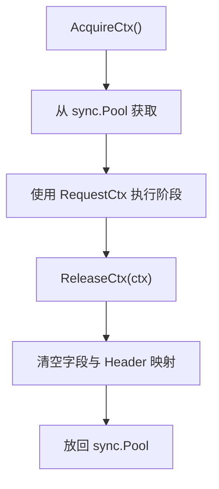
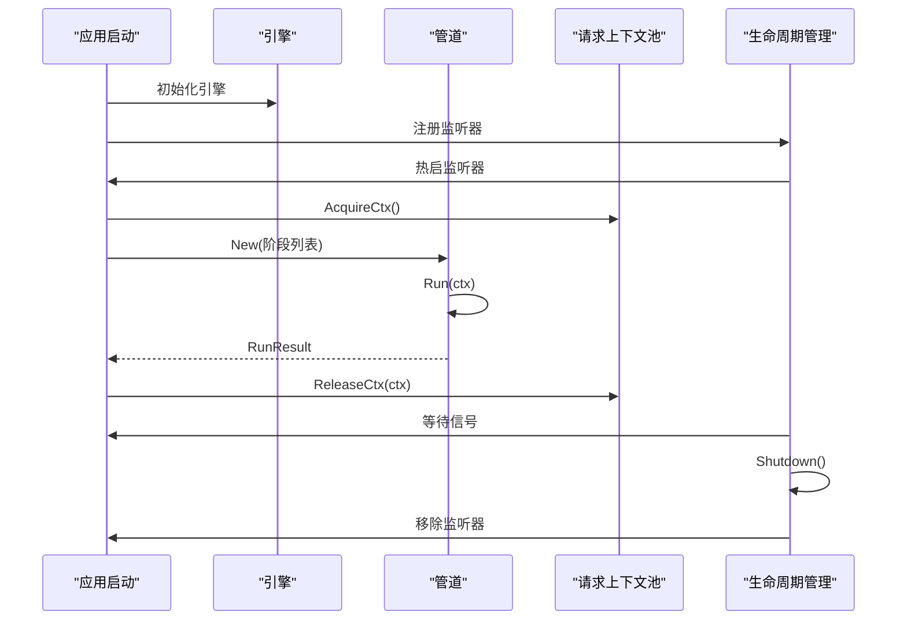
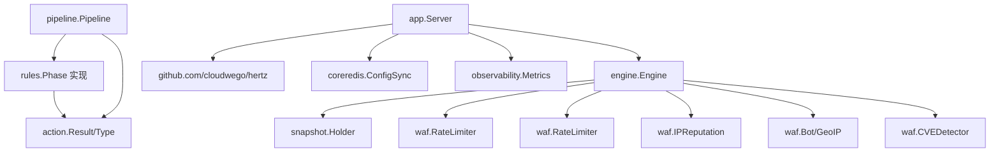

# 管道架构设计

<cite>
**本文档引用的文件**
- [pipeline.go](file://internal/core/pipeline/pipeline.go)
- [pool.go](file://internal/core/pipeline/pool.go)
- [phases.go](file://internal/core/rules/phases.go)
- [engine.go](file://internal/core/engine/engine.go)
- [action.go](file://internal/core/action/action.go)
- [server.go](file://internal/app/server.go)
- [main.go](file://cmd/main.go)
</cite>

## 目录
1. [简介](#简介)
2. [项目结构](#项目结构)
3. [核心组件](#核心组件)
4. [架构总览](#架构总览)
5. [详细组件分析](#详细组件分析)
6. [依赖关系分析](#依赖关系分析)
7. [性能考量](#性能考量)
8. [故障排除指南](#故障排除指南)
9. [结论](#结论)

## 简介
本文件系统性阐述 My-OpenWaf 的管道架构设计，重点解析 Pipeline 结构体的设计原理、阶段数组的组织方式与执行流程；RequestCtx 请求上下文的数据结构与传递机制；RunResult 的设计目的与观察结果收集机制；Phase 接口的抽象设计与扩展性考虑；以及管道池化机制的实现细节与性能优化策略。同时提供从管道创建、初始化到销毁的完整流程说明，帮助读者全面理解该系统的运行机制。

## 项目结构
本项目采用分层与功能模块结合的组织方式：
- internal/core：核心引擎与基础设施
  - pipeline：管道与阶段抽象、请求上下文与池化
  - rules：规则匹配与各阶段实现
  - engine：WAF 引擎编排
  - action：动作类型与结果判定
- internal/app：应用入口与服务编排
- cmd：程序入口点

**图表来源**
- [main.go:1-10](file://cmd/main.go#L1-L10)
- [server.go:1-490](file://internal/app/server.go#L1-L490)
- [engine.go:1-176](file://internal/core/engine/engine.go#L1-L176)
- [pipeline.go:1-71](file://internal/core/pipeline/pipeline.go#L1-L71)
- [pool.go:1-37](file://internal/core/pipeline/pool.go#L1-L37)
- [phases.go:1-569](file://internal/core/rules/phases.go#L1-L569)
- [action.go:1-61](file://internal/core/action/action.go#L1-L61)

**章节来源**
- [main.go:1-10](file://cmd/main.go#L1-L10)
- [server.go:1-490](file://internal/app/server.go#L1-L490)

## 核心组件
本节聚焦于管道架构中的关键数据结构与接口，包括 RequestCtx、Phase、Pipeline、RunResult 及其相互关系。

- RequestCtx：承载解码后的请求信息，贯穿整个管道执行链路，用于规则匹配与决策。
- Phase：阶段接口，定义每个处理阶段的名称与执行逻辑，返回动作结果与是否短路标志。
- Pipeline：有序阶段链，按序执行各阶段，支持短路与观察结果收集。
- RunResult：封装最终动作与观察命中集合，便于日志记录与后续处理。
- Action：动作类型与结果判定，决定是否短路、是否记录日志、是否立即断开连接等。

这些组件共同构成可扩展、可维护的 WAF 处理流水线。

**章节来源**
- [pipeline.go:9-71](file://internal/core/pipeline/pipeline.go#L9-L71)
- [action.go:1-61](file://internal/core/action/action.go#L1-L61)

## 架构总览
下图展示从应用启动到请求处理的端到端流程，包括监听器热启、引擎编排、规则阶段执行与结果返回。

**图表来源**
- [main.go:1-10](file://cmd/main.go#L1-L10)
- [server.go:1-490](file://internal/app/server.go#L1-L490)
- [engine.go:57-129](file://internal/core/engine/engine.go#L57-L129)
- [pipeline.go:46-70](file://internal/core/pipeline/pipeline.go#L46-L70)
- [phases.go:32-358](file://internal/core/rules/phases.go#L32-L358)
- [action.go:29-61](file://internal/core/action/action.go#L29-L61)

## 详细组件分析

### Pipeline 结构体与执行流程
- 设计原理
  - Pipeline 以有序数组存储 Phase 列表，确保阶段执行顺序可控且可扩展。
  - Run 方法按序遍历阶段，根据动作类型进行短路或继续执行，并收集观察命中。
- 执行流程
  - 每个阶段返回 (动作结果, 是否短路)。
  - 若短路为真，立即返回当前动作与已收集的观察命中。
  - 若命中且为 Drop 或终端动作（Intercept），立即短路。
  - 若命中且应记录日志（Observe/Drop/Intercept），则加入观察命中集合。
  - 全部阶段完成后，若未命中则返回 Pass 动作。
- 短路优先级
  - Drop 最高优先级：立即断开 TCP 连接，不发送响应。
  - 终端动作：阻止进一步阶段执行。
  - 观察动作：仅记录日志，继续执行后续阶段。

**图表来源**
- [pipeline.go:46-70](file://internal/core/pipeline/pipeline.go#L46-L70)
- [action.go:40-57](file://internal/core/action/action.go#L40-L57)

**章节来源**
- [pipeline.go:37-71](file://internal/core/pipeline/pipeline.go#L37-L71)
- [action.go:29-61](file://internal/core/action/action.go#L29-L61)

### RequestCtx 请求上下文
- 数据结构
  - RequestID：请求唯一标识
  - Bind：监听绑定地址（如 ":443"）
  - ClientIP：客户端 IP
  - Method/Path/RawQuery/Host：HTTP 方法、路径、查询字符串、主机头
  - Headers：请求头映射
  - Body/ContentType：请求体与内容类型
  - QueryParams：查询参数映射
- 生命周期
  - 创建：由数据平面处理器在接收请求时构造
  - 传递：沿 Pipeline 逐阶段传递给各 Phase
  - 销毁：处理完成后通过池化回收，避免频繁分配
- 字段作用
  - 作为规则匹配的基础输入，支撑 ACL、签名、自定义规则、OWASP、CVE 等阶段的判断
  - 用于速率限制、Bot 检测、IP 黑白名单等基于请求属性的动作

**图表来源**
- [pipeline.go:9-23](file://internal/core/pipeline/pipeline.go#L9-L23)

**章节来源**
- [pipeline.go:9-23](file://internal/core/pipeline/pipeline.go#L9-L23)

### RunResult 与观察结果收集
- 设计目的
  - 将最终动作与观察命中打包返回，便于日志记录、审计与可视化
- 收集机制
  - 在 Pipeline 执行过程中，若某阶段命中且需要记录日志，则将其结果追加到观察命中集合
  - Drop 与终端动作会触发短路，不再继续收集
- 使用场景
  - 安全日志写入、事件归档、指标统计与告警

**图表来源**
- [pipeline.go:31-35](file://internal/core/pipeline/pipeline.go#L31-L35)
- [action.go:29-38](file://internal/core/action/action.go#L29-L38)

**章节来源**
- [pipeline.go:31-35](file://internal/core/pipeline/pipeline.go#L31-L35)
- [action.go:29-38](file://internal/core/action/action.go#L29-L38)

### Phase 接口与扩展性
- 抽象设计
  - Name()：阶段名称，便于日志与调试
  - Execute(ctx)：执行阶段逻辑，返回动作结果与是否短路
- 扩展性考虑
  - 新增阶段只需实现 Phase 接口，插入到 Pipeline 阶段序列中即可
  - 通过配置控制阶段启用/禁用与顺序，实现灵活的策略组合
- 内置阶段
  - ACL/IP 白名单/黑名单
  - 签名规则
  - 自定义规则
  - 请求速率限制
  - IP 信誉检查
  - Bot 检测（单阶段/双阶段）
  - OWASP 默认规则
  - CVE 检测

**图表来源**
- [pipeline.go:25-29](file://internal/core/pipeline/pipeline.go#L25-L29)
- [phases.go:34-358](file://internal/core/rules/phases.go#L34-L358)

**章节来源**
- [pipeline.go:25-29](file://internal/core/pipeline/pipeline.go#L25-L29)
- [phases.go:32-358](file://internal/core/rules/phases.go#L32-L358)

### 管道池化机制与性能优化
- 机制概述
  - 使用 sync.Pool 复用 RequestCtx，减少 GC 压力
  - 预分配 Header 映射容量，降低扩容成本
- 回收策略
  - 释放前清空所有字段，确保下次复用安全
  - 清空 Header 映射键值，避免内存泄漏
- 性能收益
  - 降低高频分配带来的 CPU 与内存压力
  - 减少对象生命周期管理开销，提升热路径吞吐

**图表来源**
- [pool.go:14-36](file://internal/core/pipeline/pool.go#L14-L36)

**章节来源**
- [pool.go:1-37](file://internal/core/pipeline/pool.go#L1-L37)

### 管道创建、初始化与销毁流程
- 创建
  - 由 Engine.Process 根据站点快照与保护配置组装阶段列表
  - 调用 Pipeline.New 并传入阶段切片
- 初始化
  - 监听器热启：按站点维度动态创建 Hertz 服务器实例
  - 配置漂移检测：通过指纹识别配置变更并自动重启受影响监听器
- 执行
  - 数据处理器接收请求，构建 RequestCtx
  - 调用 Pipeline.Run 执行阶段链
  - 返回 RunResult，引擎据此生成 ProcessResult
- 销毁
  - 应用优雅关闭：生命周期管理器统一触发各服务器 Shutdown
  - 监听器移除：根据名称与指纹进行热停
  - 资源释放：引擎、限流器、IP 信誉、Drop 执行器等资源关闭

**图表来源**
- [server.go:150-218](file://internal/app/server.go#L150-L218)
- [engine.go:57-129](file://internal/core/engine/engine.go#L57-L129)
- [pool.go:14-36](file://internal/core/pipeline/pool.go#L14-L36)

**章节来源**
- [server.go:150-218](file://internal/app/server.go#L150-L218)
- [engine.go:57-129](file://internal/core/engine/engine.go#L57-L129)
- [pool.go:14-36](file://internal/core/pipeline/pool.go#L14-L36)

## 依赖关系分析
- 组件耦合
  - Engine 依赖 Snapshot、RateLimiter、IPReputation、Bot 与 CVE 检测器
  - Pipeline 依赖 Phase 接口与 Action 类型
  - Rules 模块实现具体 Phase，依赖 Action 与内部 WAF 组件
- 外部依赖
  - Hertz 作为数据平面服务器框架
  - Redis 用于配置同步与事件归档
  - Prometheus 用于指标采集
- 循环依赖
  - 代码层面未发现循环导入，模块边界清晰

**图表来源**
- [engine.go:15-37](file://internal/core/engine/engine.go#L15-L37)
- [phases.go:1-17](file://internal/core/rules/phases.go#L1-L17)
- [server.go:1-490](file://internal/app/server.go#L1-L490)

**章节来源**
- [engine.go:15-37](file://internal/core/engine/engine.go#L15-L37)
- [phases.go:1-17](file://internal/core/rules/phases.go#L1-L17)
- [server.go:1-490](file://internal/app/server.go#L1-L490)

## 性能考量
- 热路径优化
  - RequestCtx 池化：显著降低 GC 压力，提升并发处理能力
  - 短路优先级：Drop 与终端动作立即返回，减少无效计算
- 规则扫描优化
  - 内容类型感知的目标提取：针对不同 Content-Type 选择合适扫描策略，避免对二进制数据进行昂贵扫描
  - 限制扫描范围：对 multipart 文本字段与 JSON 值设置上限，防止正则耗时过长
- 并发与伸缩
  - 按站点维度热启监听器，支持独立启停与配置漂移检测
  - 生命周期管理器统一启动/停止，保证优雅关闭
- 资源管理
  - 限流器与 IP 信誉在运行时可热重配，无需重启
  - Drop 执行器可按需启用，降低误杀风险

[本节为通用性能建议，不直接分析特定文件]

## 故障排除指南
- 管道未生效
  - 检查 Engine.Process 中阶段组装顺序与保护配置开关
  - 确认 RequestCtx 字段完整（Method/Path/Headers 等）以便规则匹配
- 动作异常
  - 检查 Action 类型标准化与短路判定逻辑
  - 确认 Drop 与终端动作的优先级是否符合预期
- 性能问题
  - 关注 RequestCtx 池化使用情况，避免未释放导致内存泄漏
  - 检查 Body 目标提取策略，避免对大体积或非文本内容进行扫描
- 监听器热启失败
  - 查看配置指纹变化与生命周期管理器日志
  - 确认 TLS 配置与证书加载正确

**章节来源**
- [engine.go:57-129](file://internal/core/engine/engine.go#L57-L129)
- [pipeline.go:46-70](file://internal/core/pipeline/pipeline.go#L46-L70)
- [action.go:40-57](file://internal/core/action/action.go#L40-L57)
- [server.go:150-218](file://internal/app/server.go#L150-L218)

## 结论
本管道架构通过清晰的接口抽象与严格的执行顺序控制，实现了可扩展、高性能的 WAF 处理流水线。RequestCtx 作为贯穿全链的载体，RunResult 提供了完整的动作与观察结果反馈，Phase 接口与内置阶段满足多样化的安全策略需求。配合池化机制与热启/热停能力，系统在保证安全性的同时兼顾了性能与运维效率。未来可在规则编译缓存、多阶段并行化与更细粒度的可观测性方面持续优化。