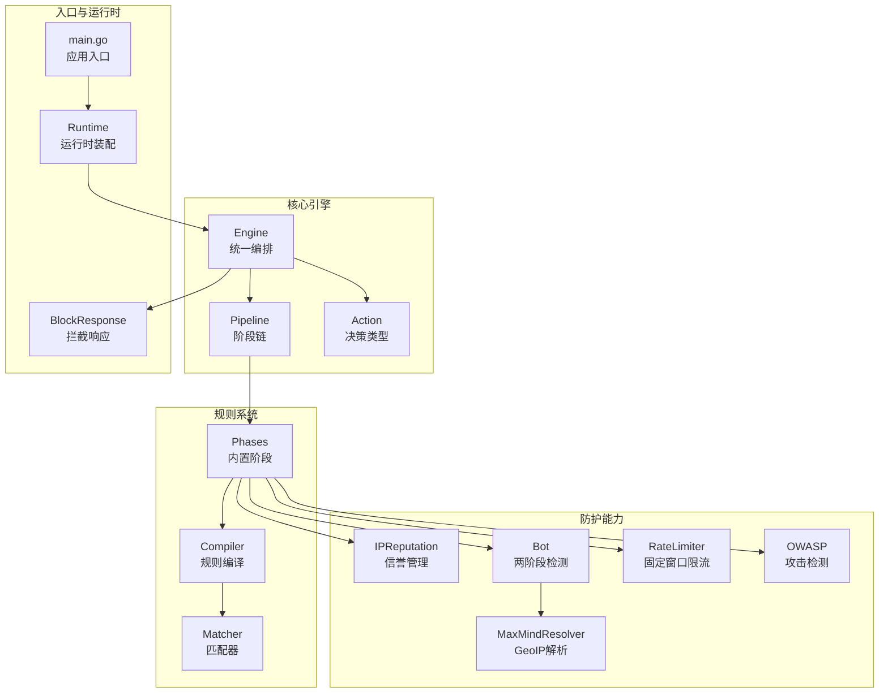
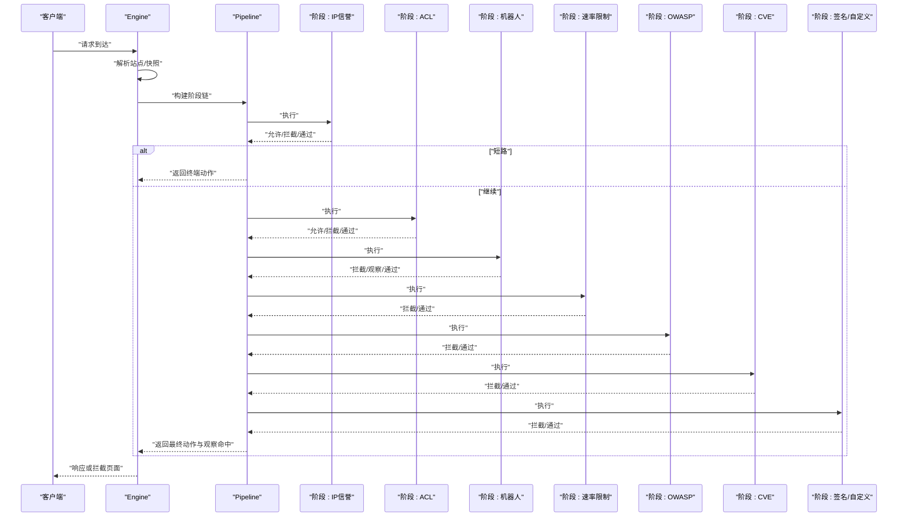
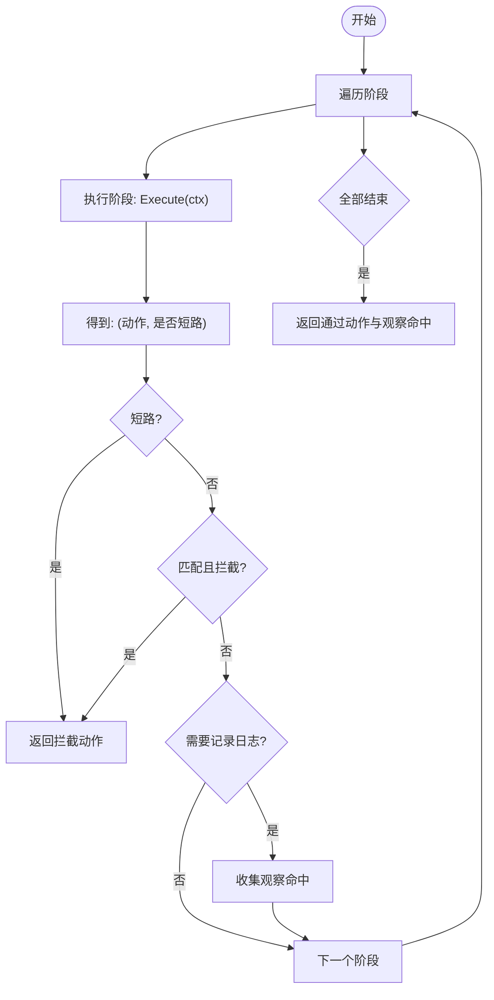
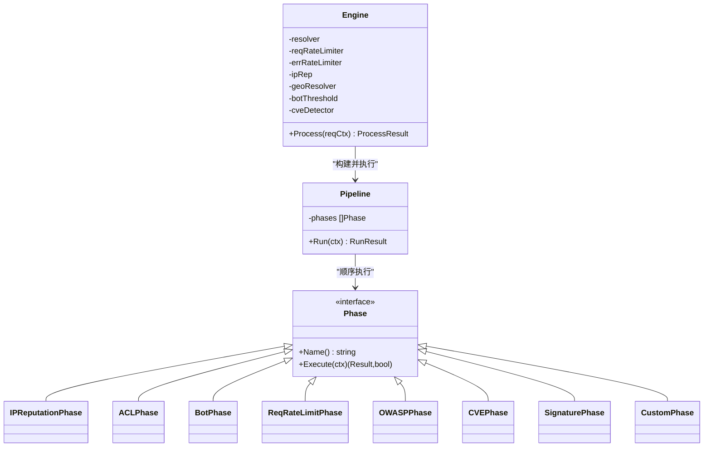
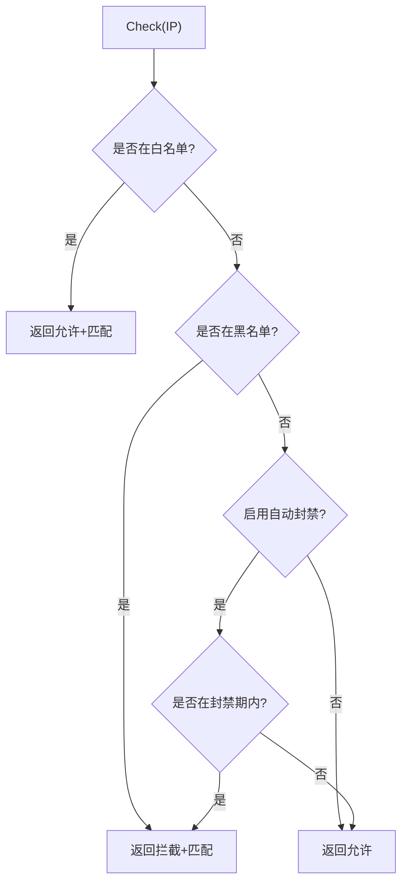
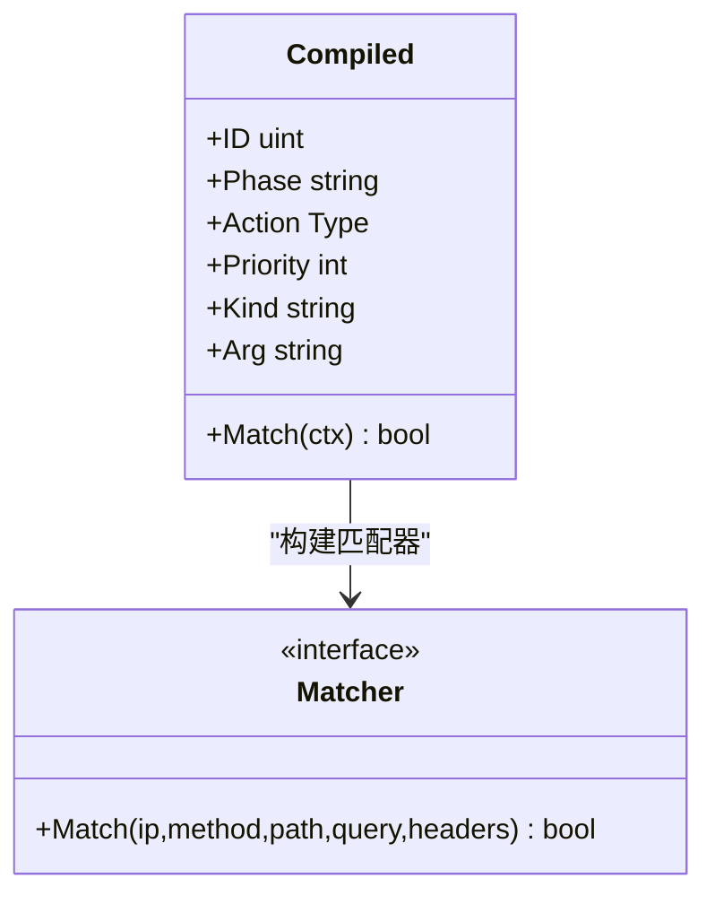
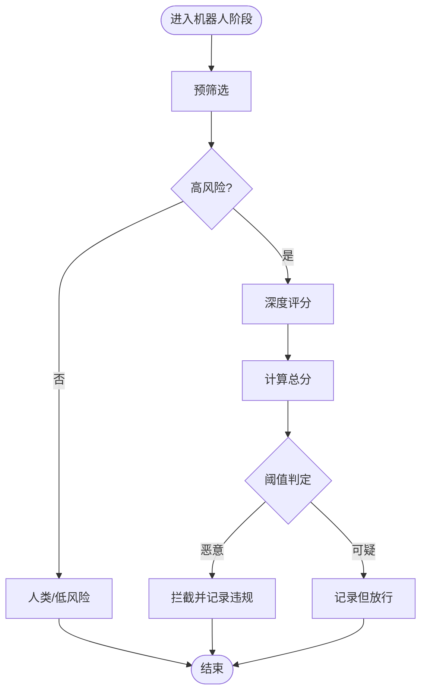
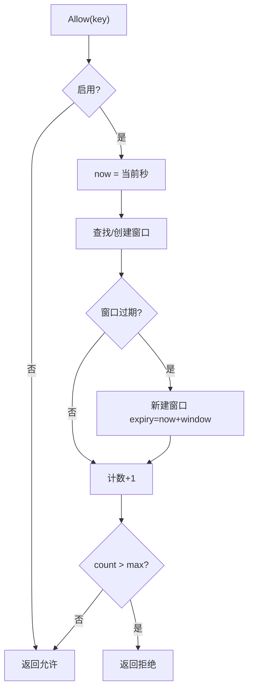
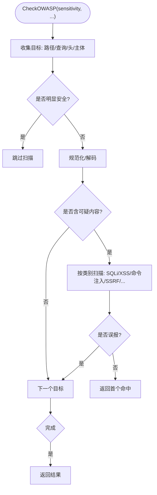
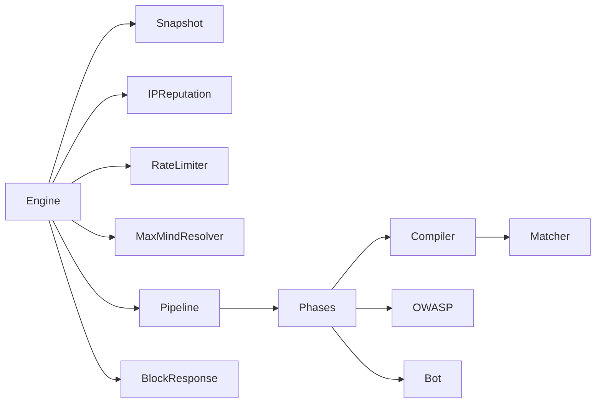

# 规则管道设计

<cite>
**本文档引用的文件**
- [pipeline.go](file://internal/core/pipeline/pipeline.go)
- [pool.go](file://internal/core/pipeline/pool.go)
- [engine.go](file://internal/core/engine/engine.go)
- [phases.go](file://internal/core/rules/phases.go)
- [action.go](file://internal/core/action/action.go)
- [compiler.go](file://internal/core/rules/compiler.go)
- [matcher.go](file://internal/core/rules/matcher.go)
- [iprep.go](file://internal/waf/iprep.go)
- [bot.go](file://internal/waf/bot.go)
- [ratelimit.go](file://internal/waf/ratelimit.go)
- [owasp.go](file://internal/waf/owasp.go)
- [geoip.go](file://internal/waf/geoip.go)
- [block.go](file://internal/waf/block.go)
- [runtime.go](file://internal/core/runtime.go)
- [main.go](file://cmd/main.go)
</cite>

## 目录
1. [引言](#引言)
2. [项目结构](#项目结构)
3. [核心组件](#核心组件)
4. [架构总览](#架构总览)
5. [详细组件分析](#详细组件分析)
6. [依赖关系分析](#依赖关系分析)
7. [性能考虑](#性能考虑)
8. [故障排除指南](#故障排除指南)
9. [结论](#结论)
10. [附录](#附录)

## 引言
本文件系统性阐述 OpenWAF 的规则管道设计，涵盖管道创建、阶段组织与执行机制；明确各处理阶段的职责（IP信誉检查、ACL规则匹配、机器人检测、速率限制、OWASP检测等）；解释阶段执行顺序的设计原理与短路机制；提供管道扩展方法与自定义阶段开发指南，并总结性能优化策略与调试技巧。

## 项目结构
OpenWAF 的规则管道位于 internal/core/pipeline 与 internal/core/rules 中，配合 internal/waf 提供具体防护能力，internal/core/engine 统一编排，形成“请求上下文 → 阶段链 → 决策结果”的流水线式处理。

**图表来源**
- [engine.go:15-128](file://internal/core/engine/engine.go#L15-L128)
- [pipeline.go:37-65](file://internal/core/pipeline/pipeline.go#L37-L65)
- [phases.go:32-298](file://internal/core/rules/phases.go#L32-L298)
- [compiler.go:27-55](file://internal/core/rules/compiler.go#L27-L55)
- [matcher.go:16-261](file://internal/core/rules/matcher.go#L16-L261)
- [iprep.go:18-124](file://internal/waf/iprep.go#L18-L124)
- [bot.go:126-454](file://internal/waf/bot.go#L126-L454)
- [ratelimit.go:9-117](file://internal/waf/ratelimit.go#L9-L117)
- [owasp.go:48-234](file://internal/waf/owasp.go#L48-L234)
- [geoip.go:26-223](file://internal/waf/geoip.go#L26-L223)
- [block.go:16-39](file://internal/waf/block.go#L16-L39)
- [runtime.go:17-79](file://internal/core/runtime.go#L17-L79)
- [main.go:7-9](file://cmd/main.go#L7-L9)

**章节来源**
- [engine.go:15-128](file://internal/core/engine/engine.go#L15-L128)
- [pipeline.go:37-65](file://internal/core/pipeline/pipeline.go#L37-L65)
- [phases.go:32-298](file://internal/core/rules/phases.go#L32-L298)
- [compiler.go:27-55](file://internal/core/rules/compiler.go#L27-L55)
- [matcher.go:16-261](file://internal/core/rules/matcher.go#L16-L261)
- [iprep.go:18-124](file://internal/waf/iprep.go#L18-L124)
- [bot.go:126-454](file://internal/waf/bot.go#L126-L454)
- [ratelimit.go:9-117](file://internal/waf/ratelimit.go#L9-L117)
- [owasp.go:48-234](file://internal/waf/owasp.go#L48-L234)
- [geoip.go:26-223](file://internal/waf/geoip.go#L26-L223)
- [block.go:16-39](file://internal/waf/block.go#L16-L39)
- [runtime.go:17-79](file://internal/core/runtime.go#L17-L79)
- [main.go:7-9](file://cmd/main.go#L7-L9)

## 核心组件
- 请求上下文 RequestCtx：承载解码后的请求数据，贯穿整个管道。
- 阶段 Phase 接口：定义阶段名称与执行函数，返回动作结果与是否短路标志。
- 管道 Pipeline：按序执行阶段，支持短路与观察命中收集。
- 动作 Result：封装决策类型、阶段、匹配描述、分类等元信息。
- 规则编译器 Compiler 与匹配器 Matcher：将规则 DSL 编译为可执行的匹配器集合。
- 防护能力模块：IP信誉、机器人检测、速率限制、OWASP检测、GeoIP解析等。

**章节来源**
- [pipeline.go:9-65](file://internal/core/pipeline/pipeline.go#L9-L65)
- [action.go:28-53](file://internal/core/action/action.go#L28-L53)
- [compiler.go:11-55](file://internal/core/rules/compiler.go#L11-L55)
- [matcher.go:11-261](file://internal/core/rules/matcher.go#L11-L261)

## 架构总览
规则管道采用“阶段链”模式，Engine 在每次请求中根据站点配置动态组装阶段列表，Pipeline 依次执行，遇到终端动作立即短路，否则收集观察命中用于日志记录。

**图表来源**
- [engine.go:56-128](file://internal/core/engine/engine.go#L56-L128)
- [pipeline.go:46-65](file://internal/core/pipeline/pipeline.go#L46-L65)
- [phases.go:32-298](file://internal/core/rules/phases.go#L32-L298)

**章节来源**
- [engine.go:56-128](file://internal/core/engine/engine.go#L56-L128)
- [pipeline.go:46-65](file://internal/core/pipeline/pipeline.go#L46-L65)

## 详细组件分析

### 管道与阶段执行机制
- 管道 Run 顺序遍历阶段，每个阶段返回 (动作, 是否短路)。
- 短路条件：动作被归一化为拦截且匹配成功时立即终止。
- 观察命中：仅当动作需要记录日志时收集，便于审计与告警。

**图表来源**
- [pipeline.go:46-65](file://internal/core/pipeline/pipeline.go#L46-L65)
- [action.go:39-49](file://internal/core/action/action.go#L39-L49)

**章节来源**
- [pipeline.go:46-65](file://internal/core/pipeline/pipeline.go#L46-L65)
- [action.go:39-49](file://internal/core/action/action.go#L39-L49)

### 阶段职责与执行顺序
阶段在 Engine 中按以下顺序组装（满足安全优先与性能考量）：
1) IP信誉：白名单直接短路放行，黑名单直接拦截。
2) ACL：基于编译后的规则集进行匹配，允许可短路。
3) 机器人检测：优先使用两阶段（预筛选→深度评分），恶意工具与高风险IP提前阻断。
4) 请求速率限制：基于客户端IP+Host的固定窗口计数。
5) OWASP默认规则：针对路径、查询、头、主体等多维扫描。
6) CVE检测：针对已知目标化漏洞的特征匹配。
7) 签名/自定义：通用规则匹配，作为兜底。

**图表来源**
- [engine.go:15-128](file://internal/core/engine/engine.go#L15-L128)
- [phases.go:32-298](file://internal/core/rules/phases.go#L32-L298)
- [pipeline.go:25-44](file://internal/core/pipeline/pipeline.go#L25-L44)

**章节来源**
- [engine.go:82-128](file://internal/core/engine/engine.go#L82-L128)
- [phases.go:32-298](file://internal/core/rules/phases.go#L32-L298)

### IP信誉检查阶段
- 职责：检查白/黑名单与自动封禁，白名单直接短路放行，黑名单直接拦截。
- 关键点：并发安全的计分板与过期清理；支持动态配置更新。

**图表来源**
- [iprep.go:89-124](file://internal/waf/iprep.go#L89-L124)

**章节来源**
- [iprep.go:18-124](file://internal/waf/iprep.go#L18-L124)
- [phases.go:130-170](file://internal/core/rules/phases.go#L130-L170)

### ACL 规则匹配阶段
- 职责：按优先级编译规则，逐条匹配，允许可短路，拦截即终止。
- 关键点：规则DSL解析与正则缓存；复合条件AND/OR/NOT树构建。

**图表来源**
- [compiler.go:11-55](file://internal/core/rules/compiler.go#L11-L55)
- [matcher.go:11-261](file://internal/core/rules/matcher.go#L11-L261)

**章节来源**
- [compiler.go:27-55](file://internal/core/rules/compiler.go#L27-L55)
- [matcher.go:166-261](file://internal/core/rules/matcher.go#L166-L261)
- [phases.go:32-52](file://internal/core/rules/phases.go#L32-L52)

### 机器人检测阶段（两阶段）
- 预筛选（快速）：已知恶意UA、黑名单/自动封禁IP、高风险GeoIP（数据中心/VPN/高危国家）。
- 深度评分（慢但更准）：GeoIP权重、指纹评分、TLS/HTTP2指纹、IP信誉加权。
- 行为：恶意判定触发自动封禁；可疑判定仅记录不拦截。

**图表来源**
- [bot.go:126-161](file://internal/waf/bot.go#L126-L161)
- [bot.go:167-224](file://internal/waf/bot.go#L167-L224)
- [geoip.go:153-223](file://internal/waf/geoip.go#L153-L223)

**章节来源**
- [bot.go:126-239](file://internal/waf/bot.go#L126-L239)
- [geoip.go:153-223](file://internal/waf/geoip.go#L153-L223)
- [phases.go:172-239](file://internal/core/rules/phases.go#L172-L239)

### 速率限制阶段
- 固定窗口限流：以“客户端IP+Host”为键，窗口内计数超过阈值则拦截。
- 支持错误率独立计数（可选）。

**图表来源**
- [ratelimit.go:48-92](file://internal/waf/ratelimit.go#L48-L92)

**章节来源**
- [ratelimit.go:9-117](file://internal/waf/ratelimit.go#L9-L117)
- [phases.go:96-128](file://internal/core/rules/phases.go#L96-L128)

### OWASP 检测阶段
- 职责：对路径、查询、头、主体等进行多轮扫描，抑制常见误报，支持敏感度分级。
- 关键点：目标提取、规范化与解码、JS转义与UTF-7解码、二进制探测、协议层检查。

**图表来源**
- [owasp.go:48-234](file://internal/waf/owasp.go#L48-L234)

**章节来源**
- [owasp.go:48-234](file://internal/waf/owasp.go#L48-L234)
- [phases.go:241-298](file://internal/core/rules/phases.go#L241-L298)

### CVE 检测阶段
- 职责：对请求构建CVE专用请求对象，调用检测器匹配已知目标化漏洞。
- 执行时机：在OWASP之后，避免重复扫描通用规则。

**章节来源**
- [phases.go:300-344](file://internal/core/rules/phases.go#L300-L344)

### 自定义阶段与扩展指南
- 新增阶段：实现 Phase 接口，注册到 Engine 的阶段构建逻辑中。
- 规则扩展：通过 DSL 或复合条件扩展规则匹配器，注意正则缓存与边界处理。
- 性能建议：尽量前置昂贵检查（如GeoIP评分）；避免对大体量主体做深度扫描；合理设置敏感度阈值。

**章节来源**
- [phases.go:32-344](file://internal/core/rules/phases.go#L32-L344)
- [matcher.go:166-261](file://internal/core/rules/matcher.go#L166-L261)

## 依赖关系分析
- Engine 依赖 Snapshot 解析站点规则与保护配置，依赖 RateLimiter/IPReputation/MaxMindResolver 等能力模块。
- Pipeline 仅依赖 Phase 接口，耦合度低，便于扩展。
- 规则系统通过 Compiler/Matcher 将存储规则转换为高性能匹配器。
- 防护模块相互独立，可按需启用。

**图表来源**
- [engine.go:15-128](file://internal/core/engine/engine.go#L15-L128)
- [phases.go:32-298](file://internal/core/rules/phases.go#L32-L298)
- [compiler.go:27-55](file://internal/core/rules/compiler.go#L27-L55)
- [matcher.go:166-261](file://internal/core/rules/matcher.go#L166-L261)
- [block.go:16-39](file://internal/waf/block.go#L16-L39)

**章节来源**
- [engine.go:15-128](file://internal/core/engine/engine.go#L15-L128)
- [phases.go:32-298](file://internal/core/rules/phases.go#L32-L298)

## 性能考虑
- 对象池复用：RequestCtx 使用 sync.Pool 减少GC压力。
- 正则缓存：规则中的正则表达式编译后缓存，避免重复编译。
- 快速路径：OWASP先做“明显安全”短路与轻量规范化，再深入扫描。
- 固定窗口限流：原子计数与定期清理，降低锁竞争。
- GeoIP预筛：O(1)哈希表判断高风险，两阶段评分仅对高风险IP执行。
- 体扫限制：对大体量主体设置采样上限，避免正则爆炸。

**章节来源**
- [pool.go:5-37](file://internal/core/pipeline/pool.go#L5-L37)
- [matcher.go:271-296](file://internal/core/rules/matcher.go#L271-L296)
- [owasp.go:48-234](file://internal/waf/owasp.go#L48-L234)
- [ratelimit.go:98-116](file://internal/waf/ratelimit.go#L98-L116)
- [geoip.go:153-223](file://internal/waf/geoip.go#L153-L223)

## 故障排除指南
- 拦截页面渲染：根据站点与全局配置选择模板或嵌入页，失败回退至简单HTML。
- 维护模式：全局或站点维护时直接拦截，返回维护页。
- 日志与追踪：观察命中用于审计；终端动作携带阶段与规则标识，便于溯源。
- 调试建议：
  - 逐步缩小阶段范围定位问题（如仅保留ACL/OWASP）。
  - 检查规则优先级与匹配条件，确认复合条件的布尔逻辑。
  - 关注正则缓存与无效正则导致的“永不匹配”行为。
  - 验证GeoIP数据库路径与热重载配置。

**章节来源**
- [block.go:16-110](file://internal/waf/block.go#L16-L110)
- [engine.go:68-80](file://internal/core/engine/engine.go#L68-L80)
- [action.go:39-49](file://internal/core/action/action.go#L39-L49)

## 结论
OpenWAF 的规则管道以“阶段链 + 短路 + 观察命中”为核心，结合规则编译与高性能匹配器，实现了可扩展、可观测、可优化的安全控制面。通过合理的阶段顺序与短路机制，既保证了安全性，又兼顾了性能与可维护性。扩展新阶段与规则只需遵循 Phase 接口与规则DSL规范，即可无缝融入现有流水线。

## 附录
- 运行时装配：Runtime 负责打开数据库、可选Redis、缓存与快照持有者，供 Engine 使用。
- 应用入口：main 调用 internal/app.Run 启动服务。

**章节来源**
- [runtime.go:17-79](file://internal/core/runtime.go#L17-L79)
- [main.go:7-9](file://cmd/main.go#L7-L9)