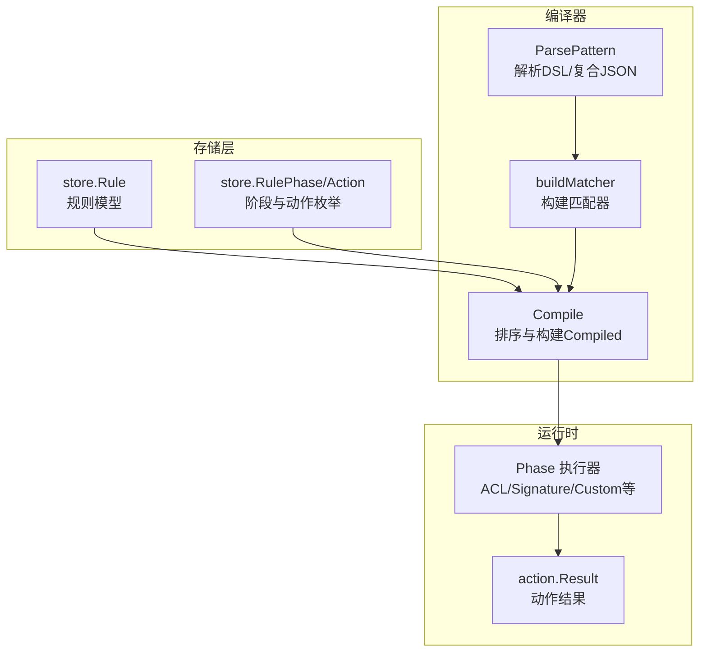
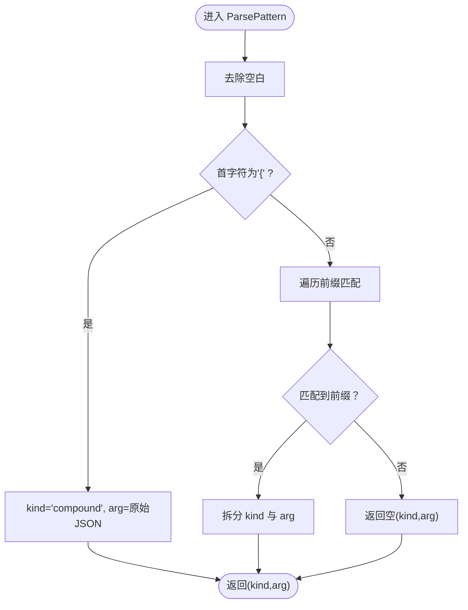
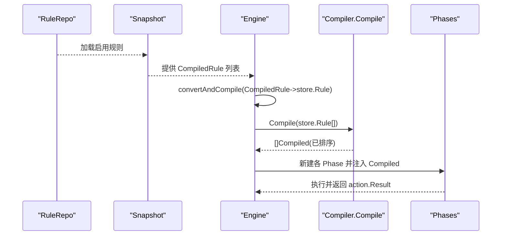
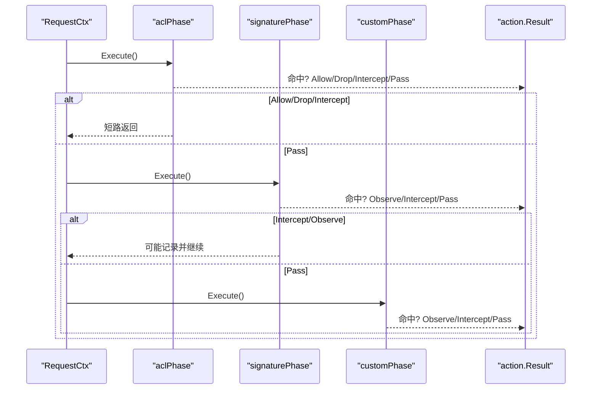
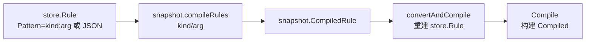
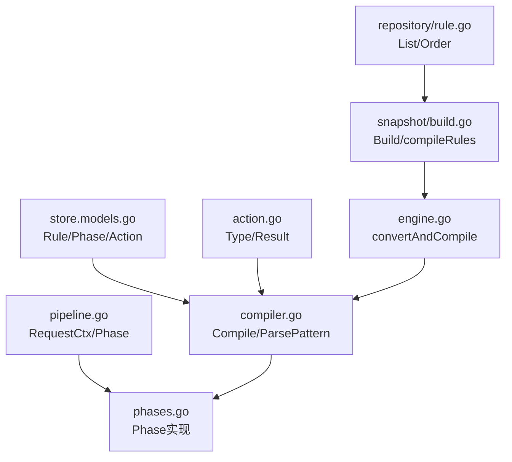
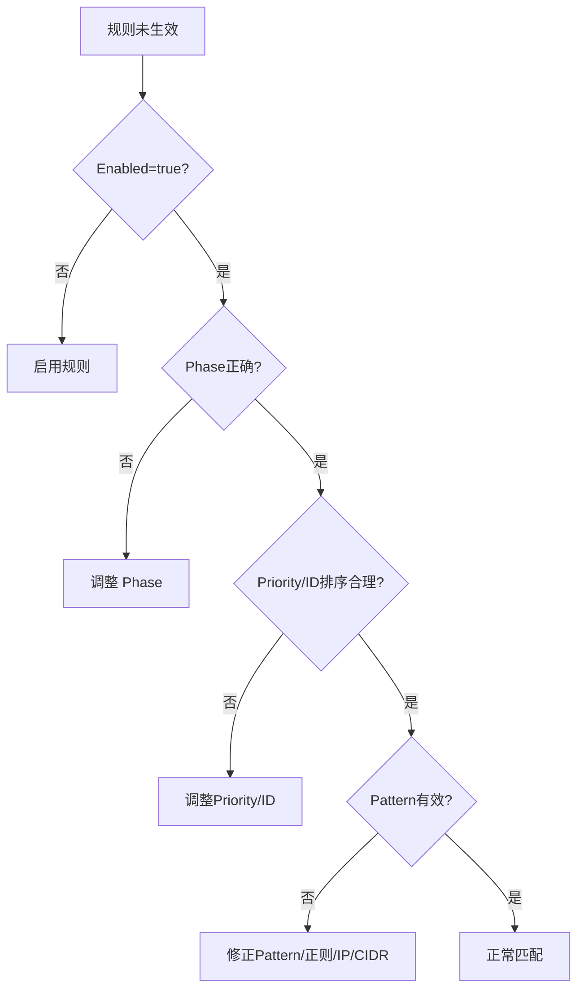

# 规则编译器

<cite>
**本文引用的文件列表**
- [compiler.go](file://internal/core/rules/compiler.go)
- [matcher.go](file://internal/core/rules/matcher.go)
- [phases.go](file://internal/core/rules/phases.go)
- [models.go](file://internal/store/models.go)
- [rule.go](file://internal/store/repository/rule.go)
- [engine.go](file://internal/core/engine/engine.go)
- [handler_rule.go](file://internal/admin/handler_rule.go)
- [build.go](file://internal/snapshot/build.go)
- [snapshot.go](file://internal/snapshot/snapshot.go)
- [action.go](file://internal/core/action/action.go)
- [pipeline.go](file://internal/core/pipeline/pipeline.go)
- [compiler_test.go](file://internal/core/rules/compiler_test.go)
- [matcher_test.go](file://internal/core/rules/matcher_test.go)
</cite>

## 目录
1. [简介](#简介)
2. [项目结构与角色定位](#项目结构与角色定位)
3. [核心组件](#核心组件)
4. [架构总览](#架构总览)
5. [详细组件分析](#详细组件分析)
6. [依赖关系分析](#依赖关系分析)
7. [性能与优化](#性能与优化)
8. [故障排查与调试](#故障排查与调试)
9. [结论](#结论)
10. [附录：扩展与自定义开发指南](#附录扩展与自定义开发指南)

## 简介
本文件系统性阐述规则编译器的设计与实现，覆盖从规则 DSL 解析、抽象语法树（AST）风格的“条件组合”、到运行时可直接匹配的 Compiled 结构体；并说明从持久化 Rule 到运行时 Compiled 的转换流程、规则排序与优先级处理、以及编译期与运行期的性能优化策略。同时提供错误处理与调试方法，并给出扩展点与自定义规则开发指南，帮助开发者在不破坏现有架构的前提下扩展规则类型与匹配器。

## 项目结构与角色定位
规则编译器位于 internal/core/rules 子系统，负责：
- 将存储层 Rule 模型转换为运行时 Ready 的 Compiled 规则集合
- 解析规则 DSL 并构建匹配器（Matcher）
- 支持复合条件（AND/OR/NOT）与正则缓存等优化
- 与引擎 pipeline 集成，按阶段执行匹配与决策

相关模块与职责：
- internal/store：规则数据模型、动作类型、阶段枚举
- internal/core/engine：请求处理入口，触发编译与流水线执行
- internal/snapshot：快照构建，将数据库规则预编译为轻量 CompiledRule
- internal/admin：规则管理 API，含规则测试接口
- internal/core/pipeline：流水线框架，定义 Phase 接口与执行语义
- internal/core/action：动作类型与结果语义（允许、拦截、观察、丢弃）

**章节来源**
- [compiler.go:1-83](file://internal/core/rules/compiler.go#L1-L83)
- [models.go:44-92](file://internal/store/models.go#L44-L92)
- [engine.go:150-168](file://internal/core/engine/engine.go#L150-L168)
- [build.go:165-201](file://internal/snapshot/build.go#L165-L201)

## 核心组件
- 规则 DSL 与解析
  - ParsePattern：解析简单模式与复合 JSON 条件
- 匹配器体系
  - Matcher 接口与具体实现（CIDR、路径前缀/正则、查询参数、头部、方法、内容类型、UA、体、参数等）
  - 复合匹配器（AND/OR/NOT）
  - 正则缓存（cachedCompile）
- 编译器
  - Compile：将 Rule 列表转换为已排序的 Compiled 列表
  - buildMatcher：根据 kind:arg 构建具体匹配器
- 运行时阶段
  - ACL/Signature/Custom 等 Phase 实现
  - hit：命中后构造 action.Result
- 数据模型
  - store.Rule、store.RulePhase、store.RuleAction
- 转换与集成
  - convertAndCompile：将 snapshot.CompiledRule 转回 store.Rule 再 Compile
  - snapshot.compileRules：快照构建时的预编译

**章节来源**
- [compiler.go:27-82](file://internal/core/rules/compiler.go#L27-L82)
- [matcher.go:11-261](file://internal/core/rules/matcher.go#L11-L261)
- [phases.go:34-560](file://internal/core/rules/phases.go#L34-L560)
- [models.go:44-92](file://internal/store/models.go#L44-L92)
- [engine.go:150-168](file://internal/core/engine/engine.go#L150-L168)
- [build.go:165-201](file://internal/snapshot/build.go#L165-L201)

## 架构总览
规则编译器在请求处理链路中的位置如下：
- Engine.Process 加载快照，调用 convertAndCompile 将 CompiledRule 转为 store.Rule 后 Compile
- Compile 解析 DSL，构建 Matcher，并按 Priority 与 ID 排序
- 各 Phase（ACL/Signature/Custom 等）遍历 Compiled 规则进行匹配
- 命中后通过 action.Result 决策是否短路或继续

**图表来源**
- [compiler.go:27-82](file://internal/core/rules/compiler.go#L27-L82)
- [matcher.go:167-261](file://internal/core/rules/matcher.go#L167-L261)
- [phases.go:34-128](file://internal/core/rules/phases.go#L34-L128)
- [models.go:44-92](file://internal/store/models.go#L44-L92)

**章节来源**
- [engine.go:82-128](file://internal/core/engine/engine.go#L82-L128)
- [phases.go:34-128](file://internal/core/rules/phases.go#L34-L128)

## 详细组件分析

### 组件一：规则 DSL 解析与 AST 风格条件
- ParsePattern
  - 支持简单模式（如 block_ip:1.2.3.0/24）与复合 JSON 条件（{"op":"and|or|not","children":[...]} 或 {"kind":"...","arg":"..."}）
  - 返回 kind 与 arg，供 buildMatcher 使用
- 复合条件解析
  - parseCompoundJSON + buildCompound：递归构建 AND/OR/NOT 树
  - 有效子条件映射到具体匹配器
- 错误与边界处理
  - 无效正则返回 neverMatcher
  - 无效 CIDR/IP 返回 neverMatcher
  - 未知 kind 返回 neverMatcher

**图表来源**
- [compiler.go:58-82](file://internal/core/rules/compiler.go#L58-L82)
- [matcher.go:299-342](file://internal/core/rules/matcher.go#L299-L342)

**章节来源**
- [compiler.go:58-82](file://internal/core/rules/compiler.go#L58-L82)
- [matcher.go:299-342](file://internal/core/rules/matcher.go#L299-L342)

### 组件二：匹配器体系与运行时构建
- Matcher 接口
  - 定义 Match(ip, method, path, query, headers) bool
- 具体匹配器
  - CIDR/IP：block_ip/allow_ip
  - 路径：block_path、block_path_regex、block_path_exact
  - 查询：block_query_contains、block_query_regex、query_param
  - 头部：block_header、block_header_regex、header_regex
  - 方法：block_method
  - 内容类型：block_content_type
  - UA：block_user_agent、block_user_agent_regex
  - 体：body_contains（占位，实际在引擎上下文检查）
  - 逻辑：AND/OR/NOT
- 构建策略
  - buildMatcher：根据 kind 分派到具体匹配器构造
  - 正则缓存：cachedCompile 使用读写锁保护全局缓存，避免重复编译
- 边界与安全
  - 无效正则/IP/CIDR 返回 neverMatcher，避免全匹配或全不匹配

```mermaid
classDiagram
class Matcher {
<<interface>>
+Match(ip, method, path, query, headers) bool
}
class ipCIDRMatcher
class pathPrefixMatcher
class pathRegexMatcher
class queryContainsMatcher
class queryRegexMatcher
class headerContainsMatcher
class headerRegexMatcher
class exactPathMatcher
class methodMatcher
class contentTypeMatcher
class bodyContainsMatcher
class queryParamMatcher
class andMatcher
class orMatcher
class notMatcher
class neverMatcher
class alwaysMatcher
Matcher <|.. ipCIDRMatcher
Matcher <|.. pathPrefixMatcher
Matcher <|.. pathRegexMatcher
Matcher <|.. queryContainsMatcher
Matcher <|.. queryRegexMatcher
Matcher <|.. headerContainsMatcher
Matcher <|.. headerRegexMatcher
Matcher <|.. exactPathMatcher
Matcher <|.. methodMatcher
Matcher <|.. contentTypeMatcher
Matcher <|.. bodyContainsMatcher
Matcher <|.. queryParamMatcher
Matcher <|.. andMatcher
Matcher <|.. orMatcher
Matcher <|.. notMatcher
Matcher <|.. neverMatcher
Matcher <|.. alwaysMatcher
```

**图表来源**
- [matcher.go:11-261](file://internal/core/rules/matcher.go#L11-L261)

**章节来源**
- [matcher.go:11-261](file://internal/core/rules/matcher.go#L11-L261)

### 组件三：编译器与排序
- Compile
  - 过滤禁用规则
  - ParsePattern 提取 kind/arg
  - buildMatcher 构造匹配器
  - sort.Slice 按 Priority 升序、ID 升序排序
- 规则格式转换
  - convertAndCompile：将 snapshot.CompiledRule 转回 store.Rule，再 Compile
  - snapshot.compileRules：快照构建时的预编译（仅提取 kind/arg）

**图表来源**
- [engine.go:82-128](file://internal/core/engine/engine.go#L82-L128)
- [engine.go:150-168](file://internal/core/engine/engine.go#L150-L168)
- [compiler.go:27-55](file://internal/core/rules/compiler.go#L27-L55)
- [build.go:165-177](file://internal/snapshot/build.go#L165-L177)

**章节来源**
- [compiler.go:27-55](file://internal/core/rules/compiler.go#L27-L55)
- [engine.go:150-168](file://internal/core/engine/engine.go#L150-L168)
- [build.go:165-177](file://internal/snapshot/build.go#L165-L177)

### 组件四：运行时阶段与命中处理
- Phase
  - aclPhase/signaturePhase/customPhase：过滤对应 Phase 的 Compiled 规则并顺序匹配
  - hit：构造 action.Result，包含 RuleID、RuleIDStr、Phase、MatchDesc、Category 等
- 短路与日志
  - Allow 在 ACL 阶段可短路跳过后续阶段
  - Intercept/Drop 立即短路，无需继续
  - Observe 记录但不短路，用于后续日志聚合

**图表来源**
- [phases.go:34-128](file://internal/core/rules/phases.go#L34-L128)
- [action.go:29-61](file://internal/core/action/action.go#L29-L61)

**章节来源**
- [phases.go:34-128](file://internal/core/rules/phases.go#L34-L128)
- [action.go:29-61](file://internal/core/action/action.go#L29-L61)

### 组件五：规则格式转换机制（CompiledRule ↔ store.Rule）
- 快照构建时
  - snapshot.compileRules：将 store.Rule 的 Pattern 解析为 kind/arg，形成 CompiledRule
- 运行时
  - convertAndCompile：将 snapshot.CompiledRule 转回 store.Rule（复合规则使用原始 JSON 作为 Pattern），再 Compile
- 关键点
  - 复合规则：kind="compound" 且 Pattern 为原始 JSON（以 { 开头）
  - 其他规则：Pattern 为 "kind:arg"

**图表来源**
- [build.go:165-177](file://internal/snapshot/build.go#L165-L177)
- [engine.go:150-168](file://internal/core/engine/engine.go#L150-L168)
- [compiler.go:27-55](file://internal/core/rules/compiler.go#L27-L55)

**章节来源**
- [build.go:165-177](file://internal/snapshot/build.go#L165-L177)
- [engine.go:150-168](file://internal/core/engine/engine.go#L150-L168)

## 依赖关系分析
- 编译器依赖
  - store.Rule、store.RulePhase、store.RuleAction
  - action.Type、action.Result
  - pipeline.RequestCtx（用于上下文转换）
- 运行时依赖
  - phases.go 中的 Phase 实现依赖 Compiled 列表
  - action.Result 的 IsTerminal/IsDrop/ShouldLog 控制短路与日志
- 快照与仓库
  - snapshot.Build 从数据库加载规则并排序
  - repository.RuleRepo 提供 CRUD 与排序查询

**图表来源**
- [models.go:44-92](file://internal/store/models.go#L44-L92)
- [compiler.go:27-55](file://internal/core/rules/compiler.go#L27-L55)
- [action.go:29-61](file://internal/core/action/action.go#L29-L61)
- [pipeline.go:9-35](file://internal/core/pipeline/pipeline.go#L9-L35)
- [phases.go:34-128](file://internal/core/rules/phases.go#L34-L128)
- [rule.go:13-28](file://internal/store/repository/rule.go#L13-L28)
- [build.go:14-47](file://internal/snapshot/build.go#L14-L47)
- [engine.go:150-168](file://internal/core/engine/engine.go#L150-L168)

**章节来源**
- [models.go:44-92](file://internal/store/models.go#L44-L92)
- [rule.go:13-28](file://internal/store/repository/rule.go#L13-L28)
- [build.go:14-47](file://internal/snapshot/build.go#L14-L47)
- [engine.go:150-168](file://internal/core/engine/engine.go#L150-L168)

## 性能与优化
- 规则排序
  - Compile 与 snapshot.Build 均按 Priority 升序、ID 升序排序，确保稳定且可控的匹配顺序
- 正则缓存
  - cachedCompile 使用全局读写锁保护缓存，避免重复编译正则表达式
- 匹配器选择
  - 对于 CIDR/IP：使用 net.IPNet.Contains，O(1) 判断
  - 对于路径/查询/头部：使用字符串前缀/包含/正则，尽量使用前缀/包含减少正则开销
- 体匹配延迟
  - body_contains 作为占位符，实际在引擎上下文检查，避免在编译期做昂贵的体扫描
- 短路策略
  - Allow 在 ACL 阶段短路，避免后续阶段开销
  - Drop/Intercept 立即短路，减少后续匹配成本

**章节来源**
- [compiler.go:48-54](file://internal/core/rules/compiler.go#L48-L54)
- [build.go:40-47](file://internal/snapshot/build.go#L40-L47)
- [matcher.go:278-296](file://internal/core/rules/matcher.go#L278-L296)
- [matcher.go:134-141](file://internal/core/rules/matcher.go#L134-L141)
- [phases.go:40-52](file://internal/core/rules/phases.go#L40-L52)

## 故障排查与调试
- 常见问题
  - 规则未生效
    - 检查 Enabled 是否为 true
    - 检查 Phase 是否正确（如 ACL/Signature/Custom）
    - 检查 Priority 与 ID 排序是否影响匹配顺序
  - 正则规则不匹配
    - 检查正则是否有效；无效正则会被视为 neverMatcher
  - IP/CIDR 不匹配
    - 检查输入是否为合法 IP/CIDR；非法输入会被视为 neverMatcher
  - 复合规则不匹配
    - 检查 JSON 结构是否符合 {"op":"and|or|not","children":[...]} 或 {"kind":"...","arg":"..."}
- 调试手段
  - 规则测试 API：TestRule 提供对任意 Pattern 的即时匹配验证
  - 单元测试：compiler_test 与 matcher_test 展示了典型场景与边界行为
  - 日志与结果：action.Result.ShouldLog 决定是否记录；可通过观察命中收集日志

**图表来源**
- [handler_rule.go:115-156](file://internal/admin/handler_rule.go#L115-L156)
- [compiler_test.go:11-87](file://internal/core/rules/compiler_test.go#L11-L87)
- [matcher_test.go:10-221](file://internal/core/rules/matcher_test.go#L10-L221)
- [action.go:53-57](file://internal/core/action/action.go#L53-L57)

**章节来源**
- [handler_rule.go:115-156](file://internal/admin/handler_rule.go#L115-L156)
- [compiler_test.go:11-87](file://internal/core/rules/compiler_test.go#L11-L87)
- [matcher_test.go:10-221](file://internal/core/rules/matcher_test.go#L10-L221)
- [action.go:53-57](file://internal/core/action/action.go#L53-L57)

## 结论
规则编译器通过清晰的 DSL 解析、稳定的排序与高效的匹配器实现，将存储层规则转换为运行时可直接匹配的 Compiled 结构体。复合条件支持与正则缓存提升了灵活性与性能。短路策略与动作语义保证了在不同阶段的快速决策与可观测性。整体设计兼顾易用性与性能，适合在生产环境中稳定运行。

## 附录：扩展与自定义开发指南
- 新增规则类型
  - 在 ParsePattern 中添加新的前缀识别
  - 在 buildMatcher 中新增分支，返回新匹配器实例
  - 如需正则，请使用 cachedCompile 缓存编译结果
- 新增匹配器
  - 实现 Matcher 接口的 Match 方法
  - 在 buildMatcher 中注册 kind 映射
  - 注意边界情况（非法输入返回 neverMatcher）
- 复合条件扩展
  - 在 parseCompoundJSON/buildCompound 中支持新的 op 或子条件
- 性能建议
  - 优先使用前缀/包含而非复杂正则
  - 复用正则表达式，避免重复编译
  - 合理设置 Priority 与 ID，减少不必要的匹配
- 测试与验证
  - 补充单元测试覆盖新规则与边界
  - 使用 TestRule API 进行快速验证
  - 关注 action.Result 的 IsTerminal/ShouldLog 行为

**章节来源**
- [compiler.go:58-82](file://internal/core/rules/compiler.go#L58-L82)
- [matcher.go:167-261](file://internal/core/rules/matcher.go#L167-L261)
- [matcher.go:278-296](file://internal/core/rules/matcher.go#L278-L296)
- [handler_rule.go:115-156](file://internal/admin/handler_rule.go#L115-L156)