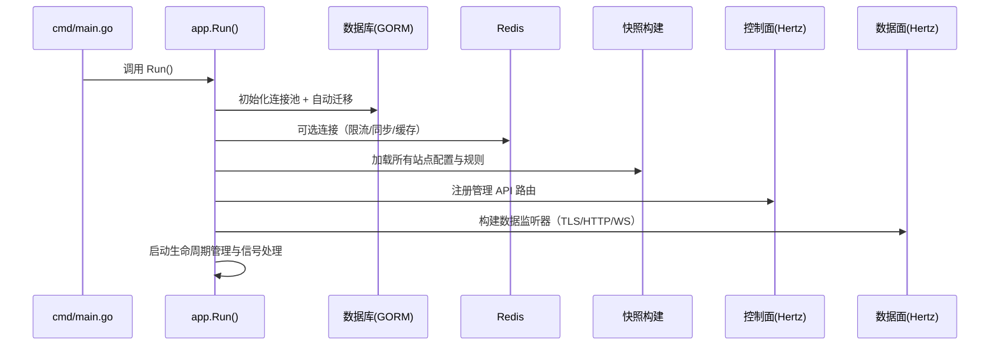
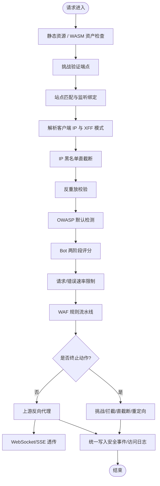
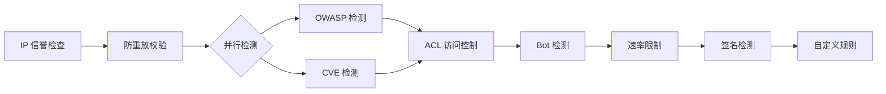
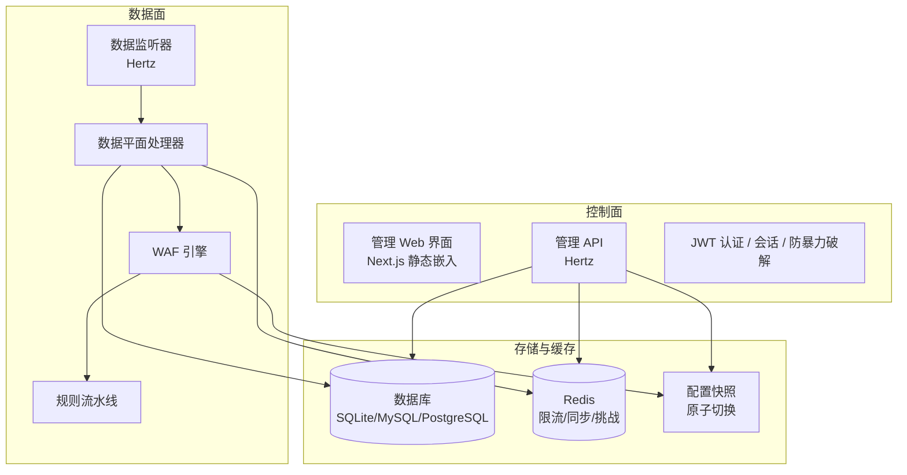

# My-OpenWaf 工作原理

> 项目：https://github.com/x01n/My-OpenWaf  
> 分析日期：2026-07-04

## 架构总览

My-OpenWaf 采用**控制面（Control Plane）+ 数据面（Data Plane）**的双服务器架构：

- **控制面**：运行在 `:9443`，提供管理 API 与前端管理界面，负责配置管理、认证鉴权、规则下发、监控指标。
- **数据面**：监听用户配置的端口（如 `:80` / `:443`），负责实际请求的拦截、检测、挑战、限速与反向代理转发。

两者通过**不可变快照（Snapshot）**与**Redis**实现配置解耦与热重载，无需重启数据面即可生效新规则。

---

## 启动流程

**已确认**：启动流程提取自 `cmd/main.go` 与 `internal/app/server.go` 初始化逻辑。

---

## 请求处理流程（数据面）

当客户端请求到达数据面监听器时，按以下顺序处理：

**已确认**：处理流程提取自 `internal/dataplane/handler.go` 主处理器逻辑。

---

## 规则流水线阶段

规则流水线定义了请求必须依次通过的检测阶段，支持短路（拦截后直接终止）与挑战延迟（后续阶段仍执行以收集日志）：

| 阶段 | 职责 | 动作 |
|------|------|------|
| IP 信誉 | GeoIP 解析、IP 黑名单/白名单 | drop / intercept / observe |
| 防重放 | HMAC 时间戳 + 一次性标识校验 | intercept / observe |
| OWASP 检测 | SQL 注入、XSS、命令注入、路径遍历等 | intercept / challenge / observe |
| CVE 检测 | 已知漏洞签名匹配 | intercept / observe |
| ACL 访问控制 | 自定义 IP/路径/Header 规则 | intercept / allow / observe |
| Bot 检测 | 两阶段评分（预筛 + 深度）+ TLS 指纹 | challenge / intercept / observe |
| 速率限制 | 固定/滑动窗口，IP/路径/自定义维度 | rate_limit / observe |
| 签名检测 | 自定义规则签名 | intercept / observe |
| 自定义规则 | 用户自定义策略 | 任意动作 |

**已确认**：阶段定义提取自 `internal/core/rules/phases.go` 与 `internal/core/pipeline/pipeline.go`。

---

## 核心组件交互

---

## 配置快照与热重载

- **快照**是运行时的不可变配置视图，包含所有站点、规则、证书、IP 列表等。
- 控制面修改配置后，通过**原子指针切换**更新快照，数据面无需重启即可读取新配置。
- 多节点部署时，通过 **Redis Pub/Sub** 推送配置变更通知，各节点主动重新加载快照。

**已确认**：快照机制提取自 `internal/snapshot/snapshot.go`。

---

## 策略动作体系

| 动作 | 终止请求 | 默认状态码 | 说明 |
|------|----------|------------|------|
| `drop` | ✅ | — | 直接 TCP 断开（RST） |
| `intercept` | ✅ | 403 | 拦截并返回阻断页 |
| `rate_limit` | ✅ | 429 | 触发限速响应 |
| `challenge` | ✅ | 422 | JS 挑战 |
| `captcha_challenge` | ✅ | 422 | 验证码挑战（go-captcha） |
| `shield_challenge` | ✅ | 422 | 5s 盾挑战（WASM PoW） |
| `chain_challenge` | ✅ | 422 | 链式挑战（多步骤组合） |
| `redirect` | ✅ | 302 | 重定向 |
| `observe` | ❌ | — | 仅记录日志，继续处理 |
| `tag` | ❌ | — | 标签标记，继续处理 |

**优先级**：`drop` > `intercept` > `rate_limit` > `challenge` > `redirect` > `observe`

**已确认**：动作体系提取自 README 策略动作表与 `internal/core/action/` 实现。

---

## 关键运行时特性

1. **请求体检查上限**：默认仅检查前 48 KiB，保证性能与延迟。
2. **统一写入器**：安全事件与访问日志由单协程批量写入数据库，降低锁竞争。
3. **响应缓存**：可缓存上游响应，减少后端压力。
4. **TLS 指纹**：支持 JA4 指纹收集，用于 Bot 检测与 TLS 版本/SNI 分析。
5. **ACME 自动证书**：内置 Let's Encrypt 证书自动申请与续期。

---

## 相关文件

- `cmd/main.go` — 入口程序
- `internal/app/server.go` — 应用层初始化与生命周期
- `internal/dataplane/handler.go` — 数据面请求处理器
- `internal/core/engine/engine.go` — WAF 引擎
- `internal/core/pipeline/pipeline.go` — 规则流水线
- `internal/core/rules/phases.go` — 规则阶段定义
- `internal/snapshot/snapshot.go` — 配置快照
- `internal/waf/bot/bot.go` — Bot 检测引擎
- `internal/waf/ratelimit/ratelimit.go` — 速率限制器
- `internal/waf/antireplay/antireplay.go` — 反重放校验
