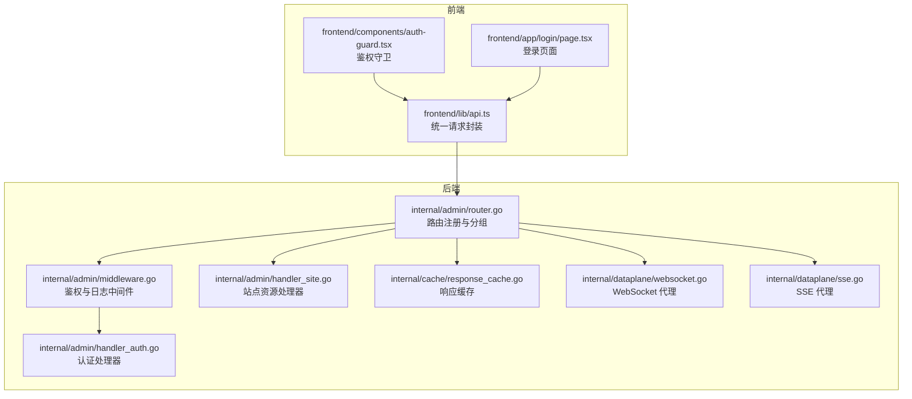
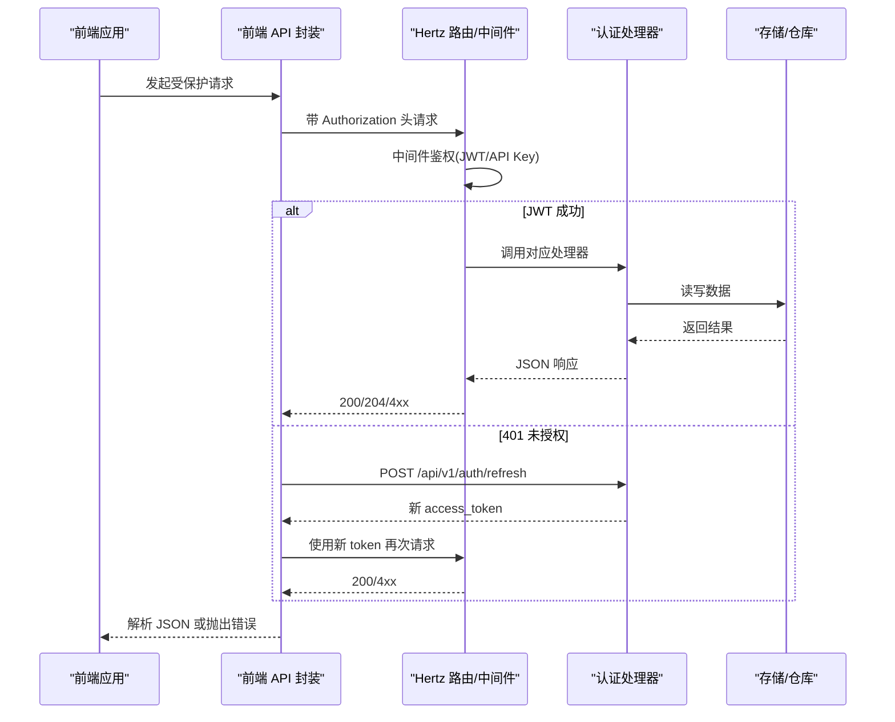
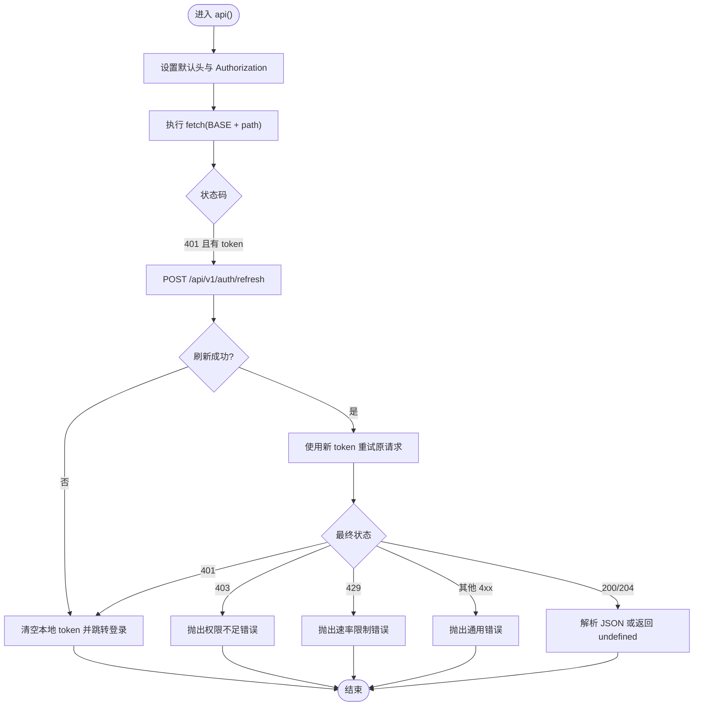
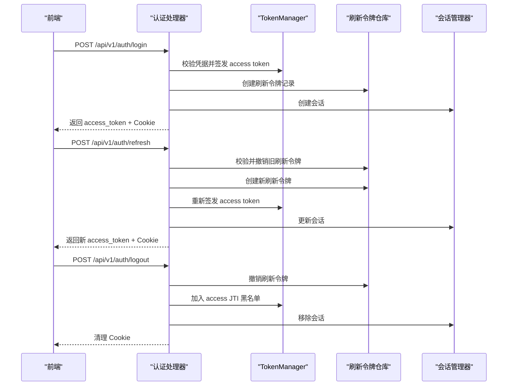
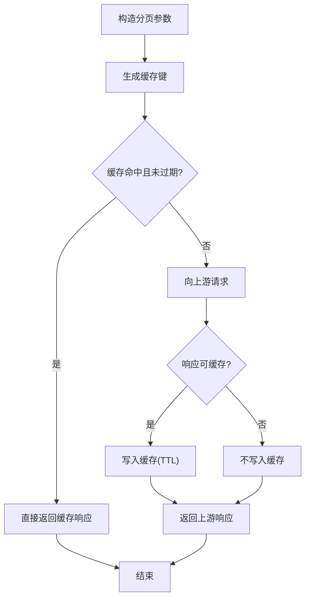
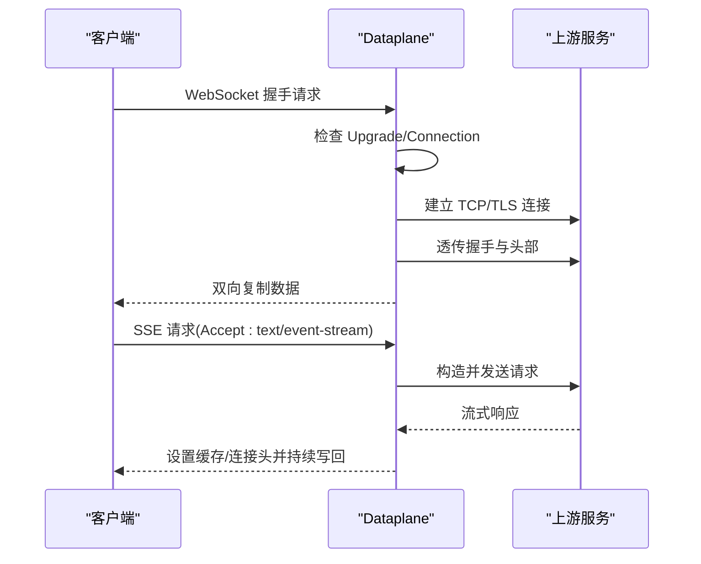
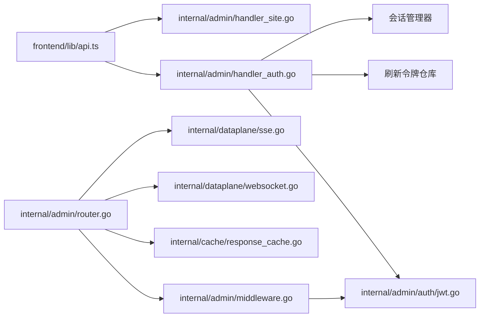

# API 集成

> [返回 前端管理界面](./前端管理界面.md)

<cite>
**本文引用的文件**
- [frontend/lib/api.ts](file://frontend/lib/api.ts)
- [frontend/components/auth-guard.tsx](file://frontend/components/auth-guard.tsx)
- [frontend/app/login/page.tsx](file://frontend/app/login/page.tsx)
- [frontend/lib/rules-api.ts](file://frontend/lib/rules-api.ts)
- [frontend/lib/security-api.ts](file://frontend/lib/security-api.ts)
- [frontend/lib/site-upstreams.ts](file://frontend/lib/site-upstreams.ts)
- [internal/admin/auth/jwt.go](file://internal/admin/auth/jwt.go)
- [internal/admin/auth/session.go](file://internal/admin/auth/session.go)
- [internal/admin/auth/bruteforce.go](file://internal/admin/auth/bruteforce.go)
- [internal/admin/router.go](file://internal/admin/router.go)
- [internal/admin/middleware.go](file://internal/admin/middleware.go)
- [internal/admin/handler_auth.go](file://internal/admin/handler_auth.go)
- [internal/admin/handler_site.go](file://internal/admin/handler_site.go)
- [internal/cache/response_cache.go](file://internal/cache/response_cache.go)
- [internal/dataplane/websocket.go](file://internal/dataplane/websocket.go)
- [internal/dataplane/sse.go](file://internal/dataplane/sse.go)
- [docs/前端管理界面/API 集成.md](file://docs/前端管理界面/API 集成.md)
</cite>

## 目录
1. [简介](#简介)
2. [项目结构](#项目结构)
3. [核心组件](#核心组件)
4. [架构总览](#架构总览)
5. [详细组件分析](#详细组件分析)
6. [依赖分析](#依赖分析)
7. [性能考虑](#性能考虑)
8. [故障排查指南](#故障排查指南)
9. [结论](#结论)
10. [附录](#附录)

## 简介
本文件系统化梳理 My-OpenWAF 前端与后端之间的 API 集成方案，覆盖以下主题：
- API 请求封装：统一请求入口、自动鉴权头注入、401 自动刷新与重试、403/429/通用错误处理
- 认证集成：JWT 令牌签发与校验、刷新令牌（HttpOnly Cookie）、会话管理、权限控制（RBAC）
- 数据获取策略：分页查询参数构造、204 无内容处理、类型安全返回值
- 实时通信：WebSocket 升级与代理、SSE 流式传输
- 缓存策略：响应缓存（GET 安全请求）的键生成、TTL、LRU 清理
- API 版本管理与向后兼容：版本前缀与路由组织、兼容旧版 JWT 工具函数
- 最佳实践与调试技巧：请求日志、安全头、错误分类与用户提示

## 项目结构
前端通过统一的 API 封装模块发起请求，后端以 Hertz 路由注册 REST 接口，中间件负责鉴权与日志，认证处理器负责登录、刷新、登出，缓存与实时通道分别在后端 dataplane 模块中实现。

图表来源
- [frontend/lib/api.ts:1-317](file://frontend/lib/api.ts#L1-L317)
- [frontend/components/auth-guard.tsx:1-40](file://frontend/components/auth-guard.tsx#L1-L40)
- [frontend/app/login/page.tsx:1-98](file://frontend/app/login/page.tsx#L1-L98)
- [internal/admin/router.go:1-236](file://internal/admin/router.go#L1-L236)
- [internal/admin/middleware.go:1-130](file://internal/admin/middleware.go#L1-L130)
- [internal/admin/handler_auth.go:1-351](file://internal/admin/handler_auth.go#L1-L351)
- [internal/admin/handler_site.go:1-179](file://internal/admin/handler_site.go#L1-L179)
- [internal/cache/response_cache.go:1-163](file://internal/cache/response_cache.go#L1-L163)
- [internal/dataplane/websocket.go:1-102](file://internal/dataplane/websocket.go#L1-L102)
- [internal/dataplane/sse.go:1-93](file://internal/dataplane/sse.go#L1-L93)

章节来源
- [frontend/lib/api.ts:1-317](file://frontend/lib/api.ts#L1-L317)
- [internal/admin/router.go:1-236](file://internal/admin/router.go#L1-L236)

## 核心组件
- 前端 API 封装：集中处理 Authorization 头、401 自动刷新与重试、403/429/通用错误抛出、204 特殊处理、分页参数拼接
- 后端路由与中间件：按角色分组、白名单放行、JWT/API Key 鉴权、访问日志、安全头
- 认证处理器：登录（防暴力破解）、刷新（旋转刷新令牌）、登出（撤销与黑名单）
- 缓存：响应缓存（GET 安全请求），带 TTL 与清理循环
- 实时通信：WebSocket 升级透传、SSE 流式转发

章节来源
- [frontend/lib/api.ts:31-114](file://frontend/lib/api.ts#L31-L114)
- [internal/admin/router.go:48-210](file://internal/admin/router.go#L48-L210)
- [internal/admin/middleware.go:16-129](file://internal/admin/middleware.go#L16-L129)
- [internal/admin/handler_auth.go:32-221](file://internal/admin/handler_auth.go#L32-L221)
- [internal/cache/response_cache.go:25-163](file://internal/cache/response_cache.go#L25-L163)
- [internal/dataplane/websocket.go:16-69](file://internal/dataplane/websocket.go#L16-L69)
- [internal/dataplane/sse.go:18-92](file://internal/dataplane/sse.go#L18-L92)

## 架构总览
下图展示从前端到后端的典型调用链路，包含鉴权、刷新、错误处理与日志。

图表来源
- [frontend/lib/api.ts:31-88](file://frontend/lib/api.ts#L31-L88)
- [internal/admin/router.go:65-71](file://internal/admin/router.go#L65-L71)
- [internal/admin/middleware.go:18-71](file://internal/admin/middleware.go#L18-L71)
- [internal/admin/handler_auth.go:125-192](file://internal/admin/handler_auth.go#L125-L192)

## 详细组件分析

### 前端 API 封装与错误处理
- 统一入口与拦截
  - 自动注入 Content-Type 与 Authorization 头（存在 access_token 时）
  - fetch 默认携带 credentials: include，确保 Cookie（刷新令牌）参与
- 401 自动刷新与重试
  - 首次 401 触发刷新接口，成功则替换 token 并重试原请求
  - 刷新后仍为 401 视为会话被拉黑/撤销，清空本地 token 并跳转登录页
- 403 权限不足
  - 解析错误体并抛出明确信息
- 429 速率限制
  - 解析错误体并抛出提示
- 通用错误
  - 其他非 2xx 抛出错误，包含 HTTP 状态或服务端错误消息
- 204 特殊处理
  - 显式返回 undefined
- 分页与查询
  - 参数对象转 URLSearchParams，过滤空值

图表来源
- [frontend/lib/api.ts:31-88](file://frontend/lib/api.ts#L31-L88)

章节来源
- [frontend/lib/api.ts:31-114](file://frontend/lib/api.ts#L31-L114)

### 认证集成：JWT、刷新与权限控制
- 登录
  - 防暴力破解检测；失败记录与剩余尝试数提示
  - 成功后签发短期 access token（含 JTI、角色、IP/UA 哈希）
  - 生成刷新令牌并持久化，设置 HttpOnly Cookie
  - 创建会话记录，更新最后活跃时间
- 刷新
  - 从 Cookie 提取 JTI 与原始刷新令牌，校验哈希
  - 旋转：撤销旧令牌并发放新令牌，更新 Cookie
  - 重新签发 access token 并创建会话
- 登出
  - 撤销刷新令牌、加入 access token JTI 黑名单、移除会话
  - 清理 Cookie
- 鉴权中间件
  - 白名单路径放行（健康检查、认证相关）
  - Bearer JWT 校验（支持密钥轮换与黑名单）
  - API Key 回退校验
  - 设置上下文中的用户名、角色、JTI 等
- 权限控制
  - 基于角色的 RequireRole 中间件，拒绝 403
- 会话管理
  - 支持列出当前用户或全部会话（管理员），强制登出指定会话并加入黑名单

图表来源
- [internal/admin/handler_auth.go:32-221](file://internal/admin/handler_auth.go#L32-L221)
- [internal/admin/middleware.go:18-71](file://internal/admin/middleware.go#L18-L71)
- [internal/admin/auth/jwt.go:44-135](file://internal/admin/auth/jwt.go#L44-L135)
- [internal/admin/auth/session.go](file://internal/admin/auth/session.go)
- [internal/admin/auth/bruteforce.go](file://internal/admin/auth/bruteforce.go)

章节来源
- [internal/admin/handler_auth.go:32-221](file://internal/admin/handler_auth.go#L32-L221)
- [internal/admin/middleware.go:16-96](file://internal/admin/middleware.go#L16-L96)
- [internal/admin/auth/jwt.go:44-135](file://internal/admin/auth/jwt.go#L44-L135)

### 数据获取策略：预取、分页与缓存
- 预取与分页
  - 统一分页参数构造函数，过滤空值，避免无效查询
  - 所有列表接口返回 items 与 total，便于前端分页控件
- 缓存策略
  - 响应缓存仅针对安全 GET 请求
  - 键生成：方法 + 主机 + 路径 + 查询串，SHA-256 哈希
  - TTL 控制与过期淘汰，后台定时清理
  - 支持启用/禁用与统计查询

图表来源
- [frontend/lib/api.ts:259-262](file://frontend/lib/api.ts#L259-L262)
- [internal/cache/response_cache.go:56-122](file://internal/cache/response_cache.go#L56-L122)

章节来源
- [frontend/lib/api.ts:243-262](file://frontend/lib/api.ts#L243-L262)
- [internal/cache/response_cache.go:25-163](file://internal/cache/response_cache.go#L25-L163)

### 实时通信：WebSocket 与 SSE
- WebSocket
  - 检测 Upgrade 头判断是否为 WebSocket 升级
  - 基于目标 URL 协议(ws/wss)建立 TCP 连接，透传握手与双向流
  - 支持 TLS 与 SNI 配置
- SSE
  - 识别 Accept 包含 text/event-stream 的请求
  - 透传请求头（排除连接类），设置必要的响应头并流式回写

图表来源
- [internal/dataplane/websocket.go:16-69](file://internal/dataplane/websocket.go#L16-L69)
- [internal/dataplane/sse.go:18-92](file://internal/dataplane/sse.go#L18-L92)

章节来源
- [internal/dataplane/websocket.go:16-69](file://internal/dataplane/websocket.go#L16-L69)
- [internal/dataplane/sse.go:18-92](file://internal/dataplane/sse.go#L18-L92)

### API 版本管理与向后兼容
- 版本前缀
  - 后端路由统一使用 /api/v1 前缀，便于未来升级
- 向后兼容
  - JWT 工具函数提供包级签名/验证包装，兼容旧实现
  - TokenManager 支持主/备密钥轮换，保证刷新与校验连续性

章节来源
- [internal/admin/router.go:53-67](file://internal/admin/router.go#L53-L67)
- [internal/admin/auth/jwt.go:156-194](file://internal/admin/auth/jwt.go#L156-L194)
- [internal/admin/auth/jwt.go:67-80](file://internal/admin/auth/jwt.go#L67-L80)

## 依赖分析
- 前端 API 封装依赖后端 /api/v1 认证与业务接口
- 后端路由依赖中间件进行鉴权与日志
- 认证处理器依赖 TokenManager、刷新令牌仓库与会话管理器
- 缓存与实时通道作为独立模块被路由复用
- 资源处理器（如站点）依赖仓库层与重载机制

图表来源
- [frontend/lib/api.ts:1-317](file://frontend/lib/api.ts#L1-L317)
- [internal/admin/router.go:1-236](file://internal/admin/router.go#L1-L236)
- [internal/admin/middleware.go:1-130](file://internal/admin/middleware.go#L1-L130)
- [internal/admin/handler_auth.go:1-351](file://internal/admin/handler_auth.go#L1-L351)
- [internal/admin/handler_site.go:1-179](file://internal/admin/handler_site.go#L1-L179)
- [internal/admin/auth/jwt.go:1-295](file://internal/admin/auth/jwt.go#L1-L295)
- [internal/cache/response_cache.go:1-163](file://internal/cache/response_cache.go#L1-L163)
- [internal/dataplane/websocket.go:1-102](file://internal/dataplane/websocket.go#L1-L102)
- [internal/dataplane/sse.go:1-93](file://internal/dataplane/sse.go#L1-L93)

## 性能考虑
- 前端
  - 401 自动刷新避免用户感知中断，但需注意重试次数与并发场景
  - 204 无内容减少不必要的 JSON 解析
- 后端
  - 响应缓存对 GET 安全请求显著降低上游压力，建议合理设置 TTL 与最大容量
  - WebSocket/SSE 采用直连与流式写回，注意背压与超时配置
- 安全与可靠性
  - 刷新令牌使用 HttpOnly Cookie，降低 XSS 风险
  - JWT 包含 IP/UA 哈希，增强会话绑定
  - 中间件统一设置安全头，提升整体安全性

## 故障排查指南
- 401 未授权
  - 检查 access_token 是否存在与过期；确认刷新流程是否成功
  - 若刷新后仍 401，确认是否被加入黑名单或会话被强制登出
- 403 权限不足
  - 确认当前用户角色是否满足目标路由的 RequireRole
- 429 速率限制
  - 查看防暴力破解检测状态与剩余尝试数
- 登录失败
  - 检查凭据、防暴力锁与登录记录
- 实时通信
  - WebSocket：确认 Upgrade/Connection 头、TLS 配置与上游可达
  - SSE：确认 Accept 头、上游响应头过滤与流式写回
- 缓存问题
  - 检查缓存键生成一致性、TTL 与清理循环是否运行

章节来源
- [frontend/lib/api.ts:48-84](file://frontend/lib/api.ts#L48-L84)
- [internal/admin/middleware.go:74-96](file://internal/admin/middleware.go#L74-L96)
- [internal/admin/handler_auth.go:43-73](file://internal/admin/handler_auth.go#L43-L73)
- [internal/admin/handler_auth.go:125-192](file://internal/admin/handler_auth.go#L125-L192)
- [internal/dataplane/websocket.go:16-69](file://internal/dataplane/websocket.go#L16-L69)
- [internal/dataplane/sse.go:18-92](file://internal/dataplane/sse.go#L18-L92)
- [internal/cache/response_cache.go:142-162](file://internal/cache/response_cache.go#L142-L162)

## 结论
该 API 集成方案在前端与后端之间建立了清晰、安全且可扩展的交互边界：
- 前端通过统一封装屏蔽细节，自动处理鉴权与错误
- 后端以中间件与处理器分离关注点，支持多角色权限与安全头
- 认证体系结合短期 JWT、刷新令牌与会话管理，兼顾易用与安全
- 缓存与实时通道为性能与体验提供支撑
建议在生产环境进一步完善并发重试策略、缓存命中率监控与实时通道的可观测性。

## 附录
- 最佳实践
  - 前端：统一使用 api() 封装，避免绕过鉴权头；对 401/403/429 做用户友好提示
  - 后端：严格区分只读与变更操作，保持路由简洁；为每个路由添加访问日志
  - 认证：定期轮换密钥；对敏感操作增加二次校验
  - 缓存：对幂等 GET 请求启用缓存；合理设置 TTL 与容量上限
- 调试技巧
  - 使用浏览器开发者工具查看 Authorization 头与 Cookie
  - 关注 X-Request-ID 日志字段定位请求链路
  - 对实时通道开启网络抓包与日志级别提升