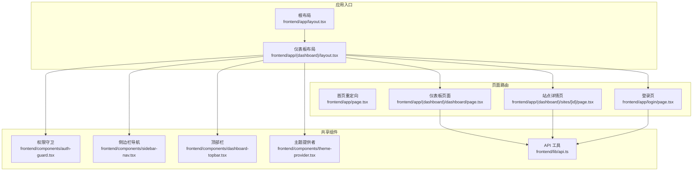
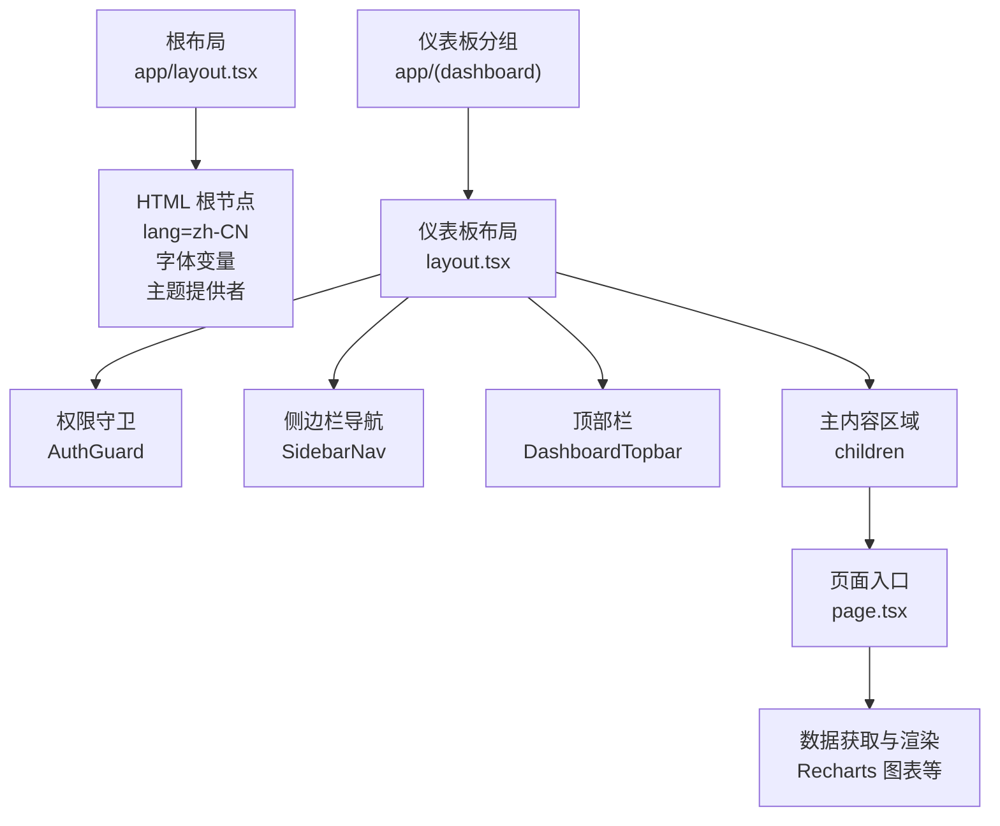
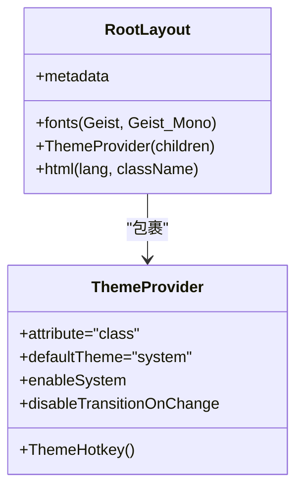
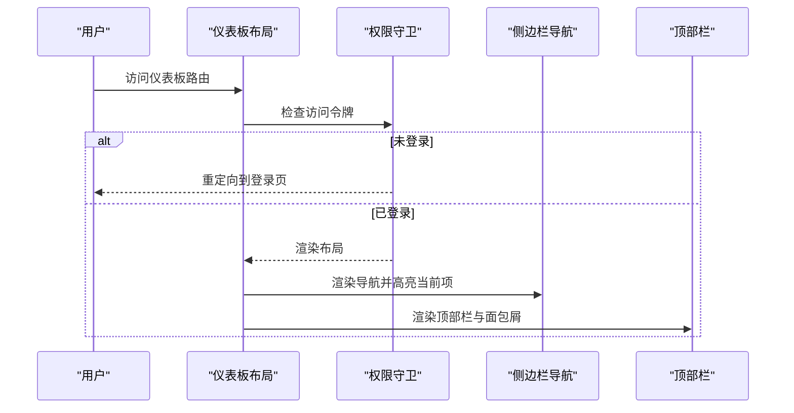
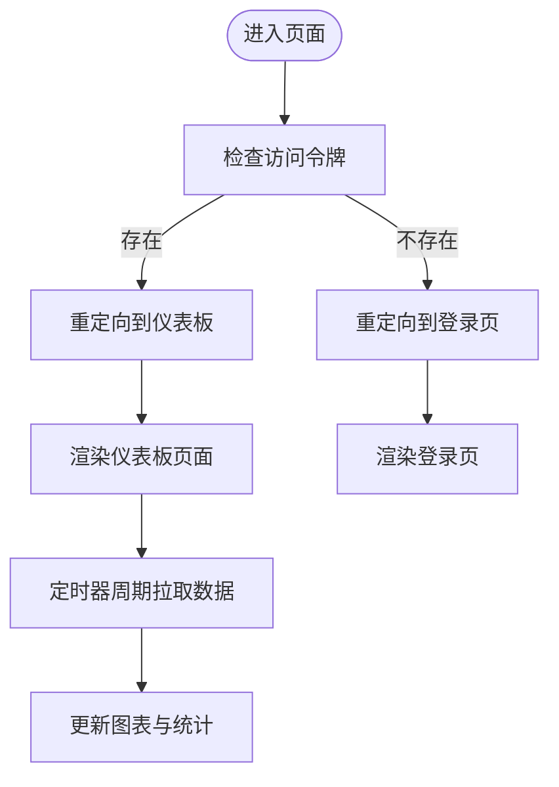
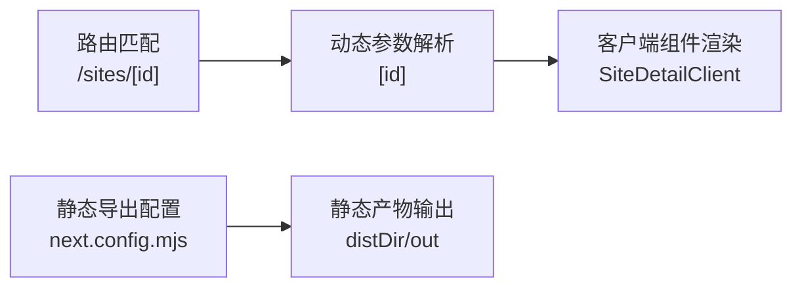
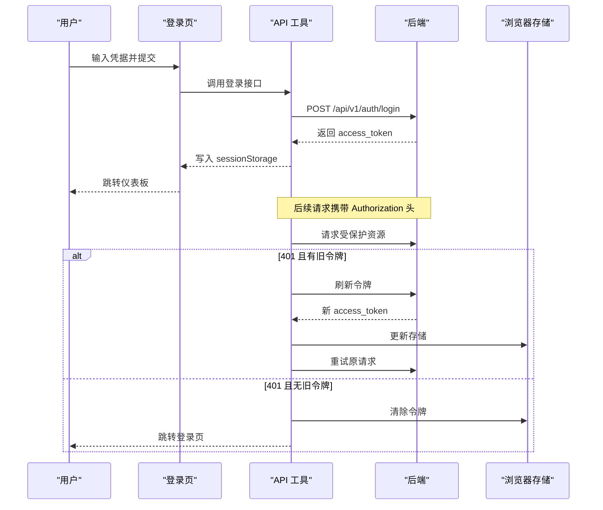
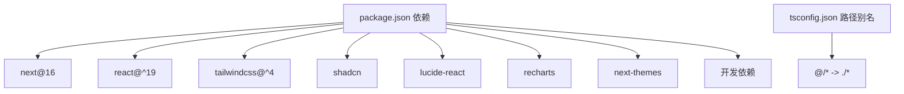

# Next.js 架构设计

<cite>
**本文档引用的文件**
- [frontend/app/layout.tsx](file://frontend/app/layout.tsx)
- [frontend/app/(dashboard)/layout.tsx](file://frontend/app/(dashboard)/layout.tsx)
- [frontend/components/theme-provider.tsx](file://frontend/components/theme-provider.tsx)
- [frontend/components/sidebar-nav.tsx](file://frontend/components/sidebar-nav.tsx)
- [frontend/components/dashboard-topbar.tsx](file://frontend/components/dashboard-topbar.tsx)
- [frontend/app/page.tsx](file://frontend/app/page.tsx)
- [frontend/components/auth-guard.tsx](file://frontend/components/auth-guard.tsx)
- [frontend/lib/api.ts](file://frontend/lib/api.ts)
- [frontend/app/globals.css](file://frontend/app/globals.css)
- [frontend/app/(dashboard)/dashboard/page.tsx](file://frontend/app/(dashboard)/dashboard/page.tsx)
- [frontend/app/(dashboard)/sites/[id]/page.tsx](file://frontend/app/(dashboard)/sites/[id]/page.tsx)
- [frontend/app/login/page.tsx](file://frontend/app/login/page.tsx)
- [frontend/next.config.mjs](file://frontend/next.config.mjs)
- [frontend/package.json](file://frontend/package.json)
- [frontend/tsconfig.json](file://frontend/tsconfig.json)
</cite>

## 目录
1. [简介](#简介)
2. [项目结构](#项目结构)
3. [核心组件](#核心组件)
4. [架构总览](#架构总览)
5. [详细组件分析](#详细组件分析)
6. [依赖关系分析](#依赖关系分析)
7. [性能考虑](#性能考虑)
8. [故障排除指南](#故障排除指南)
9. [结论](#结论)
10. [附录](#附录)

## 简介
本文件系统性梳理该 Next.js 项目的架构设计，重点围绕 App Router 的组织结构（嵌套布局、路由层级与页面渲染机制）、根布局配置（字体加载、主题提供者、元数据设置）、仪表板布局设计（侧边栏导航、主内容区域、响应式设计）、页面组件生命周期与渲染策略、静态生成与动态路由实现方式，并提供路由配置示例与最佳实践建议。目标是帮助开发者快速理解并高效扩展前端控制台。

## 项目结构
前端采用 Next.js App Router 的目录约定，通过分组目录 `(dashboard)` 实现路由分层，配合共享的根布局与仪表板布局，形成清晰的层次化结构：
- 根布局：定义全局样式、字体变量、主题提供者与元数据
- 仪表板布局：封装侧边栏、顶部栏、权限守卫与通知组件
- 页面路由：以 `page.tsx` 作为入口，支持静态参数与动态参数
- 组件库：UI 组件、图表组件、工具函数与自定义 Hook

**图示来源**
- [frontend/app/layout.tsx:1-40](file://frontend/app/layout.tsx#L1-L40)
- [frontend/app/(dashboard)/layout.tsx](file://frontend/app/(dashboard)/layout.tsx#L1-L34)
- [frontend/app/page.tsx:1-18](file://frontend/app/page.tsx#L1-L18)
- [frontend/app/(dashboard)/dashboard/page.tsx](file://frontend/app/(dashboard)/dashboard/page.tsx#L1-L375)
- [frontend/app/(dashboard)/sites/[id]/page.tsx](file://frontend/app/(dashboard)/sites/[id]/page.tsx#L1-L12)
- [frontend/app/login/page.tsx:1-76](file://frontend/app/login/page.tsx#L1-L76)
- [frontend/components/auth-guard.tsx:1-22](file://frontend/components/auth-guard.tsx#L1-L22)
- [frontend/components/sidebar-nav.tsx:1-113](file://frontend/components/sidebar-nav.tsx#L1-L113)
- [frontend/components/dashboard-topbar.tsx:1-77](file://frontend/components/dashboard-topbar.tsx#L1-L77)
- [frontend/components/theme-provider.tsx:1-72](file://frontend/components/theme-provider.tsx#L1-L72)
- [frontend/lib/api.ts:1-103](file://frontend/lib/api.ts#L1-L103)

**章节来源**
- [frontend/app/layout.tsx:1-40](file://frontend/app/layout.tsx#L1-L40)
- [frontend/app/(dashboard)/layout.tsx](file://frontend/app/(dashboard)/layout.tsx#L1-L34)
- [frontend/app/page.tsx:1-18](file://frontend/app/page.tsx#L1-L18)
- [frontend/app/(dashboard)/dashboard/page.tsx](file://frontend/app/(dashboard)/dashboard/page.tsx#L1-L375)
- [frontend/app/(dashboard)/sites/[id]/page.tsx](file://frontend/app/(dashboard)/sites/[id]/page.tsx#L1-L12)
- [frontend/app/login/page.tsx:1-76](file://frontend/app/login/page.tsx#L1-L76)
- [frontend/components/auth-guard.tsx:1-22](file://frontend/components/auth-guard.tsx#L1-L22)
- [frontend/components/sidebar-nav.tsx:1-113](file://frontend/components/sidebar-nav.tsx#L1-L113)
- [frontend/components/dashboard-topbar.tsx:1-77](file://frontend/components/dashboard-topbar.tsx#L1-L77)
- [frontend/components/theme-provider.tsx:1-72](file://frontend/components/theme-provider.tsx#L1-L72)
- [frontend/lib/api.ts:1-103](file://frontend/lib/api.ts#L1-L103)

## 核心组件
- 根布局与主题系统
  - 根布局负责注入全局样式、字体变量与主题提供者，确保全站一致的主题体验与可访问性。
  - 主题提供者使用 next-themes，支持系统默认、明暗切换与热键快捷切换。
- 仪表板布局与导航
  - 仪表板布局整合侧边栏、顶部栏、权限守卫与通知组件，形成统一的控制台界面。
  - 侧边栏导航基于路径高亮与图标，支持折叠/展开与登出操作。
  - 顶部栏展示面包屑与用户下拉菜单，提供一致的操作入口。
- 权限与会话管理
  - 权限守卫在客户端检查访问令牌，未登录时重定向至登录页。
  - API 工具封装鉴权头、刷新令牌与错误处理，统一后端交互。
- 页面与数据渲染
  - 首页根据令牌存在与否重定向至仪表板或登录页。
  - 仪表板页面定时拉取数据并渲染图表，站点详情页支持动态路由参数。

**章节来源**
- [frontend/app/layout.tsx:1-40](file://frontend/app/layout.tsx#L1-L40)
- [frontend/components/theme-provider.tsx:1-72](file://frontend/components/theme-provider.tsx#L1-L72)
- [frontend/app/(dashboard)/layout.tsx](file://frontend/app/(dashboard)/layout.tsx#L1-L34)
- [frontend/components/sidebar-nav.tsx:1-113](file://frontend/components/sidebar-nav.tsx#L1-L113)
- [frontend/components/dashboard-topbar.tsx:1-77](file://frontend/components/dashboard-topbar.tsx#L1-L77)
- [frontend/components/auth-guard.tsx:1-22](file://frontend/components/auth-guard.tsx#L1-L22)
- [frontend/lib/api.ts:1-103](file://frontend/lib/api.ts#L1-L103)
- [frontend/app/page.tsx:1-18](file://frontend/app/page.tsx#L1-L18)
- [frontend/app/(dashboard)/dashboard/page.tsx](file://frontend/app/(dashboard)/dashboard/page.tsx#L1-L375)
- [frontend/app/(dashboard)/sites/[id]/page.tsx](file://frontend/app/(dashboard)/sites/[id]/page.tsx#L1-L12)

## 架构总览
该应用采用“根布局 + 分组布局”的双层布局体系：
- 根布局负责全局样式与主题，为所有页面提供一致的外观与行为。
- 仪表板分组布局封装控制台专用 UI，包含权限校验与导航，子页面共享此上下文。
- 页面通过 `page.tsx` 作为入口，结合客户端与服务端能力实现不同渲染策略。

**图示来源**
- [frontend/app/layout.tsx:1-40](file://frontend/app/layout.tsx#L1-L40)
- [frontend/app/(dashboard)/layout.tsx](file://frontend/app/(dashboard)/layout.tsx#L1-L34)
- [frontend/components/auth-guard.tsx:1-22](file://frontend/components/auth-guard.tsx#L1-L22)
- [frontend/components/sidebar-nav.tsx:1-113](file://frontend/components/sidebar-nav.tsx#L1-L113)
- [frontend/components/dashboard-topbar.tsx:1-77](file://frontend/components/dashboard-topbar.tsx#L1-L77)
- [frontend/app/(dashboard)/dashboard/page.tsx](file://frontend/app/(dashboard)/dashboard/page.tsx#L1-L375)

## 详细组件分析

### 根布局与主题系统
- 字体加载：通过 next/font/google 注入无 FOUC 的字体变量，分别设置无衬线与等宽字体变量。
- 主题提供者：使用 next-themes 提供系统默认、明暗切换与热键切换（在非输入焦点时按 D 键切换）。
- 元数据：设置站点标题与描述，便于 SEO 与浏览器标签显示。
- 样式基线：全局 CSS 引入 Tailwind、动画与 shadcn 组件库样式，并定义深色/浅色主题变量。

**图示来源**
- [frontend/app/layout.tsx:1-40](file://frontend/app/layout.tsx#L1-L40)
- [frontend/components/theme-provider.tsx:1-72](file://frontend/components/theme-provider.tsx#L1-L72)

**章节来源**
- [frontend/app/layout.tsx:1-40](file://frontend/app/layout.tsx#L1-L40)
- [frontend/components/theme-provider.tsx:1-72](file://frontend/components/theme-provider.tsx#L1-L72)
- [frontend/app/globals.css:1-130](file://frontend/app/globals.css#L1-L130)

### 仪表板布局与导航
- 布局结构：左侧侧边栏 + 右侧主内容区，主内容区包含顶部栏与滚动内容区。
- 侧边栏导航：基于路由前缀高亮，支持折叠/展开与登出；图标与文案来自 Lucide。
- 顶部栏：展示当前页面的面包屑与用户下拉菜单，提供登出操作。
- 权限守卫：在进入仪表板布局前校验访问令牌，未登录则跳转登录页。

**图示来源**
- [frontend/app/(dashboard)/layout.tsx](file://frontend/app/(dashboard)/layout.tsx#L1-L34)
- [frontend/components/auth-guard.tsx:1-22](file://frontend/components/auth-guard.tsx#L1-L22)
- [frontend/components/sidebar-nav.tsx:1-113](file://frontend/components/sidebar-nav.tsx#L1-L113)
- [frontend/components/dashboard-topbar.tsx:1-77](file://frontend/components/dashboard-topbar.tsx#L1-L77)

**章节来源**
- [frontend/app/(dashboard)/layout.tsx](file://frontend/app/(dashboard)/layout.tsx#L1-L34)
- [frontend/components/sidebar-nav.tsx:1-113](file://frontend/components/sidebar-nav.tsx#L1-L113)
- [frontend/components/dashboard-topbar.tsx:1-77](file://frontend/components/dashboard-topbar.tsx#L1-L77)
- [frontend/components/auth-guard.tsx:1-22](file://frontend/components/auth-guard.tsx#L1-L22)

### 页面生命周期与渲染策略
- 首页重定向：根据是否存在访问令牌决定跳转至仪表板或登录页。
- 仪表板页面：使用客户端状态与定时器周期性拉取数据，渲染统计卡片与图表。
- 动态路由参数：站点详情页声明动态参数与静态参数生成，实际逻辑委托给客户端组件。

**图示来源**
- [frontend/app/page.tsx:1-18](file://frontend/app/page.tsx#L1-L18)
- [frontend/app/(dashboard)/dashboard/page.tsx](file://frontend/app/(dashboard)/dashboard/page.tsx#L1-L375)
- [frontend/app/(dashboard)/sites/[id]/page.tsx](file://frontend/app/(dashboard)/sites/[id]/page.tsx#L1-L12)

**章节来源**
- [frontend/app/page.tsx:1-18](file://frontend/app/page.tsx#L1-L18)
- [frontend/app/(dashboard)/dashboard/page.tsx](file://frontend/app/(dashboard)/dashboard/page.tsx#L1-L375)
- [frontend/app/(dashboard)/sites/[id]/page.tsx](file://frontend/app/(dashboard)/sites/[id]/page.tsx#L1-L12)

### 静态生成与动态路由
- 静态生成：站点详情页声明不生成任何静态参数，适合运行时动态构建。
- 动态路由参数：通过 `[id]` 定义动态段，支持运行时解析与客户端渲染。
- 路由配置：next.config.mjs 设置输出为静态导出、去除尾斜杠、禁用图片优化，适配本地部署与 CDN 场景。

**图示来源**
- [frontend/app/(dashboard)/sites/[id]/page.tsx](file://frontend/app/(dashboard)/sites/[id]/page.tsx#L1-L12)
- [frontend/next.config.mjs:1-12](file://frontend/next.config.mjs#L1-L12)

**章节来源**
- [frontend/app/(dashboard)/sites/[id]/page.tsx](file://frontend/app/(dashboard)/sites/[id]/page.tsx#L1-L12)
- [frontend/next.config.mjs:1-12](file://frontend/next.config.mjs#L1-L12)

### 登录流程与鉴权
- 登录页：表单收集用户名与密码，调用登录接口并跳转仪表板。
- 鉴权流程：API 工具自动附加 Bearer 头，401 时尝试刷新令牌；仍失败则清除令牌并跳转登录。
- 会话存储：访问令牌持久化于 sessionStorage，避免刷新丢失。

**图示来源**
- [frontend/app/login/page.tsx:1-76](file://frontend/app/login/page.tsx#L1-L76)
- [frontend/lib/api.ts:1-103](file://frontend/lib/api.ts#L1-L103)

**章节来源**
- [frontend/app/login/page.tsx:1-76](file://frontend/app/login/page.tsx#L1-L76)
- [frontend/lib/api.ts:1-103](file://frontend/lib/api.ts#L1-L103)

## 依赖关系分析
- 构建与运行时依赖：Next.js 16、React 19、Tailwind CSS 4、shadcn 组件库、Lucide 图标、Recharts 图表、next-themes 主题。
- 开发依赖：TypeScript、ESLint、Prettier、PostCSS、Tailwind 插件。
- 路径别名：通过 tsconfig.json 的 baseUrl 与 paths 将 `@/*` 映射到项目根目录，简化导入路径。

**图示来源**
- [frontend/package.json:1-45](file://frontend/package.json#L1-L45)
- [frontend/tsconfig.json:1-45](file://frontend/tsconfig.json#L1-L45)

**章节来源**
- [frontend/package.json:1-45](file://frontend/package.json#L1-L45)
- [frontend/tsconfig.json:1-45](file://frontend/tsconfig.json#L1-L45)

## 性能考虑
- 字体与主题：根布局预加载字体变量，减少 FOUC；主题切换禁用过渡以避免闪烁。
- 图表渲染：仪表板页面使用响应式容器与轻量数据更新，避免不必要的重绘。
- 静态导出：next.config.mjs 配置静态导出，适合托管在 CDN 或静态服务器，降低运行时开销。
- 资源优化：禁用图片优化以简化构建流程，适用于内网或自托管场景。

[本节为通用指导，无需特定文件引用]

## 故障排除指南
- 登录后无法进入仪表板
  - 检查访问令牌是否写入 sessionStorage，确认登录接口返回值。
  - 排查权限守卫是否正确重定向至登录页。
- 401 未授权频繁出现
  - 确认刷新令牌接口可用，检查网络与跨域设置。
  - 避免在输入框中误触主题热键导致焦点被占用。
- 图表不显示或空白
  - 检查数据拉取接口与时间范围参数，确认定时器未被清理。
  - 确保 Recharts 依赖已安装且版本兼容。

**章节来源**
- [frontend/lib/api.ts:1-103](file://frontend/lib/api.ts#L1-L103)
- [frontend/components/theme-provider.tsx:1-72](file://frontend/components/theme-provider.tsx#L1-L72)
- [frontend/app/(dashboard)/dashboard/page.tsx](file://frontend/app/(dashboard)/dashboard/page.tsx#L1-L375)

## 结论
该 Next.js 控制台通过清晰的 App Router 分层与共享组件，实现了统一的主题、导航与权限体系。根布局与仪表板布局分别承担全局样式与控制台上下文职责，页面路由结合静态导出与动态参数满足不同场景需求。配合完善的鉴权与错误处理机制，整体架构具备良好的可维护性与扩展性。

[本节为总结性内容，无需特定文件引用]

## 附录

### 路由配置示例与最佳实践
- 静态导出配置
  - 输出模式：静态导出
  - 构建目录：out
  - 图片优化：关闭
- 动态路由参数
  - 使用 `[param]` 定义动态段，页面声明动态参数与静态参数生成函数
- 最佳实践
  - 将通用 UI 组件置于共享目录，避免重复代码
  - 在仪表板布局中集中处理权限与导航，页面专注业务逻辑
  - 对高频数据使用定时器轮询，对一次性初始化使用 useEffect

**章节来源**
- [frontend/next.config.mjs:1-12](file://frontend/next.config.mjs#L1-L12)
- [frontend/app/(dashboard)/sites/[id]/page.tsx](file://frontend/app/(dashboard)/sites/[id]/page.tsx#L1-L12)