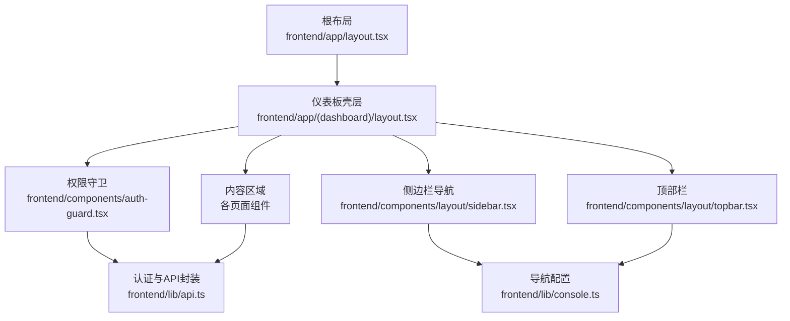
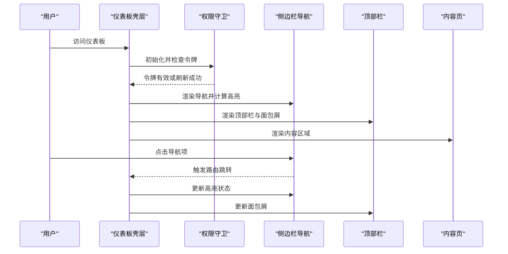
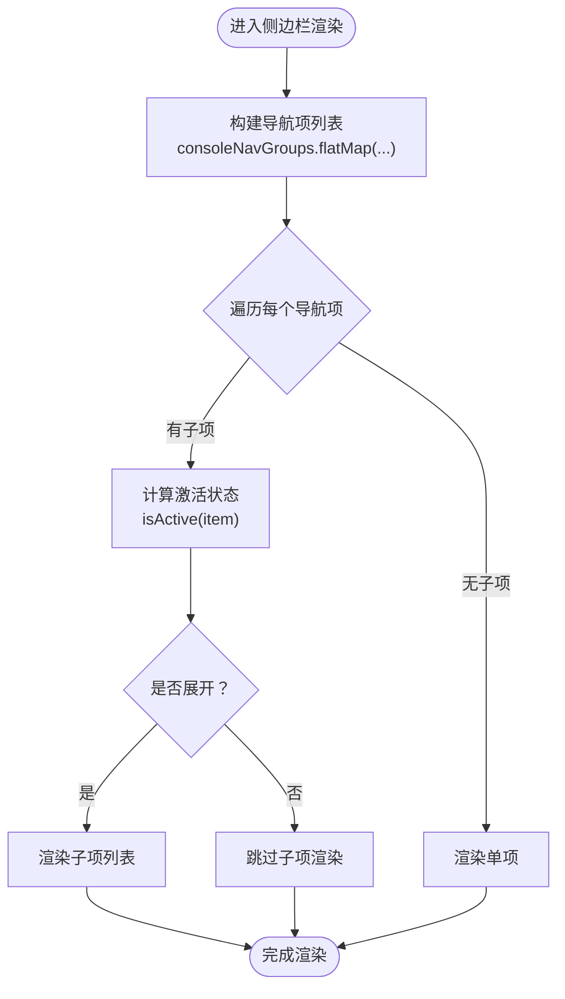
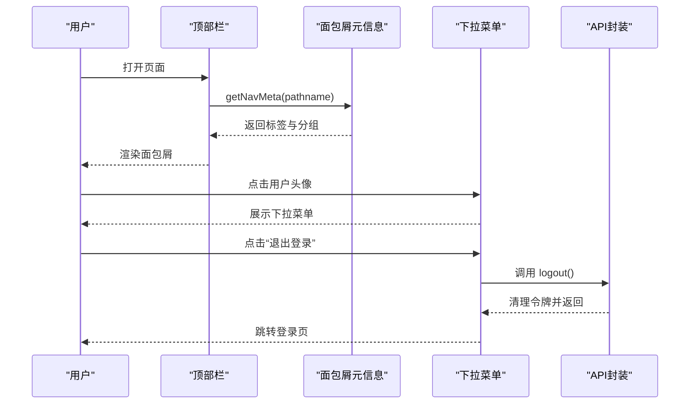
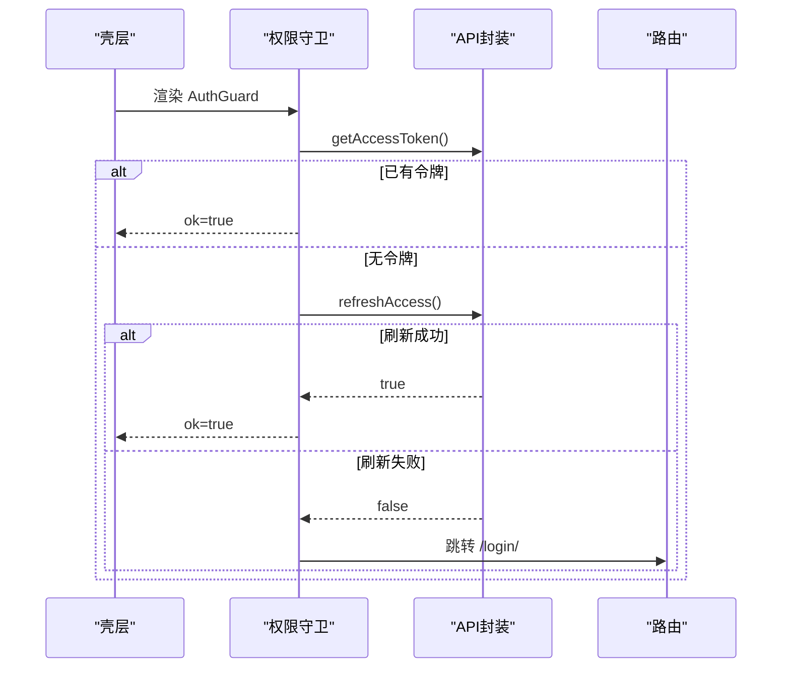
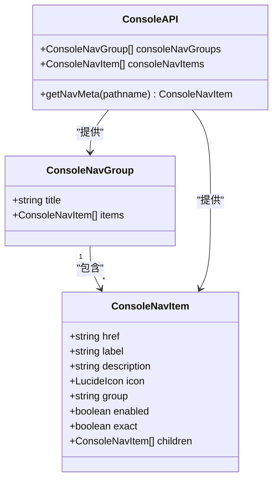
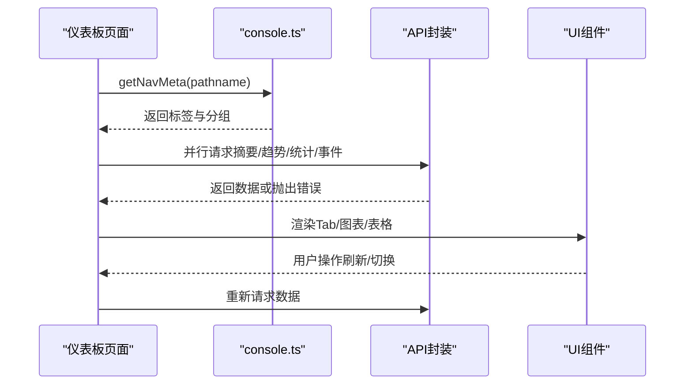
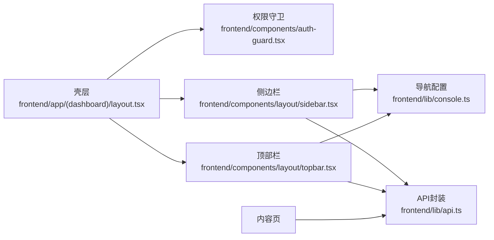

# 仪表板布局与导航

<cite>
**本文档引用的文件**
- [frontend/app/(dashboard)/layout.tsx](file://frontend/app/(dashboard)/layout.tsx)
- [frontend/components/layout/sidebar.tsx](file://frontend/components/layout/sidebar.tsx)
- [frontend/components/layout/topbar.tsx](file://frontend/components/layout/topbar.tsx)
- [frontend/components/sidebar-nav.tsx](file://frontend/components/sidebar-nav.tsx)
- [frontend/lib/console.ts](file://frontend/lib/console.ts)
- [frontend/components/auth-guard.tsx](file://frontend/components/auth-guard.tsx)
- [frontend/lib/api.ts](file://frontend/lib/api.ts)
- [frontend/app/(dashboard)/dashboard/page.tsx](file://frontend/app/(dashboard)/dashboard/page.tsx)
- [frontend/components/dashboard-topbar.tsx](file://frontend/components/dashboard-topbar.tsx)
- [frontend/app/globals.css](file://frontend/app/globals.css)
</cite>

## 目录
1. [简介](#简介)
2. [项目结构](#项目结构)
3. [核心组件](#核心组件)
4. [架构总览](#架构总览)
5. [详细组件分析](#详细组件分析)
6. [依赖关系分析](#依赖关系分析)
7. [性能考量](#性能考量)
8. [故障排除指南](#故障排除指南)
9. [结论](#结论)
10. [附录](#附录)

## 简介
本文件面向 My-OpenWaf 仪表板的布局与导航系统，系统性阐述以下方面：
- 仪表板分组布局的设计理念与实现方式
- 侧边栏导航的路由高亮机制、图标系统集成与折叠/展开功能
- 顶部栏组件的面包屑生成、用户下拉菜单与登出功能实现
- 在仪表板布局中集成权限守卫、导航组件与内容区域的方法
- 响应式设计考虑、用户体验优化与可访问性最佳实践

## 项目结构
仪表板采用 Next.js App Router 的嵌套路由与客户端组件协作，整体结构如下：
- 根布局负责全局主题与基础样式
- 仪表板壳层负责权限守卫、侧边栏与顶部栏的组合布局
- 导航配置集中于 console.ts，提供分组、图标、子项与元信息
- 登录态通过 api.ts 提供令牌读取、刷新与登出
- 内容页基于 App Router 的页面组件，按需加载数据并渲染图表

**图表来源**
- [frontend/app/layout.tsx:1-28](file://frontend/app/layout.tsx#L1-L28)
- [frontend/app/(dashboard)/layout.tsx](file://frontend/app/(dashboard)/layout.tsx#L1-L52)
- [frontend/components/auth-guard.tsx:1-51](file://frontend/components/auth-guard.tsx#L1-L51)
- [frontend/components/layout/sidebar.tsx:1-167](file://frontend/components/layout/sidebar.tsx#L1-L167)
- [frontend/components/layout/topbar.tsx:1-90](file://frontend/components/layout/topbar.tsx#L1-L90)
- [frontend/lib/console.ts:1-240](file://frontend/lib/console.ts#L1-L240)
- [frontend/lib/api.ts:1-925](file://frontend/lib/api.ts#L1-L925)

**章节来源**
- [frontend/app/layout.tsx:1-28](file://frontend/app/layout.tsx#L1-L28)
- [frontend/app/(dashboard)/layout.tsx](file://frontend/app/(dashboard)/layout.tsx#L1-L52)

## 核心组件
- 仪表板壳层：负责权限守卫、侧边栏折叠状态、移动端菜单开关与内容区域包裹
- 侧边栏导航：基于分组配置渲染，支持路由高亮、子项展开、图标与禁用状态
- 顶部栏：生成面包屑、用户下拉菜单、登出与移动端菜单按钮
- 权限守卫：自动刷新访问令牌并在未授权时跳转登录
- 导航配置：集中定义分组、标题、图标、子项与元信息查询函数
- API 封装：统一构建请求头、处理 401/403/429 等错误与登出清理

**章节来源**
- [frontend/app/(dashboard)/layout.tsx](file://frontend/app/(dashboard)/layout.tsx#L1-L52)
- [frontend/components/layout/sidebar.tsx:1-167](file://frontend/components/layout/sidebar.tsx#L1-L167)
- [frontend/components/layout/topbar.tsx:1-90](file://frontend/components/layout/topbar.tsx#L1-L90)
- [frontend/components/auth-guard.tsx:1-51](file://frontend/components/auth-guard.tsx#L1-L51)
- [frontend/lib/console.ts:1-240](file://frontend/lib/console.ts#L1-L240)
- [frontend/lib/api.ts:1-925](file://frontend/lib/api.ts#L1-L925)

## 架构总览
仪表板采用“壳层 + 导航 + 内容”的三层结构：
- 壳层负责布局与权限控制
- 导航负责路由高亮与交互（侧边栏与顶部栏）
- 内容负责业务数据加载与可视化

**图表来源**
- [frontend/app/(dashboard)/layout.tsx](file://frontend/app/(dashboard)/layout.tsx#L1-L52)
- [frontend/components/auth-guard.tsx:1-51](file://frontend/components/auth-guard.tsx#L1-L51)
- [frontend/components/layout/sidebar.tsx:1-167](file://frontend/components/layout/sidebar.tsx#L1-L167)
- [frontend/components/layout/topbar.tsx:1-90](file://frontend/components/layout/topbar.tsx#L1-L90)

## 详细组件分析

### 侧边栏导航组件分析
侧边栏组件实现了：
- 路由高亮：根据当前路径与配置计算激活状态
- 图标系统：使用 Lucide 图标库，支持主/子项图标
- 折叠/展开：支持紧凑模式与完整模式切换，子项仅在展开时显示
- 登出：统一调用 API 登出并跳转登录页

**图表来源**
- [frontend/components/layout/sidebar.tsx:1-167](file://frontend/components/layout/sidebar.tsx#L1-L167)
- [frontend/lib/console.ts:1-240](file://frontend/lib/console.ts#L1-L240)

**章节来源**
- [frontend/components/layout/sidebar.tsx:1-167](file://frontend/components/layout/sidebar.tsx#L1-L167)
- [frontend/lib/console.ts:1-240](file://frontend/lib/console.ts#L1-L240)

### 顶部栏组件分析
顶部栏组件实现了：
- 面包屑：通过 getNavMeta(pathname) 查询当前路径对应的标签与分组
- 用户下拉菜单：显示用户信息并提供登出选项
- 移动端菜单：在小屏设备上提供汉堡菜单以打开侧边栏
- 登出：统一调用 API 登出并跳转登录页

**图表来源**
- [frontend/components/layout/topbar.tsx:1-90](file://frontend/components/layout/topbar.tsx#L1-L90)
- [frontend/lib/console.ts:103-119](file://frontend/lib/console.ts#L103-L119)
- [frontend/lib/api.ts:141-149](file://frontend/lib/api.ts#L141-L149)

**章节来源**
- [frontend/components/layout/topbar.tsx:1-90](file://frontend/components/layout/topbar.tsx#L1-L90)
- [frontend/lib/console.ts:103-119](file://frontend/lib/console.ts#L103-L119)
- [frontend/lib/api.ts:141-149](file://frontend/lib/api.ts#L141-L149)

### 权限守卫与导航集成
权限守卫在壳层内使用，负责：
- 初始化时读取本地令牌
- 若无令牌或失效，尝试刷新令牌
- 刷新失败则跳转登录页
- 支持通过查询参数提示会话过期或权限不足

**图表来源**
- [frontend/app/(dashboard)/layout.tsx](file://frontend/app/(dashboard)/layout.tsx#L1-L52)
- [frontend/components/auth-guard.tsx:1-51](file://frontend/components/auth-guard.tsx#L1-L51)
- [frontend/lib/api.ts:37-58](file://frontend/lib/api.ts#L37-L58)

**章节来源**
- [frontend/app/(dashboard)/layout.tsx](file://frontend/app/(dashboard)/layout.tsx#L1-L52)
- [frontend/components/auth-guard.tsx:1-51](file://frontend/components/auth-guard.tsx#L1-L51)
- [frontend/lib/api.ts:37-58](file://frontend/lib/api.ts#L37-L58)

### 导航配置与元信息
导航配置集中于 console.ts，包含：
- 分组与子项：支持多级嵌套与 exact/exact=false 的匹配策略
- 元信息查询：getNavMeta 根据当前路径返回对应标签、分组与图标
- 图标映射：Lucide 图标与导航项一一对应

**图表来源**
- [frontend/lib/console.ts:26-119](file://frontend/lib/console.ts#L26-L119)

**章节来源**
- [frontend/lib/console.ts:1-240](file://frontend/lib/console.ts#L1-L240)

### 内容区域集成示例
仪表板首页展示了如何在页面中集成布局与导航：
- 使用 Tab 切换不同视图
- 并行加载多个数据源并统一错误处理
- 顶部面包屑与分组标签联动

**图表来源**
- [frontend/app/(dashboard)/dashboard/page.tsx](file://frontend/app/(dashboard)/dashboard/page.tsx#L1-L363)
- [frontend/lib/console.ts:103-119](file://frontend/lib/console.ts#L103-L119)
- [frontend/lib/api.ts:620-680](file://frontend/lib/api.ts#L620-L680)

**章节来源**
- [frontend/app/(dashboard)/dashboard/page.tsx](file://frontend/app/(dashboard)/dashboard/page.tsx#L1-L363)
- [frontend/lib/console.ts:103-119](file://frontend/lib/console.ts#L103-L119)
- [frontend/lib/api.ts:620-680](file://frontend/lib/api.ts#L620-L680)

## 依赖关系分析
- 仪表板壳层依赖权限守卫与两个导航组件
- 侧边栏与顶部栏共同依赖导航配置与 API 封装
- 内容页依赖 API 封装进行数据获取与错误处理

**图表来源**
- [frontend/app/(dashboard)/layout.tsx](file://frontend/app/(dashboard)/layout.tsx#L1-L52)
- [frontend/components/auth-guard.tsx:1-51](file://frontend/components/auth-guard.tsx#L1-L51)
- [frontend/components/layout/sidebar.tsx:1-167](file://frontend/components/layout/sidebar.tsx#L1-L167)
- [frontend/components/layout/topbar.tsx:1-90](file://frontend/components/layout/topbar.tsx#L1-L90)
- [frontend/lib/console.ts:1-240](file://frontend/lib/console.ts#L1-L240)
- [frontend/lib/api.ts:1-925](file://frontend/lib/api.ts#L1-L925)

**章节来源**
- [frontend/app/(dashboard)/layout.tsx](file://frontend/app/(dashboard)/layout.tsx#L1-L52)
- [frontend/lib/console.ts:1-240](file://frontend/lib/console.ts#L1-L240)
- [frontend/lib/api.ts:1-925](file://frontend/lib/api.ts#L1-L925)

## 性能考量
- 并行数据加载：在内容页中使用 Promise.all 同时请求多个接口，减少等待时间
- 懒加载与骨架屏：在站点列表等复杂页面中使用占位动画提升感知性能
- 路由高亮计算：通过扁平化导航项与精确/前缀匹配减少不必要的计算
- 令牌复用：本地缓存访问令牌，避免重复网络请求
- 图表渲染：使用响应式容器与按需渲染，降低大屏设备上的内存占用

[本节为通用指导，无需特定文件引用]

## 故障排除指南
- 会话过期：权限守卫会在刷新失败时跳转登录页，并可通过查询参数提示原因
- 登录失败/权限不足：API 封装对 401/403/429 进行统一处理，必要时抛出错误
- 导航高亮异常：确认 pathname 与配置中的 href/exact 设置一致
- 移动端菜单无法关闭：检查壳层中 mobileOpen 状态与点击遮罩逻辑

**章节来源**
- [frontend/components/auth-guard.tsx:12-28](file://frontend/components/auth-guard.tsx#L12-L28)
- [frontend/lib/api.ts:81-114](file://frontend/lib/api.ts#L81-L114)
- [frontend/app/(dashboard)/layout.tsx](file://frontend/app/(dashboard)/layout.tsx#L20-L31)

## 结论
My-OpenWaf 仪表板通过清晰的壳层、导航与内容分离，结合统一的导航配置与 API 封装，实现了：
- 可维护的分组布局与灵活的路由高亮
- 一体化的图标系统与折叠/展开体验
- 响应式与可访问性的兼顾
- 易扩展的权限守卫与错误处理机制

该架构适合在大型后台系统中推广，建议在新增页面时遵循相同的分层与配置约定。

[本节为总结性内容，无需特定文件引用]

## 附录

### 响应式设计与可访问性最佳实践
- 响应式断点：在小屏设备上隐藏侧边栏文本与部分图标，保留紧凑模式
- 可访问性：为按钮与菜单提供语义化的 ARIA 属性与键盘导航支持
- 主题系统：通过 CSS 变量与暗色模式类名实现主题切换
- 无障碍提示：在面包屑与下拉菜单中提供清晰的文本标签

**章节来源**
- [frontend/app/globals.css:1-189](file://frontend/app/globals.css#L1-L189)
- [frontend/components/layout/sidebar.tsx:48-51](file://frontend/components/layout/sidebar.tsx#L48-L51)
- [frontend/components/layout/topbar.tsx:32-43](file://frontend/components/layout/topbar.tsx#L32-L43)