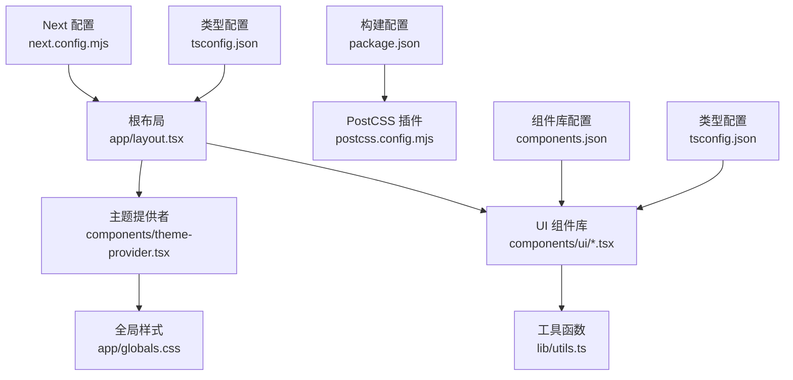
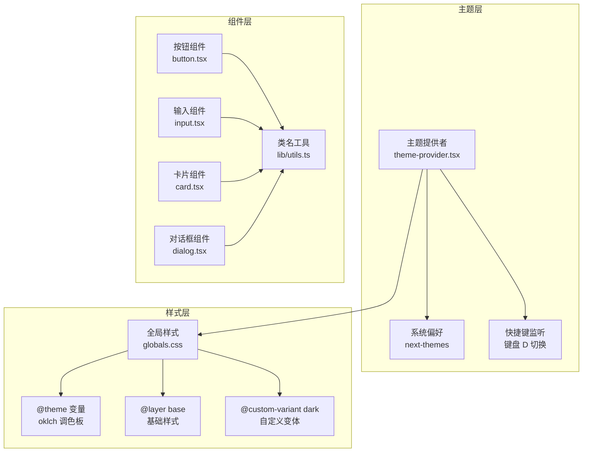
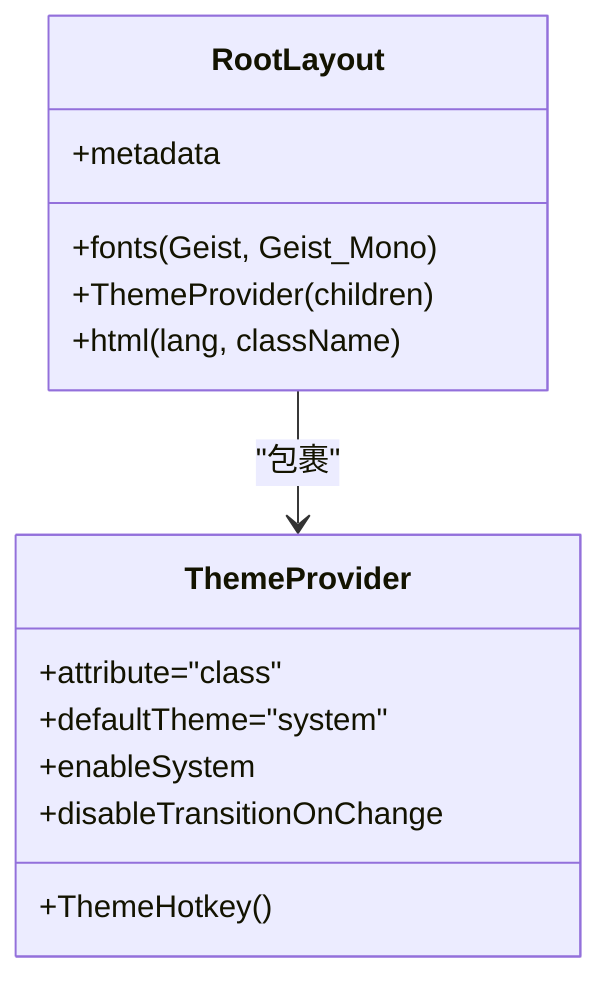
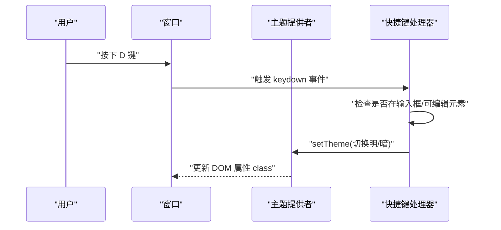
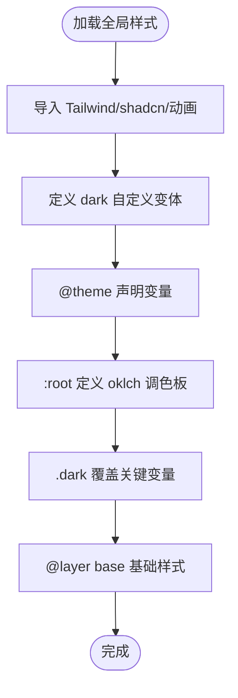
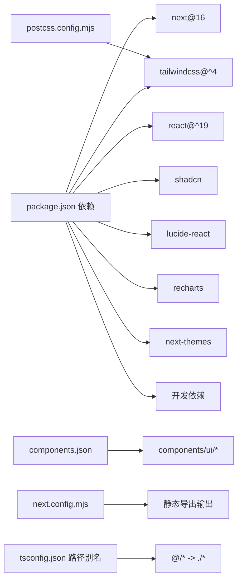

# 根布局与主题系统

> [返回 前端管理界面](../前端管理界面.md)

<cite>
**本文档引用的文件**
- [frontend/app/layout.tsx](file://frontend/app/layout.tsx)
- [frontend/components/theme-provider.tsx](file://frontend/components/theme-provider.tsx)
- [frontend/app/globals.css](file://frontend/app/globals.css)
- [frontend/next.config.mjs](file://frontend/next.config.mjs)
- [frontend/package.json](file://frontend/package.json)
- [frontend/tsconfig.json](file://frontend/tsconfig.json)
- [frontend/postcss.config.mjs](file://frontend/postcss.config.mjs)
- [frontend/components.json](file://frontend/components.json)
- [frontend/lib/utils.ts](file://frontend/lib/utils.ts)
- [frontend/components/ui/button.tsx](file://frontend/components/ui/button.tsx)
- [frontend/app/(dashboard)/layout.tsx](file://frontend/app/(dashboard)/layout.tsx)
- [docs/前端管理界面/主题系统与样式.md](file://docs/前端管理界面/主题系统与样式.md)
- [docs/前端管理界面/Next.js 架构设计.md](file://docs/前端管理界面/Next.js 架构设计.md)
</cite>

## 目录
1. [简介](#简介)
2. [项目结构](#项目结构)
3. [核心组件](#核心组件)
4. [架构总览](#架构总览)
5. [详细组件分析](#详细组件分析)
6. [依赖关系分析](#依赖关系分析)
7. [性能考虑](#性能考虑)
8. [故障排除指南](#故障排除指南)
9. [结论](#结论)
10. [附录](#附录)

## 简介
本文件系统性梳理 My-OpenWaf 前端的根布局与主题系统，涵盖以下要点：
- 根布局实现：全局样式注入、元数据配置、字体变量注入与主题提供者集成
- 主题系统：基于 next-themes 的明/暗主题切换、系统偏好集成与热键切换功能
- 样式架构：Tailwind CSS v4、@theme 变量、自定义 dark 变体与 oklch 调色板
- UI 组件：shadcn/ui 组件库与 cva 变体系统，配合 cn 工具函数进行类名合并
- 构建配置：静态导出、PostCSS 插件与路径别名配置

## 项目结构
前端样式相关的核心文件分布如下：
- 根布局：frontend/app/layout.tsx
- 主题提供者：frontend/components/theme-provider.tsx
- 全局样式：frontend/app/globals.css
- UI 组件：frontend/components/ui/*.tsx
- 工具函数：frontend/lib/utils.ts
- 配置文件：frontend/components.json、frontend/package.json、frontend/postcss.config.mjs、frontend/next.config.mjs、frontend/tsconfig.json

**图表来源**
- [frontend/app/layout.tsx:1-28](file://frontend/app/layout.tsx#L1-L28)
- [frontend/components/theme-provider.tsx:1-72](file://frontend/components/theme-provider.tsx#L1-L72)
- [frontend/app/globals.css:1-189](file://frontend/app/globals.css#L1-L189)
- [frontend/components/ui/button.tsx:1-68](file://frontend/components/ui/button.tsx#L1-L68)
- [frontend/lib/utils.ts:1-18](file://frontend/lib/utils.ts#L1-L18)
- [frontend/package.json:1-45](file://frontend/package.json#L1-L45)
- [frontend/postcss.config.mjs:1-9](file://frontend/postcss.config.mjs#L1-L9)
- [frontend/next.config.mjs:1-12](file://frontend/next.config.mjs#L1-L12)
- [frontend/components.json:1-26](file://frontend/components.json#L1-L26)
- [frontend/tsconfig.json:1-45](file://frontend/tsconfig.json#L1-L45)

**章节来源**
- [frontend/app/layout.tsx:1-28](file://frontend/app/layout.tsx#L1-L28)
- [frontend/components/theme-provider.tsx:1-72](file://frontend/components/theme-provider.tsx#L1-L72)
- [frontend/app/globals.css:1-189](file://frontend/app/globals.css#L1-L189)
- [frontend/components/ui/button.tsx:1-68](file://frontend/components/ui/button.tsx#L1-L68)
- [frontend/lib/utils.ts:1-18](file://frontend/lib/utils.ts#L1-L18)
- [frontend/components.json:1-26](file://frontend/components.json#L1-L26)
- [frontend/package.json:1-45](file://frontend/package.json#L1-L45)
- [frontend/postcss.config.mjs:1-9](file://frontend/postcss.config.mjs#L1-L9)
- [frontend/next.config.mjs:1-12](file://frontend/next.config.mjs#L1-L12)
- [frontend/tsconfig.json:1-45](file://frontend/tsconfig.json#L1-L45)

## 核心组件
- 根布局：负责注入全局样式、字体变量与主题提供者，确保全站一致的主题体验与可访问性
- 主题提供者：基于 next-themes 提供明/暗主题切换，支持系统偏好与键盘快捷键（D 键）
- 全局样式：引入 Tailwind、动画与 shadcn 样式，声明自定义变体与 @theme 变量，定义明/暗两套 oklch 色彩
- UI 组件：基于 class-variance-authority（cva）与 radix-ui 实现，遵循 shadcn/ui 设计语言
- 工具函数：cn（clsx + tailwind-merge）用于类名合并与冲突消解

**章节来源**
- [frontend/components/theme-provider.tsx:1-72](file://frontend/components/theme-provider.tsx#L1-L72)
- [frontend/app/globals.css:1-189](file://frontend/app/globals.css#L1-L189)
- [frontend/app/layout.tsx:1-28](file://frontend/app/layout.tsx#L1-L28)
- [frontend/components/ui/button.tsx:1-68](file://frontend/components/ui/button.tsx#L1-L68)
- [frontend/lib/utils.ts:1-18](file://frontend/lib/utils.ts#L1-L18)

## 架构总览
主题系统与样式架构围绕"主题提供者 → 全局样式 → UI 组件 → 工具函数"的链路展开，辅以构建与格式化配置。

**图表来源**
- [frontend/components/theme-provider.tsx:1-72](file://frontend/components/theme-provider.tsx#L1-L72)
- [frontend/app/globals.css:1-189](file://frontend/app/globals.css#L1-L189)
- [frontend/components/ui/button.tsx:1-68](file://frontend/components/ui/button.tsx#L1-L68)
- [frontend/components/ui/input.tsx:1-20](file://frontend/components/ui/input.tsx#L1-L20)
- [frontend/components/ui/card.tsx:1-104](file://frontend/components/ui/card.tsx#L1-L104)
- [frontend/components/ui/dialog.tsx:1-169](file://frontend/components/ui/dialog.tsx#L1-L169)
- [frontend/lib/utils.ts:1-18](file://frontend/lib/utils.ts#L1-L18)

## 详细组件分析

### 根布局实现原理
根布局作为整个应用的外壳，承担着全局样式注入、元数据配置与主题提供者集成的核心职责。

**图表来源**
- [frontend/app/layout.tsx:1-28](file://frontend/app/layout.tsx#L1-L28)
- [frontend/components/theme-provider.tsx:1-72](file://frontend/components/theme-provider.tsx#L1-L72)

根布局的关键实现要点：
- 元数据配置：设置站点标题与描述，便于 SEO 与浏览器标签显示
- 字体加载机制：通过 next/font/google 注入无 FOUC 的字体变量，分别设置无衬线与等宽字体变量
- 全局样式注入：导入 app/globals.css，确保样式在应用启动时就绪
- 主题提供者集成：在 body 中包裹 ThemeProvider，使整个应用具备主题切换能力
- HTML 根节点配置：设置 lang="zh-CN"，suppressHydrationWarning 避免水合警告，className="font-sans antialiased" 提供基础字体与抗锯齿

**章节来源**
- [frontend/app/layout.tsx:1-28](file://frontend/app/layout.tsx#L1-L28)
- [frontend/app/globals.css:1-189](file://frontend/app/globals.css#L1-L189)

### 主题系统配置与实现
主题系统基于 next-themes 实现，提供完整的明/暗主题切换与系统偏好集成。

**图表来源**
- [frontend/components/theme-provider.tsx:37-69](file://frontend/components/theme-provider.tsx#L37-L69)

主题提供者的配置选项：
- attribute="class"：在 DOM 上设置 class 属性标识主题状态
- defaultTheme="system"：默认使用系统偏好主题
- enableSystem：启用系统主题检测
- disableTransitionOnChange：禁用主题切换过渡动画，避免视觉闪烁
- ThemeHotkey 组件：实现键盘快捷键切换功能

快捷键切换实现细节：
- 监听键盘事件（D 键），在非输入焦点时切换明/暗主题
- 通过 isTypingTarget 过滤编辑状态，避免误触
- 支持 metaKey、ctrlKey、altKey 组合键过滤
- 使用 resolvedTheme 状态判断当前主题并执行切换

**章节来源**
- [frontend/components/theme-provider.tsx:1-72](file://frontend/components/theme-provider.tsx#L1-L72)

### 全局样式与颜色变量管理
全局样式通过 Tailwind CSS v4 与 @theme 变量系统实现完整的主题管理。

**图表来源**
- [frontend/app/globals.css:1-189](file://frontend/app/globals.css#L1-L189)

样式架构的关键要素：
- 自定义 dark 变体选择器，配合 .dark 类实现主题切换
- 使用 @theme inline 声明变量，映射所有组件所需颜色与圆角半径
- 定义 oklch 调色板：背景、前景、卡片、弹出层、主色、次色、强调色、破坏性等
- 明/暗两套调色板，.dark 选择器覆盖关键变量
- @layer base 设置基础边框、文本与字体基线

**章节来源**
- [frontend/app/globals.css:1-189](file://frontend/app/globals.css#L1-L189)

### 字体加载机制
字体加载通过 next/font/google 实现，提供无 FOUC 的字体变量注入。

字体配置要点：
- 通过 next/font/google 注入 Geist Sans 与 Geist Mono 字体变量
- 将字体变量应用到 html 元素，确保全局可用
- 在 @layer base 中设置默认字体族与文本颜色
- 支持多种字体回退方案，确保在不同系统上的兼容性

**章节来源**
- [frontend/app/layout.tsx:1-28](file://frontend/app/layout.tsx#L1-L28)
- [frontend/app/globals.css:119-129](file://frontend/app/globals.css#L119-L129)

### UI 组件库与样式覆盖
UI 组件基于 shadcn/ui 设计语言，通过 cva 变体系统实现原子化设计。

组件设计模式：
- 按钮组件：使用 cva 定义变体与尺寸，结合 cn 合并类名；聚焦态使用 ring 与 outline-ring/50
- 输入组件：统一边框、背景、占位符与聚焦态样式，支持明/暗模式下的透明度与禁用态
- 卡片组件：支持默认与小号尺寸，使用 data-slot 与 data-size 辅助调试与样式覆盖
- 对话框组件：基于 radix-ui，使用数据槽与动画类实现开合过渡，支持关闭按钮

**章节来源**
- [frontend/components/ui/button.tsx:1-68](file://frontend/components/ui/button.tsx#L1-L68)
- [frontend/lib/utils.ts:1-18](file://frontend/lib/utils.ts#L1-L18)

## 依赖关系分析
构建与运行时依赖关系：

**图表来源**
- [frontend/package.json:1-45](file://frontend/package.json#L1-L45)
- [frontend/components.json:1-26](file://frontend/components.json#L1-L26)
- [frontend/postcss.config.mjs:1-9](file://frontend/postcss.config.mjs#L1-L9)
- [frontend/next.config.mjs:1-12](file://frontend/next.config.mjs#L1-L12)
- [frontend/tsconfig.json:1-45](file://frontend/tsconfig.json#L1-L45)

依赖关系要点：
- 构建与插件：Tailwind v4 通过 PostCSS 插件加载，Next 输出为静态导出
- UI 库：shadcn/ui 通过组件库配置与别名映射到本地组件目录
- 动画：tw-animate-css 提供 CSS 动画类
- 类名合并：clsx 与 tailwind-merge 组合，确保样式优先级与去重

**章节来源**
- [frontend/package.json:1-45](file://frontend/package.json#L1-L45)
- [frontend/components.json:1-26](file://frontend/components.json#L1-L26)
- [frontend/postcss.config.mjs:1-9](file://frontend/postcss.config.mjs#L1-L9)
- [frontend/next.config.mjs:1-12](file://frontend/next.config.mjs#L1-L12)
- [frontend/tsconfig.json:1-45](file://frontend/tsconfig.json#L1-L45)

## 性能考虑
- 禁用过渡动画：减少主题切换时的视觉闪烁与重绘
- 静态导出：Next 输出为静态 HTML，降低运行时渲染成本
- 原子化样式：cva 与数据槽减少复杂选择器，提升样式命中效率
- 动画最小化：仅在必要场景使用 tw-animate-css，避免不必要的帧消耗
- 字体优化：next/font/google 提供无 FOUC 的字体加载，减少闪烁
- 样式组织：@layer base 统一基础元素外观，避免过度特异性

## 故障排除指南
- 主题切换无效
  - 检查根节点是否正确挂载 ThemeProvider
  - 确认 .dark 类是否由 next-themes 正确注入
  - 验证键盘快捷键未被输入框拦截
- 样式冲突或覆盖异常
  - 使用 data-slot 与 data-variant/data-size 标记定位组件
  - 通过 cn 合并类名，避免重复与特异性过高
- 字体显示问题
  - 确认 Geist 字体变量已注入到 html 元素
  - 检查字体加载与回退策略
- 构建失败或样式未生效
  - 确认 PostCSS 插件与 Tailwind 版本兼容
  - 检查 components.json 中的 tailwind.css 路径与别名

**章节来源**
- [frontend/components/theme-provider.tsx:1-72](file://frontend/components/theme-provider.tsx#L1-L72)
- [frontend/app/layout.tsx:1-28](file://frontend/app/layout.tsx#L1-L28)
- [frontend/lib/utils.ts:1-18](file://frontend/lib/utils.ts#L1-L18)
- [frontend/components.json:1-26](file://frontend/components.json#L1-L26)
- [frontend/postcss.config.mjs:1-9](file://frontend/postcss.config.mjs#L1-L9)

## 结论
该主题系统与样式架构以 next-themes 为核心，结合 oklch 调色板、@theme 变量与自定义 dark 变体，实现了稳定且可扩展的主题机制。通过 shadcn/ui 组件库与 cva 的原子化设计，配合 cn 工具函数与 @layer base 的层次化组织，整体具备良好的可维护性与一致性。响应式断点策略与静态导出配置进一步提升了跨设备体验与部署效率。

## 附录

### 根布局配置示例
根布局的完整配置包括元数据、字体变量、主题提供者与全局样式注入：

- 元数据设置：title 与 description 配置
- 字体变量：Geist Sans 与 Geist Mono 字体变量注入
- 主题提供者：ThemeProvider 包裹 children
- 全局样式：app/globals.css 导入
- HTML 根节点：lang="zh-CN"，className="font-sans antialiased"

**章节来源**
- [frontend/app/layout.tsx:1-28](file://frontend/app/layout.tsx#L1-L28)

### 主题提供者属性配置
主题提供者的完整配置选项：
- attribute="class"：DOM 属性标识
- defaultTheme="system"：系统默认主题
- enableSystem：启用系统主题检测
- disableTransitionOnChange：禁用过渡动画
- ThemeHotkey：键盘快捷键组件

**章节来源**
- [frontend/components/theme-provider.tsx:1-72](file://frontend/components/theme-provider.tsx#L1-L72)

### 全局 CSS 样式配置
全局样式的完整配置包括：
- @import 语句：Tailwind、动画与 shadcn 样式导入
- @custom-variant：dark 变体定义
- @theme inline：CSS 变量声明
- :root 与 .dark：明/暗两套 oklch 调色板
- @layer base：基础样式层

**章节来源**
- [frontend/app/globals.css:1-189](file://frontend/app/globals.css#L1-L189)

### UI 组件样式覆盖策略
UI 组件的样式覆盖策略：
- 使用 data-slot 与 data-variant/data-size 标记组件状态
- 通过 cva 定义变体与尺寸，结合 cn 合并类名
- 在组件内部直接使用全局变量（如 ring、border、muted 等）

**章节来源**
- [frontend/components/ui/button.tsx:1-68](file://frontend/components/ui/button.tsx#L1-L68)
- [frontend/lib/utils.ts:1-18](file://frontend/lib/utils.ts#L1-L18)

### 构建配置最佳实践
构建配置的最佳实践：
- 静态导出：next.config.mjs 配置静态导出，适合 CDN 托管
- 路径别名：tsconfig.json 配置 @/* 别名，简化导入路径
- PostCSS 插件：postcss.config.mjs 配置 Tailwind v4 插件
- 组件库配置：components.json 配置 shadcn/ui 组件库

**章节来源**
- [frontend/next.config.mjs:1-12](file://frontend/next.config.mjs#L1-L12)
- [frontend/tsconfig.json:1-45](file://frontend/tsconfig.json#L1-L45)
- [frontend/postcss.config.mjs:1-9](file://frontend/postcss.config.mjs#L1-L9)
- [frontend/components.json:1-26](file://frontend/components.json#L1-L26)