# 登录流程与鉴权机制

<cite>
**本文档引用的文件**
- [login\page.tsx](file://frontend/app/login/page.tsx)
- [auth-guard.tsx](file://frontend/components/auth-guard.tsx)
- [api.ts](file://frontend/lib/api.ts)
- [auth.go](file://internal/admin/auth.go)
- [middleware.go](file://internal/admin/middleware.go)
- [jwt.go](file://internal/admin/auth/jwt.go)
- [session.go](file://internal/admin/auth/session.go)
- [bruteforce.go](file://internal/admin/auth/bruteforce.go)
- [admin_account.go](file://internal/store/repository/admin_account.go)
- [refresh_token.go](file://internal/store/repository/refresh_token.go)
- [JWT 认证机制.md](file://docs/安全机制/JWT 认证机制.md)
- [认证与授权机制.md](file://docs/管理 API 系统/认证与授权机制.md)
</cite>

## 目录
1. [简介](#简介)
2. [项目结构](#项目结构)
3. [核心组件](#核心组件)
4. [架构概览](#架构概览)
5. [详细组件分析](#详细组件分析)
6. [依赖关系分析](#依赖关系分析)
7. [性能考虑](#性能考虑)
8. [故障排除指南](#故障排除指南)
9. [结论](#结论)
10. [附录](#附录)

## 简介

My-OpenWaf 的登录流程与鉴权机制采用现代的 JWT（JSON Web Token）认证体系，结合短期访问令牌和长期刷新令牌的设计模式，实现了安全、可靠且用户体验友好的认证系统。该系统支持基于角色的访问控制（RBAC）、暴力破解防护、会话管理以及自动令牌刷新等核心功能。

系统的核心特点包括：
- 基于 HMAC 的对称加密签名
- 短期访问令牌（15分钟）和长期刷新令牌（7天）
- 多重安全验证机制
- 密钥轮换支持
- 令牌黑名单管理
- 会话管理功能
- 前端自动刷新机制

## 项目结构

登录流程与鉴权机制在项目中的组织结构如下：

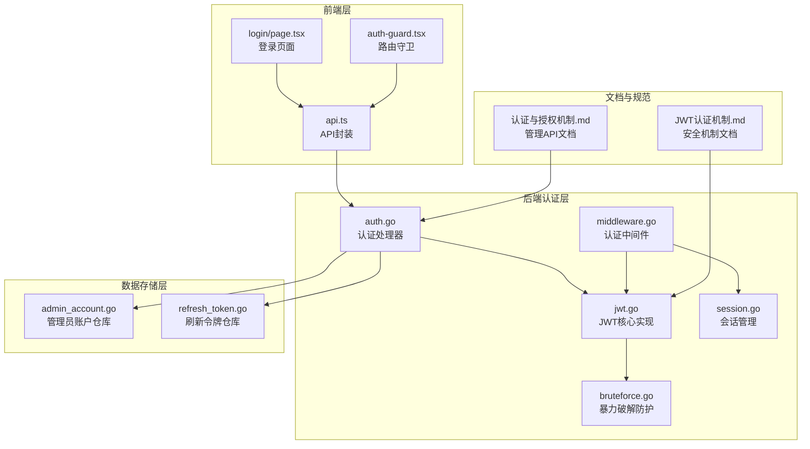

**图表来源**
- [login\page.tsx:1-98](file://frontend/app/login/page.tsx#L1-L98)
- [auth-guard.tsx:1-51](file://frontend/components/auth-guard.tsx#L1-L51)
- [api.ts:1-800](file://frontend/lib/api.ts#L1-L800)
- [auth.go:1-233](file://internal/admin/auth.go#L1-L233)
- [middleware.go:1-130](file://internal/admin/middleware.go#L1-L130)

## 核心组件

### JWT Claims 结构

JWT 令牌的声明结构包含了标准声明和自定义声明：

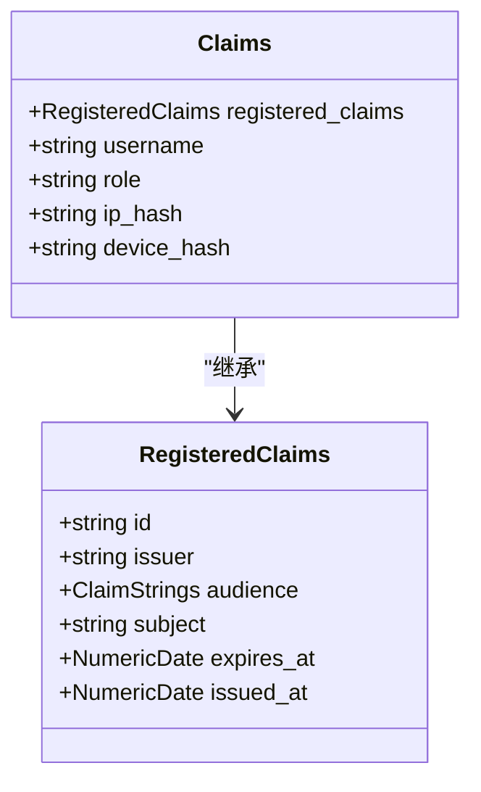

**图表来源**
- [jwt.go:24-31](file://internal/admin/auth/jwt.go#L24-L31)

### TokenManager 类

TokenManager 是 JWT 认证的核心管理器，负责令牌的签名、验证、密钥轮换和黑名单管理：

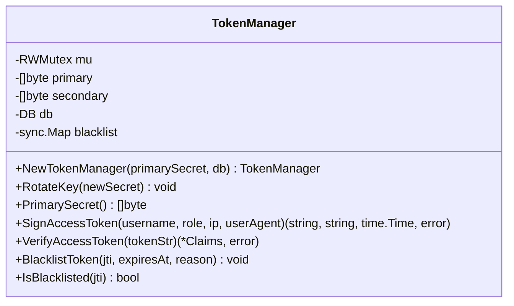

**图表来源**
- [jwt.go:43-80](file://internal/admin/auth/jwt.go#L43-L80)

**章节来源**
- [jwt.go:24-80](file://internal/admin/auth/jwt.go#L24-L80)

## 架构概览

JWT 认证系统的整体架构设计：

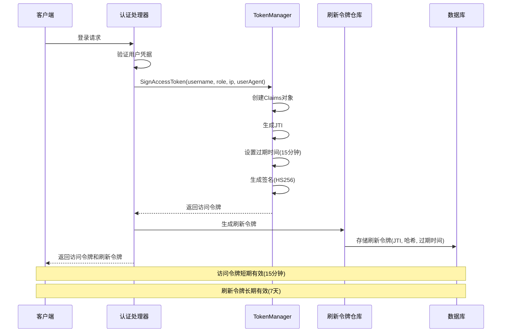

**图表来源**
- [auth.go:84-122](file://internal/admin/auth.go#L84-L122)
- [jwt.go:84-109](file://internal/admin/auth/jwt.go#L84-L109)

## 详细组件分析

### 登录表单处理流程

登录表单处理流程包含以下关键步骤：

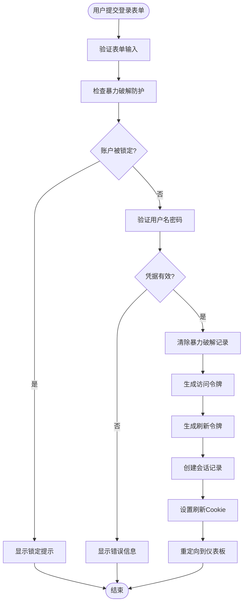

**图表来源**
- [login\page.tsx:27-39](file://frontend/app/login/page.tsx#L27-L39)
- [auth.go:43-118](file://internal/admin/auth.go#L43-L118)

**章节来源**
- [login\page.tsx:12-39](file://frontend/app/login/page.tsx#L12-L39)
- [auth.go:32-118](file://internal/admin/auth.go#L32-L118)

### 令牌获取与存储机制

前端令牌管理机制包含以下关键流程：

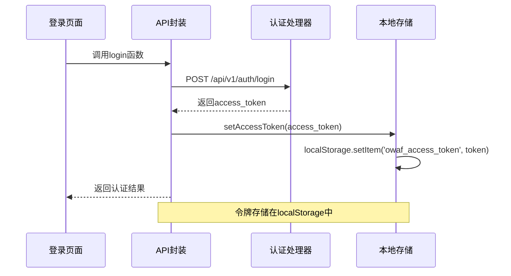

**图表来源**
- [api.ts:7-28](file://frontend/lib/api.ts#L7-L28)
- [api.ts:123-139](file://frontend/lib/api.ts#L123-L139)

**章节来源**
- [api.ts:1-150](file://frontend/lib/api.ts#L1-L150)

### 权限守卫实现方式

路由守卫的实现机制：

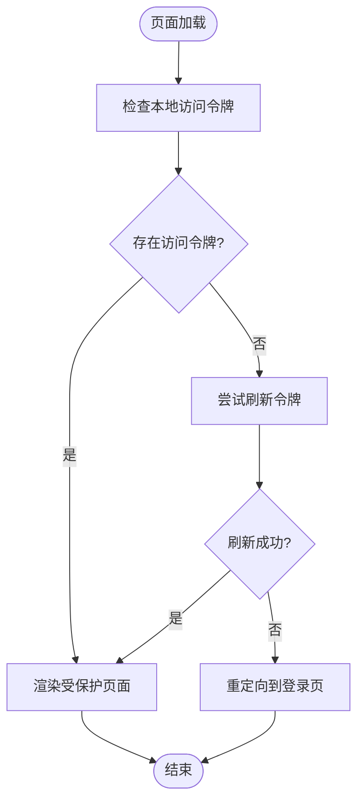

**图表来源**
- [auth-guard.tsx:19-28](file://frontend/components/auth-guard.tsx#L19-L28)

**章节来源**
- [auth-guard.tsx:1-51](file://frontend/components/auth-guard.tsx#L1-L51)

### 自动刷新机制

自动刷新机制的工作流程：

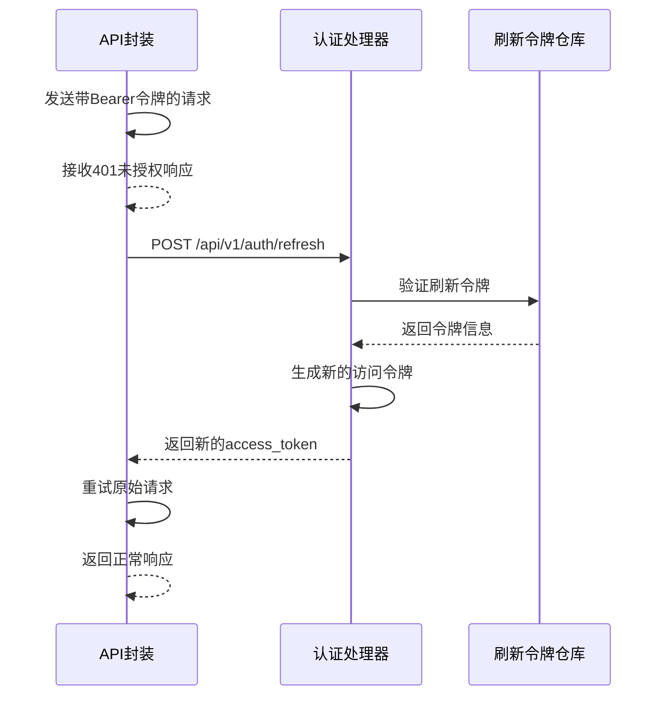

**图表来源**
- [api.ts:72-121](file://frontend/lib/api.ts#L72-L121)
- [auth.go:121-193](file://internal/admin/auth.go#L121-L193)

**章节来源**
- [api.ts:37-121](file://frontend/lib/api.ts#L37-L121)
- [auth.go:121-193](file://internal/admin/auth.go#L121-L193)

### API 工具的鉴权头管理

API 工具的鉴权头管理机制：

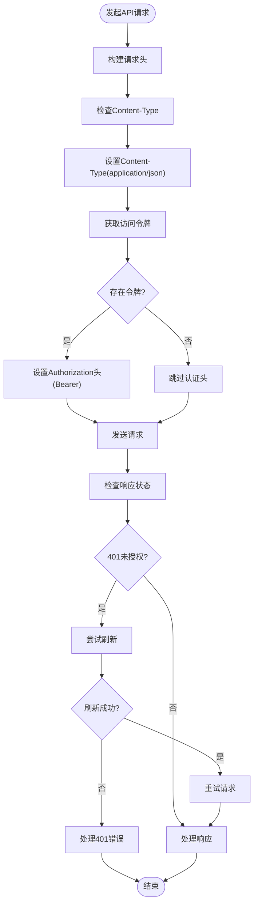

**图表来源**
- [api.ts:60-121](file://frontend/lib/api.ts#L60-L121)

**章节来源**
- [api.ts:60-121](file://frontend/lib/api.ts#L60-L121)

### 401 错误处理策略

401 错误处理的具体实现：

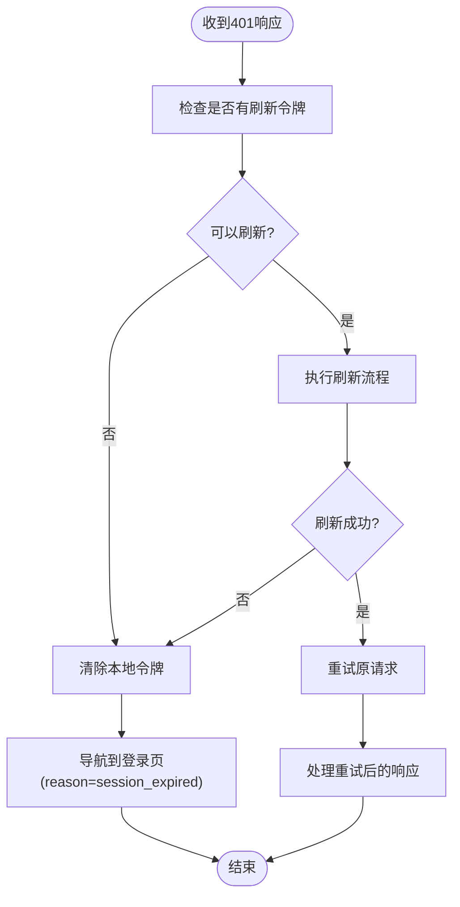

**图表来源**
- [api.ts:81-99](file://frontend/lib/api.ts#L81-L99)

**章节来源**
- [api.ts:81-99](file://frontend/lib/api.ts#L81-L99)

### 令牌刷新策略

令牌刷新策略的详细实现：

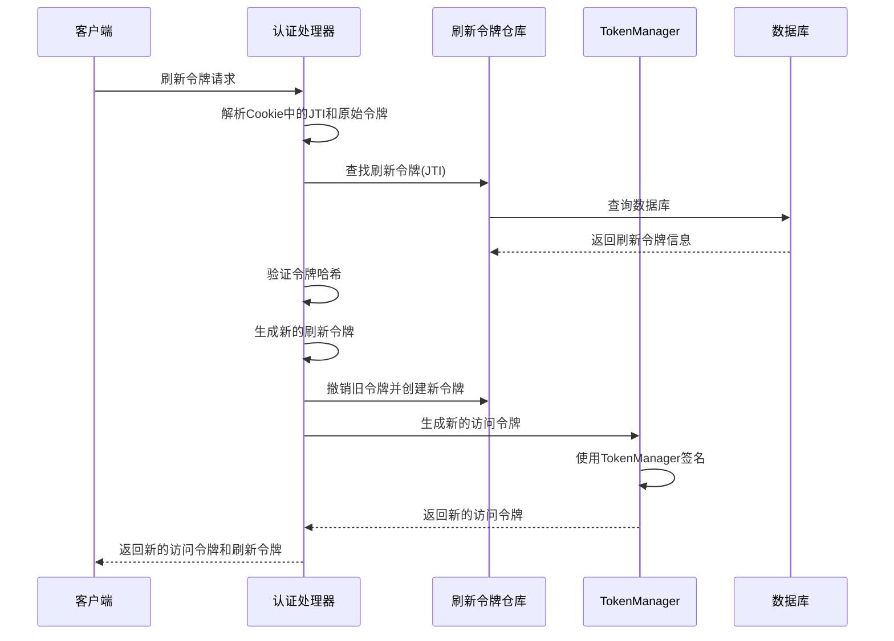

**图表来源**
- [auth.go:121-193](file://internal/admin/auth.go#L121-L193)
- [refresh_token.go:15-32](file://internal/store/repository/refresh_token.go#L15-L32)

**章节来源**
- [auth.go:121-193](file://internal/admin/auth.go#L121-L193)
- [refresh_token.go:15-32](file://internal/store/repository/refresh_token.go#L15-L32)

## 依赖关系分析

JWT 认证机制的依赖关系图：

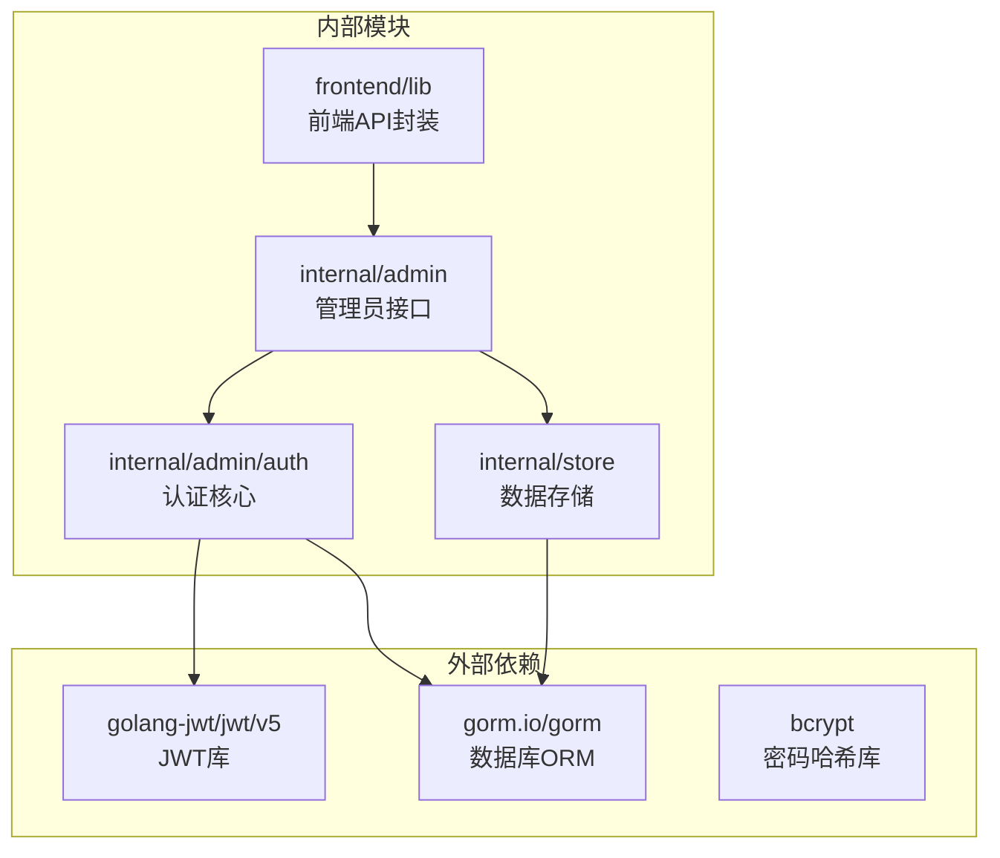

**图表来源**
- [jwt.go:3-15](file://internal/admin/auth/jwt.go#L3-L15)
- [admin_account.go:3-8](file://internal/store/repository/admin_account.go#L3-L8)

**章节来源**
- [jwt.go:3-15](file://internal/admin/auth/jwt.go#L3-L15)
- [admin_account.go:3-8](file://internal/store/repository/admin_account.go#L3-L8)

## 性能考虑

JWT 认证机制在性能方面的优化措施：

### 内存缓存策略
- 令牌黑名单使用 sync.Map 实现高性能查找
- 会话信息内存存储减少数据库查询
- 清理循环定期清理过期数据

### 并发安全
- 使用 RWMutex 确保读写操作的线程安全
- 无锁读取优化常见场景的性能
- 原子操作保证状态一致性

### 资源管理
- 定期清理 goroutine 避免内存泄漏
- 连接池管理数据库连接
- 缓存策略平衡内存使用和性能

## 故障排除指南

### 常见问题诊断

**令牌验证失败**
- 检查 JWT 密钥是否正确配置
- 验证发行者和受众声明
- 确认令牌未被加入黑名单

**刷新令牌失效**
- 检查刷新令牌是否过期
- 验证令牌哈希是否匹配
- 确认令牌未被撤销

**认证中间件异常**
- 检查 Authorization 头格式
- 验证 Bearer 令牌前缀
- 确认白名单路径配置正确

**章节来源**
- [jwt.go:111-154](file://internal/admin/auth/jwt.go#L111-L154)
- [middleware.go:18-72](file://internal/admin/middleware.go#L18-L72)

### 安全最佳实践

**密钥管理**
- 使用强随机密钥（至少 256 位）
- 定期轮换 JWT 密钥
- 在环境变量中安全存储密钥

**令牌安全**
- 启用 HTTPS 传输
- 设置适当的 Cookie 属性
- 实施令牌黑名单机制
- 使用短生命周期访问令牌

**会话管理**
- 实施会话超时机制
- 提供强制登出功能
- 监控异常登录行为
- 定期清理过期会话

**章节来源**
- [middleware.go:121-129](file://internal/admin/middleware.go#L121-L129)
- [JWT 认证机制.md:397-418](file://docs/安全机制/JWT 认证机制.md#L397-L418)

## 结论

My-OpenWaf 的登录流程与鉴权机制提供了一个完整、安全且高效的认证解决方案。通过短期访问令牌和长期刷新令牌的结合，系统在保证安全性的同时提供了良好的用户体验。

关键优势包括：
- 多层安全验证机制
- 支持密钥轮换和令牌黑名单
- 完善的会话管理功能
- 可扩展的 RBAC 权限系统
- 优化的性能和资源管理
- 前端自动刷新机制

该实现为生产环境提供了可靠的认证基础设施，可以根据具体需求进行进一步定制和扩展。

## 附录

### 安全最佳实践

**传输加密**
- 所有认证与敏感操作必须通过 HTTPS
- 使用 HttpOnly Cookie 存储刷新令牌
- 设置 Secure 和 SameSite 属性

**令牌存储**
- 前端短期访问令牌使用 sessionStorage
- 刷新令牌使用 HttpOnly Cookie
- 避免在 localStorage 中存储敏感令牌

**防重放与防篡改**
- 使用 HS256 并妥善保管密钥
- 启用 JTI 与黑名单
- 支持强制注销与密钥轮换

**API Key 管理**
- 严格限制 API Key 权限范围
- 定期轮换并审计使用日志
- 使用 bcrypt 进行密码哈希

**章节来源**
- [认证与授权机制.md:496-512](file://docs/管理 API 系统/认证与授权机制.md#L496-L512)