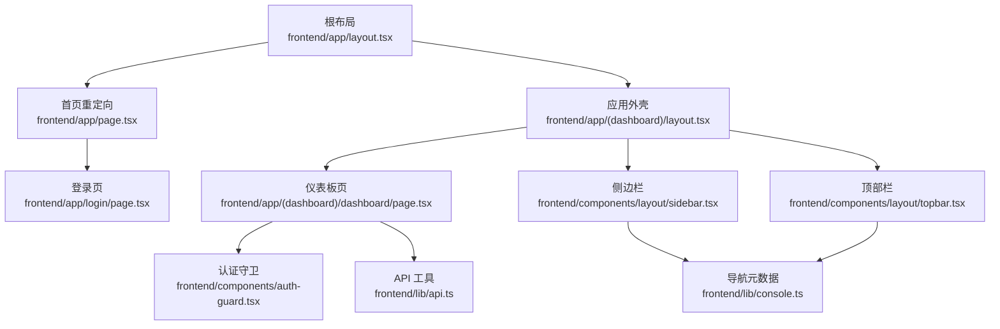
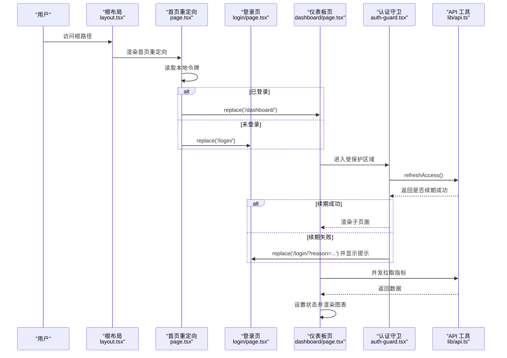
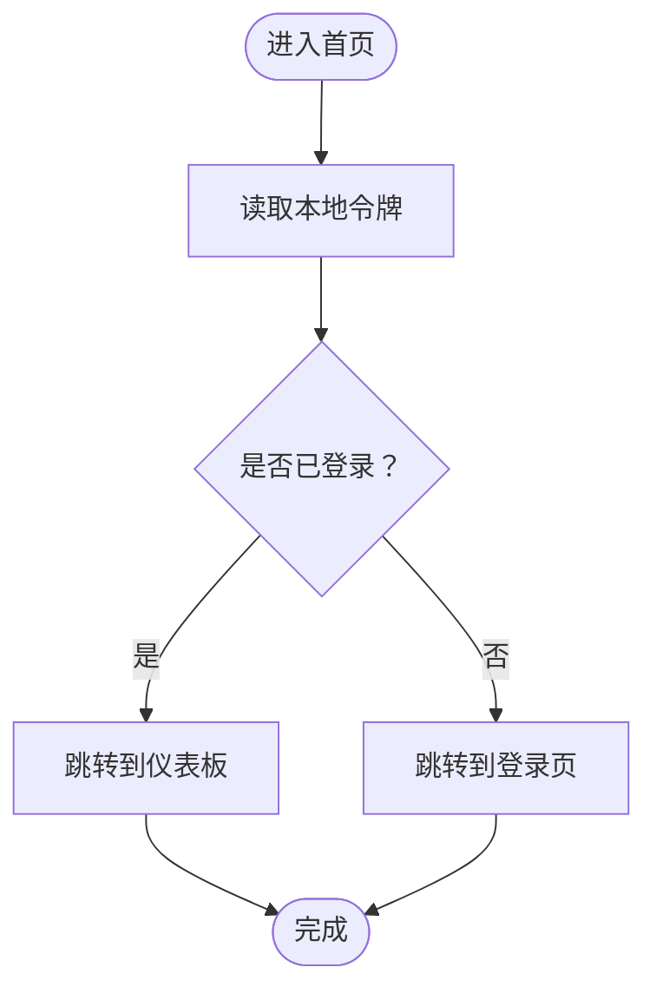
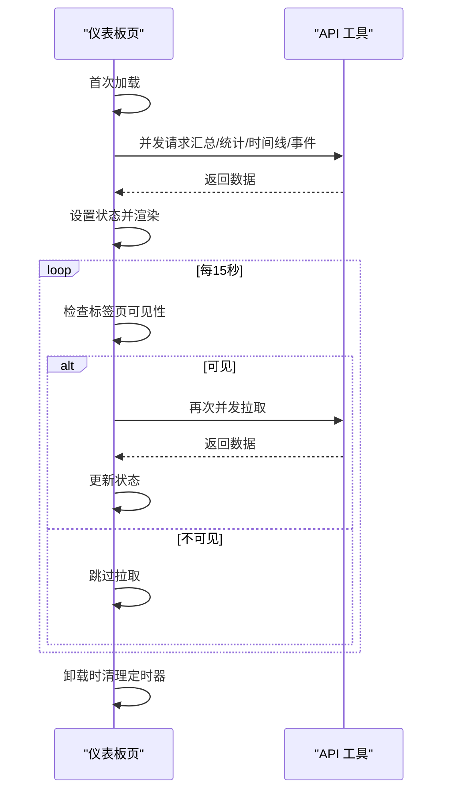
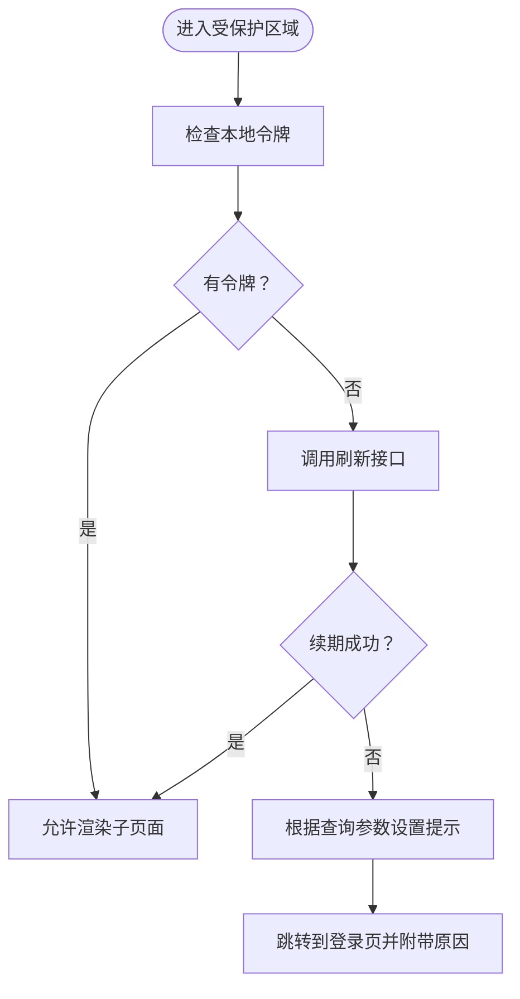
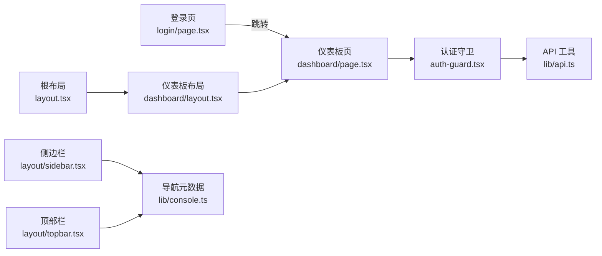

# 页面生命周期与渲染策略

> [返回 前端管理界面](../前端管理界面.md)

<cite>
**本文引用的文件**
- [frontend/app/page.tsx](file://frontend/app/page.tsx)
- [frontend/app/layout.tsx](file://frontend/app/layout.tsx)
- [frontend/app/(dashboard)/layout.tsx](file://frontend/app/(dashboard)/layout.tsx)
- [frontend/components/auth-guard.tsx](file://frontend/components/auth-guard.tsx)
- [frontend/lib/api.ts](file://frontend/lib/api.ts)
- [frontend/app/(dashboard)/dashboard/page.tsx](file://frontend/app/(dashboard)/dashboard/page.tsx)
- [frontend/components/layout/sidebar.tsx](file://frontend/components/layout/sidebar.tsx)
- [frontend/components/layout/topbar.tsx](file://frontend/components/layout/topbar.tsx)
- [frontend/lib/console.ts](file://frontend/lib/console.ts)
- [frontend/app/login/page.tsx](file://frontend/app/login/page.tsx)
- [frontend/app/blocked/page.tsx](file://frontend/app/blocked/page.tsx)
- [frontend/app/maintenance/page.tsx](file://frontend/app/maintenance/page.tsx)
</cite>

## 目录
1. [引言](#引言)
2. [项目结构](#项目结构)
3. [核心组件](#核心组件)
4. [架构总览](#架构总览)
5. [详细组件分析](#详细组件分析)
6. [依赖分析](#依赖分析)
7. [性能考虑](#性能考虑)
8. [故障排除指南](#故障排除指南)
9. [结论](#结论)

## 引言
本文聚焦 My-OpenWaf 前端在 Next.js 中的页面生命周期与渲染策略，系统阐述以下主题：
- 首页重定向逻辑（未登录/已登录的不同路径）
- 仪表板页面的数据获取与定时更新机制
- 动态路由参数的处理方式（如站点详情页的 [id] 参数）
- 客户端状态管理与定时器使用模式
- 数据刷新策略与错误处理
- 性能优化建议、内存泄漏防范与用户体验最佳实践

## 项目结构
前端采用 App Router 的目录约定，页面位于 frontend/app 下，布局组件位于 frontend/app/(dashboard) 中，公共布局与主题提供器位于根布局中；认证守卫与 API 工具位于 components 与 lib 目录。

图表来源
- [frontend/app/layout.tsx:1-28](file://frontend/app/layout.tsx#L1-L28)
- [frontend/app/(dashboard)/layout.tsx:1-52](file://frontend/app/(dashboard)/layout.tsx#L1-L52)
- [frontend/app/page.tsx:1-20](file://frontend/app/page.tsx#L1-L20)
- [frontend/app/login/page.tsx:1-98](file://frontend/app/login/page.tsx#L1-L98)
- [frontend/app/(dashboard)/dashboard/page.tsx:1-363](file://frontend/app/(dashboard)/dashboard/page.tsx#L1-L363)
- [frontend/components/auth-guard.tsx:1-51](file://frontend/components/auth-guard.tsx#L1-L51)
- [frontend/lib/api.ts:1-800](file://frontend/lib/api.ts#L1-L800)
- [frontend/components/layout/sidebar.tsx:1-167](file://frontend/components/layout/sidebar.tsx#L1-L167)
- [frontend/components/layout/topbar.tsx:1-90](file://frontend/components/layout/topbar.tsx#L1-L90)
- [frontend/lib/console.ts:1-240](file://frontend/lib/console.ts#L1-L240)

章节来源
- [frontend/app/layout.tsx:1-28](file://frontend/app/layout.tsx#L1-L28)
- [frontend/app/(dashboard)/layout.tsx:1-52](file://frontend/app/(dashboard)/layout.tsx#L1-L52)
- [frontend/app/page.tsx:1-20](file://frontend/app/page.tsx#L1-L20)
- [frontend/app/login/page.tsx:1-98](file://frontend/app/login/page.tsx#L1-L98)
- [frontend/app/(dashboard)/dashboard/page.tsx:1-363](file://frontend/app/(dashboard)/dashboard/page.tsx#L1-L363)
- [frontend/components/auth-guard.tsx:1-51](file://frontend/components/auth-guard.tsx#L1-L51)
- [frontend/lib/api.ts:1-800](file://frontend/lib/api.ts#L1-L800)
- [frontend/components/layout/sidebar.tsx:1-167](file://frontend/components/layout/sidebar.tsx#L1-L167)
- [frontend/components/layout/topbar.tsx:1-90](file://frontend/components/layout/topbar.tsx#L1-L90)
- [frontend/lib/console.ts:1-240](file://frontend/lib/console.ts#L1-L240)

## 核心组件
- 根布局与主题提供器：负责全局样式与主题上下文，确保 Hydration 警告可控。
- 首页重定向：根据本地令牌决定跳转至仪表板或登录页。
- 认证守卫：在仪表板等受保护区域进行会话校验与自动续期。
- 仪表板页：并发拉取多类指标，周期性刷新并在标签页可见时恢复刷新。
- 侧边栏与顶部栏：导航、面包屑与登出操作。
- API 工具：统一构建请求头、处理 401/403/429 等错误与重试逻辑。
- 登录页、阻断页、维护页：用户引导与错误状态展示。

章节来源
- [frontend/app/layout.tsx:1-28](file://frontend/app/layout.tsx#L1-L28)
- [frontend/app/page.tsx:1-20](file://frontend/app/page.tsx#L1-L20)
- [frontend/components/auth-guard.tsx:1-51](file://frontend/components/auth-guard.tsx#L1-L51)
- [frontend/app/(dashboard)/dashboard/page.tsx:1-363](file://frontend/app/(dashboard)/dashboard/page.tsx#L1-L363)
- [frontend/components/layout/sidebar.tsx:1-167](file://frontend/components/layout/sidebar.tsx#L1-L167)
- [frontend/components/layout/topbar.tsx:1-90](file://frontend/components/layout/topbar.tsx#L1-L90)
- [frontend/lib/api.ts:1-800](file://frontend/lib/api.ts#L1-L800)
- [frontend/app/login/page.tsx:1-98](file://frontend/app/login/page.tsx#L1-L98)
- [frontend/app/blocked/page.tsx:1-22](file://frontend/app/blocked/page.tsx#L1-L22)
- [frontend/app/maintenance/page.tsx:1-22](file://frontend/app/maintenance/page.tsx#L1-L22)

## 架构总览
下图展示了从用户访问到页面渲染、认证与数据加载的关键路径。

图表来源
- [frontend/app/layout.tsx:1-28](file://frontend/app/layout.tsx#L1-L28)
- [frontend/app/page.tsx:1-20](file://frontend/app/page.tsx#L1-L20)
- [frontend/app/login/page.tsx:1-98](file://frontend/app/login/page.tsx#L1-L98)
- [frontend/app/(dashboard)/dashboard/page.tsx:1-363](file://frontend/app/(dashboard)/dashboard/page.tsx#L1-L363)
- [frontend/components/auth-guard.tsx:1-51](file://frontend/components/auth-guard.tsx#L1-L51)
- [frontend/lib/api.ts:1-800](file://frontend/lib/api.ts#L1-L800)

## 详细组件分析

### 首页重定向逻辑
- 入口：根布局下的首页组件通过客户端标记，使用路由钩子判断是否已登录，并执行替换跳转。
- 关键点：
  - 读取本地令牌以判断登录态。
  - 已登录跳转仪表板，未登录跳转登录页。
  - 使用 replace 而非 push，避免历史栈冗余。

图表来源
- [frontend/app/page.tsx:1-20](file://frontend/app/page.tsx#L1-L20)

章节来源
- [frontend/app/page.tsx:1-20](file://frontend/app/page.tsx#L1-L20)

### 仪表板页面的数据获取与定时更新
- 数据来源：仪表板页并发拉取仪表盘汇总、安全事件统计、时间线与最近事件列表。
- 初次加载：在挂载后立即触发一次加载。
- 定时刷新：每 15 秒触发一次，但仅在标签页可见时才实际拉取，避免后台浪费。
- 取消机制：组件卸载时清除定时器，防止内存泄漏与悬挂回调。
- 错误处理：捕获异常并通过通知组件提示，同时保持加载状态的正确收尾。

图表来源
- [frontend/app/(dashboard)/dashboard/page.tsx:1-363](file://frontend/app/(dashboard)/dashboard/page.tsx#L1-L363)
- [frontend/lib/api.ts:1-800](file://frontend/lib/api.ts#L1-L800)

章节来源
- [frontend/app/(dashboard)/dashboard/page.tsx:1-363](file://frontend/app/(dashboard)/dashboard/page.tsx#L1-L363)

### 认证守卫与会话续期
- 在受保护布局内，认证守卫会在首次渲染时检查登录态。
- 若本地令牌无效，尝试通过刷新接口续期。
- 续期成功则允许渲染子页面；否则根据原因参数跳转登录页并显示提示信息。
- 使用 Suspense 包裹，避免水合期间的闪烁与空内容。

图表来源
- [frontend/components/auth-guard.tsx:1-51](file://frontend/components/auth-guard.tsx#L1-L51)
- [frontend/lib/api.ts:1-800](file://frontend/lib/api.ts#L1-L800)

章节来源
- [frontend/components/auth-guard.tsx:1-51](file://frontend/components/auth-guard.tsx#L1-L51)
- [frontend/lib/api.ts:1-800](file://frontend/lib/api.ts#L1-L800)

### 动态路由参数处理（站点详情 [id]）
- 路由约定：站点详情页位于 frontend/app/(dashboard)/sites/[id]/，其中 [id] 为动态段。
- 参数解析：在页面组件中可通过路由工具读取动态参数并据此发起数据请求。
- 实践要点：
  - 在 useEffect 中监听参数变化，避免重复请求。
  - 使用防抖或去抖策略，减少频繁切换带来的请求风暴。
  - 在组件卸载时取消未完成的请求，防止状态更新到已卸载组件。

章节来源
- [frontend/app/(dashboard)/sites/[id]/page.tsx](file://frontend/app/(dashboard)/sites/[id]/page.tsx)

### 客户端状态管理与定时器使用模式
- 状态集中：仪表板页使用多个局部状态管理指标数据、时间线、统计与事件列表。
- 并发策略：初次加载采用 Promise.all 并发拉取，缩短首屏等待时间。
- 定时器模式：使用 setInterval 控制刷新节奏，结合 document.visibilityState 判断可见性，仅在可见时刷新。
- 清理策略：在 useEffect 的返回函数中清理定时器，确保组件卸载后不再执行。

章节来源
- [frontend/app/(dashboard)/dashboard/page.tsx:1-363](file://frontend/app/(dashboard)/dashboard/page.tsx#L1-L363)

### 数据刷新策略
- 首次加载：组件挂载后立即拉取所需数据。
- 后台刷新：定时器每 15 秒触发一次，仅在标签页可见时真正请求。
- 手动刷新：提供按钮触发即时刷新，同时禁用按钮避免重复点击。
- 错误与降级：对 401/403/429 等错误进行分类处理，必要时引导用户重新登录。

章节来源
- [frontend/app/(dashboard)/dashboard/page.tsx:1-363](file://frontend/app/(dashboard)/dashboard/page.tsx#L1-L363)
- [frontend/lib/api.ts:1-800](file://frontend/lib/api.ts#L1-L800)

### 登录页、阻断页与维护页
- 登录页：接收查询参数 reason 用于提示会话过期或权限不足；提交表单后调用登录接口并跳转仪表板。
- 阻断页：面向公众的拦截页面，展示请求 ID、规则 ID 等事实信息。
- 维护页：面向公众的维护页面，提示站点处于维护模式。

章节来源
- [frontend/app/login/page.tsx:1-98](file://frontend/app/login/page.tsx#L1-L98)
- [frontend/app/blocked/page.tsx:1-22](file://frontend/app/blocked/page.tsx#L1-L22)
- [frontend/app/maintenance/page.tsx:1-22](file://frontend/app/maintenance/page.tsx#L1-L22)

## 依赖分析
- 页面到布局：根布局 -> 仪表板布局 -> 仪表板页；登录页直属于根布局。
- 认证链路：仪表板页 -> 认证守卫 -> API 工具（刷新令牌）。
- 导航与元数据：侧边栏与顶部栏依赖导航元数据工具，用于生成面包屑与高亮当前项。
- API 层：所有业务页面通过 API 工具封装请求头、错误处理与重试逻辑。

图表来源
- [frontend/app/login/page.tsx:1-98](file://frontend/app/login/page.tsx#L1-L98)
- [frontend/app/(dashboard)/dashboard/page.tsx:1-363](file://frontend/app/(dashboard)/dashboard/page.tsx#L1-L363)
- [frontend/app/(dashboard)/layout.tsx:1-52](file://frontend/app/(dashboard)/layout.tsx#L1-L52)
- [frontend/app/layout.tsx:1-28](file://frontend/app/layout.tsx#L1-L28)
- [frontend/components/auth-guard.tsx:1-51](file://frontend/components/auth-guard.tsx#L1-L51)
- [frontend/lib/api.ts:1-800](file://frontend/lib/api.ts#L1-L800)
- [frontend/components/layout/sidebar.tsx:1-167](file://frontend/components/layout/sidebar.tsx#L1-L167)
- [frontend/components/layout/topbar.tsx:1-90](file://frontend/components/layout/topbar.tsx#L1-L90)
- [frontend/lib/console.ts:1-240](file://frontend/lib/console.ts#L1-L240)

章节来源
- [frontend/app/login/page.tsx:1-98](file://frontend/app/login/page.tsx#L1-L98)
- [frontend/app/(dashboard)/dashboard/page.tsx:1-363](file://frontend/app/(dashboard)/dashboard/page.tsx#L1-L363)
- [frontend/app/(dashboard)/layout.tsx:1-52](file://frontend/app/(dashboard)/layout.tsx#L1-L52)
- [frontend/app/layout.tsx:1-28](file://frontend/app/layout.tsx#L1-L28)
- [frontend/components/auth-guard.tsx:1-51](file://frontend/components/auth-guard.tsx#L1-L51)
- [frontend/lib/api.ts:1-800](file://frontend/lib/api.ts#L1-L800)
- [frontend/components/layout/sidebar.tsx:1-167](file://frontend/components/layout/sidebar.tsx#L1-L167)
- [frontend/components/layout/topbar.tsx:1-90](file://frontend/components/layout/topbar.tsx#L1-L90)
- [frontend/lib/console.ts:1-240](file://frontend/lib/console.ts#L1-L240)

## 性能考虑
- 并发请求：仪表板页使用并发拉取减少首屏等待时间。
- 可见性感知：仅在标签页可见时刷新，降低后台消耗。
- 状态收敛：将图表与表格数据收敛到局部状态，避免跨组件重复计算。
- 请求头复用：统一构建请求头，减少重复逻辑与错误。
- 缓存与去抖：在路由切换频繁场景可引入去抖策略，避免短时间内多次请求。
- 图表渲染：使用响应式容器与按需渲染，避免大屏渲染压力。

## 故障排除指南
- 401 未授权：
  - 首次请求 401 时尝试自动续期；若续期成功则重试原请求。
  - 若续期失败且不在登录页，则跳转登录页并附带原因参数。
- 403 禁止访问：抛出错误并提示权限不足。
- 429 请求过多：抛出错误并提示限流。
- 会话过期提示：登录页与认证守卫均支持通过查询参数 reason 显示相应提示。
- 内存泄漏防范：仪表板页在卸载时清理定时器；组件卸载后及时取消网络请求。

章节来源
- [frontend/lib/api.ts:1-800](file://frontend/lib/api.ts#L1-L800)
- [frontend/components/auth-guard.tsx:1-51](file://frontend/components/auth-guard.tsx#L1-L51)
- [frontend/app/login/page.tsx:1-98](file://frontend/app/login/page.tsx#L1-L98)

## 结论
本项目在页面生命周期与渲染策略上体现了清晰的职责分离与良好的用户体验设计：
- 首页重定向基于本地令牌，保证入口路径简洁一致。
- 仪表板采用并发数据拉取与可见性感知的定时刷新，兼顾性能与实时性。
- 认证守卫与 API 工具形成稳定的鉴权与错误处理闭环。
- 动态路由参数解析与导航元数据配合，使页面具备良好的可扩展性。
- 通过清理定时器与请求、错误分类处理与提示，有效防范内存泄漏并提升稳定性。