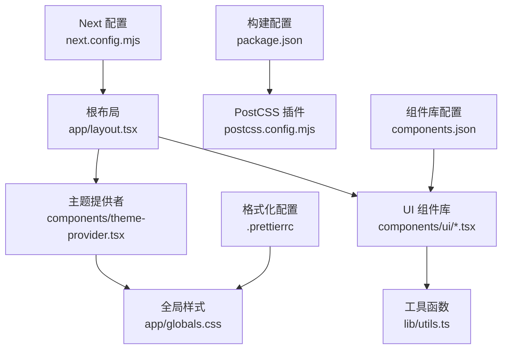
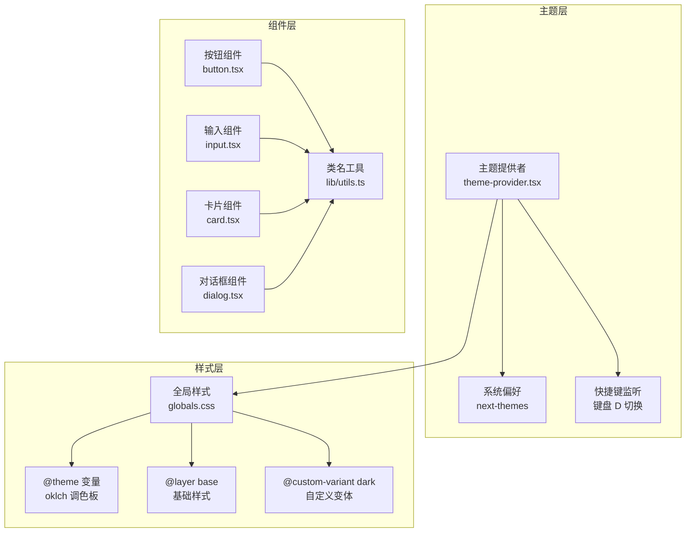
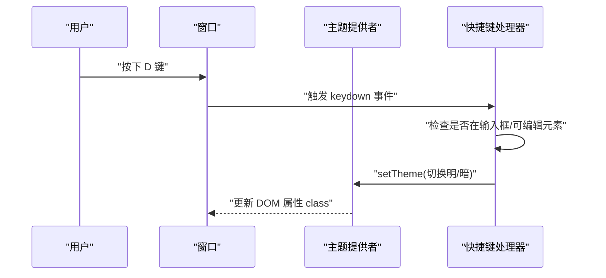
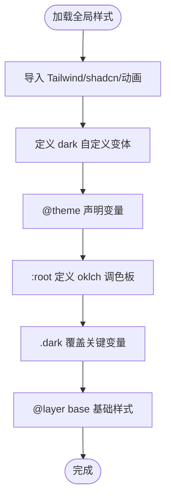
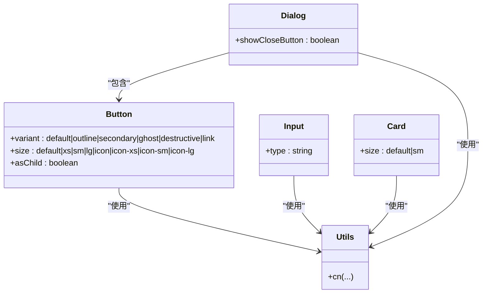
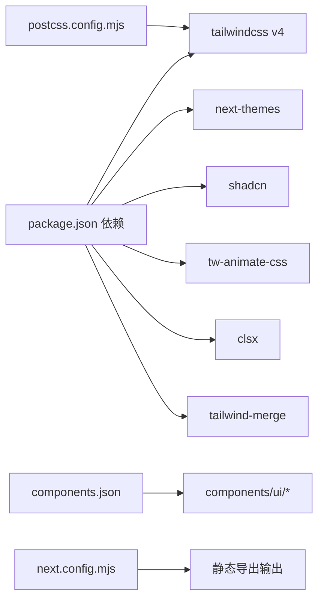

# 主题系统与样式

<cite>
**本文档引用的文件**
- [frontend/components/theme-provider.tsx](file://frontend/components/theme-provider.tsx)
- [frontend/app/globals.css](file://frontend/app/globals.css)
- [frontend/app/layout.tsx](file://frontend/app/layout.tsx)
- [frontend/components/ui/button.tsx](file://frontend/components/ui/button.tsx)
- [frontend/components/ui/input.tsx](file://frontend/components/ui/input.tsx)
- [frontend/components/ui/card.tsx](file://frontend/components/ui/card.tsx)
- [frontend/components/ui/dialog.tsx](file://frontend/components/ui/dialog.tsx)
- [frontend/lib/utils.ts](file://frontend/lib/utils.ts)
- [frontend/components.json](file://frontend/components.json)
- [frontend/package.json](file://frontend/package.json)
- [frontend/postcss.config.mjs](file://frontend/postcss.config.mjs)
- [frontend/next.config.mjs](file://frontend/next.config.mjs)
- [frontend/docs/前端管理界面/主题系统与样式.md](file://docs/前端管理界面/主题系统与样式.md)
</cite>

## 目录
1. [简介](#简介)
2. [项目结构](#项目结构)
3. [核心组件](#核心组件)
4. [架构总览](#架构总览)
5. [详细组件分析](#详细组件分析)
6. [依赖关系分析](#依赖关系分析)
7. [性能考虑](#性能考虑)
8. [故障排除指南](#故障排除指南)
9. [结论](#结论)
10. [附录](#附录)

## 简介
本文件系统性梳理前端主题系统与样式架构，涵盖以下要点：
- 主题提供者实现：明/暗主题切换、键盘快捷键、系统偏好集成
- 颜色变量管理：基于 oklch 的原子色彩体系、CSS 变量映射与明暗两套调色板
- 字体配置：Geist 字体变量注入与全局排版基线
- Tailwind CSS 配置：自定义变体、@theme 声明、@layer 层次
- UI 组件库（shadcn/ui）：组件变体与样式覆盖策略
- 响应式设计：移动端适配与网格断点策略
- 样式组织：CSS 模块化、样式优先级与工具函数
- 最佳实践：主题定制与样式扩展建议

## 项目结构
前端样式相关的核心文件分布如下：
- 主题提供者：frontend/components/theme-provider.tsx
- 全局样式：frontend/app/globals.css
- 根布局：frontend/app/layout.tsx
- UI 组件：frontend/components/ui/*.tsx
- 工具函数：frontend/lib/utils.ts
- 配置文件：frontend/components.json、frontend/package.json、frontend/postcss.config.mjs、frontend/next.config.mjs、frontend/.prettierrc

**图表来源**
- [frontend/app/layout.tsx:1-40](file://frontend/app/layout.tsx#L1-L40)
- [frontend/components/theme-provider.tsx:1-72](file://frontend/components/theme-provider.tsx#L1-L72)
- [frontend/app/globals.css:1-130](file://frontend/app/globals.css#L1-L130)
- [frontend/components/ui/button.tsx:1-68](file://frontend/components/ui/button.tsx#L1-L68)
- [frontend/lib/utils.ts:1-7](file://frontend/lib/utils.ts#L1-L7)
- [frontend/package.json:1-45](file://frontend/package.json#L1-L45)
- [frontend/postcss.config.mjs:1-9](file://frontend/postcss.config.mjs#L1-L9)
- [frontend/next.config.mjs:1-12](file://frontend/next.config.mjs#L1-L12)
- [frontend/components.json:1-26](file://frontend/components.json#L1-L26)
- [frontend/.prettierrc:1-12](file://frontend/.prettierrc#L1-L12)

**章节来源**
- [frontend/app/layout.tsx:1-40](file://frontend/app/layout.tsx#L1-L40)
- [frontend/components/theme-provider.tsx:1-72](file://frontend/components/theme-provider.tsx#L1-L72)
- [frontend/app/globals.css:1-130](file://frontend/app/globals.css#L1-L130)
- [frontend/components/ui/button.tsx:1-68](file://frontend/components/ui/button.tsx#L1-L68)
- [frontend/lib/utils.ts:1-7](file://frontend/lib/utils.ts#L1-L7)
- [frontend/components.json:1-26](file://frontend/components.json#L1-L26)
- [frontend/package.json:1-45](file://frontend/package.json#L1-L45)
- [frontend/postcss.config.mjs:1-9](file://frontend/postcss.config.mjs#L1-L9)
- [frontend/next.config.mjs:1-12](file://frontend/next.config.mjs#L1-L12)
- [frontend/.prettierrc:1-12](file://frontend/.prettierrc#L1-L12)

## 核心组件
- 主题提供者：基于 next-themes 提供明/暗主题切换，支持系统偏好与键盘快捷键（D 键）
- 全局样式：引入 Tailwind、动画与 shadcn 样式，声明自定义变体与 @theme 变量，定义明/暗两套 oklch 色彩
- 字体注入：通过 Geist 字体变量注入到 CSS 变量，统一标题/正文字体
- UI 组件：基于 class-variance-authority（cva）与 radix-ui 实现，遵循 shadcn/ui 设计语言
- 工具函数：cn（clsx + tailwind-merge）用于类名合并与冲突消解

**章节来源**
- [frontend/components/theme-provider.tsx:1-72](file://frontend/components/theme-provider.tsx#L1-L72)
- [frontend/app/globals.css:1-130](file://frontend/app/globals.css#L1-L130)
- [frontend/app/layout.tsx:1-40](file://frontend/app/layout.tsx#L1-L40)
- [frontend/components/ui/button.tsx:1-68](file://frontend/components/ui/button.tsx#L1-L68)
- [frontend/lib/utils.ts:1-7](file://frontend/lib/utils.ts#L1-L7)

## 架构总览
主题系统与样式架构围绕“主题提供者 → 全局样式 → UI 组件 → 工具函数”的链路展开，辅以构建与格式化配置。

**图表来源**
- [frontend/components/theme-provider.tsx:1-72](file://frontend/components/theme-provider.tsx#L1-L72)
- [frontend/app/globals.css:1-130](file://frontend/app/globals.css#L1-L130)
- [frontend/components/ui/button.tsx:1-68](file://frontend/components/ui/button.tsx#L1-L68)
- [frontend/components/ui/input.tsx:1-20](file://frontend/components/ui/input.tsx#L1-L20)
- [frontend/components/ui/card.tsx:1-104](file://frontend/components/ui/card.tsx#L1-L104)
- [frontend/components/ui/dialog.tsx:1-169](file://frontend/components/ui/dialog.tsx#L1-L169)
- [frontend/lib/utils.ts:1-7](file://frontend/lib/utils.ts#L1-L7)

## 详细组件分析

### 主题提供者与键盘快捷键
- 使用 next-themes 在 DOM 上设置主题属性（class），默认使用系统偏好
- 禁用过渡动画以避免闪烁
- 监听键盘事件（D 键），在非输入焦点时切换明/暗主题
- 通过 isTypingTarget 过滤编辑状态，避免误触

**图表来源**
- [frontend/components/theme-provider.tsx:37-69](file://frontend/components/theme-provider.tsx#L37-L69)

**章节来源**
- [frontend/components/theme-provider.tsx:1-72](file://frontend/components/theme-provider.tsx#L1-L72)

### 全局样式与颜色变量管理
- 引入 Tailwind、动画与 shadcn 样式
- 自定义 dark 变体选择器，配合 .dark 类
- 使用 @theme inline 声明变量，映射所有组件所需颜色与圆角半径
- 定义 oklch 调色板：背景、前景、卡片、弹出层、主色、次色、强调色、破坏性等
- 明/暗两套调色板，.dark 选择器覆盖关键变量
- @layer base 设置基础边框、文本与字体基线

**图表来源**
- [frontend/app/globals.css:1-130](file://frontend/app/globals.css#L1-L130)

**章节来源**
- [frontend/app/globals.css:1-130](file://frontend/app/globals.css#L1-L130)

### 字体配置与排版基线
- 通过 next/font/google 注入 Geist Sans 与 Geist Mono 字体变量
- 将字体变量应用到 html 元素，确保全局可用
- 在 @layer base 中设置默认字体族与文本颜色

**章节来源**
- [frontend/app/layout.tsx:13-32](file://frontend/app/layout.tsx#L13-L32)
- [frontend/app/globals.css:119-129](file://frontend/app/globals.css#L119-L129)

### UI 组件库与样式覆盖
- 按钮组件：使用 cva 定义变体与尺寸，结合 cn 合并类名；聚焦态使用 ring 与 outline-ring/50
- 输入组件：统一边框、背景、占位符与聚焦态样式，支持明/暗模式下的透明度与禁用态
- 卡片组件：支持默认与小号尺寸，使用 data-slot 与 data-size 辅助调试与样式覆盖
- 对话框组件：基于 radix-ui，使用数据槽与动画类实现开合过渡，支持关闭按钮

**图表来源**
- [frontend/components/ui/button.tsx:1-68](file://frontend/components/ui/button.tsx#L1-L68)
- [frontend/components/ui/input.tsx:1-20](file://frontend/components/ui/input.tsx#L1-L20)
- [frontend/components/ui/card.tsx:1-104](file://frontend/components/ui/card.tsx#L1-L104)
- [frontend/components/ui/dialog.tsx:1-169](file://frontend/components/ui/dialog.tsx#L1-L169)
- [frontend/lib/utils.ts:1-7](file://frontend/lib/utils.ts#L1-L7)

**章节来源**
- [frontend/components/ui/button.tsx:1-68](file://frontend/components/ui/button.tsx#L1-L68)
- [frontend/components/ui/input.tsx:1-20](file://frontend/components/ui/input.tsx#L1-L20)
- [frontend/components/ui/card.tsx:1-104](file://frontend/components/ui/card.tsx#L1-L104)
- [frontend/components/ui/dialog.tsx:1-169](file://frontend/components/ui/dialog.tsx#L1-L169)
- [frontend/lib/utils.ts:1-7](file://frontend/lib/utils.ts#L1-L7)

### 响应式设计与断点策略
- 组件中广泛使用 sm/sm:、md:、lg:、xl: 等 Tailwind 断点前缀，实现从移动端到桌面端的渐进增强
- 示例：统计卡片网格采用 1/2/3/6 列的响应式布局，保证在不同屏幕尺寸下均能良好展示
- 建议：在新增组件时遵循现有断点命名与间距体系，保持一致性

**章节来源**
- [frontend/app/(dashboard)/dashboard/page.tsx:267-292](file://frontend/app/(dashboard)/dashboard/page.tsx#L267-L292)

### 样式组织与优先级管理
- 使用 cn（clsx + tailwind-merge）合并类名，自动解决冲突与重复
- 组件内部通过 data-slot 与 data-variant/data-size 标记，便于调试与覆盖
- 全局样式通过 @layer base 统一基础元素外观，避免过度特异性
- shadcn/ui 组件遵循原子化设计，优先使用语义化类名与变量

**章节来源**
- [frontend/lib/utils.ts:1-7](file://frontend/lib/utils.ts#L1-L7)
- [frontend/components/ui/button.tsx:54-65](file://frontend/components/ui/button.tsx#L54-L65)
- [frontend/components/ui/input.tsx:5-17](file://frontend/components/ui/input.tsx#L5-L17)
- [frontend/app/globals.css:119-129](file://frontend/app/globals.css#L119-L129)

## 依赖关系分析
- 构建与插件：Tailwind v4 通过 PostCSS 插件加载，Next 输出为静态导出
- UI 库：shadcn/ui 通过组件库配置与别名映射到本地组件目录
- 动画：tw-animate-css 提供 CSS 动画类
- 类名合并：clsx 与 tailwind-merge 组合，确保样式优先级与去重

**图表来源**
- [frontend/package.json:14-28](file://frontend/package.json#L14-L28)
- [frontend/components.json:6-21](file://frontend/components.json#L6-L21)
- [frontend/postcss.config.mjs:1-9](file://frontend/postcss.config.mjs#L1-L9)
- [frontend/next.config.mjs:1-12](file://frontend/next.config.mjs#L1-L12)

**章节来源**
- [frontend/package.json:1-45](file://frontend/package.json#L1-L45)
- [frontend/components.json:1-26](file://frontend/components.json#L1-L26)
- [frontend/postcss.config.mjs:1-9](file://frontend/postcss.config.mjs#L1-L9)
- [frontend/next.config.mjs:1-12](file://frontend/next.config.mjs#L1-L12)

## 性能考虑
- 禁用过渡动画：减少主题切换时的视觉闪烁与重绘
- 静态导出：Next 输出为静态 HTML，降低运行时渲染成本
- 原子化样式：cva 与数据槽减少复杂选择器，提升样式命中效率
- 动画最小化：仅在必要场景使用 tw-animate-css，避免不必要的帧消耗

## 故障排除指南
- 主题切换无效
  - 检查根节点是否正确挂载 ThemeProvider
  - 确认 .dark 类是否由 next-themes 正确注入
  - 验证键盘快捷键未被输入框拦截
- 样式冲突或覆盖异常
  - 使用 data-slot 与 data-variant/data-size 标记定位组件
  - 通过 cn 合并类名，避免重复与特异性过高
- 字体显示问题
  - 确认 Geist 字体变量已注入到 html 元素
  - 检查字体加载与回退策略
- 构建失败或样式未生效
  - 确认 PostCSS 插件与 Tailwind 版本兼容
  - 检查 components.json 中的 tailwind.css 路径与别名

**章节来源**
- [frontend/components/theme-provider.tsx:1-72](file://frontend/components/theme-provider.tsx#L1-L72)
- [frontend/app/layout.tsx:23-38](file://frontend/app/layout.tsx#L23-L38)
- [frontend/lib/utils.ts:1-7](file://frontend/lib/utils.ts#L1-L7)
- [frontend/components.json:6-12](file://frontend/components.json#L6-L12)
- [frontend/postcss.config.mjs:1-9](file://frontend/postcss.config.mjs#L1-L9)

## 结论
该主题系统与样式架构以 next-themes 为核心，结合 oklch 调色板、@theme 变量与自定义 dark 变体，实现了稳定且可扩展的主题机制。通过 shadcn/ui 组件库与 cva 的原子化设计，配合 cn 工具函数与 @layer base 的层次化组织，整体具备良好的可维护性与一致性。响应式断点策略与静态导出配置进一步提升了跨设备体验与部署效率。

## 附录

### Tailwind 配置要点
- 自定义变体：使用 @custom-variant dark 定义深色选择器
- @theme 声明：集中管理颜色与圆角变量，便于主题切换
- @layer base：统一基础元素外观，避免全局污染
- 动画：引入 tw-animate-css 并按需使用

**章节来源**
- [frontend/app/globals.css:1-130](file://frontend/app/globals.css#L1-L130)

### shadcn/ui 组件定制与覆盖
- 使用 data-slot 与 data-variant/data-size 标记组件状态
- 通过 cva 定义变体与尺寸，结合 cn 合并类名
- 在组件内部直接使用全局变量（如 ring、border、muted 等）

**章节来源**
- [frontend/components/ui/button.tsx:7-42](file://frontend/components/ui/button.tsx#L7-L42)
- [frontend/components/ui/input.tsx:5-17](file://frontend/components/ui/input.tsx#L5-L17)
- [frontend/components/ui/card.tsx:5-21](file://frontend/components/ui/card.tsx#L5-L21)
- [frontend/components/ui/dialog.tsx:50-86](file://frontend/components/ui/dialog.tsx#L50-L86)

### 响应式设计最佳实践
- 优先使用 sm/sm:/md:/lg:/xl: 断点前缀
- 保持网格列数与间距的一致性
- 在移动端优先保证信息层级与交互可达性

**章节来源**
- [frontend/app/(dashboard)/dashboard/page.tsx:267-292](file://frontend/app/(dashboard)/dashboard/page.tsx#L267-L292)

### 样式组织与优先级管理清单
- 使用 cn 合并类名，避免重复与冲突
- 组件内部通过 data-slot/dataset 标记，便于调试与覆盖
- 全局样式通过 @layer base 统一基础外观
- 遵循 shadcn/ui 设计语言，减少自定义样式

**章节来源**
- [frontend/lib/utils.ts:1-7](file://frontend/lib/utils.ts#L1-L7)
- [frontend/app/globals.css:119-129](file://frontend/app/globals.css#L119-L129)