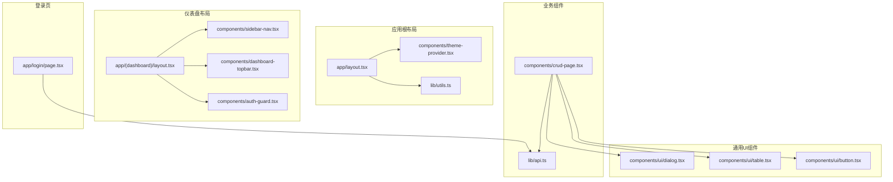
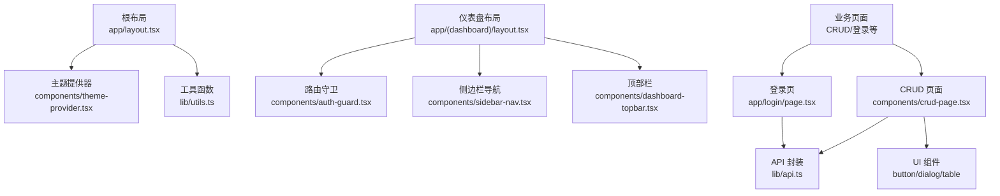
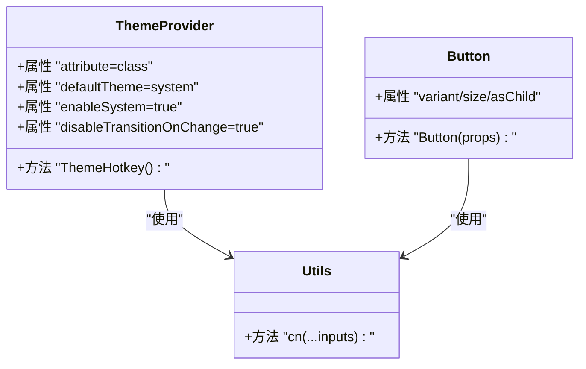
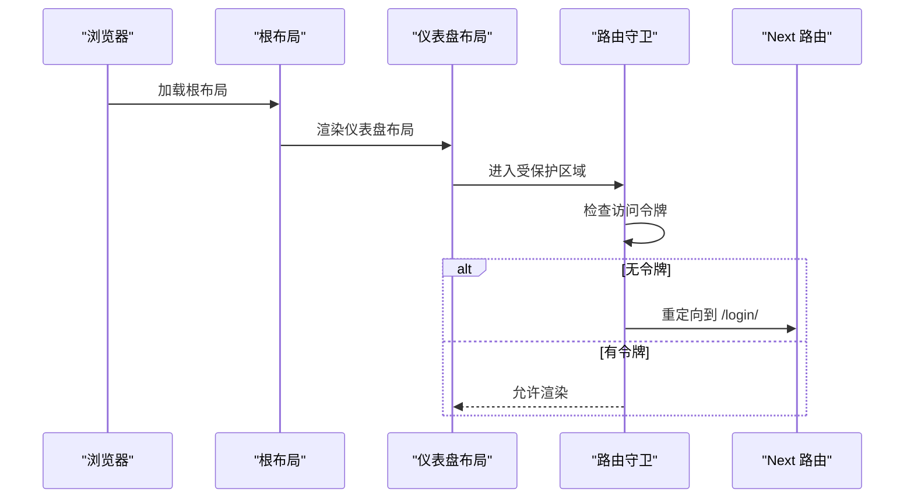
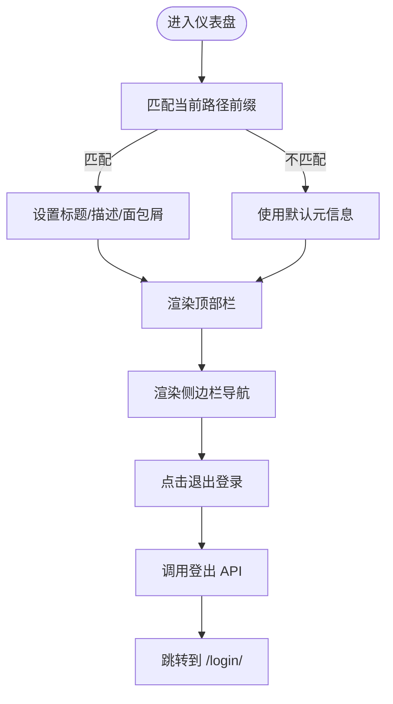
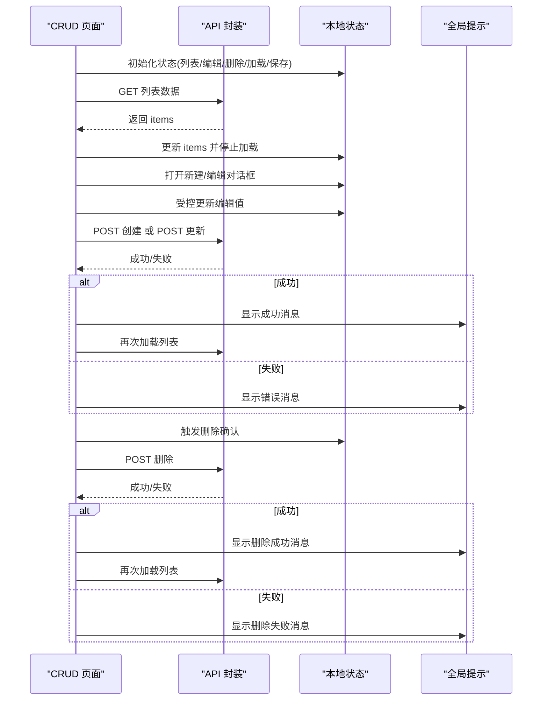
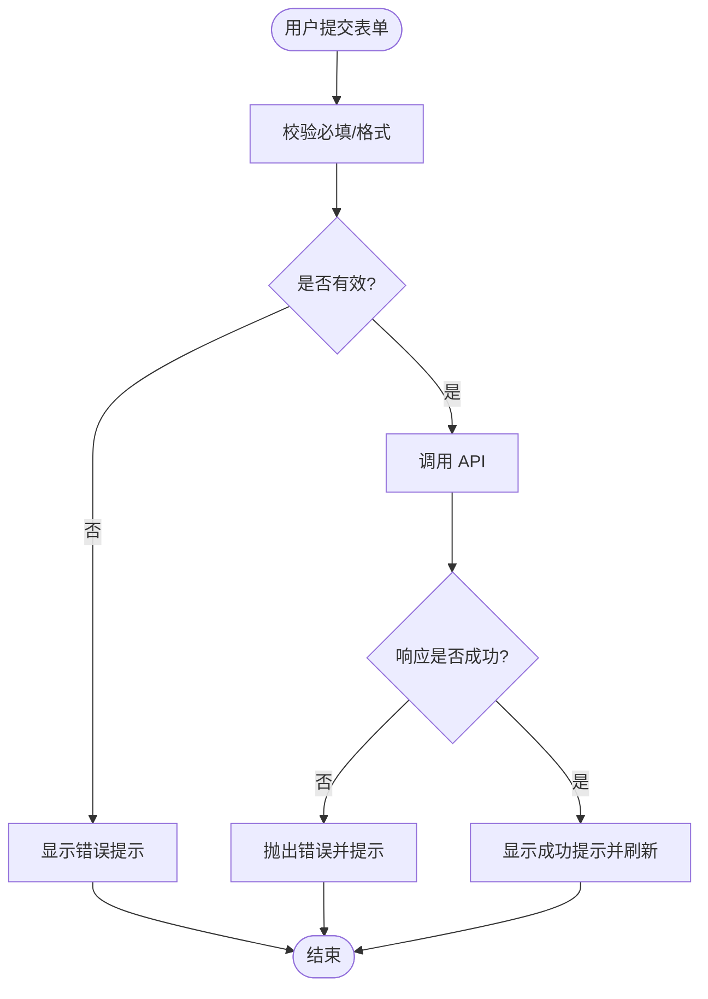
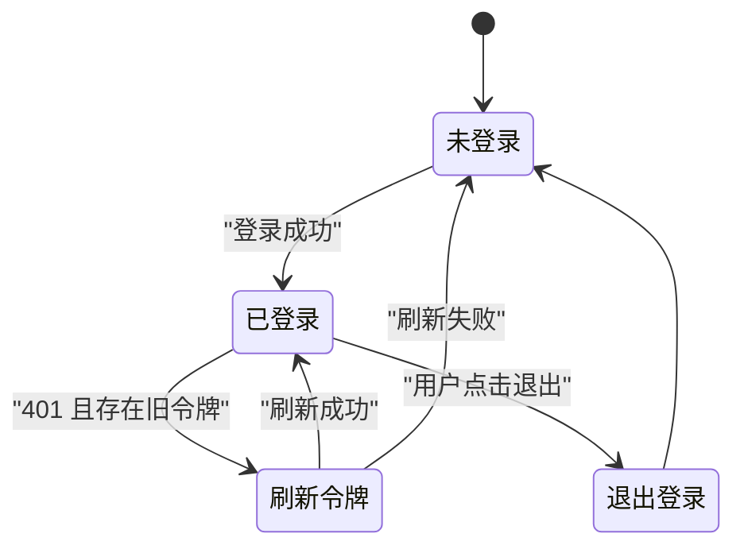
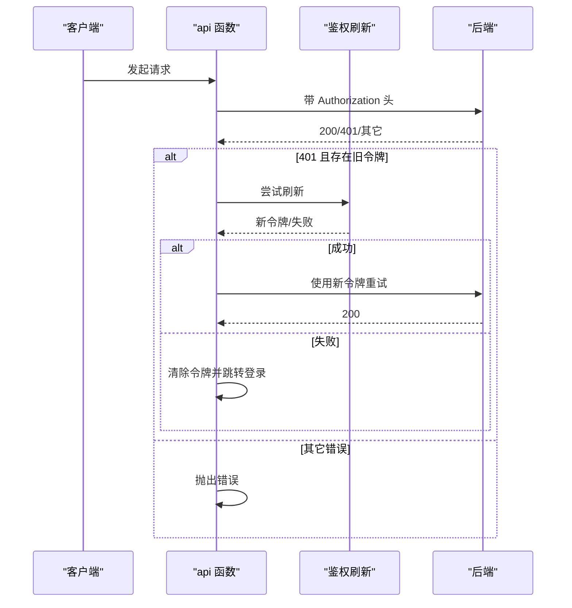
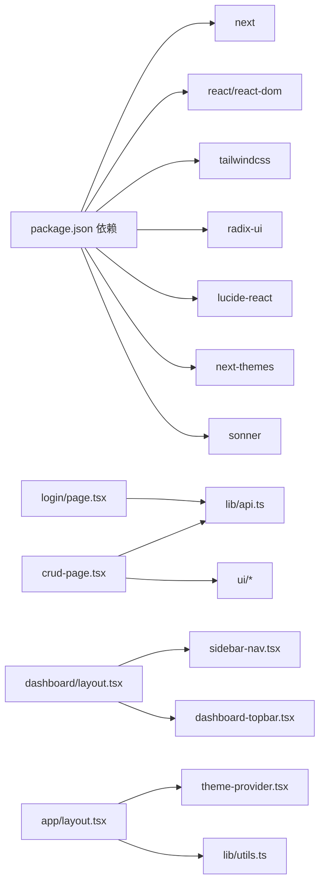

# 前端管理界面

<cite>
**本文引用的文件**
- [frontend/app/layout.tsx](file://frontend/app/layout.tsx)
- [frontend/app/(dashboard)/layout.tsx](file://frontend/app/(dashboard)/layout.tsx)
- [frontend/components/theme-provider.tsx](file://frontend/components/theme-provider.tsx)
- [frontend/lib/utils.ts](file://frontend/lib/utils.ts)
- [frontend/package.json](file://frontend/package.json)
- [frontend/components/crud-page.tsx](file://frontend/components/crud-page.tsx)
- [frontend/lib/api.ts](file://frontend/lib/api.ts)
- [frontend/components/sidebar-nav.tsx](file://frontend/components/sidebar-nav.tsx)
- [frontend/components/dashboard-topbar.tsx](file://frontend/components/dashboard-topbar.tsx)
- [frontend/components/auth-guard.tsx](file://frontend/components/auth-guard.tsx)
- [frontend/components/ui/button.tsx](file://frontend/components/ui/button.tsx)
- [frontend/components/ui/dialog.tsx](file://frontend/components/ui/dialog.tsx)
- [frontend/components/ui/table.tsx](file://frontend/components/ui/table.tsx)
- [frontend/app/login/page.tsx](file://frontend/app/login/page.tsx)
</cite>

## 目录
1. [简介](#简介)
2. [项目结构](#项目结构)
3. [核心组件](#核心组件)
4. [架构总览](#架构总览)
5. [组件详解](#组件详解)
6. [依赖关系分析](#依赖关系分析)
7. [性能考量](#性能考量)
8. [故障排查指南](#故障排查指南)
9. [结论](#结论)
10. [附录](#附录)

## 简介
本文件面向前端管理界面的使用者与维护者，系统性梳理基于 Next.js 的管理控制台架构与实现细节，涵盖页面路由与布局体系、组件设计模式（CRUD 页面、导航与表单）、状态管理策略（全局状态、本地状态与数据缓存）、用户交互设计（表单校验、错误处理与体验优化）、API 集成（请求封装、响应处理与错误处理）、主题系统与样式管理（Tailwind CSS 配置与组件样式定制），并提供组件使用示例与最佳实践。

## 项目结构
前端采用 Next.js App Router 的目录约定，页面按功能域组织在 app 目录下；UI 组件以可复用的原子化组件形式分布在 components/ui；业务组件如 CRUD 页面、导航与守卫等位于 components 根目录；工具函数与样式合并逻辑位于 lib 与公共 CSS；包管理与构建脚本位于 package.json。

**图表来源**
- [frontend/app/layout.tsx:1-40](file://frontend/app/layout.tsx#L1-L40)
- [frontend/app/(dashboard)/layout.tsx](file://frontend/app/(dashboard)/layout.tsx#L1-L34)
- [frontend/components/theme-provider.tsx:1-72](file://frontend/components/theme-provider.tsx#L1-L72)
- [frontend/lib/utils.ts:1-7](file://frontend/lib/utils.ts#L1-L7)
- [frontend/components/sidebar-nav.tsx:1-113](file://frontend/components/sidebar-nav.tsx#L1-L113)
- [frontend/components/dashboard-topbar.tsx:1-77](file://frontend/components/dashboard-topbar.tsx#L1-L77)
- [frontend/components/auth-guard.tsx:1-22](file://frontend/components/auth-guard.tsx#L1-L22)
- [frontend/components/crud-page.tsx:1-358](file://frontend/components/crud-page.tsx#L1-L358)
- [frontend/lib/api.ts:1-103](file://frontend/lib/api.ts#L1-L103)
- [frontend/components/ui/button.tsx:1-68](file://frontend/components/ui/button.tsx#L1-L68)
- [frontend/components/ui/dialog.tsx:1-169](file://frontend/components/ui/dialog.tsx#L1-L169)
- [frontend/components/ui/table.tsx:1-117](file://frontend/components/ui/table.tsx#L1-L117)
- [frontend/app/login/page.tsx:1-76](file://frontend/app/login/page.tsx#L1-L76)

**章节来源**
- [frontend/app/layout.tsx:1-40](file://frontend/app/layout.tsx#L1-L40)
- [frontend/app/(dashboard)/layout.tsx](file://frontend/app/(dashboard)/layout.tsx#L1-L34)
- [frontend/package.json:1-45](file://frontend/package.json#L1-L45)

## 核心组件
- 主题提供器：负责系统/浅色/深色主题切换与快捷键支持，结合 next-themes 实现。
- 路由守卫：在受保护区域检查令牌，未登录重定向至登录页。
- 仪表盘布局：包含侧边栏导航与顶部面包屑/用户菜单，承载业务页面内容。
- CRUD 页面：通用的数据增删改查容器，支持多种字段类型、异步选项、表格渲染与对话框表单。
- API 封装：统一处理鉴权头、刷新令牌、错误抛出与登录/登出流程。
- 登录页：基础表单登录，提交后跳转仪表盘。
- UI 原子组件：按钮、对话框、表格等，遵循变体与尺寸规范。

**章节来源**
- [frontend/components/theme-provider.tsx:1-72](file://frontend/components/theme-provider.tsx#L1-L72)
- [frontend/components/auth-guard.tsx:1-22](file://frontend/components/auth-guard.tsx#L1-L22)
- [frontend/app/(dashboard)/layout.tsx](file://frontend/app/(dashboard)/layout.tsx#L1-L34)
- [frontend/components/crud-page.tsx:1-358](file://frontend/components/crud-page.tsx#L1-L358)
- [frontend/lib/api.ts:1-103](file://frontend/lib/api.ts#L1-L103)
- [frontend/app/login/page.tsx:1-76](file://frontend/app/login/page.tsx#L1-L76)
- [frontend/components/ui/button.tsx:1-68](file://frontend/components/ui/button.tsx#L1-L68)
- [frontend/components/ui/dialog.tsx:1-169](file://frontend/components/ui/dialog.tsx#L1-L169)
- [frontend/components/ui/table.tsx:1-117](file://frontend/components/ui/table.tsx#L1-L117)

## 架构总览
整体采用“根布局 + 布局层 + 业务页面”的分层结构。根布局负责字体、主题与全局样式注入；仪表盘布局负责导航与权限守卫；业务页面通过 CRUD 组件或专用页面实现功能；UI 组件提供一致的交互与视觉语言；API 层集中处理认证与网络请求。

**图表来源**
- [frontend/app/layout.tsx:1-40](file://frontend/app/layout.tsx#L1-L40)
- [frontend/components/theme-provider.tsx:1-72](file://frontend/components/theme-provider.tsx#L1-L72)
- [frontend/lib/utils.ts:1-7](file://frontend/lib/utils.ts#L1-L7)
- [frontend/app/(dashboard)/layout.tsx](file://frontend/app/(dashboard)/layout.tsx#L1-L34)
- [frontend/components/auth-guard.tsx:1-22](file://frontend/components/auth-guard.tsx#L1-L22)
- [frontend/components/sidebar-nav.tsx:1-113](file://frontend/components/sidebar-nav.tsx#L1-L113)
- [frontend/components/dashboard-topbar.tsx:1-77](file://frontend/components/dashboard-topbar.tsx#L1-L77)
- [frontend/components/crud-page.tsx:1-358](file://frontend/components/crud-page.tsx#L1-L358)
- [frontend/lib/api.ts:1-103](file://frontend/lib/api.ts#L1-L103)
- [frontend/app/login/page.tsx:1-76](file://frontend/app/login/page.tsx#L1-L76)
- [frontend/components/ui/button.tsx:1-68](file://frontend/components/ui/button.tsx#L1-L68)
- [frontend/components/ui/dialog.tsx:1-169](file://frontend/components/ui/dialog.tsx#L1-L169)
- [frontend/components/ui/table.tsx:1-117](file://frontend/components/ui/table.tsx#L1-L117)

## 组件详解

### 主题系统与样式管理
- 字体与变量：根布局引入无衬线与等宽字体变量，统一注入 html 根元素。
- 主题提供器：基于 next-themes，默认跟随系统，禁用过渡动画，提供快捷键在浅/深主题间切换。
- 样式合并：工具函数整合 clsx 与 tailwind-merge，确保类名冲突最小化。
- UI 组件：按钮、对话框、表格等均采用变体与尺寸规范，保持一致的交互反馈。

**图表来源**
- [frontend/components/theme-provider.tsx:1-72](file://frontend/components/theme-provider.tsx#L1-L72)
- [frontend/lib/utils.ts:1-7](file://frontend/lib/utils.ts#L1-L7)
- [frontend/components/ui/button.tsx:1-68](file://frontend/components/ui/button.tsx#L1-L68)

**章节来源**
- [frontend/app/layout.tsx:1-40](file://frontend/app/layout.tsx#L1-L40)
- [frontend/components/theme-provider.tsx:1-72](file://frontend/components/theme-provider.tsx#L1-L72)
- [frontend/lib/utils.ts:1-7](file://frontend/lib/utils.ts#L1-L7)
- [frontend/components/ui/button.tsx:1-68](file://frontend/components/ui/button.tsx#L1-L68)

### 路由与布局体系
- 根布局：设置元数据、字体变量与主题包裹，保证全局一致性。
- 仪表盘布局：在受保护区域中渲染侧边栏与顶部栏，主内容区承载业务页面；底部集成全局通知组件。
- 路由守卫：在进入受保护区域时检查令牌，缺失则重定向至登录页。

**图表来源**
- [frontend/app/layout.tsx:1-40](file://frontend/app/layout.tsx#L1-L40)
- [frontend/app/(dashboard)/layout.tsx](file://frontend/app/(dashboard)/layout.tsx#L1-L34)
- [frontend/components/auth-guard.tsx:1-22](file://frontend/components/auth-guard.tsx#L1-L22)

**章节来源**
- [frontend/app/layout.tsx:1-40](file://frontend/app/layout.tsx#L1-L40)
- [frontend/app/(dashboard)/layout.tsx](file://frontend/app/(dashboard)/layout.tsx#L1-L34)
- [frontend/components/auth-guard.tsx:1-22](file://frontend/components/auth-guard.tsx#L1-L22)

### 导航组件
- 侧边栏导航：根据当前路径高亮活动项，支持折叠/展开；提供统一的图标与文案；点击退出登录触发登出并跳转。
- 顶部栏：展示面包屑与用户下拉菜单，下拉菜单包含退出登录入口。

**图表来源**
- [frontend/components/dashboard-topbar.tsx:1-77](file://frontend/components/dashboard-topbar.tsx#L1-L77)
- [frontend/components/sidebar-nav.tsx:1-113](file://frontend/components/sidebar-nav.tsx#L1-L113)
- [frontend/lib/api.ts:96-103](file://frontend/lib/api.ts#L96-L103)

**章节来源**
- [frontend/components/sidebar-nav.tsx:1-113](file://frontend/components/sidebar-nav.tsx#L1-L113)
- [frontend/components/dashboard-topbar.tsx:1-77](file://frontend/components/dashboard-topbar.tsx#L1-L77)
- [frontend/lib/api.ts:96-103](file://frontend/lib/api.ts#L96-L103)

### CRUD 页面组件
- 设计目标：以声明式字段定义驱动表格渲染、表单输入与对话框编辑，统一增删改查流程。
- 字段类型：文本、数字、多行文本、布尔、静态选择、异步选择（带缓存）；支持自定义输入组件。
- 表格渲染：隐藏列控制、布尔值可视化、异步选项回显、空态与骨架屏。
- 对话框表单：根据字段类型动态生成输入控件，支持占位符、描述、空值处理与数值转换。
- 删除确认：二次确认对话框，防止误操作。
- 数据加载与缓存：首次挂载加载列表；异步选择字段预取并缓存选项；nullable 字段自动添加“不选择”项。
- 回调与联动：保存后回调用于刷新其他视图或触发副作用。

**图表来源**
- [frontend/components/crud-page.tsx:1-358](file://frontend/components/crud-page.tsx#L1-L358)
- [frontend/lib/api.ts:34-78](file://frontend/lib/api.ts#L34-L78)

**章节来源**
- [frontend/components/crud-page.tsx:1-358](file://frontend/components/crud-page.tsx#L1-L358)

### 表单组件与交互设计
- 登录表单：用户名/密码输入、防抖提交、错误提示、加载态。
- 通用表单：按钮变体与尺寸、标签与描述、输入控件与开关、多选与异步选择。
- 错误处理：统一捕获异常并显示友好提示；401 自动跳转登录。
- 用户体验：骨架屏提升加载感知；对话框滚动与尺寸适配；快捷键切换主题。

**图表来源**
- [frontend/app/login/page.tsx:1-76](file://frontend/app/login/page.tsx#L1-L76)
- [frontend/components/ui/button.tsx:1-68](file://frontend/components/ui/button.tsx#L1-L68)
- [frontend/components/ui/dialog.tsx:1-169](file://frontend/components/ui/dialog.tsx#L1-L169)
- [frontend/components/ui/table.tsx:1-117](file://frontend/components/ui/table.tsx#L1-L117)
- [frontend/lib/api.ts:71-78](file://frontend/lib/api.ts#L71-L78)

**章节来源**
- [frontend/app/login/page.tsx:1-76](file://frontend/app/login/page.tsx#L1-L76)
- [frontend/components/ui/button.tsx:1-68](file://frontend/components/ui/button.tsx#L1-L68)
- [frontend/components/ui/dialog.tsx:1-169](file://frontend/components/ui/dialog.tsx#L1-L169)
- [frontend/components/ui/table.tsx:1-117](file://frontend/components/ui/table.tsx#L1-L117)

### 状态管理策略
- 全局状态
  - 访问令牌：存储于 sessionStorage，随请求自动附加 Authorization 头；401 时尝试刷新并持久化新令牌；仍失败则跳转登录。
  - 主题状态：由 next-themes 管理，支持系统跟随与快捷键切换。
- 本地状态
  - CRUD 页面内部状态：列表数据、编辑对象、对话框开关、加载/保存状态、删除目标。
  - 登录页状态：用户名、密码、错误消息、加载态。
- 数据缓存
  - 异步选择字段的选项缓存：字段 key → 选项数组，避免重复请求。
  - 列表数据：每次保存/删除后重新拉取，确保视图与后端一致。

**图表来源**
- [frontend/lib/api.ts:19-32](file://frontend/lib/api.ts#L19-L32)
- [frontend/lib/api.ts:34-78](file://frontend/lib/api.ts#L34-L78)
- [frontend/components/theme-provider.tsx:37-69](file://frontend/components/theme-provider.tsx#L37-L69)

**章节来源**
- [frontend/lib/api.ts:1-103](file://frontend/lib/api.ts#L1-L103)
- [frontend/components/theme-provider.tsx:1-72](file://frontend/components/theme-provider.tsx#L1-L72)

### API 集成
- 请求封装：统一 Content-Type、携带 Authorization 头、支持自定义请求头与凭据。
- 错误处理：非 200 抛出错误，优先使用后端 error 字段；401 时尝试刷新令牌；仍失败则清除令牌并跳转登录。
- 登录/登出：登录成功写入 access_token；登出主动调用后端接口并清理本地令牌。

**图表来源**
- [frontend/lib/api.ts:34-78](file://frontend/lib/api.ts#L34-L78)

**章节来源**
- [frontend/lib/api.ts:1-103](file://frontend/lib/api.ts#L1-L103)

## 依赖关系分析
- 依赖生态：Next.js 16、React 19、Tailwind CSS 4、Radix UI、Lucide React、Sonner、next-themes 等。
- 组件耦合：CRUD 页面与 UI 组件松耦合，通过 props 定义字段与行为；与 API 层通过函数调用解耦。
- 外部集成点：后端鉴权接口（登录/刷新/登出）、业务数据接口（GET/POST/DELETE）。

**图表来源**
- [frontend/package.json:14-44](file://frontend/package.json#L14-L44)
- [frontend/components/crud-page.tsx:1-358](file://frontend/components/crud-page.tsx#L1-L358)
- [frontend/lib/api.ts:1-103](file://frontend/lib/api.ts#L1-L103)
- [frontend/app/(dashboard)/layout.tsx](file://frontend/app/(dashboard)/layout.tsx#L1-L34)
- [frontend/components/sidebar-nav.tsx:1-113](file://frontend/components/sidebar-nav.tsx#L1-L113)
- [frontend/components/dashboard-topbar.tsx:1-77](file://frontend/components/dashboard-topbar.tsx#L1-L77)
- [frontend/app/layout.tsx:1-40](file://frontend/app/layout.tsx#L1-L40)
- [frontend/components/theme-provider.tsx:1-72](file://frontend/components/theme-provider.tsx#L1-L72)
- [frontend/lib/utils.ts:1-7](file://frontend/lib/utils.ts#L1-L7)

**章节来源**
- [frontend/package.json:1-45](file://frontend/package.json#L1-L45)

## 性能考量
- 骨架屏：列表加载时使用骨架屏减少感知延迟。
- 选项缓存：异步选择字段仅在挂载与对话框打开时请求一次，后续复用缓存。
- 最小化重绘：受控表单通过局部状态更新，避免不必要的父级重渲染。
- 主题切换：禁用过渡动画，降低频繁切换带来的视觉抖动。
- 资源加载：字体变量一次性注入，避免重复请求。

[本节为通用指导，无需特定文件引用]

## 故障排查指南
- 登录失败
  - 检查用户名/密码是否正确；查看错误提示；确认后端鉴权接口可用。
  - 参考：[登录页:18-30](file://frontend/app/login/page.tsx#L18-L30)，[登录 API:80-94](file://frontend/lib/api.ts#L80-L94)
- 401 未授权
  - 若出现 401，系统会尝试刷新令牌；若仍失败，将清除令牌并跳转登录。
  - 参考：[API 封装:51-69](file://frontend/lib/api.ts#L51-L69)
- 列表不更新
  - 保存/删除后需重新加载；确认回调 onAfterSave 是否被正确调用。
  - 参考：[CRUD 保存/删除流程:129-161](file://frontend/components/crud-page.tsx#L129-L161)
- 下拉选项为空
  - 检查异步选项 API 是否返回 items 数组；确认字段定义中的 valueKey/labelKey。
  - 参考：[异步选项加载:72-97](file://frontend/components/crud-page.tsx#L72-L97)
- 主题切换无效
  - 确认键盘快捷键未在输入框内触发；检查 next-themes 配置。
  - 参考：[主题热键:37-69](file://frontend/components/theme-provider.tsx#L37-L69)

**章节来源**
- [frontend/app/login/page.tsx:1-76](file://frontend/app/login/page.tsx#L1-L76)
- [frontend/lib/api.ts:51-69](file://frontend/lib/api.ts#L51-L69)
- [frontend/components/crud-page.tsx:72-97](file://frontend/components/crud-page.tsx#L72-L97)
- [frontend/components/theme-provider.tsx:37-69](file://frontend/components/theme-provider.tsx#L37-L69)

## 结论
该前端管理界面以 Next.js App Router 为基础，结合可复用 UI 组件与统一 API 封装，实现了清晰的路由与布局体系、可扩展的 CRUD 页面、完善的主题与样式管理以及健壮的鉴权与错误处理机制。通过本地状态与数据缓存策略，兼顾了开发效率与用户体验。

[本节为总结性内容，无需特定文件引用]

## 附录

### 组件使用示例与最佳实践
- 使用 CRUD 页面
  - 定义字段数组，指定类型与可选行为（如 nullable、placeholder、description）。
  - 为异步选择字段提供 API 路径与键映射。
  - 在保存/删除后回调中刷新其他视图或执行副作用。
  - 参考：[CRUD 页面:51-58](file://frontend/components/crud-page.tsx#L51-L58)
- 表单与校验
  - 在提交前进行前端校验；对必填字段与格式进行即时反馈。
  - 使用按钮变体与尺寸保持一致的交互语义。
  - 参考：[登录页表单:18-30](file://frontend/app/login/page.tsx#L18-L30)，[按钮组件:44-65](file://frontend/components/ui/button.tsx#L44-L65)
- 主题与样式
  - 使用工具函数合并类名，避免冲突；遵循变体与尺寸规范。
  - 通过主题提供器统一管理明暗主题与快捷键。
  - 参考：[工具函数:4-6](file://frontend/lib/utils.ts#L4-L6)，[主题提供器:6-22](file://frontend/components/theme-provider.tsx#L6-L22)
- API 调用
  - 统一通过 api 函数发起请求；利用内置的鉴权头与错误处理。
  - 登录成功后写入令牌；登出时清理令牌并跳转登录。
  - 参考：[API 封装:34-78](file://frontend/lib/api.ts#L34-L78)，[登录/登出:80-103](file://frontend/lib/api.ts#L80-L103)

**章节来源**
- [frontend/components/crud-page.tsx:51-58](file://frontend/components/crud-page.tsx#L51-L58)
- [frontend/app/login/page.tsx:18-30](file://frontend/app/login/page.tsx#L18-L30)
- [frontend/components/ui/button.tsx:44-65](file://frontend/components/ui/button.tsx#L44-L65)
- [frontend/lib/utils.ts:4-6](file://frontend/lib/utils.ts#L4-L6)
- [frontend/components/theme-provider.tsx:6-22](file://frontend/components/theme-provider.tsx#L6-L22)
- [frontend/lib/api.ts:34-78](file://frontend/lib/api.ts#L34-L78)
- [frontend/lib/api.ts:80-103](file://frontend/lib/api.ts#L80-L103)