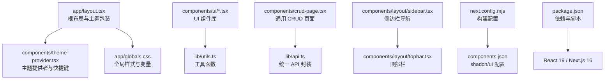
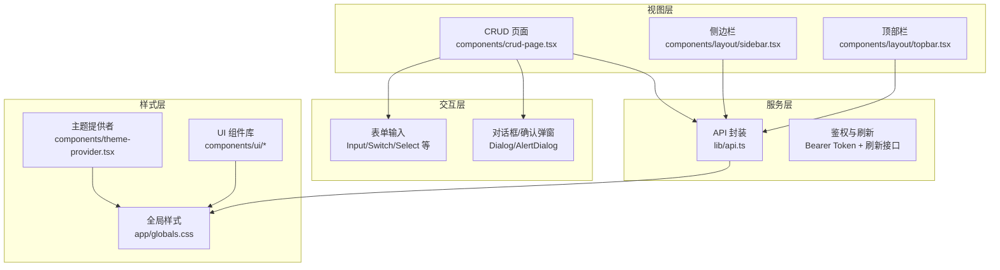
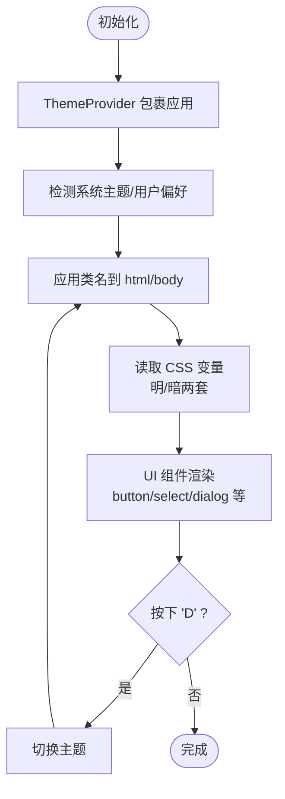
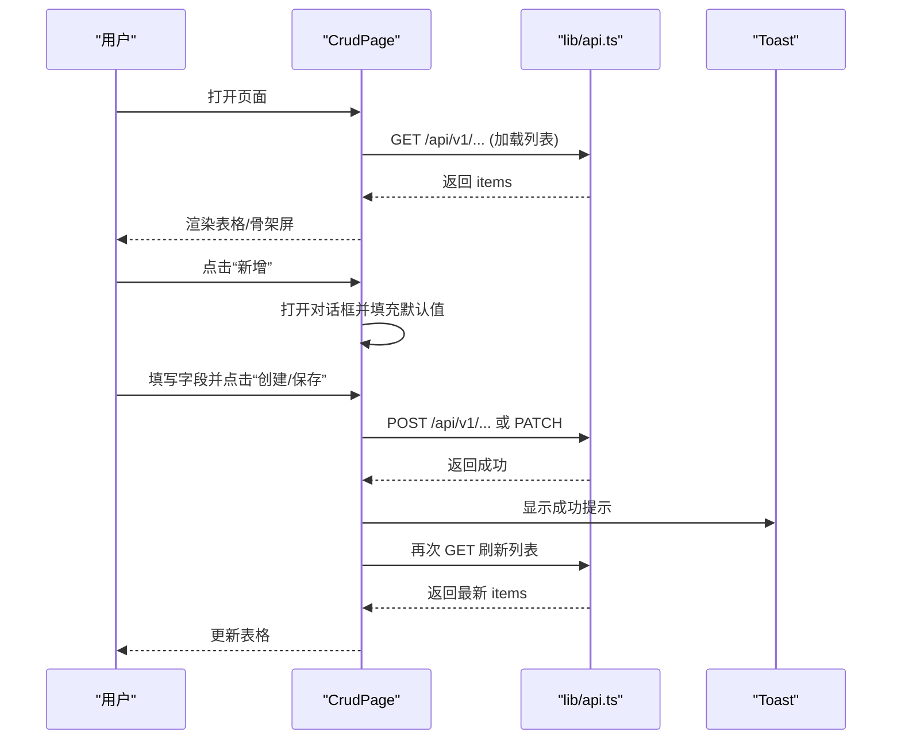
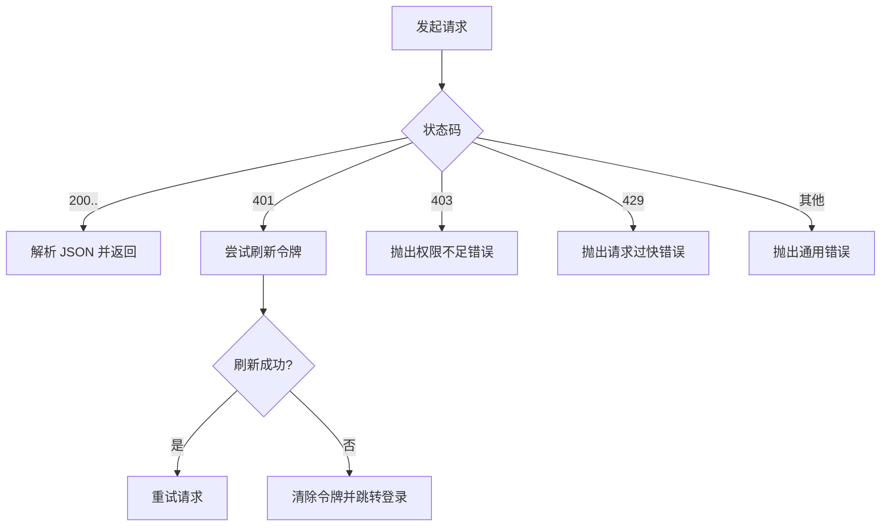
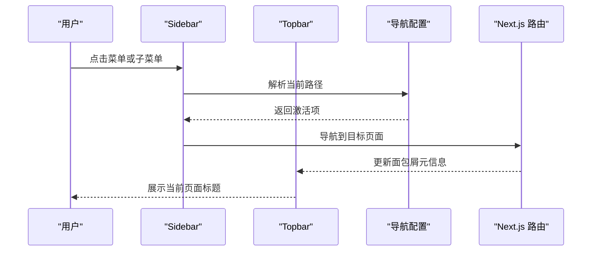
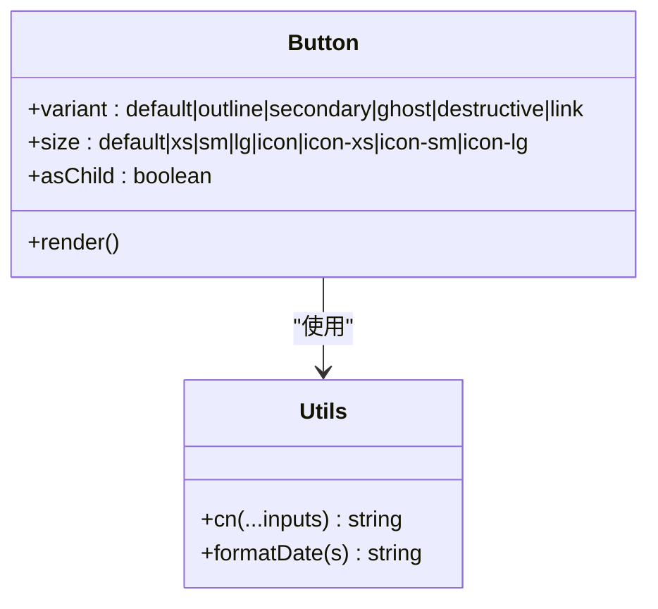
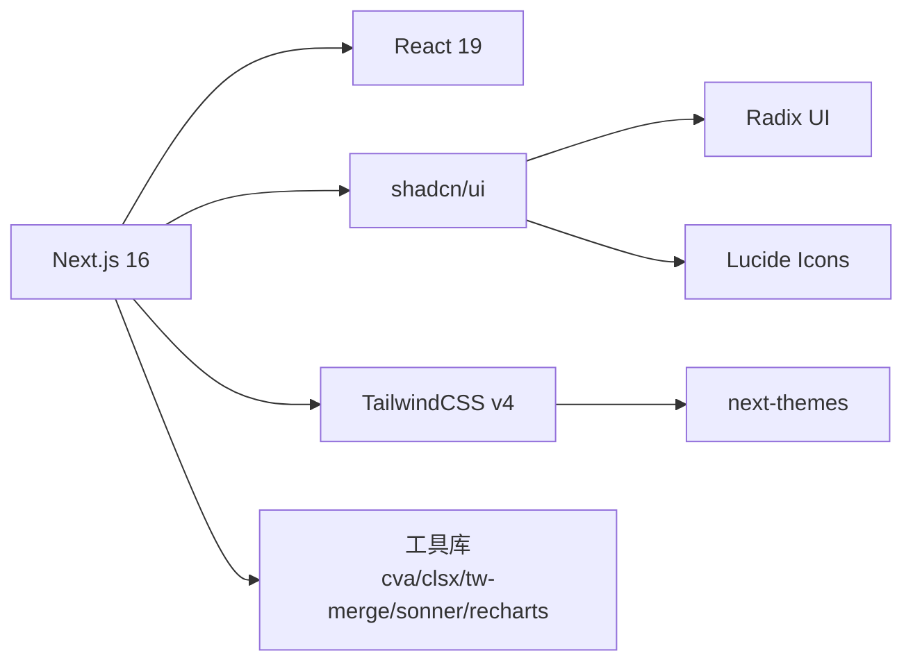

# 前端管理界面

<cite>
**本文引用的文件**
- [package.json](file://frontend/package.json)
- [next.config.mjs](file://frontend/next.config.mjs)
- [components.json](file://frontend/components.json)
- [app/layout.tsx](file://frontend/app/layout.tsx)
- [components/theme-provider.tsx](file://frontend/components/theme-provider.tsx)
- [app/globals.css](file://frontend/app/globals.css)
- [lib/utils.ts](file://frontend/lib/utils.ts)
- [components/ui/button.tsx](file://frontend/components/ui/button.tsx)
- [components/crud-page.tsx](file://frontend/components/crud-page.tsx)
- [lib/api.ts](file://frontend/lib/api.ts)
- [components/layout/sidebar.tsx](file://frontend/components/layout/sidebar.tsx)
- [components/layout/topbar.tsx](file://frontend/components/layout/topbar.tsx)
</cite>

> **模块概述**
> 前端管理界面基于 Next.js 16 + React 19 + shadcn/ui + TailwindCSS 构建，采用分层架构：视图层（App Router 页面与组件）、交互层（表单/对话框/确认弹窗）、服务层（API 封装与鉴权）、样式层（TailwindCSS 变量与主题系统）。本文档集按子系统组织，涵盖架构设计、组件模式、状态管理、API 集成与用户交互设计。

> **子页面分类索引**

### 一、Next.js 架构设计
涵盖前端整体架构、布局体系、认证流程与页面生命周期。

- [Next.js 架构设计](./Next.js%20架构设计/Next.js%20架构设计.md) — App Router 分层架构、根布局与仪表板布局、主题与权限体系概述。
- [登录流程与鉴权机制](./Next.js%20架构设计/登录流程与鉴权机制.md) — JWT 认证体系、短期访问令牌与长期刷新令牌、RBAC 权限控制、暴力破解防护与会话管理。
- [根布局与主题系统](./Next.js%20架构设计/根布局与主题系统.md) — 根布局实现、next-themes 主题切换、Tailwind CSS v4 变量系统、字体加载与 shadcn/ui 组件库。
- [页面生命周期与渲染策略](./Next.js%20架构设计/页面生命周期与渲染策略.md) — 首页重定向、仪表板数据定时刷新、动态路由参数、认证守卫与客户端状态管理。
- [仪表板布局与导航](./Next.js%20架构设计/仪表板布局与导航.md) — 仪表板壳层、侧边栏导航高亮、顶部栏面包屑、响应式布局与权限守卫集成。

### 二、组件设计模式
聚焦 UI 组件体系、可复用 CRUD 模式与导航组件设计。

- [组件设计模式](./组件设计模式/组件设计模式.md) — 原子化组件理念、CRUD 页面组件、对话框与导航组件的体系化设计指南。
- [UI 原子组件模式](./组件设计模式/UI%20原子组件模式.md) — shadcn/ui 基础组件（Button、Card、Input、Dialog、Table 等）的变体系统与 CVA 样式继承。
- [CRUD 页面组件](./组件设计模式/CRUD%20页面组件.md) — 字段定义驱动渲染（FieldDef）、异步选项缓存、表单自动适配与完整增删改查流程。
- [对话框组件](./组件设计模式/对话框组件.md) — 模态对话框体系：通用 Dialog、AlertDialog、业务对话框（AddSiteDialog、ProtectionModeDialog）。
- [导航组件](./组件设计模式/导航组件.md) — 侧边栏与顶部栏导航、集中式配置管理（console.ts）、路由元数据与智能高亮。

### 三、主题与样式
- [主题系统与样式](./主题系统与样式.md) — next-themes 主题提供者、oklch 调色板、@theme 变量、响应式断点与样式组织策略。

### 四、状态与数据管理
- [状态管理策略](./状态管理策略.md) — 全局状态（主题/认证/配置）、本地状态（表单/对话框）、响应缓存与快照缓存、状态同步与持久化。
- [API 集成](./API%20集成.md) — 统一 API 封装（401 自动刷新/重试）、JWT 鉴权、分页与缓存、WebSocket/SSE 实时通信。

### 五、用户体验设计
- [用户交互设计](./用户交互设计.md) — 表单验证与实时反馈、错误处理策略、加载/空状态/成功反馈、交互模式与无障碍访问支持。

## 目录
1. [简介](#简介)
2. [项目结构](#项目结构)
3. [核心组件](#核心组件)
4. [架构总览](#架构总览)
5. [详细组件分析](#详细组件分析)
6. [依赖分析](#依赖分析)
7. [性能考虑](#性能考虑)
8. [故障排查指南](#故障排查指南)
9. [结论](#结论)
10. [附录](#附录)

## 简介
本文件面向 My-OpenWaf 前端管理界面的开发者，系统化梳理基于 Next.js 16 + React 19 的前端架构与组件组织，重点覆盖以下方面：
- 基于 shadcn/ui 的组件库使用与自定义主题系统
- 状态管理策略（本地状态、对话框与确认弹窗）
- API 集成模式（统一请求封装、鉴权与错误处理）
- 用户交互设计原则（导航、表单、表格、提示）
- 组件开发指南、样式定制方法与性能优化建议

## 项目结构
前端位于 frontend 目录，采用 App Router 结构，按功能域划分页面与组件，配合 shadcn/ui 与 TailwindCSS 实现一致的视觉与交互体验。

**图表来源**
- [app/layout.tsx:1-28](file://frontend/app/layout.tsx#L1-L28)
- [components/theme-provider.tsx:1-72](file://frontend/components/theme-provider.tsx#L1-L72)
- [app/globals.css:1-189](file://frontend/app/globals.css#L1-L189)
- [lib/utils.ts:1-18](file://frontend/lib/utils.ts#L1-L18)
- [components/crud-page.tsx:1-359](file://frontend/components/crud-page.tsx#L1-L359)
- [lib/api.ts:1-925](file://frontend/lib/api.ts#L1-L925)
- [components/layout/sidebar.tsx:1-167](file://frontend/components/layout/sidebar.tsx#L1-L167)
- [components/layout/topbar.tsx:1-90](file://frontend/components/layout/topbar.tsx#L1-L90)
- [next.config.mjs:1-12](file://frontend/next.config.mjs#L1-L12)
- [components.json:1-26](file://frontend/components.json#L1-L26)
- [package.json:1-45](file://frontend/package.json#L1-L45)

**章节来源**
- [package.json:1-45](file://frontend/package.json#L1-L45)
- [next.config.mjs:1-12](file://frontend/next.config.mjs#L1-L12)
- [components.json:1-26](file://frontend/components.json#L1-L26)
- [app/layout.tsx:1-28](file://frontend/app/layout.tsx#L1-L28)
- [app/globals.css:1-189](file://frontend/app/globals.css#L1-L189)

## 核心组件
- 主题系统与快捷键切换：通过 next-themes 提供深浅色主题与系统跟随能力，并提供“D”键快速切换。
- UI 组件库：基于 shadcn/ui，使用 cva 定义变体，结合 radix-ui 与 lucide-react。
- 通用 CRUD 页面：提供统一的增删改查、异步下拉选项、加载骨架屏与 Toast 提示。
- API 封装：统一构建请求头、处理 401/403/429 等错误、自动刷新令牌与跳转登录。
- 导航与布局：侧边栏支持折叠、子菜单展开与高亮；顶部栏展示面包屑与用户菜单。

**章节来源**
- [components/theme-provider.tsx:1-72](file://frontend/components/theme-provider.tsx#L1-L72)
- [components/ui/button.tsx:1-68](file://frontend/components/ui/button.tsx#L1-L68)
- [components/crud-page.tsx:1-359](file://frontend/components/crud-page.tsx#L1-L359)
- [lib/api.ts:1-925](file://frontend/lib/api.ts#L1-L925)
- [components/layout/sidebar.tsx:1-167](file://frontend/components/layout/sidebar.tsx#L1-L167)
- [components/layout/topbar.tsx:1-90](file://frontend/components/layout/topbar.tsx#L1-L90)

## 架构总览
前端采用分层架构：
- 视图层：App Router 页面与组件（如 CRUD 页面、导航组件）
- 交互层：表单、对话框、确认弹窗等交互逻辑
- 服务层：API 封装与鉴权（令牌管理、刷新、错误处理）
- 样式层：TailwindCSS 变量、shadcn/ui 组件与自定义层

**图表来源**
- [components/crud-page.tsx:1-359](file://frontend/components/crud-page.tsx#L1-L359)
- [components/layout/sidebar.tsx:1-167](file://frontend/components/layout/sidebar.tsx#L1-L167)
- [components/layout/topbar.tsx:1-90](file://frontend/components/layout/topbar.tsx#L1-L90)
- [lib/api.ts:1-925](file://frontend/lib/api.ts#L1-L925)
- [app/globals.css:1-189](file://frontend/app/globals.css#L1-L189)
- [components/theme-provider.tsx:1-72](file://frontend/components/theme-provider.tsx#L1-L72)
- [components/ui/button.tsx:1-68](file://frontend/components/ui/button.tsx#L1-L68)

## 详细组件分析

### 主题系统与样式定制
- 主题提供者：使用 next-themes，默认跟随系统，禁用过渡动画以避免水合闪烁问题，并提供“D”键快速切换深浅色。
- 全局样式：通过 Tailwind 的 @theme inline 定义 CSS 变量，支持明暗两套颜色体系；自定义组件层（base/components）用于统一面板、玻璃态、徽标等视觉元素。
- shadcn/ui 配置：RSC 模式、Radix Nova 风格、Lucide 图标库、别名映射到 @/components、@/lib、@/hooks。

**图表来源**
- [components/theme-provider.tsx:1-72](file://frontend/components/theme-provider.tsx#L1-L72)
- [app/globals.css:1-189](file://frontend/app/globals.css#L1-L189)
- [components.json:1-26](file://frontend/components.json#L1-L26)

**章节来源**
- [components/theme-provider.tsx:1-72](file://frontend/components/theme-provider.tsx#L1-L72)
- [app/globals.css:1-189](file://frontend/app/globals.css#L1-L189)
- [components.json:1-26](file://frontend/components.json#L1-L26)

### 通用 CRUD 页面组件
- 设计目标：以声明式字段定义驱动表单与表格渲染，支持文本、数字、布尔、选择、异步选择、自定义输入等类型。
- 关键能力：
  - 异步下拉选项：在首次渲染时拉取远端数据并缓存，支持空值占位。
  - 表格渲染：隐藏列控制、渲染钩子、布尔值友好文案。
  - 对话框与确认弹窗：统一的新增/编辑与删除流程。
  - 加载与空状态：骨架屏与空状态组件提升可用性。
  - 成功/失败提示：使用 toast 提示用户操作结果。
- 生命周期：挂载时加载数据；保存/删除后刷新列表；支持保存中状态。

**图表来源**
- [components/crud-page.tsx:1-359](file://frontend/components/crud-page.tsx#L1-L359)
- [lib/api.ts:1-925](file://frontend/lib/api.ts#L1-L925)

**章节来源**
- [components/crud-page.tsx:1-359](file://frontend/components/crud-page.tsx#L1-L359)

### API 集成与鉴权
- 统一请求封装：自动添加 Content-Type、Authorization（Bearer）、credentials（包含会话）。
- 鉴权与刷新：401 时尝试刷新令牌，刷新成功后重试；刷新失败则跳转登录页。
- 错误处理：403、429、非 2xx 统一抛错并提取错误信息；204 返回 undefined。
- 登录/登出：登录成功写入本地令牌；登出调用后端接口并清除令牌。

**图表来源**
- [lib/api.ts:1-925](file://frontend/lib/api.ts#L1-L925)

**章节来源**
- [lib/api.ts:1-925](file://frontend/lib/api.ts#L1-L925)

### 导航与布局
- 侧边栏：支持折叠、子菜单展开、当前路径高亮、禁用项屏蔽；提供“退出登录”入口。
- 顶部栏：面包屑根据当前路由元信息生成；用户菜单提供登出。
- 路由与图标：导航项来源于集中配置，支持多级菜单与精确/前缀匹配。

**图表来源**
- [components/layout/sidebar.tsx:1-167](file://frontend/components/layout/sidebar.tsx#L1-L167)
- [components/layout/topbar.tsx:1-90](file://frontend/components/layout/topbar.tsx#L1-L90)

**章节来源**
- [components/layout/sidebar.tsx:1-167](file://frontend/components/layout/sidebar.tsx#L1-L167)
- [components/layout/topbar.tsx:1-90](file://frontend/components/layout/topbar.tsx#L1-L90)

### UI 组件与样式工具
- Button 组件：通过 cva 定义 variant/size 变体，支持 asChild、Slot Root、图标尺寸适配与焦点环。
- 工具函数：cn 合并类名，formatDate 格式化时间字符串。

**图表来源**
- [components/ui/button.tsx:1-68](file://frontend/components/ui/button.tsx#L1-L68)
- [lib/utils.ts:1-18](file://frontend/lib/utils.ts#L1-L18)

**章节来源**
- [components/ui/button.tsx:1-68](file://frontend/components/ui/button.tsx#L1-L68)
- [lib/utils.ts:1-18](file://frontend/lib/utils.ts#L1-L18)

## 依赖分析
- 运行时框架：Next.js 16、React 19（客户端组件）
- UI 组件库：shadcn/ui（RSC 模式）、Radix UI、Lucide 图标
- 样式与主题：TailwindCSS v4、next-themes、自定义 CSS 变量
- 工具库：class-variance-authority、clsx、tailwind-merge、sonner、recharts

**图表来源**
- [package.json:1-45](file://frontend/package.json#L1-L45)
- [next.config.mjs:1-12](file://frontend/next.config.mjs#L1-L12)
- [components.json:1-26](file://frontend/components.json#L1-L26)

**章节来源**
- [package.json:1-45](file://frontend/package.json#L1-L45)
- [next.config.mjs:1-12](file://frontend/next.config.mjs#L1-L12)
- [components.json:1-26](file://frontend/components.json#L1-L26)

## 性能考虑
- 构建输出：静态导出（export），distDir 指向 out，尾斜杠开启，图片未优化以适配静态托管。
- 样式体积：按需引入 shadcn/ui 组件，避免全局重样式；合理使用 CSS 变量减少重复定义。
- 交互反馈：骨架屏与空状态提升感知速度；Toast 提示及时反馈操作结果。
- 数据加载：CRUD 页面仅在需要时拉取异步选项；列表加载完成后一次性渲染，避免频繁重排。
- 主题切换：禁用过渡动画以减少首屏抖动；键盘快捷键切换主题避免多余渲染。

**章节来源**
- [next.config.mjs:1-12](file://frontend/next.config.mjs#L1-L12)
- [app/globals.css:1-189](file://frontend/app/globals.css#L1-L189)
- [components/theme-provider.tsx:1-72](file://frontend/components/theme-provider.tsx#L1-L72)
- [components/crud-page.tsx:1-359](file://frontend/components/crud-page.tsx#L1-L359)

## 故障排查指南
- 登录/会话问题
  - 现象：401 未授权
  - 处理：自动尝试刷新令牌；刷新失败则清除令牌并跳转登录页
  - 参考：[lib/api.ts:37-99](file://frontend/lib/api.ts#L37-L99)
- 权限不足
  - 现象：403
  - 处理：抛出错误并提示权限不足
  - 参考：[lib/api.ts:101-104](file://frontend/lib/api.ts#L101-L104)
- 请求过于频繁
  - 现象：429
  - 处理：抛出错误并提示请求过快
  - 参考：[lib/api.ts:106-109](file://frontend/lib/api.ts#L106-L109)
- 网络异常/非 2xx
  - 现象：其他错误
  - 处理：解析错误体或回退为 HTTP 状态码
  - 参考：[lib/api.ts:111-121](file://frontend/lib/api.ts#L111-L121)
- 主题切换无效
  - 现象：按下 D 无反应
  - 处理：确保未在输入框内；检查键盘事件监听是否被阻止
  - 参考：[components/theme-provider.tsx:37-69](file://frontend/components/theme-provider.tsx#L37-L69)
- CRUD 页面空白或加载失败
  - 现象：表格为空或骨架屏持续
  - 处理：检查 API 返回结构与字段映射；确认异步选项是否正确拉取
  - 参考：[components/crud-page.tsx:67-111](file://frontend/components/crud-page.tsx#L67-L111)

**章节来源**
- [lib/api.ts:1-925](file://frontend/lib/api.ts#L1-L925)
- [components/theme-provider.tsx:1-72](file://frontend/components/theme-provider.tsx#L1-L72)
- [components/crud-page.tsx:1-359](file://frontend/components/crud-page.tsx#L1-L359)

## 结论
该前端管理界面以 Next.js 16 + React 19 为基础，结合 shadcn/ui 与 TailwindCSS 实现了统一的主题与组件风格；通过统一的 API 封装与鉴权流程保障了安全性与一致性；通用 CRUD 页面提升了开发效率与用户体验。建议在后续迭代中继续完善导航元信息、国际化与可访问性支持，并对关键交互增加更细粒度的状态管理与缓存策略。

## 附录
- 组件开发指南
  - 使用 cva 定义组件变体，保持一致的尺寸与状态映射
  - 在 CRUD 页面中优先使用字段定义驱动渲染，减少样板代码
  - 对外链与受控输入进行必要的校验与转换
- 样式定制方法
  - 通过 CSS 变量统一颜色与半径；在明/暗主题下分别维护变量
  - 使用 @layer components 定义业务组件的通用样式
- 性能优化技巧
  - 静态导出与图片未优化以适配静态托管
  - 骨架屏与空状态提升感知速度
  - 避免不必要的 re-render，合理拆分组件与使用 memo