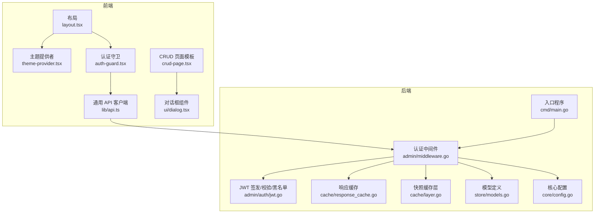
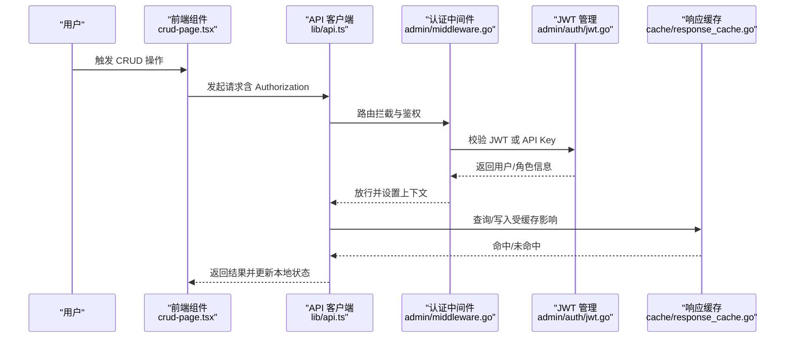
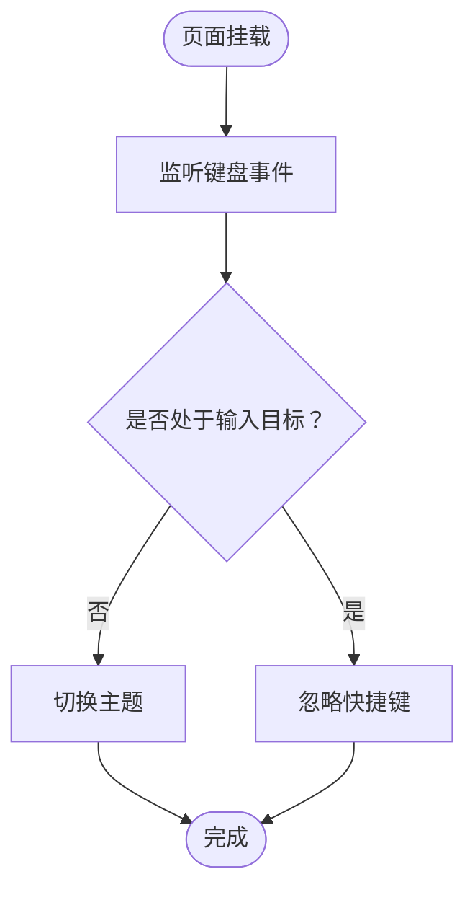
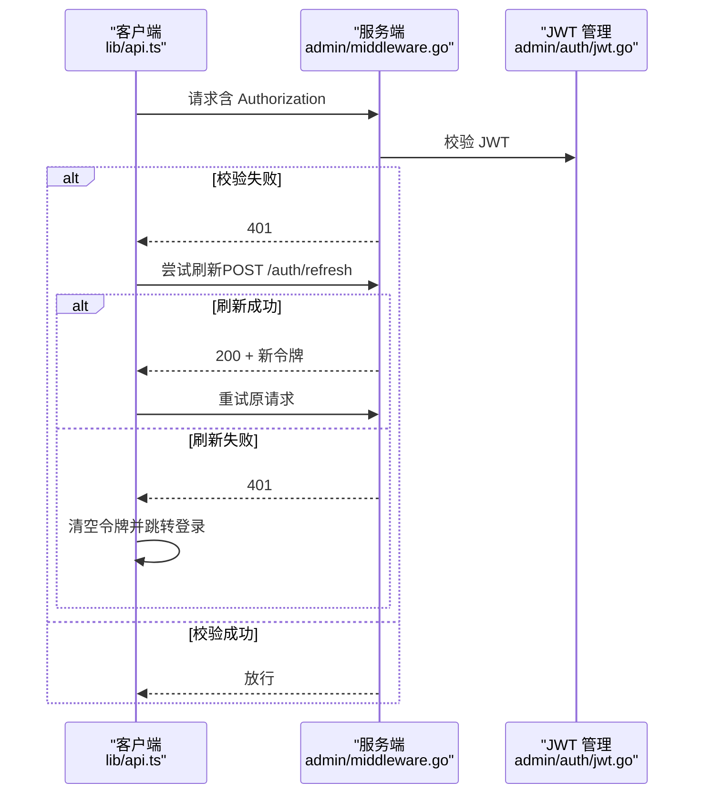
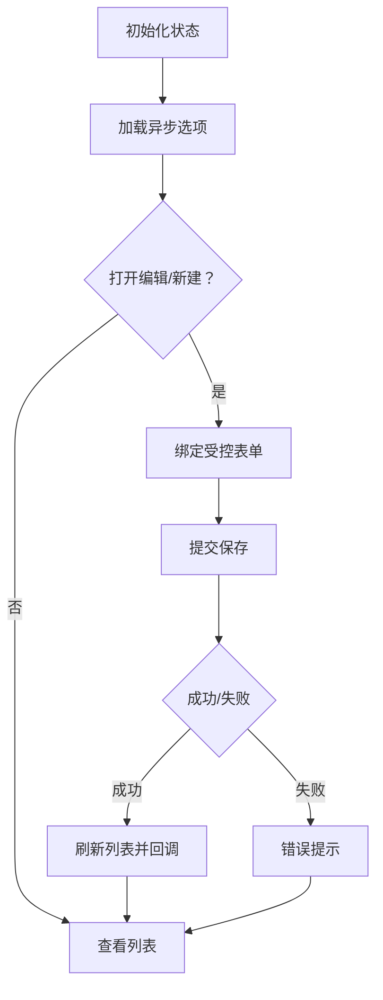
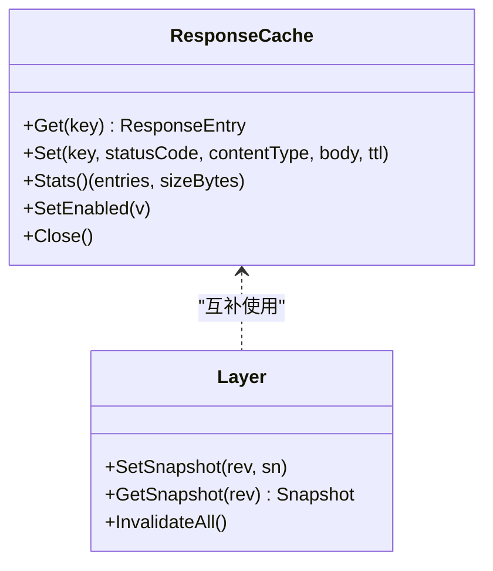
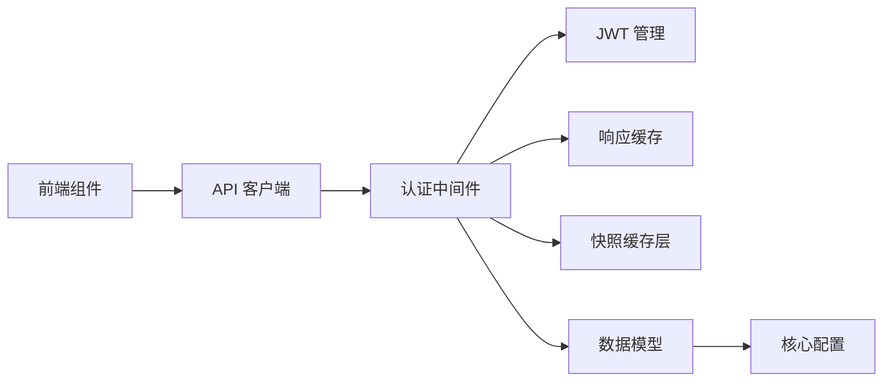

# 状态管理策略

<cite>
**本文引用的文件**
- [main.go](file://cmd/main.go)
- [theme-provider.tsx](file://frontend/components/theme-provider.tsx)
- [layout.tsx](file://frontend/app/layout.tsx)
- [api.ts](file://frontend/lib/api.ts)
- [auth-guard.tsx](file://frontend/components/auth-guard.tsx)
- [dialog.tsx](file://frontend/components/ui/dialog.tsx)
- [crud-page.tsx](file://frontend/components/crud-page.tsx)
- [middleware.go](file://internal/admin/middleware.go)
- [jwt.go](file://internal/admin/auth/jwt.go)
- [response_cache.go](file://internal/cache/response_cache.go)
- [layer.go](file://internal/cache/layer.go)
- [models.go](file://internal/store/models.go)
- [config.go](file://internal/core/config.go)
</cite>

## 目录
1. [引言](#引言)
2. [项目结构](#项目结构)
3. [核心组件](#核心组件)
4. [架构总览](#架构总览)
5. [详细组件分析](#详细组件分析)
6. [依赖分析](#依赖分析)
7. [性能考虑](#性能考虑)
8. [故障排查指南](#故障排查指南)
9. [结论](#结论)
10. [附录](#附录)

## 引言
本文件系统性梳理 My-OpenWAF 的状态管理策略，覆盖以下方面：
- 全局状态：主题状态、用户认证状态、应用配置状态
- 本地状态：表单状态、对话框状态、组件内部状态
- 数据缓存：查询缓存、响应缓存、离线数据处理
- 状态同步：实时更新与冲突解决
- 状态持久化：本地存储与会话管理
- 最佳实践与性能优化建议

目标是帮助开发者在不直接阅读源码的情况下，也能快速理解并正确使用与扩展状态管理。

## 项目结构
前端采用 Next.js App Router 架构，全局主题通过 Provider 注入；后端为 Go 服务，提供管理 API 与中间件链路。状态管理涉及前端 React 组件状态、认证令牌与会话、以及后端缓存层。

**图示来源**
- [layout.tsx:23-39](file://frontend/app/layout.tsx#L23-L39)
- [theme-provider.tsx:6-22](file://frontend/components/theme-provider.tsx#L6-L22)
- [auth-guard.tsx:7-39](file://frontend/components/auth-guard.tsx#L7-L39)
- [api.ts:31-88](file://frontend/lib/api.ts#L31-L88)
- [dialog.tsx:10-86](file://frontend/components/ui/dialog.tsx#L10-L86)
- [crud-page.tsx:60-338](file://frontend/components/crud-page.tsx#L60-L338)
- [main.go:7-9](file://cmd/main.go#L7-L9)
- [middleware.go:18-72](file://internal/admin/middleware.go#L18-L72)
- [jwt.go:44-135](file://internal/admin/auth/jwt.go#L44-L135)
- [response_cache.go:27-54](file://internal/cache/response_cache.go#L27-L54)
- [layer.go:19-65](file://internal/cache/layer.go#L19-L65)
- [models.go:150-190](file://internal/store/models.go#L150-L190)
- [config.go:75-102](file://internal/core/config.go#L75-L102)

**章节来源**
- [layout.tsx:23-39](file://frontend/app/layout.tsx#L23-L39)
- [main.go:7-9](file://cmd/main.go#L7-L9)

## 核心组件
- 前端主题与认证
  - 主题提供者负责系统级主题切换与快捷键支持，并通过全局布局注入。
  - 认证守卫在路由层检查访问令牌，未登录或会话过期时重定向至登录页。
  - 通用 API 客户端封装请求头、鉴权、刷新令牌、错误处理与状态码映射。
- 后端中间件与认证
  - 认证中间件支持 Bearer JWT 与 API Key，白名单路径放行，JWT 支持密钥轮换与黑名单。
  - 要求角色中间件按 RBAC 角色过滤权限。
- 缓存层
  - 响应缓存：内存分片 + LRU 风格淘汰，带 TTL 与后台清理。
  - 快照缓存层：进程内 ristretto 缓存，用于不可变配置快照，跨节点通过 Redis Pub/Sub 同步触发数据库重载。
- 数据模型与配置
  - 模型涵盖站点、策略、规则、系统设置、会话、令牌黑名单等，支撑状态持久化与权限控制。
  - 核心配置从环境变量加载，包含数据库、Redis、CVE、Bot、Drop 等运行参数。

**章节来源**
- [theme-provider.tsx:6-22](file://frontend/components/theme-provider.tsx#L6-L22)
- [auth-guard.tsx:7-39](file://frontend/components/auth-guard.tsx#L7-L39)
- [api.ts:31-88](file://frontend/lib/api.ts#L31-L88)
- [middleware.go:18-72](file://internal/admin/middleware.go#L18-L72)
- [jwt.go:44-135](file://internal/admin/auth/jwt.go#L44-L135)
- [response_cache.go:27-54](file://internal/cache/response_cache.go#L27-L54)
- [layer.go:19-65](file://internal/cache/layer.go#L19-L65)
- [models.go:150-190](file://internal/store/models.go#L150-L190)
- [config.go:113-182](file://internal/core/config.go#L113-L182)

## 架构总览
下图展示从前端到后端的关键状态流转：用户交互触发组件状态变更，API 客户端统一处理认证与错误，后端中间件进行鉴权与日志，缓存层提升读取性能，最终写入数据库或发布订阅同步。

**图示来源**
- [crud-page.tsx:99-148](file://frontend/components/crud-page.tsx#L99-L148)
- [api.ts:31-88](file://frontend/lib/api.ts#L31-L88)
- [middleware.go:18-72](file://internal/admin/middleware.go#L18-L72)
- [jwt.go:113-135](file://internal/admin/auth/jwt.go#L113-L135)
- [response_cache.go:78-122](file://internal/cache/response_cache.go#L78-L122)

## 详细组件分析

### 全局状态：主题状态
- 设计要点
  - 使用 next-themes 提供系统主题能力，默认“跟随系统”，禁用过渡动画以避免闪烁。
  - 提供快捷键切换深浅主题，同时避免在输入框内触发。
  - 在根布局中注入 Provider，确保全站生效。
- 关键行为
  - 键盘事件监听仅在非编辑目标时生效。
  - 主题切换通过上下文钩子更新，无需刷新页面。
- 可扩展性
  - 可增加自定义主题集合与持久化策略（如 localStorage）。

**图示来源**
- [theme-provider.tsx:37-69](file://frontend/components/theme-provider.tsx#L37-L69)

**章节来源**
- [theme-provider.tsx:6-22](file://frontend/components/theme-provider.tsx#L6-L22)
- [layout.tsx:23-39](file://frontend/app/layout.tsx#L23-L39)

### 全局状态：用户认证状态
- 前端
  - 访问令牌存储于模块闭包，避免 XSS 风险；刷新令牌使用 HttpOnly Cookie。
  - API 客户端在 401 时尝试刷新，失败则清空令牌并跳转登录页。
  - 认证守卫在路由层检查令牌，处理会话过期与权限不足提示。
- 后端
  - 中间件支持 Bearer JWT 与 API Key，白名单放行健康检查与认证接口。
  - JWT 支持密钥轮换与黑名单，结合会话最后活跃时间更新。
  - 要求角色中间件基于 RBAC 进行权限控制。
- 冲突与一致性
  - 刷新失败且仍为 401 时，判定会话被拉黑/吊销，强制登出。
  - 令牌黑名单在内存与数据库双轨维护，定期清理过期条目。

**图示来源**
- [api.ts:16-67](file://frontend/lib/api.ts#L16-L67)
- [middleware.go:18-72](file://internal/admin/middleware.go#L18-L72)
- [jwt.go:113-135](file://internal/admin/auth/jwt.go#L113-L135)

**章节来源**
- [api.ts:3-14](file://frontend/lib/api.ts#L3-L14)
- [api.ts:90-115](file://frontend/lib/api.ts#L90-L115)
- [auth-guard.tsx:7-39](file://frontend/components/auth-guard.tsx#L7-L39)
- [middleware.go:18-72](file://internal/admin/middleware.go#L18-L72)
- [jwt.go:44-135](file://internal/admin/auth/jwt.go#L44-L135)

### 全局状态：应用配置状态
- 配置来源
  - 从环境变量加载数据库驱动、DSN、数据目录、Redis、AdminBind、CVE/Bot/Drop 等参数。
- 作用域
  - 影响后端行为（如 CVE 同步间隔、Bot 阈值、Drop 策略），亦可作为前端运行时开关的基础。
- 扩展建议
  - 将部分配置项暴露给前端，配合主题与功能开关，形成“运行态配置”。

**章节来源**
- [config.go:113-182](file://internal/core/config.go#L113-L182)

### 本地状态：表单状态
- 表单状态管理
  - CRUD 页面模板集中管理编辑项、新建/编辑模式、保存状态、异步选项缓存等。
  - 输入控件通过受控方式绑定状态，布尔值、数字、文本、选择器均有默认值处理。
- 交互流程
  - 新建/编辑弹窗、删除确认对话框、加载骨架屏、保存按钮禁用与反馈提示。
- 性能与体验
  - 异步选项一次性加载并缓存，减少重复请求。
  - 保存成功后自动刷新列表并回调通知。

**图示来源**
- [crud-page.tsx:60-148](file://frontend/components/crud-page.tsx#L60-L148)
- [crud-page.tsx:149-161](file://frontend/components/crud-page.tsx#L149-L161)

**章节来源**
- [crud-page.tsx:60-338](file://frontend/components/crud-page.tsx#L60-L338)

### 本地状态：对话框状态
- 对话框组件
  - 提供根容器、触发器、门户、遮罩、内容区、标题、描述、页脚等语义化结构。
  - 支持可选关闭按钮、动画入场/出场、Portal 渲染至文档根部。
- 使用场景
  - CRUD 编辑弹窗、删除确认、辅助信息展示等。
- 注意事项
  - 控制 open 状态与 onOpenChange，避免意外关闭。
  - 通过 showCloseButton 控制是否显示关闭按钮。

**章节来源**
- [dialog.tsx:10-169](file://frontend/components/ui/dialog.tsx#L10-L169)

### 本地状态：组件内部状态
- 示例：主题快捷键
  - 在组件内部监听键盘事件，判断当前焦点是否为输入类元素，再执行主题切换。
- 示例：认证守卫
  - 在组件生命周期中读取 URL 参数 reason，决定提示文案与跳转逻辑。

**章节来源**
- [theme-provider.tsx:37-69](file://frontend/components/theme-provider.tsx#L37-L69)
- [auth-guard.tsx:13-26](file://frontend/components/auth-guard.tsx#L13-L26)

### 数据缓存策略
- 响应缓存（内存）
  - 针对安全的 GET 请求，使用分片哈希锁降低竞争，支持 TTL 与后台清理。
  - 单条目过大或禁用时直接丢弃，避免内存膨胀。
- 快照缓存层（进程内）
  - 使用 ristretto 缓存不可变配置快照，按修订号键控，跨节点通过 Redis Pub/Sub 触发数据库重载。
- 离线数据处理
  - 当前实现主要面向在线 API，未见显式离线缓存策略；可在前端引入浏览器缓存或 Service Worker 以增强离线能力。

**图示来源**
- [response_cache.go:27-163](file://internal/cache/response_cache.go#L27-L163)
- [layer.go:19-65](file://internal/cache/layer.go#L19-L65)

**章节来源**
- [response_cache.go:25-163](file://internal/cache/response_cache.go#L25-L163)
- [layer.go:19-65](file://internal/cache/layer.go#L19-L65)

### 状态同步机制
- 实时更新
  - 后端通过 Redis Pub/Sub 接收配置同步事件，触发数据库重载与缓存失效。
- 冲突解决
  - 快照缓存按修订号区分版本，旧版本不会被误用。
  - JWT 黑名单与会话最后活跃时间确保会话一致性与安全。

**章节来源**
- [layer.go:19-65](file://internal/cache/layer.go#L19-L65)
- [jwt.go:198-253](file://internal/admin/auth/jwt.go#L198-L253)

### 状态持久化方案
- 本地存储
  - 前端访问令牌存储于模块闭包，避免 sessionStorage；刷新令牌使用 HttpOnly Cookie。
- 会话管理
  - 服务端维护活动会话、令牌黑名单、刷新令牌哈希与替换链，支持密钥轮换与过期清理。
- 数据库存储
  - 模型定义覆盖系统设置、站点、策略、规则、安全事件、登录尝试等，支撑状态持久化。

**章节来源**
- [api.ts:3-14](file://frontend/lib/api.ts#L3-L14)
- [models.go:150-190](file://internal/store/models.go#L150-L190)
- [jwt.go:198-253](file://internal/admin/auth/jwt.go#L198-L253)

## 依赖分析
- 前端依赖
  - 布局依赖主题提供者；认证守卫依赖 API 客户端；CRUD 页面依赖对话框组件与 API 客户端。
- 后端依赖
  - 中间件依赖 JWT 管理、仓库与会话管理；缓存层依赖快照与 Redis；模型与配置为各层提供数据基础。

**图示来源**
- [crud-page.tsx:24-26](file://frontend/components/crud-page.tsx#L24-L26)
- [api.ts:31-88](file://frontend/lib/api.ts#L31-L88)
- [middleware.go:18-72](file://internal/admin/middleware.go#L18-L72)
- [jwt.go:44-135](file://internal/admin/auth/jwt.go#L44-L135)
- [response_cache.go:27-54](file://internal/cache/response_cache.go#L27-L54)
- [layer.go:19-65](file://internal/cache/layer.go#L19-L65)
- [models.go:150-190](file://internal/store/models.go#L150-L190)
- [config.go:113-182](file://internal/core/config.go#L113-L182)

**章节来源**
- [crud-page.tsx:24-26](file://frontend/components/crud-page.tsx#L24-L26)
- [api.ts:31-88](file://frontend/lib/api.ts#L31-L88)
- [middleware.go:18-72](file://internal/admin/middleware.go#L18-L72)

## 性能考虑
- 前端
  - 使用受控表单与最小化状态更新，避免不必要的重渲染。
  - 对高频交互（如输入框）使用防抖/节流。
- 后端
  - 响应缓存采用分片锁与后台清理，限制单条目大小，防止内存膨胀。
  - 快照缓存使用原子指针与 ristretto，按修订号隔离版本。
- 网络
  - API 客户端统一处理 401 刷新与错误映射，减少重复请求与异常分支。

[本节为通用指导，无需列出具体文件来源]

## 故障排查指南
- 登录/会话问题
  - 若出现“会话过期”提示，检查刷新接口返回与令牌状态；确认 401 后的跳转逻辑。
  - 若权限不足，检查角色中间件与 RBAC 设置。
- 缓存问题
  - 响应缓存命中率低或内存占用高，检查 TTL 与最大容量配置；必要时调整清理周期。
  - 快照缓存未生效，确认修订号与缓存键格式一致。
- 数据一致性
  - JWT 黑名单未生效，检查内存与数据库同步与清理循环。

**章节来源**
- [api.ts:60-88](file://frontend/lib/api.ts#L60-L88)
- [middleware.go:74-96](file://internal/admin/middleware.go#L74-L96)
- [response_cache.go:127-163](file://internal/cache/response_cache.go#L127-L163)
- [layer.go:40-65](file://internal/cache/layer.go#L40-L65)
- [jwt.go:198-253](file://internal/admin/auth/jwt.go#L198-L253)

## 结论
本项目在前端采用轻量可控的状态管理模式，在后端通过中间件与缓存层保障安全性与性能。认证状态、主题状态与配置状态分别由前端与后端职责边界清晰地管理；缓存与会话机制有效支撑了高可用与一致性需求。建议后续在前端引入更完善的离线策略与状态持久化方案，并持续优化缓存命中与清理策略。

[本节为总结性内容，无需列出具体文件来源]

## 附录
- 最佳实践
  - 前端：优先使用受控组件与局部状态；对昂贵计算使用 memo 化；合理拆分页面状态与全局状态。
  - 后端：严格区分只读与写入路径；对热点数据使用多级缓存；对会话与令牌操作保持幂等与可审计。
- 性能优化
  - 前端：虚拟滚动、懒加载、请求合并；后端：连接池、批量写入、异步清理。
- 安全加固
  - 令牌最小化暴露；严格 CORS 与安全头；对敏感操作二次确认与审计日志。

[本节为通用指导，无需列出具体文件来源]