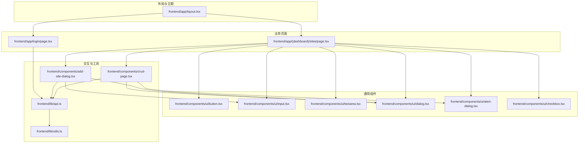
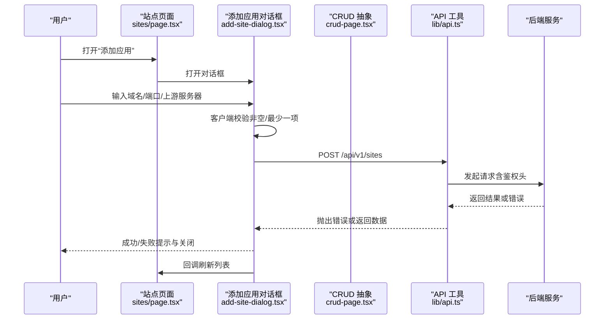
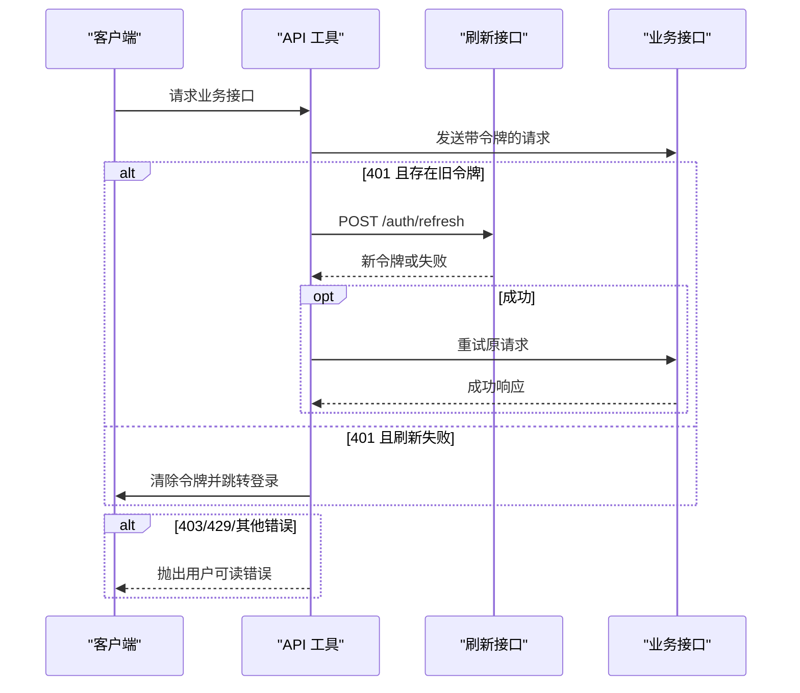
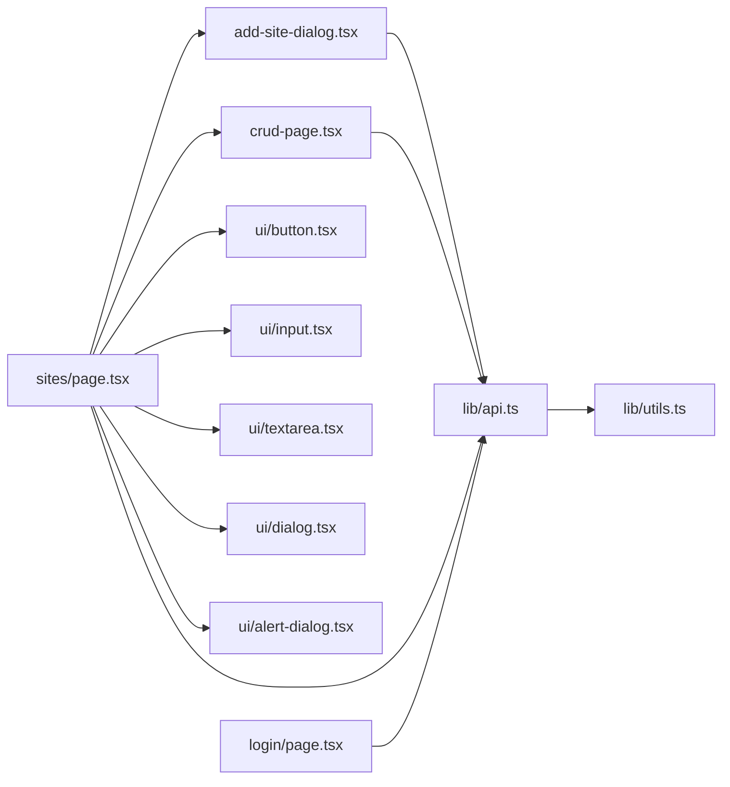

# 用户交互设计

<cite>
**本文引用的文件**
- [frontend/app/layout.tsx](file://frontend/app/layout.tsx)
- [frontend/lib/api.ts](file://frontend/lib/api.ts)
- [frontend/components/crud-page.tsx](file://frontend/components/crud-page.tsx)
- [frontend/components/add-site-dialog.tsx](file://frontend/components/add-site-dialog.tsx)
- [frontend/app/(dashboard)/sites/page.tsx](file://frontend/app/(dashboard)/sites/page.tsx)
- [frontend/app/login/page.tsx](file://frontend/app/login/page.tsx)
- [frontend/components/ui/button.tsx](file://frontend/components/ui/button.tsx)
- [frontend/components/ui/input.tsx](file://frontend/components/ui/input.tsx)
- [frontend/components/ui/dialog.tsx](file://frontend/components/ui/dialog.tsx)
- [frontend/components/ui/alert-dialog.tsx](file://frontend/components/ui/alert-dialog.tsx)
- [frontend/components/ui/textarea.tsx](file://frontend/components/ui/textarea.tsx)
- [frontend/components/ui/checkbox.tsx](file://frontend/components/ui/checkbox.tsx)
- [frontend/lib/utils.ts](file://frontend/lib/utils.ts)
</cite>

## 目录
1. [引言](#引言)
2. [项目结构](#项目结构)
3. [核心组件](#核心组件)
4. [架构总览](#架构总览)
5. [详细组件分析](#详细组件分析)
6. [依赖关系分析](#依赖关系分析)
7. [性能考量](#性能考量)
8. [故障排查指南](#故障排查指南)
9. [结论](#结论)
10. [附录](#附录)

## 引言
本文件聚焦于用户交互设计，系统梳理前端在表单验证、错误处理、加载与空状态、成功反馈、交互模式（拖拽/批量选择/键盘快捷键）、无障碍支持等方面的实现与最佳实践。通过对 CRUD 页面、站点管理页面、登录页以及通用 UI 组件的深入分析，帮助开发者与产品人员理解当前交互体系，并为后续迭代提供参考。

## 项目结构
前端采用 Next.js App Router 结构，布局层负责全局主题与字体注入；业务页面位于 app 下，通用 UI 组件集中在 components/ui；交互逻辑通过自定义组件与工具函数协同完成。

图表来源
- [frontend/app/layout.tsx:1-40](file://frontend/app/layout.tsx#L1-L40)
- [frontend/app/(dashboard)/sites/page.tsx:1-327](file://frontend/app/(dashboard)/sites/page.tsx#L1-L327)
- [frontend/app/login/page.tsx:1-76](file://frontend/app/login/page.tsx#L1-L76)
- [frontend/components/ui/button.tsx:1-68](file://frontend/components/ui/button.tsx#L1-L68)
- [frontend/components/ui/input.tsx:1-20](file://frontend/components/ui/input.tsx#L1-L20)
- [frontend/components/ui/dialog.tsx:1-169](file://frontend/components/ui/dialog.tsx#L1-L169)
- [frontend/components/ui/alert-dialog.tsx:1-200](file://frontend/components/ui/alert-dialog.tsx#L1-L200)
- [frontend/components/ui/textarea.tsx:1-19](file://frontend/components/ui/textarea.tsx#L1-L19)
- [frontend/components/ui/checkbox.tsx:1-34](file://frontend/components/ui/checkbox.tsx#L1-L34)
- [frontend/components/crud-page.tsx:1-358](file://frontend/components/crud-page.tsx#L1-L358)
- [frontend/components/add-site-dialog.tsx:1-254](file://frontend/components/add-site-dialog.tsx#L1-L254)
- [frontend/lib/api.ts:1-115](file://frontend/lib/api.ts#L1-L115)
- [frontend/lib/utils.ts:1-7](file://frontend/lib/utils.ts#L1-L7)

章节来源
- [frontend/app/layout.tsx:1-40](file://frontend/app/layout.tsx#L1-L40)
- [frontend/app/(dashboard)/sites/page.tsx:1-327](file://frontend/app/(dashboard)/sites/page.tsx#L1-L327)
- [frontend/app/login/page.tsx:1-76](file://frontend/app/login/page.tsx#L1-L76)

## 核心组件
- 布局与主题：RootLayout 注入字体与主题提供者，确保全局样式一致性与可访问性基础。
- 通用 UI 组件：按钮、输入框、对话框、确认对话框等，统一了交互语义与视觉反馈。
- 业务页面：站点列表页与登录页，承载主要用户操作流。
- 交互工具：CRUD 页面抽象、站点添加对话框、API 工具与工具函数，支撑一致的交互体验。

章节来源
- [frontend/app/layout.tsx:1-40](file://frontend/app/layout.tsx#L1-L40)
- [frontend/components/ui/button.tsx:1-68](file://frontend/components/ui/button.tsx#L1-L68)
- [frontend/components/ui/input.tsx:1-20](file://frontend/components/ui/input.tsx#L1-L20)
- [frontend/components/ui/dialog.tsx:1-169](file://frontend/components/ui/dialog.tsx#L1-L169)
- [frontend/components/ui/alert-dialog.tsx:1-200](file://frontend/components/ui/alert-dialog.tsx#L1-L200)
- [frontend/components/crud-page.tsx:1-358](file://frontend/components/crud-page.tsx#L1-L358)
- [frontend/components/add-site-dialog.tsx:1-254](file://frontend/components/add-site-dialog.tsx#L1-L254)
- [frontend/lib/api.ts:1-115](file://frontend/lib/api.ts#L1-L115)
- [frontend/lib/utils.ts:1-7](file://frontend/lib/utils.ts#L1-L7)

## 架构总览
下图展示了从用户操作到数据持久化的整体交互路径，涵盖客户端验证、服务器端校验与实时反馈。

图表来源
- [frontend/app/(dashboard)/sites/page.tsx:288-326](file://frontend/app/(dashboard)/sites/page.tsx#L288-L326)
- [frontend/components/add-site-dialog.tsx:67-102](file://frontend/components/add-site-dialog.tsx#L67-L102)
- [frontend/lib/api.ts:31-88](file://frontend/lib/api.ts#L31-L88)

## 详细组件分析

### 表单验证与实时反馈
- 客户端验证
  - 登录页：表单提交时进行字段非空检查，错误通过状态变量显示，避免无效请求。
  - 添加应用对话框：对域名与上游服务器进行即时校验，不符合要求时通过通知组件提示，阻止提交。
  - CRUD 抽象：通过字段定义支持多种输入类型与占位符描述，结合禁用态与加载态提升可用性。
- 服务器端验证
  - API 工具封装统一的错误处理：400 系列错误映射为用户可读信息；401 自动刷新令牌并重试；403 明确权限不足；429 提示请求过于频繁；其他错误统一转换为友好提示。
- 实时反馈
  - 使用通知组件在操作成功或失败时即时反馈。
  - 加载态通过按钮禁用与旋转图标、骨架屏等方式呈现，避免用户重复提交。

章节来源
- [frontend/app/login/page.tsx:18-30](file://frontend/app/login/page.tsx#L18-L30)
- [frontend/components/add-site-dialog.tsx:67-102](file://frontend/components/add-site-dialog.tsx#L67-L102)
- [frontend/components/crud-page.tsx:129-148](file://frontend/components/crud-page.tsx#L129-L148)
- [frontend/lib/api.ts:61-84](file://frontend/lib/api.ts#L61-L84)

### 错误处理策略
- 错误边界与兜底
  - 列表加载失败时以通知提示，避免页面崩溃；对话框打开时异步选项加载失败静默降级为空列表。
  - 登录失败捕获异常并显示错误信息，保持界面稳定。
- 用户友好提示
  - 对话框标题与描述明确操作风险（如删除确认）。
  - 通过颜色与图标传达状态（成功/失败/警告），并提供可点击的关闭按钮。
- 恢复机制
  - 失败后保留用户输入，允许重新尝试。
  - 登录失败时保持表单可编辑，便于用户修正凭据。

章节来源
- [frontend/components/crud-page.tsx:99-109](file://frontend/components/crud-page.tsx#L99-L109)
- [frontend/app/(dashboard)/sites/page.tsx:56-66](file://frontend/app/(dashboard)/sites/page.tsx#L56-L66)
- [frontend/app/login/page.tsx:25-29](file://frontend/app/login/page.tsx#L25-L29)
- [frontend/components/ui/alert-dialog.tsx:102-148](file://frontend/components/ui/alert-dialog.tsx#L102-L148)

### 用户体验优化
- 加载状态
  - 列表页与卡片页使用骨架屏与按钮禁用，减少感知延迟。
  - 对话框内提交按钮带旋转指示，明确后台处理中。
- 空状态处理
  - 无数据时提供简洁提示与引导按钮，降低认知负担。
- 成功反馈
  - 成功操作后通过通知组件提示，并在必要时自动关闭对话框与刷新列表。

章节来源
- [frontend/app/(dashboard)/sites/page.tsx:172-182](file://frontend/app/(dashboard)/sites/page.tsx#L172-L182)
- [frontend/components/ui/dialog.tsx:58-85](file://frontend/components/ui/dialog.tsx#L58-L85)
- [frontend/components/crud-page.tsx:135-139](file://frontend/components/crud-page.tsx#L135-L139)

### 交互模式设计
- 拖拽操作
  - 当前未见拖拽实现，建议在需要排序的场景引入受控列表与可视化拖拽库，保证拖拽过程中的视觉反馈与回退能力。
- 批量选择
  - 通过复选框组件提供单选能力，批量操作可通过顶部工具栏扩展，结合全选/反选与批量动作按钮。
- 键盘快捷键
  - 当前未见专用快捷键实现，建议为常用操作（如回车提交、Esc 关闭）提供键盘支持，提升效率与可访问性。

章节来源
- [frontend/components/ui/checkbox.tsx:9-31](file://frontend/components/ui/checkbox.tsx#L9-L31)

### 无障碍访问支持
- 屏幕阅读器兼容
  - 对话框内容包含隐藏的“关闭”文本，确保读屏器可正确朗读。
  - 输入组件统一设置 data-slot 属性，便于辅助技术识别。
- 键盘导航
  - 按钮与输入框具备焦点可见边框与环形高亮，支持 Tab 导航。
  - 对话框默认焦点管理与 ESC 关闭行为符合常见可访问性预期。

章节来源
- [frontend/components/ui/dialog.tsx:70-82](file://frontend/components/ui/dialog.tsx#L70-L82)
- [frontend/components/ui/button.tsx:44-65](file://frontend/components/ui/button.tsx#L44-L65)
- [frontend/components/ui/input.tsx:5-16](file://frontend/components/ui/input.tsx#L5-L16)

### API 调用与鉴权流程

图表来源
- [frontend/lib/api.ts:16-29](file://frontend/lib/api.ts#L16-L29)
- [frontend/lib/api.ts:48-67](file://frontend/lib/api.ts#L48-L67)
- [frontend/lib/api.ts:69-84](file://frontend/lib/api.ts#L69-L84)

## 依赖关系分析
- 页面依赖通用 UI 组件与交互工具，形成清晰的分层：视图层（页面）→ 交互层（对话框/确认框/CRUD）→ 工具层（API/工具函数）。
- API 工具集中处理鉴权、刷新与错误映射，避免页面分散处理，提升一致性与可维护性。
- 样式工具函数统一类名合并与覆盖，减少样式冲突。

图表来源
- [frontend/app/(dashboard)/sites/page.tsx:1-327](file://frontend/app/(dashboard)/sites/page.tsx#L1-L327)
- [frontend/components/add-site-dialog.tsx:1-254](file://frontend/components/add-site-dialog.tsx#L1-L254)
- [frontend/components/crud-page.tsx:1-358](file://frontend/components/crud-page.tsx#L1-L358)
- [frontend/components/ui/button.tsx:1-68](file://frontend/components/ui/button.tsx#L1-L68)
- [frontend/components/ui/input.tsx:1-20](file://frontend/components/ui/input.tsx#L1-L20)
- [frontend/components/ui/textarea.tsx:1-19](file://frontend/components/ui/textarea.tsx#L1-L19)
- [frontend/components/ui/dialog.tsx:1-169](file://frontend/components/ui/dialog.tsx#L1-L169)
- [frontend/components/ui/alert-dialog.tsx:1-200](file://frontend/components/ui/alert-dialog.tsx#L1-L200)
- [frontend/app/login/page.tsx:1-76](file://frontend/app/login/page.tsx#L1-L76)
- [frontend/lib/api.ts:1-115](file://frontend/lib/api.ts#L1-L115)
- [frontend/lib/utils.ts:1-7](file://frontend/lib/utils.ts#L1-L7)

## 性能考量
- 骨架屏与懒加载：在大量数据或远程选项加载时使用骨架屏，减少白屏时间与布局抖动。
- 请求去抖与节流：对频繁触发的输入（如搜索）建议增加防抖，避免不必要的网络请求。
- 缓存策略：对静态或低频变更的数据（如证书列表）可引入本地缓存，减少重复请求。
- 体积优化：按需引入组件与样式，避免一次性加载过多资源。

## 故障排查指南
- 登录失败
  - 现象：登录按钮禁用，出现错误提示。
  - 排查：检查凭据是否正确；查看浏览器网络面板确认 401/403/429 等错误码与后端返回信息。
- 操作失败
  - 现象：提交后弹出错误提示，但页面未刷新。
  - 排查：确认网络连通性与令牌有效性；若为 401，检查刷新流程是否正常执行。
- 删除确认
  - 现象：删除后未立即消失。
  - 排查：确认删除成功回调是否触发列表刷新；检查后端返回状态码与前端错误处理分支。

章节来源
- [frontend/app/login/page.tsx:25-29](file://frontend/app/login/page.tsx#L25-L29)
- [frontend/lib/api.ts:69-84](file://frontend/lib/api.ts#L69-L84)
- [frontend/app/(dashboard)/sites/page.tsx:92-102](file://frontend/app/(dashboard)/sites/page.tsx#L92-L102)

## 结论
该前端交互体系以统一的 UI 组件与 API 工具为基础，实现了较为完善的客户端验证、服务器端错误映射与实时反馈。在加载与空状态处理、成功提示方面表现良好。建议后续在拖拽、批量选择与键盘快捷键方面增强交互效率，并完善可访问性细节（如更丰富的 ARIA 语义与键盘导航）。通过持续优化与规范沉淀，可进一步提升整体用户体验与可维护性。

## 附录
- 最佳实践清单
  - 表单：必填项即时校验，错误信息明确；提交时禁用按钮并显示加载态。
  - 错误：统一错误映射与提示文案；区分业务错误与系统错误。
  - 反馈：成功与失败均给出明确提示；提供可操作的后续步骤。
  - 可访问性：为所有交互元素提供键盘可达性与读屏器友好标签。
  - 性能：合理使用骨架屏与缓存；避免重复渲染与无效请求。